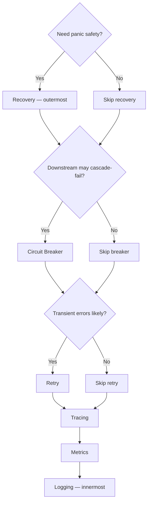

# Dispatch Middleware Ordering

> How to correctly order go-cqrs-lite dispatch middleware when composing with cqrs-htmx.
>
> **Audience:** application developers wiring `middleware.Command*` / `middleware.Query*` factories onto a cqrs-htmx dispatcher.

Middleware is registered outer-to-inner: the **first** `Use(...)` call wraps everything that comes after it. Getting the order wrong means retries can't see panics recovered by recovery, circuit breakers won't see retried failures, or tracing spans won't cover retry attempts.

## The 5 ordering rules

### 1. Recovery is always outermost

```go
cmdDisp.Use(middleware.CommandRecovery())  // wraps everything below
```

If recovery is not outermost, a panic in the command handler propagates past retry/circuit-breaker logic and crashes the HTTP handler (or triggers `cqrshtmx.RecoveryMiddleware` instead — which produces a less specific error).

### 2. Circuit breaker sits inside recovery, outside retry

```go
cmdDisp.Use(middleware.CommandCircuitBreaker(middleware.DefaultCircuitBreakerConfig()))
```

The breaker counts failures across retry attempts, not per attempt. Placing it outside retry means a single failed command (with 3 retries) counts as 3 failures toward the breaker threshold — too aggressive. Placing it inside retry means the breaker state isn't checked before retrying.

### 3. Retry sits inside the circuit breaker

```go
cmdDisp.Use(middleware.CommandRetry(middleware.DefaultRetryConfig(), middleware.WithLogger(logger)))
```

Retry handles transient failures (503-class) by re-dispatching. It must be inside the circuit breaker so the breaker can short-circuit before retry burns through all attempts when the downstream is hard-down.

### 4. Tracing is inner (covers the actual handler call)

```go
cmdDisp.Use(middleware.CommandTracing(tracer))
```

The tracing span should wrap the actual command execution, not the retry/circuit-breaker machinery. Placing it outer means a single span covers all retry attempts — useful for some tracing backends, but most consumers want per-attempt spans.

### 5. Logging is innermost (one entry per dispatch attempt)

```go
cmdDisp.Use(middleware.CommandLogging(logger))
```

Logging should fire on every dispatch attempt (including retries), so it sits closest to the handler.

## Recommended order (canonical)

```go
cmdDisp.Use(middleware.CommandRecovery())                                    // 1. outermost — catches panics
cmdDisp.Use(middleware.CommandCircuitBreaker(middleware.DefaultCircuitBreakerConfig())) // 2. fail-fast on cascading failures
cmdDisp.Use(middleware.CommandRetry(middleware.DefaultRetryConfig(), middleware.WithLogger(logger))) // 3. retry transient failures
cmdDisp.Use(middleware.CommandTracing(tracer))                               // 4. per-attempt spans
cmdDisp.Use(middleware.CommandTypedMetrics(metricsRecorder))                 // 5. per-attempt metrics
cmdDisp.Use(middleware.CommandLogging(logger))                               // 6. innermost — log each attempt
```

## Decision flowchart



## Anti-patterns

### Retry outside recovery — unrecovered panics

```go
// WRONG: retry wraps recovery. A panic in the handler is caught by recovery,
// converted to an error, then retried — even though panics are not transient.
cmdDisp.Use(middleware.CommandRetry(...))
cmdDisp.Use(middleware.CommandRecovery())  // too late — retry already ran
```

### Logging outside retry — missing retry log lines

```go
// WRONG: logging wraps retry. You get ONE log line for the entire retry
// sequence, not one per attempt.
cmdDisp.Use(middleware.CommandLogging(logger))
cmdDisp.Use(middleware.CommandRetry(...))  // retries happen inside the log span
```

### Metrics outside circuit breaker — inflated counts

```go
// WRONG: metrics wraps the breaker. Open-circuit errors count toward your
// error rate even though the breaker is intentionally failing fast.
cmdDisp.Use(middleware.CommandTypedMetrics(recorder))
cmdDisp.Use(middleware.CommandCircuitBreaker(...))
```

## Two recovery layers

cqrs-htmx has **two** recovery layers that serve different purposes:

| Layer    | Middleware                     | Catches                                               |
| -------- | ------------------------------ | ----------------------------------------------------- |
| HTTP     | `cqrshtmx.RecoveryMiddleware`  | Panics in HTTP handler, JSON decode, response writing |
| Dispatch | `middleware.CommandRecovery()` | Panics in command handler, domain logic               |

Both are needed. They catch panics at different call sites in the request lifecycle. See [leveraging-go-cqrs-lite.md](leveraging-go-cqrs-lite.md) §1 for the full explanation.

## See also

- [Leveraging go-cqrs-lite](leveraging-go-cqrs-lite.md) — full adoption map
- `examples/middleware-demo/` — runnable proof with recovery + retry + circuit breaker + logging
- `examples/observability-demo/` — adds tracing + Prometheus metrics to the stack
