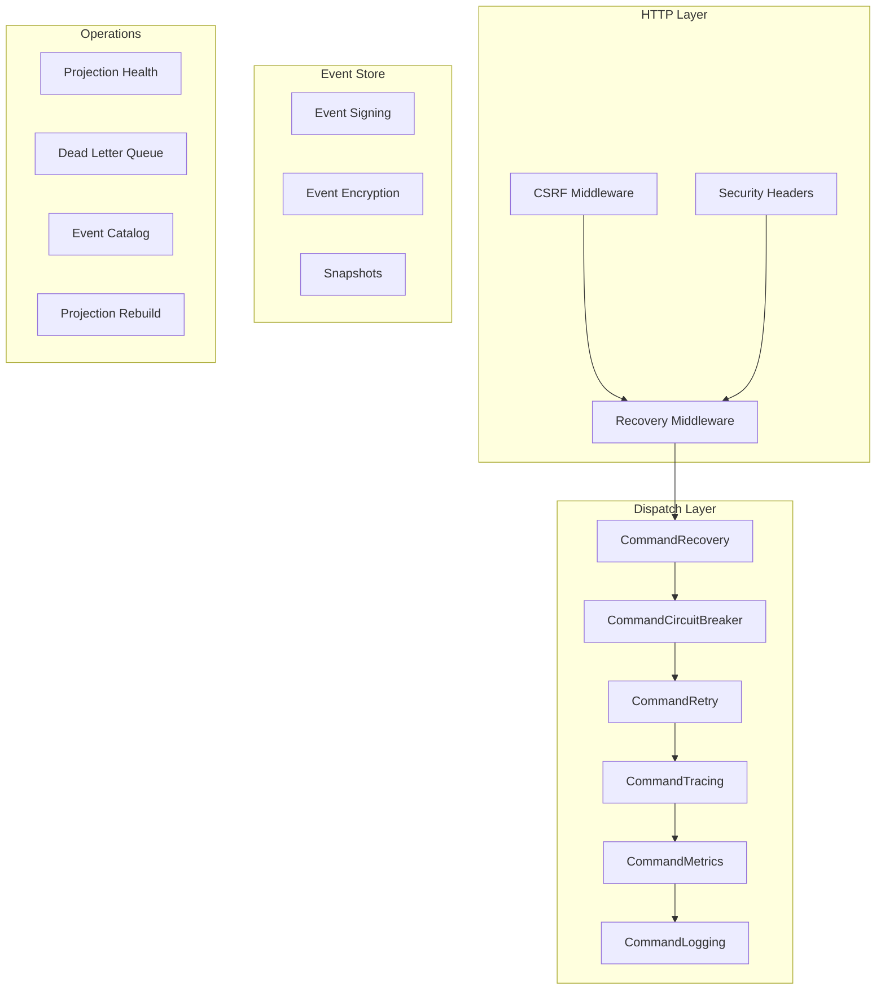

# Production Readiness Guide

> A single checklist for taking a cqrs-htmx application to production.
>
> **Audience:** developers preparing to deploy cqrs-htmx-based apps. Each item links to the detailed guide or example.

---

## What "Production-Ready" Means

A production cqrs-htmx app must handle: transient failures (retry), cascading failures (circuit breaker), observability (tracing + metrics), security (CSRF + signing + encryption), and operational recovery (projection rebuild, DLQ replay). This guide links every hardening topic.

## The Production Hardening Stack



## Checklist

### 1. Dispatch Resilience

- [ ] **Wire recovery middleware** — `middleware.CommandRecovery()` prevents panics from crashing requests
- [ ] **Wire retry middleware** — `middleware.CommandRetry(middleware.DefaultRetryConfig())` handles transient (503-class) failures
- [ ] **Wire circuit breaker** — `middleware.CommandCircuitBreaker(middleware.DefaultCircuitBreakerConfig())` stops cascading failures
- [ ] **Check middleware ordering** — see [Dispatch Middleware Ordering](dispatch-middleware-ordering.md)
- [ ] **Runnable proof** — `examples/middleware-demo/` shows the full stack working

### 2. Observability

- [ ] **OTel tracing** — `cqrsotel.Setup()` + `middleware.CommandTracing(tracer)` for per-command spans
- [ ] **Prometheus metrics** — `cqrsprom.Setup()` + `middleware.CommandTypedMetrics(recorder)` for `/metrics`
- [ ] **Override global meter provider** — `otel.SetMeterProvider(promProvider.AsMeterProvider())` so metrics export to Prometheus
- [ ] **Runnable proof** — `examples/observability-demo/` shows the full observability stack
- [ ] **See** [leveraging-go-cqrs-lite](leveraging-go-cqrs-lite.md) §2

### 3. Event Security

- [ ] **Event signing** — `signing.SignMiddleware(signer)` on publish, `signing.VerifyMiddleware(verifier)` on handle (HMAC-SHA256 or Ed25519)
- [ ] **Event encryption** — `encryption.NewEncryptedStore(store, cipher)` for at-rest encryption (AES-256-GCM)
- [ ] **See** [leveraging-go-cqrs-lite](leveraging-go-cqrs-lite.md) §4 and `integration_test/signing_encryption_test.go`

### 4. CSRF Protection

- [ ] **Wire CSRF middleware** — `httputil.CSRFMiddleware(httputil.CSRFConfig{})` (opt-in, not enforced by default). The `cqrshtmx.CSRF*` aliases are deprecated re-exports over httputil.
- [ ] **Ordering** — `Chain(httputil.CSRFMiddleware(...), HTMXMiddleware, app.Middleware())` — CSRF first
- [ ] **See** `docs/guides/csrf-trusted-proxies.md` and `docs/guides/leveraging-httputil.md` (re-export migration table)

### 5. Projection Health

- [ ] **Monitor projection lag** — `cqrshtmx.ProjectionStatusHandler(provider)` serves live projection status
- [ ] **Wire DLQ** — projectionhost's dead-letter queue captures failed events for replay
- [ ] **See** `docs/guides/projection-health-monitoring.md`

### 6. Operational Recovery

- [ ] **Projection rebuild** — `svc.RebuildProjection(ctx, name)` stops host, resets, replays journal
- [ ] **See** `docs/guides/rebuild-projection-runbook.md` and `docs/guides/event-replay-and-rebuild.md`

### 7. Performance (Optional)

- [ ] **Decider state cache** — `decider.WithStateCache[State](decider.NewStateCache(256))` eliminates full event replay on every `Execute`
- [ ] **Snapshots** — `SnapshotConfig{Store, Codec, Strategy}` for large aggregates (opt-in, v4.2.x+)
- [ ] **See** ROADMAP.md "Perf" section for evaluation details

### 8. Documentation

- [ ] **Event catalog** — `cqrshtmx.EventCatalogHandler(catalog)` serves immutable event schemas
- [ ] **API docs** — `openapi.OpenAPISpecHandler(spec)` or `catalog/v4/docserver` for OpenAPI/AsyncAPI
- [ ] **See** `docs/guides/event-catalog-guide.md`

## Quick-Start Template

```go
func main() {
    // 1. Observability
    otelProvider, _ := cqrsotel.Setup(
        cqrsotel.WithService("my-app", "1.0.0", "local"),
        cqrsotel.WithStdoutExporter(os.Stdout),
    )
    defer otelProvider.Shutdown(context.Background())

    promProvider, _ := cqrsprom.Setup(cqrsprom.WithViews(cqrsotel.NewCQRSViews()...))
    defer promProvider.Shutdown(context.Background())
    otel.SetMeterProvider(promProvider.AsMeterProvider())

    tracer := cqrsotel.NewTracer("my-app")
    meter := cqrsotel.NewMeter("my-app")
    recorder, _ := middleware.NewOTelMetricsRecorder(meter)

    // 2. Dispatch middleware (ordered outer-to-inner)
    cmdDisp := command.NewDispatcher()
    cmdDisp.Use(middleware.CommandRecovery())
    cmdDisp.Use(middleware.CommandCircuitBreaker(middleware.DefaultCircuitBreakerConfig()))
    cmdDisp.Use(middleware.CommandRetry(middleware.DefaultRetryConfig(), middleware.WithLogger(logger)))
    cmdDisp.Use(middleware.CommandTracing(tracer))
    cmdDisp.Use(middleware.CommandTypedMetrics(recorder))
    cmdDisp.Use(middleware.CommandLogging(logger))

    // 3. Build app
    app := cqrshtmx.MustNew(cqrshtmx.Config{Commands: cmdDisp})

    // 4. HTTP middleware stack
    mux := http.NewServeMux()
    mux.Handle("GET /metrics", promProvider.Handler())
    // ...your routes...

    handler := cqrshtmx.Chain(
        cqrshtmx.RecoveryMiddleware,
        httputil.SecurityHeaders(httputil.DefaultSecurityHeadersConfig()),
        httputil.CSRFMiddleware(httputil.CSRFConfig{}),
    )(mux)

    http.ListenAndServe(":8080", handler)
}
```

## See also

- [Leveraging go-cqrs-lite](leveraging-go-cqrs-lite.md) — full adoption map
- [Dispatch Middleware Ordering](dispatch-middleware-ordering.md) — correct middleware stacking
- `examples/middleware-demo/` — resilience middleware proof
- `examples/observability-demo/` — tracing + metrics proof
