# Execution Plan — cqrs-htmx v1.0.0 Release Readiness

**Date:** 2026-05-16 23:36 | **Git:** `af6b09a` on `master` | **Mode:** READ → UNDERSTAND → RESEARCH → REFLECT → EXECUTE

---

## Deep Architectural Review — Critical Findings

### What I Found After Reading Every File

1. **Dead exports polluting the API** — `ErrNoUserID`, `ErrRendererMissing` exported but never returned. `DefaultNotificationEvent` deprecated but still exported (race risk). `ErrCommandsNil`, `ErrQueriesNil`, `ErrDecoderMissing` — internal handler errors that consumers can't act on (they get HTTP responses, not CQRS errors).

2. **Notification level is a string, not a type** — `"success"`, `"error"`, `"warning"`, `"info"` are magic strings scattered across `notify.go` and `response.go`. This should be a typed enum. Same for `"X-Correlation-ID"` hardcoded in `middleware.go:16`.

3. **`handlerConfig` has split brains** — `authorize bool` + `requireAuth bool` + `resource string` + `action string` are 4 fields encoding what is really one authorization mode: none, require-auth-only, or full-authorize. Three states, four fields. Invalid combinations are representable (e.g., `authorize=false, requireAuth=true, resource="users"` — the resource/action are silently ignored).

4. **`headerTrue` + `HeaderTrue` duplication** — `htmx.go:37-41` defines both exported `HeaderTrue` and unexported `headerTrue` pointing at the same value. The unexported one is used everywhere internally. The exported one is for consumers. This is a confusing alias with no real benefit — just use `HeaderTrue` everywhere.

5. **7 standalone HTMX accessors duplicate context lookup** — `HTMXTarget`, `HTMXTrigger`, `HTMXTriggerName`, `HTMXPrompt`, `HTMXCurrentURL`, `IsBoosted`, `IsHistoryRestore` each do the same `HTMXFromContext` → fallback-to-header pattern. Consumers using `HTMXMiddleware` never need the fallback path. These 7 exports exist solely for consumers who don't use the middleware.

6. **`JSONErrorHandler` ignores `Config.LoginRedirect`** — `errors.go:123` hardcodes `defaultLoginRedirect` instead of using the per-App redirect. If a consumer sets `Config.LoginRedirect = "/auth/signin"`, `JSONErrorHandler` still redirects to `/login`. The plain text handler respects it.

7. **`options.go` at 331 lines** — approaching the 370-line limit but includes decoders, validators, authorization helpers, HTMX response application, and form parsing. Mixed responsibilities.

8. **Pre-commit hook not executable** — `.git/hooks/pre-commit` is silently skipped.

---

## Pareto Breakdown

### The 1% that delivers 51% of the result

**Remove dead exports + fix `JSONErrorHandler` login redirect.** These are the only things that could cause a consumer a real problem: importing a sentinel that's never returned (confusing), or using `JSONErrorHandler` and getting wrong redirect behavior. Everything else is polish.

### The 4% that delivers 64% of the result

**Add `NotificationLevel` type + remove `headerTrue` alias + consolidate `handlerConfig` auth into a typed state.** These three changes make impossible states unrepresentable — the core of type-safe design. They also reduce the export surface meaningfully.

### The 20% that delivers 80% of the result

**CI/CD pipeline + remove dead sentinels + unexport standalone HTMX accessors + tag v1.0.0.** The full release readiness package: automated gates, clean API, version tag.

---

## Step 2: Comprehensive Plan (Medium Granularity, 30-100min each)

| # | Task | Impact | Effort | Type |
|---|---|---|---|---|
| 1 | Remove dead sentinels (`ErrNoUserID`, `ErrRendererMissing`) + update tests | HIGH | 30min | API cleanup |
| 2 | Unexport internal sentinels (`ErrCommandsNil`, `ErrQueriesNil`, `ErrDecoderMissing`) | HIGH | 45min | API cleanup |
| 3 | Remove deprecated `DefaultNotificationEvent` export | MED | 30min | API cleanup |
| 4 | Add `NotificationLevel` type (enum: Success, Error, Warning, Info) | MED | 45min | Type safety |
| 5 | Consolidate auth config into typed state (None/AuthOnly/Authorize) | MED | 60min | Type safety |
| 6 | Remove `headerTrue` alias, use `HeaderTrue` everywhere | LOW | 15min | Cleanup |
| 7 | Fix `JSONErrorHandler` to use per-App `LoginRedirect` | HIGH | 45min | Bug fix |
| 8 | Extract `"X-Correlation-ID"` to constant | LOW | 10min | Cleanup |
| 9 | Unexport standalone HTMX accessors (7 functions) | MED | 30min | API cleanup |
| 10 | Split `options.go` — extract form decoding to `decode_form.go` | MED | 30min | File organization |
| 11 | Add GitHub Actions CI (build + test + lint + coverage) | HIGH | 60min | Infrastructure |
| 12 | Update all documentation (AGENTS.md, FEATURES.md, TODO_LIST.md, CHANGELOG.md, CONTRIBUTING.md) | MED | 45min | Documentation |
| 13 | Tag v1.0.0 | HIGH | 5min | Release |
| 14 | Make repo public | HIGH | 1min | Release |

---

## Step 3: Detailed Breakdown (Fine Granularity, max 15min each)

### Phase 1: Dead Code Removal (51% impact)

| # | Task | Est |
|---|---|---|
| 1.1 | Remove `ErrNoUserId` sentinel from `errors.go` | 2min |
| 1.2 | Remove `ErrRendererMissing` sentinel from `errors.go` | 2min |
| 1.3 | Remove their `event.RegisterClassification` calls | 2min |
| 1.4 | Remove deprecated `DefaultNotificationEvent` var from `notify.go` | 2min |
| 1.5 | Search all test files for references to removed exports | 5min |
| 1.6 | Run tests, fix any compilation errors | 5min |

### Phase 2: Internal Sentinel Unexport (breaking-adjacent)

| # | Task | Est |
|---|---|---|
| 2.1 | Unexport `ErrCommandsNil` → `errCommandsNil` in `errors.go` | 2min |
| 2.2 | Unexport `ErrQueriesNil` → `errQueriesNil` in `errors.go` | 2min |
| 2.3 | Unexport `ErrDecoderMissing` → `errDecoderMissing` in `errors.go` | 2min |
| 2.4 | Update all internal references in `handler.go`, `app.go` | 3min |
| 2.5 | Search and update all test file references | 5min |
| 2.6 | Run tests, fix compilation errors | 5min |

### Phase 3: Bug Fix — JSONErrorHandler LoginRedirect

| # | Task | Est |
|---|---|---|
| 3.1 | Add `loginRedirect string` param to `JSONErrorHandler` or create `JSONErrorHandlerWithRedirect` | 10min |
| 3.2 | Thread `Config.LoginRedirect` through to JSON error handler in `app.go` `New()` | 5min |
| 3.3 | Add test for custom redirect path with `JSONErrorHandler` | 10min |
| 3.4 | Run tests | 2min |

### Phase 4: Type Safety — NotificationLevel

| # | Task | Est |
|---|---|---|
| 4.1 | Define `NotificationLevel` type with `Success`, `Error`, `Warning`, `Info` constants in `notify.go` | 5min |
| 4.2 | Update `notifyOption` to use `NotificationLevel` instead of string | 3min |
| 4.3 | Update `Response.triggerNotification` to use `NotificationLevel` | 3min |
| 4.4 | Update all test assertions | 5min |
| 4.5 | Run tests | 2min |

### Phase 5: Type Safety — Auth Config Consolidation

| # | Task | Est |
|---|---|---|
| 5.1 | Define `authMode` type with `authNone`, `authRequired`, `authAuthorized` constants | 5min |
| 5.2 | Replace `authorize bool` + `requireAuth bool` + `resource string` + `action string` with `authMode` + `resource` + `action` in `handlerConfig` | 10min |
| 5.3 | Update `Authorize()` and `RequireAuth()` HandlerOptions | 5min |
| 5.4 | Update `executeAuthorization()` in `options.go` | 10min |
| 5.5 | Update all auth-related tests | 10min |
| 5.6 | Run tests | 2min |

### Phase 6: Minor Cleanups

| # | Task | Est |
|---|---|---|
| 6.1 | Remove `headerTrue` alias — use `HeaderTrue` everywhere in `htmx.go`, `response.go`, `errors.go` | 5min |
| 6.2 | Extract `headerCorrelationID = "X-Correlation-ID"` constant in `middleware.go` | 3min |
| 6.3 | Unexport standalone HTMX accessors (7 functions → unexported) | 10min |
| 6.4 | Update all test files referencing unexported accessors | 10min |
| 6.5 | Run tests | 2min |

### Phase 7: File Organization

| # | Task | Est |
|---|---|---|
| 7.1 | Extract form decoding helpers (`decodeFormBody`, `decodeFormValues`) from `options.go` to `decode_form.go` | 5min |
| 7.2 | Extract `executeAuthorization`, `applyHTMXResponse` from `options.go` to `handler.go` or new `authz_handler.go` | 10min |
| 7.3 | Verify all files under 370 lines | 5min |
| 7.4 | Run tests + lint | 5min |

### Phase 8: CI/CD

| # | Task | Est |
|---|---|---|
| 8.1 | Create `.github/workflows/ci.yml` — Go build, test (race), lint, coverage | 15min |
| 8.2 | Add coverage threshold gate (fail if < 95%) | 5min |
| 8.3 | Verify CI runs correctly on push | 5min |

### Phase 9: Documentation

| # | Task | Est |
|---|---|---|
| 9.1 | Update `CHANGELOG.md` unreleased section with all changes | 10min |
| 9.2 | Update `AGENTS.md` with all new gotchas and export changes | 10min |
| 9.3 | Update `FEATURES.md` metrics | 5min |
| 9.4 | Update `TODO_LIST.md` — mark all done | 5min |
| 9.5 | Update `CONTRIBUTING.md` with new API patterns | 5min |
| 9.6 | Update `README.md` if needed | 5min |

### Phase 10: Release

| # | Task | Est |
|---|---|---|
| 10.1 | Commit all changes with detailed messages | 5min |
| 10.2 | Push to origin/master | 2min |
| 10.3 | Wait for CI green | 5min |
| 10.4 | Tag v1.0.0 | 2min |
| 10.5 | Make repo public | 1min |

---

## Execution Graph

```mermaid
graph TD
    subgraph "Phase 1: Dead Code (51% impact)"
        A[1.1 Remove ErrNoUserID] --> B[1.2 Remove ErrRendererMissing]
        B --> C[1.3 Remove DefaultNotificationEvent]
        C --> D[1.4 Fix tests]
        D --> E[1.5 Verify green]
    end

    subgraph "Phase 2: Unexport Internals"
        F[2.1 Unexport ErrCommandsNil] --> G[2.2 Unexport ErrQueriesNil]
        G --> H[2.3 Unexport ErrDecoderMissing]
        H --> I[2.4 Fix internal refs]
        I --> J[2.5 Fix test refs]
        J --> K[2.6 Verify green]
    end

    subgraph "Phase 3: Bug Fix"
        L[3.1 JSONErrorHandler redirect] --> M[3.2 Thread loginRedirect]
        M --> N[3.3 Add test]
        N --> O[3.4 Verify green]
    end

    subgraph "Phase 4: NotificationLevel Type"
        P[4.1 Define type] --> Q[4.2 Update notifyOption]
        Q --> R[4.3 Update Response]
        R --> S[4.4 Update tests]
        S --> T[4.5 Verify green]
    end

    subgraph "Phase 5: Auth Config Type"
        U[5.1 Define authMode] --> V[5.2 Update handlerConfig]
        V --> W[5.3 Update HandlerOptions]
        W --> X[5.4 Update executeAuthorization]
        X --> Y[5.5 Update tests]
        Y --> Z[5.6 Verify green]
    end

    subgraph "Phase 6: Minor Cleanups"
        AA[6.1 Remove headerTrue alias] --> AB[6.2 CorrelationID constant]
        AB --> AC[6.3 Unexport HTMX accessors]
        AC --> AD[6.4 Fix test refs]
        AD --> AE[6.5 Verify green]
    end

    subgraph "Phase 7: File Organization"
        AF[7.1 Extract decode_form.go] --> AG[7.2 Move auth helpers]
        AG --> AH[7.3 Verify file sizes]
        AH --> AI[7.4 Verify green]
    end

    subgraph "Phase 8: CI/CD"
        AJ[8.1 Create ci.yml] --> AK[8.2 Coverage gate]
        AK --> AL[8.3 Verify CI]
    end

    subgraph "Phase 9: Documentation"
        AM[9.1 CHANGELOG] --> AN[9.2 AGENTS.md]
        AN --> AO[9.3 FEATURES.md]
        AO --> AP[9.4 TODO_LIST.md]
        AP --> AQ[9.5 CONTRIBUTING.md]
        AQ --> AR[9.6 README.md]
    end

    subgraph "Phase 10: Release"
        AS[10.1 Commit] --> AT[10.2 Push]
        AT --> AU[10.3 CI green]
        AU --> AV[10.4 Tag v1.0.0]
        AV --> AW[10.5 Make public]
    end

    E --> F
    K --> L
    O --> P
    T --> U
    Z --> AA
    AE --> AF
    AI --> AJ
    AL --> AM
    AR --> AS
```

---

## Dependencies & Risk

- **Phases 1-2 are pure removal** — low risk, but breaking for consumers who reference removed exports. Since we haven't tagged v1.0.0 yet, this is fine.
- **Phase 5 (auth config) is the riskiest change** — touches `handlerConfig`, `Authorize()`, `RequireAuth()`, `executeAuthorization()`, and all auth tests. Must be done carefully with test-first approach.
- **Phases 6.3 (unexport HTMX accessors) is breaking** — consumers using `HTMXTarget(r)` etc. directly would need to use `HTMXFromContext(r.Context()).Target` instead. Worth it for API surface reduction, but must document in CHANGELOG.
- **Phase 3 (JSONErrorHandler fix) requires design decision** — either add a `JSONErrorHandlerWithRedirect` parallel to `DefaultErrorHandlerWithRedirect`, or change `JSONErrorHandler` to accept a redirect parameter. The latter changes the function signature (breaking). Recommend: `JSONErrorHandlerWithRedirect`.

## Total Estimated Time

- Phase 1: 18min
- Phase 2: 19min
- Phase 3: 27min
- Phase 4: 18min
- Phase 5: 42min
- Phase 6: 30min
- Phase 7: 25min
- Phase 8: 25min
- Phase 9: 40min
- Phase 10: 15min
- **Total: ~260min (~4.3 hours)**
