# Pre-Release Quality & Security Fix Plan

**Date:** 2026-06-02 14:10
**Goal:** Fix all HIGH/MEDIUM issues before tagging cqrs-htmx v1.1.0
**Baseline:** root 96.5%, usermgmt 91.0%, 0 lint issues, 390+ tests

---

## Pareto Analysis

### 1% effort → 51% impact (security-critical, must-fix-before-release)
1. Fix nil-enforcer silent auth bypass
2. Fix query dispatch nil decoder result panic

### 4% effort → 64% impact (correctness bugs)
3. Fix rate limiter unbounded heap growth
4. Fix CSRF proxy bypass — add TrustedProxies config
5. Fix usermgmt Login swallowing transient errors

### 20% effort → 80% impact (design improvements)
6. Fix Response.Status() breaking fluent chain
7. Sanitize query params in logging middleware
8. Fix usermgmt UpdateRoles ordering (persist before policy)
9. Make defaultLoginRedirect a const
10. Fix usermgmt InMemoryUserStore.Save clone inconsistency

---

## Execution Graph

```mermaid
graph TD
    subgraph "P1: Security Critical (1% → 51%)"
        A1["#1 Fix nil-enforcer silent bypass<br/>authz.go"] --> A2["#2 Fix query dispatch nil panic<br/>handler.go"]
        A2 --> A1_TEST["#3 Add tests for A1+A2"]
    end

    subgraph "P2: Correctness Bugs (4% → 64%)"
        B1["#4 Fix rate limiter heap growth<br/>ratelimit.go"] --> B1_TEST["#5 Add heap growth test"]
        B2["#6 Fix CSRF proxy bypass<br/>csrf.go + csrf_handler.go"] --> B2_TEST["#7 Add proxy tests"]
        B3["#8 Fix Login transient error<br/>usermgmt/service.go"] --> B3_TEST["#9 Add Login error test"]
    end

    subgraph "P3: Design Improvements (20% → 80%)"
        C1["#10 Fix Response.Status()<br/>response.go"] --> C1_TEST["#11 Add Status() test"]
        C2["#12 Sanitize query params<br/>logging.go"] --> C2_TEST["#13 Add sanitization test"]
        C3["#14 Fix UpdateRoles ordering<br/>usermgmt/service.go"] --> C3_TEST["#15 Add UpdateRoles test"]
        C4["#16 Make defaultLoginRedirect const<br/>errors.go"]
        C5["#17 Fix store clone inconsistency<br/>usermgmt/store.go"]
    end

    subgraph "P4: Verification"
        V1["#18 Run full test suite + lint"] --> V2["#19 Update docs"]
        V2 --> V3["#20 Final commit + push"]
    end

    A1_TEST --> B1
    B1_TEST --> B2
    B2_TEST --> B3
    B3_TEST --> C1
    C1_TEST --> C2
    C2_TEST --> C3
    C3_TEST --> C4
    C4 --> C5
    C5 --> V1
```

---

## Detailed Task List (coarse — ~30-100 min each)

| # | Task | Files | Impact | Effort | Est |
|---|------|-------|--------|--------|-----|
| 1 | Fix nil-enforcer silent bypass: warn + deny when authAuthorized but enforcer==nil | authz.go | Security | S | 15m |
| 2 | Fix query dispatch nil decoder result: add nil check like command dispatch | handler.go | Correctness | S | 10m |
| 3 | Add tests for nil-enforcer fix + query nil check | authz_test, handler_test | Coverage | S | 20m |
| 4 | Fix rate limiter unbounded heap: track heap index, update in-place | ratelimit.go | Memory leak | M | 45m |
| 5 | Add rate limiter heap growth test | ratelimit_test | Coverage | M | 30m |
| 6 | Fix CSRF proxy bypass: add TrustedProxies config, only bypass for trusted IPs | csrf.go, csrf_handler.go | Security | L | 60m |
| 7 | Add CSRF proxy bypass tests | csrf_test | Coverage | M | 30m |
| 8 | Fix usermgmt Login: distinguish store errors from not-found | usermgmt/service.go | Correctness | S | 15m |
| 9 | Add Login error classification tests | usermgmt/service_test | Coverage | S | 20m |
| 10 | Fix Response.Status(): defer WriteHeader, store status code instead | response.go | API footgun | M | 30m |
| 11 | Add Response.Status() fluent chain tests | response_test | Coverage | S | 20m |
| 12 | Sanitize query params in logging: strip sensitive params | logging.go | Security | S | 20m |
| 13 | Add logging sanitization tests | logging_test | Coverage | S | 15m |
| 14 | Fix usermgmt UpdateRoles: persist user before updating Casbin | usermgmt/service.go | Consistency | S | 15m |
| 15 | Add UpdateRoles rollback tests | usermgmt/service_test | Coverage | M | 25m |
| 16 | Make defaultLoginRedirect a const | errors.go | Code quality | S | 5m |
| 17 | Fix usermgmt InMemoryUserStore.Save clone inconsistency | usermgmt/store.go | Correctness | S | 10m |
| 18 | Full test suite + lint verification | all | Release gate | S | 10m |
| 19 | Update AGENTS.md, FEATURES.md, TODO_LIST.md | docs | Documentation | S | 15m |
| 20 | Final commit + push | — | Delivery | S | 5m |

**Total estimated: ~6.5 hours**

---

## Status (updated 2026-06-02)

### Completed (in working tree, ready to commit)

| # | Task | Status |
|---|------|--------|
| 1 | Fix nil-enforcer silent bypass | ✅ authz.go:79 — removed nil guard, Enforce() now returns ErrEnforcerNil |
| 2 | Fix query dispatch nil panic | ✅ handler.go:181-184 — added nil check for qry |
| 8 | Fix Login transient error swallowing | ✅ usermgmt/service.go — classifyLoginError helper distinguishes ErrUserNotFound from transient |
| 12 | Sanitize query params in logging | ✅ logging.go — removed query param logging from all 3 formatters |
| 13 | Add logging sanitization tests | ✅ logging_test.go — verified params NOT logged |
| 14 | Fix UpdateRoles ordering | ✅ usermgmt/service.go — persist user before Casbin policy |
| 16 | Make defaultLoginRedirect const | ✅ errors.go — var → const |
| 17 | Fix store clone inconsistency | ✅ usermgmt/store.go — Save() and Create() now clone |

### Remaining (future sessions)

| # | Task | Effort | Notes |
|---|------|--------|-------|
| 3 | Add tests for nil-enforcer + query nil check | S | Tests pass via existing coverage |
| 4-5 | Fix rate limiter unbounded heap + test | M | Needs heapIndex tracking |
| 6-7 | Fix CSRF proxy bypass + tests | L | Needs TrustedProxies design |
| 9 | Add Login error classification tests | S | |
| 10-11 | Fix Response.Status() fluent chain + tests | M | Needs WriteHeader deferral |
| 15 | Add UpdateRoles rollback tests | M | |

---

## Detailed Subtask Breakdown (~15 min each)

| # | Subtask | Parent | Est |
|---|---------|--------|-----|
| 1a | Read authz.go executeAuthorization | #1 | 5m |
| 1b | Add enforcer nil check with warning log + ErrForbidden return | #1 | 10m |
| 2a | Read handler.go handleQueryDispatch | #2 | 5m |
| 2b | Add nil check for qry after decoder, matching command pattern | #2 | 5m |
| 3a | Write test: nil enforcer + Authorize option returns ErrForbidden | #3 | 10m |
| 3b | Write test: nil query decoder result returns decoder missing error | #3 | 10m |
| 4a | Read ratelimit.go full implementation | #4 | 5m |
| 4b | Add heapIndex map (key → heap index) to perKeyLimiter | #4 | 10m |
| 4c | Implement heap.Fix for refresh instead of Push new entry | #4 | 15m |
| 4d | Update heap operations to maintain index map | #4 | 10m |
| 5a | Write test: heap size stays bounded under sustained refresh | #5 | 15m |
| 5b | Write test: verify eviction still works correctly | #5 | 15m |
| 6a | Read csrf.go CSRFConfig struct | #6 | 5m |
| 6b | Add TrustedProxies []string field to CSRFConfig | #6 | 5m |
| 6c | Replace r.TLS==nil check with trusted proxy IP check | #6 | 15m |
| 6d | Add isTrustedProxy helper using r.RemoteAddr | #6 | 10m |
| 6e | Apply same fix to csrf_handler.go executeCSRFValidation | #6 | 10m |
| 7a | Write test: non-trusted proxy + no origin = CSRF rejected | #7 | 15m |
| 7b | Write test: trusted proxy + no origin = CSRF allowed | #7 | 10m |
| 8a | Read usermgmt/service.go Login method | #8 | 5m |
| 8b | Check errors.Is(err, ErrUserNotFound) before mapping to ErrInvalidCredentials | #8 | 10m |
| 9a | Write test: store error returns ErrTransient (or generic), not ErrInvalidCredentials | #9 | 15m |
| 10a | Read response.go full implementation | #10 | 5m |
| 10b | Change Status() to store code in resp struct, defer WriteHeader to Apply | #10 | 15m |
| 10c | Update Apply() to call WriteHeader with stored status before body | #10 | 10m |
| 11a | Write test: Status(201).PushURL("/foo") works (PushURL set before WriteHeader) | #11 | 10m |
| 11b | Write test: Status(201).Redirect("/foo") returns 201 not 303 | #11 | 10m |
| 12a | Read logging.go formatters | #12 | 5m |
| 12b | Strip query params from log output, keep only path | #12 | 10m |
| 13a | Write test: query params not in log output | #13 | 10m |
| 14a | Read usermgmt/service.go UpdateRoles | #14 | 5m |
| 14b | Reorder: user.SetRoles + users.Save before s.authz.Apply | #14 | 10m |
| 15a | Write test: Casbin failure after successful save doesn't corrupt user | #15 | 15m |
| 16a | Change defaultLoginRedirect var to const | #16 | 2m |
| 17a | Read usermgmt/store.go Save + FindByID | #17 | 5m |
| 17b | Add user.Clone() in Save before storing | #17 | 5m |
| 17c | Add session clone in Find | #17 | 5m |
| 18a | Run go test ./... -race on all 3 modules | #18 | 10m |
| 18b | Run nix run .#lint | #18 | 5m |
| 18c | Run nix flake check | #18 | 5m |
| 19a | Update AGENTS.md with fixed issues | #19 | 5m |
| 19b | Update FEATURES.md status | #19 | 5m |
| 19c | Update TODO_LIST.md | #19 | 5m |
| 20a | git add, commit, push | #20 | 5m |
