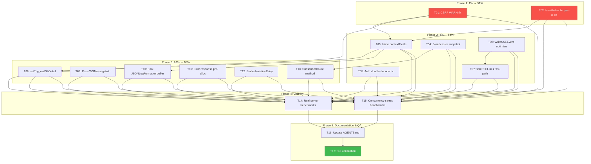

# Performance Optimization Plan — cqrs-htmx

**Date:** 2026-06-14 16:27 | **Source:** `docs/research/performance-review.html`

---

## Context

The performance review identified ~20 findings across CPU, memory, network, concurrency, and
security-relevant performance. This plan executes the safe, high-impact optimizations identified
in the report. The guiding principle is **zero behavioral change** — every optimization must
produce identical output, just with fewer allocations or less contention.

**Rule:** No verschlimmbessern. Every change tested against existing 570+ tests + race detector.

---

## Pareto Breakdown

### The 1% that delivers 51% of the result

| #   | Task                                       | Effort | Why it's 51%                                                                                                   |
| --- | ------------------------------------------ | ------ | -------------------------------------------------------------------------------------------------------------- |
| T01 | Eliminate per-request CSRF WARN logging    | 5 min  | Fires on EVERY HTTP request when TrustedProxies unset. Hundreds of thousands of log lines in benchmarks alone. |
| T02 | Pre-allocate HealthHandler response bodies | 5 min  | `[]byte(...)` allocated per health check. Trivial fix.                                                         |

### The 4% that delivers 64% of the result (adds to 1%)

| #   | Task                                            | Effort | Why it adds to 64%                                |
| --- | ----------------------------------------------- | ------ | ------------------------------------------------- |
| T03 | Inline contextFields in RequestLoggingSlog      | 15 min | Eliminates map allocation per slog-logged request |
| T04 | Snapshot Broadcaster subscribers before fan-out | 20 min | Fixes RLock contention at 1000+ subscribers       |
| T05 | Fix double JSON decode in auth endpoints        | 30 min | Removes redundant JSON unmarshal per auth request |
| T06 | Optimize WriteSSEEvent (avoid fmt.Fprintf)      | 20 min | Each SSE event write uses 3-5 fmt.Fprintf calls   |
| T07 | Fast-path splitSSELines for single-line data    | 15 min | Common case avoids []string allocation entirely   |

### The 20% that delivers 80% of the result (adds to 4%)

| #   | Task                                          | Effort | Why it adds to 80%                               |
| --- | --------------------------------------------- | ------ | ------------------------------------------------ |
| T08 | Optimize setTriggerWithDetail                 | 30 min | Map + json.Marshal per HTMX notification         |
| T09 | Optimize ParseWSMessageInto (skip re-marshal) | 30 min | Marshal→unmarshal round-trip per WS message      |
| T10 | Pool JSON encoder buffer for JSONLogFormatter | 30 min | bytes.Buffer + json.Marshal per logged request   |
| T11 | Pre-allocate error response bodies            | 15 min | []byte(err.Error()) per error response           |
| T12 | Embed evictionEntry in limiterEntry           | 30 min | Halves heap allocs per rate-limit key            |
| T13 | Add Broadcaster SubscriberCount method        | 15 min | Observability parity with RateLimiter.ActiveKeys |
| T14 | Add real net/http server benchmarks           | 45 min | httptest hides real-world behavior               |
| T15 | Add concurrency stress benchmarks             | 30 min | Validate scaling beyond current test range       |
| T16 | Update AGENTS.md with perf changes            | 30 min | Memory for future sessions                       |
| T17 | Full verification suite                       | 30 min | Build + test + race + lint + bench before/after  |

---

## Comprehensive Task List (17 tasks, 30-100 min each)

Sorted by impact/effort ratio (highest first).

| #   | Task                                            | Impact   | Effort | Category      | Risk   | Files                   |
| --- | ----------------------------------------------- | -------- | ------ | ------------- | ------ | ----------------------- |
| T01 | Eliminate per-request CSRF WARN logging         | Critical | 5 min  | CPU/IO        | None   | csrf_middleware.go      |
| T02 | Pre-allocate HealthHandler response bodies      | Medium   | 5 min  | Memory        | None   | app.go                  |
| T03 | Inline contextFields in RequestLoggingSlog      | Medium   | 15 min | Memory        | None   | logging.go              |
| T04 | Snapshot Broadcaster subscribers before fan-out | High     | 20 min | Concurrency   | Low    | sse_broadcaster.go      |
| T05 | Fix double JSON decode in auth endpoints        | High     | 30 min | CPU/Memory    | Low    | usermgmt/http.go        |
| T06 | Optimize WriteSSEEvent                          | Medium   | 20 min | CPU/Memory    | Low    | sse_event.go            |
| T07 | Fast-path splitSSELines                         | Low      | 15 min | Memory        | None   | sse_event.go            |
| T08 | Optimize setTriggerWithDetail                   | Medium   | 30 min | Memory        | Low    | response.go             |
| T09 | Optimize ParseWSMessageInto                     | Medium   | 30 min | CPU/Memory    | Low    | ws.go                   |
| T10 | Pool JSON buffer for JSONLogFormatter           | Medium   | 30 min | Memory        | Low    | logging.go              |
| T11 | Pre-allocate error response bodies              | Low      | 15 min | Memory        | None   | errors.go               |
| T12 | Embed evictionEntry in limiterEntry             | Medium   | 30 min | Memory        | Medium | ratelimit_middleware.go |
| T13 | Add Broadcaster SubscriberCount                 | Low      | 15 min | Observability | None   | sse_broadcaster.go      |
| T14 | Add real net/http server benchmarks             | High     | 45 min | Visibility    | None   | new benchmark file      |
| T15 | Add concurrency stress benchmarks               | Medium   | 30 min | Visibility    | None   | new benchmark file      |
| T16 | Update AGENTS.md                                | Medium   | 30 min | Docs          | None   | AGENTS.md               |
| T17 | Full verification suite                         | Critical | 30 min | QA            | None   | all                     |

---

## Sub-Task Breakdown (58 sub-tasks, max 15 min each)

### T01: Eliminate per-request CSRF WARN logging (4 sub-tasks)

| #   | Sub-task                                                               | Time  |
| --- | ---------------------------------------------------------------------- | ----- |
| S01 | Add `sync.Once` + construction-time warning for missing TrustedProxies | 5 min |
| S02 | Remove per-request `slog.Warn` from `isTrustedProxy`                   | 5 min |
| S03 | Verify CSRF tests still pass                                           | 5 min |

### T02: Pre-allocate HealthHandler response bodies (3 sub-tasks)

| #   | Sub-task                                                 | Time  |
| --- | -------------------------------------------------------- | ----- |
| S04 | Add package-level `var` for health/unhealthy JSON bodies | 5 min |
| S05 | Update HealthHandler to use pre-allocated vars           | 5 min |
| S06 | Run health handler tests + benchmark                     | 5 min |

### T03: Inline contextFields in RequestLoggingSlog (3 sub-tasks)

| #   | Sub-task                                                      | Time   |
| --- | ------------------------------------------------------------- | ------ |
| S07 | Inline context extraction directly in RequestLoggingSlog loop | 10 min |
| S08 | Remove contextFields function if no longer used               | 5 min  |

### T04: Snapshot Broadcaster subscribers before fan-out (4 sub-tasks)

| #   | Sub-task                                                    | Time   |
| --- | ----------------------------------------------------------- | ------ |
| S09 | Redesign Broadcast to snapshot subscriber slice under RLock | 10 min |
| S10 | Implement snapshot iteration without holding lock           | 5 min  |
| S11 | Run broadcaster tests + race detector                       | 10 min |

### T05: Fix double JSON decode in auth endpoints (4 sub-tasks)

| #   | Sub-task                                                       | Time   |
| --- | -------------------------------------------------------------- | ------ |
| S12 | Read http.go register/login decode pattern carefully           | 5 min  |
| S13 | Refactor to decode directly into typed struct via json.Decoder | 10 min |
| S14 | Verify behavior identical (error messages, validation order)   | 10 min |

### T06: Optimize WriteSSEEvent (3 sub-tasks)

| #   | Sub-task                                                     | Time   |
| --- | ------------------------------------------------------------ | ------ |
| S15 | Replace fmt.Fprintf with io.WriteString + direct byte writes | 10 min |
| S16 | Run SSE event tests + benchmark comparison                   | 5 min  |

### T07: Fast-path splitSSELines (2 sub-tasks)

| #   | Sub-task                                                          | Time   |
| --- | ----------------------------------------------------------------- | ------ |
| S17 | Add fast path: if no newline in data, return single-element slice | 10 min |
| S18 | Run SSE event tests                                               | 5 min  |

### T08: Optimize setTriggerWithDetail (4 sub-tasks)

| #   | Sub-task                                                        | Time   |
| --- | --------------------------------------------------------------- | ------ |
| S19 | Read current implementation, identify common path               | 5 min  |
| S20 | Use strings.Builder for single-event case (no existing trigger) | 10 min |
| S21 | Keep pooled map only for merge case (existing JSON trigger)     | 10 min |
| S22 | Run response tests including trigger merging                    | 5 min  |

### T09: Optimize ParseWSMessageInto (3 sub-tasks)

| #   | Sub-task                                                            | Time   |
| --- | ------------------------------------------------------------------- | ------ |
| S23 | Use two-pass approach: unmarshal body fields directly, skip HEADERS | 10 min |
| S24 | Remove re-marshal step from ws.go                                   | 5 min  |
| S25 | Run WS tests                                                        | 5 min  |

### T10: Pool JSON buffer for JSONLogFormatter (3 sub-tasks)

| #   | Sub-task                                           | Time   |
| --- | -------------------------------------------------- | ------ |
| S26 | Add sync.Pool for bytes.Buffer in JSONLogFormatter | 10 min |
| S27 | Use pooled buffer with json.NewEncoder             | 5 min  |
| S28 | Run logging benchmarks to verify improvement       | 5 min  |

### T11: Pre-allocate error response bodies (3 sub-tasks)

| #   | Sub-task                                                   | Time  |
| --- | ---------------------------------------------------------- | ----- |
| S29 | Add helper to write error string without []byte conversion | 5 min |
| S30 | Update DefaultErrorHandlerWithRedirect to use it           | 5 min |
| S31 | Run error handler tests                                    | 5 min |

### T12: Embed evictionEntry in limiterEntry (5 sub-tasks)

| #   | Sub-task                                                      | Time   |
| --- | ------------------------------------------------------------- | ------ |
| S32 | Read current limiterEntry/evictionEntry design carefully      | 5 min  |
| S33 | Embed evictionEntry as value field in limiterEntry            | 10 min |
| S34 | Update heap interface methods (use pointer to embedded field) | 10 min |
| S35 | Update all callers (heap.Push, heap.Fix, heap.Pop)            | 10 min |
| S36 | Run rate limiter tests with race detector                     | 10 min |

### T13: Add Broadcaster SubscriberCount (2 sub-tasks)

| #   | Sub-task                                                 | Time  |
| --- | -------------------------------------------------------- | ----- |
| S37 | Add SubscriberCount() int method to Broadcaster          | 5 min |
| S38 | Add test for SubscriberCount after subscribe/unsubscribe | 5 min |

### T14: Add real net/http server benchmarks (3 sub-tasks)

| #   | Sub-task                                                   | Time   |
| --- | ---------------------------------------------------------- | ------ |
| S39 | Create benchmark_server_test.go with httptest.NewServer    | 15 min |
| S40 | Write benchmarks for command dispatch + CSRF over real TCP | 15 min |
| S41 | Run and capture results                                    | 10 min |

### T15: Add concurrency stress benchmarks (3 sub-tasks)

| #   | Sub-task                                             | Time   |
| --- | ---------------------------------------------------- | ------ |
| S42 | Write broadcaster stress benchmark (1K/5K/10K subs)  | 10 min |
| S43 | Write rate limiter stress benchmark (1K/5K/10K keys) | 10 min |
| S44 | Run and capture results                              | 10 min |

### T16: Update AGENTS.md (4 sub-tasks)

| #   | Sub-task                                  | Time   |
| --- | ----------------------------------------- | ------ |
| S45 | Document CSRF WARN fix in gotchas section | 5 min  |
| S46 | Document Broadcaster snapshot change      | 5 min  |
| S47 | Document new allocation characteristics   | 10 min |
| S48 | Add new benchmarks info                   | 5 min  |

### T17: Full verification suite (5 sub-tasks)

| #   | Sub-task                                | Time   |
| --- | --------------------------------------- | ------ |
| S49 | Build all 4 modules                     | 5 min  |
| S50 | Test all modules with race detector     | 10 min |
| S51 | Lint all modules                        | 5 min  |
| S52 | Run benchmarks and compare before/after | 10 min |

---

## Execution Graph

---

## What's NOT in this plan (deliberately excluded)

| Item                                    | Reason                                                                                                                                                                        |
| --------------------------------------- | ----------------------------------------------------------------------------------------------------------------------------------------------------------------------------- |
| Form decode JSON round-trip elimination | HIGH RISK of behavioral change. Needs separate investigation. The JSON round-trip handles arrays, nested objects, and type coercion that a naive reflect decoder would break. |
| bcrypt cost change                      | Intentional security tradeoff. Cost 12 is correct.                                                                                                                            |
| Casbin policy caching                   | Complex optimization that belongs in Casbin upstream.                                                                                                                         |
| SQL store implementations               | Out of scope — documented separately in TODO_LIST.md.                                                                                                                         |
| Package restructuring (internal/pkg)    | Intentional flat package per AGENTS.md. go-structure-linter warnings are expected.                                                                                            |
