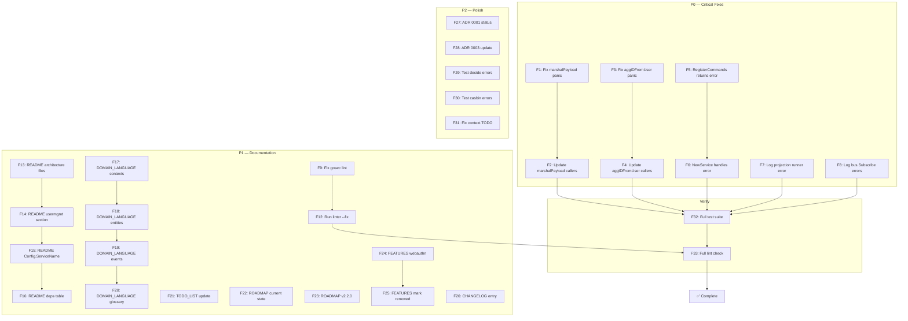

# Comprehensive Execution Plan — 2026-06-16 19:21

## Context

The usermgmt module was migrated to a fully event-sourced, passwordless (WebAuthn) architecture. The last session wired AccountLockout, credential management endpoints, session eviction, and HTTP refactors. This plan addresses all remaining gaps from the status report, code quality audit, and documentation drift.

**Current state:** 86.2% coverage, 0 panics in tests, 3/3 modules green, 34/34 pre-commit checks passing.

---

## Pareto Breakdown

### 1% that delivers 51% of the result

| #   | Task                                                                     | Why                                                 |
| --- | ------------------------------------------------------------------------ | --------------------------------------------------- |
| 1%a | **Fix 2 production panics** (es_events.go, es_readmodel.go)              | A single malformed input crashes the process        |
| 1%b | **Fix silently ignored command registrations** (es_dispatch.go, 7 sites) | If any registration fails, dispatch silently breaks |

### 4% that delivers 64% of the result

| #   | Task                                        | Why                                    |
| --- | ------------------------------------------- | -------------------------------------- |
| 4%a | Fix silently ignored bus.Subscribe errors   | Event bridge silently stops working    |
| 4%b | Fix swallowed projection runner error       | Read model silently goes stale         |
| 4%c | Update README.md stale architecture section | First thing every consumer reads       |
| 4%d | Fill docs/DOMAIN_LANGUAGE.md                | Shared vocabulary for all contributors |

### 20% that delivers 80% of the result

| #    | Task                                                                    | Why                                  |
| ---- | ----------------------------------------------------------------------- | ------------------------------------ |
| 20%a | Fix all remaining lint warnings (gosec, exhaustruct, perfsprint)        | Zero-warnings policy                 |
| 20%b | Update TODO_LIST.md and ROADMAP.md                                      | Reflect passwordless + event-sourced |
| 20%c | Update FEATURES.md                                                      | Honest feature inventory             |
| 20%d | Add ADR 0001 status line + update ADR 0003 status                       | ADR hygiene                          |
| 20%e | Test coverage push for decide functions + casbin projection error paths | 86%→90%+                             |

---

## Step 2: Comprehensive Plan (Medium Granity — 30-100min tasks)

| #   | Task                                                                                                                                       | Impact   | Effort | Priority |
| --- | ------------------------------------------------------------------------------------------------------------------------------------------ | -------- | ------ | -------- |
| M1  | **Fix production panics**: replace panic in es_events.go:46 (marshalPayload) and es_readmodel.go:179 (aggIDFromUser) with returned errors  | Critical | 30min  | P0       |
| M2  | **Fix silently ignored command registrations**: es_dispatch.go — change `RegisterCommands` to return error                                 | Critical | 30min  | P0       |
| M3  | **Fix swallowed projection runner error**: es_projection_setup.go:43 — log or propagate runner error                                       | High     | 15min  | P0       |
| M4  | **Fix silently ignored bus.Subscribe**: service_core.go:184,191 — log subscribe failures                                                   | High     | 15min  | P0       |
| M5  | **Fix all remaining lint**: gosec G101 (es_constants.go), perfsprint (authz_policies.go), exhaustruct, gci formatting                      | Medium   | 30min  | P1       |
| M6  | **Update README.md**: fix stale file names in architecture section, update usermgmt section (passwordless), add Config.ServiceName docs    | High     | 60min  | P1       |
| M7  | **Fill docs/DOMAIN_LANGUAGE.md**: User, Credential, Session, Role, Policy, Aggregate, Event, Command, Projection, Enforcer, Ceremony       | Medium   | 45min  | P1       |
| M8  | **Update TODO_LIST.md**: reflect passwordless migration, mark completed items, add new open items                                          | Medium   | 30min  | P1       |
| M9  | **Update ROADMAP.md**: reflect event-sourced architecture, update v2.2.0 section (UserStore removed), add WebAuthn completed               | Medium   | 30min  | P1       |
| M10 | **Update FEATURES.md**: add WebAuthn/passwordless features, credential management, session eviction, mark CRUD as removed                  | Medium   | 30min  | P1       |
| M11 | **Update CHANGELOG.md**: add Unreleased entry for lockout wiring, credential endpoints, session eviction, HTTP refactor                    | Medium   | 15min  | P1       |
| M12 | **Fix ADR hygiene**: add Status to ADR 0001, update ADR 0003 status (UserStore removed)                                                    | Low      | 15min  | P2       |
| M13 | **Test coverage**: decide function error branches (event.NewEvent failures), CasbinProjection Handle error paths, writeJSON encode failure | Medium   | 60min  | P2       |
| M14 | **Fix stale `context.TODO()`**: replace with `context.Background()` in handler_misc_test.go                                                | Low      | 5min   | P2       |
| M15 | **Verify**: full multi-module test suite + lint + build + race detector                                                                    | Critical | 15min  | P0       |

---

## Step 3: Detailed Breakdown (Fine Granarity — max 15min each)

| #   | Task                                                                                                       | Parent | Est   |
| --- | ---------------------------------------------------------------------------------------------------------- | ------ | ----- |
| F1  | Replace `panic(err)` in es_events.go:46 marshalPayload → return `[]byte` + `error`                         | M1     | 10min |
| F2  | Update marshalPayload callers to handle error (es_decide.go, 7 sites)                                      | M1     | 10min |
| F3  | Replace `panic` in es_readmodel.go:179 aggIDFromUser → return `(id.AggregateID, error)`                    | M1     | 10min |
| F4  | Update aggIDFromUser callers (service_register.go, service_misc.go, webauthn_service.go)                   | M1     | 10min |
| F5  | Change `RegisterCommands` signature to return `error` in es_dispatch.go                                    | M2     | 10min |
| F6  | Update `NewService` to handle RegisterCommands error                                                       | M2     | 5min  |
| F7  | Fix es_projection_setup.go:43 — add error logging for runner.Run                                           | M3     | 5min  |
| F8  | Fix service_core.go:184,191 — add error logging for bus.Subscribe                                          | M4     | 5min  |
| F9  | Fix gosec G101 in es_constants.go — add `//nolint:gosec // event type constant, not credential`            | M5     | 5min  |
| F10 | Fix perfsprint in authz_policies.go:112 (already done, verify clean)                                       | M5     | 5min  |
| F11 | Fix exhaustruct nolint placement in service_core.go (verify clean)                                         | M5     | 5min  |
| F12 | Run `golangci-lint run --fix` + `gofmt -w` to fix gci formatting                                           | M5     | 5min  |
| F13 | README.md: fix architecture file names (options.go→split, csrf.go→split, sse.go→split, ratelimit.go→split) | M6     | 10min |
| F14 | README.md: update usermgmt section (remove UserStore, add event-sourced + WebAuthn)                        | M6     | 10min |
| F15 | README.md: add Config.ServiceName + App.EventOptions docs                                                  | M6     | 10min |
| F16 | README.md: update dependency table (go-webauthn, remove bcrypt ref)                                        | M6     | 5min  |
| F17 | DOMAIN_LANGUAGE.md: fill Bounded Contexts section                                                          | M7     | 10min |
| F18 | DOMAIN_LANGUAGE.md: fill Entities + Value Objects section                                                  | M7     | 10min |
| F19 | DOMAIN_LANGUAGE.md: fill Events + Commands section                                                         | M7     | 10min |
| F20 | DOMAIN_LANGUAGE.md: fill Glossary (all domain terms)                                                       | M7     | 10min |
| F21 | TODO_LIST.md: add passwordless migration section, mark old items, add new open items                       | M8     | 15min |
| F22 | ROADMAP.md: update current state (event-sourced, passwordless, coverage)                                   | M9     | 10min |
| F23 | ROADMAP.md: update v2.2.0 section (UserStore removed, event-sourced replaces it)                           | M9     | 10min |
| F24 | FEATURES.md: add passwordless/WebAuthn features, credential management                                     | M10    | 10min |
| F25 | FEATURES.md: mark CRUD password features as removed                                                        | M10    | 5min  |
| F26 | CHANGELOG.md: add Unreleased entry for this session's changes                                              | M11    | 10min |
| F27 | ADR 0001: add `**Status:** Accepted`                                                                       | M12    | 5min  |
| F28 | ADR 0003: update status — UserStore removed, superseded by event sourcing                                  | M12    | 10min |
| F29 | Test: decide function event.NewEvent error branch coverage                                                 | M13    | 10min |
| F30 | Test: CasbinProjection Handle error paths (decode failures)                                                | M13    | 10min |
| F31 | Fix context.TODO() → context.Background() in handler_misc_test.go                                          | M14    | 5min  |
| F32 | Run full test suite (root + usermgmt + integration) + race detector                                        | M15    | 10min |
| F33 | Run full lint check (golangci-lint all modules)                                                            | M15    | 5min  |

---

## Execution Graph

---

## Rules

- **NO VERSCHLIMMBESSER.** Every change must be a genuine improvement. No cosmetic refactors.
- **Don't break build.** Run tests after every code change.
- **Commit frequently.** After each completed parent task (M1-M15).
- **Use parallel tasks** where there are no dependencies.
