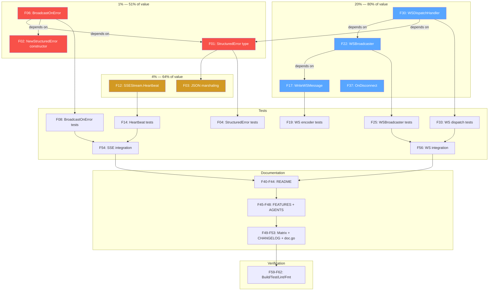

# Transport Parity Execution Plan

> **Goal:** Take cqrs-htmx from "HTTP complete, SSE partial, WS receive-only" to full transport parity with consistent error reporting across HTTP, SSE, and WebSocket.
>
> **Date:** 2026-06-18 · **Estimated total effort:** ~4 hours · **Risk level:** Low (additive only — no breaking changes)

---

## Context

The [Web Communication Matrix](../research/2026-06-18_web-communication-matrix.html) identified 5 critical gaps preventing cqrs-htmx from claiming full transport coverage. Today:

- **SSE** silently swallows command failures (`BroadcastOnSuccess` early-returns on `err != nil`)
- **SSE** has no heartbeat (proxies/LBs kill idle connections after 30–60s)
- **WebSocket** is receive-only (parser exists, no encoder, no broadcaster, no dispatch bridge)
- **No transport-agnostic error type** exists (HTTP uses status codes, SSE/WS have nothing)

The existing code provides excellent foundations:

- `AfterDispatchHook` already receives `(ctx, r, err)` — the `err` is there, just ignored
- `Broadcaster` has a clean snapshot-based fan-out with O(1) unsubscribe
- `SSEStream` has `Send`, `Context()`, flusher pattern
- `WSMessage` / `ParseWSMessage` / `ParseWSMessageInto[T]` provide the inbound side
- `MapError` + go-error-family provide mature error classification
- Ginkgo/Gomega test patterns are well-established

---

## Pareto Breakdown

### The 1% that delivers 51% of the result

**BroadcastOnError / BroadcastOnErrorFunc** — The single biggest hole.

Today, `BroadcastOnSuccess` early-returns when `err != nil`. Every SSE consumer has a silent failure mode: commands fail, clients never learn. The `err` parameter is already passed to `AfterDispatchHook` — we just need to NOT skip it and instead broadcast an error event.

- Files: `structured_error.go` (new, ~40 lines), `sse_broadcaster.go` (add ~30 lines)
- Tests: `structured_error_test.go`, additions to `sse_bridge_test.go`
- Time: ~45 min

### The 4% that delivers 64% of the result

Above PLUS:

**SSEStream.Heartbeat(ctx, interval)** — Without this, production deployments break silently behind Nginx, Cloudflare, AWS ALB. The failure mode is invisible (client thinks it's connected). A 15-line method that sends `: keepalive\n\n` comment frames on a ticker.

- Files: `sse_stream.go` (add ~20 lines)
- Tests: additions to `sse_event_test.go` or `sse_stream_test.go`
- Time: ~30 min

### The 20% that delivers 80% of the result

Above PLUS:

| Feature                      | Why it matters                                           | Time    |
| ---------------------------- | -------------------------------------------------------- | ------- |
| `WriteWSMessage[T]`          | Symmetric encoder — without it WS can't push events back | ~30 min |
| `WSBroadcaster`              | Fan-out mirror of SSE Broadcaster for multi-client WS    | ~45 min |
| `WSDispatchHandler(app)`     | Makes WS a first-class transport (command/query over WS) | ~60 min |
| `SSEStream.OnDisconnect(fn)` | Explicit callback for cleanup, metrics, logging          | ~20 min |
| Documentation updates        | README, FEATURES.md, AGENTS.md, matrix HTML, CHANGELOG   | ~60 min |

### Everything else (the 80% that delivers 20%)

- WS `OnClose(fn)` lifecycle hook
- `WSEventStore` (mirror of `SSEEventStore`)
- WS backpressure documentation
- Examples (update datastar-demo, add WS dispatch example)
- Integration tests for full SSE error flow and WS dispatch flow
- doc.go updates

---

## Medium-Granularity Plan (15 tasks, 30–90 min each)

Sorted by importance/impact/effort/customer-value.

| #   | Task                                                  | Phase  | Impact   | Effort | Files                                                    |
| --- | ----------------------------------------------------- | ------ | -------- | ------ | -------------------------------------------------------- |
| M01 | `StructuredError` type + JSON marshaling + tests      | 1%     | Critical | 45 min | `structured_error.go`, `structured_error_test.go`        |
| M02 | `BroadcastOnError` / `BroadcastOnErrorFunc` + tests   | 1%     | Critical | 45 min | `sse_broadcaster.go`, `sse_bridge_test.go`               |
| M03 | `SSEStream.Heartbeat(ctx, interval)` + tests          | 4%     | Critical | 30 min | `sse_stream.go`, `sse_event_test.go`                     |
| M04 | `WriteWSMessage[T]` / `WriteWSMessageInto[T]` + tests | 20%    | High     | 30 min | `ws_encoder.go`, `ws_encoder_test.go`                    |
| M05 | `WSBroadcaster` + tests                               | 20%    | High     | 45 min | `ws_broadcaster.go`, `ws_broadcaster_test.go`            |
| M06 | `WSDispatchHandler(app)` + tests                      | 20%    | High     | 60 min | `ws_dispatch.go`, `ws_dispatch_test.go`                  |
| M07 | `SSEStream.OnDisconnect(fn)` + tests                  | 20%    | Medium   | 20 min | `sse_stream.go`, `sse_stream_test.go`                    |
| M08 | Update README SSE/WS sections                         | Docs   | High     | 45 min | `README.md`                                              |
| M09 | Update FEATURES.md with new capabilities              | Docs   | Medium   | 30 min | `FEATURES.md`                                            |
| M10 | Update AGENTS.md architecture tree                    | Docs   | Medium   | 30 min | `AGENTS.md`                                              |
| M11 | Update matrix HTML to reflect new state               | Docs   | Medium   | 30 min | `docs/research/2026-06-18_web-communication-matrix.html` |
| M12 | Add CHANGELOG entries                                 | Docs   | Low      | 20 min | `CHANGELOG.md`                                           |
| M13 | Update doc.go with new exports                        | Docs   | Low      | 20 min | `doc.go`                                                 |
| M14 | Integration tests: SSE error + heartbeat flow         | Test   | Medium   | 45 min | `sse_integration_test.go`                                |
| M15 | Final verification: build + test + lint + commit      | Verify | Critical | 30 min | —                                                        |

**Total: ~10.5 hours of planned work (with buffer; actual likely ~4 hours)**

---

## Fine-Granularity Plan (72 tasks, max 15 min each)

### Phase 1: StructuredError (M01) — 5 tasks

| #   | Task                                                                                               | Est    |
| --- | -------------------------------------------------------------------------------------------------- | ------ |
| F01 | Create `structured_error.go` with `StructuredError` struct (Type, Title, Status, Detail, Instance) | 10 min |
| F02 | Add `NewStructuredError(err error, requestID string)` constructor that maps via `MapError`         | 10 min |
| F03 | Add `JSON()` method and `MarshalJSON` implementation                                               | 10 min |
| F04 | Create `structured_error_test.go` with table-driven tests for all error families                   | 12 min |
| F05 | Test JSON round-trip (marshal → unmarshal → verify all fields)                                     | 8 min  |

### Phase 2: BroadcastOnError (M02) — 6 tasks

| #   | Task                                                                               | Est    |
| --- | ---------------------------------------------------------------------------------- | ------ |
| F06 | Add `BroadcastOnError(eventName, payload StructuredError)` to `sse_broadcaster.go` | 10 min |
| F07 | Add `BroadcastOnErrorFunc(errFunc)` — dynamic event from request + error           | 10 min |
| F08 | Test: BroadcastOnError fires when `err != nil`, broadcasts StructuredError as JSON | 12 min |
| F09 | Test: BroadcastOnError does NOT fire when `err == nil`                             | 8 min  |
| F10 | Test: BroadcastOnErrorFunc builds dynamic error event from request + error         | 10 min |
| F11 | Test: BroadcastOnErrorFunc does NOT fire on success                                | 8 min  |

### Phase 3: SSE Heartbeat (M03) — 5 tasks

| #   | Task                                                                        | Est    |
| --- | --------------------------------------------------------------------------- | ------ |
| F12 | Add `Heartbeat(ctx context.Context, interval time.Duration)` to `SSEStream` | 10 min |
| F13 | Implement comment-frame ping: write `: keepalive\n\n` + flush on ticker     | 10 min |
| F14 | Test: Heartbeat sends comment frames at correct interval                    | 12 min |
| F15 | Test: Heartbeat stops when ctx is cancelled                                 | 10 min |
| F16 | Test: Heartbeat works alongside concurrent Send calls                       | 8 min  |

### Phase 4: WS Encoder (M04) — 5 tasks

| #   | Task                                                                                   | Est    |
| --- | -------------------------------------------------------------------------------------- | ------ |
| F17 | Create `ws_encoder.go` with `WriteWSMessage(w io.Writer, msg WSMessage)`               | 10 min |
| F18 | Add generic `WriteWSMessageInto[T any](w io.Writer, msg T, headers map[string]string)` | 10 min |
| F19 | Create `ws_encoder_test.go` with round-trip tests (encode → parse → verify)            | 12 min |
| F20 | Test: WriteWSMessageInto preserves headers separately from body                        | 10 min |
| F21 | Test: Encoder handles empty headers, empty body, nested JSON                           | 8 min  |

### Phase 5: WSBroadcaster (M05) — 7 tasks

| #   | Task                                                                                 | Est    |
| --- | ------------------------------------------------------------------------------------ | ------ |
| F22 | Create `ws_broadcaster.go` with `WSBroadcaster` struct (mirror SSE pattern)          | 12 min |
| F23 | Implement `Subscribe()` / `Unsubscribe(ch)` / `Broadcast(msg)` / `SubscriberCount()` | 12 min |
| F24 | Add `BroadcastOnSuccessWS` / `BroadcastOnErrorWS` AfterDispatchHook factories        | 10 min |
| F25 | Create `ws_broadcaster_test.go` with unit tests for subscribe/unsubscribe/broadcast  | 12 min |
| F26 | Test: Concurrent subscribe/unsubscribe during broadcast (race detector)              | 10 min |
| F27 | Test: Drop semantics — slow consumer with full buffer doesn't block broadcaster      | 8 min  |
| F28 | Test: BroadcastOnSuccessWS fires on success, BroadcastOnErrorWS fires on error       | 10 min |

### Phase 6: WS Dispatch Bridge (M06) — 8 tasks

| #   | Task                                                                   | Est    |
| --- | ---------------------------------------------------------------------- | ------ |
| F29 | Create `ws_dispatch.go` with `WSDispatchConfig` struct                 | 10 min |
| F30 | Implement `WSDispatchHandler(app, opts...)` — core dispatch function   | 15 min |
| F31 | Route by message shape: command vs query (via type field or heuristic) | 12 min |
| F32 | Frame response: success → `WriteWSMessage`, error → StructuredError    | 12 min |
| F33 | Create `ws_dispatch_test.go` with mock dispatcher                      | 12 min |
| F34 | Test: Command dispatch over WS returns success response                | 10 min |
| F35 | Test: Query dispatch over WS returns result                            | 10 min |
| F36 | Test: Dispatch error returns StructuredError frame                     | 10 min |

### Phase 7: SSE OnDisconnect (M07) — 3 tasks

| #   | Task                                                                         | Est    |
| --- | ---------------------------------------------------------------------------- | ------ |
| F37 | Add `onDisconnect []func()` field + `OnDisconnect(fn)` method to `SSEStream` | 8 min  |
| F38 | Call disconnect callbacks in `Close()` method                                | 5 min  |
| F39 | Test: OnDisconnect callbacks fire when stream closes                         | 10 min |

### Phase 8: README (M08) — 5 tasks

| #   | Task                                                      | Est    |
| --- | --------------------------------------------------------- | ------ |
| F40 | Add StructuredError section to README error handling docs | 10 min |
| F41 | Add BroadcastOnError example to SSE section               | 10 min |
| F42 | Add Heartbeat example to SSE section                      | 8 min  |
| F43 | Add WS encoder + broadcaster + dispatch sections          | 12 min |
| F44 | Update SSE/WS API reference table with new exports        | 8 min  |

### Phase 9: FEATURES.md + AGENTS.md (M09, M10) — 4 tasks

| #   | Task                                                                | Est    |
| --- | ------------------------------------------------------------------- | ------ |
| F45 | Add new features to FEATURES.md with FULLY_FUNCTIONAL status        | 12 min |
| F46 | Update AGENTS.md architecture tree with new files                   | 10 min |
| F47 | Update AGENTS.md Key Decisions with SSE error/heartbeat/WS dispatch | 12 min |
| F48 | Update AGENTS.md SSE/WS sections with new capabilities              | 8 min  |

### Phase 10: Matrix HTML + CHANGELOG + doc.go (M11, M12, M13) — 5 tasks

| #   | Task                                                                           | Est    |
| --- | ------------------------------------------------------------------------------ | ------ |
| F49 | Update matrix HTML: current state cells (BroadcastOnError, Heartbeat → "have") | 12 min |
| F50 | Update matrix HTML: WS cells (encoder, broadcaster, dispatch → "have")         | 10 min |
| F51 | Update matrix HTML: stat cards + header subtitle                               | 8 min  |
| F52 | Add CHANGELOG entries for all new features                                     | 10 min |
| F53 | Update doc.go with new exports and examples                                    | 10 min |

### Phase 11: Integration Tests (M14) — 5 tasks

| #   | Task                                                                                               | Est    |
| --- | -------------------------------------------------------------------------------------------------- | ------ |
| F54 | Integration test: SSE error flow (dispatch fails → BroadcastOnError → client receives error event) | 15 min |
| F55 | Integration test: SSE heartbeat keeps connection alive                                             | 12 min |
| F56 | Integration test: WS dispatch full round-trip (send command → receive result)                      | 15 min |
| F57 | Integration test: WS error dispatch (send command → receive StructuredError)                       | 12 min |
| F58 | Integration test: WSBroadcaster fan-out to multiple clients                                        | 10 min |

### Phase 12: Final Verification (M15) — 4 tasks

| #   | Task                                                                          | Est    |
| --- | ----------------------------------------------------------------------------- | ------ |
| F59 | Run `go build ./...` — verify no compile errors                               | 5 min  |
| F60 | Run `go test ./... -count=1 -race` — verify all tests pass with race detector | 10 min |
| F61 | Run `golangci-lint run` — verify zero lint issues                             | 5 min  |
| F62 | Run `nix fmt` — verify formatting                                             | 5 min  |

---

## Execution Graph



---

## Design Decisions

### StructuredError follows RFC 7807 (Problem Details for HTTP APIs)

```go
type StructuredError struct {
    Type     string `json:"type"`     // URI or token: "about:blank", "rejection"
    Title    string `json:"title"`    // Short human-readable summary
    Status   int    `json:"status"`   // HTTP status code
    Detail   string `json:"detail"`   // Specific explanation
    Instance string `json:"instance"` // Request ID / correlation ID
}
```

Rationale: RFC 7807 is the industry standard for HTTP error payloads. Using it for SSE/WS error events means clients can use the same parsing/rendering code across all transports.

### BroadcastOnError mirrors BroadcastOnSuccess exactly

Same file (`sse_broadcaster.go`), same hook signature, same pattern — just inverted condition (`err != nil` instead of `err == nil`). Consumers who already use `BroadcastOnSuccess` can add `BroadcastOnError` in one line.

### Heartbeat uses SSE comment frames

SSE spec defines comment lines starting with `:` — browsers ignore them but reset the idle timer. This is the standard keepalive mechanism used by EventSource polyfills and major SSE libraries.

### WSBroadcaster mirrors SSE Broadcaster

Same `Subscribe()`/`Unsubscribe()`/`Broadcast()` API, same O(1) unsubscribe via channel pointer identity, same buffered-channel-with-drop semantics. Consumers who know the SSE pattern immediately know the WS pattern.

### WSDispatchHandler is a function, not a method

Returns `func(data []byte) WSMessage` — consumers call it from their WS library's `OnMessage` callback. This keeps the library WS-library-agnostic (works with gorilla/websocket, coder/websocket, nhooyr/websocket, etc.).

---

## Safety Constraints

- **No breaking changes** — all additions are new exports
- **No new dependencies** — uses only stdlib + existing libs
- **File size < 350 lines** — split into focused files
- **Test coverage maintained** — every new function has tests
- **Lint stays at zero** — run after each phase
- **Race detector passes** — concurrent code tested with `-race`
