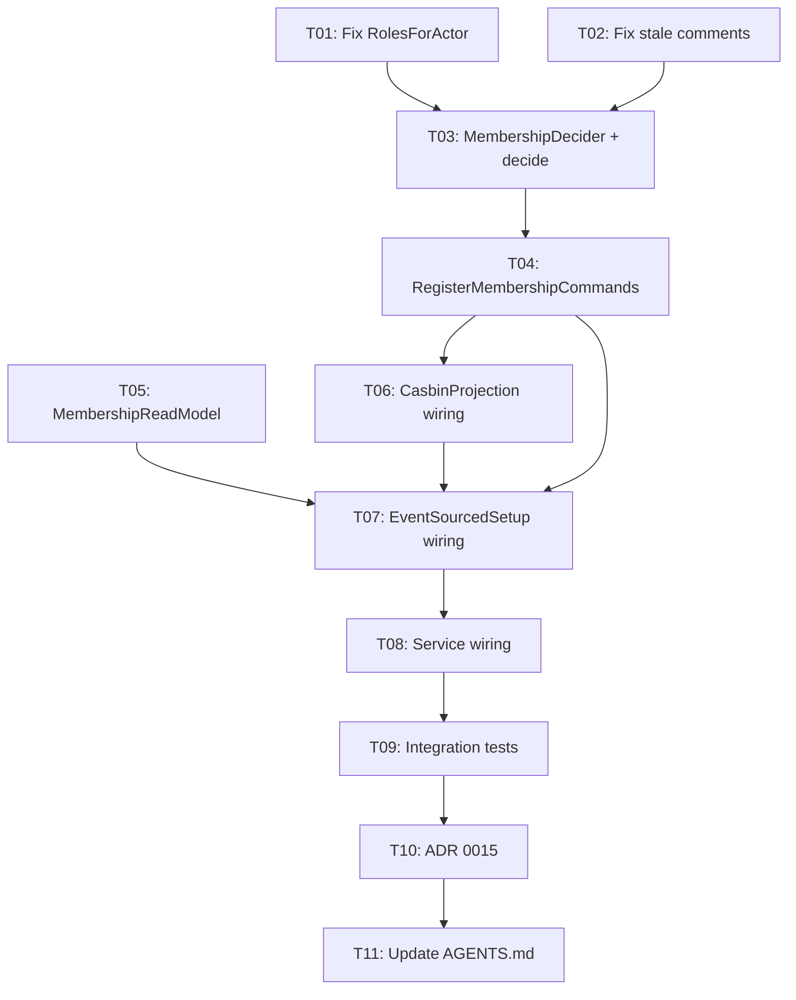

# Membership Wiring + Bug Fixes — Execution Plan

**Created:** 2026-06-21 08:23 | **Architecture Decision:** Membership = independent aggregate
**Reason:** Support 1 member in multiple tenants/orgs

## Pareto Breakdown

### 1% → 51%: Wire Membership Aggregate End-to-End

- `MembershipDecider()` + `decider.Repository[MembershipState]`
- `decideAddMember` / `decideUpdateMemberRoles` / `decideRemoveMember`
- `RegisterMembershipCommands(dispatcher, repo)`
- `MembershipReadModel` projection
- Wire into `Service` + `EventSourcedSetup`

### 4% → 64%: Fix Bugs + Cleanup

- Fix `RolesForActor` to take `ActorID` not `string`
- Wire `allMembershipEventTypes` into CasbinProjection (or remove nolint lie)
- Fix stale comments (schema version, Domain→TenantID claim)
- Add `AddedAt` to MembershipState (align with read model)
- Stamp `SchemaVersion` in all deciders

### 20% → 80%: Session + Impersonation Foundation

- Update Session struct (ActorID + Origin)
- Update SessionStore interface
- BeginImpersonation / EndImpersonation

## Task Table (sorted by impact/effort)

| #   | Task                                                 | Impact | Effort | Files                                |
| --- | ---------------------------------------------------- | ------ | ------ | ------------------------------------ |
| T01 | Fix RolesForActor type-safety (take ActorID)         | 10     | 5min   | authz_roles.go                       |
| T02 | Fix stale comments + nolint lies                     | 7      | 5min   | es_constants.go, es_upcaster_test.go |
| T03 | Create MembershipDecider() + decide functions        | 10     | 30min  | es_membership_decide.go (new)        |
| T04 | Create RegisterMembershipCommands                    | 9      | 20min  | es_membership_dispatch.go (new)      |
| T05 | Create MembershipReadModel projection                | 8      | 30min  | es_membership_readmodel.go (new)     |
| T06 | Wire CasbinProjection for membership events          | 9      | 20min  | es_casbin_projection.go              |
| T07 | Wire Membership into EventSourcedSetup               | 8      | 15min  | es_setup.go                          |
| T08 | Wire Membership into Service/NewService              | 9      | 15min  | service_core.go                      |
| T09 | Write integration test for full membership lifecycle | 9      | 30min  | es_membership_integration_test.go    |
| T10 | Write ADR 0015 for identity redesign                 | 7      | 20min  | docs/adr/                            |
| T11 | Update AGENTS.md with new types + counts             | 6      | 10min  | AGENTS.md                            |

## Execution Graph

