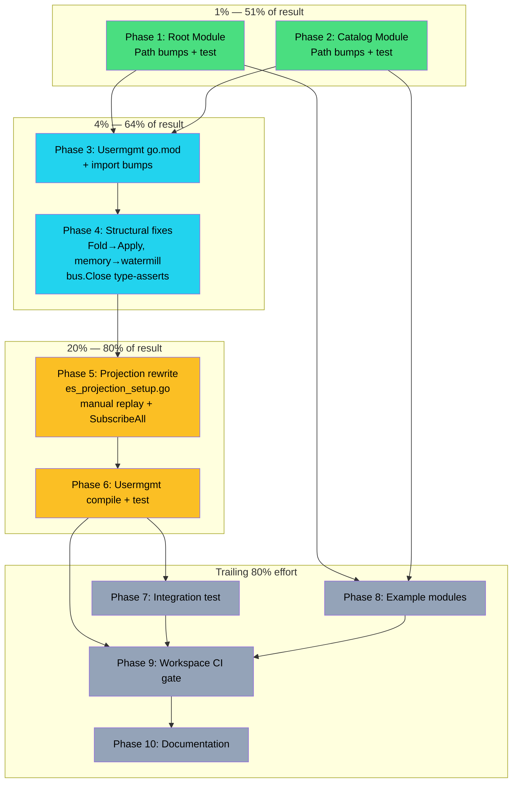

# go-cqrs-lite v3.0.0 Migration Plan

> **Date:** 2026-06-22
> **Status:** Approved — Ready for execution
> **Baseline:** All 4 test modules green at v2.6.0 (root, catalog, usermgmt, integration_test)

---

## Executive Summary

go-cqrs-lite v3.0.0 released 2026-06-22 with 11 breaking changes. This plan migrates all 7 Go modules in cqrs-htmx from v2.6.0 to v3.0.0. After deep research (CHANGELOG, V3_MIGRATION.md, ADR-0030, all v3 go.mod files, and codebase impact mapping), the migration is **far more mechanical than initially feared** — only 4 of the 11 breaking changes require code changes in our codebase. The rest are either transparent or irrelevant to our usage.

**Key finding:** The `event.Projection` interface (`Name() + Handle() + EventTypes()`) survived into v3's `event` package. Our 6 read models are **already compatible** — they only need a new orchestration function to replace `projection.Runner`.

### Scope at a Glance

| Metric                            | Count                                                                                                                                                     |
| --------------------------------- | --------------------------------------------------------------------------------------------------------------------------------------------------------- |
| Go modules to migrate             | 7 (root, catalog, usermgmt, integration_test, datastar-demo, catalog-demo, basic)                                                                         |
| Import sites to change            | ~147 (`/v2` → `/v3` path bumps)                                                                                                                           |
| Structural code changes           | 4 categories (projection rewrite, Fold→Apply, memory→storage/memory+watermill, bus.Close type-asserts)                                                    |
| Breaking changes affecting us     | 4 of 11 (#1 ghost bus, #2 memory move, #5 io.Closer, #7 projection deletion, #10 Fold→Apply)                                                              |
| Breaking changes NOT affecting us | 7 (#3 Version→uint64 transparent, #4 Metadata split unused, #6 readmodel unused, #8 SSE separate, #9 TypedHandler unused, #11 concrete Event transparent) |
| Files needing structural edits    | ~12 (concentrated in usermgmt)                                                                                                                            |
| Files needing path bumps only     | ~100+                                                                                                                                                     |

---

## Impact Map — All 11 Breaking Changes vs Our Codebase

| #  | Breaking Change                                                       | ADR  | Affects Us?     | Sites                                                                                       | Effort | Strategy                                                |
| -- | --------------------------------------------------------------------- | ---- | --------------- | ------------------------------------------------------------------------------------------- | ------ | ------------------------------------------------------- |
| 1  | Delete ghost bus (`memory.MemoryBus` gone)                            | 0028 | **YES**         | 2 (es_setup.go:109, service_core.go:182)                                                    | 10min  | Replace with `watermill.NewEventBus()`                  |
| 2  | Move `memory/` → `storage/memory/` (stores) + `watermill/` (bus)      | 0029 | **YES**         | 4 (es_setup.go:99, service_core.go:161,172, es_projection_setup.go:68)                      | 15min  | Change import paths; API identical                      |
| 3  | `event.Version`: `int` → `uint64`                                     | —    | Transparent     | ~20 decider sites                                                                           | 0min   | `version.Increment()` works unchanged                   |
| 4  | Break `command/query.Metadata` alias                                  | 0031 | **NO**          | 0                                                                                           | 0min   | We don't use `event.EnsureCustom` on cmd/query metadata |
| 5  | Remove `io.Closer` from 9 core interfaces                             | 0010 | **YES**         | 7 (es_setup.go error paths)                                                                 | 15min  | Type-assert `bus.(io.Closer)` before calling Close()    |
| 6  | Delete `readmodel/` (merged into `kv/`)                               | 0032 | **NO**          | 0                                                                                           | 0min   | We don't import `readmodel/`                            |
| 7  | Delete `projection/` (replaced by `event.Projection` + manual replay) | 0030 | **YES — MAJOR** | 1 file (es_projection_setup.go, 138 LOC)                                                    | 90min  | Rewrite: manual journal replay + `bus.SubscribeAll`     |
| 8  | Move SSE → `transport/http/`                                          | 0025 | **NO**          | 0                                                                                           | 0min   | We have our own SSE, don't use go-cqrs-lite's           |
| 9  | `query.Handler`: `any` → `TypedHandler[Q,R]`                          | —    | **NO**          | 0                                                                                           | 0min   | We don't register query handlers via dispatcher         |
| 10 | `Decider.Fold` → `Apply`                                              | —    | **YES**         | 4 (es_setup.go:75, es_bot_decide.go:13, es_membership_decide.go:14, es_tenant_decide.go:13) | 5min   | Rename field `Fold:` → `Apply:`                         |
| 11 | `event.Event` = `*ImmutableEvent` (concrete type)                     | —    | Transparent     | 93 event import sites                                                                       | 0min   | `type Event = *ImmutableEvent` — all usage unchanged    |

### New Dependencies Added

| Module   | New Dep                                                                     | Reason                                                     |
| -------- | --------------------------------------------------------------------------- | ---------------------------------------------------------- |
| usermgmt | `github.com/ThreeDotsLabs/watermill v1.5.2` (transitive via `watermill/v3`) | `watermill.NewEventBus()` replaces `memory.NewMemoryBus()` |
| usermgmt | `go-cqrs-lite/watermill/v3`                                                 | In-process event bus                                       |
| usermgmt | `go-cqrs-lite/storage/memory/v3`                                            | In-memory event store + checkpoint store                   |

### Dependencies Removed

| Module   | Removed Dep                  | Reason                                                |
| -------- | ---------------------------- | ----------------------------------------------------- |
| usermgmt | `go-cqrs-lite/memory/v2`     | Deleted in v3 — split into storage/memory + watermill |
| usermgmt | `go-cqrs-lite/projection/v2` | Deleted in v3 — dissolved (ADR-0030)                  |

---

## Architecture Decision: Projection Replacement

### Context

`projection.Runner` is deleted in v3 (ADR-0030). Our `StartProjections()` function (`es_projection_setup.go`) uses it to:

1. Create a Runner with journal + bus + checkpointStore
2. Register 6 read models (UserReadModel, MembershipReadModel, TenantReadModel, BotReadModel, CasbinProjection, AuditLog)
3. Replay history synchronously (read-your-writes)
4. Start live tailing in background
5. Block until subscription is ready

### Key Insight: `event.Projection` Survived

v3's `event` package includes `event.Projection` interface:

```go
type Projection interface {
    Name() string
    Handle(ctx context.Context, evt Event) error
    EventTypes() []Type
}
```

This is **identical** to our current read model interface. All 6 read models already satisfy it. **Zero read model code changes needed.**

### Decision: Manual Replay + SubscribeAll (Option A)

Replace `projection.Runner` with a custom ~60-line function:

1. **Replay**: Read all events from `event.Journal.ReadFrom(checkpoint)`, dispatch to each projection's `Handle()`, marking context with `event.WithProcessingMode(ctx, event.ModeReplay)`
2. **Live**: Call `bus.SubscribeAll()` with a combined handler that routes to each projection
3. **Dedup**: Seed a `map[id.EventID]bool` with replay event IDs; skip duplicates in live handler
4. **Checkpoint**: Optional — persist last replayed event ID to `storage/memory.NewMemoryCheckpointStore()` for restart resilience

**Why not CatchUpSubscriber/Materialize?**

- `watermill.CatchUpSubscriber` requires Watermill Router setup + message adapter boilerplate — heavy for a library
- `stack.Materialize` requires rewriting read model internals to `kv.TypedStore` — huge effort, low value right now
- Manual replay is ~60 lines, preserves our architecture, and our read models stay unchanged
- We currently use in-memory checkpoint (ephemeral) — no regression

### Read-Your-Writes Preservation

`watermill.EventBus` (GoChannel backend) provides synchronous publish by default. Combined with our replay-before-subscribe pattern, the write→read consistency contract is preserved:

1. StartProjections replays all history → read models caught up
2. SubscribeAll registered → live events flow
3. `MemoryBus`/`EventBus` blocks publisher until handlers complete → read-your-writes

---

## Pareto Breakdown

### 1% that delivers 51% of the result

**Root + catalog module path bumps.** These two modules have ZERO structural changes — pure `/v2` → `/v3` find-replace across ~65 files. Getting them green validates that v3 types/APIs are compatible for 90%+ of our usage (event constructors, command/query types, id types). This proves the migration is tractable and gives confidence for the harder modules.

### 4% that delivers 64% of the result

**Usermgmt mechanical fixes:** Fold→Apply (4 sites), memory→storage/memory (4 sites), memory→watermill bus (2 sites), bus.Close() type-assertions (7 sites), plus all import path bumps across 72 files. This gets usermgmt to ~95% compiling — only the projection rewrite remains as a compilation blocker.

### 20% that delivers 80% of the result

**Projection rewrite in `es_projection_setup.go`.** Replace `projection.Runner` with manual journal replay + `bus.SubscribeAll`. Our read models already satisfy `event.Projection`. After this, usermgmt compiles and the full test suite can run. This is the single highest-risk, highest-impact task.

### Remaining 80% of effort (last 20% of result)

Integration test fixes, example module bumps, edge-case compilation errors, test failures from type changes, documentation updates, errorfamily verification, and full CI-green verification.

---

## Comprehensive Plan — Medium Granularity

> 22 tasks, 5–90min each. Sorted by dependency order then impact/effort.

| #   | Task                                                                                                                 | Module           | Impact   | Effort | Deps               | Priority |
| --- | -------------------------------------------------------------------------------------------------------------------- | ---------------- | -------- | ------ | ------------------ | -------- |
| M1  | Bump root go.mod: all go-cqrs-lite deps `/v2` → `/v3`                                                                | root             | Critical | 15min  | —                  | P0       |
| M2  | Bump root imports: `/v2` → `/v3` in all `*.go` files                                                                 | root             | Critical | 15min  | M1                 | P0       |
| M3  | Root compile + `go mod tidy` + test                                                                                  | root             | Critical | 15min  | M2                 | P0       |
| M4  | Bump catalog go.mod + imports + compile + test                                                                       | catalog          | Critical | 20min  | —                  | P0       |
| M5  | Bump usermgmt go.mod: all deps `/v3`, add `watermill/v3` + `storage/memory/v3`, remove `memory/v2` + `projection/v2` | usermgmt         | Critical | 20min  | M3                 | P0       |
| M6  | Bump usermgmt imports: all `/v2` → `/v3` across 72 files                                                             | usermgmt         | Critical | 30min  | M5                 | P0       |
| M7  | `Decider.Fold` → `Apply` in 4 decider files                                                                          | usermgmt         | High     | 5min   | M6                 | P1       |
| M8  | `memory.NewMemoryStore` → `storage/memory.NewMemoryStore` (4 sites)                                                  | usermgmt         | High     | 10min  | M6                 | P1       |
| M9  | `memory.NewMemoryBus` → `watermill.NewEventBus` (2 sites)                                                            | usermgmt         | High     | 10min  | M6                 | P1       |
| M10 | `bus.Close()` → type-assert `io.Closer` (7 error-path sites in es_setup.go)                                          | usermgmt         | High     | 10min  | M6                 | P1       |
| M11 | Rewrite `es_projection_setup.go`: manual replay + SubscribeAll (replace projection.Runner)                           | usermgmt         | Critical | 90min  | M7-M10             | P0       |
| M12 | Usermgmt full compile — fix all remaining errors                                                                     | usermgmt         | Critical | 45min  | M11                | P0       |
| M13 | Usermgmt test suite — run + fix all failures                                                                         | usermgmt         | Critical | 60min  | M12                | P0       |
| M14 | Bump integration_test go.mod + imports (incl. `signing/v2`→`v3`, `encryption/v2`→`v3`)                               | integration_test | High     | 20min  | M13                | P1       |
| M15 | Integration_test compile + test                                                                                      | integration_test | High     | 30min  | M14                | P1       |
| M16 | Bump datastar-demo go.mod + imports + compile                                                                        | examples         | Medium   | 15min  | M3                 | P2       |
| M17 | Bump catalog-demo go.mod + imports + compile                                                                         | examples         | Medium   | 10min  | M4                 | P2       |
| M18 | Bump basic go.mod + imports + compile                                                                                | examples         | Medium   | 10min  | M3                 | P2       |
| M19 | Update go.work + full `nix run .#test` across all modules                                                            | workspace        | Critical | 20min  | M15, M16, M17, M18 | P0       |
| M20 | `nix run .#build` + `nix run .#lint` across all modules                                                              | workspace        | Critical | 20min  | M19                | P0       |
| M21 | `branching-flow errorfamily .` verification (must report 0)                                                          | usermgmt         | High     | 10min  | M13                | P1       |
| M22 | Update AGENTS.md: dependency table, architecture notes, module paths                                                 | docs             | Medium   | 30min  | M20                | P2       |

**Total estimated effort:** ~8.5 hours

---

## Detailed Breakdown — Fine Granularity

> 69 tasks, ≤15min each. Sorted by execution order (dependency-first) then impact/effort.

### Phase 1: Root Module (9 tasks — pure mechanical)

| #  | Task                                                                                    | Est   | Deps  |
| -- | --------------------------------------------------------------------------------------- | ----- | ----- |
| F1 | Read root `go.mod`, identify all go-cqrs-lite deps to bump                              | 5min  | —     |
| F2 | Edit root `go.mod`: replace all `go-cqrs-lite/*/v2 v2.6.0` → `go-cqrs-lite/*/v3 v3.0.0` | 5min  | F1    |
| F3 | Import bump: `event/v2` → `event/v3` in all root `*.go` (sed)                           | 5min  | F2    |
| F4 | Import bump: `command/v2` → `command/v3` in all root `*.go` (sed)                       | 5min  | F2    |
| F5 | Import bump: `id/v2` → `id/v3` in all root `*.go` (sed)                                 | 5min  | F2    |
| F6 | Import bump: `query/v2` → `query/v3` in all root `*.go` (sed)                           | 5min  | F2    |
| F7 | Run `go mod tidy` in root (workspace mode)                                              | 5min  | F3-F6 |
| F8 | Run `go build ./...` in root — fix any compilation errors                               | 10min | F7    |
| F9 | Run root tests `go test ./... -count=1 -race` — fix failures                            | 10min | F8    |

### Phase 2: Catalog Module (5 tasks — pure mechanical)

| #   | Task                                                                 | Est   | Deps |
| --- | -------------------------------------------------------------------- | ----- | ---- |
| F10 | Edit catalog `go.mod`: bump `catalog/v2` → `catalog/v3`              | 5min  | F9   |
| F11 | Import bump: `catalog/v2` → `catalog/v3` in all `catalog/*.go` (sed) | 5min  | F10  |
| F12 | Run `go mod tidy` in catalog (`GOWORK=off`)                          | 5min  | F11  |
| F13 | Run `go build ./...` in catalog — fix errors                         | 10min | F12  |
| F14 | Run catalog tests — fix failures                                     | 10min | F13  |

### Phase 3: Usermgmt — Go.mod + Import Bumps (10 tasks)

| #   | Task                                                                           | Est   | Deps    |
| --- | ------------------------------------------------------------------------------ | ----- | ------- |
| F15 | Edit usermgmt `go.mod`: bump all go-cqrs-lite deps to `/v3 v3.0.0`             | 10min | F9      |
| F16 | Add `watermill/v3 v3.0.0` and `storage/memory/v3 v3.0.0` to usermgmt go.mod    | 5min  | F15     |
| F17 | Remove `memory/v2` and `projection/v2` from usermgmt go.mod require block      | 5min  | F16     |
| F18 | Import bump: `event/v2` → `event/v3` across all usermgmt `*.go` (sed)          | 10min | F17     |
| F19 | Import bump: `command/v2` → `command/v3` across usermgmt (sed)                 | 5min  | F17     |
| F20 | Import bump: `id/v2` → `id/v3` across usermgmt (sed)                           | 5min  | F17     |
| F21 | Import bump: `decider/v2` → `decider/v3` across usermgmt (sed)                 | 5min  | F17     |
| F22 | Import bump: `memory/v2` → `storage/memory/v3` in es_setup.go, service_core.go | 5min  | F17     |
| F23 | Import bump: `storage/v2` → `storage/v3` in sql_event_store.go                 | 5min  | F17     |
| F24 | Verify zero `/v2` references remain in usermgmt (grep check)                   | 5min  | F18-F23 |

### Phase 4: Usermgmt — Structural Fixes (8 tasks)

| #   | Task                                                                                        | Est   | Deps |
| --- | ------------------------------------------------------------------------------------------- | ----- | ---- |
| F25 | `Fold:` → `Apply:` in `es_setup.go:75` (UserDecider)                                        | 2min  | F24  |
| F26 | `Fold:` → `Apply:` in `es_bot_decide.go:13` (BotDecider)                                    | 2min  | F24  |
| F27 | `Fold:` → `Apply:` in `es_membership_decide.go:14` (MembershipDecider)                      | 2min  | F24  |
| F28 | `Fold:` → `Apply:` in `es_tenant_decide.go:13` (TenantDecider)                              | 2min  | F24  |
| F29 | `memory.NewMemoryStore()` → `storage/memory.NewMemoryStore()` in es_setup.go:99             | 2min  | F22  |
| F30 | `memory.NewMemoryStore()` → `storage/memory.NewMemoryStore()` in service_core.go:161,172    | 2min  | F22  |
| F31 | `memory.NewMemoryBus()` → `watermill.NewEventBus()` in es_setup.go:109, service_core.go:182 | 5min  | F24  |
| F32 | `bus.Close()` → type-assert helper in es_setup.go error paths (7 sites)                     | 10min | F31  |

### Phase 5: Usermgmt — Projection Rewrite (8 tasks)

| #   | Task                                                                                                        | Est   | Deps          |
| --- | ----------------------------------------------------------------------------------------------------------- | ----- | ------------- |
| F33 | Design new `StartProjections` signature (same params, remove projection.Runner dep)                         | 10min | F32           |
| F34 | Write `replayProjections` helper: read journal, dispatch to each projection with `event.ModeReplay` context | 15min | F33           |
| F35 | Write `subscribeLive` helper: `bus.SubscribeAll` with combined handler routing to projections               | 15min | F33           |
| F36 | Write dedup logic: seed seen-set with replay event IDs, skip in live handler                                | 10min | F35           |
| F37 | Rewrite `es_projection_setup.go` completely (replace subscribeSignal + StartProjections)                    | 15min | F34, F35, F36 |
| F38 | Update `subscribeSignal` to work with `bus.SubscribeAll` (or remove if unnecessary)                         | 10min | F37           |
| F39 | Verify all 6 read models satisfy `event.Projection` (Name+Handle+EventTypes)                                | 5min  | F37           |
| F40 | Compile `es_projection_setup.go` in isolation — fix errors                                                  | 10min | F38, F39      |

### Phase 6: Usermgmt — Compile + Test (8 tasks)

| #   | Task                                                                  | Est   | Deps     |
| --- | --------------------------------------------------------------------- | ----- | -------- |
| F41 | Full usermgmt `go build ./...` — catalog all compilation errors       | 10min | F40      |
| F42 | Fix any `event.Event` concrete-type issues (value receiver → pointer) | 10min | F41      |
| F43 | Fix any `event.Version` uint64 issues (comparisons, format strings)   | 10min | F41      |
| F44 | Fix remaining type mismatches from v3 API changes                     | 10min | F42, F43 |
| F45 | Run usermgmt tests `go test ./... -count=1` — catalog failures        | 10min | F44      |
| F46 | Fix test import paths (`/v2` → `/v3` in test files missed by sed)     | 10min | F45      |
| F47 | Fix test assertion failures from type changes                         | 10min | F46      |
| F48 | Full usermgmt test suite green with `-race`                           | 10min | F47      |

### Phase 7: Integration Test (5 tasks)

| #   | Task                                                                                 | Est   | Deps |
| --- | ------------------------------------------------------------------------------------ | ----- | ---- |
| F49 | Edit integration_test `go.mod`: bump all go-cqrs-lite deps to `/v3`                  | 10min | F48  |
| F50 | Import bump all `/v2` → `/v3` in integration_test `*.go` (incl. signing, encryption) | 10min | F49  |
| F51 | `go mod tidy` + `go build ./...` in integration_test                                 | 10min | F50  |
| F52 | Run integration tests — fix failures                                                 | 10min | F51  |
| F53 | Integration tests green with `-race`                                                 | 10min | F52  |

### Phase 8: Example Modules (6 tasks)

| #   | Task                                                      | Est   | Deps          |
| --- | --------------------------------------------------------- | ----- | ------------- |
| F54 | datastar-demo: bump go.mod deps to `/v3`                  | 5min  | F9            |
| F55 | datastar-demo: import bump `/v2` → `/v3` + `go build`     | 10min | F54           |
| F56 | catalog-demo: bump go.mod + imports to `/v3` + `go build` | 10min | F14           |
| F57 | basic: bump go.mod deps to `/v3`                          | 5min  | F9            |
| F58 | basic: import bump `/v2` → `/v3` + `go build`             | 10min | F57           |
| F59 | Verify all 3 examples build clean                         | 5min  | F55, F56, F58 |

### Phase 9: Workspace + CI Gate (5 tasks)

| #   | Task                                                                          | Est   | Deps     |
| --- | ----------------------------------------------------------------------------- | ----- | -------- |
| F60 | Update `go.work` if needed (module list should be unchanged)                  | 5min  | F53, F59 |
| F61 | `nix run .#test` — all 4 test modules green                                   | 10min | F60      |
| F62 | `nix run .#build` — all modules build                                         | 10min | F61      |
| F63 | `nix run .#lint` — zero lint violations                                       | 10min | F62      |
| F64 | `branching-flow errorfamily .` — must report 0 (no stdlib error constructors) | 10min | F48      |

### Phase 10: Documentation + Cleanup (5 tasks)

| #   | Task                                                                                | Est   | Deps          |
| --- | ----------------------------------------------------------------------------------- | ----- | ------------- |
| F65 | Update AGENTS.md dependency table (v2.6.0 → v3.0.0, add watermill + storage/memory) | 10min | F63           |
| F66 | Update AGENTS.md architecture notes (projection dissolution, memory→watermill)      | 10min | F65           |
| F67 | Update AGENTS.md module path references and key decisions                           | 10min | F66           |
| F68 | Update flake.nix if any new apps/devShell deps needed                               | 10min | F63           |
| F69 | Final git commit with detailed message + push                                       | 10min | F64, F67, F68 |

**Total tasks: 69**
**Total estimated effort: ~8.5 hours**

---

## Execution Order & Parallelism

Tasks can be parallelized across independent modules:

```
Phase 1 (root)     ──┬──> Phase 3-6 (usermgmt) ──┬──> Phase 7 (integration) ──┬──> Phase 9 (CI) ──> Phase 10 (docs)
Phase 2 (catalog)  ──┤                           │                             │
Phase 8a (datastar)─┘                           │                             │
Phase 8b (catalog-demo) ─────────────────────────┘                             │
Phase 8c (basic) ──────────────────────────────────────────────────────────────┘
```

**Parallelizable groups:**

- Group A: Phase 1 (root) + Phase 2 (catalog) — independent, run simultaneously
- Group B: Phase 8 (examples) — independent of usermgmt, depends only on root
- Group C: Phase 3-6 (usermgmt) — sequential, the critical path
- Group D: Phase 7 (integration_test) — depends on usermgmt + root

---

## Mermaid Execution Graph



---

## Risk Assessment

| Risk                                                                                | Probability | Impact   | Mitigation                                                                         |
| ----------------------------------------------------------------------------------- | ----------- | -------- | ---------------------------------------------------------------------------------- |
| `watermill.EventBus` doesn't preserve synchronous publish (read-your-writes breaks) | Low         | Critical | Test immediately after M9; EventBus uses GoChannel which is synchronous by default |
| Read models don't satisfy `event.Projection` after v3 changes                       | Very Low    | High     | Verify in F39; interface is identical to our current shape                         |
| Hidden API changes not in CHANGELOG (e.g., function signatures)                     | Medium      | Medium   | Compile incrementally per module; fix errors as they surface                       |
| `storage/memory` API differs from old `memory` package                              | Low         | Medium   | API is identical per v3 source inspection (same function names)                    |
| Test failures from `event.Event` becoming concrete type                             | Low         | Low      | Alias is transparent; pointer semantics match existing usage                       |
| Examples break from transitive dependency changes                                   | Low         | Low      | Examples have minimal deps; pure path bumps                                        |
| `go.work` replace directive conflicts                                               | Medium      | Medium   | Update replace directives in all go.mod files to point to `../` correctly          |

---

## Verification Checklist

- [ ] Root module compiles + tests pass with `-race`
- [ ] Catalog module compiles + tests pass
- [ ] Usermgmt module compiles + tests pass with `-race`
- [ ] Integration_test module compiles + tests pass with `-race`
- [ ] All 3 example modules build clean
- [ ] `nix run .#test` — all modules green
- [ ] `nix run .#build` — all modules build
- [ ] `nix run .#lint` — zero violations
- [ ] `branching-flow errorfamily .` — reports 0
- [ ] AGENTS.md updated with v3 references
- [ ] No `/v2` import paths remain anywhere in codebase
- [ ] Read-your-writes consistency preserved (projection test)

---

_This plan is based on research of go-cqrs-lite v3.0.0 CHANGELOG, V3_MIGRATION.md, ADR-0030 (dissolve-projection), ADR-0028 (watermill delivery), ADR-0029 (storage consolidation), all v3.0.0 tag go.mod files, and codebase impact mapping across 147 import sites in 7 modules._
