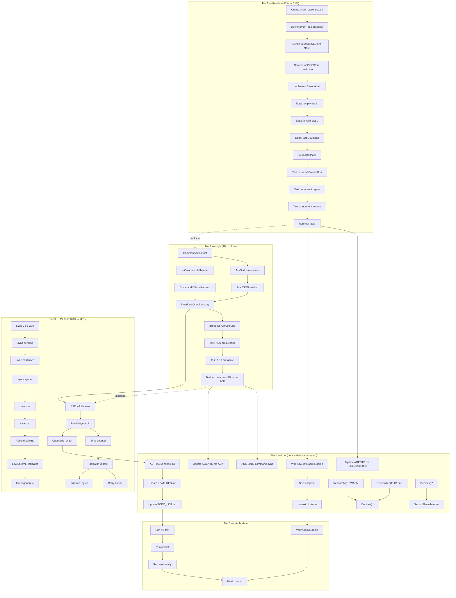

# Offline-First Command Sync — Comprehensive Execution Plan

> **Created:** 2026-06-28 09:38
> **Context:** Research session ([brainstorming doc](../brainstorming/2026-06-27_offline-first-command-sync-research.html)) concluded that cqrs-htmx should sync **commands, not events** — because commands are re-decidable and events are not. This plan turns that research into executable work.
> **Principle:** Every change must compile, pass tests, and not break existing consumers. Library principle: never force opinions.

---

## Pareto Breakdown

### The 1% that delivers 51%

**Production `SSEEventStore` backed by `event.SeekableJournal`.**

This single adapter fills the last missing interface impl in the root module. It gives SSE reconnection real durable replay (not just test helpers), and it's the server-side prerequisite for _every_ sync story — offline, real-time, or both. Zero risk: purely additive, no API changes.

### The 4% that delivers 64%

**SSEEventStore + ACK protocol (command confirmation over SSE).**

The ACK protocol gives clients structured feedback: `{commandId, status, seq}`. This makes the server-side sync story complete. The client can finally know "my command was confirmed" vs "my command was rejected" — the foundation of honest UI.

### The 20% that delivers 80%

**SSEEventStore + ACK protocol + Honest UI rendering in adminui.**

The full Phase 0 + Phase 1. User-visible value: items appear immediately (optimistic) but look different (dashed/muted) until confirmed. Never-silent rollback on rejection. Global sync indicator. This is what the user _feels_.

### The 80% that delivers 20%

Phase 2 (offline queue, SW, OPFS) + Phase 3 (local decide via WASM). Deferred — requires Q1/Q2 answers and is substantially more complex.

---

## Comprehensive Plan (Medium Granularity — 30-100 min tasks)

| #   | Task                                                              | Phase | Impact | Value | Effort | Deps   |
| --- | ----------------------------------------------------------------- | ----- | ------ | ----- | ------ | ------ |
| M1  | SSEEventStore adapter: design + implement                         | P0    | 5      | 5     | 90m    | —      |
| M2  | SSEEventStore adapter: edge cases + tests                         | P0    | 5      | 5     | 60m    | M1     |
| M3  | ACK protocol: types + command ID convention                       | P1    | 5      | 5     | 60m    | —      |
| M4  | ACK protocol: broadcast hook factories                            | P1    | 5      | 5     | 60m    | M3     |
| M5  | ACK protocol: tests                                               | P1    | 4      | 4     | 45m    | M4     |
| M6  | Honest UI: sync-state CSS in tailwind.css                         | P1    | 3      | 5     | 45m    | —      |
| M7  | Honest UI: global sync indicator component                        | P1    | 3      | 5     | 45m    | M6     |
| M8  | Honest UI: JS handlers in admin.js                                | P1    | 4      | 5     | 90m    | M4, M7 |
| M9  | Honest UI: never-silent rejection rendering                       | P1    | 5      | 5     | 45m    | M8     |
| M10 | Honest UI: demo wiring in admin-demo                              | P1    | 3      | 4     | 60m    | M9     |
| M11 | ADR: command-sync architecture (0015)                             | Doc   | 4      | 3     | 45m    | M5     |
| M12 | ADR: honest UI protocol (0016)                                    | Doc   | 3      | 4     | 45m    | M9     |
| M13 | Documentation: AGENTS.md + FEATURES.md updates                    | Doc   | 3      | 3     | 45m    | M5     |
| M14 | Research: Q1 (where does decide() run?) + Q2 (closed-tab writes?) | P2    | 5      | 2     | 60m    | —      |
| M15 | Full test suite + lint verification                               | QA    | 4      | 3     | 45m    | M2, M5 |

**Total medium:** 15 tasks, ~13.5h estimated.

---

## Fine-Grained Breakdown (Max 12 min per task)

### Tier 1 — Keystone (the 1% that delivers 51%)

| #  | Task                                                              | File(s)                   | Effort | Deps | Status |
| -- | ----------------------------------------------------------------- | ------------------------- | ------ | ---- | ------ |
| 1  | Create `event_store_sse.go` with package + imports                | `event_store_sse.go`      | 5m     | —    | ☐      |
| 2  | Define `EventToSSEMapper func(event.Event) SSEEvent` type         | `event_store_sse.go`      | 5m     | 1    | ☐      |
| 3  | Define `JournalSSEStore` struct (journal + mapper + limit)        | `event_store_sse.go`      | 5m     | 2    | ☐      |
| 4  | Implement `NewJournalSSEStore(journal, mapper, opts...)`          | `event_store_sse.go`      | 10m    | 3    | ☐      |
| 5  | Implement `EventsAfter(lastID)` — parse, ReadFrom, map            | `event_store_sse.go`      | 12m    | 4    | ☐      |
| 6  | Handle edge case: empty lastID → configurable behavior            | `event_store_sse.go`      | 8m     | 5    | ☐      |
| 7  | Handle edge case: invalid lastID → return empty slice             | `event_store_sse.go`      | 5m     | 6    | ☐      |
| 8  | Handle edge case: lastID at head → return empty                   | `event_store_sse.go`      | 5m     | 7    | ☐      |
| 9  | Add `Journal` fallback (ReadAll) when SeekableJournal unavailable | `event_store_sse.go`      | 10m    | 8    | ☐      |
| 10 | Write unit test: seed N events, EventsAfter returns ordered       | `event_store_sse_test.go` | 12m    | 9    | ☐      |
| 11 | Write unit test: reconnect with Last-Event-ID → replay            | `event_store_sse_test.go` | 12m    | 10   | ☐      |
| 12 | Write unit test: concurrent EventsAfter calls (race detector)     | `event_store_sse_test.go` | 10m    | 11   | ☐      |
| 13 | Run `go test ./... -race -count=1` on root module                 | —                         | 5m     | 12   | ☐      |

### Tier 2 — High (the 4% that delivers 64%)

| #  | Task                                                           | File(s)              | Effort | Deps   | Status |
| -- | -------------------------------------------------------------- | -------------------- | ------ | ------ | ------ |
| 14 | Define `CommandAck` struct (CommandID, Status, Seq, Error)     | `ack.go`             | 8m     | —      | ☐      |
| 15 | Define `AckStatus` constants (confirmed, rejected)             | `ack.go`             | 3m     | 14     | ☐      |
| 16 | Implement `CommandAck.JSON()` for SSE transport                | `ack.go`             | 5m     | 15     | ☐      |
| 17 | Define `X-Command-Id` header constant + extractor helper       | `ack.go`             | 5m     | 14     | ☐      |
| 18 | Implement `CommandIDFromRequest(r *http.Request) string`       | `ack.go`             | 5m     | 17     | ☐      |
| 19 | Implement `BroadcastOnAck()` hook factory on Broadcaster       | `sse_broadcaster.go` | 12m    | 16, 18 | ☐      |
| 20 | Implement `BroadcastOnAckFunc(fn)` custom variant              | `sse_broadcaster.go` | 8m     | 19     | ☐      |
| 21 | Write test: dispatch success → ACK fires with confirmed        | `ack_test.go`        | 12m    | 20     | ☐      |
| 22 | Write test: dispatch failure → ACK fires with rejected + error | `ack_test.go`        | 12m    | 21     | ☐      |
| 23 | Write test: no X-Command-Id → no ACK broadcast (opt-in)        | `ack_test.go`        | 8m     | 22     | ☐      |

### Tier 3 — Medium (the 20% that delivers 80%)

| #  | Task                                                            | File(s)                   | Effort | Deps | Status |
| -- | --------------------------------------------------------------- | ------------------------- | ------ | ---- | ------ |
| 24 | Add sync-state CSS vars to tailwind.css `:root`                 | `adminui/tailwind.css`    | 8m     | —    | ☐      |
| 25 | Add `.sync-pending` class (opacity, dashed border)              | `adminui/tailwind.css`    | 5m     | 24   | ☐      |
| 26 | Add `.sync-confirmed` class (solid border)                      | `adminui/tailwind.css`    | 5m     | 25   | ☐      |
| 27 | Add `.sync-rejected` class (red border, error bg)               | `adminui/tailwind.css`    | 5m     | 26   | ☐      |
| 28 | Add `.sync-dot` indicator component (8px colored dot)           | `adminui/tailwind.css`    | 5m     | 27   | ☐      |
| 29 | Add `.sync-bar` global indicator component                      | `adminui/tailwind.css`    | 8m     | 28   | ☐      |
| 30 | Rebuild tailwind → admin-tw.css                                 | CLI                       | 5m     | 29   | ☐      |
| 31 | Add sync indicator to layout.templ header area                  | `adminui/layout.templ`    | 12m    | 30   | ☐      |
| 32 | Run `templ generate` in adminui/                                | CLI                       | 5m     | 31   | ☐      |
| 33 | Design SSE ack listener in admin.js (sync:ack event)            | `adminui/assets/admin.js` | 10m    | 19   | ☐      |
| 34 | Implement `handleSyncAck(detail)` — flip data-sync-state        | `adminui/assets/admin.js` | 12m    | 33   | ☐      |
| 35 | Implement sync counter (pending/confirmed/failed)               | `adminui/assets/admin.js` | 10m    | 34   | ☐      |
| 36 | Implement global indicator update (icon + count)                | `adminui/assets/admin.js` | 10m    | 35   | ☐      |
| 37 | Add retry button handler for rejected items                     | `adminui/assets/admin.js` | 8m     | 36   | ☐      |
| 38 | Add `aria-live="polite"` region for confirmed announcements     | `adminui/assets/admin.js` | 8m     | 36   | ☐      |
| 39 | Implement optimistic render: mark pending on htmx:beforeRequest | `adminui/assets/admin.js` | 12m    | 34   | ☐      |

### Tier 4 — Low (documentation + demo + research)

| #  | Task                                                           | File(s)                         | Effort | Deps   | Status |
| -- | -------------------------------------------------------------- | ------------------------------- | ------ | ------ | ------ |
| 40 | Write ADR 0015: command-sync architecture                      | `docs/adr/0015-command-sync.md` | 12m    | 23     | ☐      |
| 41 | Write ADR 0016: honest UI protocol                             | `docs/adr/0016-honest-ui.md`    | 12m    | 39     | ☐      |
| 42 | Update AGENTS.md: SSEEventStore section                        | `AGENTS.md`                     | 10m    | 13     | ☐      |
| 43 | Update AGENTS.md: ACK protocol section                         | `AGENTS.md`                     | 10m    | 23     | ☐      |
| 44 | Update FEATURES.md: honest UI + durable replay                 | `FEATURES.md`                   | 10m    | 41     | ☐      |
| 45 | Wire Broadcaster + SSE into admin-demo service                 | `examples/admin-demo/main.go`   | 12m    | 13     | ☐      |
| 46 | Add SSE endpoint to admin-demo                                 | `examples/admin-demo/main.go`   | 10m    | 45     | ☐      |
| 47 | Add honest-UI mutation demo (create user → pending→confirmed)  | `examples/admin-demo/`          | 12m    | 46, 39 | ☐      |
| 48 | Research Q1: Go→WASM decider paths (TinyGo, standard compiler) | —                               | 12m    | —      | ☐      |
| 49 | Research Q1: TS port effort assessment                         | —                               | 10m    | —      | ☐      |
| 50 | Decide Q1: queue-only vs full-offline                          | —                               | 10m    | 48, 49 | ☐      |
| 51 | Decide Q2: closed-tab writes yes/no                            | —                               | 5m     | —      | ☐      |
| 52 | Decide SW vs SharedWorker from Q1+Q2                           | —                               | 10m    | 50, 51 | ☐      |
| 53 | Update TODO_LIST.md with plan + status                         | `TODO_LIST.md`                  | 10m    | 44     | ☐      |

### Tier 5 — Verification

| #  | Task                                       | File(s) | Effort | Deps | Status |
| -- | ------------------------------------------ | ------- | ------ | ---- | ------ |
| 54 | Run `nix run .#test` (all modules)         | —       | 12m    | 53   | ☐      |
| 55 | Run `nix run .#lint` (root + usermgmt)     | —       | 8m     | 54   | ☐      |
| 56 | Run `nix run .#errorfamily` (0 violations) | —       | 5m     | 55   | ☐      |
| 57 | Verify admin-demo builds + runs            | —       | 8m     | 47   | ☐      |
| 58 | Final commit with detailed message         | —       | 5m     | 56   | ☐      |

---

## Summary

| Tier             | Tasks  | Est. Time | Delivers                            | Gate   |
| ---------------- | ------ | --------- | ----------------------------------- | ------ |
| **1 — Keystone** | 1-13   | ~94m      | Durable SSE replay (unblocks all)   | None   |
| **2 — High**     | 14-23  | ~80m      | ACK protocol (command confirmation) | Tier 1 |
| **3 — Medium**   | 24-39  | ~140m     | Honest UI end-to-end (user-visible) | Tier 2 |
| **4 — Low**      | 40-53  | ~140m     | Docs + demo + research decisions    | Tier 2 |
| **5 — Verify**   | 54-58  | ~38m      | Everything passes                   | All    |
| **Total**        | **58** | **~8.2h** | Full Phase 0 + Phase 1              | —      |

---

## Execution Graph



---

## Critical Path

```
Task 1 → 5 → 9 → 13 → 19 → 21 → 34 → 39 → 47 → 54 → 58
```

This is the spine: SSEEventStore impl → ACK hook → JS handler → optimistic render → demo → verify. Everything else hangs off it.

---

## Architecture Decisions Embedded in This Plan

1. **SSEEventStore wraps `event.SeekableJournal`**, not `event.Store` — because `ReadFrom(afterEventID, limit)` is the exact match for `EventsAfter(lastID)`.
2. **`EventToSSEMapper` is a consumer-provided function** — the library doesn't know how to render HTML from event payloads. The consumer decides what `SSEEvent.Data` contains.
3. **ACK is opt-in** — if no `X-Command-Id` header is present, no ACK is broadcast. This respects the library principle (no forced opinions).
4. **Sync-state is a DOM attribute** (`data-sync-state="pending|confirmed|rejected"`) — no IndexedDB, no client-side store. The CSS classes react to the attribute.
5. **Phase 2 (offline) deferred** — requires Q1/Q2 answers. This plan delivers Phase 0 + Phase 1 only.
