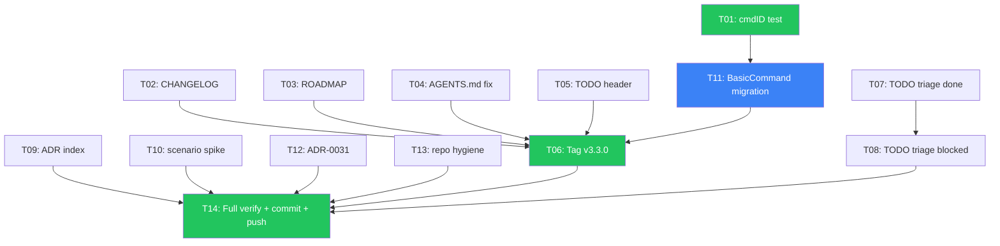

# Superb Next Release — Pareto Execution Plan

**Date:** 2026-06-29 05:47 CEST
**Goal:** Ship v3.3.0 — the cleanest, most adoption-ready release yet
**Principle:** Don't VERSCHLIMMBESSER. Every change must make the system genuinely better, not just different.

---

## Context

- go-cqrs-lite upgraded to v3.4.0 across all 8 modules (committed + pushed)
- cmdID latent bug fixed in 7 commands (committed + pushed)
- SSE lint debt cleared (committed + pushed)
- All tests green, 0 lint issues, errorfamily clean, flake check passes
- Unreleased changes are substantial: idempotency store, ACK protocol, offline sync, v3.4.0 upgrade, cmdID fix

---

## Pareto Breakdown

### 1% that delivers 51% of the result

These 3 tasks unlock a release, prevent the worst bug from recurring, and fix stale docs:

| #   | Task                                                                                                            | Impact                                                         | Effort |
| --- | --------------------------------------------------------------------------------------------------------------- | -------------------------------------------------------------- | ------ |
| 1   | cmdID regression test — table-driven test asserting all 21 commands produce non-zero ID()                       | Prevents recurrence of the bug that silently broke idempotency | 15 min |
| 2   | Tag v3.3.0 release — add CHANGELOG entry, update version references                                             | Ships 3 weeks of unreleased work to consumers                  | 15 min |
| 3   | Fix stale docs — AGENTS.md idempotency claim (already aliases, not local copy), ROADMAP version (v3.2.0→v3.3.0) | Doc integrity                                                  | 15 min |

### 4% that delivers 64% of the result

Adds TODO triage, ADR index, and a scenario/v3 spike:

| #   | Task                                                                  | Impact                                           | Effort |
| --- | --------------------------------------------------------------------- | ------------------------------------------------ | ------ |
| 4   | TODO triage — mark stale items, close done items, reduce 104→~25      | Reduces noise to signal                          | 30 min |
| 5   | ADR index (`docs/adr/INDEX.md`) — one-line summary per ADR            | Navigability for 30 ADRs                         | 15 min |
| 6   | scenario/v3 spike — convert ONE usermgmt decider test to scenario DSL | Proves the BDD pattern, unblocks future adoption | 30 min |

### 20% that delivers 80% of the result

Adds the structural improvements that prevent bug classes and modernize infrastructure:

| #   | Task                                                                                    | Impact                                            | Effort |
| --- | --------------------------------------------------------------------------------------- | ------------------------------------------------- | ------ |
| 7   | Embed `command.BasicCommand` in usermgmt commands — eliminates the cmdID field entirely | Structurally prevents the cmdID bug class forever | 45 min |
| 8   | Write ADR-0031: projectionhost vs CatchUpSubscriber decision                            | Documents the async-startup tradeoff              | 30 min |
| 9   | Clean up `result` symlink + other repo hygiene                                          | Repo cleanliness                                  | 10 min |

---

## Comprehensive Plan (Medium Granularity — 30-100 min each)

| ID  | Task                                              | Impact   | Effort | Dependencies |
| --- | ------------------------------------------------- | -------- | ------ | ------------ |
| T01 | cmdID regression test                             | Critical | 15 min | None         |
| T02 | CHANGELOG v3.3.0 entry                            | High     | 20 min | None         |
| T03 | Update ROADMAP.md versions                        | Medium   | 15 min | None         |
| T04 | Fix AGENTS.md stale idempotency claim             | Medium   | 10 min | None         |
| T05 | Fix TODO_LIST.md stale header (version, coverage) | Medium   | 10 min | None         |
| T06 | Tag v3.3.0                                        | High     | 10 min | T01-T05      |
| T07 | TODO triage: mark completed items [x]             | High     | 30 min | None         |
| T08 | TODO triage: close stale/blocked items [-]        | High     | 20 min | T07          |
| T09 | ADR index (`docs/adr/INDEX.md`)                   | Medium   | 15 min | None         |
| T10 | scenario/v3 spike on RegisterUserCmd decider      | Medium   | 30 min | None         |
| T11 | Embed `command.BasicCommand` in all 21 commands   | High     | 45 min | T01          |
| T12 | Write ADR-0031: projection lifecycle decision     | High     | 30 min | None         |
| T13 | Remove `result` symlink + repo hygiene            | Low      | 10 min | None         |
| T14 | Full verification + commit + push                 | Critical | 15 min | T01-T13      |

**Total: ~4.5 hours of focused work across 14 tasks**

---

## Detailed Breakdown (Fine Granularity — max 15 min each)

| Sub-ID | Parent | Micro-Task                                                                      | Effort |
| ------ | ------ | ------------------------------------------------------------------------------- | ------ |
| S01    | T01    | Create `usermgmt/es_command_id_test.go` with table-test for all 21 constructors | 15 min |
| S02    | T02    | Write CHANGELOG v3.3.0 section: Added (cmdID fix, v3.4.0 upgrade)               | 10 min |
| S03    | T02    | Write CHANGELOG v3.3.0 section: Changed (lint cleared, deps upgraded)           | 10 min |
| S04    | T03    | Update ROADMAP "Current State" from v3.2.0 to v3.3.0                            | 5 min  |
| S05    | T03    | Update ROADMAP shipped/ planned sections with v3.4.0 adoption status            | 10 min |
| S06    | T04    | Fix AGENTS.md: remove "local copy" claim for idempotency (already aliases)      | 5 min  |
| S07    | T04    | Fix AGENTS.md: update idempotency section to reflect upstream v3.4.0 tagged     | 5 min  |
| S08    | T05    | Update TODO_LIST.md header (version v3.2.0→v3.3.0, coverage, lint)              | 5 min  |
| S09    | T06    | Tag v3.3.0 after all changes are committed                                      | 5 min  |
| S10    | T07    | Read TODO_LIST "Open Items" section, identify completed items                   | 10 min |
| S11    | T07    | Mark completed items as [x] in TODO_LIST                                        | 10 min |
| S12    | T08    | Identify stale/blocked items (email branded type, webauthn request, snapshot)   | 10 min |
| S13    | T08    | Mark blocked items as [-] with explanation                                      | 10 min |
| S14    | T09    | Generate ADR index from `docs/adr/*.md` titles                                  | 10 min |
| S15    | T10    | Add scenario/v3 to usermgmt go.mod                                              | 5 min  |
| S16    | T10    | Convert RegisterUserCmd decide test to `scenario.Given`                         | 10 min |
| S17    | T11    | Research: read how command.BasicCommand embedding works                         | 5 min  |
| S18    | T11    | Convert es_commands.go (11 commands) to embed BasicCommand                      | 15 min |
| S19    | T11    | Convert es_membership_commands.go (3 commands) to embed BasicCommand            | 10 min |
| S20    | T11    | Convert es_tenant_commands.go (4 commands) to embed BasicCommand                | 10 min |
| S21    | T11    | Convert es_bot_commands.go (3 commands) to embed BasicCommand                   | 10 min |
| S22    | T11    | Update T01 regression test for new BasicCommand pattern                         | 10 min |
| S23    | T11    | Build + test + lint after BasicCommand migration                                | 10 min |
| S24    | T12    | Draft ADR-0031: document projectionhost vs CatchUpSubscriber tradeoff           | 15 min |
| S25    | T13    | Check `result` symlink, remove if stale                                         | 5 min  |
| S26    | T14    | Run `nix run .#test` (all modules)                                              | 5 min  |
| S27    | T14    | Run `nix run .#lint` + errorfamily + flake check                                | 5 min  |
| S28    | T14    | Commit all changes with detailed message                                        | 5 min  |

---

## Execution Order (Dependency-Safe)

**Green = 1% tier (do first), Blue = 20% tier (structural fix)**

---

## What's NOT in this plan (and why)

- **projectionhost adoption** — Needs ADR-0031 decision first (T12). Actual adoption is a separate release.
- **scheduling/v3 for eviction.go** — Medium impact, 1-day effort. Deferred to post-v3.3.0.
- **Phase 2b IndexedDB** — ADR-0030 is proposed. Implementation is a separate milestone.
- **Email branded type** — Blocked by event serialization. Needs major version + upcaster.
- **kv.Cache, multi-DB split, graph tier, prometheus** — Nice-to-haves, not release-blocking.

---

_Generated 2026-06-29 05:47 CEST_
