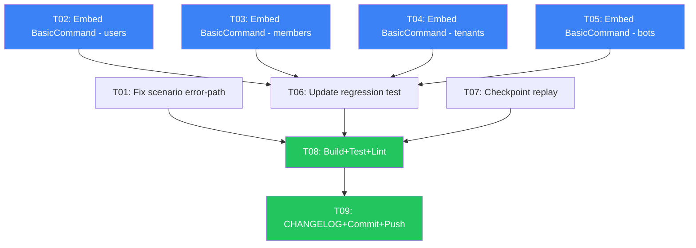

# Structural Hardening — Pareto Execution Plan

**Date:** 2026-06-29 06:22 CEST
**Goal:** Eliminate the cmdID bug class structurally, fix scenario spike, add checkpoint-based replay
**Principle:** Don't VERSCHLIMMBESSER. Every change must make the system genuinely better.

---

## Context

After releasing v3.3.0, deep research revealed three corrections to earlier assessments:

1. **BasicCommand embedding is NON-breaking** — constructors stay `(*Cmd)`, not `(*Cmd, error)`. The embedded `*command.BasicCommand` auto-mints ID/Type/AggregateID via promoted methods. Eliminates 60 lines of boilerplate and makes the zero-cmdID bug structurally impossible.

2. **scenario/v3 error-path WORKS today** — `go-error-family`'s `*Error` already implements `Is(target)` matching by code+family. My earlier spike used a wrong custom type. Need to fix the test.

3. **Checkpoint-based replay is 10 lines** — the main performance win from CatchUpSubscriber (no full journal replay on restart) can be achieved without adopting the subscriber pattern. Just change `ReadAll()` → `ReadFrom(checkpoint, 0)`.

---

## Pareto Breakdown

### 1% that delivers 51% of the result

| #   | Task                                  | Impact                                            | Effort |
| --- | ------------------------------------- | ------------------------------------------------- | ------ |
| 1   | Fix scenario spike error-path test    | Proves BDD DSL works for both happy + error paths | 10 min |
| 2   | Embed BasicCommand in all 20 commands | Structurally eliminates cmdID bug class forever   | 45 min |

### 4% that delivers 64% of the result

| #   | Task                                            | Impact                                             | Effort |
| --- | ----------------------------------------------- | -------------------------------------------------- | ------ |
| 3   | Add checkpoint-based replay to StartProjections | No full journal replay on restart (major perf win) | 30 min |
| 4   | Update regression test for BasicCommand pattern | Ensures test still guards after embedding          | 10 min |

### 20% that delivers 80% of the result

| #   | Task                                          | Impact                         | Effort |
| --- | --------------------------------------------- | ------------------------------ | ------ |
| 5   | Full verification + CHANGELOG update + commit | Ships the structural hardening | 20 min |

---

## Comprehensive Plan (Medium Granularity)

| ID  | Task                                                                   | Impact   | Effort | Dependencies |
| --- | ---------------------------------------------------------------------- | -------- | ------ | ------------ |
| T01 | Fix scenario spike: add error-path test using event.NewConflict target | Medium   | 10 min | None         |
| T02 | Embed BasicCommand in es_commands.go (11 commands)                     | Critical | 20 min | None         |
| T03 | Embed BasicCommand in es_membership_commands.go (3 commands)           | Critical | 10 min | None         |
| T04 | Embed BasicCommand in es_tenant_commands.go (4 commands)               | Critical | 10 min | None         |
| T05 | Embed BasicCommand in es_bot_commands.go (2 commands)                  | Critical | 10 min | None         |
| T06 | Update es_command_id_test.go for embedded pattern                      | High     | 10 min | T02-T05      |
| T07 | Add checkpoint store to StartProjections + ReadFrom replay             | High     | 30 min | None         |
| T08 | Build + test + lint all modules                                        | Critical | 15 min | T01-T07      |
| T09 | Update CHANGELOG + AGENTS.md + commit + push                           | High     | 15 min | T08          |

**Total: ~2 hours across 9 tasks**

---

## Detailed Breakdown (Fine Granularity — max 15 min each)

| Sub-ID | Parent | Micro-Task                                                                                                 | Effort |
| ------ | ------ | ---------------------------------------------------------------------------------------------------------- | ------ |
| S01    | T01    | Fix scenario test: add TestScenario_RegisterUser_AlreadyExists using event.NewConflict as ThenError target | 10 min |
| S02    | T02    | Convert RegisterUserCmd: remove aggregateID+cmdID fields, embed \*command.BasicCommand, update constructor | 10 min |
| S03    | T02    | Convert ChangeEmailCmd, ChangeDisplayNameCmd, DeleteUserCmd (same pattern)                                 | 10 min |
| S04    | T02    | Convert AddCredentialCmd, RemoveCredentialCmd, VerifyEmailCmd (same pattern)                               | 10 min |
| S05    | T02    | Convert EnableTOTPCmd, DisableTOTPCmd, LinkExternalAccountCmd, UnlinkExternalAccountCmd                    | 10 min |
| S06    | T03    | Convert AddMemberCmd, UpdateMemberRolesCmd, RemoveMemberCmd                                                | 10 min |
| S07    | T04    | Convert CreateTenantCmd, SuspendTenantCmd, ReactivateTenantCmd, DeleteTenantCmd                            | 10 min |
| S08    | T05    | Convert RegisterBotCmd, DeleteBotCmd                                                                       | 10 min |
| S09    | T06    | Update regression test: fields now accessed via c.BasicCommand, not c.cmdID                                | 10 min |
| S10    | T07    | Add event.CheckpointStore param to StartProjections signature                                              | 10 min |
| S11    | T07    | Replace journal.ReadAll with journal.ReadFrom(checkpoint, 0) + save checkpoint after replay                | 10 min |
| S12    | T07    | Update all 3 callers (es_setup.go, sqlite_setup.go, postgres_setup.go)                                     | 10 min |
| S13    | T08    | Build all 8 modules                                                                                        | 5 min  |
| S14    | T08    | Test all modules with race detector                                                                        | 5 min  |
| S15    | T08    | Lint all 3 modules                                                                                         | 5 min  |
| S16    | T09    | Update CHANGELOG with structural hardening entry                                                           | 5 min  |
| S17    | T09    | Commit + push                                                                                              | 5 min  |

---

## Execution Order

**Blue = structural fix, Green = verification/ship**

---

_Generated 2026-06-29 06:22 CEST_
