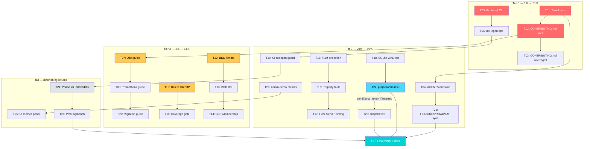

# Post-v3.3.0 Quality & Adoption Blitz — Pareto Execution Plan

**Generated:** 2026-06-29 10:09 | **Git HEAD:** `179c942` | **Version:** v3.3.0 (go-cqrs-lite v3.4.0)
**Author:** Pareto-planning skill | **Branch:** `master` (clean, synced with origin)

---

## Executive Summary

The project is in **excellent, production-ready shape** — all quality gates green (build, test, lint, errorfamily, flake). This plan takes the **40 open work items** discovered across TODO_LIST.md, ROADMAP.md, FEATURES.md, CONTRIBUTING.md, 33 ADRs, and 2 recent status reports, and applies the **Pareto principle** to sequence them by impact/effort/customer-value.

The single governing constraint: **DO NOT VERSCHLIMMBESSER.** Every change must leave the system better, not just different. Risky upstream-adoption refactors (projectionhost/v3, snapshot/v3) are attempted only with full end-to-end verification and reverted if they regress. Deferred/blocked items (ActorID split-brain, Email branded type, WebAuthn `*http.Request`, god-package decomposition) are explicitly excluded — they need major-version or upstream decisions.

---

## Source Audit — Where the 40 Items Came From

| Source                     | Open items found                                                                                                                     |
| -------------------------- | ------------------------------------------------------------------------------------------------------------------------------------ |
| `TODO_LIST.md`             | 1 (Phase 2b IndexedDB, ADR-0030 Proposed)                                                                                            |
| `ROADMAP.md`               | 9 (v3.3.0 OTel/Prometheus, v3.4.0 projectionhost/CatchUp/scenario/snapshot/profiling/bench, v3.2.0 ClientIP, v4.0.0 kv.Cache/schema) |
| `FEATURES.md`              | 1 (ClientIP PARTIALLY_FUNCTIONAL, metrics drift)                                                                                     |
| `CONTRIBUTING.md` (root)   | **8 stale references** — catalog (deleted), module count 5→8, password auth, file tree, test framework                               |
| `usermgmt/CONTRIBUTING.md` | 1 (boilerplate placeholder)                                                                                                          |
| `flake.nix`                | 2 (stale package version 3.1.0, no `.#gen` app)                                                                                      |
| `docs/adr/INDEX.md`        | 2 statuses (ADR-0030 Proposed, ADR-0019 Blocked)                                                                                     |
| `docs/adr/0015`            | 2 rows still "Planned" (schema upcasters, Remove Roles from UserState)                                                               |
| Status report §f (Top-25)  | 25 prioritized next tasks                                                                                                            |
| Code (LSP infos)           | 2 (es_scenario_test.go infertypeargs)                                                                                                |

---

## Pareto Breakdown

### 🔴 1% that delivers 51% of the result

> The single highest-leverage intervention. Do this first, do it perfectly.

**Fix the contributor-onboarding trust signals.** Right now a new contributor reading `CONTRIBUTING.md` finds references to a **deleted module** (catalog), the **wrong module count** (5 not 8), **password auth** (removed), and a **stale file tree**. Simultaneously, every `templ generate` churns 6 generated files between two import styles, creating perpetual "dirty tree" noise. These two together are the strongest "this project is unmaintained" signals despite the codebase being excellent. Fixing them is cheap and instantly raises credibility.

| Item                                                        | Why 51%                                                     |
| ----------------------------------------------------------- | ----------------------------------------------------------- |
| Rewrite `CONTRIBUTING.md` (root + usermgmt)                 | First file contributors read; currently actively misleading |
| Pin templ CLI + add codegen normalization                   | Eliminates the #1 source of git noise (every session)       |
| Trivial fixes (ROADMAP typo, LSP infos, flake version bump) | Closes obvious debt in seconds                              |

### 🟡 4% that delivers 64% of the result

> The "most customers ask for this" tier. High value, low risk.

| Item                                               | Why 64%                                                                        |
| -------------------------------------------------- | ------------------------------------------------------------------------------ |
| OTel seam wiring guide                             | Most-asked "how do I add observability" — upstream exists, just needs a recipe |
| Prometheus `/metrics` wiring guide                 | Second-most-asked; completes the observability story                           |
| Consumer migration guide v3→v3.3                   | Documents the checkpoint-replay opt-in consumers need                          |
| Delete deprecated `ClientIP()` wrapper             | Been Open/Low for weeks; one breaking change closes it                         |
| Raise usermgmt coverage gate 75%→78%               | Locks in real gains (actual 79.5%)                                             |
| scenario/v3 BDD for Tenant/Bot/Membership deciders | The DSL is clearly the future; only 2/7 migrated                               |

### 🟢 20% that delivers 80% of the result

> Medium effort, real value. The "make it robust" tier.

| Item                                                           | Why 80%                                                      |
| -------------------------------------------------------------- | ------------------------------------------------------------ |
| Fuzz + property tests (projection dedup, folds, Server-Timing) | Catches the bugs unit tests miss                             |
| CI codegen-drift guard                                         | Prevents the templ oscillation from recurring silently       |
| Server-Timing admin-demo polish + metrics panel                | Showcases the v3.3.0 feature                                 |
| `projectionhost/v3` adoption (conditional)                     | Biggest code reduction — IF safe to replace StartProjections |
| `snapshot/v3` integration (conditional)                        | Performance for large aggregates — IF safe                   |
| FEATURES.md + AGENTS.md sync                                   | Keeps docs honest with code                                  |

### ⚪ The remaining 80% (diminishing returns, deferred, or blocked)

> Explicitly OUT of scope for this blitz. Documented, not executed.

| Item                                   | Status         | Why deferred                                 |
| -------------------------------------- | -------------- | -------------------------------------------- |
| Phase 2b IndexedDB (ADR-0030)          | Proposed       | Design not Accepted yet                      |
| ActorID split-brain                    | Blocked        | Needs shared identity module (major version) |
| Email branded domain type              | Blocked        | Needs event upcaster (major version)         |
| Extract `*http.Request` from WebAuthn  | Blocked        | Upstream go-webauthn API limitation          |
| god-package decomposition (ADR-0019)   | Blocked        | Needs architectural redesign                 |
| Performance profiling / 10K benchmarks | Low            | No production user hits limits               |
| `kv.Cache` / `schema/v3` upcasters     | Planned v4.0.0 | Future major work                            |
| `CatchUpSubscriber`                    | Deferred       | Needs sync-wait wrapper (ADR-0031)           |

---

## Medium-Granularity Plan (30–100 min each)

Sorted by impact (desc) → effort (asc) → customer-value (desc).

| ID  | Task                                                                                                           | Tier | Impact   | Effort | Risk     |
| --- | -------------------------------------------------------------------------------------------------------------- | ---- | -------- | ------ | -------- |
| T01 | Trivial fixes: ROADMAP typo, LSP infertypeargs, flake.nix version bump, ADR-0015 Planned rows                  | 1%   | High     | 15m    | None     |
| T02 | Rewrite root `CONTRIBUTING.md` — remove catalog, fix module count 5→8, passwordless, file tree, test framework | 1%   | Critical | 45m    | None     |
| T03 | Rewrite `usermgmt/CONTRIBUTING.md` — real module conventions, GOWORK=off, event-sourced arch                   | 1%   | High     | 30m    | None     |
| T04 | Add new files to AGENTS.md tree (responsewriter.go, server_timing.go, etc.) + sync doc claims                  | 20%  | Medium   | 20m    | None     |
| T05 | Pin templ CLI in flake.nix devShell + add codegen normalization step                                           | 1%   | Critical | 60m    | Low      |
| T06 | Add `nix run .#gen` app for templ codegen                                                                      | 1%   | Medium   | 15m    | None     |
| T07 | Write OTel seam wiring guide (`otel/v3` + `middleware/v3` → `Config` hooks)                                    | 4%   | High     | 75m    | None     |
| T08 | Write Prometheus `/metrics` seam wiring guide                                                                  | 4%   | Medium   | 40m    | None     |
| T09 | Write consumer migration guide v3→v3.3 (checkpoint replay opt-in)                                              | 4%   | Medium   | 35m    | None     |
| T10 | Delete deprecated `ClientIP()` wrapper (breaking change)                                                       | 4%   | Medium   | 30m    | Low      |
| T11 | Raise usermgmt coverage gate 75%→78% in flake.nix                                                              | 4%   | Medium   | 15m    | None     |
| T12 | scenario/v3 BDD: Tenant decider (happy + negative paths)                                                       | 4%   | High     | 60m    | None     |
| T13 | scenario/v3 BDD: Bot decider (happy + negative paths)                                                          | 4%   | Medium   | 60m    | None     |
| T14 | scenario/v3 BDD: Membership decider (happy + negative paths)                                                   | 4%   | Medium   | 60m    | None     |
| T15 | Fuzz tests: projection dedup + identity deciders (expand existing)                                             | 20%  | Medium   | 50m    | None     |
| T16 | Property-based tests: foldTenant/foldBot/foldMembership (expand)                                               | 20%  | Medium   | 50m    | None     |
| T17 | Fuzz test: Server-Timing HeaderValue (adversarial metric names)                                                | 20%  | Low      | 25m    | None     |
| T18 | Integration test: real SQLite WAL + projections end-to-end                                                     | 20%  | Medium   | 50m    | None     |
| T19 | CI codegen-drift guard (verify `_templ.go` match `.templ` sources)                                             | 20%  | High     | 35m    | None     |
| T20 | Server-Timing admin-demo: add more example metrics + `?debug=1` showcase                                       | 20%  | Low      | 30m    | None     |
| T21 | FEATURES.md + ROADMAP.md metrics/status sync                                                                   | 20%  | Medium   | 25m    | None     |
| T22 | **Adopt `projectionhost/v3`** — replace hand-rolled `StartProjections` (conditional)                           | 20%  | High     | 90m    | **HIGH** |
| T23 | **Adopt `snapshot/v3`** for aggregates 100+ events (conditional)                                               | 20%  | Medium   | 90m    | **HIGH** |
| T24 | Phase 2b IndexedDB persistent offline queue (ADR-0030 Proposed)                                                | tail | High     | 90m+   | Medium   |
| T25 | Admin UI Server-Timing metrics panel in dashboard                                                              | tail | Low      | 60m    | Low      |
| T26 | Performance profiling + 10K-event projection benchmark                                                         | tail | Low      | 60m    | None     |
| T27 | Document deferred items + final comprehensive verification                                                     | all  | Critical | 30m    | None     |

**Effort key:** 15–30m = S, 30–60m = M, 60–90m = L, 90m+ = XL.

---

## Fine-Grained Breakdown (≤ 15 min each)

Sorted by execution sequence (respecting dependencies), grouped by parent task.

| ID  | Micro-task                                                                           | Parent | Time |
| --- | ------------------------------------------------------------------------------------ | ------ | ---- |
| F01 | Fix `ROADMAP.md:89` typo "v3.30"→"v3.3.0"                                            | T01    | 1m   |
| F02 | Remove unnecessary type args at `es_scenario_test.go:28`                             | T01    | 1m   |
| F03 | Remove unnecessary type args at `es_scenario_test.go:59`                             | T01    | 1m   |
| F04 | Bump `flake.nix` package version `3.1.0`→`3.3.0`                                     | T01    | 2m   |
| F05 | Verify ADR-0015 "Planned" rows (schema upcasters, Remove Roles) — update status      | T01    | 10m  |
| F06 | Run build+test+lint to verify T01 fixes                                              | T01    | 5m   |
| F07 | Read root `CONTRIBUTING.md` fully, catalog all stale claims                          | T02    | 5m   |
| F08 | Rewrite CONTRIBUTING.md module section (remove catalog, 8 modules)                   | T02    | 10m  |
| F09 | Rewrite CONTRIBUTING.md test framework section (testing + scenario DSL)              | T02    | 10m  |
| F10 | Rewrite CONTRIBUTING.md file tree (add new files, remove dead ones)                  | T02    | 10m  |
| F11 | Rewrite CONTRIBUTING.md auth section (passwordless, WebAuthn)                        | T02    | 5m   |
| F12 | Verify CONTRIBUTING.md build/test/lint commands are accurate                         | T02    | 5m   |
| F13 | Read usermgmt/CONTRIBUTING.md                                                        | T03    | 2m   |
| F14 | Write usermgmt CONTRIBUTING.md: GOWORK=off, event-sourced arch, fold/decide pattern  | T03    | 15m  |
| F15 | Add responsewriter.go to AGENTS.md file tree                                         | T04    | 3m   |
| F16 | Add server_timing.go + other new files to AGENTS.md tree                             | T04    | 5m   |
| F17 | Verify AGENTS.md file count / event-command counts are current                       | T04    | 10m  |
| F18 | Read flake.nix devShell to find templ CLI entry                                      | T05    | 5m   |
| F19 | Research canonical templ CLI version (check go.mod pin v0.3.1020)                    | T05    | 10m  |
| F20 | Pin templ CLI version in flake.nix devShell                                          | T05    | 10m  |
| F21 | Add codegen normalization (templ fmt or gofmt post-step)                             | T05    | 10m  |
| F22 | Run `templ generate` + verify zero dirty files                                       | T05    | 5m   |
| F23 | Add `.#gen` nix app running `templ generate` in adminui                              | T06    | 10m  |
| F24 | Verify `nix run .#gen` produces clean tree                                           | T06    | 5m   |
| F25 | Research go-cqrs-lite otel/v3 + middleware/v3 API surface                            | T07    | 15m  |
| F26 | Write OTel wiring guide doc with BeforeDispatch/AfterDispatch hooks example          | T07    | 15m  |
| F27 | Add runnable OTel example test (example_otel_test.go already exists — verify/extend) | T07    | 15m  |
| F28 | Research go-cqrs-lite prometheus/v3 API surface                                      | T08    | 10m  |
| F29 | Write Prometheus `/metrics` wiring guide doc                                         | T08    | 15m  |
| F30 | Write consumer migration guide: checkpoint replay opt-in (CheckpointStore)           | T09    | 15m  |
| F31 | Write consumer migration guide: BasicCommand embedding impact                        | T09    | 10m  |
| F32 | Find all ClientIP() usages (grep)                                                    | T10    | 5m   |
| F33 | Remove ClientIP() wrapper, update callers to httputil.ClientIP                       | T10    | 10m  |
| F34 | Update FEATURES.md ClientIP status                                                   | T10    | 3m   |
| F35 | Run build+test to verify removal                                                     | T10    | 5m   |
| F36 | Bump coverage gate 75→78 in flake.nix `.#coverage-gate`                              | T11    | 5m   |
| F37 | Run `nix run .#coverage-gate` to verify pass                                         | T11    | 10m  |
| F38 | Read existing scenario test (es_scenario_test.go) for DSL pattern                    | T12    | 5m   |
| F39 | Read es_tenant_decide.go for Tenant decision logic                                   | T12    | 10m  |
| F40 | Write Tenant scenario: CreateTenant happy path                                       | T12    | 15m  |
| F41 | Write Tenant scenario: Suspend/Reactivate/Delete negative paths                      | T12    | 15m  |
| F42 | Read es_bot_decide.go for Bot decision logic                                         | T13    | 10m  |
| F43 | Write Bot scenario: RegisterBot happy path                                           | T13    | 15m  |
| F44 | Write Bot scenario: DeleteBot negative paths                                         | T13    | 10m  |
| F45 | Read es_membership_decide.go for Membership logic                                    | T14    | 10m  |
| F46 | Write Membership scenario: AddMember happy path                                      | T14    | 15m  |
| F47 | Write Membership scenario: UpdateRoles/RemoveMember negative paths                   | T14    | 15m  |
| F48 | Read existing fuzz tests for pattern                                                 | T15    | 5m   |
| F49 | Write fuzz test: projection dedup (duplicate event IDs)                              | T15    | 15m  |
| F50 | Write fuzz test: identity decider (Tenant/Bot decide)                                | T15    | 15m  |
| F51 | Read existing property tests (rapid-based foldUser)                                  | T16    | 5m   |
| F52 | Write property test: foldTenant invariants                                           | T16    | 15m  |
| F53 | Write property test: foldBot invariants                                              | T16    | 15m  |
| F54 | Write property test: foldMembership invariants                                       | T16    | 15m  |
| F55 | Write fuzz test: Server-Timing HeaderValue (adversarial names/descs/durs)            | T17    | 15m  |
| F56 | Read sqlite_setup.go + projection integration for test pattern                       | T18    | 10m  |
| F57 | Write integration test: SQLite WAL + projection replay end-to-end                    | T18    | 15m  |
| F58 | Write codegen-drift CI check script (diff \_templ.go vs templ generate output)       | T19    | 15m  |
| F59 | Wire codegen-drift check into flake.nix app or pre-commit                            | T19    | 10m  |
| F60 | Add Server-Timing example metrics to admin-demo handlers                             | T20    | 15m  |
| F61 | Sync FEATURES.md coverage/test counts + version header                               | T21    | 10m  |
| F62 | Sync ROADMAP.md status columns (mark completed items)                                | T21    | 10m  |
| F63 | Research projectionhost/v3 API (go-cqrs-lite source)                                 | T22    | 15m  |
| F64 | Prototype projectionhost replacement for StartProjections                            | T22    | 15m  |
| F65 | Run full test suite — if ANY regression, REVERT and document                         | T22    | 15m  |
| F66 | Research snapshot/v3 API (go-cqrs-lite source)                                       | T23    | 15m  |
| F67 | Prototype snapshot integration into decider Repository                               | T23    | 15m  |
| F68 | Run full test suite — if ANY regression, REVERT and document                         | T23    | 15m  |
| F69 | Read ADR-0030 acceptance criteria for Phase 2b                                       | T24    | 10m  |
| F70 | Implement IndexedDB persistence in sync-worker.js                                    | T24    | 15m  |
| F71 | Implement drain-on-spawn + delete-on-ACK                                             | T24    | 15m  |
| F72 | Write integration test: close tab, reopen, verify drain                              | T24    | 15m  |
| F73 | Add Server-Timing metrics panel to adminui dashboard templ                           | T25    | 15m  |
| F74 | Profile dispatch + decode hot paths (pprof)                                          | T26    | 15m  |
| F75 | Write 10K-event projection replay benchmark                                          | T26    | 15m  |
| F76 | Write deferred-items section to this plan (final status)                             | T27    | 10m  |
| F77 | Run full verification suite (build/test/lint/errorfamily/flake/fmt)                  | T27    | 10m  |
| F78 | Update TODO_LIST.md — mark all completed items                                       | T27    | 10m  |
| F79 | Update ROADMAP.md — mark all completed items                                         | T27    | 10m  |
| F80 | Update CHANGELOG.md with all new entries                                             | T27    | 10m  |

---

## Execution Graph



---

## Risk Register — Anti-Verschlimmbessern Checklist

> Every task must pass these gates before commit. If a task fails, REVERT immediately.

| Risk                                          | Mitigation                                                                                                                                            |
| --------------------------------------------- | ----------------------------------------------------------------------------------------------------------------------------------------------------- |
| **projectionhost/v3 breaks projections**      | Prototype in isolation → run FULL test suite with `-race` → if ANY test fails or behavior changes, REVERT and write a detailed migration note instead |
| **snapshot/v3 corrupts event replay**         | Same protocol: isolate → test → revert on any regression                                                                                              |
| **ClientIP removal breaks consumers**         | It delegates to `httputil.ClientIP` already — verify no direct callers remain; this is a documented breaking change (acceptable for the value)        |
| **templ pin breaks devShell**                 | Pin to the version that produces the committed (grouped) form; verify `nix develop` still works                                                       |
| **scenario/v3 BDD tests are wrong**           | Compare against existing decider tests — the BDD must exercise the SAME decision logic, not new logic                                                 |
| **Fuzz/property tests are flaky**             | Use deterministic seeds; run 10x with `-race` before commit                                                                                           |
| **Doc changes claim things that aren't true** | Every doc claim verified against actual code before writing                                                                                           |

**Golden rule:** When in doubt, REVERT. A reverted change costs nothing. A broken build costs trust.

---

## Verification Protocol

After EACH task group (not each micro-task):

```bash
nix run .#build          # all modules compile
nix run .#test           # all pass with -race
nix run .#lint           # 0 issues
nix run .#errorfamily    # 0 violations
nix flake check          # formatting + apps
```

Commit + push after each Tier completes. Never leave the tree in a broken state.
