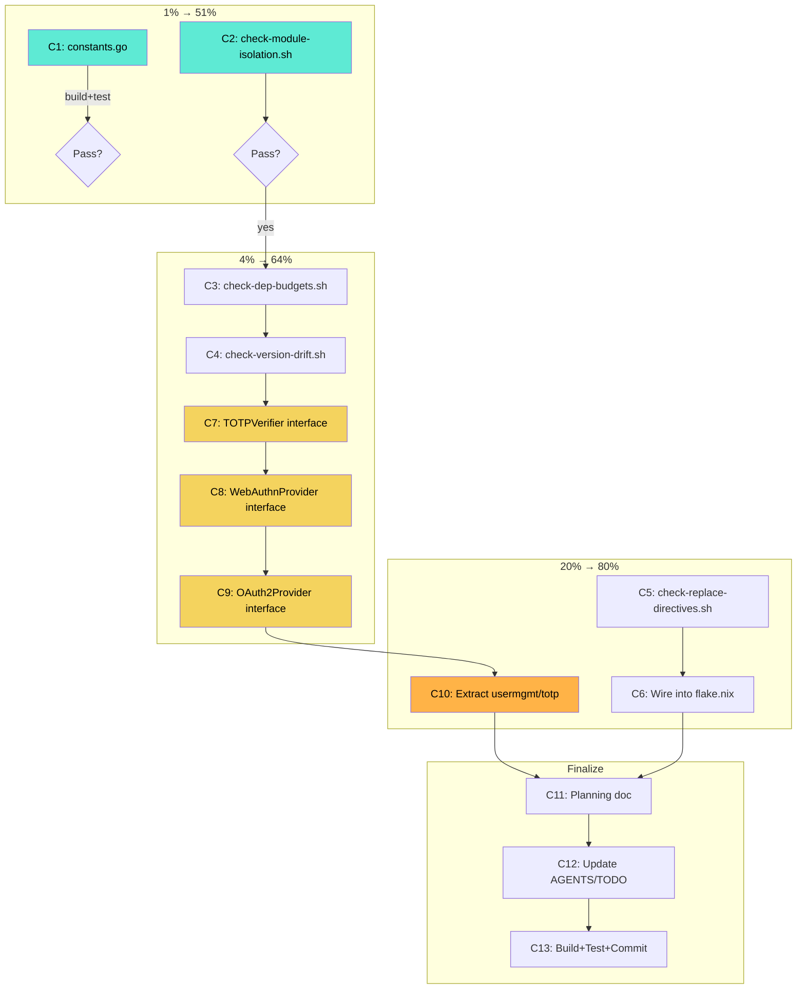

# Sollbruchstellen Execution Plan — cqrs-htmx

> **Date:** 2026-07-01 18:27
> **Status:** Active
> **Pareto Principle:** Find the 1% that delivers 51%, the 4% that delivers 64%, the 20% that delivers 80%

---

## Pareto Breakdown

### The 1% That Delivers 51%

| Task                                     | Why                                                                                                                    | Time   |
| ---------------------------------------- | ---------------------------------------------------------------------------------------------------------------------- | ------ |
| `constants.go` — move 6 shared constants | Breaks the "indivisible cycle" myth. Unlocks clear thinking about root module boundaries.                              | 5 min  |
| `scripts/check-module-isolation.sh`      | Prevents the #1 failure mode: modules that build with go.work but fail GOWORK=off. Catches missing replace directives. | 30 min |

**Rationale:** The cycle myth blocked all root-module analysis for weeks. Breaking it with 6 lines of code is the highest-leverage change in the entire project. The CI script prevents future degradation — go-cqrs-lite's entire architecture discipline comes from this one script.

### The 4% That Delivers 64%

| Task                                   | Why                                                                                                                                          | Time   |
| -------------------------------------- | -------------------------------------------------------------------------------------------------------------------------------------------- | ------ |
| Above + `check-dep-budgets.sh`         | Enforces per-module dependency limits. Prevents god-modules from accumulating.                                                               | 30 min |
| Above + `check-version-drift.sh`       | Detects sibling modules referencing different versions of the same internal dep.                                                             | 30 min |
| Above + auth strategy interface design | Write `TOTPVerifier`, `WebAuthnProvider`, `OAuth2Provider` interfaces in usermgmt core. Non-breaking addition — prepares v4 seam explicitly. | 45 min |

**Rationale:** CI enforcement is the difference between "good architecture" and "architecture that stays good." The auth interfaces make the v4 extraction plan concrete — instead of "extract totp.go somewhere," we have a compile-time contract.

### The 20% That Delivers 80%

| Task                                                                           | Why                                                                                         | Time   |
| ------------------------------------------------------------------------------ | ------------------------------------------------------------------------------------------- | ------ |
| Above + `check-replace-directives.sh`                                          | Prevents absolute paths in replace directives (portability).                                | 20 min |
| Above + wire all CI scripts into `flake.nix`                                   | Makes `nix run .#check-modules` the one-command architecture audit.                         | 20 min |
| Above + proof-of-concept: extract `usermgmt/totp` as first v4 auth sub-package | Validates the interface design with real code. Moves totp.go behind TOTPVerifier interface. | 90 min |

**Rationale:** The TOTP extraction is the simplest auth strategy (1 file, 244 lines, clear interface boundary). It validates the entire v4 approach with minimal risk. Once it works, WebAuthn and OAuth2 follow the same pattern.

### What's NOT Worth Doing (Verschlimmbesserung Prevention)

| Rejected Task                                                                   | Why Rejected                                                                                                                                                                         |
| ------------------------------------------------------------------------------- | ------------------------------------------------------------------------------------------------------------------------------------------------------------------------------------ |
| Root module sub-package extraction (servertiming, security, ratelimit, SSE, WS) | **Same go.mod = same dependency tree.** Consumers gain NOTHING. Adding 30+ re-export wrapper functions is pure boilerplate. The flat package is correct for a single-module library. |
| usermgmt domain layer sub-package extraction (20 files)                         | Same go.mod problem. Plus the domain types are deeply referenced by Service — moving them creates import cycles or requires massive re-export surface.                               |
| usermgmt SQL sub-package extraction (9 files)                                   | Same go.mod problem. SQL types are deeply integrated into Service construction.                                                                                                      |

**Key insight:** Sub-package extraction within the same Go module adds complexity without reducing transitive dependencies. Only SEPARATE Go modules (separate go.mod) reduce consumer deps. That's a v4 change.

---

## Comprehensive Plan (13 tasks, 30-100 min each)

| #   | Task                                                                   | Impact | Effort | Dependencies |
| --- | ---------------------------------------------------------------------- | ------ | ------ | ------------ |
| C1  | `constants.go` — move 6 shared constants from response.go              | 5      | 5 min  | None         |
| C2  | `scripts/check-module-isolation.sh` — GOWORK=off build+test per module | 5      | 30 min | None         |
| C3  | `scripts/check-dep-budgets.sh` — per-module max production deps        | 4      | 30 min | None         |
| C4  | `scripts/check-version-drift.sh` — sibling version consistency         | 4      | 30 min | None         |
| C5  | `scripts/check-replace-directives.sh` — no absolute paths              | 3      | 20 min | None         |
| C6  | Wire CI scripts into `flake.nix` as apps                               | 4      | 20 min | C2-C5        |
| C7  | Design `TOTPVerifier` interface in usermgmt core                       | 5      | 20 min | None         |
| C8  | Design `WebAuthnProvider` interface in usermgmt core                   | 5      | 25 min | None         |
| C9  | Design `OAuth2Provider` interface in usermgmt core                     | 5      | 25 min | None         |
| C10 | Proof-of-concept: extract `usermgmt/totp` behind TOTPVerifier          | 5      | 90 min | C7           |
| C11 | Write planning doc with mermaid execution graph                        | 3      | 30 min | C1-C10       |
| C12 | Update AGENTS.md + TODO_LIST.md with results                           | 3      | 15 min | C1-C10       |
| C13 | Final build + test verification, commit, push                          | 4      | 15 min | All          |

---

## Detailed Plan (65 tasks, max 15 min each)

### C1: constants.go (3 tasks)

| #   | Task                                                                                                                           | Time  |
| --- | ------------------------------------------------------------------------------------------------------------------------------ | ----- |
| D1  | Create `constants.go` with ContentTypePlain, ContentTypeJSON, ContentTypeProblem, ContentTypeHTML, JSONKeyError, JSONKeyStatus | 3 min |
| D2  | Remove those constants from `response.go` lines 14-26                                                                          | 2 min |
| D3  | Build + test root module                                                                                                       | 5 min |

### C2: check-module-isolation.sh (5 tasks)

| #   | Task                                           | Time   |
| --- | ---------------------------------------------- | ------ |
| D4  | Write script header + find all go.mod files    | 5 min  |
| D5  | Add GOWORK=off go build per module loop        | 5 min  |
| D6  | Add GOWORK=off go vet per module               | 5 min  |
| D7  | Test script on all 4 production modules        | 5 min  |
| D8  | Handle edge cases (examples are main packages) | 10 min |

### C3: check-dep-budgets.sh (5 tasks)

| #   | Task                                                              | Time   |
| --- | ----------------------------------------------------------------- | ------ |
| D9  | Define DEP_BUDGET per module (root: 12, usermgmt: 15, adminui: 5) | 10 min |
| D10 | Write script: extract direct require count per go.mod             | 5 min  |
| D11 | Compare against budget, report violations                         | 5 min  |
| D12 | Test on current modules, verify budgets are realistic             | 5 min  |
| D13 | Document budgets in script header                                 | 5 min  |

### C4: check-version-drift.sh (4 tasks)

| #   | Task                                                   | Time   |
| --- | ------------------------------------------------------ | ------ |
| D14 | Write script: collect all internal module version refs | 10 min |
| D15 | Detect when siblings reference different versions      | 5 min  |
| D16 | Test on current modules                                | 5 min  |
| D17 | Add to CI workflow documentation                       | 5 min  |

### C5: check-replace-directives.sh (3 tasks)

| #   | Task                                                        | Time  |
| --- | ----------------------------------------------------------- | ----- |
| D18 | Write script: grep for absolute paths in replace directives | 5 min |
| D19 | Test on current modules                                     | 5 min |
| D20 | Document in CI workflow                                     | 5 min |

### C6: Wire into flake.nix (3 tasks)

| #   | Task                                                       | Time   |
| --- | ---------------------------------------------------------- | ------ |
| D21 | Add `check-modules` app to flake.nix running all 4 scripts | 10 min |
| D22 | Add `check-isolation` individual app                       | 5 min  |
| D23 | Verify `nix run .#check-modules` works                     | 5 min  |

### C7: TOTPVerifier interface (3 tasks)

| #   | Task                                                                    | Time   |
| --- | ----------------------------------------------------------------------- | ------ |
| D24 | Read totp.go to map all exported methods                                | 5 min  |
| D25 | Design + write `TOTPVerifier` interface in `usermgmt/totp_interface.go` | 10 min |
| D26 | Build to verify interface compiles                                      | 5 min  |

### C8: WebAuthnProvider interface (3 tasks)

| #   | Task                                             | Time   |
| --- | ------------------------------------------------ | ------ |
| D27 | Read webauthn_service.go to map ceremony methods | 5 min  |
| D28 | Design + write `WebAuthnProvider` interface      | 10 min |
| D29 | Build to verify                                  | 5 min  |

### C9: OAuth2Provider interface (3 tasks)

| #   | Task                                         | Time   |
| --- | -------------------------------------------- | ------ |
| D30 | Read service_oauth2.go to map OAuth2 methods | 5 min  |
| D31 | Design + write `OAuth2Provider` interface    | 10 min |
| D32 | Build to verify                              | 5 min  |

### C10: Extract usermgmt/totp proof-of-concept (10 tasks)

| #   | Task                                                                                | Time   |
| --- | ----------------------------------------------------------------------------------- | ------ |
| D33 | Create `usermgmt/totp/` directory                                                   | 1 min  |
| D34 | Move totp.go to `usermgmt/totp/totp.go`, change package to `totp`                   | 5 min  |
| D35 | Update all imports in usermgmt that reference totp types                            | 10 min |
| D36 | Keep `TOTPConfig` and `TOTPSetupResponse` in core usermgmt (shared types)           | 10 min |
| D37 | Add TOTP implementation registration: `WithTOTP(totp.Provider)` on ServiceConfig    | 10 min |
| D38 | Update Service.EnableTOTP/VerifyTOTPSetup/DisableTOTP to use TOTPVerifier interface | 15 min |
| D39 | Update totp_test.go to test through the sub-package                                 | 10 min |
| D40 | Update all usermgmt tests that reference totp symbols                               | 10 min |
| D41 | Build usermgmt module: `cd usermgmt && GOWORK=off go build ./...`                   | 5 min  |
| D42 | Test usermgmt module: `cd usermgmt && GOWORK=off go test ./... -count=1 -race`      | 10 min |

### C11: Planning doc (4 tasks)

| #   | Task                              | Time   |
| --- | --------------------------------- | ------ |
| D43 | Write the mermaid execution graph | 10 min |
| D44 | Write the v4 roadmap section      | 10 min |
| D45 | Write the CI enforcement section  | 5 min  |
| D46 | Final review of planning doc      | 5 min  |

### C12: Update docs (4 tasks)

| #   | Task                                                  | Time   |
| --- | ----------------------------------------------------- | ------ |
| D47 | Update AGENTS.md with CI scripts and interface design | 10 min |
| D48 | Update TODO_LIST.md with extraction roadmap           | 5 min  |
| D49 | Verify AGENTS.md accuracy against actual code         | 5 min  |
| D50 | Check no stale references to old proposal             | 5 min  |

### C13: Final verification (3 tasks)

| #   | Task                                             | Time   |
| --- | ------------------------------------------------ | ------ |
| D51 | Build all modules: `go build ./...`              | 5 min  |
| D52 | Test all modules: `go test ./... -count=1 -race` | 10 min |
| D53 | Commit with detailed message + push              | 5 min  |

### Buffer tasks (for unexpected issues)

| #   | Task                                        | Time   |
| --- | ------------------------------------------- | ------ |
| D54 | Fix any build failures from totp extraction | 15 min |
| D55 | Fix any test failures from totp extraction  | 15 min |
| D56 | Fix any CI script issues                    | 15 min |
| D57 | Fix any interface compilation issues        | 10 min |
| D58 | Fix any flake.nix issues                    | 10 min |
| D59 | Fix any import cycle issues                 | 15 min |
| D60 | Additional test fixes                       | 15 min |

### Post-execution documentation

| #   | Task                                             | Time   |
| --- | ------------------------------------------------ | ------ |
| D61 | Verify all CI scripts pass on clean tree         | 10 min |
| D62 | Update Sollbruchstellen HTML with "DONE" markers | 10 min |
| D63 | Verify planning doc mermaid renders correctly    | 5 min  |
| D64 | Final git status check — ensure clean tree       | 5 min  |
| D65 | Final commit if any remaining changes            | 5 min  |

---

## Mermaid Execution Graph

---

## Anti-Verschlimmbesserung Checklist

- [ ] Does this change reduce consumer dependencies? (If no sub-package in same go.mod → NO)
- [ ] Does this change add boilerplate without benefit? (If re-export wrappers → YES, abort)
- [ ] Does this change break any existing test? (If yes → fix immediately)
- [ ] Does this change break any public API? (If yes → it's v4, not v3)
- [ ] Is this change reversible with one git revert? (Must be yes)
