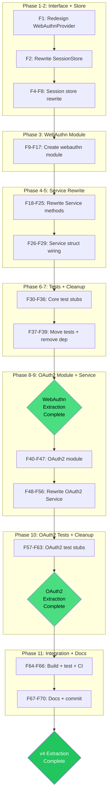

# v4 Auth Strategy Extraction — Comprehensive Execution Plan

**Date:** 2026-07-02
**Branch:** `v4`
**Goal:** Extract WebAuthn and OAuth2 auth strategies behind primitive-type interfaces as independent Go modules, completing the v4 Sollbruchstellen extraction started with TOTP.

## Context

TOTP extraction is **complete** (commit `ebdac9e`). `pquerna/otp` removed from core `usermgmt`. New module `usermgmt/totp/v4` created. The TOTP pattern validates: interface in core uses only primitive types (`[]byte`, `string`); implementation module satisfies it via Go structural typing without importing core.

**Remaining deps to extract from `usermgmt/go.mod`:**

- `github.com/go-webauthn/webauthn v0.17.4` — passkey auth (WebAuthn)
- `golang.org/x/oauth2 v0.36.0` — OAuth2 code flow + PKCE
- `github.com/coreos/go-oidc/v3 v3.19.0` — OIDC discovery + ID token verification
- `github.com/go-jose/go-jose/v4 v4.1.4` — JWT signing (transitive, test-only)

**Coupling map (production files):**

| Dep         | Prod files                                                                                          | Test files                             | Types leaked                                                                                                                                                              |
| ----------- | --------------------------------------------------------------------------------------------------- | -------------------------------------- | ------------------------------------------------------------------------------------------------------------------------------------------------------------------------- |
| go-webauthn | service_core.go, webauthn_session.go, webauthn_adapter.go, store_interfaces.go, webauthn_service.go | webauthn_test.go, coverage_new_test.go | `*webauthn.WebAuthn`, `*webauthn.SessionData`, `*protocol.CredentialCreation`, `*protocol.CredentialAssertion`, `webauthn.Credential`, `webauthn.User`, `webauthn.Config` |
| oauth2      | service_oauth2.go, oauth2.go                                                                        | —                                      | `*oauth2.Config`, `*oauth2.Token`, `oauth2.Endpoint`, PKCE functions                                                                                                      |
| oidc        | oauth2.go                                                                                           | —                                      | `*oidc.Provider`, `*oidc.IDTokenVerifier`                                                                                                                                 |
| go-jose     | —                                                                                                   | oauth2_oidc_test.go                    | JWT signing in OIDC tests                                                                                                                                                 |

## Interface Design

### WebAuthnProvider (redesigned)

The existing design in `auth_interfaces.go` is broken (uses `UserID` core type, `*AuthResult` return). Redesigned to use ONLY primitive types:

```go
type WebAuthnProvider interface {
    BeginRegistration(ctx context.Context, userJSON []byte) (options, sessionData []byte, err error)
    FinishRegistration(ctx context.Context, userJSON, body, sessionData []byte) (credentialJSON []byte, err error)
    BeginLogin(ctx context.Context, userJSON []byte) (options, sessionData []byte, err error)
    FinishLogin(ctx context.Context, userJSON, body, sessionData []byte) error
}
```

**Key decisions:**

- `userJSON []byte` — Service serializes user data (id, email, displayName, credentials) to JSON; provider deserializes internally
- `options []byte` — ceremony options as JSON (transparent to consumers — same wire format as `*protocol.CredentialCreation`)
- `sessionData []byte` — opaque serialized `*webauthn.SessionData`; provider handles serialization
- `credentialJSON []byte` — new credential data as JSON; Service deserializes to `credentialCore`
- `body []byte` — raw authenticator response body; Service reads from `*http.Request`

**WebAuthnSessionStore** changes to `[]byte`:

```go
type WebAuthnSessionStore interface {
    Save(key string, data []byte)
    Get(key string) ([]byte, error)
    Delete(key string)
}
```

### OAuth2Provider (redesigned)

```go
type OAuth2Provider interface {
    BeginLogin(ctx context.Context, providerName, state string) (redirectURL, pkceVerifier string, err error)
    FinishLogin(ctx context.Context, providerName, code, pkceVerifier string) (userInfoJSON []byte, err error)
}
```

**Key decisions:**

- Provider generates PKCE internally (removes `oauth2.GenerateVerifier` from core)
- `state` passed in by Service (Service owns CSRF state token generation/storage)
- `userInfoJSON []byte` — provider returns user info as JSON; Service deserializes to `OAuth2UserInfo`
- `OAuth2StateStore` stays in core (already uses primitive types)
- `OAuth2UserInfo` exported in core (Service deserializes provider's JSON return)

## Pareto Breakdown

### 1% that delivers 51% — Extract WebAuthn

The single heaviest dep. Removes `go-webauthn/webauthn` (+ transitive `fxamacker/cbor`, `golang-jwt/jwt`, `google/uuid`) from ALL consumers who don't need passkeys. Hardest extraction due to 6+ leaked types and ceremony state management.

### 4% that delivers 64% — Extract OAuth2

Removes `oauth2` + `oidc` + `go-jose` from ALL consumers who don't need external login. Simpler interface (2 methods) but complex OIDC discovery initialization.

### 20% that delivers 80% — Documentation + release

Update migration guide, CHANGELOG, AGENTS.md, SKILL.md. Verify all modules build and test. Tag v4.0.0.

## Medium-Granularity Plan (20 tasks, 30-100min each)

Sorted by impact/dependency order.

| #   | Task                                                                                                    | Impact   | Effort | Deps     |
| --- | ------------------------------------------------------------------------------------------------------- | -------- | ------ | -------- |
| M1  | Redesign WebAuthnProvider + WebAuthnSessionStore interfaces in auth_interfaces.go + store_interfaces.go | Critical | 30min  | —        |
| M2  | Rewrite webauthn_session.go: []byte store + TTL eviction, remove WebAuthnConfig                         | Critical | 45min  | M1       |
| M3  | Create usermgmt/webauthn/ module (go.mod, provider.go, adapter.go, session.go)                          | Critical | 90min  | M1       |
| M4  | Rewrite webauthn_service.go: Service methods delegate to WebAuthnProvider                               | Critical | 90min  | M1,M2,M3 |
| M5  | Update service_core.go: Service struct + ServiceConfig + NewService wiring for WebAuthn                 | Critical | 45min  | M4       |
| M6  | Create webauthn_stub_test.go + update all core tests (webauthn_test.go, coverage_new_test.go, etc.)     | Critical | 90min  | M5       |
| M7  | Move virtual authenticator test to webauthn module                                                      | Medium   | 30min  | M3,M6    |
| M8  | Remove go-webauthn from usermgmt/go.mod + tidy                                                          | Critical | 15min  | M6       |
| M9  | Build + test usermgmt (GOWORK=off) — WebAuthn extraction complete                                       | Critical | 30min  | M8       |
| M10 | Redesign OAuth2Provider interface + export OAuth2UserInfo in auth_interfaces.go                         | Critical | 30min  | M9       |
| M11 | Create usermgmt/oauth2/ module (go.mod, provider.go, config.go)                                         | Critical | 90min  | M10      |
| M12 | Rewrite service_oauth2.go: Service methods delegate to OAuth2Provider                                   | Critical | 60min  | M10,M11  |
| M13 | Update service_core.go: Service struct + ServiceConfig + initOAuth2 for OAuth2Provider                  | Critical | 45min  | M12      |
| M14 | Create oauth2*stub_test.go + update all core tests (oauth2*\*.go)                                       | Critical | 60min  | M13      |
| M15 | Move OIDC/JWT integration tests to oauth2 module                                                        | Medium   | 30min  | M11,M14  |
| M16 | Remove oauth2/oidc/go-jose from usermgmt/go.mod + tidy                                                  | Critical | 15min  | M14      |
| M17 | Build + test ALL modules (workspace + GOWORK=off per module)                                            | Critical | 30min  | M16      |
| M18 | Update docs: migration guide, CHANGELOG, AGENTS.md, SKILL.md                                            | High     | 60min  | M17      |
| M19 | Run CI gates: errorfamily, lint, check-modules                                                          | Critical | 15min  | M17      |
| M20 | Commit + push + verify clean build                                                                      | Critical | 15min  | M18,M19  |

## Fine-Granularity Plan (68 tasks, max 15min each)

### Phase 1: WebAuthn Interface Redesign (M1)

| #   | Task                                                                     | Est   |
| --- | ------------------------------------------------------------------------ | ----- |
| F1  | Rewrite WebAuthnProvider interface in auth_interfaces.go ([]byte params) | 10min |
| F2  | Rewrite WebAuthnSessionStore in store_interfaces.go ([]byte data)        | 5min  |
| F3  | Remove `webauthn` import from store_interfaces.go                        | 2min  |

### Phase 2: WebAuthn Session Store Rewrite (M2)

| #   | Task                                                                           | Est   |
| --- | ------------------------------------------------------------------------------ | ----- |
| F4  | Define webauthnSessionEntry struct ([]byte + time.Time) in webauthn_session.go | 5min  |
| F5  | Rewrite webauthnSessionStore methods (Save/Get/Delete with []byte)             | 10min |
| F6  | Rewrite EvictExpired to use TTL-based eviction                                 | 5min  |
| F7  | Remove WebAuthnConfig from webauthn_session.go (moves to webauthn module)      | 5min  |
| F8  | Remove `webauthn` import from webauthn_session.go                              | 2min  |

### Phase 3: WebAuthn Module Creation (M3)

| #   | Task                                                                                                           | Est   |
| --- | -------------------------------------------------------------------------------------------------------------- | ----- |
| F9  | Create usermgmt/webauthn/go.mod                                                                                | 5min  |
| F10 | Create usermgmt/webauthn/provider.go: Config struct + Provider struct + New()                                  | 10min |
| F11 | Implement BeginRegistration: construct webauthnUser, call wa.BeginRegistration, serialize results              | 15min |
| F12 | Implement FinishRegistration: parse body via http.NewRequest, call wa.FinishRegistration, serialize credential | 15min |
| F13 | Implement BeginLogin: same pattern as BeginRegistration                                                        | 10min |
| F14 | Implement FinishLogin: same pattern as FinishRegistration                                                      | 10min |
| F15 | Move adapter functions (webauthnUser, toWebAuthnCredential, fromWebAuthnCredential, transport conversion)      | 10min |
| F16 | Add webauthn module to go.work                                                                                 | 2min  |
| F17 | Create webauthn/provider_test.go with virtual authenticator                                                    | 15min |

### Phase 4: WebAuthn Service Method Rewrite (M4)

| #   | Task                                                                                      | Est   |
| --- | ----------------------------------------------------------------------------------------- | ----- |
| F18 | Add webauthnUserDataToJSON helper (converts User → []byte JSON)                           | 10min |
| F19 | Rewrite Service.BeginRegistration: delegate to provider, store []byte session             | 10min |
| F20 | Rewrite Service.FinishRegistration: read body, delegate, deserialize credential, dispatch | 15min |
| F21 | Rewrite Service.BeginLogin: delegate to provider, store []byte session                    | 10min |
| F22 | Rewrite Service.FinishLogin: read body, delegate, create session                          | 10min |
| F23 | Change BeginRegistrationResponse.Options to json.RawMessage                               | 5min  |
| F24 | Change BeginLoginResponse.Options to json.RawMessage                                      | 5min  |
| F25 | Remove protocol import from webauthn_service.go                                           | 2min  |

### Phase 5: WebAuthn Service Wiring (M5)

| #   | Task                                                                          | Est   |
| --- | ----------------------------------------------------------------------------- | ----- |
| F26 | Service struct: `webauthn *webauthn.WebAuthn` → `webauthn WebAuthnProvider`   | 5min  |
| F27 | ServiceConfig: `WebAuthnConfig *WebAuthnConfig` → `WebAuthn WebAuthnProvider` | 5min  |
| F28 | NewService: replace webauthn.New() with `svc.webauthn = cfg.WebAuthn`         | 10min |
| F29 | Remove `webauthn` import from service_core.go                                 | 2min  |

### Phase 6: WebAuthn Tests (M6)

| #   | Task                                                            | Est   |
| --- | --------------------------------------------------------------- | ----- |
| F30 | Create webauthn_stub_test.go: testWebAuthnProvider              | 10min |
| F31 | Update webauthn_test.go: use stub, remove webauthn import       | 15min |
| F32 | Update coverage_new_test.go: use stub                           | 10min |
| F33 | Update main_test.go: remove WebAuthnConfig helper               | 5min  |
| F34 | Update benchmark_test.go: remove WebAuthnConfig                 | 5min  |
| F35 | Update doc.go: remove WebAuthnConfig from example               | 5min  |
| F36 | Build + test usermgmt (GOWORK=off) — fix any compilation errors | 15min |

### Phase 7: WebAuthn Module Polish (M7-M9)

| #   | Task                                                                | Est   |
| --- | ------------------------------------------------------------------- | ----- |
| F37 | Move webauthn_virtual_test.go ceremonies to webauthn module         | 10min |
| F38 | Remove go-webauthn from usermgmt/go.mod + GOWORK=off go mod tidy -e | 5min  |
| F39 | Build + test usermgmt with -race (GOWORK=off)                       | 10min |

### Phase 8: OAuth2 Interface + Module (M10-M11)

| #   | Task                                                                                 | Est   |
| --- | ------------------------------------------------------------------------------------ | ----- |
| F40 | Rewrite OAuth2Provider interface in auth_interfaces.go                               | 10min |
| F41 | Export OAuth2UserInfo in auth_interfaces.go                                          | 5min  |
| F42 | Create usermgmt/oauth2/go.mod                                                        | 5min  |
| F43 | Create oauth2/config.go: ProviderConfig + Config + Validate()                        | 10min |
| F44 | Create oauth2/provider.go: Provider struct + New()                                   | 10min |
| F45 | Implement BeginLogin: PKCE generation + AuthCodeURL                                  | 10min |
| F46 | Implement FinishLogin: token exchange + user info extraction (OIDC + UserInfo paths) | 15min |
| F47 | Add oauth2 module to go.work                                                         | 2min  |

### Phase 9: OAuth2 Service Rewrite (M12-M13)

| #   | Task                                                                                   | Est   |
| --- | -------------------------------------------------------------------------------------- | ----- |
| F48 | Rewrite service_oauth2.go: BeginOAuthLogin delegates to provider                       | 10min |
| F49 | Rewrite FinishOAuthLogin: delegate to provider, deserialize userInfo                   | 10min |
| F50 | Remove oauth2Provider struct + getOAuth2Provider + initOAuth2Provider from oauth2.go   | 10min |
| F51 | Remove oauth2UserInfo from oauth2.go (now exported in auth_interfaces.go)              | 5min  |
| F52 | Remove OAuth2Config/OAuth2ProviderConfig from oauth2.go                                | 5min  |
| F53 | Service struct: `oauth2Providers map[string]*oauth2Provider` → `oauth2 OAuth2Provider` | 5min  |
| F54 | ServiceConfig: `OAuth2Config *OAuth2Config` → `OAuth2 OAuth2Provider`                  | 5min  |
| F55 | Rewrite initOAuth2: store provider, state store, eviction                              | 10min |
| F56 | Remove oauth2/oidc imports from service_core.go and service_oauth2.go                  | 5min  |

### Phase 10: OAuth2 Tests (M14-M16)

| #   | Task                                                             | Est   |
| --- | ---------------------------------------------------------------- | ----- |
| F57 | Create oauth2_stub_test.go: testOAuth2Provider                   | 10min |
| F58 | Update oauth2_config_test.go: move to oauth2 module or use stub  | 10min |
| F59 | Update oauth2_state_test.go: stays in core (state store is core) | 5min  |
| F60 | Update oauth2_integration_test.go: use stub provider             | 10min |
| F61 | Move oauth2_oidc_test.go to oauth2 module                        | 10min |
| F62 | Remove oauth2/oidc/go-jose from usermgmt/go.mod + tidy           | 5min  |
| F63 | Build + test usermgmt with -race (GOWORK=off)                    | 10min |

### Phase 11: Integration + Docs (M17-M20)

| #   | Task                                                               | Est   |
| --- | ------------------------------------------------------------------ | ----- |
| F64 | Build + test ALL modules (workspace mode)                          | 10min |
| F65 | Run errorfamily check                                              | 5min  |
| F66 | Run lint check                                                     | 5min  |
| F67 | Update docs/migrations/v3-to-v4.md: mark WebAuthn + OAuth2 as done | 10min |
| F68 | Update CHANGELOG.md with v4 breaking changes                       | 10min |
| F69 | Update AGENTS.md module layout + dep tables                        | 10min |
| F70 | Commit + push                                                      | 5min  |

## Execution Graph



## Risk Mitigation

| Risk                                                      | Mitigation                                                    |
| --------------------------------------------------------- | ------------------------------------------------------------- |
| go-webauthn FinishRegistration needs `*http.Request`      | Provider creates `http.NewRequest` from body bytes internally |
| Session expiry tracking lost with []bytes                 | TTL-based eviction in core store (5 min default)              |
| Existing tests break on interface change                  | Stub provider (testWebAuthnProvider) matching TOTP pattern    |
| Virtual authenticator tests can't run without go-webauthn | Move to webauthn module                                       |
| Consumer-facing response JSON changes                     | `json.RawMessage` transparent — same wire format              |
| OAuth2 PKCE generation moves to provider                  | Provider returns pkceVerifier alongside redirectURL           |
