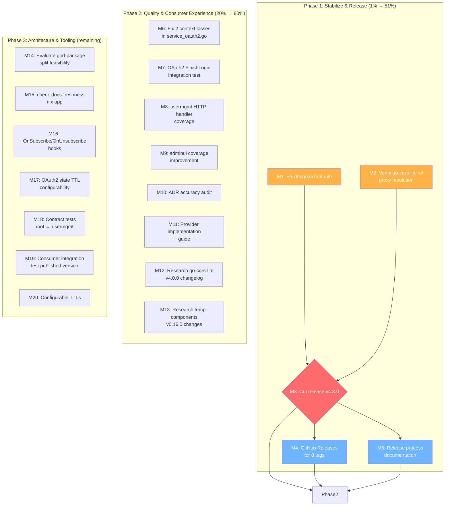

# Stabilize & Release — Comprehensive Execution Plan

> **Date:** 2026-07-12 14:45
> **Status:** Active
> **Branch:** master (clean, up to date with origin)
> **Head:** `d3bd6ea` (docs: update all project docs for v4.2.1+unreleased)
> **Build:** All 12 modules pass ✅
> **Tests:** All 7 test modules pass with `-race` ✅
> **Lint:** 0 issues across all modules ✅
> **Module isolation:** All clean ✅

---

## Current State (Verified This Session)

| Metric               | Value                                                                                                |
| -------------------- | ---------------------------------------------------------------------------------------------------- |
| Version              | v4.2.1+unreleased (go-cqrs-lite v4.0.0)                                                              |
| Modules              | 12 go.mod files in go.work                                                                           |
| Coverage             | 94.2% root, 75.1% usermgmt, 88.2% totp, 87.5% webauthn, 92.3% oauth2, 66.8% adminui, 80.1% loginpage |
| Open TODO items      | 39 (after fixing 3 split brains this session)                                                        |
| GitHub Releases      | 2 (v4.0.0, v2.0.0) — 8 tags exist without release notes                                              |
| BROKEN features      | 0                                                                                                    |
| PARTIALLY_FUNCTIONAL | 1 (Offline Sync Phase 2a — intentional, OPFS deferred)                                               |

### Split Brains Found & Fixed This Session

1. **Error Context**: FEATURES.md said PARTIALLY*FUNCTIONAL ("not wired into logging") but code HAS `error_code`/`error_family`/`error_ctx*\*`in`logging.go`. Fixed → FULLY_FUNCTIONAL.
2. **es_readmodel Handle refactoring**: TODO_LIST.md said open but code already refactored to dispatch table. Fixed → marked done.
3. **Depguard rule**: TODO_LIST.md claimed "DONE" but depguard is NOT in `.golangci.yml` enable list. Fixed → corrected to open.

---

## Pareto Breakdown

### The 1% That Delivers 51% — Release the go-cqrs-lite v4 Migration

The **single highest-impact action**: the go-cqrs-lite v3→v4 migration (commit `3f0183d`) is unreleased. Consumers who `go get` cqrs-htmx today get the v3 dependency tree. The v4 migration brings:

- Cleaner upstream module layout (metadata extracted, projection extracted, id/types consolidated)
- Compatibility aliases (`event.AggregateType = id.AggregateType`, etc.)
- Eliminated `.vendor-local/eventtest` hack

**Why this is #1**: A migration that isn't released delivers zero consumer value. It also blocks consumers from upgrading their own go-cqrs-lite deps. The risk of NOT releasing accumulates — every session adds more changes on top, making the release bigger and riskier.

**Before releasing**: Must verify `go get github.com/larsartmann/cqrs-htmx/v4@latest` actually resolves from outside the workspace (go-cqrs-lite v4.0.0 has a known publishing bug with zero pseudo-versions).

### The 4% That Delivers 64% — Release Hygiene + Consumer Verification

| Task                             | Why                                                                       |
| -------------------------------- | ------------------------------------------------------------------------- |
| GitHub Releases for all 8 tags   | 8 tags exist, only 2 have release notes. Consumers see nothing on GitHub. |
| Go proxy resolution verification | Nobody ever verified `go get @v4.2.1` resolves from clean cache           |
| Release process documentation    | CONTRIBUTING.md has no release process section                            |
| Depguard lint rule (actual)      | TODO claimed done but depguard NOT in golangci.yml                        |

### The 20% That Delivers 80% — Quality & Consumer Experience

| Task                                     | Why                                                                                |
| ---------------------------------------- | ---------------------------------------------------------------------------------- |
| OAuth2 FinishLogin integration test      | Only BeginLogin tested. FinishLogin is the critical path.                          |
| usermgmt HTTP handler coverage           | oauth2_http.go, credential_http.go at 0%. Need httptest fixtures.                  |
| adminui coverage improvement             | 66.8% → target 70%+. Only seed_render_test.go exists.                              |
| ADR accuracy audit                       | 35 ADRs never audited for removed API references (MemoryBus, WebAuthnConfig, etc.) |
| Provider implementation guide            | How to write custom TOTPProvider/WebAuthnProvider/OAuth2Provider                   |
| 2 remaining high-severity context losses | service_oauth2.go drops providerName/state on Service-layer wraps                  |

### The Remaining 20% — Architecture & Future (High-Risk, Needs Careful Evaluation)

These are explicitly **NOT 1%/4%/20%** items. They are important but carry significant risk of VERSCHLIMMBESSER:

| Task                               | Risk Assessment                                                                                                                     |
| ---------------------------------- | ----------------------------------------------------------------------------------------------------------------------------------- |
| God-package split (domain layer)   | 84 files, deep coupling. Was deferred in every session since July 1. Clean seams identified but moving types creates import cycles. |
| Root module sub-package extraction | Same go.mod = same dep tree = zero consumer benefit. Only separate Go modules reduce deps.                                          |
| broadcaster.ServeSSE()             | 2 consumers asked for it. Design tension: "building blocks not a server".                                                           |
| Redis adapters                     | Multi-instance deployments. No consumer has asked for this yet.                                                                     |
| MySQL event store support          | Upstream dropped MySQL. Would require hand-rolling the store again.                                                                 |
| encoding/json/v2 adoption          | Deferred until Go stabilizes the package. Not actionable now.                                                                       |
| Phase 2b OPFS persistence          | SharedWorker offline queue. Deferred per ADR-0029/0030.                                                                             |
| Property-based tests               | Nice-to-have, not blocking anything.                                                                                                |

---

## Medium-Granularity Plan (30-100min tasks)

Sorted by `Impact × Customer-Value ÷ Effort`.

| #   | Task                                                                        | Impact   | Effort | Phase | Deps  |
| --- | --------------------------------------------------------------------------- | -------- | ------ | ----- | ----- |
| M1  | **Fix depguard lint rule** — actually add depguard to .golangci.yml         | Critical | 30min  | 1     | —     |
| M2  | **Verify go-cqrs-lite v4 proxy resolution** — dry-run `go get`              | Critical | 30min  | 1     | —     |
| M3  | **Cut release v4.3.0** — tag, CHANGELOG, push                               | Critical | 60min  | 1     | M1,M2 |
| M4  | **Create GitHub Releases** for 8 tags                                       | High     | 90min  | 1     | M3    |
| M5  | **Release process documentation** in CONTRIBUTING.md                        | High     | 30min  | 1     | M3    |
| M6  | **Fix 2 context losses** in service_oauth2.go                               | High     | 30min  | 2     | —     |
| M7  | **OAuth2 FinishLogin integration test** (mock token exchange)               | High     | 60min  | 2     | —     |
| M8  | **usermgmt HTTP handler coverage** (oauth2_http.go, credential_http)        | Medium   | 90min  | 2     | —     |
| M9  | **adminui coverage improvement** (target 70%+)                              | Medium   | 90min  | 2     | —     |
| M10 | **ADR accuracy audit** — 35 ADRs checked against code                       | Medium   | 90min  | 2     | —     |
| M11 | **Provider implementation guide** — how to write custom providers           | Medium   | 60min  | 2     | —     |
| M12 | **Research go-cqrs-lite v4.0.0 changelog** — missed capabilities            | Medium   | 30min  | 2     | —     |
| M13 | **Research templ-components v0.15→v0.16** — new components/breaks           | Low      | 30min  | 2     | —     |
| M14 | **Evaluate god-package split feasibility** — non-breaking domain extraction | Medium   | 60min  | 3     | —     |
| M15 | **`nix run .#check-docs-freshness` app** — automated version scanner        | Low      | 60min  | 3     | —     |
| M16 | **OnSubscribe/OnUnsubscribe hooks** on fanOut/Broadcaster                   | Medium   | 60min  | 3     | —     |
| M17 | **OAuth2 state TTL configurability** (same pattern as WebAuthnTTL)          | Low      | 30min  | 3     | —     |
| M18 | **Contract tests** root↔usermgmt (RateLimiter boundary)                     | Medium   | 60min  | 3     | —     |
| M19 | **Consumer integration test** (import published version, not replace)       | Medium   | 60min  | 3     | M3    |
| M20 | **Configurable TTLs** — lockout, verification token                         | Low      | 30min  | 3     | —     |

---

## Fine-Granularity Plan (max 12min tasks)

### Phase 1: Stabilize & Release (M1-M5)

| #   | Task                                                                        | Est   |
| --- | --------------------------------------------------------------------------- | ----- |
| F1  | Add `depguard` to linters enable list in `.golangci.yml`                    | 3min  |
| F2  | Configure depguard deny rules: `encoding/json/v2`, `encoding/json/jsontext` | 5min  |
| F3  | Add same depguard rules to `usermgmt/.golangci.yml`                         | 3min  |
| F4  | Run `golangci-lint run` to verify depguard works                            | 3min  |
| F5  | Create temp consumer project outside workspace                              | 5min  |
| F6  | `GOPROXY=off go get github.com/larsartmann/cqrs-htmx/v4@v4.2.1`             | 5min  |
| F7  | If fails: check go-cqrs-lite v4 pseudo-version workaround                   | 10min |
| F8  | If works: document the proxy resolution result                              | 3min  |
| F9  | Update CHANGELOG `[Unreleased]` → `[v4.3.0]` with date                      | 5min  |
| F10 | Verify CHANGELOG covers all changes since v4.2.1                            | 5min  |
| F11 | Tag all modules: `v4.3.0`, `usermgmt/v4.3.0`, etc.                          | 5min  |
| F12 | Push all tags to origin                                                     | 3min  |
| F13 | `gh release create v4.3.0` with CHANGELOG body                              | 10min |
| F14 | `gh release create` for v4.2.1 (retroactive, from CHANGELOG)                | 10min |
| F15 | `gh release create` for v4.2.0 (retroactive, from CHANGELOG)                | 10min |
| F16 | `gh release create` for v4.1.1 (retroactive, from CHANGELOG)                | 10min |
| F17 | `gh release create` for v4.1.0 (retroactive, from CHANGELOG)                | 10min |
| F18 | `gh release create` for v4.0.1 (retroactive, from CHANGELOG)                | 10min |
| F19 | Write release process section in CONTRIBUTING.md                            | 10min |
| F20 | Add tag-naming table to CONTRIBUTING.md                                     | 5min  |

### Phase 2: Quality & Consumer Experience (M6-M13)

| #   | Task                                                        | Est   |
| --- | ----------------------------------------------------------- | ----- |
| F21 | Read `service_oauth2.go` to find the 2 context loss sites   | 5min  |
| F22 | Attach `provider` context to BeginOAuthLogin error wraps    | 5min  |
| F23 | Attach `provider` context to FinishOAuthLogin error wraps   | 5min  |
| F24 | Run usermgmt tests to verify no regressions                 | 5min  |
| F25 | Design OAuth2 mock token exchange server structure          | 10min |
| F26 | Implement mock token endpoint returning fake access token   | 10min |
| F27 | Implement mock userinfo endpoint returning fake user data   | 10min |
| F28 | Write FinishLogin integration test using mock server        | 10min |
| F29 | Run integration_test module to verify                       | 5min  |
| F30 | Inventory oauth2_http.go untested handlers                  | 5min  |
| F31 | Write httptest.Server fixture for OAuth2 callback           | 10min |
| F32 | Write credential_http.go edge case tests (list/delete)      | 10min |
| F33 | Run usermgmt tests + check coverage delta                   | 5min  |
| F34 | Inventory adminui untested handler paths                    | 5min  |
| F35 | Write adminui dashboard handler test                        | 10min |
| F36 | Write adminui user detail handler test                      | 10min |
| F37 | Write adminui tenant CRUD handler test                      | 10min |
| F38 | Run adminui tests + check coverage delta                    | 5min  |
| F39 | List all ADR files to audit                                 | 3min  |
| F40 | Audit ADR-0006 through ADR-0010 for removed APIs            | 10min |
| F41 | Audit ADR-0011 through ADR-0020 for removed APIs            | 10min |
| F42 | Audit ADR-0021 through ADR-0030 for removed APIs            | 10min |
| F43 | Audit ADR-0031 through ADR-0035 for removed APIs            | 10min |
| F44 | Fix any stale ADR references found                          | 10min |
| F45 | Write provider implementation guide outline                 | 5min  |
| F46 | Write TOTPProvider implementation section                   | 10min |
| F47 | Write WebAuthnProvider implementation section               | 10min |
| F48 | Write OAuth2Provider implementation section                 | 10min |
| F49 | Add guide to `docs/guides/` or SKILL.md                     | 5min  |
| F50 | Read go-cqrs-lite v4.0.0 source in GOMODCACHE for changelog | 10min |
| F51 | Read templ-components v0.16.0 source for new components     | 10min |

### Phase 3: Architecture & Tooling (M14-M20)

| #   | Task                                                                  | Est   |
| --- | --------------------------------------------------------------------- | ----- |
| F52 | Read Sollbruchstellen analysis (domain layer section)                 | 5min  |
| F53 | Attempt non-breaking domain extraction PoC (type aliases)             | 10min |
| F54 | Evaluate: does it reduce dep tree? (same go.mod = no)                 | 5min  |
| F55 | Document decision: defer or proceed                                   | 5min  |
| F56 | Write `check-docs-freshness` nix app: scan .md for version mismatches | 10min |
| F57 | Wire `check-docs-freshness` into `nix run .#check-modules`            | 5min  |
| F58 | Add OnSubscribe/OnUnsubscribe callback fields to fanOut struct        | 5min  |
| F59 | Wire callbacks in Subscribe/Unsubscribe methods                       | 5min  |
| F60 | Add race test for concurrent subscribe+close+hooks                    | 10min |
| F61 | Write contract test: RateLimiter boundary root↔usermgmt               | 10min |
| F62 | Write OAuth2StateTTL configurability                                  | 10min |
| F63 | Write lockout TTL configurability                                     | 10min |
| F64 | Write verification token TTL configurability                          | 10min |
| F65 | Write consumer integration test scaffold (published version)          | 10min |

---

## What's NOT Worth Doing (Verschlimmbesserung Prevention)

| Rejected Task                            | Why Rejected                                                                                          |
| ---------------------------------------- | ----------------------------------------------------------------------------------------------------- |
| Root module sub-package extraction       | Same go.mod = same dep tree. 30+ re-export wrappers = zero consumer benefit. Pure boilerplate.        |
| God-package split (domain → sub-module)  | 84 files, deep Service references. Type aliases could work but deliver ZERO dep reduction. High risk. |
| broadcaster.ServeSSE() high-level helper | Crosses "building blocks, not a server" design line. Design tension unresolved by maintainer.         |
| Redis adapters                           | No consumer has asked for multi-instance. YAGNI until someone needs it.                               |
| MySQL event store                        | Upstream dropped MySQL support. Hand-rolling = maintenance burden for 1 consumer.                     |
| encoding/json/v2 migration               | Experimental stdlib. Deferred until Go stabilizes. GOEXPERIMENT=jsonv2 already set for dev.           |
| Phase 2b OPFS persistence                | IndexedDB banned (ADR-0029). OPFS is browser-API-gated. Deferred.                                     |
| ServiceConfig composition refactor       | Good idea but orthogonal. 20+ fields in one struct is ugly but works.                                 |
| JSON serialization boundary elimination  | 400ns-1.2µs per ceremony call. Negligible. Conceptual smell, not performance problem.                 |

---

## Execution Graph

---

## Success Criteria

After completing Phase 1:

- [ ] `go get github.com/larsartmann/cqrs-htmx/v4@v4.3.0` resolves from clean proxy cache
- [ ] All 8 tags have GitHub Release notes
- [ ] CONTRIBUTING.md has a release process section
- [ ] Depguard rejects `encoding/json/v2` imports

After completing Phase 2:

- [ ] OAuth2 FinishLogin tested end-to-end with mock server
- [ ] usermgmt coverage improved by 2%+ (HTTP handlers)
- [ ] adminui coverage at 70%+
- [ ] 0 stale ADR references to removed APIs
- [ ] Provider implementation guide published

After completing Phase 3:

- [ ] God-package split decision documented (proceed or defer)
- [ ] `nix run .#check-docs-freshness` prevents version drift
- [ ] Broadcaster lifecycle hooks available for metrics
- [ ] All TTLs configurable (lockout, OAuth2 state, verification token)
