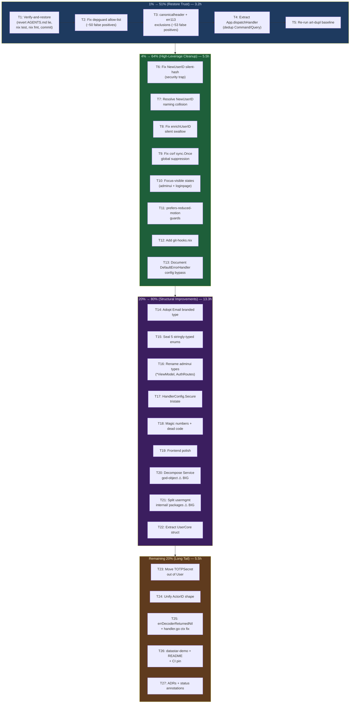

# Pareto Comprehensive Execution Plan — cqrs-htmx Quality Blitz

**Date:** 2026-07-19 10:53 | **Status:** Planning complete, pending execution approval
**Source:** 50 items identified by 14-skill quality review session (see `docs/status/2026-07-19_10-45_multi-skill-quality-blitz-self-critique.md`)
**Context:** cqrs-htmx is a Go library (not an app). Consumers import it. Every change must preserve the public API or be explicitly breaking. The library is already well-architected — the improvements below are polish and debt paydown, not foundation work.

---

## Pareto Breakdown

### 1% that delivers 51% of the result

These 5 items restore **trust** — in tests, in lint, in docs. Without them, nothing else is reliable.

| #   | Task                                                                                                                | Impact   | Effort | Why                                                                                                                                                                         |
| --- | ------------------------------------------------------------------------------------------------------------------- | -------- | ------ | --------------------------------------------------------------------------------------------------------------------------------------------------------------------------- |
| T1  | Verify-and-restore: revert AGENTS.md lie, run full `nix run .#test`, run `nix fmt`, commit the 4 verified bug fixes | Critical | 60min  | The AGENTS.md edit from last session softened a real warning into a lie. Tests weren't run after late edits. Committing verified work establishes a clean baseline.         |
| T2  | Fix root `.golangci.yml` depguard allow-list                                                                        | Critical | 30min  | 50 of 187 lint issues are false positives — depguard's `allow: [$gostd, $module]` flags all `github.com/larsartmann/go-*` sibling imports. Without this fix, lint is noise. |
| T3  | Add canonicalheader + err113 test exclusions to `.golangci.yml`                                                     | High     | 30min  | Kills 53 more false positives (HX-* headers are HTMX spec; tests legitimately use errors.New). Drops root lint from 187 → ~35.                                              |
| T4  | Extract `App.dispatchHandler` to dedup Command/Query                                                                | High     | 60min  | The only production-code duplication flagged across 3 reports. 90% identical bodies in `app.go:201-256`.                                                                    |
| T5  | Run `art-dupl` post-fix to establish clean duplication baseline                                                     | Medium   | 10min  | After depguard + dedup, re-run to get a trustworthy baseline for future comparisons.                                                                                        |

**Subtotal: 5 tasks, 190 min (3.2 hours)**

### 4% that delivers 64% of the result (cumulative with 1%)

| #   | Task                                                                   | Impact   | Effort | Why                                                                                                                                                                                                            |
| --- | ---------------------------------------------------------------------- | -------- | ------ | -------------------------------------------------------------------------------------------------------------------------------------------------------------------------------------------------------------- |
| T6  | Fix `usermgmt.NewUserID(string)` silent-hash security trap             | Critical | 90min  | Any non-ULID string gets SHA-256-hashed into a valid-looking UserID. Two callers passing "alice" get the same ID. Security + debugging trap. Split into `ParseUserID` (strict) + `SyntheticUserID` (explicit). |
| T7  | Resolve `NewUserID` naming collision (root generates, usermgmt parses) | High     | 30min  | `cqrshtmx.NewUserID()` generates ULID; `usermgmt.NewUserID(string)` parses/derives — same name, opposite semantics, both visible in adminui's import graph.                                                    |
| T8  | Fix `enrichUserID` silent error swallow (`app.go:298-306`)             | High     | 30min  | Failing extractor = every request appears anonymous = authorization silently bypassed. Currently only logs Warn.                                                                                               |
| T9  | Fix `csrf_middleware.go` global `sync.Once` warning suppression        | Medium   | 30min  | Package-global Once means a library used by two consumers suppresses the second consumer's trusted-proxy warning.                                                                                              |
| T10 | Accessibility: focus-visible states in adminui + loginpage             | High     | 60min  | No visible keyboard focus on any shipped UI element. Basic a11y gap.                                                                                                                                           |
| T11 | Accessibility: `prefers-reduced-motion` guards in adminui              | Medium   | 30min  | Sidebar slide-in transition has no reduced-motion guard.                                                                                                                                                       |
| T12 | Add `git-hooks.nix` to flake.nix                                       | Medium   | 30min  | Only gap in the nix standard stack. Activates quality gates on every `nix develop` + `git commit`.                                                                                                             |
| T13 | Document/fix `DefaultErrorHandler` config bypass (`errors.go:110`)     | Medium   | 30min  | Exported handler ignores `IncludeInternalDetails`/`IncludeRequestIDInErrors`. Natural consumer choice silently bypasses config.                                                                                |

**Subtotal: 8 tasks, 330 min (5.5 hours). Cumulative: 13 tasks, 8.7 hours.**

### 20% that delivers 80% of the result (cumulative with 4%)

| #   | Task                                                                                                      | Impact   | Effort | Why                                                                                                                                               |
| --- | --------------------------------------------------------------------------------------------------------- | -------- | ------ | ------------------------------------------------------------------------------------------------------------------------------------------------- |
| T14 | Adopt `Email` branded type in `User` + payloads                                                           | High     | 60min  | `Email` type + `ParseEmail` validator exist but `User.Email` is raw `string`. Zero wire impact (JSON marshals identically). Pure type-safety win. |
| T15 | Seal 5 stringly-typed enums (Action, Effect, Role, UserDataFormat, AckStatus)                             | High     | 90min  | Any string compiles as a valid Action/Effect/Role today. Sealed constants + `Valid()` method prevent typo bugs.                                   |
| T16 | Rename adminui `*Data` → `*ViewModel` + `AuthHandler` → `AuthRoutes` + `OAuth2UserInfo` → `OAuth2Profile` | Medium   | 45min  | 9 `*Data` types, 1 misleading `AuthHandler`, 1 transport-leaking `OAuth2UserInfo`. Breaking (type renames).                                       |
| T17 | Replace `HandlerConfig.Secure *bool` with explicit tristate                                               | Medium   | 45min  | Pointer-as-tristate anti-pattern. nil defaults to true, `new(bool)` for false. Consumers must read godoc.                                         |
| T18 | Extract magic numbers + delete dead code + move `dummyMaterializeStringer`                                | Low      | 30min  | 5 mnd hits (64, 7, 5, etc.), 1 dead-code no-op in usermgmt/http.go, 1 "dummy" name in production code.                                            |
| T19 | Frontend polish: loginpage dark-mode error region + `--lp-radius` split + no-auth copy rephrase           | Medium   | 45min  | Error region hardcoded to light mode. Radius shared between cards and inputs. Dev-facing message shown to end-users.                              |
| T20 | Decompose `usermgmt.Service` god-object (52 methods, 30 fields)                                           | Critical | 240min | Biggest structural debt. Extract UserService, TenantService, MembershipService, BotService, OAuth2Service, SessionService. Breaking change.       |
| T21 | Split usermgmt into `internal/{user,membership,tenant,bot}` packages                                      | High     | 180min | 185 .go files in one flat package. Compiler-enforced sub-domain boundaries. Public API unchanged.                                                 |
| T22 | Extract `UserCore` shared struct (User/UserState/UserView/UserReadModel)                                  | Medium   | 60min  | 4 parallel shapes with duplicated fields. Adding a field means touching 4 types. Same `credentialCore` pattern already proven.                    |

**Subtotal: 9 tasks, 795 min (13.3 hours). Cumulative: 22 tasks, 22 hours.**

### Remaining 20% (to reach 100%)

| #   | Task                                                                                                           | Impact | Effort | Why                                                                                                                                            |
| --- | -------------------------------------------------------------------------------------------------------------- | ------ | ------ | ---------------------------------------------------------------------------------------------------------------------------------------------- |
| T23 | Move `TOTPSecret` out of `User` entity into TOTP strategy module                                               | Medium | 90min  | Cryptographic material in domain entity. Couples User to one MFA implementation. Breaking.                                                     |
| T24 | Unify `ActorID` shape (root flat branded vs usermgmt discriminated struct)                                     | Medium | 120min | Same concept, two shapes, cross-module conversion required. Pick one, apply everywhere. Breaking.                                              |
| T25 | Add `errDecoderReturnedNil` sentinel (500 not 503) + fix `handler.go:176` ctx                                  | Low    | 30min  | Nil decode result is a server bug (500), currently classified as Infrastructure (503). Error log uses `r.Context()` not timeout-bounded `ctx`. |
| T26 | Resolve `examples/datastar-demo` fate + verify README anchor links + pin CI golangci-lint version              | Low    | 30min  | Only example without README. README links may have broken after copywriting edit. CI lint version skew (v2.11 vs v2.12.2).                     |
| T27 | Write ADR-0038 (Service decomposition) + ADR-0039 (ActorID unification) + annotate 3-5 misleading status files | Low    | 60min  | Document the "why" behind major decisions. Spot-check recent status files for dangerous claims.                                                |

**Subtotal: 5 tasks, 330 min (5.5 hours). Grand total: 27 tasks, 27.5 hours.**

### Blocked (not actionable)

- **Drop `go.work` replace directives** — blocked on go-cqrs-lite publishing clean v4.0.3+. 13 of ~40 submodule tags still have zero pseudo-versions as of 2026-07-18. Track upstream; do not remove replaces until verified.

---

## Mermaid Execution Graph

---

## Comprehensive Plan — Medium Granularity (30-100 min tasks)

Sorted by impact/effort/customer-value. All 27 tasks.

| #   | Tier | Task                                                                                                                | Impact      | Effort | Customer Value                             | Depends on |
| --- | ---- | ------------------------------------------------------------------------------------------------------------------- | ----------- | ------ | ------------------------------------------ | ---------- |
| T1  | 1%   | Verify-and-restore: revert AGENTS.md lie, `nix run .#test`, `nix fmt`, commit 4 bug fixes                           | 🔴 Critical | 60min  | Trust in tests + docs                      | —          |
| T2  | 1%   | Fix root `.golangci.yml` depguard allow-list (`github.com/larsartmann/go-*` + legit deps)                           | 🔴 Critical | 30min  | Lint becomes trustworthy (−50 noise)       | T1         |
| T3  | 1%   | Add canonicalheader (HX-*) + err113 (_test.go) exclusions to `.golangci.yml`                                        | 🟠 High     | 30min  | Lint drops 187 → ~35 (−53 noise)           | T2         |
| T4  | 1%   | Extract `App.dispatchHandler` helper to dedup Command/Query bodies                                                  | 🟠 High     | 60min  | Addresses #1 dedup across 3 reports        | T1         |
| T5  | 1%   | Re-run `art-dupl` to establish clean post-fix baseline                                                              | 🟡 Medium   | 10min  | Trustworthy dup baseline                   | T4         |
| T6  | 4%   | Fix `usermgmt.NewUserID(string)` silent-hash → split `ParseUserID` + `SyntheticUserID`                              | 🔴 Critical | 90min  | Closes security/debugging trap             | T1         |
| T7  | 4%   | Resolve `NewUserID` naming collision (root generates vs usermgmt parses)                                            | 🟠 High     | 30min  | Removes import-graph confusion             | T6         |
| T8  | 4%   | Fix `enrichUserID` silent error swallow — surface as 401 or metric                                                  | 🟠 High     | 30min  | Prevents silent authz bypass               | T1         |
| T9  | 4%   | Fix `csrf_middleware.go` global `sync.Once` → per-instance warning                                                  | 🟡 Medium   | 30min  | Multi-consumer correctness                 | T1         |
| T10 | 4%   | Add focus-visible states to adminui nav links + loginpage inputs/buttons                                            | 🟠 High     | 60min  | Basic a11y compliance                      | T1         |
| T11 | 4%   | Add `prefers-reduced-motion` guards to adminui sidebar transition                                                   | 🟡 Medium   | 30min  | a11y motion sensitivity                    | T10        |
| T12 | 4%   | Add `git-hooks.nix` to flake.nix (only gap in standard stack)                                                       | 🟡 Medium   | 30min  | Quality gates on every commit              | T1         |
| T13 | 4%   | Document or fix `DefaultErrorHandler` ignoring config knobs                                                         | 🟡 Medium   | 30min  | Prevents silent config bypass              | T1         |
| T14 | 20%  | Adopt `Email` branded type in `User`, `UserState`, command structs, event payloads                                  | 🟠 High     | 60min  | Pure type-safety, zero wire impact         | T1         |
| T15 | 20%  | Seal 5 stringly-typed enums (Action/Effect/Role/UserDataFormat/AckStatus) with constants + `Valid()`                | 🟠 High     | 90min  | Eliminates typo-class bugs                 | T1         |
| T16 | 20%  | Rename adminui `*Data` → `*ViewModel` (9 types) + `AuthHandler` → `AuthRoutes` + `OAuth2UserInfo` → `OAuth2Profile` | 🟡 Medium   | 45min  | Naming honesty. Breaking.                  | T1         |
| T17 | 20%  | Replace `HandlerConfig.Secure *bool` with explicit tristate enum                                                    | 🟡 Medium   | 45min  | Removes pointer-as-tristate anti-pattern   | T1         |
| T18 | 20%  | Extract magic numbers (5 mnd hits) + delete dead code (http.go:128) + move `dummyMaterializeStringer` to test       | 🟢 Low      | 30min  | Readability hygiene                        | T1         |
| T19 | 20%  | Frontend polish: loginpage dark-mode error + `--lp-radius` split + no-auth copy rephrase                            | 🟡 Medium   | 45min  | Dark-mode correctness + end-user copy      | T1         |
| T20 | 20%  | Decompose `usermgmt.Service` → UserService/TenantService/MembershipService/BotService/OAuth2Service/SessionService  | 🔴 Critical | 240min | Biggest structural debt. Breaking.         | T1         |
| T21 | 20%  | Split usermgmt into `internal/{user,membership,tenant,bot}` packages                                                | 🟠 High     | 180min | Compiler-enforced boundaries, navigability | T20        |
| T22 | 20%  | Extract `UserCore` shared struct (User/UserState/UserView/UserReadModel)                                            | 🟡 Medium   | 60min  | Reduces 4-shape maintenance burden         | T20        |
| T23 | rest | Move `TOTPSecret []byte` out of `User` into TOTP strategy module                                                    | 🟡 Medium   | 90min  | Strategy-module isolation. Breaking.       | T20        |
| T24 | rest | Unify `ActorID` shape — pick one (root flat vs usermgmt discriminated)                                              | 🟡 Medium   | 120min | Cross-module consistency. Breaking.        | T1         |
| T25 | rest | Add `errDecoderReturnedNil` sentinel (500 not 503) + pass `ctx` not `r.Context()` to `handleErr`                    | 🟢 Low      | 30min  | Correct error classification               | T1         |
| T26 | rest | Resolve `examples/datastar-demo` fate + verify README anchor links + pin CI golangci-lint v2.12.2                   | 🟢 Low      | 30min  | Consistency                                | T1         |
| T27 | rest | Write ADR-0038 (Service decomposition) + ADR-0039 (ActorID) + annotate 3-5 misleading status files                  | 🟢 Low      | 60min  | Decision trail + history hygiene           | T20, T24   |

**Totals:** 27 tasks · 27.5 hours · 5 Critical · 8 High · 10 Medium · 4 Low

---

## Fine Breakdown — Max 12 min per task

Every medium task above broken into subtasks that fit in a single focus burst.

### T1: Verify-and-restore (60min)

| Sub  | Task                                                                                                              | Min | Verify                                                |
| ---- | ----------------------------------------------------------------------------------------------------------------- | --- | ----------------------------------------------------- |
| T1.1 | Revert AGENTS.md go-cqrs-lite note: "Largely resolved" → "Still broken — 13/40 tags affected per go.work comment" | 5   | Read go.work comment for accurate wording             |
| T1.2 | Run `nix run .#test` — verify all 10 modules pass                                                                 | 10  | All modules `ok`                                      |
| T1.3 | Run `nix fmt` on all 11 modified files                                                                            | 5   | `git diff --stat` shows no fmt-only changes remaining |
| T1.4 | Run `nix run .#lint` — verify submodules clean, root has expected issues                                          | 10  | Submodule lint = 0; root still 187 (pre-T2 fix)       |
| T1.5 | If any test fails: fix immediately (context: response.go/errors.go/constants.go changes)                          | 12  | All green                                             |
| T1.6 | `git add` bug-fix files + commit with detailed message                                                            | 10  | Commit in log                                         |
| T1.7 | `git push`                                                                                                        | 2   | Remote updated                                        |

### T2: Fix depguard allow-list (30min)

| Sub  | Task                                                                                                                                                                                  | Min | Verify                           |
| ---- | ------------------------------------------------------------------------------------------------------------------------------------------------------------------------------------- | --- | -------------------------------- |
| T2.1 | Read current `.golangci.yml` depguard `allow` rules                                                                                                                                   | 3   | Confirm `[$gostd, $module]` only |
| T2.2 | Add `github.com/larsartmann/go-cqrs-lite` + `go-error-family` + `go-branded-id` to allow                                                                                              | 5   | —                                |
| T2.3 | Add `github.com/justinas/nosurf`, `github.com/casbin/casbin/v3`, `github.com/a-h/templ`, `github.com/onsi/ginkgo`, `github.com/onsi/gomega`, `github.com/go-playground/form` to allow | 7   | —                                |
| T2.4 | Run `golangci-lint run` — depguard issues 50 → 0                                                                                                                                      | 5   | `grep -c depguard` = 0           |
| T2.5 | Verify no real violations suppressed (check the remaining ~137 are non-depguard)                                                                                                      | 5   | Sanity check                     |
| T2.6 | Commit `.golangci.yml` change                                                                                                                                                         | 5   | —                                |

### T3: canonicalheader + err113 exclusions (30min)

| Sub  | Task                                                                                | Min | Verify             |
| ---- | ----------------------------------------------------------------------------------- | --- | ------------------ |
| T3.1 | Add `canonicalheader` text exclusion for `HX-*` header constants in `.golangci.yml` | 5   | —                  |
| T3.2 | Add `err113` path exclusion for `_test.go` files                                    | 3   | —                  |
| T3.3 | Run `golangci-lint run` — verify canonicalheader 24 → 0, err113 29 → 0              | 5   | Issue count ~35    |
| T3.4 | Verify remaining ~35 are genuine low-severity items (varnamelen, mnd, etc.)         | 5   | No false positives |
| T3.5 | Commit                                                                              | 5   | —                  |

### T4: Extract App.dispatchHandler (60min)

| Sub  | Task                                                                                                                                | Min | Verify                         |
| ---- | ----------------------------------------------------------------------------------------------------------------------------------- | --- | ------------------------------ |
| T4.1 | Read `app.go:201-256` Command + Query bodies side-by-side                                                                           | 5   | Confirm 90% overlap            |
| T4.2 | Design shared helper signature: `dispatchHandler(typeName string, dispatcher interface{}, nilErr error, cfg, dispatchFn func(...))` | 10  | Signature captures differences |
| T4.3 | Write `dispatchHandler` method                                                                                                      | 10  | Compiles                       |
| T4.4 | Refactor `Command` to call `dispatchHandler`                                                                                        | 5   | —                              |
| T4.5 | Refactor `Query` to call `dispatchHandler`                                                                                          | 5   | —                              |
| T4.6 | Run `go test ./... -count=1 -race`                                                                                                  | 5   | All 679 specs pass             |
| T4.7 | Run `art-dupl --semantic -t 5 --exclude-pattern '*_test.go'` — verify app.go clone gone                                             | 5   | 0 app.go clones                |
| T4.8 | Run `golangci-lint run`                                                                                                             | 5   | No new issues                  |
| T4.9 | Commit                                                                                                                              | 10  | —                              |

### T5: Re-run art-dupl baseline (10min)

| Sub  | Task                                                   | Min | Verify        |
| ---- | ------------------------------------------------------ | --- | ------------- |
| T5.1 | Run `art-dupl --semantic -t 5` across all modules      | 5   | Save output   |
| T5.2 | Document baseline in a comment or `docs/reviews/` note | 5   | Referenceable |

### T6: Fix NewUserID silent-hash (90min)

| Sub   | Task                                                                                                                       | Min | Verify                                           |
| ----- | -------------------------------------------------------------------------------------------------------------------------- | --- | ------------------------------------------------ |
| T6.1  | Read `usermgmt/id.go` — understand current `NewUserID(s string)` behavior                                                  | 5   | SHA-256 hash for non-ULID, direct parse for ULID |
| T6.2  | Audit all callers of `NewUserID(string)` across usermgmt + integration_test + examples                                     | 10  | List every call site                             |
| T6.3  | Design new API: `ParseUserID(s string) (UserID, error)` (strict ULID) + `SyntheticUserID(s string) UserID` (explicit hash) | 10  | Clear semantics                                  |
| T6.4  | Implement `ParseUserID` + `SyntheticUserID`                                                                                | 10  | Compiles                                         |
| T6.5  | Update all call sites to use the correct variant                                                                           | 12  | Each call site reviewed                          |
| T6.6  | Update remaining call sites                                                                                                | 12  | —                                                |
| T6.7  | Run `go test ./... -count=1` in usermgmt                                                                                   | 5   | All pass                                         |
| T6.8  | Run integration_test module                                                                                                | 5   | All pass                                         |
| T6.9  | Update docs (AGENTS.md, FEATURES.md) with new API                                                                          | 10  | Accurate                                         |
| T6.10 | Commit                                                                                                                     | 5   | —                                                |

### T7: Resolve NewUserID naming collision (30min)

| Sub  | Task                                                                               | Min | Verify            |
| ---- | ---------------------------------------------------------------------------------- | --- | ----------------- |
| T7.1 | Decide: rename root's `NewUserID()` → `GenerateUserID()` (clearer: generates ULID) | 5   | Decision recorded |
| T7.2 | Rename in `context.go` + update all root callers                                   | 10  | Compiles          |
| T7.3 | Run root tests                                                                     | 5   | Pass              |
| T7.4 | Commit                                                                             | 5   | —                 |

### T8: Fix enrichUserID silent swallow (30min)

| Sub  | Task                                                                                | Min | Verify                            |
| ---- | ----------------------------------------------------------------------------------- | --- | --------------------------------- |
| T8.1 | Read `app.go:298-306` enrichUserID                                                  | 5   | Confirm error is Warn-only        |
| T8.2 | Change behavior: return error response (401) OR add metric counter, document choice | 12  | Decision documented               |
| T8.3 | Add/update tests for the error path                                                 | 10  | New test covers extractor failure |
| T8.4 | Commit                                                                              | 3   | —                                 |

### T9: Fix csrf sync.Once (30min)

| Sub  | Task                                                                          | Min | Verify          |
| ---- | ----------------------------------------------------------------------------- | --- | --------------- |
| T9.1 | Read `csrf_middleware.go:75` — identify the global Once                       | 5   | Confirm pattern |
| T9.2 | Remove `sync.Once` — accept duplicate warnings OR move to per-middleware bool | 10  | Compiles        |
| T9.3 | Run csrf tests                                                                | 5   | Pass            |
| T9.4 | Commit                                                                        | 5   | —               |

### T10: Focus-visible states (60min)

| Sub   | Task                                                                                                                                                           | Min | Verify                  |
| ----- | -------------------------------------------------------------------------------------------------------------------------------------------------------------- | --- | ----------------------- |
| T10.1 | Add `focus-visible:outline-2 outline-offset-2 outline-[var(--accent)]` to adminui nav links in `layout.templ`                                                  | 10  | —                       |
| T10.2 | Add focus-visible to adminui buttons + interactive elements in `components.templ`                                                                              | 12  | —                       |
| T10.3 | Regenerate adminui `_templ.go` files via `templ generate`                                                                                                      | 5   | Generated files updated |
| T10.4 | Add `input:focus-visible, button:focus-visible, a:focus-visible { outline: 2px solid var(--lp-accent); outline-offset: 2px; }` to `loginpage/assets/login.css` | 10  | —                       |
| T10.5 | Run adminui tests                                                                                                                                              | 5   | Pass                    |
| T10.6 | Run loginpage tests                                                                                                                                            | 5   | Pass                    |
| T10.7 | Commit                                                                                                                                                         | 5   | —                       |

### T11: prefers-reduced-motion (30min)

| Sub   | Task                                                                                          | Min | Verify |
| ----- | --------------------------------------------------------------------------------------------- | --- | ------ |
| T11.1 | Wrap adminui sidebar transition in `motion-safe:max-md:transition-transform` Tailwind variant | 10  | —      |
| T11.2 | Add `@media (prefers-reduced-motion: reduce)` guard in `admin-tw.css` for any CSS transitions | 10  | —      |
| T11.3 | Commit                                                                                        | 5   | —      |

### T12: Add git-hooks.nix (30min)

| Sub   | Task                                                                        | Min | Verify |
| ----- | --------------------------------------------------------------------------- | --- | ------ |
| T12.1 | Add `git-hooks` input to flake.nix                                          | 5   | —      |
| T12.2 | Add `imports = [ inputs.git-hooks.flakeModule ]`                            | 3   | —      |
| T12.3 | Configure `pre-commit` hooks: treefmt, golangci-lint, govet                 | 10  | —      |
| T12.4 | Wire `shellHook = config.pre-commit.installationHook` into devShell.default | 5   | —      |
| T12.5 | Run `nix flake check --no-build`                                            | 5   | Pass   |
| T12.6 | Commit                                                                      | 5   | —      |

### T13: DefaultErrorHandler config bypass (30min)

| Sub   | Task                                                                                               | Min | Verify                |
| ----- | -------------------------------------------------------------------------------------------------- | --- | --------------------- |
| T13.1 | Read `errors.go:110-112` — confirm DefaultErrorHandler ignores config                              | 5   | —                     |
| T13.2 | Either: (a) add explicit godoc warning, OR (b) make it a constructor `NewDefaultErrorHandler(cfg)` | 12  | Decision documented   |
| T13.3 | Add/update tests                                                                                   | 10  | Config bypass covered |
| T13.4 | Commit                                                                                             | 3   | —                     |

### T14: Adopt Email branded type (60min)

| Sub   | Task                                                       | Min | Verify   |
| ----- | ---------------------------------------------------------- | --- | -------- |
| T14.1 | Change `User.Email string` → `Email` in `user.go`          | 5   | —        |
| T14.2 | Change `UserState.Email string` → `Email` in `es_state.go` | 5   | —        |
| T14.3 | Update all event payload structs with `Email` field        | 10  | —        |
| T14.4 | Update all command structs with `Email` field              | 10  | —        |
| T14.5 | Update read-model/view structs                             | 5   | —        |
| T14.6 | Fix any compiler errors from the type change               | 12  | Compiles |
| T14.7 | Run `go test ./...` in usermgmt                            | 5   | All pass |
| T14.8 | Run integration_test                                       | 5   | Pass     |
| T14.9 | Commit                                                     | 5   | —        |

### T15: Seal 5 stringly-typed enums (90min)

| Sub   | Task                                                                                        | Min | Verify   |
| ----- | ------------------------------------------------------------------------------------------- | --- | -------- |
| T15.1 | Seal `Action` — define typed constants (ActionRead/Create/Update/Delete) + `Valid()` method | 12  | —        |
| T15.2 | Seal `Effect` — define `EffectAllow`/`EffectDeny` + `Valid()`                               | 10  | —        |
| T15.3 | Seal `Role` — define common role constants + `Valid()`                                      | 12  | —        |
| T15.4 | Seal `UserDataFormat` — define `DataFormatJSON`/`DataFormatCBOR` + `Valid()`                | 10  | —        |
| T15.5 | Seal `AckStatus` (root) — define 4 statuses + `Valid()`                                     | 10  | —        |
| T15.6 | Fix any call sites that pass raw strings                                                    | 12  | Compiles |
| T15.7 | Run all tests                                                                               | 10  | Pass     |
| T15.8 | Commit                                                                                      | 5   | —        |

### T16: Rename adminui types (45min)

| Sub   | Task                                                      | Min | Verify   |
| ----- | --------------------------------------------------------- | --- | -------- |
| T16.1 | Rename 9 `*Data` types → `*ViewModel` in adminui Go files | 12  | —        |
| T16.2 | Rename `AuthHandler` → `AuthRoutes` in usermgmt           | 10  | —        |
| T16.3 | Rename `OAuth2UserInfo` → `OAuth2Profile`                 | 5   | —        |
| T16.4 | Fix all references + templ files                          | 10  | Compiles |
| T16.5 | Run tests                                                 | 5   | Pass     |
| T16.6 | Commit                                                    | 3   | —        |

### T17: HandlerConfig.Secure tristate (45min)

| Sub   | Task                                                                         | Min | Verify   |
| ----- | ---------------------------------------------------------------------------- | --- | -------- |
| T17.1 | Define `type SecureMode int` with `SecureDefault`/`SecureTrue`/`SecureFalse` | 10  | —        |
| T17.2 | Change `HandlerConfig.Secure *bool` → `Secure SecureMode`                    | 10  | —        |
| T17.3 | Update all internal reads of `.Secure`                                       | 10  | Compiles |
| T17.4 | Update tests                                                                 | 10  | Pass     |
| T17.5 | Commit                                                                       | 5   | —        |

### T18: Magic numbers + dead code (30min)

| Sub   | Task                                                                     | Min | Verify |
| ----- | ------------------------------------------------------------------------ | --- | ------ |
| T18.1 | Extract `defaultSubscriberBuffer = 64` in `fanout.go`                    | 3   | —      |
| T18.2 | Extract other mnd hits (7 days, 5 retries, etc.) to named constants      | 10  | —      |
| T18.3 | Delete dead code at `usermgmt/http.go:128-130`                           | 3   | —      |
| T18.4 | Move `dummyMaterializeStringer` to `_test.go` or rename `staticStringer` | 5   | —      |
| T18.5 | Run tests + lint                                                         | 5   | Pass   |
| T18.6 | Commit                                                                   | 4   | —      |

### T19: Frontend polish (45min)

| Sub   | Task                                                                                                  | Min | Verify |
| ----- | ----------------------------------------------------------------------------------------------------- | --- | ------ |
| T19.1 | Add `@media (prefers-color-scheme: dark)` overrides for `--lp-error-bg` + `--lp-error` in `login.css` | 10  | —      |
| T19.2 | Split `--lp-radius` into `--lp-card-radius: 14px` + `--lp-input-radius: 8px`                          | 10  | —      |
| T19.3 | Rephrase loginpage "no auth configured" message to be end-user-safe                                   | 10  | —      |
| T19.4 | Run loginpage tests                                                                                   | 5   | Pass   |
| T19.5 | Commit                                                                                                | 10  | —      |

### T20: Decompose Service god-object (240min — multi-day)

| Sub    | Task                                                                                                  | Min | Verify                  |
| ------ | ----------------------------------------------------------------------------------------------------- | --- | ----------------------- |
| T20.1  | Map all 52 Service methods by domain (User/Tenant/Membership/Bot/OAuth2/Session)                      | 12  | Method inventory        |
| T20.2  | Design `UserService` struct (fields + methods it owns)                                                | 12  | Design documented       |
| T20.3  | Design `TenantService`, `MembershipService`, `BotService` structs                                     | 12  | —                       |
| T20.4  | Design `OAuth2Service`, `SessionService` structs                                                      | 12  | —                       |
| T20.5  | Implement `UserService` — extract from `service_core.go` + `service_register.go` + `service_login.go` | 12  | Compiles standalone     |
| T20.6  | Implement `TenantService` — extract from `service_tenant.go`                                          | 12  | —                       |
| T20.7  | Implement `MembershipService`                                                                         | 12  | —                       |
| T20.8  | Implement `BotService`                                                                                | 12  | —                       |
| T20.9  | Implement `OAuth2Service`                                                                             | 12  | —                       |
| T20.10 | Implement `SessionService`                                                                            | 12  | —                       |
| T20.11 | Refactor `Service` to embed all sub-services as facade                                                | 12  | Backward-compatible API |
| T20.12 | Update all internal references                                                                        | 12  | Compiles                |
| T20.13 | Run full usermgmt test suite                                                                          | 12  | All pass                |
| T20.14 | Run integration_test                                                                                  | 12  | Pass                    |
| T20.15 | Update docs (FEATURES.md, AGENTS.md)                                                                  | 12  | Accurate                |
| T20.16 | Commit (large, detailed message)                                                                      | 12  | —                       |

### T21: Split usermgmt internal/ packages (180min)

| Sub    | Task                                                                                | Min | Verify    |
| ------ | ----------------------------------------------------------------------------------- | --- | --------- |
| T21.1  | Create `usermgmt/internal/user/` — move `es_user_*` + `es_decide_*` + `es_state.go` | 12  | Compiles  |
| T21.2  | Create `usermgmt/internal/membership/` — move `es_membership_*`                     | 12  | —         |
| T21.3  | Create `usermgmt/internal/tenant/` — move `es_tenant_*`                             | 12  | —         |
| T21.4  | Create `usermgmt/internal/bot/` — move `es_bot_*`                                   | 12  | —         |
| T21.5  | Fix all import cycles (sub-packages can't import each other)                        | 12  | No cycles |
| T21.6  | Fix remaining import errors                                                         | 12  | Compiles  |
| T21.7  | Fix remaining import errors                                                         | 12  | —         |
| T21.8  | Run full test suite                                                                 | 12  | All pass  |
| T21.9  | Run `go mod tidy` in usermgmt                                                       | 5   | Clean     |
| T21.10 | Commit                                                                              | 12  | —         |

### T22: Extract UserCore (60min)

| Sub   | Task                                                                | Min | Verify                   |
| ----- | ------------------------------------------------------------------- | --- | ------------------------ |
| T22.1 | Identify shared fields across User/UserState/UserView/UserReadModel | 10  | Field inventory          |
| T22.2 | Define `UserCore` struct with shared fields                         | 10  | —                        |
| T22.3 | Embed `UserCore` in all 4 types                                     | 10  | Compiles                 |
| T22.4 | Fix JSON tags (ensure wire format unchanged)                        | 12  | Marshal output identical |
| T22.5 | Run tests                                                           | 10  | Pass                     |
| T22.6 | Commit                                                              | 8   | —                        |

### T23: Move TOTPSecret (90min)

| Sub   | Task                                                        | Min | Verify   |
| ----- | ----------------------------------------------------------- | --- | -------- |
| T23.1 | Design `TOTPState` struct in TOTP strategy module           | 10  | —        |
| T23.2 | Move `TOTPSecret` + `TOTPEnabled` out of `User`/`UserState` | 12  | —        |
| T23.3 | Update all event payloads that carry TOTP fields            | 12  | —        |
| T23.4 | Update command structs                                      | 10  | —        |
| T23.5 | Fix compilation errors                                      | 12  | Compiles |
| T23.6 | Run tests                                                   | 10  | Pass     |
| T23.7 | Commit                                                      | 12  | —        |

### T24: Unify ActorID (120min)

| Sub   | Task                                                                           | Min | Verify            |
| ----- | ------------------------------------------------------------------------------ | --- | ----------------- |
| T24.1 | Decide: keep usermgmt's discriminated struct as the canonical shape            | 5   | Decision recorded |
| T24.2 | Change root `ActorID = brandid.ID[actorBrand, string]` to match usermgmt shape | 12  | —                 |
| T24.3 | Update all root call sites                                                     | 12  | Compiles          |
| T24.4 | Update adminui (imports both)                                                  | 12  | Compiles          |
| T24.5 | Update integration_test                                                        | 12  | Compiles          |
| T24.6 | Fix remaining compilation errors                                               | 12  | —                 |
| T24.7 | Run all tests                                                                  | 12  | Pass              |
| T24.8 | Update docs                                                                    | 10  | Accurate          |
| T24.9 | Commit                                                                         | 10  | —                 |

### T25: errDecoderReturnedNil + handler.go ctx (30min)

| Sub   | Task                                                                                             | Min | Verify |
| ----- | ------------------------------------------------------------------------------------------------ | --- | ------ |
| T25.1 | Define `var errDecoderReturnedNil = ...` classified as Corruption/500                            | 5   | —      |
| T25.2 | Replace `errDecoderMissing` with `errDecoderReturnedNil` at the `cmd == nil` check in handler.go | 5   | —      |
| T25.3 | Fix `handler.go:176` — pass `ctx` not `r.Context()` to `handleErr`                               | 5   | —      |
| T25.4 | Add/update tests                                                                                 | 10  | Pass   |
| T25.5 | Commit                                                                                           | 5   | —      |

### T26: datastar-demo + README + CI pin (30min)

| Sub   | Task                                                                  | Min | Verify         |
| ----- | --------------------------------------------------------------------- | --- | -------------- |
| T26.1 | Write `examples/datastar-demo/README.md` (or decide to remove)        | 10  | —              |
| T26.2 | Verify README.md anchor links resolve after copywriting edit          | 10  | All links work |
| T26.3 | Pin CI golangci-lint version in `.github/workflows/ci.yml` to v2.12.2 | 5   | —              |
| T26.4 | Commit                                                                | 5   | —              |

### T27: ADRs + status annotations (60min)

| Sub   | Task                                                                             | Min | Verify              |
| ----- | -------------------------------------------------------------------------------- | --- | ------------------- |
| T27.1 | Write `docs/adr/0038-service-decomposition.md` (context, decision, consequences) | 12  | —                   |
| T27.2 | Write `docs/adr/0039-actor-id-unification.md`                                    | 12  | —                   |
| T27.3 | Read 5 most-recent `docs/status/*.md` files for actively-dangerous claims        | 10  | List findings       |
| T27.4 | Annotate specific files with end-of-file appendix (only where misleading)        | 12  | Specific notes only |
| T27.5 | Commit                                                                           | 10  | —                   |

---

## Effort Summary

| Tier            | Tasks        | Total Effort   | Cumulative |
| --------------- | ------------ | -------------- | ---------- |
| 1% → 51%        | T1-T5        | 3.2 hours      | 3.2h       |
| 4% → 64%        | T6-T13       | 5.5 hours      | 8.7h       |
| 20% → 80%       | T14-T22      | 13.3 hours     | 22.0h      |
| Remaining 20%   | T23-T27      | 5.5 hours      | 27.5h      |
| **Grand total** | **27 tasks** | **27.5 hours** |            |

## Verschlimmbesserung Guards

1. **Never change public API without explicit `BREAKING:` in commit message.**
2. **Never edit a file without reading it first in this session.**
3. **Never skip `nix run .#test` after code changes.**
4. **Never trust a doc claim without grepping the code.**
5. **Never commit without `nix fmt`.**
6. **If a refactor takes >2x the estimated time, STOP and reassess.**
7. **If tests break during a refactor, revert immediately — don't fix forward.**

---

_Generated by pareto-planning skill. Plan is a point-in-time snapshot; when stale, annotate non-destructively per update-old-docs skill._
