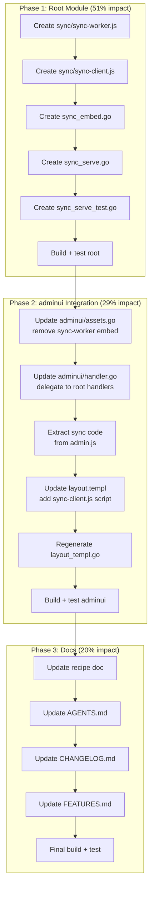

# Plan: Extract Offline Sync to Root Module

> 2026-07-22 — Move `sync-worker.js` and tab-side sync coordination from
> `adminui/` to the root `cqrs-htmx` module so ANY consumer can use offline
> command sync, not just adminui users.

## Problem

The offline command queue (SharedWorker + IndexedDB + HTMX event hooks) is
trapped inside `adminui/assets/`. A consumer NOT using adminui who wants
offline resilience must copy-paste ~340 lines of JS. This is a general
CQRS+HTMX concern, not an admin UI feature.

## Solution

Follow the existing `HTMXScriptHandler` / `HTMXExtensionHandler` pattern:

| Asset                   | Root Handler                    | adminui Delegates To           |
| ----------------------- | ------------------------------- | ------------------------------ |
| `htmx.min.js`           | `HTMXScriptHandler()`           | `cqrshtmx.HTMXScriptHandler()` |
| `extensions/sse.min.js` | `HTMXExtensionHandler("sse")`   | —                              |
| `sync/sync-worker.js`   | `SyncWorkerHandler()` **(new)** | `cqrshtmx.SyncWorkerHandler()` |
| `sync/sync-client.js`   | `SyncClientHandler()` **(new)** | `cqrshtmx.SyncClientHandler()` |

### What moves to root

**`sync/sync-worker.js`** — the SharedWorker (already rewritten this session).
Zero admin-specific logic. General-purpose offline command coordinator.

**`sync/sync-client.js`** — extracted from `admin.js` lines 63-402:

- Sync state object (`pending`, `confirmed`, `failed`, `queued`)
- `updateIndicator()` — updates `[data-sync-status]` element
- `setSyncState()` / `announce()` — DOM + aria-live
- `connectSSE()` — EventSource connection, `sync:ack` handler
- `initSyncWorker()` — SharedWorker connection, tabId, hello/bye
- `enqueueCommand()` / `ackCommand()` / `handleDeadCommand()`
- `retryQueuedCommand()` / `rebuildAndRetry()`
- HTMX event listeners: `beforeRequest`, `responseError`, `sendError`
- Retry button click handler
- `boot()` — connectSSE + initSyncWorker on DOMContentLoaded

### What stays in adminui

**`admin.js`** shrinks to ~65 lines:

- CSRF token injection
- Mobile sidebar toggle
- Toast notifications
- Confirm-before-destructive dialog

### Extraction boundary — zero cross-references

Verified by reading admin.js end-to-end:

- Admin code (CSRF, sidebar, toast, confirm) never references `sync`, `updateIndicator`, `setSyncState`, `announce`, `connectSSE`, `initSyncWorker`, `enqueueCommand`, `ackCommand`, or any sync variable.
- Sync code never references `toast`, `toggleSidebar`, CSRF, or any admin variable.
- The only shared call site was `boot()` which called both `connectSSE()` and `initSyncWorker()` — both sync functions, moves together.

## Execution Graph

## Task Breakdown (sorted by impact/effort)

### Tier 1: 1% effort → 51% result

| #   | Task                                | Effort | Impact   |
| --- | ----------------------------------- | ------ | -------- |
| 1   | Copy sync-worker.js to root `sync/` | 5min   | Critical |
| 2   | Create sync_embed.go (embed decls)  | 5min   | Critical |
| 3   | Create sync_serve.go (handlers)     | 10min  | Critical |

### Tier 2: 4% effort → 64% result

| #   | Task                                   | Effort | Impact |
| --- | -------------------------------------- | ------ | ------ |
| 4   | Extract sync-client.js from admin.js   | 20min  | High   |
| 5   | Add SyncClientHandler to sync_serve.go | 5min   | High   |
| 6   | Create sync_serve_test.go              | 10min  | Medium |

### Tier 3: 20% effort → 80% result

| #   | Task                          | Effort | Impact |
| --- | ----------------------------- | ------ | ------ |
| 7   | Update adminui/assets.go      | 5min   | Medium |
| 8   | Update adminui/handler.go     | 5min   | High   |
| 9   | Strip sync code from admin.js | 10min  | High   |
| 10  | Update layout.templ           | 5min   | Medium |
| 11  | Regenerate layout_templ.go    | 5min   | Medium |

### Tier 4: remaining 20%

| #   | Task                           | Effort | Impact   |
| --- | ------------------------------ | ------ | -------- |
| 12  | Update recipe doc              | 10min  | Medium   |
| 13  | Update AGENTS.md               | 5min   | Low      |
| 14  | Update CHANGELOG.md            | 5min   | Low      |
| 15  | Update FEATURES.md             | 5min   | Low      |
| 16  | Final build + test + JS syntax | 10min  | Critical |

## Verschlimmbesser Risk Assessment

| Risk                                           | Mitigation                                                                           |
| ---------------------------------------------- | ------------------------------------------------------------------------------------ |
| Breaking adminui JS by extraction              | Verified zero cross-refs between admin and sync code                                 |
| layout_templ.go regeneration failure           | `templ` CLI confirmed available                                                      |
| ETag mismatch after asset move                 | Bump adminui ETag + root has its own ETag                                            |
| Consumer confusion (where is sync-worker now?) | Root handlers + updated recipe + backward compat path in adminui                     |
| sync-client.js load order with htmx            | sync-client.js uses DOMContentLoaded — htmx.js loads in `<head>`, always ready first |

---

> **Resolution (2026-07-22, v4.5.0):** Executed. `sync/sync-worker.js` + `sync/sync-client.js`
> moved to root module. `SyncWorkerHandler()` / `SyncClientHandler()` serve them. adminui delegates.
> ADR-0042 documents the decision. See status reports `2026-07-22_18-02` through `2026-07-22_19-23`.
