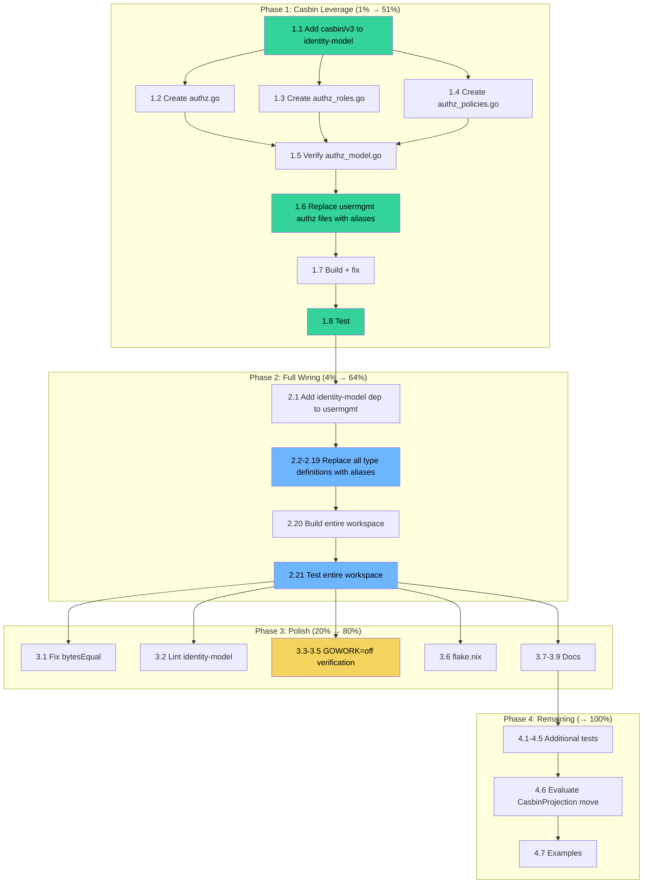

# Plan: Leverage Casbin in identity-model + Full Type Wiring

**Date:** 2026-07-23 18:17
**Goal:** Pull Casbin into identity-model, move the Authz engine there, wire usermgmt to import identity-model for ALL domain types, eliminate the split brain.

---

## Context

### Current State (BROKEN)

```
identity-model/          usermgmt/
├── Role (copy)          ├── Role (original)
├── Action (copy)        ├── Action (original)
├── Policy (copy)        ├── Policy (original)
├── GroupPolicy (copy)   ├── GroupPolicy (original)
├── Authz ← MISSING      ├── Authz (engine, imports casbin)
├── UserID (copy)        ├── UserID (original)
├── UserState (copy)     ├── UserState (original)
├── foldUser (copy)      ├── foldUser (original)
├── errors (copy)        ├── errors (original, with HTTP status)
└── ... (20 more copies) └── ... (20 more originals)
```

**Problem:** EVERY type is duplicated. identity-model is an orphan. usermgmt doesn't import it.

### Target State

```
identity-model/                   usermgmt/
├── Role, Action, Effect          ├── type Authz = identitymodel.Authz  (alias)
├── Policy, GroupPolicy           ├── type UserID = identitymodel.UserID  (alias)
├── Authz (engine + casbin)       ├── errors.go: wraps identitymodel errors with HTTP status
├── UserID, TenantID, ActorID     ├── Service (orchestrator)
├── UserState, foldUser           ├── HTTP handlers
├── All event payloads            ├── SQL stores
├── All commands                  ├── CasbinProjection (imports identitymodel.Authz)
├── All errors (domain-only)      ├── Read models
├── Session, User, Membership     └── Decide/Dispatch functions (use command accessors)
├── Crypto, interfaces
└── NO duplicates in usermgmt
```

---

## Pareto Breakdown

### 1% → 51% (The Casbin Leverage)

Move the Authz engine to identity-model. This is the user's direct request and the highest-impact change.

| # | Task | Impact | Effort |
|---|------|--------|--------|
| 1.1 | Add `casbin/v3` to identity-model/go.mod | Critical | 2 min |
| 1.2 | Create `identity-model/authz.go` — move Authz struct, NewAuthz, Enforce, EnforceAny, EnforceEx, Authorize, AsEnforcer, policyArgs | Critical | 15 min |
| 1.3 | Create `identity-model/authz_roles.go` — move all role query methods + convertRoles | Critical | 10 min |
| 1.4 | Create `identity-model/authz_policies.go` — move all policy CRUD methods + error wrappers | Critical | 15 min |
| 1.5 | Update `identity-model/authz_model.go` — keep DefaultRBACModel, DefaultPolicies, DefaultRoleHierarchy (already there) | Critical | 2 min |
| 1.6 | Delete `usermgmt/authz_types.go`, `authz_roles.go`, `authz_policies.go` content → replace with type aliases | Critical | 10 min |
| 1.7 | Build + fix compilation errors | Critical | 15 min |
| 1.8 | Test identity-model + usermgmt | Critical | 10 min |

### 4% → 64% (Eliminate the Split Brain)

Wire ALL usermgmt domain types to identity-model. This is the #1 issue from the self-review.

| # | Task | Impact | Effort |
|---|------|--------|--------|
| 2.1 | Add identity-model as dependency in usermgmt/go.mod | Critical | 2 min |
| 2.2 | Replace `usermgmt/id.go` → aliases to identitymodel | High | 5 min |
| 2.3 | Replace `usermgmt/email.go` → alias + re-export ParseEmail/MustParseEmail | High | 5 min |
| 2.4 | Replace `usermgmt/credential.go` → alias | High | 5 min |
| 2.5 | Replace `usermgmt/external_account.go` → alias | High | 5 min |
| 2.6 | Replace `usermgmt/es_constants.go` → import constants from identitymodel | High | 5 min |
| 2.7 | Replace `usermgmt/es_events.go` → aliases for all payload types | High | 10 min |
| 2.8 | Replace `usermgmt/es_commands.go` → aliases + update decide functions to use accessors | High | 20 min |
| 2.9 | Replace `usermgmt/es_state.go` → aliases for UserState + delete foldUser | High | 10 min |
| 2.10 | Replace `usermgmt/es_membership_state.go` → aliases + delete foldMembership | High | 5 min |
| 2.11 | Replace `usermgmt/es_tenant_state.go` → aliases + delete foldTenant | High | 5 min |
| 2.12 | Replace `usermgmt/es_bot_state.go` → aliases + delete foldBot | High | 5 min |
| 2.13 | Replace `usermgmt/errors.go` → wrap identitymodel errors with HTTP status | High | 15 min |
| 2.14 | Replace `usermgmt/user.go` → aliases for User, Session, etc. | High | 10 min |
| 2.15 | Replace `usermgmt/crypto.go` → aliases | Medium | 3 min |
| 2.16 | Replace `usermgmt/random.go` → delete (internal to identitymodel) | Medium | 2 min |
| 2.17 | Replace `usermgmt/auth_interfaces.go` → aliases | Medium | 5 min |
| 2.18 | Replace `usermgmt/store_interfaces.go` → aliases | Medium | 5 min |
| 2.19 | Replace `usermgmt/membership.go` (inline in user.go) → alias | Medium | 3 min |
| 2.20 | Build + fix ALL compilation errors across workspace | Critical | 30 min |
| 2.21 | Test entire workspace | Critical | 15 min |

### 20% → 80% (Polish + Validation)

| # | Task | Impact | Effort |
|---|------|--------|--------|
| 3.1 | Fix `bytesEqual` → use `bytes.Equal` in identity-model/fold.go | Medium | 2 min |
| 3.2 | Run golangci-lint on identity-model, fix warnings | Medium | 15 min |
| 3.3 | Add GOWORK=off replace directives to identity-model/go.mod | High | 10 min |
| 3.4 | Verify `GOWORK=off go build` works in identity-model | High | 5 min |
| 3.5 | Verify `GOWORK=off go build` works in usermgmt | High | 5 min |
| 3.6 | Add identity-model to flake.nix build targets | Medium | 10 min |
| 3.7 | Update AGENTS.md with identity-model info | Medium | 5 min |
| 3.8 | Add CHANGELOG entry | Low | 5 min |
| 3.9 | Copy LICENSE to identity-model | Low | 1 min |

### Remaining 20% → 100%

| # | Task | Impact | Effort |
|---|------|--------|--------|
| 4.1 | Test foldMembership with 3+ scenarios in identity-model | Medium | 10 min |
| 4.2 | Test foldBot with 2+ scenarios | Medium | 5 min |
| 4.3 | Test ActorID JSON marshal/unmarshal round-trip | Low | 5 min |
| 4.4 | Test Session JSON marshal/unmarshal round-trip | Low | 5 min |
| 4.5 | Add identity-model to integration_test module | Medium | 10 min |
| 4.6 | Consider whether CasbinProjection should move to identity-model | Low |Discussion |
| 4.7 | Add `example_test.go` with godoc examples | Low | 10 min |

---

## Execution Graph



---

## Risk Analysis

| Risk | Probability | Impact | Mitigation |
|------|------------|--------|------------|
| Command accessor methods break decide functions | Medium | High | Decide functions use `cmd.Email()` instead of `cmd.email` — mechanical rename |
| Error wrapping behavior changes | Low | Medium | usermgmt keeps wrapping identitymodel errors with WithHTTPStatus |
| adminui breaks on Authz type change | Low | Medium | Type alias makes `usermgmt.Authz` == `identitymodel.Authz` |
| Test compilation breaks (sqlite_setup_test.go) | Already broken | None | Pre-existing issue, not caused by this change |
| GOWORK=off fails in identity-model | High | Medium | Add replace directives matching go.work |
| Casbin version mismatch | Low | High | Pin same version as usermgmt (v3.10.0) |

---

## Key Design Decisions

### D1: Casbin is a first-class dependency of identity-model

Casbin IS the authorization model. It's not infrastructure like SQL or HTTP. identity-model is an identity/auth module — Casbin belongs here.

### D2: Policy/GroupPolicy stay as domain wrappers

These types provide type-safe wrappers around Casbin's `[]any` API. Removing them would force all consumers (CasbinProjection, adminui, examples) to use raw strings. The wrappers earn their keep.

### D3: usermgmt errors wrap identitymodel errors

```go
// usermgmt/errors.go (after wiring)
var ErrUserNotFound = cqrshtmx.WithHTTPStatus(identitymodel.ErrUserNotFound, http.StatusNotFound)
```

This preserves the HTTP status behavior while using identitymodel as the single source of domain error classification.

### D4: Command structs get accessor methods

identity-model commands already have accessors (`.Email()`, `.Roles()`, etc.). usermgmt's decide functions will use these instead of direct field access. The fields stay unexported.

### D5: Fold functions move to identity-model

`foldUser`, `foldMembership`, `foldTenant`, `foldBot` are pure domain logic. They belong with the types they operate on. usermgmt's state files become thin aliases.
