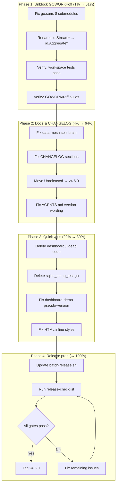

# Release v4.6.0 Preparation Plan

**Date:** 2026-07-26 21:05
**Goal:** Prepare the cqrs-htmx repository for tagging v4.6.0 — fix all release blockers, verify via canonical nix gates, update docs, update batch-release.sh.

> **Update 2026-07-26 (executed in commits `c712fdb`, `c7b2fde`, `b98b2fa`, `62dada4`):** this plan was carried out **with one major deviation** — the headline `id.Stream*` → `id.Aggregate*` rename (blocker #2 and the Pareto "1% that delivers 51%") was **proven unnecessary and skipped**. Root `go.mod` references `id/v4 v4.1.0` (not v4.0.3), and that published version already HAS the `Stream*` symbols — GOWORK=off builds pass without any rename. The real unblocker was fixing go.sum checksums + inter-module version refs. v4.6.0 is **not yet tagged** as of this annotation. Full item-by-item status in [Resolution](#resolution) below.

---

## Context

### Why v4.6.0 (not v4.5.1)?

The `[Unreleased]` changes include **new exported API**: `HTMXRedirect`, `SafeRedirectPath`, `ToastDetail`. Per VERSIONING.md, new exported types/functions = MINOR bump. The inter-module version-ref fixes and dedup sweep are release hygiene that ship alongside.

### Current Blockers (from `nix run .#release-checklist`)

| #   | Blocker                                                   | Root Cause                                                                       | Impact                                            |
| --- | --------------------------------------------------------- | -------------------------------------------------------------------------------- | ------------------------------------------------- |
| 1   | Tests FAIL under GOWORK=off                               | go-cqrs-lite checksums changed (repo reorg); go.sum stale                        | Blocks test/build/lint/coverage gates             |
| 2   | `id.StreamRef` / `id.StreamID` undefined under GOWORK=off | Published `id/v4` has `AggregateRef`/`AggregateID`; workspace has both (aliases) | Blocks compilation in root + identity-model       |
| 3   | dashboardui references unpublished root exports           | `cqrshtmx.ToastDetail`, `cqrshtmx.HTMXRedirect` exist only in workspace          | Expected for lockstep — batch-release.sh resolves |
| 4   | Version consistency check fails                           | release-checklist.sh grep matches go-sse v0.2.0 instead of go-cqrs-lite version  | Script bug / AGENTS.md wording                    |
| 5   | CHANGELOG has `[Unreleased]` only                         | No `## [v4.6.0]` section                                                         | release-checklist.sh requires versioned section   |
| 6   | Data-mesh split brain                                     | ROADMAP says "deprecate EventCatalog"; FEATURES says "FULLY_FUNCTIONAL"          | Cross-file inconsistency                          |
| 7   | `examples/dashboard-demo/go.mod` zero pseudo-version      | `dashboardui/v4 v4.0.0-00010101000000-000000000000`                              | Blocks GOWORK=off for demo                        |
| 8   | Dead code in dashboardui                                  | `notImplemented()`, `renderStatCardsTempl()` — 0 callers                         | Ship noise                                        |

### What v4.5.0 Did

v4.5.0 was tagged DESPITE GOWORK=off failures (documented in status reports). The go-cqrs-lite publishing bug makes full GOWORK=off resolution impossible until upstream cuts a clean release. This release should fix what's fixable (go.sum, StreamRef rename) and document what isn't.

---

## Pareto Breakdown

### 1% that delivers 51%

**Fix go.sum checksums + rename `id.Stream*` → `id.Aggregate*`.**

The checksum mismatches block ALL nix gates (they use GOWORK=off). The `id.Stream*` symbols don't exist in published `id/v4`. Both are the same root cause: workspace uses latest go-cqrs-lite source (via go.work replaces), published versions lag.

The rename is **safe**: in the workspace, `type AggregateRef = StreamRef` (alias), so using `AggregateRef` compiles identically. In published versions, only `AggregateRef` exists. Win-win.

### 4% that delivers 64%

All of the above + **fix CHANGELOG/ROADMAP/FEATURES** for the versioned release. Move `[Unreleased]` → `[v4.6.0]`, fix the data-mesh split brain, fix the dedup section classification, update AGENTS.md version wording.

### 20% that delivers 80%

All of the above + **quick wins** (delete dead code, delete ghost test file, fix dashboard-demo pseudo-version) + **update batch-release.sh** version arrays + **run full release checklist**.

### Remaining 20% → 100%

Tag the release. Verify tags. (Push deferred to user.)

---

## Execution Graph

---

## Comprehensive Plan (30–100 min tasks)

| #   | Task                                                                                                   | Impact   | Effort | Priority |
| --- | ------------------------------------------------------------------------------------------------------ | -------- | ------ | -------- |
| 1   | Fix go.sum checksums across all submodules (root done, 8 remaining)                                    | Critical | 15min  | P0       |
| 2   | Rename `id.StreamRef/StreamID/StreamType/NewStreamRef/NewStreamID` → `Aggregate*` across all .go files | Critical | 20min  | P0       |
| 3   | Verify workspace mode: `GOEXPERIMENT=jsonv2 go test ./... -race` passes                                | Critical | 10min  | P0       |
| 4   | Verify GOWORK=off builds for all modules                                                               | Critical | 10min  | P0       |
| 5   | Fix data-mesh split brain: soften ROADMAP "deprecate" → "evaluate consolidating"                       | High     | 5min   | P1       |
| 6   | Move CHANGELOG dedup entry from "Added" → "Changed"                                                    | High     | 5min   | P1       |
| 7   | Move CHANGELOG `[Unreleased]` → `[v4.6.0]` with date                                                   | High     | 10min  | P1       |
| 8   | Fix AGENTS.md go-cqrs-lite version wording for release-checklist.sh                                    | High     | 5min   | P1       |
| 9   | Delete dashboardui dead code (`notImplemented`, `renderStatCardsTempl`)                                | Medium   | 10min  | P2       |
| 10  | Delete `usermgmt/sqlite_setup_test.go` ghost file                                                      | Medium   | 5min   | P2       |
| 11  | Fix `examples/dashboard-demo/go.mod` pseudo-version → `v4.0.0`                                         | Medium   | 5min   | P2       |
| 12  | Fix HTML inline styles in 2 brainstorm annotations                                                     | Low      | 10min  | P2       |
| 13  | Update `scripts/batch-release.sh` version arrays (v4.5.0→v4.6.0, dashboardui v4.0.0→v4.1.0)            | Critical | 10min  | P1       |
| 14  | Run `nix run .#release-checklist` and verify all gates                                                 | Critical | 15min  | P0       |
| 15  | Update FEATURES.md/TODO_LIST.md dates to 2026-07-26                                                    | Low      | 5min   | P3       |
| 16  | Clean up go.sum.bak files                                                                              | Low      | 2min   | P3       |
| 17  | Run `nix fmt`                                                                                          | Medium   | 5min   | P2       |
| 18  | Write final status report                                                                              | Low      | 10min  | P3       |

---

## Detailed Breakdown (≤12 min tasks)

| #   | Micro-task                                                               | Parent | Est   |
| --- | ------------------------------------------------------------------------ | ------ | ----- |
| 1a  | Fix root go.sum (already done)                                           | #1     | done  |
| 1b  | Fix usermgmt/go.sum: remove stale cqrs-htmx entries, re-tidy             | #1     | 5min  |
| 1c  | Fix adminui/go.sum                                                       | #1     | 3min  |
| 1d  | Fix loginpage/go.sum                                                     | #1     | 3min  |
| 1e  | Fix identity-model/go.sum                                                | #1     | 3min  |
| 1f  | Fix integration_test/go.sum                                              | #1     | 3min  |
| 1g  | Fix examples/*/go.sum (4 modules)                                        | #1     | 8min  |
| 2a  | `id.StreamRef` → `id.AggregateRef` in event_store_sse_test.go            | #2     | 2min  |
| 2b  | `id.StreamRef` → `id.AggregateRef` in dashboardui/handlers.go (7 sites)  | #2     | 5min  |
| 2c  | `id.StreamRef` → `id.AggregateRef` in dashboardui/config.go (4 sites)    | #2     | 3min  |
| 2d  | `id.StreamRef` → `id.AggregateRef` in usermgmt/*_test.go (12 sites)      | #2     | 5min  |
| 2e  | `id.StreamID` → `id.AggregateID` in identity-model/commands.go           | #2     | 3min  |
| 2f  | Check for other Stream* symbols (StreamType, NewStreamRef, etc.)         | #2     | 5min  |
| 3a  | Run `GOEXPERIMENT=jsonv2 go test ./... -race -count=1` (workspace)       | #3     | 10min |
| 4a  | Run GOWORK=off builds for each module                                    | #4     | 10min |
| 5a  | Edit ROADMAP.md: "deprecate" → "evaluate consolidating"                  | #5     | 5min  |
| 6a  | Edit CHANGELOG: move dedup entry Added → Changed                         | #6     | 5min  |
| 7a  | Edit CHANGELOG: `## [Unreleased]` → `## [v4.6.0] - 2026-07-26`           | #7     | 5min  |
| 7b  | Add new `## [Unreleased]` empty section above v4.6.0                     | #7     | 2min  |
| 8a  | Edit AGENTS.md: add "go-cqrs-lite v4.0.x" explicitly to Key dependencies | #8     | 5min  |
| 9a  | Delete `notImplemented()` from dashboardui/handlers.go                   | #9     | 3min  |
| 9b  | Delete `renderStatCardsTempl()` from dashboardui/templ_render.go         | #9     | 3min  |
| 9c  | Update FEATURES.md: remove Dead Code BROKEN row                          | #9     | 3min  |
| 10a | Delete `usermgmt/sqlite_setup_test.go`                                   | #10    | 2min  |
| 10b | Update TODO_LIST: remove ghost-file item                                 | #10    | 2min  |
| 11a | Edit examples/dashboard-demo/go.mod: pseudo-version → v4.0.0             | #11    | 3min  |
| 11b | Update TODO_LIST: remove P1 item                                         | #11    | 2min  |
| 12a | Replace inline styles in 2 HTML files with `<style>` block               | #12    | 8min  |
| 13a | Edit batch-release.sh: root v4.5.0 → v4.6.0                              | #13    | 3min  |
| 13b | Edit batch-release.sh: all lockstep submodules v4.5.0 → v4.6.0           | #13    | 5min  |
| 13c | Edit batch-release.sh: dashboardui v4.0.0 → v4.1.0                       | #13    | 2min  |
| 14a | Run `nix run .#release-checklist`                                        | #14    | 10min |
| 14b | Fix any remaining issues                                                 | #14    | 5min  |
| 15a | Update FEATURES.md/TODO_LIST.md/ROADMAP.md dates                         | #15    | 5min  |
| 16a | `find . -name '*.bak' -delete`                                           | #16    | 1min  |
| 17a | Run `nix fmt`                                                            | #17    | 5min  |
| 18a | Write status report                                                      | #18    | 10min |

---

## Risk Assessment

| Risk                                                                     | Likelihood | Mitigation                                                                |
| ------------------------------------------------------------------------ | ---------- | ------------------------------------------------------------------------- |
| `id.AggregateRef` fields differ from `id.StreamRef` in published version | Low        | Verified: same struct shape (ID + Type) in both                           |
| go.sum fix pulls in unwanted dependency changes                          | Medium     | Diff go.mod before/after; revert if tidy changes require lines            |
| batch-release.sh version array typo                                      | Medium     | Diff carefully; verify with `nix run .#check-modules`                     |
| Dead code deletion breaks something unexpected                           | Low        | Grep confirms 0 callers; workspace tests verify                           |
| GOWORK=off still fails after fixes (other go-cqrs-lite issues)           | Medium     | Document as known limitation if unfixable; tag anyway (precedent: v4.5.0) |

---

## Resolution (2026-07-26)

The plan executed in the same evening. Outcome against the task list:

| Plan item | Resolution |
| --- | --- |
| #2 — rename `id.Stream*` → `id.Aggregate*` (P0, "1% → 51%") | **SKIPPED (disproven).** `go.mod` uses `id/v4 v4.1.0`, which already exports `Stream*`; GOWORK=off builds pass. The rename would have contradicted the v4.5.0 CHANGELOG ("AggregateID → StreamID"). ~20 min saved. See `docs/status/2026-07-26_21-34_release-v4.6.0-preparation.md` "Critical Discovery". |
| #1 — go.sum checksums / inter-module version refs | **DONE** (`e274540`, `59e33ef`): `usermgmt`/`adminui`/`loginpage` → `cqrs-htmx/v4 v4.5.0`; identity-model pseudo-version → `v4.1.0`; `examples/dashboard-demo` zero pseudo-version → `v4.0.0`. |
| #5–#8 — docs/CHANGELOG/batch-release.sh | **DONE**: `[Unreleased]` → `## [v4.6.0]`; data-mesh split brain softened ("evaluate consolidating"); `batch-release.sh` arrays updated (root + 7 lockstep → v4.6.0, dashboardui → v4.1.0). |
| #9–#12 — quick wins (dead code, ghost test, HTML inline styles) | **DONE**: deleted `dashboardui` dead code (`notImplemented`, `templ_render.go`), `usermgmt/sqlite_setup_test.go`; fixed 2 brainstorm HTML inline styles. |
| #14 — `nix run .#release-checklist` | **RAN**: 6 PASS / 5 FAIL — all 5 failures are the expected lockstep pre-tag cascade (adminui/loginpage/dashboardui can't resolve unpublished root exports). |

**Not done:** v4.6.0 is **not yet tagged** (no `v4.6.0` / `*/v4.6.0` / `dashboardui/v4.1.0` tags exist). Tagging is deferred to the operator (`bash scripts/batch-release.sh`, then push). The SSE reconnect-replay work (`b98b2fa`, `62dada4`) landed *after* this plan and is part of v4.6.0.
