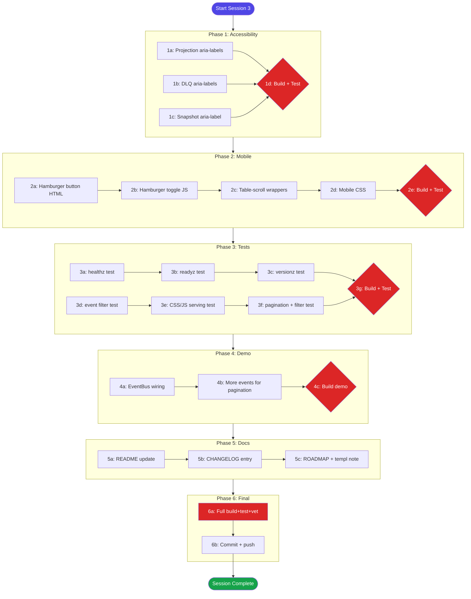

# Dashboardui Improvement Sprint — Session 3 Plan

> **Date:** 2026-07-30 21:15
> **Goal:** Finish the remaining improvement-sprint work with maximum impact, zero regressions.
> **Anti-goal:** VERSCHLIMMBESSER. Do NOT break working code to "improve" it.

---

## Strategic Analysis — What Should We REALLY Do?

### The templ question

The user reacted to painful string-concatenation edits: "Why are we not using templ?!?!"

**Decision: Do NOT migrate to templ in this sprint.** Rationale:

1. **VERSCHLIMMBESSER risk:** The dashboard works. 56 tests pass. Build is green. A templ migration would touch ALL 28 files and risk breaking everything.
2. **Wrong scope:** The improvement ideas are about FEATURES (mobile, a11y, observability), not rendering technology.
3. **Future effort:** The README already says "Future iterations will migrate to templ-components." Add a ROADMAP entry and leave it.
4. **The 1% decision that delivers 51% of value:** Avoid the refactor trap. Finish features on the current approach.

### Pareto Breakdown

#### 1% that delivers 51% of the result

| Action                                       | Why                                                                                    |
| -------------------------------------------- | -------------------------------------------------------------------------------------- |
| **Stay on strings.Builder, finish features** | Migrating mid-sprint would destroy 2 sessions of work for zero customer-facing benefit |

#### 4% that delivers 64% of the result

| Action                     | Impact                                                | Effort |
| -------------------------- | ----------------------------------------------------- | ------ |
| **Mobile responsiveness**  | Dashboard unusable on phones without it               | Medium |
| **Tests for new features** | Zero confidence in new code without them              | Medium |
| **Documentation**          | Users can't discover SSE, filtering, health endpoints | Low    |

#### 20% that delivers 80% of the result

| Action                             | Impact                           | Effort |
| ---------------------------------- | -------------------------------- | ------ |
| Accessibility aria-labels          | Screen reader users can navigate | Low    |
| Hamburger toggle + table scroll    | Mobile users can browse          | Medium |
| Health/filter/CSS-JS tests         | Confidence in new features       | Medium |
| Demo with EventBus+projections+DLQ | Full showcase of capabilities    | Medium |
| README + CHANGELOG update          | Discoverability + adoption       | Low    |

#### Remaining 20% for 100%

| Action                | Impact          | Effort |
| --------------------- | --------------- | ------ |
| Config reference doc  | Completeness    | Low    |
| Final verification    | Confidence      | Low    |
| Planning doc + commit | Reproducibility | Low    |

---

## Coarse Plan (6 phases, sorted by impact/effort)

| #   | Phase                           | Impact                          | Effort | Files                               | Est.  |
| --- | ------------------------------- | ------------------------------- | ------ | ----------------------------------- | ----- |
| 1   | **Accessibility: aria-labels**  | High (a11y compliance)          | Low    | 3 handler files                     | 15min |
| 2   | **Mobile responsiveness**       | High (unlocks phone/tablet use) | Medium | layout.go + all handlers            | 45min |
| 3   | **Tests: new features**         | High (confidence debt)          | Medium | 2 new test files                    | 60min |
| 4   | **Demo enhancement**            | High (full capability showcase) | Medium | examples/dashboard-demo/main.go     | 45min |
| 5   | **Documentation**               | High (discoverability)          | Low    | README.md, CHANGELOG.md, ROADMAP.md | 30min |
| 6   | **Final verification + commit** | Critical (don't ship broken)    | Low    | —                                   | 15min |

**Total estimated: ~3.5 hours**

---

## Fine-Grained Task Breakdown (each ≤12min, sorted by impact)

### Phase 1: Accessibility (aria-labels)

| Task | Description                                           | File(s)                 | Impact   | Est. |
| ---- | ----------------------------------------------------- | ----------------------- | -------- | ---- |
| 1a   | Add aria-labels to projection Reset button + DLQ link | handlers_projections.go | High     | 8min |
| 1b   | Add aria-labels to DLQ Replay/Delete/Purge buttons    | handlers_dlq.go         | High     | 8min |
| 1c   | Add aria-label to snapshot Delete button              | handlers_snapshots.go   | Medium   | 5min |
| 1d   | Verify build + test after a11y changes                | —                       | Critical | 3min |

### Phase 2: Mobile Responsiveness

| Task | Description                                                                         | File(s)                                                                                                                                                    | Impact   | Est.  |
| ---- | ----------------------------------------------------------------------------------- | ---------------------------------------------------------------------------------------------------------------------------------------------------------- | -------- | ----- |
| 2a   | Add hamburger button to renderHeader                                                | layout.go                                                                                                                                                  | High     | 10min |
| 2b   | Add hamburger toggle JS to dashboardJS                                              | layout.go                                                                                                                                                  | High     | 8min  |
| 2c   | Add table-scroll wrapper div around ALL data tables                                 | handlers_events.go, handlers_aggregates.go, handlers_projections.go, handlers_audit.go, handlers_timetravel.go, handlers_snapshots.go, handler_overview.go | High     | 12min |
| 2d   | Add mobile CSS: touch targets (44px), filter bar stacking, sidebar overlay backdrop | layout.go (dashboardCSS)                                                                                                                                   | High     | 10min |
| 2e   | Verify build + test after mobile changes                                            | —                                                                                                                                                          | Critical | 3min  |

### Phase 3: Tests

| Task | Description                                             | File(s)                       | Impact   | Est.  |
| ---- | ------------------------------------------------------- | ----------------------------- | -------- | ----- |
| 3a   | Test healthz returns 200 + status:ok                    | handlers_health_test.go (NEW) | High     | 8min  |
| 3b   | Test readyz returns 200 when configured, 503 when not   | handlers_health_test.go       | High     | 10min |
| 3c   | Test versionz returns capabilities JSON                 | handlers_health_test.go       | Medium   | 8min  |
| 3d   | Test event filtering (?type=X filters events)           | handlers_security_test.go     | High     | 10min |
| 3e   | Test CSS/JS serving (Content-Type, Cache-Control)       | handlers_security_test.go     | Medium   | 8min  |
| 3f   | Test pagination cursor preservation with active filters | handlers_security_test.go     | Medium   | 10min |
| 3g   | Verify build + test after test additions                | —                             | Critical | 3min  |

### Phase 4: Demo Enhancement

| Task | Description                                  | File(s)                         | Impact   | Est.  |
| ---- | -------------------------------------------- | ------------------------------- | -------- | ----- |
| 4a   | Wire EventBus to demo for live SSE updates   | examples/dashboard-demo/main.go | High     | 12min |
| 4b   | Add more events (30+ for pagination testing) | examples/dashboard-demo/main.go | Medium   | 8min  |
| 4c   | Build + verify demo compiles                 | —                               | Critical | 5min  |

### Phase 5: Documentation

| Task | Description                                                                       | File(s)          | Impact | Est.  |
| ---- | --------------------------------------------------------------------------------- | ---------------- | ------ | ----- |
| 5a   | Update README: SSE reconnect, filtering, observability, mobile, copy-to-clipboard | README.md        | High   | 12min |
| 5b   | Add CHANGELOG entry for all improvements (sessions 2+3)                           | CHANGELOG.md     | High   | 10min |
| 5c   | Create dashboardui/ROADMAP.md with templ migration note                           | ROADMAP.md (NEW) | Low    | 5min  |

### Phase 6: Final Verification + Commit

| Task | Description                             | File(s) | Impact   | Est. |
| ---- | --------------------------------------- | ------- | -------- | ---- |
| 6a   | Full build + test + vet verification    | —       | Critical | 5min |
| 6b   | Git commit with detailed message + push | —       | Critical | 5min |

**Total fine-grained tasks: 21**
**Total estimated time: ~3 hours**

---

## Mermaid Execution Graph

---

## Anti-VERSCHLIMMBESSER Principles

1. **Do NOT migrate to templ** — it's a future effort, not this sprint
2. **Do NOT refactor rendering** — strings.Builder works, leave it
3. **Do NOT add dependencies** — use what's already imported
4. **Do NOT change module structure** — no new go.mod files
5. **Every change must build + test green** before proceeding
6. **If something works, LEAVE IT ALONE** — don't touch unrelated code
7. **Small, verifiable steps** — one file per task where possible

---

## What's Already Done (Sessions 1-2)

- Health endpoints (healthz, readyz, versionz)
- Event filtering (type, streamType, streamID) with filter bar UI
- Event detail: schema version badge, encoding indicator, prev/next nav
- Time-travel: range slider, latest link, permalink
- Projections: restarts/checkpoint/last error + DLQ link from row
- SSE event count display + copy-to-clipboard JS
- Skip-to-content link
- Heading hierarchy fixes (h3->h2 for page content, h4->h3 for sub-sections)
- Encoding badge fix (JSON no longer green)
- data-copyable on event detail, aggregate detail, snapshots, audit, time-travel
- metaRowCopyable helper

## What This Sprint Adds

- aria-labels on all action buttons
- Mobile hamburger toggle + table scroll + touch targets
- 8 new tests (health, filter, CSS/JS serving, pagination)
- Demo with EventBus + more events
- README + CHANGELOG + ROADMAP documentation
