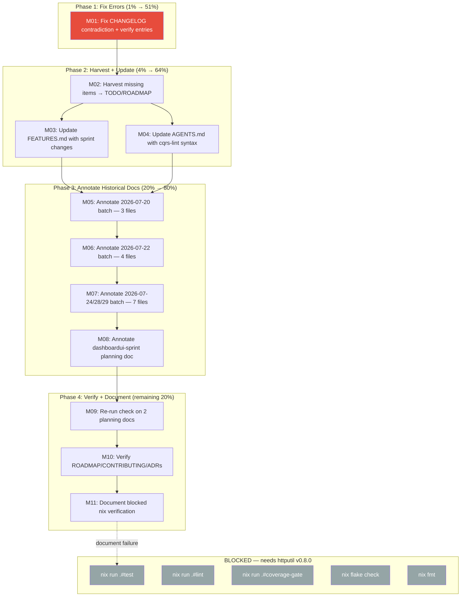

# SUPERB Plan — Docs-Health + Update-Old-Docs Completion Blitz

> **Date:** 2026-07-31 04:44 (CEST)
> **Status:** PLAN — awaiting execution
> **Goal:** Close ALL gaps from the `2026-07-31_04-41` status report. Fix what was broken, complete what was abandoned, verify what was claimed, harvest what was missed. Zero Verschlimmbesserung.
> **Source:** `docs/status/2026-07-31_04-41_docs-health-update-old-docs-session.md` (the self-critique that identified every gap)

---

## Context

The prior session ran both `docs-health` and `update-old-docs` skills. It completed the living-docs rebuild (TODO_LIST, CHANGELOG, FEATURES, ROADMAP) but **abandoned the historical-docs annotation pass** after only 3 of 35 files. It also **introduced a CHANGELOG contradiction** ("gates verified" vs "blocked by httputil" in the same `[Unreleased]` section) and **wrote CHANGELOG entries from status reports without code verification**.

This plan closes every gap systematically.

### Corrected scope (the 32-file myth)

Sub-agents classified 32 status reports as "ANNOTATE", but **15 already HAVE annotation sections** from prior sessions. The real scope is **17 files** (14 status reports + 1 planning doc needing first annotation + 2 planning docs needing re-run check). This is a 47% reduction from the naive count.

---

## Anti-Verschlimmbesserung Guardrails

**These rules are non-negotiable. Violating them IS the Verschlimmbesserung.**

1. **Code is source of truth.** Status reports are LEADS, not evidence. Verify every annotation claim against actual code or git log before writing it.
2. **Don't fix pre-existing code issues.** Items like `decoder.go:22` unparam or `sse_replay_test.go` data race are PRE-EXISTING — not caused by this session. HARVEST them into TODO_LIST; do NOT fix them.
3. **Don't re-annotate files with correct annotations.** 15 files already have Resolution sections. Only re-check if there's evidence of items resolved SINCE the last annotation.
4. **Leave alone > noise.** If an annotation would just say "see CHANGELOG" or could apply to any file, DON'T WRITE IT. The update-old-docs skill measures success by value-per-annotation, not files-touched.
5. **Don't touch code files.** This is a documentation session. The only code change allowed is fixing the CHANGELOG contradiction (a doc file).
6. **Verify before annotating.** Read the file, check open items against current state (CHANGELOG, git log, code), THEN write. Never annotate from memory.
7. **Check for internal contradictions after every multi-section edit.** The CHANGELOG split brain happened because I didn't re-read after editing.

---

## Pareto Breakdown

### The 1% that delivers 51% of the result

**Fix the CHANGELOG contradiction.** The `[Unreleased]` section has "Canonical nix quality gates verified" (Fixed) AND "blocked by httputil v0.8.0" (Changed) in the same section. This actively misleads every reader. ~5 min. Zero Verschlimmbesserung risk — it's correcting a factual error I introduced.

### The 4% that delivers 64% of the result

**Annotate the 15 files needing first-pass annotation** (14 status reports + 1 planning doc). The sub-agent classification already identified per-file open items. The work is: read file → check items against current state → write resolution appendix. ~10 min/file = ~150 min total. Medium Verschlimmbesserung risk (mitigated by guardrail #1).

### The 20% that delivers 80% of the result

**+ Harvest gaps + FEATURES/AGENTS updates.** The prior session missed several harvestable items (unparam, data race, ws_dispatch, phantom-version gate) and didn't update FEATURES/AGENTS with dashboardui sprint and cqrs-lint information. ~60 min.

### The remaining 20% for 100%

**+ Re-run check on 17 already-annotated files + blocked verification documentation + ROADMAP/CONTRIBUTING freshness.** Lower-priority work that ensures completeness but doesn't block correctness. ~45 min for unblocked items; blocked items deferred.

---

## Blocked Items (external dependency)

These CANNOT be completed until **httputil v0.8.0** is published and the `go.work` replace is removed:

| Item | Blocker | Tracking |
| ---- | ------- | -------- |
| `nix run .#test` | httputil v0.7.1 lacks consolidated symbols | TODO_LIST P1 |
| `nix run .#lint` | Same | TODO_LIST P1 |
| `nix run .#coverage-gate` | Same | TODO_LIST P1 |
| `nix flake check` | Same | TODO_LIST P1 |
| `nix fmt` | Same | — |
| Coverage number verification | Same | — |
| Release tag cut | Same (don't tag a broken hermetic build) | Question Q1 |

**Action for blocked items:** Attempt `nix run .#test` once to document the exact failure mode, then defer. Do NOT skip silently.

---

## Medium-Granularity Plan (30–100 min tasks)

| ID  | Task | Impact | Effort | Unblocked? |
| --- | ---- | ------ | ------ | ---------- |
| M01 | **Fix CHANGELOG contradiction + verify entries** — correct the "gates verified" vs "blocked" split brain; verify cqrs-lint/dashboardui/identity-model entries against `git log` | Critical | 30 min | Yes |
| M02 | **Harvest missing items** — decoder.go unparam, sse_replay_test race, ws_dispatch revert, phantom-version CI gate, batch-release.sh redesign into TODO_LIST/ROADMAP | High | 30 min | Yes |
| M03 | **Update FEATURES.md with dashboardui sprint changes** — mobile responsive, a11y, CSS overhaul, cursor-based pagination, 404 handler | High | 30 min | Yes |
| M04 | **Update AGENTS.md with cqrs-lint suppression syntax** — line+above matching, v0.2.2 one-rule limitation, go.mod comment support, stale detector behavior | Medium | 20 min | Yes |
| M05 | **Annotate 2026-07-20 batch** (3 files: buildflow-failure-triage, dedup-9-to-5, templ-layout-grid-audit) | High | 30 min | Yes |
| M06 | **Annotate 2026-07-22 batch** (4 files: art-dupl-t3, post-extraction-cleanup, type-system-followup, sync-cleanup-round2) | High | 40 min | Yes |
| M07 | **Annotate 2026-07-24/28/29 batch** (7 files: book-insights-exec, todo-list-final-sweep, p1-p2-coverage, offline-sync-e2e, todo-blitz-exec, dedup-round3, dedup-round4) | High | 60 min | Yes |
| M08 | **Annotate dashboardui-sprint-session3 planning doc** (21 open tasks — check which shipped) | Medium | 20 min | Yes |
| M09 | **Re-run check on casbin-leverage + v4.6.0-prep planning docs** — verify open items against current state | Low | 20 min | Yes |
| M10 | **Verify ROADMAP/CONTRIBUTING freshness** — check "Not Planned" completeness, version refs, ADR staleness | Low | 20 min | Yes |
| M11 | **Document blocked verification** — attempt `nix run .#test`, capture exact failure, update TODO_LIST if needed | Low | 15 min | Partially |

**Total unblocked effort: ~315 min (~5.3 hours)**

---

## Fine-Grained Plan (max 12 min tasks)

### M01: Fix CHANGELOG contradiction + verify entries

| ID   | Sub-task | Time |
| ---- | -------- | ---- |
| F001 | Read full `[Unreleased]` section to identify all contradictions | 3 min |
| F002 | Fix "Canonical nix quality gates verified" entry — add note: gates verified BEFORE httputil consolidation; now blocked until v0.8.0 | 5 min |
| F003 | Run `git log --oneline \| grep -i cqrs-lint` — verify cqrs-lint entries | 3 min |
| F004 | Run `git log --oneline \| grep -i dashboardui` — verify dashboardui sprint entries | 3 min |
| F005 | Run `git log --oneline \| grep -i identity-model` — verify identity-model entries | 3 min |
| F006 | Correct any inaccurate counts/claims found in F003-F005 | 5 min |
| F007 | Re-read full `[Unreleased]` section — verify zero contradictions remain | 3 min |

### M02: Harvest missing items

| ID   | Sub-task | Time |
| ---- | -------- | ---- |
| F008 | Verify `decoder.go:22` unparam still exists (`sed -n '20,25p' decoder.go`) | 3 min |
| F009 | Verify `sse_replay_test.go` race condition context (grep for ResponseRecorder) | 3 min |
| F010 | Verify `ws_dispatch.go` closure wrapper state (read the nolint line) | 3 min |
| F011 | Add decoder.go unparam to TODO_LIST P2 with evidence | 3 min |
| F012 | Add sse_replay_test.go race to TODO_LIST P2 with evidence | 3 min |
| F013 | Route ws_dispatch.go revert recommendation to ROADMAP "Not Planned" or TODO | 5 min |
| F014 | Add phantom-version CI gate to ROADMAP Operational Tooling | 3 min |
| F015 | Re-read TODO_LIST + ROADMAP for consistency after additions | 3 min |

### M03: Update FEATURES.md with dashboardui sprint changes

| ID   | Sub-task | Time |
| ---- | -------- | ---- |
| F016 | Read current dashboardui FEATURES rows | 3 min |
| F017 | Verify mobile responsive code exists (`grep -r "responsive\|@media" dashboardui/`) | 3 min |
| F018 | Verify a11y code exists (`grep -r "aria-\|focus-visible\|prefers-reduced" dashboardui/`) | 3 min |
| F019 | Verify CSS overhaul exists (`grep -c "var(--" dashboardui/dashboard.css` or similar) | 3 min |
| F020 | Verify cursor-based pagination exists (`grep -r "after=\|cursor\|HasMore" dashboardui/`) | 3 min |
| F021 | Verify 404 handler exists (`grep -r "notFound\|404" dashboardui/`) | 3 min |
| F022 | Add sprint features to FEATURES.md dashboardui section | 8 min |
| F023 | Re-read dashboardui section for consistency | 3 min |

### M04: Update AGENTS.md with cqrs-lint suppression syntax

| ID   | Sub-task | Time |
| ---- | -------- | ---- |
| F024 | Read AGENTS.md Gotchas section (find insertion point) | 3 min |
| F025 | Verify suppression syntax from actual code (`grep -rn "cqrs-lint:ignore" --include="*.go" \| head -10`) | 5 min |
| F026 | Write cqrs-lint suppression gotcha entry (line+above matching, v0.2.2 limitation, go.mod support, stale detector) | 8 min |
| F027 | Verify entry doesn't duplicate existing gotchas | 3 min |

### M05: Annotate 2026-07-20 batch (3 files)

| ID   | Sub-task | Time |
| ---- | -------- | ---- |
| F028 | Read + annotate `2026-07-20_03-40_buildflow-failure-triage` — open items: fatcontext/dupword nolints (DONE), lint-zero-pass (DONE), CI guards (open) | 10 min |
| F029 | Read + annotate `2026-07-20_04-06_dedup-session-9-to-5-clones` — open items: nix gates (blocked), dedicated tests (open), CHANGELOG (DONE) | 10 min |
| F030 | Read + annotate `2026-07-20_22-51_templ-layout-grid-audit` — open items: loginpage audit (open), CSS audit (open), structural tests (open) | 10 min |

### M06: Annotate 2026-07-22 batch (4 files)

| ID   | Sub-task | Time |
| ---- | -------- | ---- |
| F031 | Read + annotate `2026-07-22_06-05_art-dupl-threshold-3-clone-elimination` — open: lint (DONE), nix gates (blocked), rationale comments (open) | 10 min |
| F032 | Read + annotate `2026-07-22_18-21_post-extraction-cleanup-and-self-review` — open: browser E2E (DONE, tests pass), integration tests (open) | 10 min |
| F033 | Read + annotate `2026-07-22_19-05_type-system-audit-followup-status` — open: coverage gate (DONE), CHANGELOG (DONE), sqlite_setup_test (check) | 10 min |
| F034 | Read + annotate `2026-07-22_19-23_sync-cleanup-round2-lint-docs-js-polish` — open: submodule coverage gate (DONE), JSDoc (open), browser E2E (DONE), SyncWorkerURL (DONE, in ROADMAP) | 10 min |

### M07: Annotate 2026-07-24/28/29 batch (7 files)

| ID   | Sub-task | Time |
| ---- | -------- | ---- |
| F035 | Read + annotate `2026-07-24_05-58_book-insights-gap-closure-execution` — open: CHANGELOG/AGENTS/FEATURES (DONE), coverage gate (DONE), concurrent commits (N/A) | 8 min |
| F036 | Read + annotate `2026-07-28_23-02_todo-list-final-sweep-sa1019-lint-dead-code` — open: identity-model gate (DONE), MySQL (TODO P3), offline E2E (partial), nix gates (blocked), gopls warnings (open) | 10 min |
| F037 | Read + annotate `2026-07-29_00-05_p1-p2-coverage-gate-lint-audit-dashboardui-tests` — open: more dashboardui tests (TODO P2), raise gates (open), nix gates (blocked) | 8 min |
| F038 | Read + annotate `2026-07-29_00-17_offline-sync-e2e-browser-testing` — open: FormData bug (DONE), e2e README (DONE), nix run .#e2e (TODO P2), CI integration (TODO P2) | 8 min |
| F039 | Read + annotate `2026-07-29_08-58_todo-blitz-execution-brutal-self-review` — open: FEATURES/ROADMAP (DONE), planning doc (DONE), push (DONE), more dashboardui tests (TODO P2), nix flake check (blocked) | 8 min |
| F040 | Read + annotate `2026-07-29_23-07_dedup-round3-zero-clones` — open: CHANGELOG (DONE), lint (DONE), data race (harvest to TODO), coverage gate (blocked), art-dupl CI (ROADMAP) | 8 min |
| F041 | Read + annotate `2026-07-29_23-38_dedup-round4-t2-zero-clones-brutal-self-review` — open: ws_dispatch revert (harvest to ROADMAP), unparam (harvest to TODO), data race (harvest to TODO), CHANGELOG (DONE), nix fmt (blocked) | 10 min |

### M08: Annotate dashboardui-sprint-session3 planning doc

| ID   | Sub-task | Time |
| ---- | -------- | ---- |
| F042 | Read `2026-07-30_21-15_dashboardui-sprint-session3.md` — identify which of 21 tasks shipped | 5 min |
| F043 | Verify shipped tasks against code (grep for aria-labels, responsive, tests) | 5 min |
| F044 | Write resolution appendix with per-task status | 10 min |

### M09: Re-run check on casbin-leverage + v4.6.0-prep

| ID   | Sub-task | Time |
| ---- | -------- | ---- |
| F045 | Read casbin-leverage-plan open items (CasbinProjection move, godoc examples) — check if resolved | 8 min |
| F046 | Read v4.6.0-prep open items (v4.6.0 tag) — verify tag exists (`git tag \| grep v4.6.0`) | 5 min |
| F047 | Update annotations if items resolved since last pass | 7 min |

### M10: Verify ROADMAP/CONTRIBUTING freshness

| ID   | Sub-task | Time |
| ---- | -------- | ---- |
| F048 | Read ROADMAP "Not Planned" — check for missing rejected items (ws_dispatch, phantom-version) | 5 min |
| F049 | Read CONTRIBUTING.md version table — check for stale refs | 5 min |
| F050 | List `docs/adr/` contents — spot-check 2-3 for staleness | 5 min |
| F051 | Fix any stale refs found | 5 min |

### M11: Document blocked verification

| ID   | Sub-task | Time |
| ---- | -------- | ---- |
| F052 | Attempt `nix run .#test` — capture exact failure output | 5 min |
| F053 | Document failure mode in TODO_LIST P1 entry if not already captured | 5 min |
| F054 | Verify TODO_LIST already covers the blocker (it should from prior session) | 3 min |

---

## Execution Graph

---

## Open Questions (need user input)

### Q1: Should `[Unreleased]` be cut as a v4.7.0 (or v4.6.2) release tag?

The `[Unreleased]` section is large (httputil consolidation, cqrs-lint adoption, dashboardui sprint, identity-model enhancements, leveraging guide). Some work shipped across auto-commit daemon commits but no tag was created. Cutting a tag now would lock in progress, but the hermetic build is broken (httputil v0.8.0 not published). Options: (a) tag now with known-broken-hermetic caveat, (b) wait until httputil v0.8.0 resolves, (c) revert the httputil consolidation from `[Unreleased]` and tag without it.

### Q2: Should the annotation pass cover ALL 17 unannotated files, or just the highest-value subset?

All 14 status reports + 1 planning doc need first-pass annotation. But some files have mostly-resolved recurring items ("nix gates not run" → now blocked; "CHANGELOG not updated" → now done; "lint not at 0" → now at 0). Files where ALL items resolved → archive. Files with unique open items → annotate. Files where annotation adds no value → leave alone. Should I apply strict value-per-annotation judgment (potentially leaving many files untouched), or annotate every file regardless?

### Q3: Should the dashboardui 342 improvement ideas be tracked in living docs?

`dashboardui/IMPROVEMENT_IDEAS.md` (883 lines) has 342 ideas, 134 implemented (39%), 188 remaining. Should this surface in FEATURES.md (as a PARTIALLY_FUNCTIONAL note), TODO_LIST.md (as a single tracking item), or stay as an internal file? Tracking all 188 remaining ideas in TODO_LIST would overwhelm the list.
