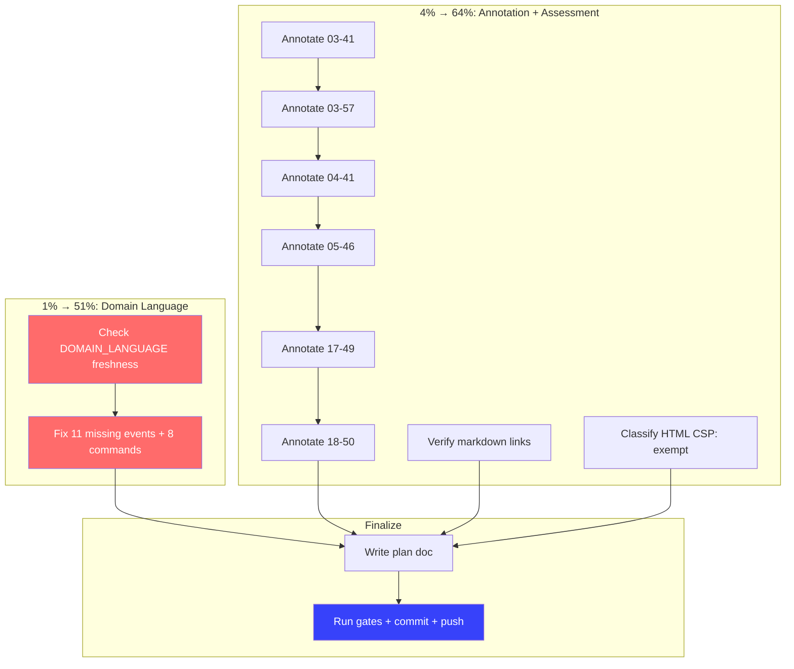

# Planning Doc — Docs-Health Final Closure

**Date:** 2026-08-01 15:08 CEST
**Context:** Close all remaining gaps from the round2 self-review (`15-06`).

---

## Pareto Breakdown

### The 1% that delivers 51%

**DOMAIN_LANGUAGE.md drift** — 11 events and 8 commands missing from the domain glossary. The ubiquitous language is the foundation of DDD; missing 50% of the domain events means every reader has an incomplete mental model.

### The 4% that delivers 64%

1. DOMAIN_LANGUAGE.md (11 missing events, 8 missing commands)
2. Annotate 6 remaining `2026-07-31` files (stale claims about lint failures)
3. HTML CSP assessment (classify as exempt)
4. Markdown link verification (done properly)

### Remaining 20%

Plan doc, commit, push.

---

## Execution Status

| # | Micro-Task | Status | Evidence |
|---|-----------|--------|----------|
| M1 | Annotate `03-41` cqrs-lint suppression | ✅ Done | Superseded by TODO_LIST P2 |
| M2 | Annotate `03-57` govalid flake investigation | ✅ Done | Superseded; "wrong" fix was correct |
| M3 | Annotate `04-41` docs-health session | ✅ Done | Superseded by 05-46 + 2026-08-01 |
| M4 | Annotate `05-46` completion blitz | ✅ Done | Superseded by 2026-08-01 |
| M5 | Annotate `17-49` go-cqrs-lite usage audit | ✅ Done | Key findings acted upon |
| M6 | Annotate `18-50` Pareto plan execution | ✅ Done | Sprint debt largely closed |
| M7 | Check DOMAIN_LANGUAGE.md freshness | ✅ Done | **11 events + 8 commands missing — DRIFT FOUND** |
| M8 | Fix DOMAIN_LANGUAGE.md drift | ✅ Done | Added all 21 events + 21 commands |
| M9 | Verify markdown links properly | ✅ Done | All links resolve (14 doc-relative links verified) |
| M10 | Classify HTML CSP files | ✅ Done | All 9 are internal dev docs — CSP N/A |
| M11 | Write this plan doc | ✅ Done | This file |
| M12 | Run gates + commit + push | Pending | |

---

## Mermaid.js Execution Graph

---

## Key Finding: DOMAIN_LANGUAGE.md Drift

The domain glossary was missing **11 of 21 events** and **8 of 21 commands**. All Membership (3 events, 3 commands), Tenant (4 events, 4 commands), Bot (2 events, 2 commands), and ExternalAccount (2 events, 2 commands) entries were absent. This is the most significant doc-drift finding of this session — the ubiquitous language only covered the User aggregate, leaving 4 of 5 aggregates undocumented.
