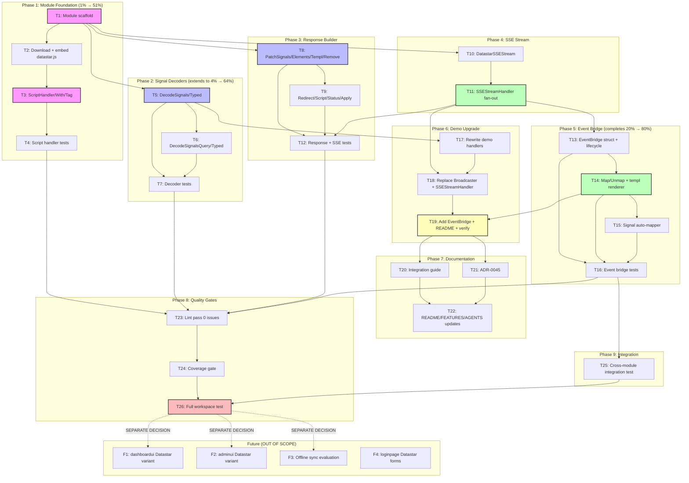

# Datastar Adapter Module — Superb Execution Plan

> **Date:** 2026-08-02
> **Goal:** Create `github.com/larsartmann/cqrs-htmx/datastar/v4` — an optional, fully-isolated Go module that lets consumers use [Datastar](https://data-star.dev/) instead of (or alongside) HTMX for frontend reactivity.
> **Analysis:** `docs/research/2026-08-02_datastar-integration-analysis.md`
> **Principle:** Zero changes to the root module. Zero changes to existing modules. The datastar module is purely additive.

---

## 0. The Problem

cqrs-htmx has **zero frontend state management**. Consumers who need reactive UI (filters, toggles, form state, real-time dashboards) must add Alpine.js (15 KiB), hand-roll JavaScript, or use HTMX extensions (idiomorph, SSE, WS). Datastar replaces ALL of these with one 11.76 KiB file that includes signals, morphing, structured SSE, two-way binding, and built-in retry.

Datastar's philosophy IS cqrs-htmx's architecture: CQRS for real-time, backend as source of truth, SSE as default transport, no optimistic updates. The project already implements every Datastar principle — just with HTMX as the frontend layer.

---

## 1. Pareto Breakdown

### The 1% that delivers 51% of the result

**`DatastarScriptHandler()` + `DecodeSignals()` + `DatastarResponse`**

Three functions. With these, a consumer can:

1. Self-host datastar.js (no CDN, ETag-cached)
2. Decode Datastar signals from POST requests into Go structs (for command dispatch)
3. Send Datastar SSE responses (patch-elements, patch-signals, redirect)

This is the MVP — it unlocks the entire Datastar ecosystem for cqrs-htmx consumers. ~8 hours.

### The 4% that delivers 64% of the result

**The above + `DatastarSSEStream` + `SSEStreamHandler()`**

Now consumers can:

- Create a Datastar SSE stream with one function call
- Pipe the existing `cqrshtmx.Broadcaster` events as Datastar patches
- Get reconnection/replay via `JournalSSEStore` integration

~11 hours total. The "I can build a real-time Datastar app on cqrs-htmx" threshold.

### The 20% that delivers 80% of the result

**The above + `EventBridge` + tests + demo upgrade + guide + ADR**

Production-ready, proven, documented. Declarative event-to-patch mapping replaces manual HTML generation. The datastar-demo proves it works end-to-end with the real `cqrshtmx.App`.

~20 hours total. This is the "ship it" threshold.

### The remaining 20% to get to 100%

**dashboardui/adminui Datastar variants + offline sync evaluation + full docs suite**

Per-module decisions. Each UI module can optionally add Datastar rendering mode (templ components stay the same, only transport changes). Offline sync may simplify with Datastar's built-in retry.

~20+ additional hours. Separate scope, separate decisions per module.

---

## 2. Verschlimmbessern Safeguards

This section exists because the cost of getting this wrong is higher than the cost of not doing it.

| Rule                                              | What It Prevents                                         | How Enforced                                                  |
| ------------------------------------------------- | -------------------------------------------------------- | ------------------------------------------------------------- |
| **Datastar-go NEVER in root go.mod**              | Every HTMX consumer gets Datastar dep                    | Separate module with its own go.mod                           |
| **ZERO changes to root module files**             | Breaking stable HTMX API                                 | Diff review: root module files unchanged                      |
| **ZERO changes to dashboardui/adminui/loginpage** | Premature coupling                                       | Diff review: only datastar/ + examples/datastar-demo/ touched |
| **NO transport abstraction layer**                | Massive refactor of stable code for hypothetical benefit | Direct adapter pattern, not interface extraction              |
| **Adapter is THIN**                               | Maintenance burden reimplementing SDK                    | Every function wraps a datastar-go function, nothing more     |
| **Module follows existing patterns**              | Inconsistency                                            | Mirror loginpage/dashboardui module structure exactly         |
| **Coverage gate from day 1**                      | Shipping untested code                                   | .golangci.yml + coverage threshold matching project standard  |
| **go.work updated**                               | Broken workspace builds                                  | `./datastar` in use block                                     |

---

## 3. Architecture

```
Dependency direction (unchanged):

    identity-model ← usermgmt
                      ↑
    root (cqrs-htmx/v4) ← datastar/v4 (NEW)
                      ↑
              examples/datastar-demo

The datastar module depends on:
  - github.com/larsartmann/cqrs-htmx/v4          (root: shared types, Broadcaster, SSEStream, MapError)
  - github.com/starfederation/datastar-go         (Datastar Go SDK)
  - github.com/larsartmann/go-cqrs-lite/event/v4  (event.Event for the bridge)

Root NEVER imports datastar. Existing modules NEVER import datastar.
```

Module structure:

```
datastar/
  go.mod                    # module github.com/larsartmann/cqrs-htmx/datastar/v4
  go.sum
  .golangci.yml             # copy pattern from loginpage/.golangci.yml
  .editorconfig
  .gitattributes
  .gitignore
  doc.go                    # package documentation
  LICENSE
  README.md
  CHANGELOG.md
  script_handler.go         # DatastarScriptHandler/With/Tag/Version
  script_embed.go           # //go:embed datastar/datastar.min.js
  datastar/
    datastar.min.js         # Datastar v1.0.2 (downloaded from CDN)
  decoder.go                # DecodeSignals/Typed/Query/QueryTyped
  response.go               # DatastarResponse builder
  sse_stream.go             # DatastarSSEStream + SSEStreamHandler
  event_bridge.go           # EventBridge (domain event → Datastar SSE patch)
  event_bridge_test.go
  script_handler_test.go
  decoder_test.go
  response_test.go
  sse_stream_test.go
```

---

## 4. Level 1: Comprehensive Task Breakdown (30-100min tasks)

Sorted by importance/impact/effort/customer-value. Phases are sequential within a phase; phases can overlap where noted.

| #   | Task                                                                                               | Phase | Impact   | Effort | Depends On    |
| --- | -------------------------------------------------------------------------------------------------- | ----- | -------- | ------ | ------------- |
| 1   | Module scaffold: directory, go.mod, go.work entry, .golangci.yml, doc.go, LICENSE                  | P1    | CRITICAL | 30min  | —             |
| 2   | Download datastar.js v1.0.2 + create embed file + version constant                                 | P1    | CRITICAL | 30min  | T1            |
| 3   | `DatastarScriptHandler/With/Tag/Version` (mirror `htmx_serve.go` + `sync_serve.go`)                | P1    | HIGH     | 60min  | T2            |
| 4   | Script handler tests: ETag, cache headers, 304, content-type, method guard                         | P1    | HIGH     | 60min  | T3            |
| 5   | `DecodeSignals[Q]` + `DecodeSignalsTyped[Q]` (wraps `datastar.ReadSignals` for commands)           | P2    | HIGH     | 60min  | T1            |
| 6   | `DecodeSignalsQuery[Q]` + `DecodeSignalsQueryTyped[Q]` (GET query param signals)                   | P2    | MED      | 45min  | T5            |
| 7   | Decoder tests: round-trip signals→struct, empty body, malformed, GET vs POST                       | P2    | HIGH     | 90min  | T5,T6         |
| 8   | `DatastarResponse` builder: `PatchSignals`, `PatchElements`, `PatchElementsTempl`, `RemoveElement` | P3    | HIGH     | 90min  | T1            |
| 9   | `DatastarResponse`: `Redirect`, `ExecuteScript`, `ReplaceURL`, `Status`, `Apply`, `Header`         | P3    | MED      | 60min  | T8            |
| 10  | `DatastarSSEStream`: wraps `datastar.NewSSE`, exposes `Context`, `IsClosed`, `Send`                | P4    | HIGH     | 60min  | T1            |
| 11  | `SSEStreamHandler`: fan-out + replay (subscribe→connected→replay→pump loop)                        | P4    | HIGH     | 90min  | T10           |
| 12  | Response + SSE stream tests: all methods, error cases, lifecycle                                   | P3-4  | HIGH     | 90min  | T8,T9,T10,T11 |
| 13  | `EventBridge` struct + `BridgeConfig` + `Start/Stop` lifecycle                                     | P5    | HIGH     | 60min  | T11           |
| 14  | `EventBridge.Map/Unmap`: declarative event→patch mapping + templ renderer integration              | P5    | HIGH     | 90min  | T13           |
| 15  | `EventBridge` signal auto-mapper: domain event fields → signal patches                             | P5    | MED      | 60min  | T14           |
| 16  | Event bridge tests: event mapping, fan-out, lifecycle, templ rendering                             | P5    | HIGH     | 90min  | T13,T14,T15   |
| 17  | Demo: update go.mod + rewrite handlers to use `ds.DecodeSignals` + `ds.NewResponse`                | P6    | HIGH     | 100min | T5,T8         |
| 18  | Demo: replace custom Broadcaster with `cqrshtmx.Broadcaster` + `ds.SSEStreamHandler`               | P6    | HIGH     | 90min  | T11,T17       |
| 19  | Demo: add `ds.EventBridge` usage + update README + verify build + smoke test                       | P6    | MED      | 45min  | T14,T18       |
| 20  | Guide: `docs/guides/datastar-integration.md` (full walkthrough with code examples)                 | P7    | MED      | 60min  | T19           |
| 21  | ADR-0045: `docs/adr/0045-datastar-optional-frontend.md`                                            | P7    | MED      | 45min  | T19           |
| 22  | Docs: update root README, FEATURES.md, AGENTS.md, ADR INDEX.md                                     | P7    | LOW      | 45min  | T20,T21       |
| 23  | Lint pass: 0 issues on new module (`GOEXPERIMENT=jsonv2 golangci-lint run`)                        | P8    | HIGH     | 30min  | T4,T7,T12,T16 |
| 24  | Coverage gate: configure threshold in flake.nix + verify                                           | P8    | MED      | 30min  | T23           |
| 25  | Integration test: cross-module test in `integration_test/` (datastar module contracts)             | P9    | MED      | 60min  | T16           |
| 26  | Full workspace build + test: `GOEXPERIMENT=jsonv2 go test ./... -count=1 -race`                    | P8    | HIGH     | 30min  | T24,T25       |

**Total estimated effort: ~21.5 hours** (for the 80% value threshold)

**Estimated effort for remaining 20% (future scope, NOT in this plan):**

| #   | Future Task                                                                | Impact | Effort |
| --- | -------------------------------------------------------------------------- | ------ | ------ |
| F1  | dashboardui: replace HTMX polling with Datastar signal patches             | HIGH   | ~8hr   |
| F2  | adminui: optional Datastar rendering mode (templ stays, transport changes) | MED    | ~6hr   |
| F3  | Offline sync: evaluate Datastar retry primitives vs sync-worker.js         | MED    | ~4hr   |
| F4  | loginpage: Datastar form state                                             | LOW    | ~3hr   |

---

## 5. Level 2: Micro-Task Breakdown (max 12min each)

Critical path only (Tasks 1-16: the core module). Documentation and demo tasks are straightforward enough at the Level 1 granularity.

### Phase 1: Module Foundation

| #   | Micro-Task                                                                                                          | Parent | Est   |
| --- | ------------------------------------------------------------------------------------------------------------------- | ------ | ----- |
| 1.1 | Create `datastar/` directory                                                                                        | T1     | 2min  |
| 1.2 | Create `datastar/go.mod` with module path `github.com/larsartmann/cqrs-htmx/datastar/v4`, go 1.26.5                 | T1     | 5min  |
| 1.3 | Add `./datastar` to `go.work` use block                                                                             | T1     | 2min  |
| 1.4 | Create `datastar/.golangci.yml` (copy from loginpage, adjust package name)                                          | T1     | 5min  |
| 1.5 | Create `datastar/.editorconfig` + `.gitattributes` + `.gitignore` (copy from loginpage)                             | T1     | 3min  |
| 1.6 | Create `datastar/doc.go` with package doc comment                                                                   | T1     | 5min  |
| 1.7 | Create `datastar/LICENSE` (copy from root)                                                                          | T1     | 2min  |
| 1.8 | Create `datastar/README.md` (minimal: what, why, quick start)                                                       | T1     | 10min |
| 1.9 | Create `datastar/CHANGELOG.md` (initial entry)                                                                      | T1     | 3min  |
| 2.1 | Download datastar.js v1.0.2 from `https://cdn.jsdelivr.net/gh/starfederation/[email protected]/bundles/datastar.js` | T2     | 5min  |
| 2.2 | Save as `datastar/datastar/datastar.min.js`                                                                         | T2     | 2min  |
| 2.3 | Create `datastar/script_embed.go` with `//go:embed datastar/datastar.min.js` + `datastarVersion` constant           | T2     | 5min  |
| 2.4 | Verify embed compiles: `GOEXPERIMENT=jsonv2 go build ./datastar/...`                                                | T2     | 5min  |
| 3.1 | Implement `DatastarScriptHandler()` (mirrors `HTMXScriptHandler()`)                                                 | T3     | 10min |
| 3.2 | Implement `DatastarScriptHandlerWith(js, version)`                                                                  | T3     | 5min  |
| 3.3 | Implement `DatastarScriptTag(path)` (returns `<script type="module" src="...">`)                                    | T3     | 5min  |
| 3.4 | Implement `DatastarVersion()`                                                                                       | T3     | 2min  |
| 3.5 | Implement `serveJS` helper (copy from root `htmx_serve.go` — can't import unexported)                               | T3     | 10min |
| 4.1 | Test: GET returns 200 with JS body + correct content-type                                                           | T4     | 10min |
| 4.2 | Test: ETag header present + matches `datastar-{version}` format                                                     | T4     | 8min  |
| 4.3 | Test: If-None-Match returns 304                                                                                     | T4     | 8min  |
| 4.4 | Test: Cache-Control header (1yr immutable)                                                                          | T4     | 5min  |
| 4.5 | Test: POST/PUT return 405                                                                                           | T4     | 5min  |
| 4.6 | Test: DatastarScriptTag returns correct HTML                                                                        | T4     | 5min  |
| 4.7 | Test: DatastarScriptHandlerWith serves custom JS                                                                    | T4     | 8min  |

### Phase 2: Signal-Aware Decoders

| #   | Micro-Task                                                                                             | Parent | Est   |
| --- | ------------------------------------------------------------------------------------------------------ | ------ | ----- |
| 5.1 | Define `SignalDecoder[T any]` type (function signature matching root's decoder pattern)                | T5     | 10min |
| 5.2 | Implement `DecodeSignals[T any](mapper)` — wraps `datastar.ReadSignals(r, &signals)` then calls mapper | T5     | 12min |
| 5.3 | Implement `DecodeSignalsTyped[T any]()` — direct decode, no mapper (like `DecodeJSONTyped`)            | T5     | 10min |
| 5.4 | Verify: `datastar.ReadSignals` behavior for POST (JSON body) vs other methods                          | T5     | 8min  |
| 6.1 | Implement `DecodeSignalsQuery[T any](mapper)` — reads signals from URL query params (GET/DELETE)       | T6     | 12min |
| 6.2 | Implement `DecodeSignalsQueryTyped[T any]()` — typed variant                                           | T6     | 8min  |
| 6.3 | Handle edge case: empty query params (zero-value struct)                                               | T6     | 5min  |
| 7.1 | Test: POST with JSON signals body → correct struct decode                                              | T7     | 10min |
| 7.2 | Test: GET with query param signals → correct struct decode                                             | T7     | 10min |
| 7.3 | Test: empty body → zero-value struct (no panic)                                                        | T7     | 8min  |
| 7.4 | Test: malformed JSON → error returned                                                                  | T7     | 8min  |
| 7.5 | Test: typed decoder populates fields correctly                                                         | T7     | 10min |
| 7.6 | Test: nested signals (dot notation) → nested struct                                                    | T7     | 12min |
| 7.7 | Test: mapper function receives decoded struct + returns command                                        | T7     | 10min |

### Phase 3: Response Builder

| #   | Micro-Task                                                                                               | Parent | Est   |
| --- | -------------------------------------------------------------------------------------------------------- | ------ | ----- |
| 8.1 | Define `DatastarResponse` struct (holds `*datastar.ServerSentEventGenerator` or upgrades ResponseWriter) | T8     | 10min |
| 8.2 | Implement `NewResponse(w, r)` — creates SSE writer via `datastar.NewSSE(w, r)`                           | T8     | 10min |
| 8.3 | Implement `PatchSignals(signals map[string]any)` — wraps `MarshalAndPatchSignals`                        | T8     | 8min  |
| 8.4 | Implement `PatchSignalsIfMissing(signals map[string]any)`                                                | T8     | 5min  |
| 8.5 | Implement `PatchElements(html string, opts...)` — wraps `PatchElements` with option pass-through         | T8     | 10min |
| 8.6 | Implement `PatchElementsTempl(component, opts...)` — wraps `PatchElementTempl`                           | T8     | 8min  |
| 8.7 | Implement `RemoveElement(selector)`                                                                      | T8     | 5min  |
| 9.1 | Implement `Redirect(url)` — wraps `sse.Redirect(url)`                                                    | T9     | 5min  |
| 9.2 | Implement `ExecuteScript(script)` — wraps `sse.ExecuteScript`                                            | T9     | 5min  |
| 9.3 | Implement `ReplaceURL(url)`                                                                              | T9     | 5min  |
| 9.4 | Implement `Status(code)` — sets HTTP status before SSE upgrade                                           | T9     | 10min |
| 9.5 | Implement `Apply()` — flushes any deferred state                                                         | T9     | 10min |

### Phase 4: SSE Stream

| #    | Micro-Task                                                                           | Parent | Est   |
| ---- | ------------------------------------------------------------------------------------ | ------ | ----- |
| 10.1 | Define `DatastarSSEStream` struct (wraps `*datastar.ServerSentEventGenerator`)       | T10    | 10min |
| 10.2 | Implement `NewSSEStream(w, r)` factory                                               | T10    | 8min  |
| 10.3 | Implement `Context()`, `IsClosed()` passthrough methods                              | T10    | 5min  |
| 10.4 | Implement `Send(patch Patch)` — type-safe patch sending (elements/signals/script)    | T10    | 12min |
| 10.5 | Implement `PatchElements/Signals/ExecuteScript` convenience methods                  | T10    | 10min |
| 11.1 | Define `SSEStreamHandler(broadcaster, store)` signature                              | T11    | 5min  |
| 11.2 | Implement subscribe→connected→replay→pump lifecycle (mirror `dashboardui/sse.go:85`) | T11    | 12min |
| 11.3 | Convert `cqrshtmx.SSEEvent` to Datastar patch events                                 | T11    | 12min |
| 11.4 | Handle reconnection via `LastEventID` + `JournalSSEStore`                            | T11    | 10min |

### Phase 5: Event Bridge

| #    | Micro-Task                                                                                   | Parent | Est   |
| ---- | -------------------------------------------------------------------------------------------- | ------ | ----- |
| 13.1 | Define `EventBridge` struct + `BridgeConfig` (EventBus, Broadcaster, Renderer, SignalMapper) | T13    | 12min |
| 13.2 | Implement `NewEventBridge(config)` constructor                                               | T13    | 8min  |
| 13.3 | Implement `Start()` — subscribes to EventBus, spawns handler goroutine                       | T13    | 10min |
| 13.4 | Implement `Stop()` — unsubscribes, drains                                                    | T13    | 10min |
| 13.5 | Define `Patch` interface (PatchElements / PatchSignals / RemoveElement / ExecuteScript)      | T13    | 10min |
| 13.6 | Define `PatchFunc` type: `func(event.Event) (Patch, error)`                                  | T13    | 5min  |
| 14.1 | Implement `Map(eventType string, fn PatchFunc)` — registers handler for event type           | T14    | 10min |
| 14.2 | Implement `Unmap(eventType)`                                                                 | T14    | 5min  |
| 14.3 | Implement event dispatch loop: receive event → look up mapping → generate Patch → broadcast  | T14    | 12min |
| 14.4 | Implement `TemplateRenderer` type: wraps templ component → HTML string for `PatchElements`   | T14    | 12min |
| 14.5 | Implement default no-op for unmapped events (skip, log at debug)                             | T14    | 5min  |
| 15.1 | Define `SignalMapper` interface: `MapEventToSignals(event.Event) map[string]any`             | T15    | 8min  |
| 15.2 | Implement `DefaultSignalMapper` — extracts event type + stream ID as signals                 | T15    | 10min |
| 15.3 | Allow user-provided custom SignalMapper in BridgeConfig                                      | T15    | 5min  |

---

## 6. Execution Graph



**Critical path** (longest dependency chain):
T1 → T2 → T3 → T4 → T23 → T24 → T26

**High-value parallel tracks** (can start after T1):

- Track A: T5 → T6 → T7 (decoders)
- Track B: T8 → T9 → T12 (response builder)
- Track C: T10 → T11 → T12 (SSE stream)

---

## 7. Key Design Decisions

### 7.1 Why a separate module (not root package)?

The root module (`cqrs-htmx/v4`) must stay HTMX-only. Adding `datastar-go` to root's go.mod would force every HTMX consumer to download and compile the Datastar SDK — even if they never use it. Go modules don't support optional dependencies. A separate module is the only clean boundary.

This follows the existing pattern: `usermgmt`, `adminui`, `dashboardui`, `loginpage` are all separate modules that depend on root. The datastar module is no different.

### 7.2 Why not a transport abstraction?

Option B from the analysis (abstract `response.go` into a transport-agnostic interface) was rejected because:

- It refactors 93.7%-coverage stable code
- It adds indirection that makes debugging harder
- It solves a problem that doesn't exist yet (no third transport is coming)
- The adapter pattern achieves the same goal with zero risk

### 7.3 Why the adapter is thin

Every function in the datastar module wraps exactly one `datastar-go` SDK function. The module adds:

- cqrs-htmx integration (App.Command compatibility, Broadcaster bridging)
- Embedded JS serving (ETag/cache pattern)
- Event-to-patch declarative mapping (the EventBridge)

It does NOT reimplement signals, morphing, or the expression engine — those are Datastar's job.

### 7.4 Datastar version pinning

Pin to `datastar-go v1.2.2` (already used by the demo). The JS file is `datastar v1.0.2` (latest stable). A test asserts the Go SDK version matches the JS version constants (mirroring `TestSyncVersionMatchesJSConstants` in root).

### 7.5 serveJS duplication

The root module's `serveJS` is unexported. The datastar module needs its own copy. This is intentional: importing root just for `serveJS` would pull the entire HTMX dependency tree. A 20-line function duplication is the right tradeoff.

---

## 8. API Surface (What Consumers Will Use)

```go
import ds "github.com/larsartmann/cqrs-htmx/datastar/v4"

// 1. Serve datastar.js (self-hosted, no CDN)
mux.Handle("GET /datastar.js", ds.DatastarScriptHandler())

// 2. Command endpoint with signal decoding
mux.Handle("POST /todos", app.Command("CreateTodo",
    ds.DecodeSignals(func(s CreateTodoSignals) (command.Command, error) {
        return &createTodoCmd{aggID: id.NewStreamID(), cmdID: id.NewCommandID(), Title: s.Title}, nil
    }),
    ds.RenderResponse(func() *ds.DatastarResponse {
        return ds.NewResponse(w, r).
            PatchSignals(map[string]any{"notification": "Created!"}).
            PatchElements(renderTodoList(todos), ds.WithSelectorID("todo-list"), ds.WithModeInner())
    }),
))

// 3. Real-time SSE stream with fan-out + replay
broadcaster := cqrshtmx.NewBroadcaster()
mux.HandleFunc("GET /events", ds.SSEStreamHandler(broadcaster, sseStore))

// 4. Event bridge: domain events → Datastar patches
bridge := ds.NewEventBridge(ds.BridgeConfig{
    EventBus:    eventBus,
    Broadcaster: broadcaster,
})
bridge.Map("TodoCreated", func(e event.Event) (ds.Patch, error) {
    return ds.NewElementsPatch(renderTodoHTML(e), ds.WithModeAppend(), ds.WithSelectorID("todo-list")), nil
})
bridge.Start()
defer bridge.Stop()

// 5. Datastar script tag for templates
head := ds.DatastarScriptTag("/datastar.js") // <script type="module" src="/datastar.js"></script>
```

---

## 9. Testing Strategy

| Component        | Test Approach                                                      | Coverage Target |
| ---------------- | ------------------------------------------------------------------ | --------------- |
| Script handler   | httptest.NewRequest + ResponseRecorder; verify ETag/cache/304/405  | 95%+            |
| Decoders         | Round-trip: construct signals JSON → decode → verify struct fields | 90%+            |
| Response builder | httptest; verify SSE wire format (event types, data lines)         | 90%+            |
| SSE stream       | In-memory broadcaster; verify fan-out + replay + lifecycle         | 85%+            |
| Event bridge     | Fake EventBus; verify mapping dispatch + templ rendering           | 85%+            |

All tests use `GOEXPERIMENT=jsonv2 go test ./... -count=1 -race`.

---

## 10. Success Criteria

- [ ] `datastar/` module exists with its own go.mod, compiles standalone
- [ ] `datastar.go build ./datastar/...` passes
- [ ] `datastar.go test ./datastar/... -count=1 -race` passes
- [ ] `golangci-lint run` on datastar module: 0 issues
- [ ] Root module unchanged (git diff shows zero changes to non-datastar files)
- [ ] go.work includes `./datastar`
- [ ] datastar-demo uses the new module (no more vanilla handlers)
- [ ] Guide + ADR written
- [ ] Full workspace `go test ./... -count=1 -race` passes
- [ ] No Verschlimmbessern: root module, dashboardui, adminui, loginpage all untouched
