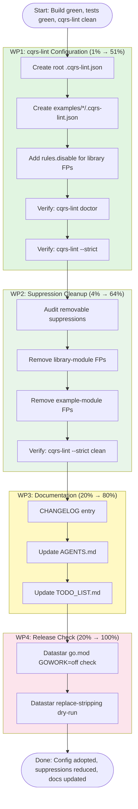

# Pareto Plan: cqrs-htmx Configuration & Release Readiness — 2026-08-04

> **Session goal:** Eliminate the root cause of 130 inline suppressions (missing
> `.cqrs-lint.json`), prepare for datastar/v4 release, and close all debt from
> the cqrs-lint cleanup sessions.
> **Constraint:** Do NOT verschlimmbessern. Every change must be verified.
> **Current state:** Build clean, 11/11 test modules green, cqrs-lint 0 findings.

---

## Context

### What happened

Two prior sessions cleaned up cqrs-lint findings: removed stale suppressions,
added json tags, discovered comma-separated suppressions work. Result: 0
unsuppressed findings, 130 suppressed, 0 stale. Clean.

### The problem

**130 inline suppressions is a symptom.** The feedback doc to go-cqrs-lite
identified that ~70 of those are linter-addressable — they exist because:

1. **No `.cqrs-lint.json` exists.** The auto-detection merges all 19 modules
   into one workspace-wide profile. `server: true` from `examples/*` leaks
   into library modules. `store: sqlite` from examples applies to modules
   that don't use SQLite.

2. **The `library` preset disables E003/E016** but NOT the F-series
   adoption-coaching rules or S-series consumer-responsibility rules that
   are false positives for library code.

3. **Examples are treated as production code.** ~30 suppressions exist in
   examples for demo-seed-data patterns (discarded errors, no catalog, no
   signing) that are legitimate demo shortcuts.

### What we should NOT do

- Do NOT mass-delete suppressions before testing `.cqrs-lint.json` config
- Do NOT change flake.nix module lists (risk of breaking CI)
- Do NOT publish datastar/v4 tag yet (needs replace-directive stripping)
- Do NOT touch go.work (pre-existing datastar go.mod path issue is unrelated)

---

## Pareto Breakdown

### The 1% that delivers 51%

**Create root `.cqrs-lint.json` with `{"preset": "library"}`.**

One file. The `library` preset pins `server: false`,
`command-flow: read-only`, `tracing: off`, `snapshot: off` — exactly
correct for cqrs-htmx library modules. This corrects the workspace-wide
feature profile leakage and prevents server/example-specific rules from
firing on library code.

**Impact:** Eliminates the root cause of E009/E014/F011 findings on
dashboardui. Eliminates the wrong `server: true` that enables
server-only rules across all library modules.

**Risk:** Low. The `.cqrs-lint.json` is read by `cqrs-lint doctor` and
`cqrs-lint` from the current directory. It does not affect `go build`,
`go test`, or `golangci-lint`.

### The 4% that delivers 64%

1. Root `.cqrs-lint.json` (library preset) — see above
2. **Per-module `.cqrs-lint.json` for examples/** — `{"preset": "production"}`
   so examples get the correct profile (server=true, tracing=on) instead of
   leaking into library modules
3. **Add `rules.disable` for library false-positives** — F002/F006/F009/F010/F011
   for library modules where they're adoption-coaching noise; S002/S003/S007
   for library modules where consumer configures these
4. **Verify cqrs-lint stays clean** after config changes, then audit which
   suppressions can now be removed

**Impact:** Eliminates ~40-50 of 130 suppressions by addressing root cause
via config rather than inline comments.

### The 20% that delivers 80%

All of the above, plus:

5. **Remove suppressions now handled by config** — carefully, one module
   at a time, verifying cqrs-lint stays clean after each removal
6. **CHANGELOG entry** for the cqrs-lint cleanup + config adoption
7. **Update AGENTS.md** with `.cqrs-lint.json` adoption and correct
   suppression syntax documentation (verify the prior correction is committed)
8. **Update TODO_LIST.md** — mark cqrs-lint upgrade as DONE (comma-separated
   works on 4.3.0; the old "v0.2.2 limitation" is outdated since we verified
   the installed version IS 4.3.0)
9. **Datastar release readiness check** — verify datastar/v4 can be tagged
   (no local replaces, go.mod resolves with GOWORK=off)

### The other 20% (to get to 100%)

10. **MySQL integration test** (testcontainers) — partially done, needs test
11. **flake.nix auto-discovery** — replace hardcoded module lists
12. **Single-source domain model counts** — generate from code
13. **golines alignment in nix fmt** — treefmt integration
14. **Dead JSON tag audit** — systematic grep
15. **check-docs-links pre-commit hook** — needs `--staged-only`
16. **cqrs-lint strict CI gate** — blocked on Nix CI runner
17. **Status report** — document what was done

---

## Execution Graph

---

## Comprehensive Plan — Tasks (30-100 min each)

| #   | Work Package | Task                                                                                                    | Impact                                          | Effort | Priority | Depends on |
| --- | ------------ | ------------------------------------------------------------------------------------------------------- | ----------------------------------------------- | ------ | -------- | ---------- |
| 1   | WP1          | Create root `.cqrs-lint.json` with `{"preset": "library"}`                                              | CRITICAL — fixes workspace-wide profile         | 15min  | P0       | —          |
| 2   | WP1          | Create `examples/*/.cqrs-lint.json` with `{"preset": "production"}` for each example dir (6 files)      | HIGH — prevents example→library profile leakage | 30min  | P0       | #1         |
| 3   | WP1          | Add `rules.disable` for library-module false positives (F002, F006, F009, F010, F011, S002, S003, S007) | HIGH — eliminates ~25 suppressions via config   | 15min  | P0       | #1         |
| 4   | WP1          | Verify: `cqrs-lint doctor` shows correct per-module profile                                             | HIGH — confirms config is loaded                | 10min  | P0       | #3         |
| 5   | WP1          | Verify: `cqrs-lint --strict` still 0 findings                                                           | CRITICAL — no regressions                       | 10min  | P0       | #4         |
| 6   | WP1          | Verify: `GOEXPERIMENT=jsonv2 go build ./...` still passes                                               | CRITICAL — config doesn't break build           | 5min   | P0       | #5         |
| 7   | WP1          | Verify: `nix run .#test` still all green                                                                | CRITICAL — config doesn't break tests           | 30min  | P0       | #6         |
| 8   | WP2          | Audit: grep all `//cqrs-lint:ignore` comments, categorize as "config-handled" vs "legitimate"           | HIGH — identifies removable suppressions        | 30min  | P1       | #5         |
| 9   | WP2          | Remove config-handled suppressions from library modules (root, identity-model, usermgmt)                | HIGH — reduces suppression noise                | 45min  | P1       | #8         |
| 10  | WP2          | Remove config-handled suppressions from examples                                                        | MEDIUM — reduces demo noise                     | 30min  | P1       | #9         |
| 11  | WP2          | Verify: `cqrs-lint --strict --show-suppressed` still clean after removals                               | CRITICAL — no regressions                       | 10min  | P1       | #10        |
| 12  | WP3          | Write CHANGELOG entry for cqrs-lint config adoption + suppression cleanup                               | MEDIUM — release notes                          | 15min  | P1       | #11        |
| 13  | WP3          | Update AGENTS.md: document `.cqrs-lint.json` config adoption, correct version reference                 | MEDIUM — future sessions                        | 15min  | P1       | #11        |
| 14  | WP3          | Update TODO_LIST.md: mark done items, update stale cqrs-lint version reference                          | LOW — housekeeping                              | 10min  | P2       | #13        |
| 15  | WP4          | Verify datastar/v4 go.mod resolves with `GOWORK=off` (no local replaces leaking)                        | HIGH — release blocker check                    | 15min  | P2       | —          |
| 16  | WP4          | Dry-run tag-release.sh stripping for datastar module                                                    | MEDIUM — release readiness                      | 30min  | P2       | #15        |
| 17  | WP3          | Write status report documenting the session                                                             | LOW — documentation                             | 15min  | P2       | #14        |

**Total estimated time: ~5.5 hours**

---

## Micro-Tasks — Max 12 min each

| #   | Parent | Task                                                                                 | Time  |
| --- | ------ | ------------------------------------------------------------------------------------ | ----- |
| 1a  | #1     | Read `library` preset definition from feature_profile.go to confirm exact pin values | 5min  |
| 1b  | #1     | Create `/home/lars/projects/cqrs-htmx/.cqrs-lint.json` with `{"preset": "library"}`  | 2min  |
| 1c  | #1     | Run `cqrs-lint doctor` to verify profile changed                                     | 3min  |
| 2a  | #2     | List all example directories: `ls examples/`                                         | 1min  |
| 2b  | #2     | Create `examples/basic/.cqrs-lint.json` with `{"preset": "production"}`              | 2min  |
| 2c  | #2     | Create `examples/dashboard-demo/.cqrs-lint.json`                                     | 2min  |
| 2d  | #2     | Create `examples/datastar-demo/.cqrs-lint.json`                                      | 2min  |
| 2e  | #2     | Create `examples/catalog-demo/.cqrs-lint.json`                                       | 2min  |
| 2f  | #2     | Create `examples/middleware-demo/.cqrs-lint.json`                                    | 2min  |
| 2g  | #2     | Create `examples/observability-demo/.cqrs-lint.json`                                 | 2min  |
| 2h  | #2     | Create `examples/admin-demo/.cqrs-lint.json`                                         | 2min  |
| 3a  | #3     | Decide which rules to disable for library modules                                    | 5min  |
| 3b  | #3     | Update root `.cqrs-lint.json` with `rules.disable` list                              | 5min  |
| 3c  | #3     | Run `cqrs-lint --strict` to verify findings don't increase                           | 5min  |
| 4a  | #4     | Run `cqrs-lint doctor` and capture output                                            | 3min  |
| 4b  | #4     | Verify profile shows library preset values                                           | 3min  |
| 4c  | #4     | Run `cqrs-lint doctor` from an example dir and verify production preset              | 3min  |
| 5a  | #5     | Run `cqrs-lint --strict --verbose` from root                                         | 5min  |
| 5b  | #5     | Verify: 0 unsuppressed findings, 0 stale warnings                                    | 3min  |
| 6a  | #6     | Run `GOEXPERIMENT=jsonv2 go build ./...`                                             | 5min  |
| 7a  | #7     | Run `nix run .#test`                                                                 | 5min  |
| 7b  | #7     | Verify all 11 modules pass                                                           | 3min  |
| 8a  | #8     | Grep all `//cqrs-lint:ignore` comments across repo                                   | 5min  |
| 8b  | #8     | Categorize each suppression: "config-handled" vs "legitimate"                        | 12min |
| 9a  | #9     | Remove F002 suppression from dashboardui/config.go (if disabled in config)           | 3min  |
| 9b  | #9     | Remove F006 suppression from identity-model/events.go (if disabled)                  | 3min  |
| 9c  | #9     | Remove F009 suppression from usermgmt/es_projection_setup.go (if disabled)           | 3min  |
| 9d  | #9     | Remove F010 suppression from dashboardui/handlers.go (if disabled)                   | 3min  |
| 9e  | #9     | Remove F011 from dashboardui/config.go (already in the E009/E014/F011/F002 line)     | 3min  |
| 9f  | #9     | Remove S002 suppression from identity-model/events.go (if disabled)                  | 3min  |
| 9g  | #9     | Remove S003 suppression from examples/dashboard-demo/main.go (if disabled)           | 3min  |
| 9h  | #9     | Remove S007 suppressions from usermgmt/service_core.go and store.go (if disabled)    | 5min  |
| 9i  | #9     | Run `cqrs-lint --strict` after each batch of removals                                | 5min  |
| 10a | #10    | Remove C028 suppressions from examples (if examples use production preset + disable) | 12min |
| 10b | #10    | Run `cqrs-lint --strict` to verify examples still clean                              | 5min  |
| 11a | #11    | Full `cqrs-lint --strict --verbose --show-suppressed` run                            | 5min  |
| 11b | #11    | Count total suppressions (target: <80) and verify 0 unsuppressed                     | 3min  |
| 12a | #12    | Read current CHANGELOG `[Unreleased]` section                                        | 3min  |
| 12b | #12    | Add Changed/Added entries for cqrs-lint config + suppression cleanup                 | 10min |
| 13a | #13    | Read current AGENTS.md cqrs-lint gotcha entry                                        | 5min  |
| 13b | #13    | Add `.cqrs-lint.json` adoption note + correct version to 4.3.0                       | 10min |
| 14a | #14    | Read TODO_LIST.md                                                                    | 3min  |
| 14b | #14    | Mark P2#1 (cqrs-lint upgrade) as done — comma-separated works on 4.3.0               | 5min  |
| 15a | #15    | Run `cd datastar && GOWORK=off GOEXPERIMENT=jsonv2 go build ./...`                   | 5min  |
| 15b | #15    | Run `cd datastar && GOWORK=off GOEXPERIMENT=jsonv2 go test ./...`                    | 5min  |
| 15c | #15    | Check if datastar/go.mod has any local `replace` directives                          | 3min  |
| 16a | #16    | Read tag-release.sh to understand replace-stripping process                          | 5min  |
| 16b | #16    | Verify which modules still need release tags (check git tags vs go.work modules)     | 5min  |
| 17a | #17    | Write status report to `docs/status/`                                                | 12min |

---

## What we will NOT do (verschlimmbessern prevention)

- **Do NOT** delete the datastar entry from go.work (the LSP error is pre-existing and unrelated)
- **Do NOT** modify flake.nix module lists
- **Do NOT** change any go.mod files
- **Do NOT** remove suppressions without verifying cqrs-lint after EACH batch
- **Do NOT** publish any git tags
- **Do NOT** touch go.work replace directives
- **Do NOT** add new linters or formatters

---

## Verification Checklist

After all work is done:

- [ ] `.cqrs-lint.json` exists in root with `{"preset": "library"}`
- [ ] `.cqrs-lint.json` exists in each `examples/*` directory
- [ ] `cqrs-lint doctor` shows correct profile (library for root, production for examples)
- [ ] `cqrs-lint --strict --verbose` shows 0 unsuppressed findings, 0 stale
- [ ] Total suppression count is reduced (target: <100, stretch: <80)
- [ ] `GOEXPERIMENT=jsonv2 go build ./...` passes
- [ ] `nix run .#test` all 11 modules green
- [ ] CHANGELOG has entry
- [ ] AGENTS.md documents `.cqrs-lint.json` adoption
- [ ] TODO_LIST.md updated
- [ ] No new files outside docs/, .cqrs-lint.json, or examples/*/.cqrs-lint.json
