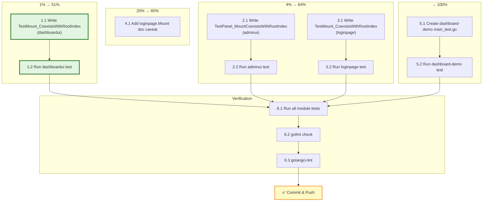

# Plan: ServeMux Mount Regression Tests

**Date:** 2026-08-05 01:45 CEST
**Trigger:** `dashboard-demo` panicked on startup because no test exercised the real-world integration pattern (Mount + root index on same ServeMux).

---

## Context

A Go 1.22+ ServeMux panic shipped undetected because every `Mount` test in the repo uses a **sterile, single-purpose mux** — only the UI is mounted, nothing else. The panic only happens when a consumer mounts a UI module **alongside a method-specific `GET /` root index handler** on the same mux. Zero tests cover this integration pattern. The `dashboard-demo` itself has zero test files.

**Root cause of the test gap:** Tests verify components in isolation, never the composition pattern consumers actually use.

---

## Pareto Breakdown

### 1% → 51% (THE single test that catches the bug)

ONE test in `dashboardui`: `TestMount_CoexistsWithRootIndex`. Mount dashboard + add `GET /{$}` root index on the same mux. Assert no panic, both routes respond. ~15 lines. Would have caught the exact reported panic.

### 4% → 64% (all three UI modules)

The above + identical test in `adminui` + `loginpage`. 3 tests, ~40 lines total. Every `Mount` method gets a regression guard.

### 20% → 80% (complete the fix)

The above + `loginpage.Mount` doc caveat (missed in previous session — same footgun, no warning). 4-line doc addition.

### Remaining 80% → 100%

- Dashboard-demo pattern-compatibility test (catches the bug at the exact source file)
- Run `nix run .#lint` + `go test` on all changed modules
- Commit

---

## Verschlimmbessern Guardrails

| DO NOT | Why |
|--------|-----|
| Refactor `main.go` to extract testable functions | Over-engineering; the bug is a route pattern conflict, not untestable logic |
| Add a `SafeMount` helper | Over-engineering; `GET /{$}` is already the correct pattern |
| Add a custom linter rule | Fragile, complex, doesn't compose with Go's built-in panic |
| Restructure existing tests | Zero value, high risk |
| Add integration test infrastructure for examples | Massive scope creep for marginal value |

| DO | Why |
|----|-----|
| Add simple regression tests in existing test files | Follows existing pattern, minimal diff |
| Add the missed loginpage doc caveat | Completes the fix from the previous session |
| Test the exact composition pattern consumers use | This is what was missing |

---

## Level 1: Comprehensive Plan (30-100 min tasks)

| # | Task | Impact | Effort | Customer Value | Module |
|---|------|--------|--------|----------------|--------|
| 1 | Add `TestMount_CoexistsWithRootIndex` to `dashboardui/dashboard_test.go` | **Critical** | 15min | Catches the exact reported bug | dashboardui |
| 2 | Add `TestPanel_MountCoexistsWithRootIndex` to `adminui/coverage_gaps_test.go` | High | 10min | Guards the same footgun for adminui | adminui |
| 3 | Add `TestMount_CoexistsWithRootIndex` to `loginpage/handler_test.go` | High | 10min | Guards the same footgun for loginpage | loginpage |
| 4 | Add ServeMux conflict doc caveat to `loginpage.Mount` | Medium | 5min | Completes the doc fix from previous session | loginpage |
| 5 | Add `TestRouteRegistrationDoesNotPanic` to `examples/dashboard-demo/main_test.go` | Medium | 15min | Catches the bug at the exact source file | dashboard-demo |
| 6 | Run lint + test on all 4 changed modules | High | 15min | Verification | all |

**Total estimated time:** ~70 min

---

## Level 2: Micro-Tasks (max 12 min each)

| # | Task | Depends On | Est. |
|---|------|-----------|------|
| 1.1 | Write `TestMount_CoexistsWithRootIndex` in `dashboardui/dashboard_test.go` | — | 8min |
| 1.2 | Run `go test -run TestMount_CoexistsWithRootIndex ./dashboardui/` | 1.1 | 2min |
| 2.1 | Write `TestPanel_MountCoexistsWithRootIndex` in `adminui/coverage_gaps_test.go` | — | 6min |
| 2.2 | Run `go test -run TestPanel_MountCoexistsWithRootIndex ./adminui/` | 2.1 | 2min |
| 3.1 | Write `TestMount_CoexistsWithRootIndex` in `loginpage/handler_test.go` | — | 6min |
| 3.2 | Run `go test -run TestMount_CoexistsWithRootIndex ./loginpage/` | 3.1 | 2min |
| 4.1 | Add doc caveat to `loginpage.Mount` in `loginpage/handler.go` | — | 3min |
| 5.1 | Create `examples/dashboard-demo/main_test.go` with `TestRouteRegistrationDoesNotPanic` | — | 10min |
| 5.2 | Run `go test ./examples/dashboard-demo/` | 5.1 | 2min |
| 6.1 | Run `go test ./dashboardui/ ./adminui/ ./loginpage/` | 1.2, 2.2, 3.2 | 5min |
| 6.2 | Run `gofmt -l` on all changed files | all | 1min |
| 6.3 | Run `golangci-lint` on dashboardui + adminui + loginpage | all | 5min |

**Total:** ~52 min (parallelizable where no dependencies)

---

## Execution Graph



---

## Test Specifications

### dashboardui — `TestMount_CoexistsWithRootIndex`

```
Given: A Dashboard mounted at "/dashboard/" on a fresh ServeMux
 When: A "GET /{$}" root index handler is added to the SAME mux
 Then: No panic occurs at registration
  And: GET / returns 200 (root index responds)
  And: GET /dashboard/ returns 200 (dashboard still responds)
```

### adminui — `TestPanel_MountCoexistsWithRootIndex`

```
Given: A Panel mounted at "/admin/" on a fresh ServeMux
 When: A "GET /{$}" root index handler is added to the SAME mux
 Then: No panic occurs at registration
  And: GET / returns 200
```

### loginpage — `TestMount_CoexistsWithRootIndex`

```
Given: A Handler mounted at "/login" on a fresh ServeMux
 When: A "GET /{$}" root index handler is added to the SAME mux
 Then: No panic occurs at registration
  And: GET / returns 200
```

### dashboard-demo — `TestRouteRegistrationDoesNotPanic`

```
Given: The exact route patterns from main() (GET /{$} + /dashboard/ subtree)
 When: Both are registered on a fresh ServeMux
 Then: No panic occurs
```
