# DashboardUI Pareto Execution Plan

> **Date:** 2026-08-05 01:49
> **Scope:** `dashboardui/` module — all remaining improvement work
> **Source:** Fresh code audit (not the stale `IMPROVEMENT_IDEAS.md`), cross-referenced against current code state
> **Convention:** `TODO_LIST.md` = open work, `CHANGELOG.md` = done work. This plan is a point-in-time snapshot.

---

## Context: Where We Are Right Now

The dashboardui module has **30 source files** (~4,100 lines), **84.8% test coverage**, and **0 lint issues** (2 pre-existing `godoclint` warnings in untouched files). The last session shipped 5 improvements (cursor-history pagination, time-travel/snapshots pagination, DLQ counts, overview event linking, overview health stat cards).

### What's Already Working

- ✅ All 11 panels render (overview, events, aggregates, time-travel, projections, DLQ, commands, queries, snapshots, healthz/readyz/versionz)
- ✅ Cursor-based pagination with bidirectional navigation (prev/next) across all index pages
- ✅ SSE live updates with reconnection, backoff, replay, heartbeat
- ✅ Copy-to-clipboard for IDs
- ✅ Mobile responsive (hamburger menu, touch targets, table scroll)
- ✅ Accessibility (semantic HTML5, ARIA labels, skip-link, focus-visible, reduced-motion)
- ✅ Dark mode via `prefers-color-scheme`
- ✅ HTMX projection-health polling (10s auto-refresh)
- ✅ CSS class system (no inline styles, custom properties, responsive grid)
- ✅ Toast notifications
- ✅ Styled 404 page
- ✅ Confirmation dialogs for destructive actions
- ✅ Relative time display (format.go)
- ✅ Human-readable byte sizes (format.go)

### What's Genuinely Missing (Verified Against Code)

| Gap                                                      | Evidence                                                                                    | Impact                                       |
| -------------------------------------------------------- | ------------------------------------------------------------------------------------------- | -------------------------------------------- |
| **htmx.js loaded but 95% unused**                        | Only projection-health uses `hx-get`. Pagination, nav, filters all cause full-page reloads. | HIGH — page transitions are janky            |
| **SSE `dashboard:event` dispatched but nothing listens** | `layout.go:459` dispatches, no `addEventListener("dashboard:event")` exists                 | HIGH — live updates are dead code            |
| **No command/query/DLQ detail views**                    | No `/commands/{id}`, `/queries/{id}`, `/dead-letters/{proj}/{eventID}` routes               | HIGH — users can't inspect details           |
| **`listStreams()` is dead production code**              | Only called from 2 test functions                                                           | LOW — cleanup                                |
| **`IMPROVEMENT_IDEAS.md` is 80% stale**                  | 350+ items, most already done                                                               | MEDIUM — actively misleading                 |
| **No total count on pages**                              | "Showing 1-50 of N" never shown                                                             | MEDIUM — users don't know dataset size       |
| **No sortable columns**                                  | All tables are static order                                                                 | MEDIUM — can't find things in large datasets |
| **Aggregate detail loads ALL events**                    | No pagination on event timeline                                                             | MEDIUM — large aggregates break the page     |

---

## Step 1: Pareto Breakdown

### The 1% that delivers 51% of the result

These are **bugs and dead code** — things that are supposed to work but don't. Fixing them unlocks the value that's already built but inaccessible.

| #    | Task                                                                                                                                                                                               | Why 51%                                                                                                                                                                                   | Effort |
| ---- | -------------------------------------------------------------------------------------------------------------------------------------------------------------------------------------------------- | ----------------------------------------------------------------------------------------------------------------------------------------------------------------------------------------- | ------ |
| P1.1 | **Wire HTMX partial rendering** — make `hx-boost` actually work by detecting HTMX requests and returning content-only (not full layout). Pagination, nav, and filters become smooth partial swaps. | htmx.js is loaded on every page (~14KB gzipped) but does almost nothing. Making it work transforms the UX from "full page reload on every click" to "instant partial swaps".              | 60min  |
| P1.2 | **Wire SSE `dashboard:event` to live table updates** — add JS listener that refreshes projection health and prepends new events to the overview recent-events table.                               | SSE infrastructure exists (broadcaster, store, replay, heartbeat) but the browser dispatches events to /dev/null. Wiring the listener makes the "live" indicator actually mean something. | 30min  |
| P1.3 | **Remove dead `listStreams()` + prune `IMPROVEMENT_IDEAS.md`**                                                                                                                                     | Removes confusion. The stale doc has 350+ items that are mostly done — it wastes every reader's time.                                                                                     | 30min  |

**Rationale:** The dashboard already has all the infrastructure for smooth HTMX navigation and live SSE updates. It's just not wired. Connecting the wires is the highest-leverage work possible.

### The 4% that delivers 64% of the result

These are **missing core views** that users need to actually use the dashboard for debugging.

| #    | Task                                                               | Why 64%                                                                                                                                      | Effort |
| ---- | ------------------------------------------------------------------ | -------------------------------------------------------------------------------------------------------------------------------------------- | ------ |
| P2.1 | **Command detail view** (`/commands/{id}`)                         | Users see a list of commands but can't click one to see its payload, metadata, or result. This is the #1 missing feature for debugging.      | 60min  |
| P2.2 | **DLQ entry detail view** (`/dead-letters/{projection}/{eventID}`) | Dead letters show event type + error in a table row. Users need the full event payload, error stack, and retry context to diagnose failures. | 45min  |
| P2.3 | **Aggregate event timeline pagination**                            | Aggregates with 1000+ events load ALL events on one page. Paginate the event timeline within the detail view.                                | 45min  |
| P2.4 | **Total count display** on all paginated pages                     | "Showing 1-50 of 1,247" — users have no idea how much data exists.                                                                           | 30min  |

### The 20% that delivers 80% of the result

These are **UX polish features** that make the dashboard efficient for daily use.

| #    | Task                                               | Why 80%                                                                                  | Effort |
| ---- | -------------------------------------------------- | ---------------------------------------------------------------------------------------- | ------ |
| P3.1 | **Query detail view** (`/queries/{id}`)            | Same as command detail — users need to inspect query payloads and results.               | 45min  |
| P3.2 | **Sortable columns** on all tables                 | In a system with 10,000+ events, users need to sort by time, type, version.              | 90min  |
| P3.3 | **Page-size selector UI**                          | `?limit=` works but there's no dropdown. Users are stuck at the default.                 | 20min  |
| P3.4 | **HTMX-powered filter updates**                    | Event filter form currently does a full page reload. Should partial-swap just the table. | 40min  |
| P3.5 | **Event payload copy button + export**             | One-click copy of JSON payload, download as `.json` file.                                | 30min  |
| P3.6 | **Projection detail view** (`/projections/{name}`) | Show checkpoint, restart count, last error, DLQ link in a dedicated page.                | 45min  |
| P3.7 | **Keyboard navigation for time-travel**            | Arrow left/right to scrub versions.                                                      | 20min  |

### The remaining 20% for 100%

| #     | Task                                                                   | Effort |
| ----- | ---------------------------------------------------------------------- | ------ |
| P4.1  | CSV/JSON export for all tables                                         | 60min  |
| P4.2  | JSON API endpoints (`?format=json`)                                    | 90min  |
| P4.3  | Correlation/causation ID search                                        | 60min  |
| P4.4  | Date range filter                                                      | 45min  |
| P4.5  | Aggregate search by ID                                                 | 30min  |
| P4.6  | Command success/failure status + duration                              | 45min  |
| P4.7  | DLQ batch operations (select + bulk delete/replay)                     | 60min  |
| P4.8  | Dark/light mode toggle                                                 | 30min  |
| P4.9  | Keyboard shortcuts (`g o`, `g e`, `/`)                                 | 45min  |
| P4.10 | Demo with seeded data (events, projections, DLQ, commands)             | 90min  |
| P4.11 | **Templ migration evaluation** (decision document, not implementation) | 60min  |

---

## Step 2: Comprehensive Plan (30-100min tasks)

Sorted by impact/effort ratio (highest first). All times include implementation + tests + verification.

| ID  | Task                                                                                                       | Impact   | Effort | Deps    | Status |
| --- | ---------------------------------------------------------------------------------------------------------- | -------- | ------ | ------- | ------ |
| T01 | Remove dead `listStreams()`, update tests to use `listStreamsPaged`                                        | LOW      | 15min  | —       | Open   |
| T02 | Prune `IMPROVEMENT_IDEAS.md`: mark resolved items, keep only genuinely open work                           | MED      | 30min  | —       | Open   |
| T03 | Add `writePartial` helper: detect `HX-Request` header, render content-only (skip layout) for HTMX requests | **HIGH** | 45min  | —       | Open   |
| T04 | Wire all pagination links to use `hx-target` + `hx-swap` for partial table swaps                           | **HIGH** | 30min  | T03     | Open   |
| T05 | Wire all index handlers to return partial content when `HX-Request: true`                                  | **HIGH** | 30min  | T03     | Open   |
| T06 | Add SSE `dashboard:event` JS listener: refresh projection health + prepend recent events                   | **HIGH** | 30min  | —       | Open   |
| T07 | Add command detail view (`/commands/{id}`) with payload, metadata, stream link                             | **HIGH** | 60min  | —       | Open   |
| T08 | Add DLQ entry detail view (`/dead-letters/{projection}/{eventID}`) with full event + error                 | **HIGH** | 45min  | —       | Open   |
| T09 | Paginate aggregate detail event timeline (cursor-based, like events page)                                  | MED      | 45min  | —       | Open   |
| T10 | Add total count display ("Showing 1–N of M") on all paginated pages                                        | MED      | 30min  | —       | Open   |
| T11 | Add query detail view (`/queries/{id}`) with payload and result                                            | MED      | 45min  | —       | Open   |
| T12 | Add sortable column headers (`?sort=col&dir=asc`) on events + commands tables                              | MED      | 90min  | —       | Open   |
| T13 | Add page-size selector dropdown (25/50/100/200) wired to `?limit=`                                         | LOW      | 20min  | —       | Open   |
| T14 | Add HTMX-powered filter form submission (partial swap, no full reload)                                     | MED      | 40min  | T03     | Open   |
| T15 | Add event payload copy button + JSON download on event detail page                                         | LOW      | 30min  | —       | Open   |
| T16 | Add projection detail view (`/projections/{name}`) with checkpoint, restarts, last error, DLQ link         | MED      | 45min  | —       | Open   |
| T17 | Add keyboard navigation for time-travel slider (arrow left/right)                                          | LOW      | 20min  | —       | Open   |
| T18 | Add command/query success/failure badge + duration column                                                  | MED      | 45min  | —       | Open   |
| T19 | Update CHANGELOG.md with all session improvements                                                          | LOW      | 15min  | —       | Open   |
| T20 | Update README to document `?prev=` cursor param, HTMX partials, SSE live updates                           | LOW      | 20min  | T03,T06 | Open   |
| T21 | Add CSV export for events/commands/DLQ tables                                                              | LOW      | 60min  | —       | Open   |
| T22 | Add JSON API mode (`?format=json` returns JSON instead of HTML)                                            | LOW      | 90min  | —       | Open   |
| T23 | Write templ migration evaluation document (pros/cons/risk/decision)                                        | LOW      | 60min  | —       | Open   |
| T24 | Build demo with seeded data (events, projections, DLQ, commands, snapshots)                                | LOW      | 90min  | —       | Open   |

**Total estimated effort: ~16 hours**

---

## Step 3: Detailed Breakdown (max 12min tasks)

Each task above is broken into subtasks that take 5-12 minutes. Sorted by execution order within dependency groups.

### Group A: Cleanup (no deps, do first)

| Sub-ID | Parent | Sub-Task                                                                                               | Est   |
| ------ | ------ | ------------------------------------------------------------------------------------------------------ | ----- |
| A01    | T01    | Find all callers of `listStreams()` in non-test code (confirm zero)                                    | 3min  |
| A02    | T01    | Update `TestListStreams_NilReader` and `TestListStreams_WithReader` to test `listStreamsPaged` instead | 8min  |
| A03    | T01    | Delete `listStreams()` method from `handlers_aggregates.go`                                            | 2min  |
| A04    | T02    | Scan IMPROVEMENT_IDEAS.md P0 section, mark each as DONE/STALE/OPEN                                     | 10min |
| A05    | T02    | Scan IMPROVEMENT_IDEAS.md P1 sections (2-5), mark each                                                 | 10min |
| A06    | T02    | Scan IMPROVEMENT_IDEAS.md P2 sections (6-17), mark each                                                | 10min |
| A07    | T02    | Scan IMPROVEMENT_IDEAS.md P3 sections (18-25), mark each                                               | 10min |
| A08    | T02    | Rewrite IMPROVEMENT_IDEAS.md keeping only OPEN items, sorted by priority                               | 10min |
| A09    | T19    | Read current CHANGELOG.md to find the format/version convention                                        | 3min  |
| A10    | T19    | Write CHANGELOG entry for the 5 improvements from last session                                         | 10min |

### Group B: HTMX Partial Rendering (T03 → T04, T05, T14)

| Sub-ID | Parent | Sub-Task                                                                                                  | Est   |
| ------ | ------ | --------------------------------------------------------------------------------------------------------- | ----- |
| B01    | T03    | Add `isHTMXRequest(r)` helper (check `HX-Request` header) in `render.go`                                  | 5min  |
| B02    | T03    | Add `renderContent(w, r, p, content)` — renders content-only (no layout) when HTMX, full layout otherwise | 10min |
| B03    | T03    | Update `renderPage` to call `renderContent` instead of always full layout                                 | 5min  |
| B04    | T03    | Add `hx-target="#main-content"` + `hx-swap="innerHTML"` to pagination rendering in `pagination.go`        | 8min  |
| B05    | T04    | Verify HTMX-boosted nav links work (test in browser or via HX-Request header check)                       | 8min  |
| B06    | T05    | Update all 8 index handlers to pass through `renderContent` (they already call `renderPage`)              | 5min  |
| B07    | T05    | Verify events index returns partial when `HX-Request: true` via test                                      | 10min |
| B08    | T14    | Add `hx-get` + `hx-target` + `hx-push-url` to event filter form                                           | 10min |
| B09    | T14    | Verify filter form partial-swaps table without full reload                                                | 5min  |

### Group C: SSE Live Updates (T06)

| Sub-ID | Parent | Sub-Task                                                                                     | Est   |
| ------ | ------ | -------------------------------------------------------------------------------------------- | ----- |
| C01    | T06    | Add `dashboard:event` event listener in `dashboardJS`                                        | 8min  |
| C02    | T06    | On event: trigger `htmx.trigger("#projection-health", "refresh")` to reload projection panel | 8min  |
| C03    | T06    | On event: prepend new event row to overview recent-events table (if on overview page)        | 10min |
| C04    | T06    | On event: prepend new event row to events table (if on events page)                          | 10min |
| C05    | T06    | Add subtle highlight animation on newly added rows                                           | 5min  |

### Group D: Command Detail View (T07)

| Sub-ID | Parent | Sub-Task                                                                  | Est   |
| ------ | ------ | ------------------------------------------------------------------------- | ----- |
| D01    | T07    | Add route `GET /commands/{id}` in `handler.go` routes()                   | 5min  |
| D02    | T07    | Implement `commandDetailHandler` — load command by ID from CommandJournal | 10min |
| D03    | T07    | Add `loadCommandByID` helper (scan SeekableCommandJournal or ReadAll)     | 10min |
| D04    | T07    | Implement `renderCommandDetail` — metadata table + payload pre/code block | 10min |
| D05    | T07    | Add "View" link in command list rows pointing to detail page              | 5min  |
| D06    | T07    | Write test: `TestCommandDetailHandler_Renders`                            | 10min |
| D07    | T07    | Write test: `TestCommandDetailHandler_NotFound`                           | 5min  |

### Group E: DLQ Entry Detail View (T08)

| Sub-ID | Parent | Sub-Task                                                                                                    | Est   |
| ------ | ------ | ----------------------------------------------------------------------------------------------------------- | ----- |
| E01    | T08    | Add route `GET /dead-letters/{projection}/{eventID}` in `handler.go`                                        | 5min  |
| E02    | T08    | Implement `dlqEntryDetailHandler` — load entry from DeadLetterStore.List + filter by eventID                | 10min |
| E03    | T08    | Implement `renderDLQEntryDetail` — event payload, error, error family, error code, failed-at, retry context | 10min |
| E04    | T08    | Add "View" link in DLQ table rows pointing to detail page                                                   | 5min  |
| E05    | T08    | Write test: `TestDLQEntryDetailHandler_Renders`                                                             | 10min |
| E06    | T08    | Write test: `TestDLQEntryDetailHandler_NotFound`                                                            | 5min  |

### Group F: Aggregate Timeline Pagination (T09)

| Sub-ID | Parent | Sub-Task                                                                       | Est   |
| ------ | ------ | ------------------------------------------------------------------------------ | ----- |
| F01    | T09    | Add cursor-based pagination to `aggregateDetailHandler` (load events in pages) | 10min |
| F02    | T09    | Update `renderAggregateDetail` to accept pagination state + render controls    | 10min |
| F03    | T09    | Add "Showing events X–Y of Z" display                                          | 5min  |
| F04    | T09    | Write test: `TestAggregateDetail_Pagination`                                   | 10min |

### Group G: Total Count Display (T10)

| Sub-ID | Parent | Sub-Task                                                             | Est   |
| ------ | ------ | -------------------------------------------------------------------- | ----- |
| G01    | T10    | Add count to `loadRecentEvents` — return (events, totalCount, error) | 10min |
| G02    | T10    | Add count display to events index (`"Showing 1–N"`)                  | 5min  |
| G03    | T10    | Add count to aggregates index via StreamReader total                 | 8min  |
| G04    | T10    | Add count to commands index via SeekableCommandJournal total         | 8min  |

### Group H: Query Detail View (T11)

| Sub-ID | Parent | Sub-Task                                                            | Est   |
| ------ | ------ | ------------------------------------------------------------------- | ----- |
| H01    | T11    | Add route `GET /queries/{id}` in `handler.go`                       | 5min  |
| H02    | T11    | Implement `queryDetailHandler` — load query by ID from QueryJournal | 10min |
| H03    | T11    | Implement `renderQueryDetail` — metadata + payload                  | 10min |
| H04    | T11    | Add "View" link in query list rows                                  | 5min  |
| H05    | T11    | Write tests for render + not-found                                  | 10min |

### Group I: Sorting (T12)

| Sub-ID | Parent | Sub-Task                                                               | Est   |
| ------ | ------ | ---------------------------------------------------------------------- | ----- |
| I01    | T12    | Add `sortState` struct (`Column`, `Direction`) + `parseSort(r)` helper | 8min  |
| I02    | T12    | Add clickable sort headers to events table (`?sort=time&dir=desc`)     | 10min |
| I03    | T12    | Implement in-memory sort for events (after load, before render)        | 10min |
| I04    | T12    | Add sort indicators (▲/▼) to active column header                      | 5min  |
| I05    | T12    | Preserve sort in pagination links via `extraParams`                    | 5min  |
| I06    | T12    | Add sorting to commands table                                          | 10min |
| I07    | T12    | Write test: `TestEventsIndex_SortByType`                               | 10min |

### Group J: Polish Features (T13, T15, T16, T17, T18, T20)

| Sub-ID | Parent | Sub-Task                                                                                     | Est   |
| ------ | ------ | -------------------------------------------------------------------------------------------- | ----- |
| J01    | T13    | Add page-size `<select>` to pagination area with `?limit=` options                           | 10min |
| J02    | T15    | Add copy button next to payload `<pre>` block on event detail                                | 5min  |
| J03    | T15    | Add "Download JSON" link on event detail page                                                | 8min  |
| J04    | T16    | Add route `GET /projections/{name}` + `projectionDetailHandler`                              | 10min |
| J05    | T16    | Implement `renderProjectionDetail` — full status, checkpoint, restarts, last error, DLQ link | 10min |
| J06    | T17    | Add `keydown` listener for arrow keys when time-travel slider is focused                     | 8min  |
| J07    | T18    | Check if `PersistedCommand` has success/duration fields; add if available                    | 10min |
| J08    | T20    | Update README with `?prev=` param, HTMX partials, SSE listener docs                          | 10min |

### Group K: Advanced Features (T21, T22, T23, T24 — later phase)

| Sub-ID | Parent | Sub-Task                                                                          | Est   |
| ------ | ------ | --------------------------------------------------------------------------------- | ----- |
| K01    | T21    | Add `?format=csv` to events index → CSV writer                                    | 10min |
| K02    | T21    | Add CSV export to commands + DLQ tables                                           | 10min |
| K03    | T22    | Add `?format=json` to events index → JSON response                                | 10min |
| K04    | T22    | Add JSON mode to all index handlers                                               | 10min |
| K05    | T23    | Write templ migration evaluation: pros/cons/effort/risk/recommendation            | 12min |
| K06    | T24    | Seed demo with 100 events, 3 projections, 5 dead letters, 20 commands, 10 queries | 12min |
| K07    | T24    | Add EventBus to demo for live SSE                                                 | 5min  |

---

## Step 4: Execution Graph (Mermaid.js)

```mermaid
graph TD
    subgraph "Phase 0: Cleanup (1% → 51%)"
        A01[A01: Confirm listStreams dead code]
        A02[A02: Update tests to listStreamsPaged]
        A03[A03: Delete listStreams]
        A04[A04: Scan IMPROVEMENT_IDEAS P0]
        A05[A05: Scan IMPROVEMENT_IDEAS P1]
        A06[A06: Scan IMPROVEMENT_IDEAS P2]
        A07[A07: Scan IMPROVEMENT_IDEAS P3]
        A08[A08: Rewrite IMPROVEMENT_IDEAS]
        A09[A09: Read CHANGELOG format]
        A10[A10: Write CHANGELOG entry]
    end

    subgraph "Phase 1: Wire Dead Infrastructure (1% → 51%)"
        B01[B01: isHTMXRequest helper]
        B02[B02: renderContent helper]
        B03[B03: Update renderPage]
        B04[B04: hx-target on pagination]
        B05[B05: Verify boosted nav]
        B06[B06: Update index handlers]
        B07[B07: Test partial response]
        B08[B08: HTMX filter form]
        B09[B09: Verify filter partial]
        C01[C01: dashboard:event listener]
        C02[C02: Refresh projection panel]
        C03[C03: Prepend to overview events]
        C04[C04: Prepend to events table]
        C05[C05: Highlight animation]
    end

    subgraph "Phase 2: Missing Detail Views (4% → 64%)"
        D01[D01: Route GET /commands/id]
        D02[D02: commandDetailHandler]
        D03[D03: loadCommandByID]
        D04[D04: renderCommandDetail]
        D05[D05: Link in command list]
        D06[D06: Test render]
        D07[D07: Test not-found]
        E01[E01: Route GET /dead-letters/proj/eventID]
        E02[E02: dlqEntryDetailHandler]
        E03[E03: renderDLQEntryDetail]
        E04[E04: Link in DLQ table]
        E05[E05: Test render]
        E06[E06: Test not-found]
        F01[F01: Paginate aggregate events]
        F02[F02: Update renderAggregateDetail]
        F03[F03: Count display]
        F04[F04: Test pagination]
        G01[G01: Count in loadRecentEvents]
        G02[G02: Events count display]
        G03[G03: Aggregates count]
        G04[G04: Commands count]
    end

    subgraph "Phase 3: UX Polish (20% → 80%)"
        H01[H01: Route GET /queries/id]
        H02[H02: queryDetailHandler]
        H03[H03: renderQueryDetail]
        H04[H04: Link in query list]
        H05[H05: Query detail tests]
        I01[I01: sortState + parseSort]
        I02[I02: Sortable event headers]
        I03[I03: In-memory sort]
        I04[I04: Sort indicators]
        I05[I05: Preserve sort in pagination]
        I06[I06: Sort commands table]
        I07[I07: Sort test]
        J01[J01: Page-size selector]
        J02[J02: Payload copy button]
        J03[J03: Download JSON]
        J04[J04: Projection detail route]
        J05[J05: renderProjectionDetail]
        J06[J06: Keyboard nav time-travel]
        J07[J07: Command status/duration]
        J08[J08: Update README]
    end

    subgraph "Phase 4: Advanced (remaining 20%)"
        K01[K01: CSV events export]
        K02[K02: CSV commands+DLQ]
        K03[K03: JSON events mode]
        K04[K04: JSON all handlers]
        K05[K05: Templ evaluation doc]
        K06[K06: Seed demo data]
        K07[K07: Demo EventBus]
    end

    %% Dependencies
    A01 --> A02 --> A03
    A04 --> A05 --> A06 --> A07 --> A08

    B01 --> B02 --> B03
    B03 --> B04
    B03 --> B06 --> B07
    B06 --> B08 --> B09

    B05 --> B06

    %% Detail view deps
    D01 --> D02 --> D04
    D03 --> D02
    D04 --> D05 --> D06
    D06 --> D07

    E01 --> E02 --> E03 --> E04 --> E05
    E05 --> E06

    F01 --> F02 --> F03
    F03 --> F04

    G01 --> G02
    G01 --> G03
    G01 --> G04

    I01 --> I02 --> I03 --> I04
    I04 --> I05
    I03 --> I06
    I05 --> I07

    %% Phase ordering (soft — groups can run in parallel)
    A03 -.-> B01
    A08 -.-> D01
    B03 -.-> B08
    B07 -.-> I07

    style A03 fill:#4ade80,color:#000
    style A08 fill:#4ade80,color:#000
    style A10 fill:#4ade80,color:#000
    style B03 fill:#4ade80,color:#000
    style C05 fill:#4ade80,color:#000
    style D04 fill:#facc15,color:#000
    style E03 fill:#facc15,color:#000
    style F04 fill:#facc15,color:#000
```

**Legend:** 🟢 green = Phase 0/1 (do first, highest ROI), 🟡 yellow = Phase 2 (core features), uncolored = Phase 3/4 (polish + advanced)

---

## Decision Points

### D1: Templ Migration — NOT in this plan

**Recommendation: Defer.** The templ migration is a large, cross-cutting refactor (every `render*` method, every test). It should be a dedicated session, not mixed with feature work. Adding features in strings.Builder first, then migrating to templ later, is the safer path. The user's "verschlimmbessern" warning applies — a botched templ migration would break everything.

**Trigger for migration:** When the rendering layer becomes the bottleneck for new features (i.e., when adding a new panel requires significant HTML-in-Go effort), or when XSS escaping bugs are found.

### D2: HTMX Partial Rendering Approach

**Decision: Server-side detection.** The simplest approach: check `r.Header.Get("HX-Request")` in `renderPage`. If present, render only the `<main>` content (skip layout). If not, render the full HTML page. This requires NO new endpoints and works with `hx-boost` on the existing layout div.

**Alternative considered:** Separate partial endpoints (like `/-/partials/events-table`). More complex, more routes, more maintenance. Rejected.

### D3: SSE Live Update Granularity

**Decision: HTMX-triggered refresh.** When a `dashboard:event` arrives, dispatch `htmx.trigger("#projection-health", "refresh")` to reload the projection panel via the existing `hx-get` polling endpoint. For the events table, prepend a row client-side (no server round-trip needed — the SSE payload already has all the data).

**Alternative considered:** Full server-side rendering of new rows via HTMX. Rejected — the SSE payload already contains all data, so client-side DOM manipulation is faster and simpler.

---

## Risk Assessment

| Risk                                                       | Probability | Impact | Mitigation                                                            |
| ---------------------------------------------------------- | ----------- | ------ | --------------------------------------------------------------------- |
| HTMX partial rendering breaks page transitions             | MEDIUM      | HIGH   | Test with `HX-Request` header in unit tests; verify in browser        |
| SSE listener causes memory leak (listeners not cleaned up) | LOW         | MEDIUM | Use `document.addEventListener` (auto-cleaned on page nav with boost) |
| Sorting changes break existing tests that assert order     | MEDIUM      | LOW    | Default sort = insertion order (no change unless `?sort=` present)    |
| Detail view loading is slow for large journals             | MEDIUM      | MEDIUM | Reuse existing scan-with-limit pattern from `loadEventByID`           |
| Demo seed data is unrealistic                              | LOW         | LOW    | Use realistic event types, stream types, and projection names         |

---

## Verification Checklist (After Each Phase)

- [ ] `GOEXPERIMENT=jsonv2 go build ./...` passes
- [ ] `GOEXPERIMENT=jsonv2 go test ./... -count=1 -race` passes
- [ ] `GOEXPERIMENT=jsonv2 golangci-lint run` introduces 0 new issues
- [ ] Coverage does not decrease
- [ ] No new `//nolint` directives added unless justified
- [ ] CHANGELOG updated if user-visible
