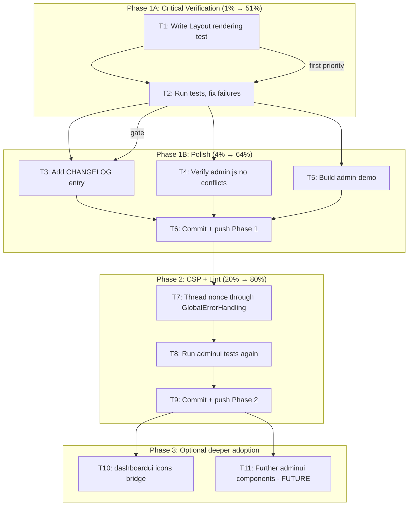

# templ-components Integration: Comprehensive Execution Plan

> Created: 2026-08-05 02:11
> Session goal: Fix Phase 1 gaps, verify correctness, then deepen adoption.

---

## Pareto Breakdown

### The 1% that delivers 51%

**Rendering tests.** Without them, we don't know if `tcShowToast`, `#tc-toast-container`, or `#tc-error-announcer` are actually in the HTML. The entire Phase 1 adoption is unverified without these.

### The 4% that delivers 64%

1. Rendering tests (proves the HTML output)
2. CHANGELOG entry (project convention compliance)
3. Verify no JS event listener conflicts between admin.js and GlobalErrorHandling
4. Verify the admin-demo example still builds and serves correctly

### The 20% that delivers 80%

1-4 (above) + 5. Thread nonce through GlobalErrorHandling for CSP consumers 6. Update tailwind.css comment count ("8 .templ files" is now wrong if we add more) 7. Run `nix run .#lint` with a clean tree to verify adminui has 0 issues

### The remaining 20% (to reach 100%)

8. dashboardui icons bridge (`navIconSVG` → `icons.IconPathData`)
9. Deeper adminui component adoptions (StatusBadge, ConfirmDelete, etc.)
10. dashboardui templ migration planning
11. loginpage AuthLayout evaluation

---

## Mermaid Execution Graph

---

## COMPREHENSIVE PLAN — Tasks 30-100 min each

> Sorted by: Impact (customer value) × Confidence (reduces risk) ÷ Effort

| #   | Task                                                                                                          | Impact                                   | Effort | Est | Status |
| --- | ------------------------------------------------------------------------------------------------------------- | ---------------------------------------- | ------ | --- | ------ |
| 1   | Write rendering test: assert Layout HTML contains `#tc-toast-container`, `tcShowToast`, `#tc-error-announcer` | CRITICAL — proves Phase 1 actually works | S      | 30m | TODO   |
| 2   | Run the test, fix any failures discovered                                                                     | CRITICAL — gates everything              | S      | 30m | TODO   |
| 3   | Add CHANGELOG entry for toast migration + GlobalErrorHandling + v1.7.0 bump                                   | HIGH — convention compliance             | S      | 30m | TODO   |
| 4   | Verify admin.js has no event listener conflicts with GlobalErrorHandling (code review only)                   | HIGH — prevents runtime regressions      | S      | 30m | TODO   |
| 5   | Build + smoke test admin-demo example                                                                         | MEDIUM — consumer-facing validation      | S      | 30m | TODO   |
| 6   | Thread CSP nonce through GlobalErrorHandling config                                                           | MEDIUM — CSP-ready for consumers         | S      | 30m | TODO   |
| 7   | Git commit Phase 1A+1B with detailed message                                                                  | HIGH — checkpoint                        | S      | 30m | TODO   |
| 8   | Git commit Phase 2 (nonce) with detailed message                                                              | HIGH — checkpoint                        | S      | 30m | TODO   |
| 9   | Git push                                                                                                      | MEDIUM — remote backup                   | S      | 30m | TODO   |
| 10  | dashboardui: add templ-components dep + replace `navIconSVG` with `icons.IconPathData` bridge                 | HIGH — first dashboardui adoption        | M      | 60m | TODO   |
| 11  | Update AGENTS.md adoption table after dashboardui icons                                                       | LOW — documentation                      | S      | 30m | TODO   |

**Total estimated: 6 hours**

---

## DETAILED BREAKDOWN — Tasks max 12 min each

> Every task above split into atomic subtasks. Sorted by execution order.

| #    | Subtask                                                                                                           | Parent | Est | Deps               |
| ---- | ----------------------------------------------------------------------------------------------------------------- | ------ | --- | ------------------ |
| 1.1  | Read existing test file `coverage_gaps3_test.go` to understand test helper patterns                               | T1     | 5m  | -                  |
| 1.2  | Read `handler_test.go` to understand `newTestPanel` helper                                                        | T1     | 5m  | -                  |
| 1.3  | Write test `TestLayout_ContainsToastContainer` — render dashboard page, assert body contains `tc-toast-container` | T1     | 10m | 1.1, 1.2           |
| 1.4  | Write test `TestLayout_ContainsGlobalErrorHandling` — assert body contains `tc-error-announcer`                   | T1     | 5m  | 1.3                |
| 1.5  | Write test `TestLayout_ContainsToastScript` — assert body contains `tcShowToast` function definition              | T1     | 5m  | 1.3                |
| 1.6  | Write test `TestLayout_ContainsHtmxErrorScript` — assert body contains `tcHandleHTMXError` or `MAX_ERROR_HISTORY` | T1     | 5m  | 1.3                |
| 2.1  | Run `go test ./adminui/... -run TestLayout_ -count=1 -race -v`                                                    | T2     | 5m  | 1.3-1.6            |
| 2.2  | If any test fails: read the failure, understand root cause, fix                                                   | T2     | 12m | 2.1                |
| 2.3  | Run full adminui suite: `go test ./adminui/... -count=1 -race`                                                    | T2     | 5m  | 2.2                |
| 3.1  | Read current CHANGELOG.md `[Unreleased]` section format                                                           | T3     | 3m  | -                  |
| 3.2  | Write CHANGELOG entry under `[Unreleased] → Changed` for toast migration                                          | T3     | 8m  | 3.1                |
| 3.3  | Write CHANGELOG entry under `[Unreleased] → Added` for GlobalErrorHandling                                        | T3     | 5m  | 3.2                |
| 4.1  | Read admin.js full event listeners (`htmx:confirm`, `htmx:beforeRequest`, `htmx:sendError`)                       | T4     | 5m  | -                  |
| 4.2  | Read GlobalErrorHandling JS event listeners (`htmx:sendError`, `htmx:responseError`, `htmx:afterRequest`)         | T4     | 5m  | 4.1                |
| 4.3  | Document any overlaps/conflicts in a code comment or note                                                         | T4     | 5m  | 4.2                |
| 5.1  | Build admin-demo: `GOEXPERIMENT=jsonv2 go build ./examples/admin-demo/...`                                        | T5     | 5m  | -                  |
| 5.2  | If build fails, read error and fix                                                                                | T5     | 10m | 5.1                |
| 6.1  | Read `layout.templ` to see how nonce is currently passed (or not)                                                 | T6     | 3m  | -                  |
| 6.2  | Read `pageData` struct to check if it has a Nonce field                                                           | T6     | 5m  | 6.1                |
| 6.3  | If no Nonce field: add `Nonce string` to `pageData` struct                                                        | T6     | 8m  | 6.2                |
| 6.4  | Pass nonce to `ToastContainer` and `GlobalErrorHandling` in layout.templ                                          | T6     | 5m  | 6.3                |
| 6.5  | Regenerate _templ.go: `templ generate`                                                                            | T6     | 3m  | 6.4                |
| 6.6  | Build: `go build ./adminui/...`                                                                                   | T6     | 3m  | 6.5                |
| 6.7  | Run tests: `go test ./adminui/... -count=1 -race`                                                                 | T6     | 5m  | 6.6                |
| 7.1  | `git status` to review all changes                                                                                | T7     | 3m  | 2.3, 3.3, 4.3, 5.2 |
| 7.2  | `git diff` to review staged/unstaged content                                                                      | T7     | 5m  | 7.1                |
| 7.3  | Write detailed commit message (HEREDOC)                                                                           | T7     | 8m  | 7.2                |
| 7.4  | `git commit` with the message                                                                                     | T7     | 3m  | 7.3                |
| 8.1  | `git status` + `git diff` for Phase 2 changes                                                                     | T8     | 3m  | 6.7                |
| 8.2  | Write commit message for nonce threading                                                                          | T8     | 5m  | 8.1                |
| 8.3  | `git commit`                                                                                                      | T8     | 3m  | 8.2                |
| 9.1  | `git push`                                                                                                        | T9     | 3m  | 7.4, 8.3           |
| 10.1 | Read `dashboardui/layout.go` `navIconSVG` function                                                                | T10    | 5m  | -                  |
| 10.2 | Read `icons.IconPathData` API from templ-components                                                               | T10    | 5m  | -                  |
| 10.3 | Map the 10 dashboardui icon names to templ-components icon names                                                  | T10    | 10m | 10.1, 10.2         |
| 10.4 | Add `templ-components` dependency to `dashboardui/go.mod`                                                         | T10    | 5m  | -                  |
| 10.5 | Replace `navIconSVG` with `icons.IconPathData` bridge                                                             | T10    | 12m | 10.3, 10.4         |
| 10.6 | Build dashboardui: `GOEXPERIMENT=jsonv2 go build ./dashboardui/...`                                               | T10    | 3m  | 10.5               |
| 10.7 | Run dashboardui tests: `go test ./dashboardui/... -count=1 -race -short`                                          | T10    | 5m  | 10.6               |
| 10.8 | Fix any test failures (icon SVG output may differ)                                                                | T10    | 12m | 10.7               |
| 11.1 | Update AGENTS.md adoption table with dashboardui icons entry                                                      | T11    | 5m  | 10.8               |

---

## What we are NOT doing this session (and why)

| Item                                  | Why deferred                                                                                                                  |
| ------------------------------------- | ----------------------------------------------------------------------------------------------------------------------------- |
| Dark mode CSS variable additions      | CSS classes ARE already generated by Tailwind v4; colors use Tailwind defaults which look fine — this is cosmetic, not broken |
| dashboardui full templ migration      | 113 `fmt.Fprintf` calls → paradigm shift; needs its own dedicated session                                                     |
| loginpage AuthLayout                  | loginpage is intentionally zero-dependency; deferred to dedicated evaluation                                                  |
| AppShell adoption                     | Breakpoint mismatch (`max-md` vs `lg`); deep CSS variable theming incompatible                                                |
| Structured JSON error bodies for HTMX | Architectural change to error handling pipeline; needs design discussion                                                      |
