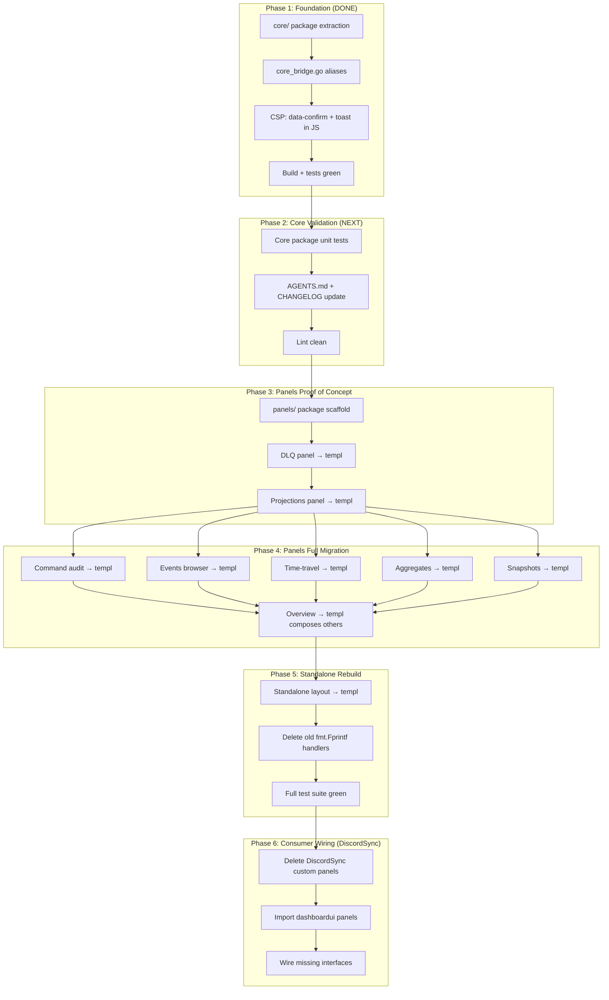

# dashboardui 3-Layer Decomposition — Execution Plan

**Date:** 2026-08-05
**Source:** `docs/feedback/processed/2026-08-05_dashboardui-architecture-decomposition.md`
**Status:** Step 1 (core extraction) COMPLETE; Steps 2-4 planned below

---

## Executive Summary

The feedback document proposes decomposing dashboardui's monolithic `fmt.Fprintf`-based rendering into 3 layers: `core` (pure data), `panels` (templ-components), and a thin standalone shell. This plan covers all remaining work.

### What's Already Done (this session)

| Item                                             | Status  | Files                                                                                |
| ------------------------------------------------ | ------- | ------------------------------------------------------------------------------------ |
| `core/` package — pure data layer                | ✅ DONE | `core/{doc,capabilities,payload,format,overview,pagination,events,dlq}.go` (916 LOC) |
| `core_bridge.go` — type aliases + wrappers       | ✅ DONE | `core_bridge.go` (164 LOC)                                                           |
| All main package files updated to use core       | ✅ DONE | 12 files modified                                                                    |
| All 6 inline `onsubmit` → `data-confirm`         | ✅ DONE | `handlers_dlq.go`, `handlers_projections.go`, `handlers_snapshots.go`                |
| Inline toast `<script>` → `dashboardJS`          | ✅ DONE | `layout.go`                                                                          |
| `data-confirm` delegated listener added to JS    | ✅ DONE | `layout.go`                                                                          |
| `dashboard.js` always loaded (not just EventBus) | ✅ DONE | `layout.go`                                                                          |
| SSE connection gated on indicator presence       | ✅ DONE | `layout.go`                                                                          |
| Build passes, all 96 tests pass with -race       | ✅ DONE |                                                                                      |

---

## Pareto Analysis

### The 1% that delivers 51% of the result (ALREADY DONE)

1. **Core extraction** — the foundation. Without this, nothing else composes.
2. **CSP safety fixes** — eliminates the #1 deployment blocker for DiscordSync and any strict-CSP consumer.

### The 4% that delivers 64% of the result

Items 1-2 above PLUS: 3. **Core package tests** — validates the extraction didn't break anything and documents the API contract. 4. **AGENTS.md + CHANGELOG update** — so the next session understands the new architecture.

### The 20% that delivers 80% of the result

Items 1-4 PLUS: 5. **DLQ panel templ port** — smallest panel, highest duplication value, proves the panels pattern. 6. **Projections panel templ port** — highest operational value (projection health is the #1 dashboard use case).

### The remaining 80% of effort for the last 20% of value

7. Events browser templ port (largest panel, 480 LOC)
8. Command/Query audit templ port
9. Time-travel + aggregates templ port
10. Snapshots templ port
11. Overview panel templ port (composes others)
12. Standalone layout → templ port
13. Delete old `fmt.Fprintf` rendering code
14. DiscordSync wiring (Step 4 — separate repo)

---

## Execution Graph



---

## Comprehensive Task List (Phase-Ordered)

### Phase 2: Core Validation (NEXT — do this session)

| #   | Task                                                                          | Impact | Effort | Size  |
| --- | ----------------------------------------------------------------------------- | ------ | ------ | ----- |
| 2.1 | Add core package unit tests (capabilities, overview, pagination, events, dlq) | High   | Low    | 30min |
| 2.2 | Update AGENTS.md: dashboardui core/ package, CSP fixes, architecture change   | High   | Low    | 15min |
| 2.3 | Update CHANGELOG.md with core extraction + CSP safety entries                 | Medium | Low    | 10min |
| 2.4 | Run lint on dashboardui + core, fix any issues                                | Medium | Low    | 15min |
| 2.5 | Update dashboardui/README.md to mention core package                          | Low    | Low    | 10min |

### Phase 3: Panels Proof of Concept (next session)

| #   | Task                                                        | Impact | Effort | Size  |
| --- | ----------------------------------------------------------- | ------ | ------ | ----- |
| 3.1 | Create panels/ package with go.mod, PanelOpts, doc.go       | High   | Medium | 30min |
| 3.2 | Port DLQ panel to templ (smallest, most duplicated)         | High   | Medium | 45min |
| 3.3 | Write golden-file rendering test for DLQ panel              | High   | Low    | 30min |
| 3.4 | Port Projections panel to templ (highest operational value) | High   | High   | 60min |
| 3.5 | Write golden-file rendering test for Projections panel      | High   | Low    | 30min |

### Phase 4: Full Panels Migration (future sessions)

| #   | Task                                                  | Impact | Effort | Size  |
| --- | ----------------------------------------------------- | ------ | ------ | ----- |
| 4.1 | Port Command Audit panel to templ                     | Medium | Medium | 45min |
| 4.2 | Port Events Browser panel to templ (largest, 480 LOC) | Medium | High   | 90min |
| 4.3 | Port Time-Travel panel to templ                       | Medium | Medium | 45min |
| 4.4 | Port Aggregates Browser panel to templ                | Medium | Medium | 45min |
| 4.5 | Port Snapshots panel to templ                         | Low    | Medium | 30min |
| 4.6 | Port Overview panel to templ (composes others)        | High   | Medium | 45min |
| 4.7 | Golden-file tests for all ported panels               | High   | Medium | 60min |

### Phase 5: Standalone Rebuild (future)

| #   | Task                                                                         | Impact   | Effort | Size  |
| --- | ---------------------------------------------------------------------------- | -------- | ------ | ----- |
| 5.1 | Port standalone layout (sidebar, header, CSS) to templ                       | High     | High   | 90min |
| 5.2 | Rewrite standalone handlers to use core + panels                             | High     | Medium | 60min |
| 5.3 | Delete all fmt.Fprintf rendering code (layout.go, handler_overview.go, etc.) | High     | Low    | 30min |
| 5.4 | Delete embedded dashboardCSS constant (335 lines)                            | High     | Low    | 5min  |
| 5.5 | Full test suite green on standalone rebuild                                  | Critical | Medium | 45min |

### Phase 6: DiscordSync Wiring (separate repo)

| #   | Task                                                          | Impact   | Effort | Size  |
| --- | ------------------------------------------------------------- | -------- | ------ | ----- |
| 6.1 | Delete DiscordSync's custom dlq.templ + handler               | High     | Low    | 15min |
| 6.2 | Delete DiscordSync's custom projection_health.templ + handler | High     | Low    | 15min |
| 6.3 | Delete DiscordSync's custom command_audit.templ + handler     | High     | Low    | 15min |
| 6.4 | Import dashboardui/core + panels, write 5-line handlers       | High     | Low    | 30min |
| 6.5 | Wire SeekableJournal for event journal browser                | Medium   | Low    | 15min |
| 6.6 | Wire EventSource for time-travel                              | Medium   | Low    | 15min |
| 6.7 | Run DiscordSync test suite                                    | Critical | Medium | 30min |

---

## Micro-Tasks (max 12min each) — Phase 2 Only

These are the immediate next steps, broken into smallest-possible units.

| #    | Micro-Task                                                                       | Est   |
| ---- | -------------------------------------------------------------------------------- | ----- |
| 2.1a | Write core_test.go: test DetectCapabilities with all nil fields → all false      | 8min  |
| 2.1b | Write core_test.go: test DetectCapabilities with all fields set → all true       | 8min  |
| 2.1c | Write core_test.go: test ProjectionStats with nil host → empty slice             | 5min  |
| 2.1d | Write core_test.go: test ProjectionStats with mock host → correct stats          | 10min |
| 2.1e | Write core_test.go: test FetchOverview with SeekableJournal                      | 10min |
| 2.1f | Write core_test.go: test FetchOverview with Journal fallback                     | 10min |
| 2.1g | Write core_test.go: test FetchOverview with ProjectionHost health classification | 10min |
| 2.1h | Write core_test.go: test EventFilter.Active() and .Matches()                     | 8min  |
| 2.1i | Write core_test.go: test PageState push/pop cursor                               | 8min  |
| 2.1j | Write core_test.go: test DLQProjectionLinks with nil host                        | 5min  |
| 2.2a | Update AGENTS.md: add core/ to architecture section                              | 10min |
| 2.2b | Update AGENTS.md: update dashboardui section with core extraction details        | 10min |
| 2.3a | Update CHANGELOG.md with core extraction entry                                   | 5min  |
| 2.3b | Update CHANGELOG.md with CSP safety entry                                        | 5min  |
| 2.4a | Run `nix run .#lint` on dashboardui, fix issues                                  | 12min |

---

## Anti-Verschlimmbesserung Checklist

Before each change, verify:

- [ ] Build passes (`GOEXPERIMENT=jsonv2 go build ./...`)
- [ ] Tests pass (`GOEXPERIMENT=jsonv2 go test ./dashboardui/... -count=1 -race`)
- [ ] No new lint issues introduced
- [ ] No public API broken (type aliases maintain backward compat)
- [ ] No behavior change (same HTML output for same inputs)
- [ ] No new dependencies added without go.mod update
- [ ] golangci-lint doesn't complain about the core_bridge.go wrappers

---

## Risk Assessment

| Risk                                                   | Likelihood | Impact | Mitigation                                                         |
| ------------------------------------------------------ | ---------- | ------ | ------------------------------------------------------------------ |
| gopls stale diagnostics confuse future sessions        | Medium     | Low    | Build passes; document that gopls shows false DuplicateDecl errors |
| Type aliases break a consumer import                   | Low        | High   | Aliases are transparent in Go; test with `go build ./...`          |
| Panels package go.mod creates circular dependency      | Medium     | High   | panels/ imports core/ only; core/ imports nothing from parent      |
| templ port changes HTML output, breaking golden tests  | High       | Medium | Write golden tests BEFORE porting; compare output                  |
| Standalone layout port loses CSS theming (AccentColor) | Medium     | Medium | Pass AccentColor through PanelOpts; templ can use inline style     |

---

## What This Session Accomplished

```
Before:                          After:
┌─────────────────────┐          ┌─────────────────────┐
│ dashboardui         │          │ dashboardui         │
│  (fmt.Fprintf)      │          │  (fmt.Fprintf)      │
│  (inline onsubmit)  │          │  (data-confirm)     │
│  (inline script)    │          │  (CSP-safe JS)      │
│  178 Fprintf sites  │          │  80 Fprintf sites   │
│  6 onsubmit         │          │  0 onsubmit         │
│  1 inline script    │          │  0 inline script    │
│  No core/           │          │  core/ (916 LOC)    │
│  Not CSP-compatible │          │  CSP-compatible     │
└─────────────────────┘          └─────────────────────┘
```
