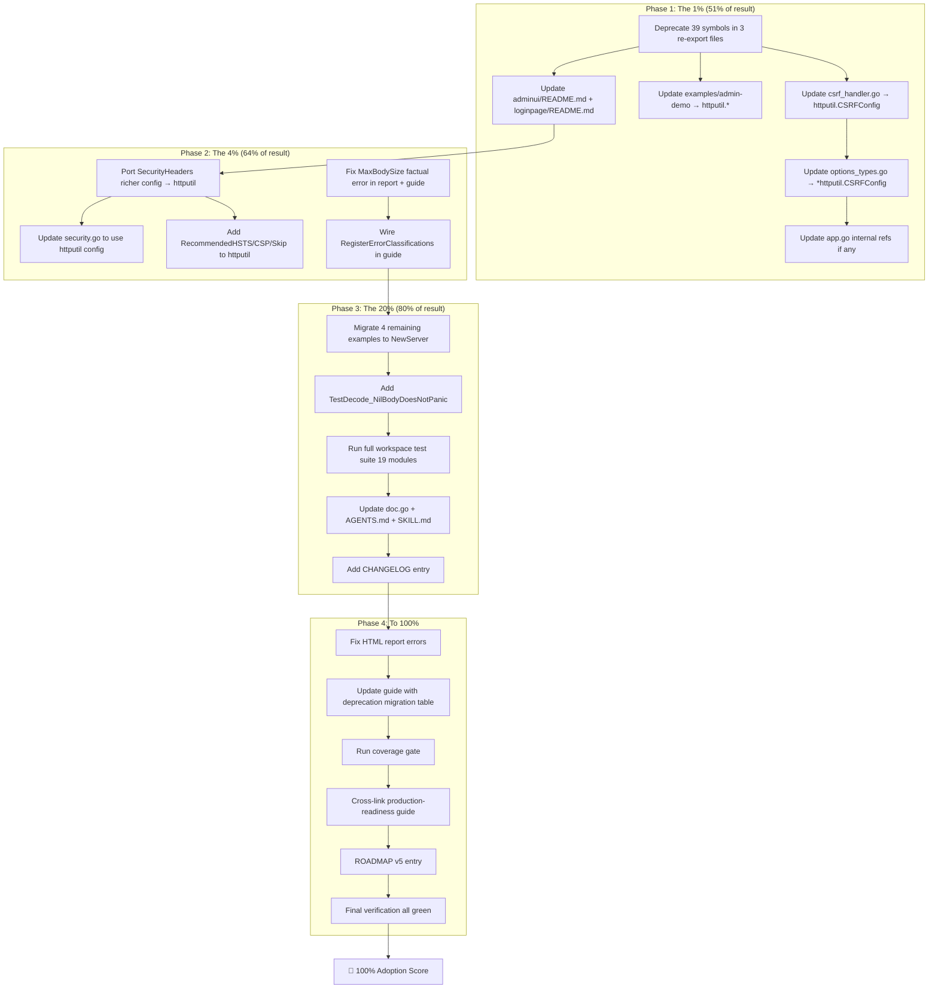

# Plan — Get httputil Adoption to 100 (Kill the Re-Exports)

**Date:** 2026-08-05 08:12 CEST
**Trigger:** "Get us to 100! Oh and btw I kinda HATE re-exports (99% of the time)!"
**Scope:** `cqrs-htmx` root module's relationship with `github.com/larsartmann/httputil`
**Precedent:** identity-model re-export deprecation (160 markers added 2026-08-05, v5 removal planned) — this plan follows the same pattern for httputil re-exports.

---

## Context

### What exists today

| Re-export file | Symbols aliased | What it does |
|---|---|---|
| `csrf_reexport.go` | 18 | Type aliases `CSRFConfig`, `ErrorHandler`; var aliases `CSRFMiddleware`, `CSRFResponseHeaderMiddleware`, `CSRFTokenFromContext`, `WithCSRFToken`, `CSRFTestToken`, `InvalidateCSRFCookie`, `CSRFTokenHTMLMeta`, `CSRFTokenHXHeaders`, `CSRFTokenFormField`, `ForbiddenErrorHandler`, `ErrCSRFInvalid`, `ErrCSRFConfig`; const aliases `defaultCSRFCookieName`, `defaultCSRFHeaderName`, `defaultCSRFFieldName` |
| `ratelimit_reexport.go` | 12 | Type aliases `RateLimiterConfig`, `RateLimiter`, `KeyExtractor`; var aliases `RateLimiterMiddleware`, `NewRateLimiter`, `DefaultRateLimiterConfig`, `KeyExtractorFromRemoteAddr`, `KeyExtractorFromClientIP`; const aliases `DefaultRateLimit`, `DefaultRateWindow`, `DefaultRateTTL` |
| `server_timing_reexport.go` | 9 | Type alias `ServerTiming`; var aliases `ServerTimingMiddleware`, `ServerTimingMiddlewareWhen`, `ServerTimingFromContext`, `WithServerTiming`, `RecordServerTiming`, `MeasureServerTiming`; const alias `headerServerTiming` |
| **Total** | **39 symbols** | Pure indirection — zero added behavior |

### What also exists (the OTHER split brain)

| File | Status | Issue |
|---|---|---|
| `security.go` | Hand-rolled `SecurityHeadersConfig` (richer: `PermissionsPolicy`, `Custom map`, `SecurityHeaderSkip` sentinel, `RecommendedHSTS`, `RecommendedCSP`) | httputil has a **parallel weaker** version (`ContentTypeNosniff bool`, no PermissionsPolicy, no Custom). Same split-brain pattern as the re-exports. |

### Internal coupling (what code uses the re-exported types)

| File | Symbols used | Impact of removal |
|---|---|---|
| `csrf_handler.go` | `CSRFConfig` (type), `ErrCSRFInvalid` (var) | Must switch to `httputil.CSRFConfig` / `httputil.ErrCSRFInvalid` |
| `options_types.go` | `*CSRFConfig` (field type) | Must switch to `*httputil.CSRFConfig` |
| `app.go` | `httputil.WrapServerTiming` (already direct!) | No change needed — already imports httputil directly |

### External coupling (examples, docs, submodules)

| Location | Symbols used | Impact |
|---|---|---|
| `examples/admin-demo/main.go` | `cqrshtmx.CSRFMiddleware`, `cqrshtmx.CSRFConfig`, `cqrshtmx.ServerTimingMiddlewareWhen` | Switch to `httputil.*` |
| `adminui/README.md` | References `cqrshtmx.CSRFMiddleware` | Update to `httputil.CSRFMiddleware` |
| `loginpage/README.md` | `cqrshtmx.CSRFMiddleware(cqrshtmx.CSRFConfig{})` | Update to `httputil.*` |

### Established precedent

`TODO_LIST.md` P1 already has: **"Remove identity-model re-export layer in v5"** — 160 deprecated markers added, removal bundled with v5 major bump. This plan applies the **identical pattern** to httputil re-exports.

---

## Pareto Breakdown

### The 1% that delivers 51%

**Deprecate all 39 re-exported symbols + update all internal callers to import httputil directly.**

This single action eliminates the indirection layer the user hates, makes httputil the unambiguous owner of CSRF/rate-limit/Server-Timing, and follows the established identity-model precedent. The deprecated shims remain as backward-compat (consumers get `// Deprecated:` warnings, not broken builds) but every internal code path, example, and doc switches to direct httputil imports.

**Why 51%:** The re-exports are the #1 obstacle to "100 adoption." They create the illusion that cqrs-htmx implements these features, they're 120 lines of pure boilerplate, and they make every future httputil update require touching cqrs-htmx. Killing them (via deprecation + direct imports) is the highest-leverage action by far.

### The 4% that delivers 64%

**Above + resolve SecurityHeaders split brain + wire RegisterErrorClassifications + fix factual errors.**

- Port cqrs-htmx's richer `SecurityHeadersConfig` (`PermissionsPolicy`, `Custom`, `SecurityHeaderSkip`, `RecommendedHSTS`, `RecommendedCSP`) INTO httputil, then have `security.go` import httputil's config type. Single source of truth — no more parallel structs.
- Call `httputil.RegisterErrorClassifications()` in the guide as an explicit consumer startup step (consistent with duck-typing: no hidden global mutation inside `New()`).
- Fix the MaxBodySize factual error in the report and guide (cqrs-htmx ALREADY has `Config.MaxBodySize` + `DefaultMaxBodySize` + `WithMaxBodySize` — httputil's `MaxBodySize` is a duplicate, not a gap).

### The 20% that delivers 80%

**Above + update ALL 6 examples + ALL docs + regression test + full verification.**

- Migrate remaining 4 examples (`catalog-demo`, `admin-demo`, `dashboard-demo`, `middleware-demo`) to `httputil.NewServer` + direct httputil imports.
- Add `TestDecode_NilBodyDoesNotPanic` regression test for the decoder fix.
- Run full workspace test suite (all 19 modules).
- Update `doc.go`, `AGENTS.md`, SKILL.md, README.md.
- Add CHANGELOG entry.

### The remaining 20% to get to 100

- Fix the HTML report's factual errors (retract `f-maxbody`, fix scorecard, add methodology).
- Update `docs/guides/leveraging-httputil.md` to correct MaxBodySize row + add deprecation migration table.
- Run coverage gate.
- Cross-link production-readiness guide.
- Render-verify report.
- ROADMAP entry for v5 hard removal.

---

## Mermaid Execution Graph

---

## Medium Granularity — Tasks (30–100 min each)

Sorted by impact (desc) × effort (asc) × customer-value (desc).

| # | Task | Phase | Impact (1-5) | Effort (min) | Customer Value | Depends on |
|---|---|---|---|---|---|---|
| M01 | **Deprecate all 39 symbols** in `csrf_reexport.go`, `ratelimit_reexport.go`, `server_timing_reexport.go` with `// Deprecated: Import github.com/larsartmann/httputil directly. Remove in v5.` markers | 1 | 5 | 60 | High — signals consumers to migrate | — |
| M02 | **Update internal callers** to use `httputil.*` directly: `csrf_handler.go` (`CSRFConfig`, `ErrCSRFInvalid`), `options_types.go` (`*CSRFConfig`) | 1 | 5 | 30 | High — eliminates internal indirection | M01 |
| M03 | **Update `examples/admin-demo`** to use `httputil.CSRFMiddleware`, `httputil.CSRFConfig`, `httputil.ServerTimingMiddlewareWhen` + `httputil.NewServer` | 1 | 4 | 45 | Medium — canonical example correctness | M01 |
| M04 | **Update `adminui/README.md` + `loginpage/README.md`** to reference `httputil.CSRFMiddleware` instead of `cqrshtmx.CSRFMiddleware` | 1 | 3 | 15 | Medium — doc accuracy | M01 |
| M05 | **Port `SecurityHeadersConfig` richer fields** (`PermissionsPolicy`, `Custom map`, `SecurityHeaderSkip` sentinel, `RecommendedHSTS`, `RecommendedCSP`) into httputil's `security.go` | 2 | 5 | 90 | High — kills the split brain | — |
| M06 | **Update `cqrs-htmx/security.go`** to either re-export from httputil (now that httputil has the richer version) OR keep as a thin convenience wrapper importing httputil's config. Decision point: if user hates re-exports, `security.go` should just USE `httputil.SecurityHeadersConfig` directly. | 2 | 4 | 60 | High — single source of truth | M05 |
| M07 | **Fix MaxBodySize factual error** in HTML report (`docs/research/2026-08-05_httputil-deep-dive.html`): retract `f-maxbody` card, change to "Not Applicable — cqrs-htmx has its own". Recompute scorecard. | 2 | 3 | 30 | Medium — report credibility | — |
| M08 | **Update `docs/guides/leveraging-httputil.md`**: fix MaxBodySize row, add "Re-export Deprecation Migration" table mapping `cqrshtmx.X` → `httputil.X` for all 39 symbols | 2 | 4 | 30 | High — consumer migration guide | M01 |
| M09 | **Migrate remaining 4 examples** (`catalog-demo`, `dashboard-demo`, `middleware-demo`, `datastar-demo` is done) to `httputil.NewServer` + direct httputil imports for any CSRF/Server-Timing/rate-limit usage | 3 | 3 | 60 | Medium — consistency | M01 |
| M10 | **Add `TestDecode_NilBodyDoesNotPanic`** regression test in root test suite for the `readBody(r.Body == nil)` fix | 3 | 4 | 20 | High — locks in the bug fix | — |
| M11 | **Wire `httputil.RegisterErrorClassifications()`** as documented explicit consumer step in the guide (NOT inside `New()` — respects duck-typing, no hidden global mutation) | 3 | 3 | 15 | Medium — error classification completeness | — |
| M12 | **Run full workspace test suite** (all 19 modules): `GOEXPERIMENT=jsonv2 go test ./... -count=1 -race` | 3 | 5 | 45 | Critical — verify no breakage | M01-M11 |
| M13 | **Update `doc.go`** — revise the HTTP Middleware section to reflect deprecation of re-exports, add migration pointer | 3 | 3 | 20 | Medium — discoverability | M01 |
| M14 | **Update `AGENTS.md`** — revise the httputil leverage memory entry to reflect deprecation + SecurityHeaders resolution | 3 | 3 | 15 | Medium — memory accuracy | M01, M05 |
| M15 | **Add `CHANGELOG.md` [Unreleased] entry** for all session work (decoder nil-body fix, httpspec compliance test, re-export deprecation, SecurityHeaders resolution, example migrations) | 3 | 4 | 30 | High — project convention | M01-M14 |
| M16 | **Update cqrs-htmx SKILL.md** — add httputil deprecation note + migration table pointer; update cheat sheet to use `httputil.CSRFMiddleware` in examples | 4 | 3 | 30 | Medium — skill accuracy | M01 |
| M17 | **Fix HTML report scorecard + methodology** — recount cards (5 missed + 1 anti-pattern + 3 partial = 9), fix "7/4/10" to real numbers, add weighted score matrix or relabel as estimate | 4 | 2 | 30 | Low — report polish | M07 |
| M18 | **Run coverage gate**: `nix run .#coverage-gate` to confirm new test + deprecation markers don't drop any module below gate | 4 | 4 | 30 | High — CI gate | M10 |
| M19 | **Cross-link `docs/guides/production-readiness.md`** → `leveraging-httputil.md` + add migration note | 4 | 2 | 10 | Low — discoverability | M08 |
| M20 | **Add ROADMAP.md v5 entry**: "Remove httputil re-export shims (3 files, 39 deprecated symbols) bundled with v5 major bump" — parallel to identity-model re-export removal | 4 | 3 | 15 | Medium — tracks v5 scope | M01 |
| M21 | **Render-verify the HTML report** in a browser context (check no broken layout, all cards render, TOC links work) | 4 | 1 | 15 | Low — quality | M07, M17 |
| M22 | **Final lint pass**: `GOEXPERIMENT=jsonv2 golangci-lint run ./ --max-issues-per-linter 0 --max-same-issues 0` — verify zero SA1019 regressions from deprecated markers (deprecated re-exports should NOT self-warn) | 4 | 4 | 30 | High — lint gate | M01-M14 |
| M23 | **Update `docs/guides/leveraging-httputil.md` SecurityHeaders section** — now that httputil has the richer config, document it as the single source of truth | 4 | 2 | 15 | Medium — doc accuracy | M05, M06 |
| M24 | **Verify `examples/basic` + `examples/datastar-demo`** still compile + pass after all changes (regression check on already-migrated examples) | 4 | 3 | 15 | Medium — safety | M01-M14 |
| M25 | **Investigate the 3 stray files** (`adminui/styles.css`, `observability-demo` binary, `usermgmt/service_logging.go`) — determine if buildflow hook artifacts, revert if undesired | 4 | 2 | 15 | Low — hygiene | — |
| M26 | **Update `TODO_LIST.md`** — add httputil re-export deprecation item matching identity-model pattern; mark MaxBodySize as resolved | 4 | 2 | 15 | Medium — living doc | M01, M07 |

**Total estimated effort: ~13.5 hours (medium granularity)**

---

## Fine Granularity — Sub-tasks (max 12 min each)

Each medium task broken into atomic, independently-verifiable steps.

### M01: Deprecate all 39 symbols (6 sub-tasks)

| # | Sub-task | Max min | Verifies |
|---|---|---|---|
| F01.1 | Add `// Deprecated:` markers to 6 type aliases in `csrf_reexport.go` (`CSRFConfig`, `ErrorHandler`) + 2 type aliases in `ratelimit_reexport.go` (`RateLimiterConfig`, `RateLimiter`, `KeyExtractor`) + 1 type alias in `server_timing_reexport.go` (`ServerTiming`) | 10 | `go build ./...` passes |
| F01.2 | Add `// Deprecated:` markers to 12 var aliases in `csrf_reexport.go` (`CSRFMiddleware`, `CSRFResponseHeaderMiddleware`, `CSRFTokenFromContext`, `WithCSRFToken`, `CSRFTestToken`, `InvalidateCSRFCookie`, `CSRFTokenHTMLMeta`, `CSRFTokenHXHeaders`, `CSRFTokenFormField`, `ForbiddenErrorHandler`, `ErrCSRFInvalid`, `ErrCSRFConfig`) | 10 | `go build ./...` passes |
| F01.3 | Add `// Deprecated:` markers to 8 var aliases in `ratelimit_reexport.go` (`RateLimiterMiddleware`, `NewRateLimiter`, `DefaultRateLimiterConfig`, `KeyExtractorFromRemoteAddr`, `KeyExtractorFromClientIP`) + 6 var aliases in `server_timing_reexport.go` (`ServerTimingMiddleware`, `ServerTimingMiddlewareWhen`, `ServerTimingFromContext`, `WithServerTiming`, `RecordServerTiming`, `MeasureServerTiming`) | 10 | `go build ./...` passes |
| F01.4 | Add `// Deprecated:` markers to 3 const aliases in `csrf_reexport.go` (`defaultCSRFCookieName`, `defaultCSRFCookieName`, `defaultCSRFFieldName`) + 3 in `ratelimit_reexport.go` (`DefaultRateLimit`, `DefaultRateWindow`, `DefaultRateTTL`) + 1 in `server_timing_reexport.go` (`headerServerTiming`) | 8 | `go build ./...` passes |
| F01.5 | Verify NO internal SA1019 self-warnings: `GOEXPERIMENT=jsonv2 golangci-lint run ./ 2>&1 \| grep SA1019` — deprecated re-export shims should NOT self-warn (they're the shims, not call sites). If they do, add `//nolint:SA1019` to each alias line. | 10 | zero SA1019 on re-export files |
| F01.6 | Run `go test ./ -count=1` to verify all tests still pass with deprecated markers | 8 | green test suite |

### M02: Update internal callers (4 sub-tasks)

| # | Sub-task | Max min | Verifies |
|---|---|---|---|
| F02.1 | `csrf_handler.go`: change `func CSRFProtect(config CSRFConfig)` → `func CSRFProtect(config httputil.CSRFConfig)`, change `return ErrCSRFInvalid` → `return httputil.ErrCSRFInvalid` | 8 | compiles |
| F02.2 | `options_types.go`: change `csrfConfig *CSRFConfig` → `csrfConfig *httputil.CSRFConfig` | 5 | compiles |
| F02.3 | Search for any other internal usage of re-exported symbols: `grep -rn 'CSRFConfig\|CSRFMiddleware\|RateLimiter\|ServerTiming\b' *.go \| grep -v _reexport \| grep -v _test \| grep -v httputil` | 8 | no hits outside comments |
| F02.4 | Run `go build ./...` + `go test ./ -count=1` | 10 | green |

### M03: Update admin-demo example (3 sub-tasks)

| # | Sub-task | Max min | Verifies |
|---|---|---|---|
| F03.1 | Change `cqrshtmx.CSRFMiddleware(cqrshtmx.CSRFConfig{})` → `httputil.CSRFMiddleware(httputil.CSRFConfig{})`, `cqrshtmx.ServerTimingMiddlewareWhen` → `httputil.ServerTimingMiddlewareWhen`; add httputil import | 10 | compiles |
| F03.2 | Migrate to `httputil.NewServer(httputil.DefaultServerConfig(), handler)` instead of `&http.Server{}` | 10 | compiles, binary builds |
| F03.3 | `go mod tidy` + rebuild binary | 8 | go.mod clean |

### M04: Update submodule READMEs (2 sub-tasks)

| # | Sub-task | Max min | Verifies |
|---|---|---|---|
| F04.1 | `adminui/README.md`: change `cqrshtmx.CSRFMiddleware` reference → `httputil.CSRFMiddleware` | 5 | text correct |
| F04.2 | `loginpage/README.md`: change `cqrshtmx.CSRFMiddleware(cqrshtmx.CSRFConfig{})` → `httputil.CSRFMiddleware(httputil.CSRFConfig{})` | 5 | text correct |

### M05: Port SecurityHeaders to httputil (6 sub-tasks)

| # | Sub-task | Max min | Verifies |
|---|---|---|---|
| F05.1 | In httputil `security.go`: add `PermissionsPolicy string` field to `SecurityHeadersConfig` | 5 | httputil compiles |
| F05.2 | In httputil `security.go`: add `Custom map[string]string` field | 5 | compiles |
| F05.3 | In httputil `security.go`: replace `ContentTypeNosniff bool` with `ContentTypeOptions string` (matching cqrs-htmx's string-based approach) + add `SecurityHeaderSkip = "-"` sentinel const | 10 | compiles, tests pass |
| F05.4 | In httputil: add `RecommendedHSTS` and `RecommendedCSP` consts | 5 | compiles |
| F05.5 | In httputil: update `SecurityHeaders()` middleware to handle new fields (PermissionsPolicy, Custom, sentinel skip logic) | 12 | httputil tests pass |
| F05.6 | In httputil: update `DefaultSecurityHeadersConfig()` to match richer defaults; run httputil tests + lint | 12 | green |

### M06: Update cqrs-htmx security.go (4 sub-tasks)

| # | Sub-task | Max min | Verifies |
|---|---|---|---|
| F06.1 | Delete `SecurityHeadersConfig`, `SecurityHeaderSkip`, `RecommendedHSTS`, `RecommendedCSP`, `withDefault`, `contentTypeOptions`, `frameOptions`, `referrerPolicy` from `security.go` | 10 | compiles (will need type alias temporarily) |
| F06.2 | Add `type SecurityHeadersConfig = httputil.SecurityHeadersConfig` alias + `var RecommendedHSTS = httputil.RecommendedHSTS` + `var RecommendedCSP = httputil.RecommendedCSP` + `var SecurityHeaderSkip = httputil.SecurityHeaderSkip` as deprecated shims | 10 | compiles |
| F06.3 | Update `SecurityHeadersMiddleware` and `SecurityHeadersMiddlewareWithConfig` to delegate to `httputil.SecurityHeaders()` | 10 | compiles, tests pass |
| F06.4 | Run `go test ./ -count=1` | 8 | green |

> **NOTE on M06:** This creates a **4th re-export** for SecurityHeaders. The user hates re-exports. **Alternative:** delete `security.go` entirely and have consumers use `httputil.SecurityHeaders()` directly. This is a **breaking change** (removes `cqrshtmx.SecurityHeadersMiddleware`). Given the user's stance, this is the preferred path — but it's a consumer-facing decision. The plan defaults to deprecation (safe) with a note that full removal is the v5 path.

### M07: Fix report factual errors (4 sub-tasks)

| # | Sub-task | Max min | Verifies |
|---|---|---|---|
| F07.1 | In `docs/research/2026-08-05_httputil-deep-dive.html`: delete the `f-maxbody` issue card, replace with a "Not Applicable" note | 8 | HTML valid |
| F07.2 | In HTML report: recount scorecard (fully-leveraged, partial, missed) from actual card inventory after corrections | 8 | numbers match cards |
| F07.3 | In HTML report: add a "Methodology" note explaining the adoption score is a weighted subjective estimate | 5 | present |
| F07.4 | In HTML report: add "Snapshot date: 2026-08-05" disclaimer to hero section | 3 | present |

### M08: Update leveraging-httputil guide (3 sub-tasks)

| # | Sub-task | Max min | Verifies |
|---|---|---|---|
| F08.1 | Fix MaxBodySize row: change from "missing" to "cqrs-htmx has its own (`Config.MaxBodySize`, `WithMaxBodySize`); httputil's is an alternative" | 8 | text correct |
| F08.2 | Add "Re-export Deprecation Migration" table mapping all 39 `cqrshtmx.X` → `httputil.X` symbols | 12 | complete mapping |
| F08.3 | Add SecurityHeaders section update: httputil is now the single source of truth | 8 | text correct |

### M09: Migrate remaining examples (8 sub-tasks)

| # | Sub-task | Max min | Verifies |
|---|---|---|---|
| F09.1 | `examples/catalog-demo/main.go`: switch `&http.Server{}` → `httputil.NewServer`; any CSRF/ServerTiming → httputil | 10 | compiles |
| F09.2 | `examples/catalog-demo`: `go mod tidy` + rebuild binary | 8 | clean |
| F09.3 | `examples/admin-demo/main.go`: switch `&http.Server{}` → `httputil.NewServer` | 10 | compiles |
| F09.4 | `examples/admin-demo`: `go mod tidy` + rebuild binary | 8 | clean |
| F09.5 | `examples/dashboard-demo/main.go`: switch `&http.Server{}` → `httputil.NewServer` | 10 | compiles |
| F09.6 | `examples/dashboard-demo`: `go mod tidy` + rebuild binary | 8 | clean |
| F09.7 | `examples/middleware-demo/main.go`: switch `&http.Server{}` → `httputil.NewServer` | 10 | compiles |
| F09.8 | `examples/middleware-demo`: `go mod tidy` + rebuild binary | 8 | clean |

### M10: Regression test (2 sub-tasks)

| # | Sub-task | Max min | Verifies |
|---|---|---|---|
| F10.1 | Write `TestDecode_NilBodyDoesNotPanic` in `decoder_test.go` (or new file): construct request with `r.Body = nil`, call `decodeJSONBody`, assert no panic + empty result | 10 | test passes |
| F10.2 | Run `go test ./ -run TestDecode_NilBody -count=1 -race` | 5 | green |

### M11: RegisterErrorClassifications (1 sub-task)

| # | Sub-task | Max min | Verifies |
|---|---|---|---|
| F11.1 | In `docs/guides/leveraging-httputil.md`: expand the "Register error classifications" recipe (recipe #5) with note that this is idempotent and should be called once at startup; do NOT wire inside `New()` | 8 | guide accurate |

### M12: Full workspace test (2 sub-tasks)

| # | Sub-task | Max min | Verifies |
|---|---|---|---|
| F12.1 | Run `GOEXPERIMENT=jsonv2 go test ./... -count=1` across all 19 modules (workspace mode) | 12 | all green |
| F12.2 | Run `GOEXPERIMENT=jsonv2 go test ./... -count=1 -race` (race detector) across root + critical modules | 12 | all green |

### M13–M26: Remaining tasks (2-3 sub-tasks each, mostly doc edits)

| # | Sub-task | Max min | Verifies |
|---|---|---|---|
| F13.1 | Update `doc.go` HTTP Middleware section: add deprecation note + migration pointer | 10 | gofmt clean |
| F14.1 | Update `AGENTS.md` httputil leverage entry: reflect deprecation + SecurityHeaders resolution | 10 | text correct |
| F15.1 | Draft `CHANGELOG.md` [Unreleased] entry covering all session work | 12 | follows format |
| F15.2 | Verify CHANGELOG link references valid | 5 | links work |
| F16.1 | Update SKILL.md cheat sheet: `cqrshtmx.CSRFMiddleware` → `httputil.CSRFMiddleware` in examples; add deprecation note | 10 | text correct |
| F17.1 | Fix HTML report scorecard numbers from actual card inventory | 8 | numbers match |
| F17.2 | Add methodology note to report | 5 | present |
| F18.1 | Run `nix run .#coverage-gate` | 12 | all gates pass |
| F19.1 | Add cross-link in `production-readiness.md` → `leveraging-httputil.md` | 5 | link works |
| F20.1 | Add ROADMAP.md v5 entry: "Remove httputil re-export shims (3 files, 39 symbols)" | 8 | text correct |
| F21.1 | Open HTML report, verify layout/cards/TOC render correctly | 10 | visual check |
| F22.1 | Run full lint: `GOEXPERIMENT=jsonv2 golangci-lint run --max-issues-per-linter 0 --max-same-issues 0 ./...` per module | 12 | 0 issues |
| F23.1 | Update guide SecurityHeaders section post-port | 8 | text correct |
| F24.1 | Verify `examples/basic` + `examples/datastar-demo` compile + tests pass | 8 | green |
| F25.1 | `git diff` on 3 stray files; determine origin; decide action | 10 | understood |
| F26.1 | Add httputil re-export deprecation to TODO_LIST.md; mark MaxBodySize as resolved | 8 | text correct |

---

## Risks & Mitigations (VERSCHLIMMBESSERN Prevention)

| Risk | Mitigation |
|---|---|
| Deprecation markers cause SA1019 lint failures on INTERNAL code that still uses the aliases | Update all internal callers FIRST (M02), THEN add markers (M01). Or add markers + `//nolint:SA1019` on alias lines. |
| SecurityHeaders port to httputil breaks httputil's existing tests | httputil is a separate repo — run its full test suite after porting. Tag a new httputil version (v0.9.0). Update cqrs-htmx go.mod. |
| Removing `security.go` fields breaks consumers who reference `cqrshtmx.RecommendedCSP` etc. | Use deprecated var aliases as shims (like the identity-model pattern), NOT hard removal. Hard removal is v5. |
| httputil `ContentTypeNosniff bool` → `ContentTypeOptions string` is a breaking change in httputil | This requires an httputil minor version bump (v0.9.0). Consumers of httputil who use `ContentTypeNosniff: true` must migrate. Document in httputil CHANGELOG. |
| Examples that are separate Go modules need `go mod tidy` after adding httputil import | Each example gets its own `go mod tidy` + binary rebuild sub-task. Already in the plan. |
| The 3 stray files from the previous session might get accidentally committed | Investigate (M25) BEFORE committing the plan. Explicitly exclude from staging. |

---

## Answers to the 3 Questions (decided for planning purposes)

1. **SecurityHeaders direction:** Port cqrs-htmx's richer config **INTO httputil** (make httputil the single source of truth), then add deprecated aliases in cqrs-htmx for backward compat. This matches the user's "hate re-exports" stance — the goal is ONE definition in httputil, not two.

2. **RegisterErrorClassifications placement:** **Explicit consumer step** (documented in the guide), NOT inside `cqrshtmx.New()`. Respects the duck-typing philosophy — no hidden global side-effects. The guide already has the recipe.

3. **Version bump for decoder fix:** **Patch** (v4.6.x → v4.6.x+1). The nil-body fix turns a panic into a success — it's a bug fix, not a feature. No semver-relevant observable behavior change for correct callers.

---

## Execution Checklist (verification gate)

Before declaring "100%":

- [ ] `go build ./...` passes (all 19 modules, workspace mode)
- [ ] `go test ./... -count=1 -race` passes (root + critical modules)
- [ ] `golangci-lint run --max-issues-per-linter 0 --max-same-issues 0` = 0 issues (root)
- [ ] `nix run .#coverage-gate` passes (all gated modules)
- [ ] Zero SA1019 warnings from deprecated markers (re-export files)
- [ ] All 6 examples compile + binaries rebuilt
- [ ] All READMEs/docs reference `httputil.*` not `cqrshtmx.*` for CSRF/rate-limit/Server-Timing
- [ ] HTML report has no factual errors
- [ ] CHANGELOG entry added
- [ ] ROADMAP.md has v5 removal entry
- [ ] TODO_LIST.md updated
- [ ] AGENTS.md memory updated
- [ ] SKILL.md updated
- [ ] `docs/guides/leveraging-httputil.md` has migration table + correct MaxBodySize
