# Pareto Plan: 2026-08-05 17:15 — Release Readiness & Technical Debt Paydown

> **Scope:** All TODO_LIST.md items + session-gap items from the 2026-08-05 self-review + ROADMAP open questions that are actionable now.
> **Date:** 2026-08-05 | **Author:** Crush (Pareto Planning) | **Status:** PLANNING — awaiting approval

---

## Context

This plan covers the complete backlog: 11 TODO_LIST items (1 P0, 1 P1[~], 5 P2, 4 P3), 7 session-gap items from the brutal self-review (`docs/status/2026-08-05_17-12_todo-sweep-and-ci-guardrails.md`), and 2 ROADMAP open questions that are immediately actionable. The goal is to reach a clean, releasable, hermetically-buildable v5.

### Critical Path

The single biggest blocker is **P0: httputil v0.9.0 publish**. Without it:

- `nix run .#build` / `nix run .#test` (GOWORK=off) is **broken** — `security.go` references unpublished httputil APIs
- The `go.work` TEMPORARY replace is required
- Every consumer doing `go get` without the workspace will fail

---

## Step 1: Pareto Breakdown

### The 1% that delivers 51% of the result

| #   | Task                                                                                                                                                         | Why it's 51%                                                                                                                     |
| --- | ------------------------------------------------------------------------------------------------------------------------------------------------------------ | -------------------------------------------------------------------------------------------------------------------------------- |
| 1   | **Publish httputil v0.9.0** — tag the external repo, bump go.mod across all modules, remove the go.work replace, verify `nix run .#test` passes hermetically | This is THE blocking item. Hermetic build is broken without it. Every other task is moot if the build doesn't work hermetically. |

### The 4% that delivers 64% of the result

| #   | Task                                                                                                                     | Why it's 64%                                                                                                                       |
| --- | ------------------------------------------------------------------------------------------------------------------------ | ---------------------------------------------------------------------------------------------------------------------------------- |
| 1   | Publish httputil v0.9.0 (above)                                                                                          | Unblocks hermetic build                                                                                                            |
| 2   | **Add missing BuildFlow tools to devShell** (biome, shfmt, nixfmt, cspell, vitest, jest, dprint)                         | Currently FORCING `--no-verify` on every commit. Pre-commit hook is completely broken. Without this, no quality gate runs locally. |
| 3   | **Fix adminui/handler.go production code** — `cqrshtmx.SecurityHeadersMiddleware` → `httputil.SecurityHeadersMiddleware` | Production code uses a deprecated alias that will break at v5. This is not a doc comment — it's a real function call.              |

### The 20% that delivers 80% of the result

| #   | Task                                                                                                                 | Why it's 80%                                                                                     |
| --- | -------------------------------------------------------------------------------------------------------------------- | ------------------------------------------------------------------------------------------------ |
| 1-3 | The 4% above                                                                                                         | Foundation                                                                                       |
| 4   | **Publish `datastar/v4` git tag** — strip local replaces, tag, push                                                  | Consumers outside the workspace cannot `go get` the module. It's release-ready but invisible.    |
| 5   | **Fix README.md stale re-export refs** (10+ references)                                                              | Consumer-facing docs. Consumers copy-paste deprecated `cqrshtmx.CSRFMiddleware` from the README. |
| 6   | **Close dashboardui/core/ coverage gaps** — ListStreamsPaged (0%), ProjectionStats (25%), DLQProjectionLinks (16.7%) | Ungated sub-package at 67.2%. Production observability code with 0% coverage on pagination.      |
| 7   | **MySQL integration test** (testcontainers)                                                                          | MySQL support is "done" but untested against a real database. Claims without evidence.           |

### The remaining 20% (to reach 100%)

Everything else: docs guides fixes, SECURITY.md, csrf-trusted-proxies.md, v4-to-v5.md alias fix, script test suites, auto-discover modules, dead JSON tag audit, golines, Go-based link checker, cqrs-lint CI, version bump decision, re-export layer v5 planning.

---

## Step 2: Comprehensive Plan (Medium Granularity — 30-100min tasks)

> Sorted by impact (customer-value × correctness) then effort. Dependencies noted.

| #   | Task                                                                                                                                                                                                               | Impact                                                                         | Effort | Deps        | Priority |
| --- | ------------------------------------------------------------------------------------------------------------------------------------------------------------------------------------------------------------------ | ------------------------------------------------------------------------------ | ------ | ----------- | -------- |
| M01 | **Publish httputil v0.9.0** — tag httputil repo, bump root + all sub-module go.mod, `go mod tidy` each, remove go.work replace, verify `nix run .#test` hermetically                                               | CRITICAL                                                                       | 60min  | none        | P0       |
| M02 | **Fix adminui/handler.go deprecated production code** — add `httputil` import to adminui, replace `cqrshtmx.SecurityHeadersMiddleware` with `httputil.SecurityHeadersMiddleware` (line 184 + doc comment line 174) | HIGH                                                                           | 15min  | none        | P0       |
| M03 | **Fix README.md stale re-export refs** — replace all 10+ `cqrshtmx.CSRFMiddleware`/`SecurityHeadersMiddleware`/`CSRFConfig` with `httputil.*` equivalents across README.md                                         | HIGH                                                                           | 30min  | none        | P0       |
| M04 | **Fix SECURITY.md + docs/guides stale refs** — SECURITY.md:28, production-readiness.md:146-147, csrf-trusted-proxies.md:21/40/50/64                                                                                | MEDIUM                                                                         | 20min  | none        | P1       |
| M05 | **Add missing BuildFlow tools to devShell** — add biome, shfmt, nixfmt, dprint to flake.nix devShell; test pre-commit hook passes without `--no-verify`                                                            | HIGH                                                                           | 45min  | none        | P0       |
| M06 | **Fix v4-to-v5.md alias usage** — replace `cqrshtmx.SSEEvent` with `sse.Event` in After examples; add `go-sse` import note                                                                                         | LOW                                                                            | 10min  | none        | P1       |
| M07 | **Publish `datastar/v4` git tag** — strip local replaces from demo/integration_test go.mod, commit, tag `datastar/v4.0.0`, push                                                                                    | HIGH                                                                           | 30min  | M01         | P1       |
| M08 | **Close dashboardui/core/ coverage gaps** — write tests for ListStreamsPaged, FetchOverview health path, ProjectionStats, DLQProjectionLinks; raise core/ from 67.2% to ≥80%                                       | HIGH                                                                           | 90min  | none        | P2       |
| M09 | **Add dashboardui/core/ to coverage gate** — add a gate entry in flake.nix coverage-gate + CI ci.yml for core/ ≥80%                                                                                                | MEDIUM                                                                         | 15min  | M08         | P2       |
| M10 | **MySQL integration test** — add testcontainers-based test against real MySQL; verify dialect, read models, error classifier                                                                                       | HIGH                                                                           | 90min  | none        | P1       |
| M11 | **MySQL README documentation** — add MySQL section to root README.md with setup example                                                                                                                            | MEDIUM                                                                         | 20min  | none        | P1       |
| M12 | **`NewMySQLSetup` constructor** — MySQL-backed session/snapshot/checkpoint stores convenience constructor                                                                                                          | MEDIUM                                                                         | 45min  | none        | P1       |
| M13 | **Auto-discover modules from go.work** — replace hardcoded lists in flake.nix apps with `go work edit -json                                                                                                        | jq` dynamic discovery; requires architecture decision for shell-in-Nix pattern | MEDIUM | 60min       | none     | P2  |
| M14 | **Create script test suites** — test-check-large-files.sh, test-check-service-methods.sh, test-check-domain-counts.sh (follow test-check-docs-links.sh pattern)                                                    | LOW                                                                            | 30min  | none        | P2       |
| M15 | **httputil SecurityHeaders field tests** — test PermissionsPolicy, Custom, ContentTypeOptions precedence, SecurityHeaderSkip sentinel in httputil (external repo)                                                  | LOW                                                                            | 30min  | M01         | P2       |
| M16 | _*Wire remaining check-* into CI_* — check-codegen (needs templ pinning solution), check-templates (needs workspace-mode step)                                                                                     | LOW                                                                            | 45min  | M05         | P2       |
| M17 | **Audit display-only structs for dead JSON tags** — systematic grep for `json:"..."` tags on structs never marshaled; remove dead tags                                                                             | LOW                                                                            | 30min  | none        | P3       |
| M18 | **Add golines to nix fmt pipeline** — integrate golines into treefmt for automatic alignment                                                                                                                       | LOW                                                                            | 20min  | none        | P3       |
| M19 | **Version bump decision** — cut v5.0.0 (SSE-only, breaking) or v4.7.0 (preview); tag and release                                                                                                                   | HIGH                                                                           | 30min  | M01,M02,M03 | P1       |
| M20 | **Re-export layer v5 removal plan** — document the removal sequence for the 39 httputil + 160 identity-model deprecated re-export symbols; create a checklist ADR                                                  | MEDIUM                                                                         | 30min  | none        | P2       |

**Total: 20 tasks, ~12.5 hours estimated.**

---

## Step 3: Detailed Breakdown (Fine Granularity — max 12min each)

> Each task above broken into atomic steps. Sorted within parent task by execution order.

| #   | Parent | Step                                                                                                         | Effort                                      |
| --- | ------ | ------------------------------------------------------------------------------------------------------------ | ------------------------------------------- |
| F01 | M01    | `cd /home/lars/projects/httputil && git tag v0.9.0 && git push --tags`                                       | 2min                                        |
| F02 | M01    | Bump root go.mod: `go get github.com/larsartmann/httputil@v0.9.0 && go mod tidy`                             | 3min                                        |
| F03 | M01    | Bump adminui go.mod httputil ref                                                                             | 2min                                        |
| F04 | M01    | Bump dashboardui go.mod httputil ref                                                                         | 2min                                        |
| F05 | M01    | Bump loginpage go.mod httputil ref                                                                           | 2min                                        |
| F06 | M01    | Bump all example go.mod httputil refs (7 examples)                                                           | 5min                                        |
| F07 | M01    | Remove httputil replace from go.work                                                                         | 2min                                        |
| F08 | M01    | Run `nix run .#build` (GOWORK=off hermetic) — verify passes                                                  | 5min                                        |
| F09 | M01    | Run `nix run .#test` (GOWORK=off hermetic) — verify passes                                                   | 10min                                       |
| F10 | M02    | Read adminui/handler.go lines 170-185                                                                        | 1min                                        |
| F11 | M02    | Add `httputil` import to adminui/handler.go                                                                  | 2min                                        |
| F12 | M02    | Replace `cqrshtmx.SecurityHeadersMiddleware` with `httputil.SecurityHeadersMiddleware` on line 184           | 2min                                        |
| F13 | M02    | Replace `[cqrshtmx.SecurityHeadersMiddleware]` doc-link on line 174                                          | 2min                                        |
| F14 | M02    | `cd adminui && go build ./...`                                                                               | 2min                                        |
| F15 | M03    | Read README.md lines 130-140 (middleware example)                                                            | 2min                                        |
| F16 | M03    | Fix README.md:136 — `cqrshtmx.SecurityHeadersMiddleware` → `httputil.SecurityHeadersMiddleware`              | 2min                                        |
| F17 | M03    | Fix README.md:137 — `cqrshtmx.CSRFMiddleware(...)` → `httputil.CSRFMiddleware(httputil.CSRFConfig{})`        | 2min                                        |
| F18 | M03    | Fix README.md:667,669 — same pattern                                                                         | 2min                                        |
| F19 | M03    | Fix README.md:699 — `cqrshtmx.CSRFConfig{` → `httputil.CSRFConfig{`                                          | 2min                                        |
| F20 | M03    | Fix README.md:754,806,814,1042 — remaining SecurityHeaders/CSRF refs                                         | 4min                                        |
| F21 | M03    | Grep README.md for any remaining `cqrshtmx.CSRF` or `cqrshtmx.SecurityHeaders` — verify zero                 | 2min                                        |
| F22 | M04    | Fix SECURITY.md:28 — `cqrshtmx.CSRFMiddleware(cqrshtmx.CSRFConfig{` → `httputil.*`                           | 3min                                        |
| F23 | M04    | Fix docs/guides/production-readiness.md:146-147                                                              | 3min                                        |
| F24 | M04    | Fix docs/guides/csrf-trusted-proxies.md lines 21,40,50,64                                                    | 5min                                        |
| F25 | M04    | Grep all docs/guides/ for `cqrshtmx.CSRF` — verify zero (excluding leveraging-httputil.md "before" examples) | 3min                                        |
| F26 | M05    | Read flake.nix devShell section (find where tools are declared)                                              | 3min                                        |
| F27 | M05    | Add `pkgs.biome` to devShell                                                                                 | 3min                                        |
| F28 | M05    | Add `pkgs.shfmt` to devShell                                                                                 | 2min                                        |
| F29 | M05    | Add `pkgs.nixfmt` to devShell                                                                                | 2min                                        |
| F30 | M05    | Add `pkgs.dprint` (or markdown formatter) to devShell                                                        | 3min                                        |
| F31 | M05    | Verify `nix develop -c shfmt --version` works                                                                | 2min                                        |
| F32 | M05    | Test commit (touch a .md file, stage, commit) — verify pre-commit passes WITHOUT --no-verify                 | 5min                                        |
| F33 | M06    | Read docs/migrations/v4-to-v5.md SSE pattern section                                                         | 2min                                        |
| F34 | M06    | Replace `cqrshtmx.SSEEvent` with `sse.Event` in After examples                                               | 5min                                        |
| F35 | M06    | Add `import "github.com/larsartmann/go-sse"` note to the guide                                               | 3min                                        |
| F36 | M07    | Read examples/datastar-demo/go.mod and integration_test/go.mod for local replaces                            | 3min                                        |
| F37 | M07    | Strip `replace` directives from datastar-demo go.mod                                                         | 3min                                        |
| F38 | M07    | Strip `replace` directives from integration_test go.mod                                                      | 3min                                        |
| F39 | M07    | Verify both modules build with GOWORK=off                                                                    | 5min                                        |
| F40 | M07    | `git tag datastar/v4.0.0 && git push origin datastar/v4.0.0`                                                 | 2min                                        |
| F41 | M08    | Read dashboardui/core/pagination.go (ListStreamsPaged)                                                       | 5min                                        |
| F42 | M08    | Write test for ListStreamsPaged — empty, single page, multi-page, boundary                                   | 10min                                       |
| F43 | M08    | Read dashboardui/core/overview.go (FetchOverview health path)                                                | 5min                                        |
| F44 | M08    | Write test for FetchOverview ProjectionHost health classification                                            | 10min                                       |
| F45 | M08    | Read dashboardui/core/events.go (ProjectionStats)                                                            | 5min                                        |
| F46 | M08    | Write test for ProjectionStats — zero events, many events, lag calculation                                   | 10min                                       |
| F47 | M08    | Read dashboardui/core/dlq.go (DLQProjectionLinks)                                                            | 5min                                        |
| F48 | M08    | Write test for DLQProjectionLinks with a real host                                                           | 10min                                       |
| F49 | M08    | Run `cd dashboardui && go test ./core/... -cover` — verify ≥80%                                              | 5min                                        |
| F50 | M09    | Add dashboardui/core/ coverage gate to flake.nix (≥80%)                                                      | 5min                                        |
| F51 | M09    | Add dashboardui/core/ coverage check to ci.yml test job                                                      | 5min                                        |
| F52 | M09    | Run `nix run .#coverage-gate` — verify all gates pass                                                        | 5min                                        |
| F53 | M10    | Read usermgmt/sql_readmodel_mysql.go + mysql_dialect_test.go for context                                     | 5min                                        |
| F54 | M10    | Add testcontainers dependency to usermgmt/go.mod                                                             | 3min                                        |
| F55 | M10    | Create usermgmt/mysql_integration_test.go — spin up MySQL container                                          | 10min                                       |
| F56 | M10    | Write test: create event store, append events, read back, verify                                             | 10min                                       |
| F57 | M10    | Write test: read model CRUD against real MySQL                                                               | 10min                                       |
| F58 | M10    | Write test: duplicate key error classification                                                               | 5min                                        |
| F59 | M10    | Run `cd usermgmt && go test -run MySQL -v` — verify passes                                                   | 10min                                       |
| F60 | M11    | Draft MySQL README section (setup, dialect, supported features)                                              | 10min                                       |
| F61 | M11    | Insert into README.md after the Postgres section                                                             | 5min                                        |
| F62 | M12    | Read usermgmt postgres_setup.go for pattern reference                                                        | 3min                                        |
| F63 | M12    | Create usermgmt/mysql_setup.go convenience constructor (NewMySQLSetup)                                       | 10min                                       |
| F64 | M12    | Add MySQL-backed session/snapshot/checkpoint store wiring                                                    | 10min                                       |
| F65 | M12    | `nix run .#check-templates` — verify mysql_setup.go compiles                                                 | 5min                                        |
| F66 | M13    | Read flake.nix test/lint/coverage/build app module lists                                                     | 5min                                        |
| F67 | M13    | Prototype `go work edit -json                                                                                | jq -r '.Mapping[].DiskPath'` in nix develop | 5min |
| F68 | M13    | Write a nix helper function `workspaceModules` that returns the list                                         | 10min                                       |
| F69 | M13    | Replace hardcoded lists in test app with `workspaceModules`                                                  | 5min                                        |
| F70 | M13    | Replace in lint app                                                                                          | 3min                                        |
| F71 | M13    | Replace in coverage app                                                                                      | 3min                                        |
| F72 | M13    | Replace in build app                                                                                         | 3min                                        |
| F73 | M13    | Run `nix run .#test` — verify dynamic discovery works                                                        | 5min                                        |
| F74 | M14    | Read scripts/test-check-docs-links.sh for pattern                                                            | 3min                                        |
| F75 | M14    | Create scripts/test-check-large-files.sh — synthetic ELF + big file test                                     | 10min                                       |
| F76 | M14    | Create scripts/test-check-service-methods.sh — mock usermgmt with known count                                | 10min                                       |
| F77 | M14    | Create scripts/test-check-domain-counts.sh — create temp doc with drift, verify detection                    | 10min                                       |
| F78 | M15    | Read httputil security_headers.go (or equivalent)                                                            | 5min                                        |
| F79 | M15    | Write test for PermissionsPolicy header                                                                      | 5min                                        |
| F80 | M15    | Write test for Custom header                                                                                 | 5min                                        |
| F81 | M15    | Write test for ContentTypeOptions vs ContentTypeNosniff precedence                                           | 5min                                        |
| F82 | M15    | Write test for SecurityHeaderSkip (`"-"`) sentinel                                                           | 5min                                        |
| F83 | M16    | Research: can CI install templ at a pinned version?                                                          | 10min                                       |
| F84 | M16    | Add check-codegen step to ci.yml (install templ, run check-codegen)                                          | 10min                                       |
| F85 | M16    | Add check-templates step to ci.yml (workspace-mode step)                                                     | 10min                                       |
| F86 | M17    | Grep all structs with `json:"..."` tags across dashboardui                                                   | 5min                                        |
| F87 | M17    | For each struct, check if it's ever marshaled (grep for `json.Marshal`/`json.NewEncoder` with that type)     | 10min                                       |
| F88 | M17    | Remove dead JSON tags from display-only structs                                                              | 5min                                        |
| F89 | M18    | Read flake.nix treefmt config                                                                                | 3min                                        |
| F90 | M18    | Add golines to treefmt formatter list                                                                        | 5min                                        |
| F91 | M18    | Run `nix fmt` — verify golines runs                                                                          | 3min                                        |
| F92 | M19    | Decide: v5.0.0 (correct per SemVer — 14 symbols deleted) vs v4.7.0                                           | 5min                                        |
| F93 | M19    | Update CHANGELOG.md `[Unreleased]` → `[5.0.0]` (or 4.7.0) with date                                          | 5min                                        |
| F94 | M19    | Update all version refs (ROADMAP, TODO_LIST, FEATURES headers)                                               | 5min                                        |
| F95 | M19    | `git tag v5.0.0 && git push origin v5.0.0` (or v4.7.0)                                                       | 2min                                        |
| F96 | M20    | List all 39 httputil deprecated re-export symbols                                                            | 5min                                        |
| F97 | M20    | List all 160 identity-model deprecated re-export symbols                                                     | 5min                                        |
| F98 | M20    | Create ADR-0047: Re-export Layer Retirement Plan (v5 removal sequence)                                       | 10min                                       |

**Total: 98 atomic steps.**

---

## Execution Graph

```mermaid
graph TD
    subgraph "Phase 1: Unblock (P0)"
        M01[M01: Publish httputil v0.9.0]
        M02[M02: Fix adminui production code]
        M05[M05: Add BuildFlow tools to devShell]
        M03[M03: Fix README stale refs]
    end

    subgraph "Phase 2: Release Follow-through (P1)"
        M04[M04: Fix SECURITY.md + guides]
        M06[M06: Fix v4-to-v5.md aliases]
        M07[M07: Publish datastar/v4 tag]
        M10[M10: MySQL integration test]
        M11[M11: MySQL README docs]
        M12[M12: NewMySQLSetup constructor]
        M19[M19: Version bump + tag]
    end

    subgraph "Phase 3: Quality & Coverage (P2)"
        M08[M08: Close dashboardui/core/ coverage]
        M09[M09: Add core/ to coverage gate]
        M13[M13: Auto-discover modules]
        M14[M14: Script test suites]
        M15[M15: httputil field tests]
        M16[M16: Wire remaining check-* into CI]
        M20[M20: Re-export v5 removal plan]
    end

    subgraph "Phase 4: Technical Debt (P3)"
        M17[M17: Dead JSON tag audit]
        M18[M18: golines in nix fmt]
    end

    M01 --> M07
    M01 --> M15
    M01 --> M19
    M02 --> M19
    M03 --> M19
    M05 --> M16
    M05 --> M32{{"Verify pre-commit works"}}
    M08 --> M09
    M10 --> M11
    M10 --> M12

    style M01 fill:#ef4444,color:#fff
    style M02 fill:#ef4444,color:#fff
    style M05 fill:#ef4444,color:#fff
    style M03 fill:#f59e0b,color:#fff
    style M19 fill:#3b82f6,color:#fff
    style M07 fill:#10b981,color:#fff
```

### Phase Sequencing Rules

1. **Phase 1 is strictly sequential within M01** (each module bump must complete before removing the replace), but M02/M03/M04/M05 can run in parallel.
2. **M19 (version bump) blocks on M01+M02+M03** — don't tag a release with broken builds or deprecated production code.
3. **M07 (datastar tag) blocks on M01** — need clean go.mod without local replaces.
4. **M09 blocks on M08** — can't gate coverage that doesn't exist yet.
5. **M16 blocks on M05** — can't wire check-codegen if devShell tools are missing.

---

## Risk Assessment

| Risk                                                    | Probability | Impact | Mitigation                                                       |
| ------------------------------------------------------- | ----------- | ------ | ---------------------------------------------------------------- |
| httputil v0.9.0 has more breaking changes than expected | Low         | High   | Test bump in isolation first (GOWORK=off per module)             |
| testcontainers MySQL test is flaky in CI                | Medium      | Medium | Mark as `// +build integration`, run separately                  |
| Removing local replaces breaks workspace builds         | Low         | High   | Keep go.work replace-free; verify both workspace and GOWORK=off  |
| golines reformats entire codebase creating huge diffs   | Medium      | Low    | Run once, commit separately, don't add to pre-commit             |
| datastar tag reveals unpublished transitive deps        | Medium      | Medium | Verify `go mod tidy` + `go build` with GOWORK=off before tagging |
| Pre-commit hook still broken after adding tools         | Low         | Medium | Test with `--no-verify` bypass as fallback                       |

---

## Verschlimmbessern Guard

> "If you VERSCHLIMMBESSER this system, I will cut off your balls!"

**Anti-patterns to avoid:**

1. **Don't reformat the entire codebase** when adding golines — run once, commit separately.
2. **Don't refactor adminui's middleware chain** — just swap the one deprecated call. The chain structure is intentional.
3. **Don't remove the deprecated re-export aliases yet** — they're scheduled for v5 removal (ADR pending). Removing them now is a breaking change.
4. **Don't change go.work `use` paths** — buildflow warns about missing `/v4` suffixes, but the paths are correct for workspace mode. Changing them breaks `go work sync`.
5. **Don't add testcontainers to the main test suite** — MySQL integration tests should be opt-in (`//go:build integration`) so CI doesn't need Docker.
6. **Don't "fix" the go-structure-linter root-package-files findings** — they're false positives. A Go library's public API belongs in the root package.
