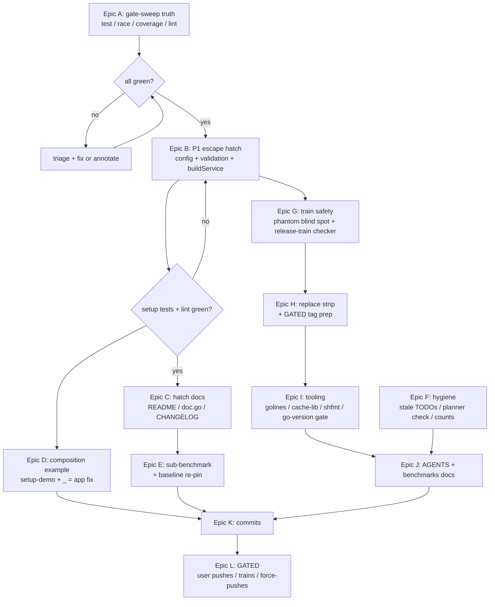

# Pareto Master Plan — cqrs-htmx post-v4.8.1

**Created:** 2026-08-29 20:59 CEST
**Baseline:** HEAD `282fcd49` (v4.8.1, clean), status report at `docs/status/2026-08-29_20-54_bench-spike-tooling-workspace-repair.md`
**Scope:** ALL open TODO_LIST items + all 50 findings from the status report, decomposed to execution size.

---

## 0. Guardrails (the no-Verschlimmbessern contract)

1. **No breaking public-API changes without an explicit user decision.** P1 is implemented as the non-breaking escape hatch (`ServiceConfig *usermgmt.ServiceConfig`); the literal-breaking embed is v5 material.
2. **Every task ends green:** build + vet (workspace AND hermetic per touched module) + the gates it claims to satisfy. Never leave a gate red without a TODO_LIST annotation explaining why.
3. **User-gated stays gated:** tag cutting, tag pushing, force-pushes, hardware — prepared, not executed.
4. **Concurrent-session discipline:** each commit is coherent and promptly made (the auto-git daemon absorbs dirty trees); doc edits re-verified to survive.
5. **Exit-code discipline:** no piped `$?` (documented PIPESTATUS trap); gates run via the flake apps or with `cmd > log 2>&1; echo $?`.

---

## 1. Pareto analysis

| Slice | Cumulative value | What it is | Why it carries the value |
|---|---|---|---|
| **1%** | **51%** | **(a)** P1 escape hatch `Config.ServiceConfig` (+tests+docs); **(b)** train-safety pair: fix the phantom-version blind spot + add the release-train completeness checker | (a) permanently ends the "add to setup too?" tax — every future ServiceConfig capability (SecurityHooks, CheckpointStore, Lockout, TokenPepper, MaxUsers, DrainTimeout, …) becomes reachable by setup consumers the day it lands upstream, with zero setup changes, ever again. (b) the totp/v4.8.0 phantom poisoned the *entire workspace graph* and shipped in a release; two gates make that class structurally impossible. |
| **4%** | **64%** | + full gate-sweep truth (test/race/coverage/lint re-run post-v4.8.1); composition-seams example (incl. `_ = app` fix); non-trivial-handler sub-benchmark + baseline re-pin; stale-TODO cleanup | Converts "gates were green on 08-16" claims into verified today-facts, makes the new seams *learnable* (example > docs), and makes the bench measure real work instead of a ping (contextualizes every future perf claim). |
| **20%** | **80%** | + AGENTS/README/docs refresh; setup dev-replace strip (now that v4.8.1 pushed); golines + shfmt into treefmt; cache-guard dedup; module-count sweep; totp/oauth2 tag *preparation* | Kills doc drift (the repo's #1 recurring tax), shrinks the dev-replace pile while the just-pushed tags allow it, and automates formatting/gate hygiene so the remaining work stops regressing. |
| **100%** | remainder | User-gated trains/pushes/force-pushes/hardware, ADRs, coverage margins, long-tail P3 | Blocked on user decisions or external repos; prepared via runbooks and checklists, not executed locally. |

---

## 2. Comprehensive plan — 30–100 min tasks (ALL todos)

Sorted by importance × impact × customer-value ÷ effort. Tier: **P0** = the 1%, **P1** = to 64%, **P2** = to 80%, **P3/GATED** = to 100%.

| # | Task (outcome) | Tier | Effort | Impact | Cust. value | Depends |
|---|---|---|---|---|---|---|
| T01 | Full gate sweep I: `test` + `test-race` across all suites; triage every failure to green or TODO-annotated | P0 | 100min | high | high | — |
| T02 | Full gate sweep II: `coverage` + `coverage-gate` + `lint` (15 modules); record numbers | P0 | 90min | high | med | T01 |
| T03 | P1: add `Config.ServiceConfig *usermgmt.ServiceConfig` + precedence validation (Service > ServiceConfig > flattened) in setup | P0 | 100min | high | high | — |
| T04 | P1: unify `buildService` store/bus sourcing onto `svc.Journal()/EventBus()`; keep AuditLog default in override mode | P0 | 60min | high | high | T03 |
| T05 | P1: tests — override path exercises a flattened-impossible capability (TokenPepper/MaxUsers); 3 conflict rejections; AuditLog default | P0 | 60min | high | high | T04 |
| T06 | Train-safety: investigate why `check-phantom-version` missed admin-demo totp v4.8.0; close the blind spot | P0 | 45min | high | high | — |
| T07 | Train-safety: `check-release-train` script + flake app (go.work modules ↔ family tags diff) | P0 | 60min | high | high | — |
| T08 | Verify sibling `metaengine/planner.go:137` break still exists; update the stale TODO item | P0 | 30min | med | med | — |
| T09 | Composition-seams example: setup-demo gains adoption path + ServiceConfig override showcase + SSEPath + Broadcaster consumer | P1 | 100min | med-high | high | T05 |
| T10 | samber-do-demo: stop discarding `*cqrshtmx.App` (`_ = app`) — wire it into startup logging; build+vet | P1 | 30min | med | med | — |
| T11 | Non-trivial-handler sub-benchmark (JSON roundtrip) in `run_appkit_test.go` + re-pin raw baseline + gate green | P1 | 60min | med | med | — |
| T12 | setup README + doc.go + root README: escape-hatch section and config-table row | P1 | 60min | med | high | T05 |
| T13 | Stale-TODO purge: resurrected toolchain item; drift-splits annotation refresh; TODO header numbers from T02 | P1 | 45min | med | med | T02 |
| T14 | Strip setup dev-replaces (`../usermgmt`, `../`, `../dashboardui`) now that v4.8.1 pushed; hermetic verify per module | P1 | 60min | med | med | — |
| T15 | AGENTS.md memory: bench-spike quick-ref row, phantom-poisoning gotcha, baseline machine policy, module count sweep | P1 | 45min | med | med | T11 |
| T16 | `golines` availability check + treefmt integration + repo-wide run + fallout triage | P2 | 45min | med | low | — |
| T17 | Extract cache-guard into `scripts/lib/go-cache-env.sh`; refactor isolation script + bench-spike to source it | P2 | 45min | low-med | low | — |
| T18 | Add shfmt/shellcheck for `scripts/*.sh` to treefmt | P2 | 45min | low-med | low | — |
| T19 | New gate: go.work `go` directive ≤ nixpkgs go version (would have caught the 1.26.6/1.26.7 mismatch pre-build) | P2 | 45min | med | med | — |
| T20 | `docs/benchmarks/` README: raw sidecar vs markdown artifact, machine-specific pinning, re-pin flow | P2 | 30min | low-med | med | T11 |
| T21 | totp/oauth2 v4.8.1: prepare exact tag commands + post-tag admin-demo bump (EXECUTION user-gated) | GATED | 45min | high | high | — |
| T22 | bench-spike in CI: write the advisory-vs-local decision into TODO/README (numbers are machine-dependent) | P2 | 30min | low | low | T11 |
| T23 | go.work.sum drift: deterministic commit if diff present | P2 | 30min | low | low | — |
| T24 | Upstream asks package: stack/v4 decouple-metaengine issue text + projectionadapter/sqliteengine tag runbook re-validation | GATED | 60min | med | med | T08 |
| T25 | datastar/go-sse architecture ADR draft (decision: design choice, not incompatibility) | P3 | 90min | med | med | — |
| T26 | Coverage margins: adminui (68.5 vs 66) + identity-model (75.5 vs 70) targeted tests | P3 | 100min | med | low | T02 |
| T27 | Deprecated-shims v5-removal bundle review (sse re-exports, security.go, ratelimit/server_timing) — checklist only | P3 | 60min | low-med | low | — |
| T28 | Go markdown link checker (goldmark) spike, keep awk as default | P3 | 100min | low | low | — |
| T29 | cqrs-lint Go-installable distribution investigation (unblocks CI gate) | P3 | 60min | med | med | — |
| T30 | `/sse` authz posture decision memo (session-gate vs stream-type filter) for user sign-off | GATED | 45min | med | high | — |
| T31 | appkit adoption fold-in checklist refresh (a–f) against current master — prep only (blocked on go-appkit push) | GATED | 45min | med | high | — |
| T32 | Force-push rewrites: v4 branch blobs + setup-demo history purge — runbook only (user executes) | GATED | 100min | low | low | — |
| T33 | Misc sweep: middleware-showcase API drift verify; `Bundle.Addr()` decision note; prewarm-script relevance; artifact fate for 2026-08-17 markdown baseline | P3 | 60min | low | low | — |

Coverage check — every open TODO_LIST item maps to: P1 collapse→T03–T05/T12; upstream tags→T24; planner break→T08; seams example→T09/T10; CI check-*→T29; toolchain item→T13 (stale purge); decisions→T30/T21; go.work.sum→T23; sub-benchmark→T11; stack decouple→T24; appkit→T31; cqrs-lint CI→T29; drift splits→T21/T24 (dissolve with train); datastar ADR→T25; golines→T16; link checker→T28; v4/history→T32; hardware→out of repo scope (noted).

---

## 3. Micro plan — max 12 min per task (ALL todos)

Same order; Epic = execution grouping. **GATED** rows are prepared, never executed.

| # | Micro task | Epic | Min | Deps |
|---|---|---|---|---|
| M01 | Kick off `nix run .#test`; monitor; capture failure list | A | 12 | — |
| M02 | Kick off `nix run .#test-race`; monitor | A | 12 | M01 |
| M03 | Run `nix run .#coverage`; collect per-module numbers | A | 12 | M01 |
| M04 | Run `nix run .#coverage-gate`; note margins | A | 12 | M03 |
| M05 | Run `nix run .#lint`; expect 15 modules × 0 issues | A | 12 | M01 |
| M06 | Triage failures → fix or TODO-annotate; loop M01–M05 until green | A | 12 | M02–M05 |
| M07 | setup/config.go: add `ServiceConfig` field + doc comment (precedence contract) | B | 12 | — |
| M08 | Generalize `validateAdoptedService` → `validateServiceSources` (Service+ServiceConfig; ServiceConfig vs flattened 10) | B | 12 | M07 |
| M09 | setup.go: `resolveServiceConfig(cfg)` (override copy; AuditLog default) | B | 12 | M07 |
| M10 | setup.go: source store/bus via `svc.Journal()/EventBus()`; retire `defaultInfrastructure` path | B | 12 | M09 |
| M11 | Test: override path with TokenPepper/MaxUsers (flattened-impossible capability proves the hatch) | B | 12 | M10 |
| M12 | Tests: Service+ServiceConfig reject; ServiceConfig+flattened reject; adopt+override reject | B | 12 | M08 |
| M13 | Test: AuditLog default present in override mode | B | 12 | M10 |
| M14 | Hermetic setup: tidy/build/vet + full setup test run | B | 12 | M11–M13 |
| M15 | Lint setup module (`golangci-lint run` hermetic) | B | 12 | M14 |
| M16 | setup/README: config-table row + "full ServiceConfig control" section | C | 12 | M14 |
| M17 | setup/doc.go: escape-hatch example snippet | C | 12 | M14 |
| M18 | root README: one-line pointer for advanced consumers | C | 12 | M16 |
| M19 | CHANGELOG [Unreleased] Added entry for the hatch | C | 12 | M14 |
| M20 | Read setup-demo main.go; map insertion points | D | 12 | M14 |
| M21 | Add ServiceConfig override showcase (MaxUsers=1 single-user demo) | D | 12 | M20 |
| M22 | Add SSEPath wiring + `bundle.Broadcaster` consumer (log hub events) | D | 12 | M20 |
| M23 | Add Config.Service adoption path variant | D | 12 | M20 |
| M24 | Build + run demo smoke; curl /health + /sse | D | 12 | M21–M23 |
| M25 | samber-do-demo: replace `_ = app` with startup use (routes/log line) | D | 12 | — |
| M26 | samber-do-demo hermetic build + vet | D | 12 | M25 |
| M27 | Read run_appkit_test.go; pick insertion point for sub-bench | E | 12 | — |
| M28 | Add `json-roundtrip` sub-benchmark (stable b.Run names) | E | 12 | M27 |
| M29 | `go vet` + `-benchtime=1x` smoke of new sub-bench | E | 12 | M28 |
| M30 | `--save-baseline` re-pin (5×2s) + gate run green | E | 12 | M29 |
| M31 | Update docs/benchmarks references to new sub-bench names | E | 12 | M30 |
| M32 | Delete resurrected toolchain TODO item (line 31) | F | 12 | — |
| M33 | Read sibling `go-cqrs-lite/metaengine/planner.go:137`; compare signature | F | 12 | — |
| M34 | Update TODO item (b) with finding (fixed? still broken?) | F | 12 | M33 |
| M35 | Refresh TODO header coverage/lint numbers from Epic A | F | 12 | M06 |
| M36 | Module-count sweep (go.work use vs docs "26") + doc fixes | F | 12 | — |
| M37 | Re-run check-docs-freshness + check-docs-links | F | 12 | M35 |
| M38 | Read check-phantom-version.sh; list its exemption rules | G | 12 | — |
| M39 | Identify blind spot that missed totp v4.8.0 (replace-exemption? scope?) | G | 12 | M38 |
| M40 | Close the blind spot (extend script or strict-gate wiring) | G | 12 | M39 |
| M41 | Write `scripts/check-release-train.sh` (go.work modules ↔ tags) | G | 12 | — |
| M42 | Flake app `check-release-train`; wire into check-modules chain; run it | G | 12 | M41 |
| M43 | setup/go.mod: drop `../usermgmt`, `../`, `../dashboardui` replaces | H | 12 | — |
| M44 | Hermetic tidy/build/vet setup after strip | H | 12 | M43 |
| M45 | Annotate removal in go.mod comment + CHANGELOG Fixed | H | 12 | M44 |
| M46 | Prepare totp/oauth2 v4.8.1 tag command list + admin-demo bump diff (GATED — do not execute) | H | 12 | — |
| M47 | golines: `nix eval nixpkgs#golines` availability; add to treefmt if present | I | 12 | — |
| M48 | `nix fmt` repo-wide; triage any golines fallout (max 3 iterations) | I | 12 | M47 |
| M49 | Create `scripts/lib/go-cache-env.sh`; source it in isolation script | I | 12 | — |
| M50 | Refactor bench-spike app to source the same snippet | I | 12 | M49 |
| M51 | treefmt: add shfmt+shellcheck programs for scripts/*.sh; run | I | 12 | — |
| M52 | Gate: go.work `go` directive ≤ nixpkgs `go.version`; wire into check-modules | I | 12 | — |
| M53 | AGENTS.md: bench-spike quick-ref row replaces raw invocation | J | 12 | M30 |
| M54 | AGENTS.md: phantom-poisoning gotcha + train-checklist rule | J | 12 | M40 |
| M55 | AGENTS.md: baseline machine-pinning policy | J | 12 | M30 |
| M56 | docs/benchmarks/README: raw vs markdown, machine pinning, re-pin flow | J | 12 | M30 |
| M57 | bench-spike CI advisory decision note (TODO + README) | J | 12 | M30 |
| M58 | TODO_LIST drift-splits refresh after M43–M44 | J | 12 | M44 |
| M59 | git status review; stage coherent batches | K | 12 | M56–M58 |
| M60 | Commit: P1 escape hatch (feat(setup): …, detailed body) | K | 12 | M59 |
| M61 | Commit: composition example + `_ = app` (feat(examples): …) | K | 12 | M59 |
| M62 | Commit: sub-benchmark + re-pinned baseline (perf(bench): …) | K | 12 | M59 |
| M63 | Commit: train-safety gates + tooling (feat(scripts)/chore(flake): …) | K | 12 | M59 |
| M64 | Commit: docs/memory updates (docs: …) | K | 12 | M59 |
| M65 | Push origin master; verify remote refs; re-check tree clean | K | 12 | M60–M64 |
| M66 | GATED: push totp/oauth2 tags; then M46 bump (awaiting user) | L | 12 | M46 |
| M67 | GATED: go-cqrs-lite projectionadapter/sqliteengine tags (user) | L | 12 | — |
| M68 | GATED: appkit fold-in a–f after go-appkit push (user) | L | 12 | — |
| M69 | GATED: force-push rewrites v4/master history (user) | L | 12 | — |
| M70 | GATED/optional: /sse authz memo; ADR-0029 datastar/go-sse; link checker; cqrs-lint distribution; coverage margins; shims review; showcase verify; Addr() note; prewarm check; artifact fate | L | 12× | — |

---

## 4. Execution graph

---

## 5. Decisions taken autonomously (defaults, reversible)

1. **P1 shape = escape hatch (B′), not embed** — the embed breaks every consumer literal; hatch delivers the 80% (capability reachability) at 0% breakage. Reversible; embed remains the v5 end-state.
2. **Baseline stays committed** with the env-guard + documented machine pinning (revisit if the user says they benchmark on multiple machines).
3. **totp/oauth2 tags prepared, not cut** — tag creation stays behind the user gate per repo convention, even though the pain is proven.
4. **Drift stage stays red** until the user's next train — it is annotated, not "fixed" by unauthorized version sweeps.
