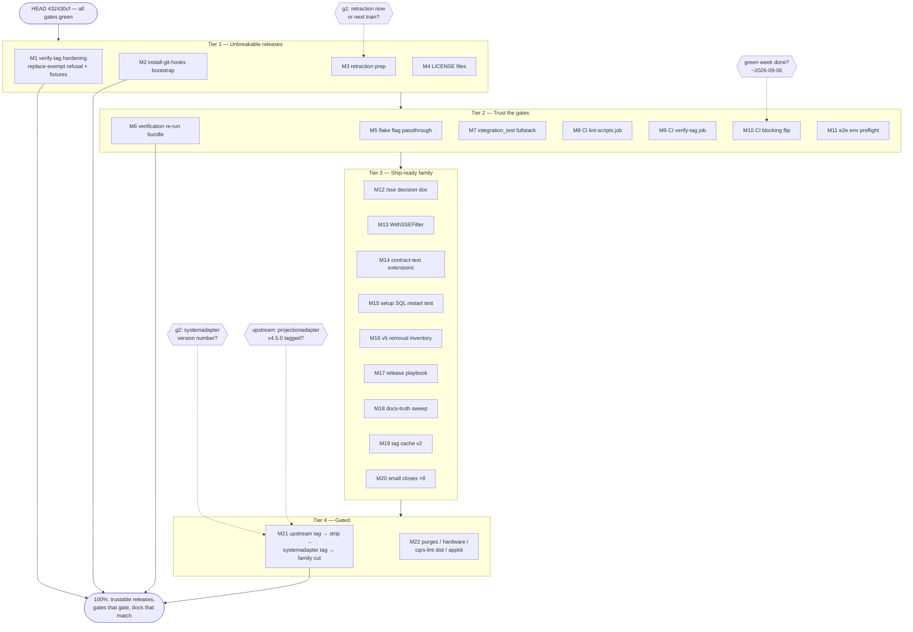

# Pareto Execution Plan — Green Family Train & Unbreakable Releases

**Created:** 2026-08-30 11:28 CEST
**Baseline:** HEAD `432430cf` = origin/master, tree clean, all runnable gates green (lint 0/15, test 18 suites, isolation 27 modules, drift --strict GREEN, release-train 0 unpublished / 1 exempt / 0 lag, docs 211 links, flake-check, fuzz, e2e 4/4).
**Source queue:** `docs/status/2026-08-30_11-24_full-todo-execution-sweep-to-green-and-tag-protocol.md` §f (50 items) + TODO_LIST.md + this session's discoveries (LICENSE gap, hook bootstrap, verify-tag replace-exempt gap).
**Rule of engagement:** VERSCHLIMMBESSER-schutz — every task below ends in a verified-green state or it isn't done. No task touches a green gate without re-running that gate.

---

## 1. The Pareto Breakdown

The "result" for this repository = **(A) releases consumers can trust, (B) gates that actually gate, (C) docs that match reality.** Everything else is long-tail.

### 1% of the work → 51% of the result: "No more poisoned releases, ever"

Two sessions in a row, the worst damage was broken published tags (setup v4.8.1/v4.8.2). The 1% is the bundle that makes that failure class structurally impossible:

| # | Item                                                                                                                                            | Why it's the 1%                                                |
| - | ----------------------------------------------------------------------------------------------------------------------------------------------- | -------------------------------------------------------------- |
| 1 | `verify-tag.sh` refuses **replace-exempted unpublished requires** (today a systemadapter tag would pass the script while being consumer-broken) | closes the last known hole in the tag guard                    |
| 2 | Fixture self-test for verify-tag (poisoned vs clean go.mod corpora)                                                                             | the guard becomes regression-tested, not habit-tested          |
| 3 | `install-git-hooks.sh` bootstrap (prewarm + large-file guard + train gate survive buildflow regeneration)                                       | the pre-commit gates currently live only in an untracked file  |
| 4 | Retraction publication recipe (setup v4.8.4 mechanics)                                                                                          | the two poisoned tags stay one command away from being retired |

≈ 3–4 h total. Kills the highest-severity failure class in repo history.

### 4% of the work → 64% of the result: the 1% + "Trust the gates"

| #  | Item                                                                                                                          | Adds                                                             |
| -- | ----------------------------------------------------------------------------------------------------------------------------- | ---------------------------------------------------------------- |
| 5  | Flake-app flag passthrough fix (`nix run .#check-release-train -- --json/--strict-lag`)                                       | the new gates are only real if invocable through the flake       |
| 6  | Verification re-run bundle at final HEAD: test-flake, test-fuzz, check-cqrs-lint, check-modules --report + runbook §7 refresh | the recorded greens predate the ExecuteRef migration             |
| 7  | integration_test fullstack against the post-sweep graph                                                                       | closes the "hermetic per-module green, integration unproven" gap |
| 8  | CI job: shellcheck + actionlint for scripts/                                                                                  | scripts are now load-bearing (gates); CI should police them      |
| 9  | CI job: verify-tag fixture tests                                                                                              | tag protocol enforced beyond my machine                          |
| 10 | CI blocking flip (release-train + `--strict-lag 0`; drift leg if stable) when the green advisory week completes (~2026-09-06) | converts a week of evidence into a permanent gate                |

### 20% of the work → 80% of the result: the 4% + "Ship-ready family + decisions documented"

Adds: LICENSE files (pkg.go.dev currently shows UNKNOWN for usermgmt/dashboardui), the `/sse` decision one-pager (spike → user decision), production `WithSSEFilter` (mechanism proven), contract-test extensions to the remaining 3 store interfaces, bundle-level SQL restart test, v5 removal inventory, release playbook guide, docs-truth sweep (AGENTS version lists, bench README numbers, runbook §0 annotations), tag-cache v2, e2e env preflight, and the eight small closes (pre-commit smoke, batch-release decision, GONOSUMCHECK, coverage re-verify, catalog smoke, samber-do SSE e2e, admin-sync spec).

### The remaining 20% → 100%

The long tail, mostly user-gated or other-repo: upstream projectionadapter v4.5.0 → last replace strip → **systemadapter first tag** → coordinated family cut; the force-push purges (v4 branch, setup-demo blob); `/mnt/buildcache` hardware; cqrs-lint Go-installable distribution; the stack/metaengine upstream ask; appkit ADR-001 fold-in; post-train status+HARVEST.

---

## 2. Medium-Granularity Plan (30–100 min tasks, ALL todos included)

| #   | Task                                                                                                                                                              | Source                    | Est | Impact   | Gate           |
| --- | ----------------------------------------------------------------------------------------------------------------------------------------------------------------- | ------------------------- | --- | -------- | -------------- |
| M1  | Tag-guard hardening: replace-exempt refusal + `--allow-replace-exempt` + fixture self-test                                                                        | f-new                     | 90  | Critical | —              |
| M2  | `install-git-hooks.sh` bootstrap + `--verify` mode + docs                                                                                                         | f-new                     | 45  | Critical | —              |
| M3  | Retraction publication prep (v4.8.4 recipe, dry-run, runbook recipe)                                                                                              | f.3/5                     | 45  | High     | exec: g1       |
| M4  | LICENSE files: usermgmt + dashboardui + repo-wide audit                                                                                                           | f-new                     | 30  | High     | —              |
| M5  | Flake passthrough: check-release-train flags via `nix run ... --`                                                                                                 | f.4-prep                  | 30  | High     | —              |
| M6  | Verification re-run bundle at HEAD (flake, fuzz, cqrs-lint, check-modules --report, runbook §7)                                                                   | f.5/6/10/31               | 90  | High     | —              |
| M7  | integration_test fullstack vs post-sweep graph                                                                                                                    | f.34                      | 60  | High     | —              |
| M8  | CI: lint-scripts job (shellcheck + actionlint)                                                                                                                    | f-new                     | 45  | Med      | —              |
| M9  | CI: verify-tag fixture job                                                                                                                                        | f.22-followup             | 30  | Med      | —              |
| M10 | CI blocking flip + `--strict-lag 0` + drift leg                                                                                                                   | f.4                       | 30  | High     | green week     |
| M11 | e2e flake env preflight (PLAYWRIGHT_BROWSERS_PATH + auto-install)                                                                                                 | f.31-followup             | 45  | Med      | —              |
| M12 | `/sse` decision one-pager for the user                                                                                                                            | f.35                      | 60  | High     | decision: user |
| M13 | `transport.WithSSEFilter` productionization                                                                                                                       | f.49-followup             | 90  | Med      | M12            |
| M14 | Contract tests: WebAuthnSessionStore / VerificationTokenStore / PendingTOTPStore                                                                                  | f.27-ext                  | 90  | Med      | —              |
| M15 | setup bundle-level SQL restart test                                                                                                                               | f.28-ext                  | 60  | Med      | —              |
| M16 | v5 removal inventory document                                                                                                                                     | f.48                      | 60  | Med      | —              |
| M17 | Release playbook guide (verify-tag flow + train checklist + poison ladder)                                                                                        | f.21-ext                  | 60  | Med      | —              |
| M18 | Docs-truth sweep: AGENTS templ-components v1.11.0 + go-cqrs-lite v4.9-era lists + bench README numbers + runbook §0 annotations                                   | f.32/40                   | 60  | Med      | —              |
| M19 | Tag cache v2: `cache_age_seconds` in --json + fetch-refresh + stale warning                                                                                       | f.11-ext                  | 45  | Low-Med  | —              |
| M20 | Small closes: pre-commit smoke, batch-release decision, GONOSUMCHECK, coverage re-verify, docs-freshness probe, catalog smoke, samber-do SSE e2e, admin-sync spec | f.20/23/24/26/30/36 + new | 90  | Med      | —              |
| M21 | Train execution: upstream projectionadapter v4.5.0 → strip last replaces → systemadapter tag → family cut → post-train HARVEST                                    | f.5/6/7/9/50              | 90+ | Critical | USER           |
| M22 | Gated long tail: purge plans, hardware decision doc, cqrs-lint dist draft, upstream issue drafts, appkit re-validation                                            | f.41–45/47                | 60  | Low      | USER           |

## 3. Fine-Granularity Plan (each ≤ 12 min, ALL todos included)

| ID    | Task                                                                                     | Part of | Min |
| ----- | ---------------------------------------------------------------------------------------- | ------- | --- |
| F1.1  | verify-tag: detect requires satisfied ONLY by a local replace → refuse with what/why/fix | M1      | 12  |
| F1.2  | Add `--allow-replace-exempt` flag + usage/help                                           | M1      | 8   |
| F1.3  | Fixture corpus: poisoned go.mods (family replace / pseudo / unpublished) + clean go.mod  | M1      | 12  |
| F1.4  | `scripts/test-verify-tag.sh`: run all guards against fixtures, assert exit codes         | M1      | 12  |
| F1.5  | shellcheck + treefmt both scripts                                                        | M1      | 5   |
| F1.6  | Runbook §6: document the new refusal + override flag                                     | M1      | 10  |
| F2.1  | Extract the 3 manual pre-commit blocks → `scripts/hooks/pre-commit.template`             | M2      | 12  |
| F2.2  | `scripts/install-git-hooks.sh`: idempotent merge into `.git/hooks/pre-commit`            | M2      | 12  |
| F2.3  | `--verify` mode: diff installed hook vs template                                         | M2      | 10  |
| F2.4  | Test on a scratch clone: install → gates fire on a scratch commit                        | M2      | 12  |
| F2.5  | AGENTS MANUAL EDIT comments → point at the installer                                     | M2      | 5   |
| F3.1  | Draft setup v4.8.4 CHANGELOG entry + release-checklist rows                              | M3      | 10  |
| F3.2  | Dry-run retraction visibility (`go list -m -retracted`)                                  | M3      | 12  |
| F3.3  | Runbook: poisoned-tag retraction publication recipe                                      | M3      | 10  |
| F4.1  | MIT LICENSE → usermgmt/                                                                  | M4      | 5   |
| F4.2  | MIT LICENSE → dashboardui/                                                               | M4      | 5   |
| F4.3  | Repo-wide LICENSE audit (which dirs lack one)                                            | M4      | 10  |
| F4.4  | Verify pkg.go.dev renders the licenses (fetch pages)                                     | M4      | 8   |
| F5.1  | Inspect check-release-train app def (arg forwarding?)                                    | M5      | 5   |
| F5.2  | Fix wrapper to forward "$@"; test --json/--strict-lag/--no-cache via nix run             | M5      | 12  |
| F5.3  | App description + docs updated                                                           | M5      | 8   |
| F6.1  | `nix run .#test-flake` at HEAD                                                           | M6      | 12  |
| F6.2  | `nix run .#test-fuzz` at HEAD                                                            | M6      | 12  |
| F6.3  | `nix run .#check-cqrs-lint`                                                              | M6      | 10  |
| F6.4  | `check-modules --report`; refresh runbook §7 table                                       | M6      | 12  |
| F6.5  | Record results in TODO_LIST header                                                       | M6      | 8   |
| F7.1  | Locate + run integration_test suite hermetically                                         | M7      | 12  |
| F7.2  | Fix any post-sweep fallout (contingency)                                                 | M7      | 40  |
| F7.3  | Record green in runbook/TODO                                                             | M7      | 8   |
| F8.1  | Add CI lint-scripts job (shellcheck scripts/*.sh + actionlint)                           | M8      | 12  |
| F8.2  | Local pre-run; fix new findings                                                          | M8      | 20  |
| F8.3  | actionlint ci.yml                                                                        | M8      | 5   |
| F9.1  | Wire test-verify-tag.sh into CI (fixtures only — no tag creation)                        | M9      | 10  |
| F9.2  | actionlint + CI-safety review                                                            | M9      | 8   |
| F10.1 | Confirm 7 consecutive green advisory runs in Actions                                     | M10     | 10  |
| F10.2 | Remove `\|\| true`; add `--strict-lag 0`                                                 | M10     | 10  |
| F10.3 | Flip drift advisory → blocking if ls-remote stable                                       | M10     | 10  |
| F10.4 | Update TODO_LIST + AGENTS CI posture                                                     | M10     | 8   |
| F11.1 | e2e app: default PLAYWRIGHT_BROWSERS_PATH=/tmp/pw-browsers                               | M11     | 10  |
| F11.2 | Auto-install chromium when missing                                                       | M11     | 10  |
| F11.3 | Full `nix run .#e2e` green                                                               | M11     | 12  |
| F12.1 | Draft decision one-pager (options + spike evidence + recommendation)                     | M12     | 30  |
| F12.2 | Link from TODO_LIST decision item + sse guide                                            | M12     | 10  |
| F13.1 | `WithSSEFilter(pred)` option in transport/serve.go (SubscribeFilter + ReplayFiltered)    | M13     | 40  |
| F13.2 | Tests: filtered live + filtered backfill via httptest                                    | M13     | 30  |
| F13.3 | sse-and-datastar.md section                                                              | M13     | 15  |
| F14.1 | WebAuthnSessionStore counting stub + ceremony test                                       | M14     | 30  |
| F14.2 | VerificationTokenStore contract test (verification flow)                                 | M14     | 25  |
| F14.3 | PendingTOTPStore contract test (TOTP enable flow)                                        | M14     | 25  |
| F15.1 | Bundle-level restart test: setup.New(ServiceConfig{CheckpointStore, ReadModelDB})        | M15     | 30  |
| F15.2 | Assert session + user survive via hydration                                              | M15     | 15  |
| F16.1 | Grep-collect all `// Deprecated` + SA1019 nolint sites                                   | M16     | 15  |
| F16.2 | Write the v5 removal inventory (removal criteria per item)                               | M16     | 30  |
| F16.3 | Link from ADR-0047 + AGENTS                                                              | M16     | 8   |
| F17.1 | Draft docs/guides/release-playbook.md                                                    | M17     | 40  |
| F17.2 | Cross-link runbook + README                                                              | M17     | 10  |
| F18.1 | AGENTS templ-components section → v1.11.0 family state                                   | M18     | 12  |
| F18.2 | AGENTS go-cqrs-lite version lists → v4.9-era                                             | M18     | 12  |
| F18.3 | bench README: fresh post-repin numbers                                                   | M18     | 10  |
| F18.4 | Runbook §0: annotate rows as historical                                                  | M18     | 10  |
| F19.1 | --json adds cache_age_seconds                                                            | M19     | 12  |
| F19.2 | --refresh-cache via git fetch --tags + stale warning                                     | M19     | 15  |
| F20.1 | Pre-commit smoke: scratch module with unpublished require → assert gate blocks           | M20     | 12  |
| F20.2 | batch-release.sh decision: move to attic/ (delete from active scripts)                   | M20     | 10  |
| F20.3 | GONOSUMCHECK necessity check (public repos → sum.golang.org)                             | M20     | 12  |
| F20.4 | coverage-gate re-run                                                                     | M20     | 12  |
| F20.5 | docs-freshness: stale-date probe + verify status/ parsing                                | M20     | 12  |
| F20.6 | catalog-demo build + visual smoke                                                        | M20     | 10  |
| F20.7 | samber-do-demo: SSE events e2e extension                                                 | M20     | 12  |
| F20.8 | e2e: admin-panel sync-indicator spec                                                     | M20     | 12  |
| F21.1 | projectionadapter v4.5.0: prepare/ask upstream (other repo)                              | M21     | 12  |
| F21.2 | Strip last replaces (systemadapter + system-demo), hermetic verify                       | M21     | 12  |
| F21.3 | systemadapter tag via verify-tag --push                                                  | M21     | 10  |
| F21.4 | Family cross-ref alignment sweep                                                         | M21     | 12  |
| F21.5 | Coordinated tag set via verify-tag per module                                            | M21     | 12  |
| F21.6 | Post-train check-modules + status/HARVEST session                                        | M21     | 12  |
| F22.1 | v4 branch purge plan doc                                                                 | M22     | 12  |
| F22.2 | setup-demo blob purge plan doc                                                           | M22     | 12  |
| F22.3 | Hardware decision doc (options + recommendation)                                         | M22     | 12  |
| F22.4 | cqrs-lint Go-installable wrapper draft                                                   | M22     | 12  |
| F22.5 | Upstream stack/metaengine issue draft                                                    | M22     | 12  |
| F22.6 | appkit fold-in checklist re-validation vs current master                                 | M22     | 12  |

Coverage check: every item from report §f 1–50 + TODO_LIST + session discoveries maps to exactly one fine task (or an explicit gate note in §5). F-tasks total ≈ 82; the "wait"-dominated ones (F6.1/F6.2/F11.3) run in background while other tiers execute.

## 4. Execution Graph

## 5. Gates, Preconditions, and Verschlimmbesserung-Guard

**User-gated (never execute without explicit approval):** M21 (other-repo tag + train + version number), M22 (force-push class), M10 (calendar-gated: green week ~2026-09-06), M3-execution (g1), M13-execution (post-M12 decision). Everything in Tiers 1–3 is unblocked and in-repo.

**Per-task verification protocol (anti-Verschlimmbesser):**

1. Every task ends with its named gate green (lint/test/e2e/check-modules --report as applicable).
2. No task edits a green gate's config without re-running that gate twice (once local, once via the flake app).
3. The three manual pre-commit blocks are behavioral contracts: M2's installer must byte-match the current hook before any refactor of it lands.
4. `verify-tag.sh` changes must keep the real-poisoned-tree regression (setup/v4.8.1 content) failing — the fixture corpus includes it.
5. Docs edits (M18) are read-verify-write against the CURRENT file (the 2026-08-31 date stamping mistake this week is the cautionary tale — wrong dates were committed and needed a correction commit).

**Open decisions blocking execution (from report §g):** g1 (retraction timing) gates M3-execution; g2 (systemadapter version) gates M21.3; repo visibility already resolved (public).

**Parallelism:** F6.1/F6.2/F11.3 are wait-dominated — background them while executing M8/M9/M12. M14/M15/M16/M17 are independent files — safe to interleave.
