# Pareto Plan Round 2 — Trust Gates, Green Train, Full Backlog (2026-09-09)

**Prepared:** 2026-09-09 20:15 CEST
**Input:** `TODO_LIST.md` (P1-P3, post 2026-09-09 docs-health harvest), status report `docs/status/2026-09-09_20-09_docs-health-full-sweep-56-archived.md` §f (50 items), ROADMAP Open Questions.
**Definition of "result":** a repo that is (1) **trustworthy** — gates enforce, no known wrong-result bugs, docs tell the truth; (2) **releasable** — verified on the 2026-09-08 trains, aligned, tagged; (3) **maintainable** — debt visible, routed, and shrinking.

**Guardrails (Verschlimmbesserung protection):**

- Never revert work not authored by this plan (concurrent sessions + daemon are active).
- No pushed-history rewrites; tags only via `scripts/verify-tag.sh`; never re-pin bench under load.
- Every phase ends with the affected gates run (`go build/vet/test`, `check-modules`, links/freshness for doc phases).
- User-gated decisions are PREPARED, never executed unilaterally (force-push class, hardware spend, upstream comms, product calls).

---

## 1. Pareto Breakdown

### The 1% that delivers 51% — "Stop the bleeding, fix the lie"

≈ 2h of a ~130h backlog (~1.5%)

| Task                                                                                        | Why it is the 1%                                                                                                                                                                                                                                                                                             |
| ------------------------------------------------------------------------------------------- | ------------------------------------------------------------------------------------------------------------------------------------------------------------------------------------------------------------------------------------------------------------------------------------------------------------ |
| **Flip CI release-train + version-drift gates to BLOCKING** (drop `\|\| true`, ci.yml:584+) | Months of gate-building (verify-tag, train tooling, drift scan) are currently ADVISORY. This one edit converts all of it into actual enforcement. Every future phantom-require/poison-tag incident becomes structurally impossible instead of "caught later by hand". Highest leverage-per-line in the repo. |
| **Fix the `ExternalAccountLink` unlink fold bug** (`systemadapter/declarations.go:426-470`) | The only KNOWN wrong-result bug: unlinking an external account can make `FindUserByExternalAccount` return a zero-value/wrong user. For an identity library, wrong-user reads are the worst failure class. Small, testable, self-contained.                                                                  |

### The 4% that delivers 64% — "Prove the 2026-09-09 bump, then ship it"

≈ +4h (cumulative ~6h ≈ 4.5%)

| Task                                                                                                                                                                                      | Why it extends to 64%                                                                                                                                             |
| ----------------------------------------------------------------------------------------------------------------------------------------------------------------------------------------- | ----------------------------------------------------------------------------------------------------------------------------------------------------------------- |
| Post-bump verification: `check-cqrs-lint` (+V006 suppression review), `coverage-gate` full + living-doc refresh, `test-race`, `test-fuzz`/`test-flake`, e2e, `bench-spike` (idle-guarded) | The 2026-09-09 bump swapped dispatchers/stores INSIDE benched and served paths; the deferred suites are the difference between "probably fine" and "proven fine". |
| Next-train alignment sweep (~122 advisory entries: templ-components v1.16.0, storage v4.9.0, system v4.7.0, …) + full gate ladder + CHANGELOG straddle cleanup                            | Same mechanical recipe as the proven 09-09 sweep; closes the "current with the world" gap and produces the tag-worthy state.                                      |

### The 20% that delivers 80% — "Make excellence automatic"

≈ +14h (cumulative ~20h ≈ 15-20%)

| Cluster                          | Contents                                                                                                                                                                                 |
| -------------------------------- | ---------------------------------------------------------------------------------------------------------------------------------------------------------------------------------------- |
| Tooling that prevents recurrence | dependency-bump gate bundle (one command), docs-freshness extension (replace-state + "uniform at vX" claims), drift replace-exemption self-test + unification                            |
| Security posture                 | setup `Config.CSRF` knob + tokenless-mutation rejection test + Secure=false WARN fix                                                                                                     |
| Release hygiene                  | CHANGELOG straddle cleanup, train cut via `verify-tag.sh`, pkg.go.dev check                                                                                                              |
| Docs truth durability            | `docs/status/README.md` rewrite (counts/conventions/new dirs), HTML-corpus policy, `nix fmt` reflow, 3-annotation spot-audit, ROADMAP `Raw()` wording, FEATURES health/auditlog sections |

### The remaining 20% (to 100%)

V007 v5-migration (3 clusters), ProjectionLayer retirement, SSE hardening backlog, micro-debt bundle, examples (actor demo, async-startup-demo, smoke tests), appkit ADR-001 fold-in (b)-(f), systemadapter first tag (upstream-blocked), user-gated decisions (purges, hardware, cqrs-lint distribution, /sse shape, Tier-4), upstream asks, ROADMAP OQ resolutions, `DOMAIN_LANGUAGE.md` freshness.

---

## 2. Comprehensive Plan — 30-100 min tasks (ALL todos, importance-sorted)

| #   | Task                                                                                                                                                | Tier | Effort | Impact      | Why / customer value                                                          |
| --- | --------------------------------------------------------------------------------------------------------------------------------------------------- | ---- | ------ | ----------- | ----------------------------------------------------------------------------- |
| P01 | Flip CI gates to blocking (release-train `--strict-lag 0`, drift `--strict`; drop both `\|\| true`)                                                 | 1%   | 30m    | 🔴 Critical | Converts gate investment into enforcement; blocks phantom requires at PR time |
| P02 | Fix `ExternalAccountLink` unlink fold + regression test (`declarations.go:426-470`)                                                                 | 1%   | 90m    | 🔴 Critical | Correctness: no wrong-user reads after unlink                                 |
| P03 | `check-cqrs-lint` strict run + V006/stale-suppression triage (root go.mod rationale predates record v4.5.0)                                         | 4%   | 45m    | 🟠 High     | Lint truth post-bump; suppression hygiene                                     |
| P04 | `coverage-gate` full run → refresh AGENTS/TODO/ROADMAP tables with fresh numbers+date                                                               | 4%   | 45m    | 🟠 High     | Docs cite verified numbers, not 11-day-old ones                               |
| P05 | `test-race` full suite + triage                                                                                                                     | 4%   | 60m    | 🟠 High     | Bump swapped concurrency-adjacent dispatchers/stores                          |
| P06 | `test-fuzz` + `test-flake` runs                                                                                                                     | 4%   | 60m    | 🟠 High     | Completes the deferred verification bundle                                    |
| P07 | e2e Playwright run (`PLAYWRIGHT_BROWSERS_PATH=/tmp/pw-browsers`)                                                                                    | 4%   | 60m    | 🟠 High     | Fullstack UI proof against the bumped stack                                   |
| P08 | `bench-spike` idle-guarded run; re-pin per policy only if appkit-service alone exceeds gate                                                         | 4%   | 45m    | 🟠 High     | The bump touched benched serve paths; P1 TODO                                 |
| P09 | Next-train alignment sweep (~122 entries) — same recipe as 09-09 bump, per-module tidy/build/vet                                                    | 4%   | 90m    | 🟠 High     | "Current with the world"; templ-components v1.16.0 headline                   |
| P10 | Post-sweep full gate ladder (`build/test/lint/check-modules`) + CHANGELOG straddle cleanup                                                          | 4%   | 60m    | 🟠 High     | Train-ready state; CHANGELOG honesty                                          |
| P11 | Prepare train cut: `verify-tag.sh --dry-run` rehearsal + `check-release-train --refresh-cache`; cut/push on approval                                | 4%   | 30m    | 🟠 High     | Turns verified state into a release (push = user gate)                        |
| P12 | `scripts/bump-verify.sh` — one-command bump gate bundle (build, test, vet, lint, check-modules, check-cqrs-lint, bench sanity) + self-test          | 20%  | 60m    | 🟠 High     | Closes the ladder hole that bit the 09-09 bump, permanently                   |
| P13 | Extend `docs-freshness` gate: catch replace-state claims + "uniform at vX" assertions                                                               | 20%  | 45m    | 🟡 Med      | Both classes were provably wrong while the gate stayed green                  |
| P14 | `check-version-drift.sh` replace-exemption self-test (fixtures with/without replace)                                                                | 20%  | 45m    | 🟡 Med      | The 09-09 gate change is untested (repo precedent: test-install-git-hooks)    |
| P15 | Unify tag-check/drift-check replace exemption into ONE shared helper                                                                                | 20%  | 45m    | 🟡 Med      | Kills the split brain at the root                                             |
| P16 | setup `Config.CSRF` knob (or documented posture) + tokenless-POST rejection test + fix Secure=false WARN (`bundle.go:112`)                          | 20%  | 90m    | 🟠 High     | Recurring security finding since 2026-08-14                                   |
| P17 | Rewrite `docs/status/README.md`: real file count (~350+), date range, annotation-block convention, new `archived/` dirs                             | 20%  | 60m    | 🟡 Med      | Directory meta-doc is 2 months stale and contradicts the tree                 |
| P18 | HTML-corpus policy: document generated-artifact exemption in status README (or schedule sweep — decision)                                           | 20%  | 30m    | 🟡 Med      | Ends the ambiguity over ~55 files                                             |
| P19 | `nix fmt` over all 2026-09-09-edited markdown; commit any dprint/prettier reflow                                                                    | 20%  | 30m    | 🟡 Med      | Annotated table rows are long; formatter agreement must be verified           |
| P20 | Spot-audit 3 random archived annotations against their cited evidence; fix wrong verdicts                                                           | 20%  | 30m    | 🟡 Med      | Self-verify the annotator (trust the corpus)                                  |
| P21 | ROADMAP DataStar/adoption rows: deprecated `Raw()` wording → `Hub()`; verify FEATURES has health/v4 + auditlog/v4 sections (add if missing)         | 20%  | 30m    | 🟡 Med      | No doc should teach the deprecated API as current                             |
| P22 | setup/README: Troubleshooting section + security/TLS-termination note                                                                               | 20%  | 60m    | 🟡 Med      | Recurring docs-debt item (e,f)                                                |
| P23 | Write `docs/guides/actor-and-audit-trail.md` (requested 2026-08-13 ×2)                                                                              | 20%  | 60m    | 🟡 Med      | The WithActor story is undocumented; consumer value                           |
| P24 | Mount `health.NewProbe` + `auditlog.WithAuditLog` in an example (setup-demo or samber-do-demo)                                                      | 20%  | 60m    | 🟡 Med      | Bridge modules ship with zero end-to-end wiring proof                         |
| P25 | Add auditlog viewer next to fullstack UI in `integration_test`                                                                                      | 20%  | 60m    | 🟡 Med      | Cross-module proof for the auditlog bridge                                    |
| P26 | V007 cluster (2) spike: `stack.Bundle` → `system.New` composition (branch or ADR note if deferred)                                                  | 80%  | 90m    | 🟡 Med      | v5-prep; overlaps systemadapter path                                          |
| P27 | SSE backlog: SSEMaxReplay validation/clamp in setup config validate() + one transport serve-test gap (ordering)                                     | 80%  | 90m    | 🟡 Med      | Hardens the shared SSE endpoint                                               |
| P28 | ProjectionLayer `// Deprecated:` marker + guide notes (retirement prep)                                                                             | 80%  | 60m    | 🟡 Med      | v5-removal bundle progress                                                    |
| P29 | Micro-debt: `http.go:315` write check + `service_oauth2_errorcontext_test.go:55` errors.As migration + `slowJournal` shared testutil                | 80%  | 60m    | 🟡 Low      | Three recurring nits closed at once                                           |
| P30 | Micro-debt: loginpage favicon fallback + no-auth copy; `datastar-demo` rebrand-or-remove decision note                                              | 80%  | 60m    | 🟡 Low      | UX polish + a parked decision resolved                                        |
| P31 | examples: basic actor-metadata demo + `async-startup-demo/` skeleton                                                                                | 80%  | 60m    | 🟡 Low      | Two long-requested demos exist                                                |
| P32 | Examples smoke tests: `basic`, `datastar-demo` (`*_test.go`)                                                                                        | 80%  | 45m    | 🟡 Low      | Examples currently have zero tests                                            |
| P33 | Upstream asks: finalize + stage the four drafts (cqrs-upgrade multi-module, projectionadapter ping, stack decouple, postgres retraction) for filing | 80%  | 60m    | 🟡 Med      | Unblocks systemadapter tag track (filing = user comms gate)                   |

**User-gated decision track (not executable without you):** /sse endpoint shape · Tier-4 DataStar go/park · v4-branch purge · setup-demo blob purge · buildcache hardware · cqrs-lint Go distribution · train push approval · systemadapter first-version number · `setup.NewFromSystem` build-or-reject · Huma recipes. One-pagers exist for all of these.

---

## 3. Micro Plan — ≤12 min steps (ALL todos)

| ID   | Micro-task (≤12 min)                                                                                                                                                                                            | From    |
| ---- | --------------------------------------------------------------------------------------------------------------------------------------------------------------------------------------------------------------- | ------- |
| M01  | Run `check-release-train.sh --refresh-cache` locally; confirm exit 0 + 0 unpublished                                                                                                                            | P01     |
| M02  | Edit ci.yml: release-train step → drop `\|\| true`, add `--strict-lag 0`                                                                                                                                        | P01     |
| M03  | Edit ci.yml: version-drift step → drop `\|\| true` (script already has `--strict` leg); actionlint/yaml sanity                                                                                                  | P01     |
| M04  | Commit P01 (detailed msg); push; watch the CI run to green                                                                                                                                                      | P01     |
| M05  | Read `updateExternalAccountUnlinked` fold + metaengine fold semantics; confirm bug shape                                                                                                                        | P02     |
| M06  | Write failing regression test: unlink → `FindUserByExternalAccount` must not return stale/zero entry                                                                                                            | P02     |
| M07  | Implement proper remove-from-slice (or delete) fold; keep identity-model payloads untouched                                                                                                                     | P02     |
| M08  | `go test ./systemadapter/... -race -count=1` green; equivalence test still green                                                                                                                                | P02     |
| M09  | CHANGELOG entry for the bug fix; commit P02                                                                                                                                                                     | P02     |
| M10  | Run `nix run .#check-cqrs-lint` (strict); capture findings                                                                                                                                                      | P03     |
| M11  | Triage root go.mod V006 suppression vs record v4.5.0; update or remove justification                                                                                                                            | P03     |
| M12  | Act on any stale-suppression warnings; re-run gate to 0                                                                                                                                                         | P03     |
| M13  | Run `nix run .#coverage-gate`; capture full 15-module table to /tmp                                                                                                                                             | P04     |
| M14  | Update AGENTS/TODO_LIST/ROADMAP coverage rows with new numbers + today's date                                                                                                                                   | P04     |
| M15  | Commit P04                                                                                                                                                                                                      | P04     |
| M16  | Run `nix run .#test-race`; capture failures if any                                                                                                                                                              | P05     |
| M17  | Triage/fix race findings (or file TODO entries with evidence if environmental)                                                                                                                                  | P05     |
| M18  | Commit race fixes                                                                                                                                                                                               | P05     |
| M19  | Run `nix run .#test-fuzz`                                                                                                                                                                                       | P06     |
| M20  | Run `nix run .#test-flake` (3× loop)                                                                                                                                                                            | P06     |
| M21  | Triage any fuzz/flake findings; commit fixes or file evidence-backed TODOs                                                                                                                                      | P06     |
| M22  | Ensure `PLAYWRIGHT_BROWSERS_PATH=/tmp/pw-browsers` + chromium installed                                                                                                                                         | P07     |
| M23  | Run `nix run .#e2e`; capture 4/4 result                                                                                                                                                                         | P07     |
| M24  | Triage e2e failures; commit fixes                                                                                                                                                                               | P07     |
| M25  | Check load < BENCH_MAX_LOAD; run `nix run .#bench-spike`                                                                                                                                                        | P08     |
| M26  | Compare medians vs baseline; decide re-pin per policy (never under load)                                                                                                                                        | P08     |
| M27  | If re-pinned: commit new `docs/benchmarks/setup-baseline.raw.txt` in the same change                                                                                                                            | P08     |
| M28  | Snapshot current pins (pre-sweep baseline via git worktree)                                                                                                                                                     | P09     |
| M29  | Sweep templ-components family → v1.16.0 (all consumers); tidy/build/vet per module                                                                                                                              | P09     |
| M30  | Sweep go-cqrs-lite minors (decider, stack, storage, watermill, kv, listing, scheduling, system, middleware, scenario, catalog, encryption, signing, prometheus, commandlifecycle, sqliteengine); tidy/build/vet | P09     |
| M31  | Run drift scan + release-train; fix any new findings                                                                                                                                                            | P09     |
| M32  | Commit sweep (grouped: family trains)                                                                                                                                                                           | P09     |
| M33  | Run `nix run .#build` (26 modules hermetic)                                                                                                                                                                     | P10     |
| M34  | Run `nix run .#test` + `nix run .#lint`                                                                                                                                                                         | P10     |
| M35  | Run `nix run .#check-modules --report` (8 stages)                                                                                                                                                               | P10     |
| M36  | CHANGELOG straddle cleanup: move `[Unreleased]` DataStar bullets under version headings; commit                                                                                                                 | P10     |
| M37  | `verify-tag.sh --dry-run` rehearsal for train candidates; capture output                                                                                                                                        | P11     |
| M38  | `check-release-train --refresh-cache` final; prepare tag list + order                                                                                                                                           | P11     |
| M39  | ASK USER: cut+push the train (gate: explicit approval); on yes → execute per runbook                                                                                                                            | P11     |
| M40  | Write `scripts/bump-verify.sh` skeleton (build, vet, test, lint, check-modules)                                                                                                                                 | P12     |
| M41  | Add check-cqrs-lint + bench-sanity steps with load guard                                                                                                                                                        | P12     |
| M42  | Self-test the script on the current tree; shellcheck + treefmt                                                                                                                                                  | P12     |
| M43  | Wire into docs (AGENTS gotcha row) + commit                                                                                                                                                                     | P12     |
| M44  | Add replace-state claim pattern to docs-freshness checker + test corpus                                                                                                                                         | P13     |
| M45  | Add "uniform at vX must carry upstream-latest" pattern + test corpus                                                                                                                                            | P13     |
| M46  | Run gate against current docs; fix flagged claims; commit                                                                                                                                                       | P13     |
| M47  | Create fixtures: go.mod with replace-satisfied require + without                                                                                                                                                | P14     |
| M48  | Assert skip/enforce behavior both ways in a new `test-check-version-drift.sh`                                                                                                                                   | P14     |
| M49  | Wire test into CI + commit                                                                                                                                                                                      | P14     |
| M50  | Extract shared replace-exemption helper function                                                                                                                                                                | P15     |
| M51  | Point tag-check and drift-check at the helper; delete duplicated logic                                                                                                                                          | P15     |
| M52  | Re-run both gates + new self-test; commit                                                                                                                                                                       | P15     |
| M53  | Read setup CSRF current posture (bundle.go:112, mount.go) + decide knob shape                                                                                                                                   | P16     |
| M54  | Add `Config.CSRF` field + validation + docs row in README                                                                                                                                                       | P16     |
| M55  | Write tokenless-mutation rejection test (403 path)                                                                                                                                                              | P16     |
| M56  | Fix Secure=false WARN path; run setup tests; commit                                                                                                                                                             | P16     |
| M57  | Count real files per docs dir (`find`); draft new README content                                                                                                                                                | P17     |
| M58  | Rewrite docs/status/README.md (count, range, annotation convention, new dirs)                                                                                                                                   | P17     |
| M59  | Commit P17                                                                                                                                                                                                      | P17     |
| M60  | Add HTML-corpus exemption note (or sweep plan) to status README; commit                                                                                                                                         | P18     |
| M61  | Run `nix fmt`; list reflowed markdown                                                                                                                                                                           | P19     |
| M62  | Review reflow diffs for annotation-block damage; commit                                                                                                                                                         | P19     |
| M63  | Pick 3 random archived annotated files; re-verify 3 cited evidence items each                                                                                                                                   | P20     |
| M64  | Fix any wrong verdicts found; note audit result in commit                                                                                                                                                       | P20     |
| M65  | ROADMAP: switch DataStar/adoption done-rows to `Hub()` wording                                                                                                                                                  | P21     |
| M66  | Check FEATURES for health/v4 + auditlog/v4 sections; add if missing (verified vs code)                                                                                                                          | P21     |
| M67  | Commit P21                                                                                                                                                                                                      | P21     |
| M68  | Draft setup/README Troubleshooting section (top 5 failure modes from reports)                                                                                                                                   | P22     |
| M69  | Add security/TLS-termination note; commit                                                                                                                                                                       | P22     |
| M70  | Outline actor-and-audit-trail guide (WithActor, ActorID kinds, EventOptionsFromContext, Command/Query options)                                                                                                  | P23     |
| M71  | Write guide body + cross-links from AGENTS/docs index; links gate                                                                                                                                               | P23     |
| M72  | Commit guide                                                                                                                                                                                                    | P23     |
| M73  | Pick example target (setup-demo vs samber-do-demo); wire `health.NewProbe`                                                                                                                                      | P24     |
| M74  | Wire `auditlog.WithAuditLog` + viewer mount; run example tests                                                                                                                                                  | P24     |
| M75  | Commit example wiring                                                                                                                                                                                           | P24     |
| M76  | Add auditlog viewer to integration_test fullstack UI test; run suite                                                                                                                                            | P25     |
| M77  | Commit integration test                                                                                                                                                                                         | P25     |
| M78  | Create v007/system-new spike branch; attempt Bundle→system.New for one aggregate                                                                                                                                | P26     |
| M79  | Record findings (feasible/pattern/effort) in ADR note or branch README; do NOT merge unvalidated                                                                                                                | P26     |
| M80  | Commit spike to branch (master untouched)                                                                                                                                                                       | P26     |
| M81  | Add SSEMaxReplay validation/clamp to setup config validate() + test                                                                                                                                             | P27     |
| M82  | Add `TestServeDomainEvents_ReplayBeforeSubscribe_Ordering` to transport tests                                                                                                                                   | P27     |
| M83  | Run transport + setup tests; commit                                                                                                                                                                             | P27     |
| M84  | Add `// Deprecated:` to `NewProjectionLayer` + deprecation notice text                                                                                                                                          | P28     |
| M85  | Note retirement path in v5-removal-inventory; build green; commit                                                                                                                                               | P28     |
| M86  | Fix `http.go:315` ignored write (check + error path)                                                                                                                                                            | P29     |
| M87  | Migrate `service_oauth2_errorcontext_test.go:55` to errorfamily idioms                                                                                                                                          | P29     |
| M88  | Extract `slowJournal` to shared testutil; update the 2 call sites                                                                                                                                               | P29     |
| M89  | Run usermgmt + integration_test tests; commit                                                                                                                                                                   | P29     |
| M90  | loginpage: printable-rune fallback for favicon (or document limitation)                                                                                                                                         | P30     |
| M91  | loginpage: rephrase no-auth message; add datastar-demo decision note to ROADMAP residual; commit                                                                                                                | P30     |
| M92  | examples/basic: add actor-metadata demo handler + README note                                                                                                                                                   | P31     |
| M93  | Scaffold `examples/async-startup-demo/` (go.mod + main.go skeleton); go.work entry                                                                                                                              | P31     |
| M94  | Build both examples; commit                                                                                                                                                                                     | P31     |
| M95  | Write `examples/basic/basic_test.go` smoke (GET / returns 200)                                                                                                                                                  | P32     |
| M96  | Write `examples/datastar-demo` smoke; run both; commit                                                                                                                                                          | P32     |
| M97  | Polish the 4 upstream issue drafts (repro steps, versions, ask)                                                                                                                                                 | P33     |
| M98  | Stage drafts in `docs/planning/2026-08-30_upstream-issue-drafts.md` updates; commit                                                                                                                             | P33     |
| M99  | ASK USER: file the upstream issues + approve train push (comms gate)                                                                                                                                            | P33/P11 |
| M100 | Final sweep: `git status` clean, links gate, freshness gate, build — report results                                                                                                                             | all     |

---

## 4. Execution Graph

```mermaid
flowchart TD
    subgraph P0["Phase 0 — the 1% → 51%: Trust & Correctness"]
        P01["P01 CI gates → blocking (30m)"]
        P02["P02 ExternalAccountLink bug fix (90m)"]
    end
    subgraph P1["Phase 1 — the 4% → 64%: Prove & Ship the Train"]
        P03["P03 cqrs-lint strict (45m)"]
        P04["P04 coverage-gate + docs refresh (45m)"]
        P05["P05 race (60m)"]
        P06["P06 fuzz+flake (60m)"]
        P07["P07 e2e (60m)"]
        P08["P08 bench-spike idle (45m)"]
        P09["P09 next-train sweep (90m)"]
        P10["P10 gate ladder + CHANGELOG (60m)"]
        P11["P11 train rehearsal → ASK → cut (30m)"]
    end
    subgraph P2["Phase 2 — the 20% → 80%: Automatic Excellence"]
        P12["P12 bump-verify bundle (60m)"]
        P13["P13 docs-freshness ext (45m)"]
        P14["P14 drift self-test (45m)"]
        P15["P15 exemption unification (45m)"]
        P16["P16 setup CSRF knob+test (90m)"]
    end
    subgraph P3["Phase 3 — Docs follow-through"]
        P17["P17 status README rewrite (60m)"]
        P18["P18 HTML policy (30m)"]
        P19["P19 nix fmt reflow (30m)"]
        P20["P20 annotation spot-audit (30m)"]
        P21["P21 Raw() wording + FEATURES verify (30m)"]
        P22["P22 setup README notes (60m)"]
        P23["P23 actor guide (60m)"]
        P24["P24 health/auditlog example (60m)"]
        P25["P25 auditlog in fullstack test (60m)"]
    end
    subgraph P4["Phase 4 — the remaining 20%: Debt & Features"]
        P26["P26 V007 spike (90m)"]
        P27["P27 SSE hardening (90m)"]
        P28["P28 ProjectionLayer deprecate (60m)"]
        P29["P29 micro-debt code (60m)"]
        P30["P30 loginpage polish (60m)"]
        P31["P31 examples demos (60m)"]
        P32["P32 example smoke tests (45m)"]
        P33["P33 upstream drafts final (60m)"]
    end
    GATED["User-gated: /sse shape · Tier-4 · purges · hardware · cqrs-lint dist · train push · sysadapter version · NewFromSystem · Huma"]

    P01 --> CI["CI enforces 🎉"]
    P02 --> CORRECT["No known wrong-result bugs"]
    P03 --> VER["bump verified"]
    P04 --> VER
    P05 --> VER
    P06 --> VER
    P07 --> VER
    P08 --> VER
    P09 --> P10 --> P11 --> GATED
    P12 --> TOOL["prevention automatic"]
    P13 --> TOOL
    P14 --> TOOL
    P15 --> TOOL
    P16 --> SEC["security posture closed"]
    P17 --> DOCS["docs durable"]
    P18 --> DOCS
    P19 --> DOCS
    P20 --> DOCS
    P21 --> DOCS
    P22 --> DOCS
    P23 --> DOCS
    P24 --> DOCS
    P25 --> DOCS
    P26 --> TAIL["80% → 100%"]
    P27 --> TAIL
    P28 --> TAIL
    P29 --> TAIL
    P30 --> TAIL
    P31 --> TAIL
    P32 --> TAIL
    P33 --> GATED
```

**Scheduling logic:** P01+P02 first (the 1%). P03-P08 run while CI watch is passive (parallelizable). P09-P11 only after P03-P08 verdicts (train must be cut from a PROVEN state). P12-P16 are independent of the train and can fill CI-wait time. Phase 3 fills doc-shaped time; Phase 4 is the backlog drain. Nothing in Phase 4 blocks the train.

---

## 5. What could go wrong (pre-mortem)

| Risk                                                                                         | Mitigation                                                                                              |
| -------------------------------------------------------------------------------------------- | ------------------------------------------------------------------------------------------------------- |
| Sweep (P09) surfaces breakage in the 2 replace-carrying modules (systemadapter, system-demo) | Same repair as 09-09: tidy against the replaced sibling; hermetic verify per module                     |
| CI flip (P01) goes red on a runner-only quirk                                                | The script has offline exit 4 = warn; revert is a 2-line ci.yml edit — flip is intentionally reversible |
| bench-spike (P08) fails gate on a noisy machine                                              | BENCH_MAX_LOAD guard + per-bench thresholds already exist; never re-pin under load (documented policy)  |
| CSRF knob (P16) changes default behavior                                                     | Default MUST remain today's behavior (library principle: never enforce defaults); knob is opt-in        |
| `nix fmt` (P19) reflows annotation blocks into unreadability                                 | Review diffs before committing; annotation blocks were written as plain blockquotes (formatter-safe)    |
| Daemon absorbs plan/commits mid-flight                                                       | Commit the plan file IMMEDIATELY after writing (this session's own §d1 lesson)                          |
