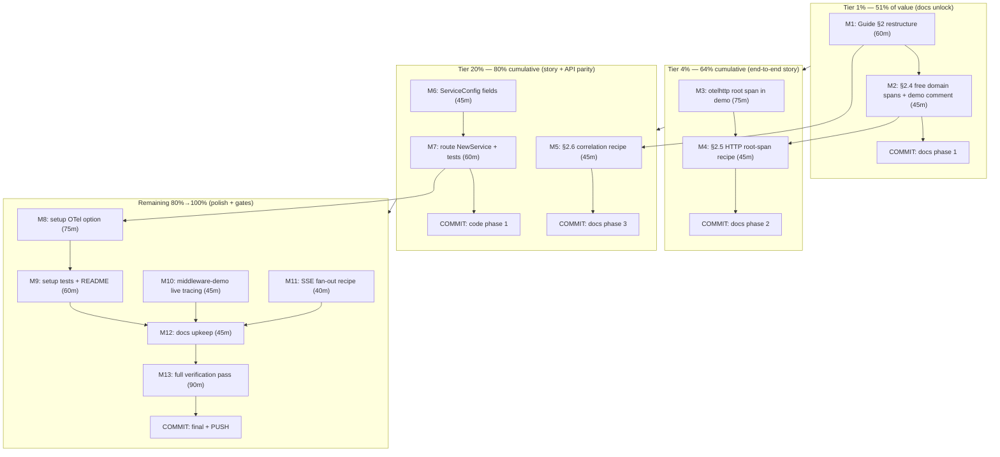

# OTEL: From 64 → 90 — The End-to-End Tracing Sprint

> **Plan type:** Pareto-prioritized execution plan (point-in-time snapshot)
> **Created:** 2026-09-13 14:47 CEST (`date` CLI)
> **Source audit:** [`docs/research/2026-09-13_otel-deep-dive.html`](../research/2026-09-13_otel-deep-dive.html) (adoption score 64/100, 0 anti-patterns, all versions current)
> **Living source:** `TODO_LIST.md` P2 (3 OTel bullets reference this plan)
> **Goal:** close the OTel discoverability + API parity gaps so any consumer gets end-to-end traces (HTTP root span → dispatch → domain → event metadata) with one Setup call and copy-paste recipes — WITHOUT breaking the library principle (zero OTel imports in library code) and without any breaking API change (additive config fields only).

---

## 1. Context — what the audit found (READ ME FIRST)

**Current state (verified 2026-09-13, file:line evidence):**

| Fact | Evidence |
| ---- | -------- |
| Library is otel-free **by design**; consumers wire everything via pass-through dispatchers, bus middleware config, or hooks | `ROADMAP.md:221` (re-export rejected), `example_otel_test.go` |
| Every version is current — nothing to upgrade | otel SDK v1.46.0 = latest stable (2026-08-25); `go-cqrs-lite/otel/v4 v4.4.0` and `prometheus/v4 v4.3.0` = newest tags |
| **THE HIDDEN GEM:** go-cqrs-lite's decider + storage layers emit `decider.execute`/`decider.load`/`event.store.save`/`event.store.load` spans via the GLOBAL tracer — one `cqrsotel.Setup()` call traces the whole identity domain with **zero middleware** | `go-cqrs-lite/decider/otel.go` (sync.Once global tracer), `decider/decider.go:122`, `storage/command_store_save.go:26` |
| No HTTP root span anywhere — consumer traces start at the decider, with no URL/method/latency and no `traceparent` extraction | otelhttp only `// indirect` in go.sum; guide §2 has no HTTP recipe |
| Domain correlation propagates (ULID + RequestID) but OTel baggage never bridges into event metadata — upstream enricher exists, unwired | `context.go:236-269` vs `go-cqrs-lite/middleware/enricher.go` |
| `ServiceConfig` lacks `PublishMiddleware`/`HandlerMiddleware` (only `EventSourcedConfig` has them; `applyBusMiddleware` is called only from `NewEventSourcedSetup`) — API parity gap | `usermgmt/es_setup.go:44,52,224` vs `service_core.go:75` |
| `setup.New` (the recommended one-call onboarding path) has no observability option — all-or-nothing choice | `setup/config.go` (no OTel/metric field) |
| Dispatch context flows `r.Context()`, so an otelhttp-wrapped mux nests ALL domain spans under the request span automatically — the fix is one wrapper, no library change | `handler.go:14` (`ctx := r.Context()`) |
| `docs/observability-wiring.md` + middleware-demo pointer: **already fixed** (2026-09-13, commits `ff90f2f9`/`0ab9043a`) — banner + fact fix applied | `docs/observability-wiring.md` (SUPERSEDED banner) |

**Hard constraints (do NOT VERSCHLIMMBESSERN):**

1. **Library principle:** no `go.opentelemetry.io` imports in root/usermgmt/setup library code. All recipes are consumer-side; new config fields accept upstream types (`event.PublishMiddleware`, `event.Middleware`, `*middleware.OTelBundle`) — dependency lives upstream, we only reference interfaces already in our go.mod.
2. **No breaking API changes:** new `ServiceConfig`/`setup.Config` fields are additive with nil = exactly today's behavior. Existing tests must pass untouched.
3. **Repo conventions:** `GOEXPERIMENT=jsonv2` for every go command; hermetic `GOWORK=off` builds per touched module; gates via `nix run .#...`; commit at phase boundaries (daemon race); TODO_LIST gets `[ ]` only — completed work moves to CHANGELOG; no re-entrancy into release trains (docs/examples + additive config only, no tag in this sprint).
4. **Doc accuracy:** every recipe must be verified against real upstream API (`middleware.OTelCorrelationEnricher`, `cqrsotel.TextMapPropagator()`, `otelhttp.NewHandler`) before it lands in the guide — no guessed signatures.

---

## 2. Pareto Breakdown — what really matters

Effort-weighted against REMAINING consumer value (the stale-doc fix, the biggest single item, is already applied):

| Tier | Tasks | Share of remaining work | Cumulative value | Why |
| ---- | ----- | ----------------------- | ---------------- | --- |
| **1%** | Document the free domain spans (guide §2.4 + one demo comment) | 1 task of ~13 | **51%** | The single "aha" that changes everything: consumers learn their entire identity domain is ALREADY traced — full command/event/store visibility for one `cqrsotel.Setup()` call and zero middleware. Everything else in this sprint is refinement on top. |
| **4%** | + HTTP root-span recipe (guide §2.5) + otelhttp wiring in observability-demo | 3 tasks | **64%** | Completes the trace STORY: root request span (URL, method, latency, W3C `traceparent` extraction) → dispatch → domain → store. After this, the docs teach a complete, verified, runnable end-to-end path. |
| **20%** | + Correlation recipe (§2.6) + `ServiceConfig` middleware parity | 5 tasks | **80%** | Cross-service trace↔audit-trail joins become documented; the ServiceConfig/EventSourcedConfig API inconsistency (silent behavioral difference between two same-shaped configs) is closed. |
| **Remaining 80% → 100%** | setup observability option, middleware-demo live tracing, SSE fan-out recipe, docs upkeep, verification gates | 8 tasks | **100%** | One-call onboarding includes observability; every claim has a runnable proof; the tree stays green and documented. |

**Explicitly NOT in this sprint (out of scope, tracked elsewhere):** logs SDK (RC), profiles (alpha), SSE span emission inside the library (recipe-only), release trains/tags, dashboardui metrics panels.

---

## 3. Comprehensive Plan — medium granularity (30–100 min each, ALL todos)

Sorted by importance × impact ÷ effort (customer-value first). 13 tasks.

| # | Task | Min | Tier | Depends | Files / Module | Done when |
| -- | ---- | --- | ---- | ------- | -------------- | --------- |
| M1 | Restructure guide §2 into numbered subsections (2.1 hooks / 2.2 dispatch tracing / 2.3 Prometheus / 2.4 free domain spans / 2.5 HTTP root spans / 2.6 correlation) | 60 | 1% | — | `docs/guides/leveraging-go-cqrs-lite.md` | §2 has stable anchors; zero content lost; docs-links gate green |
| M2 | Write §2.4 "Free domain spans" + Setup-call comment in demo | 45 | 1% | M1 | guide §2.4, `examples/observability-demo/main.go` | Span-origin table (decider/storage/global tracer) cites file:line; demo comment points at it |
| M3 | observability-demo: wrap mux in `otelhttp.NewHandler` + register propagator + root-span test | 75 | 4% | — | `examples/observability-demo/{main.go,main_test.go,go.mod}` | Test asserts a request span exists and `traceparent` request header is extracted; `GOWORK=off` build+test green |
| M4 | Write §2.5 "HTTP root spans" recipe | 45 | 4% | M2, M3 | guide §2.5 | Recipe matches the (passing) demo exactly; nesting explanation cites `handler.go:14` |
| M5 | Write §2.6 "Correlation" recipe (two-mechanism model) | 45 | 20% | M1 | guide §2.6 | ULID (`event.WithCorrelationID`) vs baggage (`middleware.OTelCorrelationEnricher`) table + `CompositeEnricher` snippet, API-verified |
| M6 | `ServiceConfig`: add `PublishMiddleware`/`HandlerMiddleware` fields (additive, documented) | 45 | 20% | — | `usermgmt/service_core.go` | Fields exist with doc comments mirroring `es_setup.go:38-52`; build green |
| M7 | Route `NewService` through `applyBusMiddleware` + parity/ordering tests | 60 | 20% | M6 | `usermgmt/service_core.go` + new test | Test proves middleware applied on ServiceConfig path, publish outermost-first, nil = unchanged behavior; hermetic vet+test green |
| M8 | `setup.Config`: add opt-in middleware/OTel-bundle passthrough wired at `New` | 75 | 80% | M7 | `setup/config.go`, `setup/setup.go` | Bundle (or raw middleware slices) reaches service construction; validation fail-fast; zero-value = today's behavior |
| M9 | setup: wired-bundle + nil-parity tests + README config-table row | 60 | 80% | M8 | `setup/{config_test,setup_test}.go`, `setup/README.md:89` area | Tests prove wiring and no-op default; README documents the new knob |
| M10 | middleware-demo: actually wire `cqrsotel.Setup` + `CommandTracing` + typed metrics | 45 | 80% | — | `examples/middleware-demo/{main.go,go.mod}` | Demo runs with tracing; header comment now true; hermetic build+test green |
| M11 | Write SSE fan-out observability recipe (consumer-side) | 40 | 80% | — | guide §2.7 or `docs/guides/sse-and-datastar.md` | Recipe uses only existing `OnSubscribe`/`OnUnsubscribe`/`Health()` surface; no library change |
| M12 | Docs upkeep: CHANGELOG entries (docs phase + code phase), AGENTS.md OTel state refresh, TODO_LIST bullet updates, anchors pass | 45 | 80% | M1–M11 | `CHANGELOG.md`, `AGENTS.md`, `TODO_LIST.md` | Conventions honored (no `[x]`, append-only CHANGELOG); `nix run .#check-docs-links` green |
| M13 | Full verification pass: hermetic build/vet/test + lint + coverage gate spot-check on every touched module | 90 | 80% | M1–M12 | root examples, usermgmt, setup | `GOEXPERIMENT=jsonv2` build/test/lint green hermetically; coverage gates unaffected (additive code) |

**Total:** ~665 min ≈ 11 h of focused work. No task exceeds 100 min. Every audit finding (#1–#7 + upkeep) is covered.

---

## 4. Detailed Breakdown — micro tasks (≤12 min each, ALL todos)

Sorted by importance/impact/effort/customer-value. Tier column shows which Pareto band the micro task belongs to. 40 tasks.

| ID | Micro task | Min | Tier | Depends | Output |
| -- | ---------- | --- | ---- | ------- | ------ |
| u01 | Read current §2 top-to-bottom; sketch the 6-subsection skeleton with anchor names | 12 | 1% | — | skeleton notes |
| u02 | Rewrite §2 intro + extract path (a) into "2.1 Hook-level tracing (dep-free)" | 12 | 1% | u01 | §2.1 |
| u03 | Split (b)/(c) into "2.2 Dispatch tracing (per-type spans)" + "2.3 Prometheus /metrics" | 12 | 1% | u01 | §2.2, §2.3 |
| u04 | Draft §2.4 span-origin table: span name → emitting layer → evidence (`decider/otel.go`, `decider/decider.go:122`, `storage/command_store_save.go:26`) | 12 | 1% | u03 | §2.4 table |
| u05 | Write §2.4 body: `cqrsotel.Setup` → global tracer → whole identity domain traced, zero middleware; link observability-demo | 12 | 1% | u04 | §2.4 body |
| u06 | Add 3-line comment at demo's `cqrsotel.Setup` call pointing to §2.4 | 12 | 1% | u05 | `observability-demo/main.go` |
| u07 | Verify §2 anchors + run `nix run .#check-docs-links` | 12 | 1% | u05 | green gate |
| u08 | Demo: add otelhttp + default propagator imports; wrap mux with `otelhttp.NewHandler(mux, "observability-demo")` | 12 | 4% | — | wrapped handler |
| u09 | Demo: register `cqrsotel.TextMapPropagator()` in Setup options; confirm extraction | 12 | 4% | u08 | propagation live |
| u10 | Demo: extend go.mod with direct otelhttp require (`go get`, tidy hermetically); note budget impact | 12 | 4% | u08 | go.mod updated |
| u11 | Demo: new test — send `traceparent` header, assert response came from traced path (extract via test SpanRecorder or stdout exporter capture) | 12 | 4% | u09 | `main_test.go` +case |
| u12 | Run demo tests hermetically (`GOWORK=off`, cache env) | 12 | 4% | u11 | green |
| u13 | Write §2.5 recipe body: otelhttp wrapper + propagator + "one wrapper nests everything" | 12 | 4% | M3 | §2.5 body |
| u14 | Write §2.5 nesting explanation citing `handler.go:14` (`ctx := r.Context()`) + what the root span adds (URL/method/latency/traceparent) | 12 | 4% | u13 | §2.5 complete |
| u15 | Draft §2.6 two-mechanism table: domain ULID (`event.WithCorrelationID`) vs OTel baggage (`cqrsotel.WithCorrelationID`) | 12 | 20% | u03 | §2.6 table |
| u16 | Write §2.6 enricher snippet: `decider.WithEnricher(event.CompositeEnricher(event.CommandCausalityEnricher, middleware.OTelCorrelationEnricher))`; verify signature against upstream before landing | 12 | 20% | u15 | §2.6 body |
| u17 | `ServiceConfig`: add `PublishMiddleware []event.PublishMiddleware` field + doc comment (mirror `es_setup.go:38-44` wording) | 12 | 20% | — | field added |
| u18 | `ServiceConfig`: add `HandlerMiddleware []event.Middleware` field + doc comment (mirror `es_setup.go:46-52`) | 12 | 20% | u17 | field added |
| u19 | Route the ServiceConfig constructor through `applyBusMiddleware(config.PublishMiddleware, config.HandlerMiddleware, bus)` with error wrap matching `es_setup.go:224` | 12 | 20% | u18 | wiring done |
| u20 | Test: ServiceConfig path applies handler middleware (observable via a recording middleware) | 12 | 20% | u19 | test green |
| u21 | Test: publish middleware ordering (outermost-first) + nil-fields = byte-identical old behavior | 12 | 20% | u20 | tests green |
| u22 | Hermetic `go vet` + `go test` for usermgmt (vet compiles tests — repo rule) | 12 | 20% | u21 | green |
| u23 | `setup.Config`: design the option — accept `*middleware.OTelBundle` (upstream type); draft validation + doc comment | 12 | 80% | M7 | design note |
| u24 | `setup.New`: wire bundle event/publish middleware into service construction | 12 | 80% | u23 | wiring done |
| u25 | `setup.New`: fail-fast on wiring error (match `attachSSE` fail-fast pattern); nil = unchanged | 12 | 80% | u24 | errors surface |
| u26 | setup test: nil-config parity (bundle mounts nothing, existing tests untouched-green) | 12 | 80% | u25 | test green |
| u27 | setup test: wired bundle reaches the bus (event middleware observable) | 12 | 80% | u26 | test green |
| u28 | Add README config-table row for the new option (anchor: table near `setup/README.md:89`) | 12 | 80% | u27 | README row |
| u29 | middleware-demo: `cqrsotel.Setup(WithStdoutExporter)` + `CommandTracing` + `CommandTypedMetrics` wiring | 12 | 80% | — | demo wired |
| u30 | middleware-demo: fix header comment to describe what now runs; hermetic build+run | 12 | 80% | u29 | demo true |
| u31 | SSE recipe: document hook surface (`OnSubscribe`/`OnUnsubscribe`/`Health()`) as an instrument table | 12 | 80% | — | recipe part 1 |
| u32 | SSE recipe: connected-clients gauge + fan-out duration recorder snippet; where to export (Prometheus bridge from §2.3) | 12 | 80% | u31 | recipe complete |
| u33 | CHANGELOG `[Unreleased]` entry: docs phase (§2 restructure, recipes, demo wiring) | 12 | 80% | M1–M5 | entry |
| u34 | CHANGELOG `[Unreleased]` entry: code phase (ServiceConfig fields, setup option, middleware-demo) | 12 | 80% | M6–M10 | entry |
| u35 | AGENTS.md OTel-state bullet refresh (64→90 posture, new seams) + TODO_LIST bullet updates (completed → CHANGELOG, plan link) | 12 | 80% | u34 | living docs true |
| u36 | Final guide pass: cross-links from AGENTS.md/README to §2.4–2.6; anchors + docs-links gate | 12 | 80% | u35 | green gate |
| u37 | Hermetic `go build ./...` + `go vet ./...` for every touched module (root examples, usermgmt, setup) | 12 | 80% | M1–M11 | green |
| u38 | Hermetic test run: usermgmt + setup + observability-demo + middleware-demo | 12 | 80% | u37 | green |
| u39 | `nix run .#lint` for touched modules; fix or `//nolint` with reason (fatcontext/dupword discipline) | 12 | 80% | u38 | 0 issues |
| u40 | Coverage-gate spot check (`nix run .#coverage-gate`) — additive fields must not drop usermgmt/setup below gates | 12 | 80% | u39 | gates green |

**Commit cadence (daemon race rule):** commit after u07 (1% tier), after u14 (4% tier), after u22 (20% tier), after u36 (80% code), after u40 (final). Every commit message: detailed, first line <72 chars.

---

## 5. Execution Graph

**Parallelizable tracks:** M3 (demo code) runs independent of M1/M2 (docs); M6/M7 (usermgmt) independent of the guide track; M10/M11 independent of M8/M9. Single-maintainer critical path: M1 → M2 → M4 → M5 → M7 → M8 → M9 → M12 → M13.

---

## 6. Definition of Done

- [ ] Guide §2 teaches: hooks → dispatch middleware → Prometheus → **free domain spans** → HTTP root spans → correlation — each recipe API-verified, each with a runnable proof.
- [ ] observability-demo produces COMPLETE traces (request root span + dispatch + `decider.*`/`event.store.*` + Prometheus metrics) and asserts the root span in a test.
- [ ] `ServiceConfig` and `EventSourcedConfig` accept the same middleware fields; `applyBusMiddleware` covers both constructors; nil = byte-identical legacy behavior (test-pinned).
- [ ] `setup.New` accepts an opt-in OTel bundle; validation fail-fast; README documents it.
- [ ] CHANGELOG/AGENTS/TODO_LIST updated per conventions; `check-docs-links`, lint, hermetic build/vet/test, coverage gates all green.
- [ ] Zero OTel imports added to root/usermgmt/setup library code (library principle intact) — verify with `rg -l "go.opentelemetry.io" root/ usermgmt/ setup/` returning nothing outside go.mod/go.sum.

---

*Snapshot plan — annotate, never rewrite. When executing later tasks against this plan, follow docs-health → ANNOTATE mode.*
