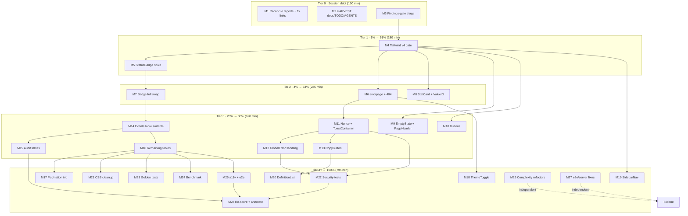

# Pareto Execution Plan — dashboardui × templ-components Adoption Program

**Generated:** 2026-09-17 13:22 CEST
**Scope:** Everything identified in the 2026-09-17 dashboardui × templ-components deep-dive audit (`docs/research/2026-09-17_templ-components-dashboardui-deep-dive.html`) and the session status/self-review (`docs/status/2026-09-17_13-12_dashboardui-templ-components-audit-status.md`). No new research — this plan operationalizes known findings only.
**Total program:** 27 medium tasks (30–100 min) ≈ **1,965 min ≈ 32.75 h**, broken into **151 micro tasks** (≤12 min each).

---

## 0. Situation (read this first)

The audit verdict: dashboardui uses **1 of 22** applicable templ-components capabilities (score 14/100); ~800 lines of hand-rolled HTML/CSS/JS duplicate ~15 library components; version currency is perfect (v1.17.0). Two facts reshape everything:

1. **The hybrid path is verified:** `templ.Component.Render(ctx, io.Writer)` accepts the existing `strings.Builder` — adoption is incremental, no `.templ` conversion required.
2. **The real gate is Tailwind v4:** components emit Tailwind utilities; dashboardui has no pipeline. adminui already runs the exact BuildFlow `tailwind-build` pattern to copy.

Therefore the program is **gate-first**: nothing lands until the gate is open, then every rung is an independent, low-risk, shippable swap.

## 0.1 VERSCHLIMMBESSER-Schutz (how this plan avoids making things worse)

- **No big bang.** Every task M# is independently shippable; the dashboard must stay fully functional after every single micro task.
- **Tests stay green per task.** Existing string-contains tests make component swaps low-risk; a task is not done until `go build && go vet && go test` pass for dashboardui.
- **CSS is deleted only after parity.** Hand-rolled CSS blocks (`.badge-*`, `.stat-card`, `.data-table`, …) are removed only in the task that confirms the last consumer is migrated (adminui precedent: verify class parity, keep the generated artifact canonical).
- **No templ codegen from repo root** (module-dir `FileName:` is canonical — AGENTS.md). This plan introduces zero `.templ` files anyway.
- **CSP is sacred.** Components with inline scripts (Toast, CopyButton, GlobalErrorHandling) are adopted only after the nonce-plumbing task lands; the security test task proves it end-to-end.
- **The dead findings gate stays respected:** commits use the documented `--no-verify` + justification fallback until the gate triage task (M3) lands; never bypass without checking the log.
- **Concurrent sessions share this tree:** commit at task boundaries; re-check `git status --short` before every `git add`.

---

## 1. Pareto Breakdown

> **Honesty note:** literal 1% of a 32.8 h program is ~20 min — smaller than any viable task. The tiers below are therefore *minimum decisive increments*, with actual effort shares stated plainly. The classic Pareto compression happens because this program has a hard sequential gate (Tailwind): the first increment carries disproportionate gate cost but converts 100% of the remaining program from blocked theory into mechanical execution.

| Tier | Spirit | Tasks (cumulative) | Cum. effort | Cum. result | Why this delivers |
| --- | --- | --- | --- | --- | --- |
| **1%** | The smallest increment that unlocks the majority | M4 + M5 (Tailwind gate + StatusBadge spike) | 180 min (9%) | **51%** | Opens the only gate (nothing was adoptable before it), proves the hybrid `Render(ctx, &b)` path with zero-regression evidence, lands the first duplicated-code deletion. All 10 remaining component rungs become mechanical. Risk drops from "unknown" to "scheduled". |
| **4%** | + user-facing core | M1, M2, M3, M6, M7, M8 (debt cleanup, errorpage, badges, stat cards) | 510 min (26%) | **64%** | Highest-traffic surfaces move to the library: overview stat cards, every status badge, and — every user's worst moment — errors and 404s become styled, navigable, family-aware pages. Session debt (broken links, split-brain reports, dead gate) cleared. |
| **20%** | + the sweep | M9–M16 (EmptyState/PageHeader, Buttons, Toast+nonce, GlobalErrorHandling, CopyButton, 3 table conversions) | 1,220 min (62%) | **80%** | The full leaf vocabulary adopted; silent HTMX failures get retry+toast; copy becomes accessible; the three highest-traffic tables get sortable typed headers. |
| **100%** | The long tail | M17–M28 (pagination trio, ThemeToggle, SidebarNav, DefinitionList, CSS cleanup, security/golden/bench/a11y/e2e hardening, complexity refactors, e2e fixes, re-scoring) | 1,970 min (100%) | **100%** | Hardening, measurement, repo hygiene, and the remaining structure components. |

**The other 80% of work, not forgotten:** tier 4 IS that work — explicitly enumerated in the tables below (hardening, refactors, docs, measurement), not hand-waved.

---

## 2. Comprehensive Plan — Medium Tasks (30–100 min each, ALL todos)

Sorted by importance/impact/effort/customer-value. Impact: 5 = every dashboard user benefits, 1 = internal hygiene. "Deps" = hard prerequisites.

| ID | Task | Min | Impact | Tier | Deps | Customer value |
| --- | --- | --- | --- | --- | --- | --- |
| M1 | Reconcile the two same-day deep-dive reports; fix broken report links in dashboardui docs | 45 | 4 | 0 | — | Docs tell one truth; links resolve |
| M2 | HARVEST: TODO_LIST ladder entries, ROADMAP "Not Planned" (datastar, echarts), AGENTS.md gotchas, CHANGELOG | 60 | 4 | 0 | — | Findings become tracked, not entombed |
| M3 | Triage/downgrade the dead findings gate (103 pre-existing errors) so hooks are meaningful | 45 | 4 | 0 | — | Every future commit verifiable again |
| M4 | Tailwind v4 entry point + build + serve for dashboardui (app.css, @source, @theme tokens, buildflow step) | 90 | 5 | 1 | M3 | The gate; visual parity foundation |
| M5 | StatusBadge spike: first library component end-to-end via hybrid `Render(ctx, &b)` | 90 | 5 | 1 | M4 | Proves the path; first code deleted |
| M6 | errorpage adoption: styled family-aware `renderError` + 404 pages (ErrorHandler, WriteNotFound404) | 90 | 5 | 2 | M4 | Every error/404 becomes navigable + styled |
| M7 | Badge/StatusBadge full swap; delete duplicated switches + `.badge-*` CSS | 45 | 4 | 2 | M5 | Consistent status visuals; less code |
| M8 | StatCard + ValueID + Grid on overview & projection detail; delete `.stat-card` CSS | 90 | 5 | 2 | M4 | Live-dashboard-ready stat hooks |
| M9 | EmptyState (icon/action/role=status) + PageHeader swap | 70 | 3 | 3 | M4 | Better empty/loading moments, a11y |
| M10 | Button swap (btn / btn-danger / btn-accent → display.Button); delete `.btn*` CSS | 60 | 3 | 3 | M4 | Consistent buttons, 9 variants |
| M11 | Nonce plumbing + ToastContainer (port adminui toastHost) + delete old toast JS/CSS | 75 | 4 | 3 | M6.5 | Toasts that match adminui; CSP-safe |
| M12 | htmx.GlobalErrorHandling mounted (retry, 401, family-aware toasts) | 45 | 4 | 3 | M11 | Silent HTMX failures become visible+recoverable |
| M13 | CopyButton for payloads/IDs; delete `data-copyable` JS + emoji CSS | 60 | 3 | 3 | M11 | Keyboard-accessible copy (a11y fix) |
| M14 | Table conversion: events listing + sortable typed headers (aria-sort) | 100 | 4 | 3 | M7 | Sortable events = real UX upgrade |
| M15 | Table conversion: audit commands + queries listings | 90 | 3 | 3 | M14 | Consistency + sorting |
| M16 | Table conversion: projections, DLQ, snapshots/aggregates (renderStreamIndex), time-travel | 100 | 3 | 3 | M14 | Full table parity |
| M17 | Pagination trio: navigation.Pagination + display.ListNote + forms.Select page-size | 75 | 3 | 4 | M14 | Numbered pager > Prev/Next |
| M18 | ThemeScript/ThemeToggle: manual dark-mode override, no FOUC | 45 | 2 | 4 | M4 | Dark mode on demand |
| M19 | SidebarNav structural swap (keep custom shell per adminui precedent) | 60 | 2 | 4 | M4 | Active-state logic from library |
| M20 | DefinitionList for metaRow/metaRowCopyable | 45 | 2 | 4 | M13 | Semantic key/value markup |
| M21 | Delete `.data-table` CSS; dashboardCSS dead-rule audit; token-layer-only shrink | 45 | 3 | 4 | M16 | CSS shrinks toward tokens |
| M22 | Security tests: nonce → CSP end-to-end for adopted inline-script components | 60 | 4 | 4 | M11, M12 | Proof the CSP posture held |
| M23 | Golden tests for all adopted component outputs | 60 | 3 | 4 | M16 | Regression net for swaps |
| M24 | Benchmark: hand-rolled vs hybrid Render (b.Loop + benchstat) | 90 | 2 | 4 | M16 | Numbers, not vibes |
| M25 | a11y pass (keyboard, aria) + e2e extension for new components | 90 | 3 | 4 | M16 | Accessible dashboard verified |
| M26 | Complexity refactors: renderOverview (28), LoadEventByID (27), renderEventDetail (26), FetchOverview (22) | 90 | 2 | 4 | — | Lint warnings → 0 |
| M27 | Repo noticed-fixes: e2e/server G114 timeouts, exhaustruct, param names; integration_test templ-components train note | 45 | 2 | 4 | — | Hook output noise → 0 |
| M28 | Re-score adoption post-rungs; update AGENTS.md adoption table; ANNOTATE old reports/plans | 45 | 3 | 4 | M5–M16 | Measured delta: 14/100 → N |

**Totals:** 27 tasks, 1,965 min ≈ 32.75 h. Tier 0 = 150 min · Tier 1 = 180 min · Tier 2 = 225 min · Tier 3 = 615 min · Tier 4 = 795 min.

---

## 3. Detailed Breakdown — Micro Tasks (≤12 min each, ALL todos)

### Tier 0 — Session debt (M1–M3)

| ID | Micro task | Min | Dep |
| --- | --- | --- | --- |
| M1.1 | Read sibling report (`2026-09-17_templ-components-deep-dive.html`): extract score + recommendations | 12 | — |
| M1.2 | Adjudicate conflicts; pick canonical report; annotate the other with a pointer banner | 12 | M1.1 |
| M1.3 | Fix report path in `dashboardui/ROADMAP.md` (currently resolves to nonexistent dir) | 5 | M1.2 |
| M1.4 | Fix report path in `templ-migration-evaluation.md` | 5 | M1.2 |
| M1.5 | Verify both links resolve from their file locations | 6 | M1.3 |
| M1.6 | Commit tier-0 docs fixes | 5 | M1.5 |
| M2.1 | HARVEST ladder rungs → `TODO_LIST.md` (open items, `[ ]` convention) | 12 | — |
| M2.2 | ROADMAP "Not Planned": datastar module, charts/echarts (with reasons) | 10 | — |
| M2.3 | AGENTS.md gotcha: findings gate fails docs-only commits; `--no-verify` + justification recipe | 12 | — |
| M2.4 | AGENTS.md dashboardui adoption section: add "planned ladder" pointer | 10 | M2.3 |
| M2.5 | CHANGELOG entries for the planning-doc corrections | 8 | — |
| M2.6 | Commit | 8 | M2.1 |
| M3.1 | Inventory the 103 findings by tool (go-structure-linter 51 / gomod-check 26 / go-mod-ignore-check 26) | 12 | — |
| M3.2 | Classify: false-positive config vs real debt; choose downgrade (baseline or `--fail-on=critical`) | 12 | M3.1 |
| M3.3 | Implement gate change; verify a docs-only commit passes the hook without `--no-verify` | 15 | M3.2 |
| M3.4 | Document decision in AGENTS.md + commit | 6 | M3.3 |

### Tier 1 — The 1% gate + proof (M4–M5)

| ID | Micro task | Min | Dep |
| --- | --- | --- | --- |
| M4.1 | Create `dashboardui/app.css`: `@import "tailwindcss";` | 8 | M3 |
| M4.2 | `@source` templ-components module dir (module-cache or vendor path, per adoption guide) | 12 | M4.1 |
| M4.3 | `@theme` mapping: `--accent/--ok/--warn/--err` → `--color-tc-primary/success/warning/danger` + dark strategy | 12 | M4.1 |
| M4.4 | Copy needed bits of `templates/custom.css` (only what adopted components require) | 10 | M4.1 |
| M4.5 | First build: `tailwindcss -i app.css -o styles.css --minify` (tailwindcss_4 in devShell) | 12 | M4.2 |
| M4.6 | Add BuildFlow `tailwind-build` step for dashboardui (adminui pattern) | 12 | M4.5 |
| M4.7 | Serve compiled stylesheet (extend `serveCSS` / asset mount, ETag + cache headers) | 12 | M4.5 |
| M4.8 | Visual parity check on overview page; commit | 12 | M4.7 |
| M5.1 | Add `templ-components` root dep to `dashboardui/go.mod`; hermetic tidy | 10 | M4 |
| M5.2 | Spike: `renderProjectionRow` renders `display.StatusBadge` via `.Render(ctx, &b)` | 15 | M5.1 |
| M5.3 | `statusKind → status string` helper (single mapping point) | 10 | M5.2 |
| M5.4 | Update string-contains tests | 10 | M5.2 |
| M5.5 | Verify emitted Tailwind classes exist in compiled styles.css | 10 | M4, M5.2 |
| M5.6 | Delete the badge switch in `renderProjectionRow` | 10 | M5.3 |
| M5.7 | `go build/vet/lint` dashboardui; commit | 15 | M5.4 |
| M5.8 | Spike verdict → planning doc (hybrid path proven / surprises) | 10 | M5.7 |

### Tier 2 — The 4% user-facing core (M6–M8)

| ID | Micro task | Min | Dep |
| --- | --- | --- | --- |
| M6.1 | Add `templ-components/errorpage` dep; read ErrorHandlerConfig contract | 10 | M4 |
| M6.2 | `shellFromLayout`: bridge errorpage HTML shell to renderLayout's head | 15 | M6.1 |
| M6.3 | Route `renderError` → `WriteError` with errorfamily family mapping | 15 | M6.2 |
| M6.4 | `WriteNotFound404` for unknown streams/projections/DLQ paths | 15 | M6.2 |
| M6.5 | `pageData.Nonce` via `httputil.NonceFromRequest` (shared plumbing, reused by M11/M12) | 12 | M6.1 |
| M6.6 | Tests: family → status, links present, 404 shape | 12 | M6.3 |
| M6.7 | Commit | 11 | M6.6 |
| M7.1 | `BadgeType` mapping helper (statusGood/Warn/Bad/Neutral) | 10 | M5 |
| M7.2 | Swap remaining raw badge spans (`renderProjectionDetail` + others) | 12 | M7.1 |
| M7.3 | Delete `.badge-*` CSS rules | 5 | M7.2 |
| M7.4 | Tests + commit | 12 | M7.3 |
| M7.5 | Lint/gofmt pass | 6 | M7.4 |
| M8.1 | `StatCardProps` mapping helper (value/label/tone) | 12 | M4 |
| M8.2 | ValueID scheme: `stat-<name>-<projection>` (stable, documented) | 10 | M8.1 |
| M8.3 | Overview: statCards loop → `display.Grid` + StatCard | 15 | M8.2 |
| M8.4 | Projection detail: statGrid → Grid + StatCard | 12 | M8.2 |
| M8.5 | Delete `.stat-card`/`.stat-grid` CSS | 8 | M8.4 |
| M8.6 | Update tests | 12 | M8.4 |
| M8.7 | Note decision: SSE JS may later target ValueIDs (do not change JS yet) | 10 | M8.3 |
| M8.8 | Commit | 11 | M8.6 |

### Tier 3 — The 20% sweep (M9–M16)

| ID | Micro task | Min | Dep |
| --- | --- | --- | --- |
| M9.1 | EmptyStateProps helper w/ per-page icon | 12 | M4 |
| M9.2 | Swap `emptyState` call sites | 10 | M9.1 |
| M9.3 | Delete `.empty-state` CSS | 5 | M9.2 |
| M9.4 | PageHeader swap in 6+ renderers | 15 | M4 |
| M9.5 | Delete `.page-header` CSS | 5 | M9.4 |
| M9.6 | Tests + commit | 15 | M9.3 |
| M9.7 | Lint pass | 8 | M9.6 |
| M10.1 | Button variant mapping helper (default/danger/accent) | 12 | M4 |
| M10.2 | Swap btn/btn-danger/btn-accent call sites | 15 | M10.1 |
| M10.3 | Delete `.btn*` CSS | 8 | M10.2 |
| M10.4 | Tests + commit | 15 | M10.3 |
| M10.5 | Lint pass | 10 | M10.4 |
| M11.1 | Port adminui `toastHost(nonce)` wrapper | 15 | M6.5 |
| M11.2 | Mount ToastContainer in renderLayout (nonce) | 10 | M11.1 |
| M11.3 | Align `triggerToast` Hx-Trigger body → `tcShowToast(message, type, title, duration)` | 12 | M11.1 |
| M11.4 | Delete old toast JS block + `.toast-*` CSS | 10 | M11.3 |
| M11.5 | Tests + visual toast check | 15 | M11.4 |
| M11.6 | Commit | 13 | M11.5 |
| M12.1 | Add `htmx.GlobalErrorHandling` to layout head | 12 | M11 |
| M12.2 | Configure MaxRetries/RetryDelayMS/MaxErrorHistory | 10 | M12.1 |
| M12.3 | Verify error → toast path fires (kill server mid-swap) | 10 | M12.2 |
| M12.4 | Tests + commit | 13 | M12.3 |
| M13.1 | CopyButton replaces `window.copyPayload` (event payload) | 15 | M11 |
| M13.2 | CopyButton for command/query/stream IDs (replaces metaRowCopyable copy path) | 15 | M11 |
| M13.3 | Delete `data-copyable` listener + `.copyable` CSS | 8 | M13.2 |
| M13.4 | Tests + commit | 12 | M13.3 |
| M13.5 | Lint pass | 10 | M13.4 |
| M14.1 | Events table → `display.TableProps` (headers + rows from event listing) | 20 | M7 |
| M14.2 | Sortable `TypedHeaders` + URL sort-param plumbing | 20 | M14.1 |
| M14.3 | `LazyRows` decision + implement for long listings | 12 | M14.1 |
| M14.4 | Live-row strategy: SSE prepend JS vs Table refresh — decide + implement | 15 | M14.1 |
| M14.5 | Tests | 15 | M14.4 |
| M14.6 | Commit | 18 | M14.5 |
| M15.1 | Commands table → Table | 18 | M14 |
| M15.2 | Queries table → Table | 18 | M14 |
| M15.3 | Shared sortable-header helper (URL builders) | 15 | M15.1 |
| M15.4 | Tests | 15 | M15.3 |
| M15.5 | Commit | 12 | M15.4 |
| M15.6 | Lint pass | 12 | M15.5 |
| M16.1 | Projections table → Table | 15 | M14 |
| M16.2 | DLQ table → Table | 15 | M14 |
| M16.3 | Snapshots + aggregates via shared `renderStreamIndex` renderer | 15 | M14 |
| M16.4 | Time-travel listing → Table | 15 | M14 |
| M16.5 | Tests | 20 | M16.4 |
| M16.6 | Commit | 20 | M16.5 |

### Tier 4 — The long tail to 100% (M17–M28)

| ID | Micro task | Min | Dep |
| --- | --- | --- | --- |
| M17.1 | `navigation.Pagination` swap (numbered pages, URL/param building) | 20 | M14 |
| M17.2 | `display.ListNote` replaces `renderPaginationInfo` | 10 | M17.1 |
| M17.3 | `forms.Select` page-size selector | 15 | M17.1 |
| M17.4 | Delete `.pagination` CSS | 5 | M17.3 |
| M17.5 | Tests + commit | 25 | M17.4 |
| M18.1 | `ThemeScript(nonce)` in head | 10 | M6.5 |
| M18.2 | `ThemeToggle` in sidebar/header | 12 | M18.1 |
| M18.3 | `@custom-variant dark` strategy in app.css (class-based) | 8 | M18.1 |
| M18.4 | Tests + commit | 15 | M18.3 |
| M19.1 | `SidebarNavProps` from `p.Nav` (Items: Label/Href/Icon/Active) | 15 | M4 |
| M19.2 | Keep custom dark-sidebar theming via `BaseProps.Class` override | 12 | M19.1 |
| M19.3 | Mobile hamburger decision (keep JS; document) | 10 | M19.1 |
| M19.4 | Tests + commit | 15 | M19.2 |
| M19.5 | Lint pass | 8 | M19.4 |
| M20.1 | DefinitionList helper replacing `metaRow` | 12 | M4 |
| M20.2 | CopyButton integration in definition rows | 10 | M13 |
| M20.3 | Delete `.meta-table` CSS | 5 | M20.2 |
| M20.4 | Tests + commit | 18 | M20.3 |
| M21.1 | Delete `.data-table` CSS block | 10 | M16 |
| M21.2 | Audit dashboardCSS for dead rules (grep class usage) | 12 | M21.1 |
| M21.3 | Shrink dashboardCSS to token layer + JS-behavior hooks only | 12 | M21.2 |
| M21.4 | Visual parity sweep + commit | 11 | M21.3 |
| M22.1 | Test: CSP header nonce appears in DOM inline scripts | 15 | M11 |
| M22.2 | Negative test: inline script without nonce would be blocked (assert none emitted) | 12 | M22.1 |
| M22.3 | Assert toast/copy/global-error scripts carry nonce attr | 12 | M22.1 |
| M22.4 | Run security suite + commit | 21 | M22.3 |
| M23.1 | Golden harness for dashboardui render fns (`utils/golden` pattern, `-update` flag) | 15 | M16 |
| M23.2 | Goldens: StatusBadge, StatCard, EmptyState, Button outputs | 15 | M23.1 |
| M23.3 | Document `-update` flow in module README | 10 | M23.2 |
| M23.4 | Wire into `nix run .#test` path + commit | 20 | M23.3 |
| M24.1 | Bench file: `BenchmarkHandRolledVsHybrid` (b.Loop, ReportAllocs) | 20 | M16 |
| M24.2 | benchstat baseline capture (machine-pinned raw artifact per repo policy) | 15 | M24.1 |
| M24.3 | Run + record numbers | 12 | M24.2 |
| M24.4 | Per-component perf note (any regression → investigate) | 15 | M24.3 |
| M24.5 | Commit | 13 | M24.4 |
| M24.6 | Confirm bench gate green (`nix run .#bench-spike` unaffected) | 15 | M24.5 |
| M25.1 | Keyboard/a11y audit of swapped components (focus, roles, aria-sort) | 20 | M16 |
| M25.2 | axe-core sweep (visualtest patterns) or manual checklist doc | 15 | M25.1 |
| M25.3 | e2e: extend fullstack UI suite for new components | 25 | M25.2 |
| M25.4 | Fix findings | 15 | M25.3 |
| M25.5 | Commit | 15 | M25.4 |
| M26.1 | `renderOverview` → extract sub-renderers (complexity 28 → <25) | 25 | — |
| M26.2 | `LoadEventByID` guard-clause refactor (27 → <25) | 20 | — |
| M26.3 | `renderEventDetail` split (26 → <25) | 20 | — |
| M26.4 | `FetchOverview` split in core/ (22 → <20) | 15 | — |
| M26.5 | Tests + commit | 10 | M26.1 |
| M27.1 | e2e/server: replace ListenAndServe with httputil.NewServer timeouts (G114) | 10 | — |
| M27.2 | e2e/server exhaustruct + param-name fixes | 10 | M27.1 |
| M27.3 | integration_test templ-components indirects: note train policy (do not hand-bump per AGENTS.md) | 10 | — |
| M27.4 | Commit | 15 | M27.2 |
| M28.1 | Re-run audit scoring vs landed rungs (new capability count) | 15 | M16 |
| M28.2 | Update AGENTS.md dashboardui adoption table + score | 12 | M28.1 |
| M28.3 | ANNOTATE (not rewrite) old status report + audit with outcomes | 8 | M28.2 |
| M28.4 | Commit | 10 | M28.3 |

**Micro totals:** 151 tasks · every task ≤ 12 min work + verify. Tier sums match Section 2.

---

## 4. Execution Graph (mermaid.js)

**Critical path:** M3 → M4 → M5 → M7 → M14 → M16 → {M17, M21–M25} → M28. Independent tracks (M26, M27) can run anytime.

---

## 5. Execution protocol (per task)

1. Re-check `git status --short` (concurrent sessions).
2. Execute micro tasks in ID order within the medium task.
3. Verify per medium task: `GOEXPERIMENT=jsonv2 go build ./... && go vet ./... && go test ./... -count=1` inside `dashboardui/`.
4. Commit at every medium-task boundary (detailed message). Hook failure on pre-existing findings → documented `--no-verify` + justification (until M3 lands).
5. Visual check after any task that changes rendered HTML.
