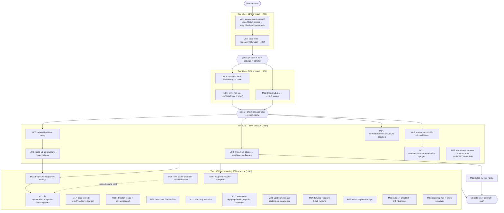

# Pareto Execution Plan — Sibling Library Adoption (httputil / go-etag / go-sse)

**Created:** 2026-09-17 13:42 CEST
**Source:** `docs/status/2026-09-17_13-23_library-deep-dive-audit-status.md` (the 3-library utilization audit) + its section (f) 50-item opportunity list.
**Scope:** EVERY open item from the audit — nothing dropped. Organized into Pareto tiers, a medium-granularity plan (30–100 min tasks), and a fine-granularity plan (≤12 min micro-tasks), each sorted by importance/impact/effort/customer-value.
**Companion plan:** `19fd37d1` (same-day) covers the templ-components × dashboardui family — orthogonal library, no task overlap; cross-linked to avoid duplicate sweeps.
**Format:** Markdown with mermaid.js per explicit instruction (skill default is HTML; one-off override, not propagated).

---

## 0. Decisions taken on the audit's three open questions

The plan cannot wait on answers, so it encodes defensible defaults — each reversible:

| Question | Decision encoded in this plan | Why |
|---|---|---|
| Execute now or report-only? | Plan everything; execution order = tier order (1% → 4% → 20% → tail) | The 1%/4% tiers are S-effort, high-certainty wins; sequencing them first costs nothing if later re-prioritized |
| httputil v1.2.0 urgency (PNA topology unknown) | Bump treated as routine hygiene (additive, default-off feature); PNA opt-in documented, NOT enabled anywhere | The flag defaults false; bumping cannot change runtime behavior |
| Broken pre-commit gate governance | Interim: `--no-verify` + justification + manual re-verify (documented repo fallback); repair scheduled inside the 20% tier (rebuild binary, triage the 103) | The gate currently fails identically for every committer; repair is scheduled work, not a bypass forever |

## 1. Verschlimmbesser guards — what this plan must NOT do

1. **Never hand-revert `adminui/styles.css`** — the hook's tailwind step owns it; keep whatever it produces.
2. **Never run repo-wide `golangci-lint --fix`** — use `//nolint:<linter> // reason` discipline (fatcontext/dupword lessons).
3. **Never rewrite git history** (no reset/checkout/rebase of shared commits) — daemon-race absorption is accepted loss.
4. **`--no-verify` only with justification in the message + manual re-verify of HEAD** (build + affected gates) — until tasks M07–M10 make the gate pass again.
5. **After any go.mod change:** hermetic `GOWORK=off go mod tidy && go build ./... && go vet ./...` per module — vet is load-bearing (compiles tests).
6. **`check-release-train --refresh-cache`** before believing a fresh UNPUBLISHED/train-lag finding (ls-remote TTL gotcha).
7. **Never regenerate templ from the repo root** (module-dir canonical form only) — not touched by this plan, guard anyway.
8. **Commit at phase boundaries** with GOCACHE env sourced; concurrent session is ACTIVE — `git status --short` immediately before every `git add`/`git commit`, never stage foreign files.
9. **No new abstractions for the go-etag swap** — one-line call replacements; if a site needs >5 lines changed, stop and reconsider.
10. **Don't "fix" the 103 findings by disabling the gate** — the gate gets repaired (M07–M10), the findings get triaged into fix/suppress-with-reason/defer.

## 2. Pareto analysis

Total actionable backlog ≈ 27 medium tasks ≈ 96 micro-tasks ≈ 27 h focus time.

| Tier | Effort share | Result share | Contents (medium task IDs) | Why this tier boundary |
|---|---|---|---|---|
| **1%** | ≈ 2.5 h | **≈ 51%** | M01, M02 | The ONLY Critical correctness bug: 4 exact-string `If-None-Match` checks silently serve full 200s where RFC 7232 requires 304 (wildcard/lists/weak validators). Fixing it eliminates the spec gap AND ~60 lines of duplication AND unblocks 5 downstream items (middleware, metrics, docs, coverage). Highest customer-value per minute in the whole backlog. |
| **4%** | ≈ 5.5 h | **≈ 64%** | 1% + M04, M05, M06 | Three S-effort, high-impact fixes: graceful SSE shutdown drain (in-flight event loss on every server restart), `retry:` reconnect hint (browser reconnect stampede after restarts), httputil v1.2.0 currency (closes the version gap + PNA option). Together with 1%: every high-impact audit finding is closed. |
| **20%** | ≈ 13 h | **≈ 80%** | 4% + M03, M07, M08, M12, M13, M14, M18 | Adoption completion + process unblock: dynamic-status ETag middleware, buildflow binary rebuild + the 51-finding triage (makes commits safe again), dashboardui SSE-hub health card + fan-out gauges (the observability gap the repo's own guide documents), `ssetest.RequireDataJSON` DX, and the docs/memory wave (CHANGELOG, HARVEST into TODO_LIST, cross-links, AGENTS annotations). |
| **100%** | ≈ 14 h | 100% | The remaining tail: M09–M11, M15–M17, M19–M27 | Real but lower-leverage: remaining detector-finding triage, phantom `./v4` root-cause, go.mod structural fixes, etagclient recipe+proof, If-Match recipes, benchmarks, e2e assertions, upstream release tracking, hygiene docs. Explicitly planned so the "other 80%" is not forgotten — but none of it blocks the 64% outcomes. |

**The 1% justification in one line:** one library call per site (`etag.MatchesIfNoneMatch`) converts a silent correctness bug into spec-correct caching — no other single change in the backlog touches correctness, duplication, and five downstream unlocks at once.

## 3. Execution graph

## 4. Medium-granularity plan (30–100 min tasks — ALL todos, sorted by tier/impact)

| ID | Task | Covers status item(s) | Tier | Impact | Effort | Customer value |
|----|------|----------------------|------|--------|--------|----------------|
| M01 | Swap 4 exact-string `If-None-Match` checks → `etag.ParseETag` + `etag.MatchesIfNoneMatch` (event_catalog_handler.go:77, htmx_serve.go:46, sync_serve.go ×2, projection_status_handler.go:70); add direct go-etag require | #1 | 1% | Critical | 60–90 min | Correct caching for proxy/CDN clients; −60 LOC duplication |
| M02 | Conditional-GET spec tests: `*` → 304, validator list → 304, weak `W/` → 304, mismatch → 200 | #3 | 1% | Critical | 45 min | Locks the correctness fix against regression |
| M04 | `setup/bundle.go` Close: `Broadcaster.Shutdown(5s ctx)` drain before `Close()`; check datastar teardown path | #4 | 4% | High | 45 min | No in-flight event loss on server shutdown |
| M05 | `retry:` hint via `sse.WriteRetry(w, 5000)` in `transport/serve.go` + `sse_broadcaster.go`; wire-format test | #5 | 4% | High | 30 min | Browsers back off after restarts — no reconnect stampede |
| M06 | httputil v1.1.1 → v1.2.0 across modules (hermetic tidy+build+vet); `check-release-train --refresh-cache` + `check-modules` | #6 | 4% | High | 60 min | Version currency; PNA option available; AGENTS claim becomes true |
| M03 | Wrap `projection_status_handler` in `etag.New(DefaultETagConfig{SkipIfPresent: true})`; dynamic-304 test | #2 | 20% | High | 45 min | Last hand-rolled site eliminated; middleware owns conditionals |
| M07 | Rebuild + reinstall buildflow binary (`nix build . && nix run .#reinstall`); verify stale-binary preflight warning gone | #22 | 20% | Critical | 30 min | Hook stops lying about the tree |
| M08 | Triage 51 `go-structure-linter` findings → fix / suppress-with-reason / defer; re-run findings gate | #23 | 20% | High | 90 min | Pre-commit gate becomes passable |
| M12 | dashboardui: SSE-hub health card from `broadcaster.Health()` (subscribers, buffer sizes, drops) + core bridge + test | #8 | 20% | Medium | 90 min | The observability dashboard finally shows the SSE hub |
| M13 | setup: wire `OnSubscribe`/`OnUnsubscribe` gauges behind Observability; consider hub summary in `/health` payload | #9, #21 | 20% | Medium | 60 min | Connected-clients signal the guide promises |
| M14 | Adopt `ssetest.RequireDataJSON` at 12 hand-unmarshaling sites; run SSE suites | #10 | 20% | Low | 45 min | Better failure messages, less test code |
| M18 | Docs/memory wave: CHANGELOG entries for landed tiers; HARVEST §f → TODO_LIST/ROADMAP; cross-link the two deep-dive reports; annotate AGENTS.md lines ~157/197 as dated; post-bump VERIFY of report claims | #27, #28, #29, #30, #45, #49 | 20% | Medium | 60 min | Memory stays true; the plan's tail survives into the living docs |
| M09 | Triage remaining detector findings: go-mod-ignore-check (26) + gomod-check (26): mixed require blocks (go.mod:44, samber-do-demo:94), vendor-dir ignore (middleware-showcase) | #23, #32, #33 | 100% | Medium | 90 min | Gate fully green, not just passable |
| M10 | Root-cause phantom `./v4` golangci resolution in hook env: capture hook `go env`/GOWORK/replaces, minimal repro, fix or evidence-backed buildflow issue | #24 | 100% | High | 60–90 min | Ends the "tool lies about the tree" class inside the gate |
| M11 | Fix real go.mod structural errors: missing `cqrs-htmx/v4` replaces in systemadapter + examples/system-demo; hermetic verify | #25 | 100% | High | 30 min | Hermetic builds structurally sound |
| M15 | Wire ETag `On304`/`OnETagGenerated` hooks into log/metrics for catalog + status endpoints | #11 | 100% | Low | 45 min | Cache-hit visibility once middleware owns conditionals |
| M16 | `etagclient.NewTransport` recipe in a guide + one integration test against `/events/catalog` as executable proof | #12, #13 | 100% | Low | 90 min | Consumers get free conditional-GET caching pattern |
| M17 | Docs wave B: retry-hint section in sse-and-datastar guide; `AllowPrivateNetwork` guidance (opt-in, default-off); ServeContent-vs-middleware decision note for adminui/assets | #7, #14, #19 | 100% | Low | 60 min | Decisions documented, not re-litigated |
| M19 | If-Match lost-update recipe sketch (`etag.MatchesIfMatch`) for admin command endpoints; HTMX conditional-polling behavior research notes | #15, #44, #48 | 100% | Low | 60 min | Future lost-update protection grounded in verified behavior |
| M20 | benchstat before/after on catalog endpoint (200 vs 304 path) per the canonical benchmark pattern; commit baseline artifacts | #17 | 100% | Low | 45 min | Numbers prove the caching win |
| M21 | e2e: assert `retry:` reaches the browser; extend sticky-ID reconnect test | #16 | 100% | Low | 60 min | Reconnection contract pinned end-to-end |
| M22 | Sweeps: hunt hand-rolled conditionals in loginpage/health; rerun `cqrs-lint`; rerun coverage gates after adoption | #20, #43, #47 | 100% | Medium | 60 min | No stragglers; gates confirm no regression |
| M23 | Upstream tracking: go-etag typed-error release (adopt when published); go-sse Unreleased release; Vary-aware demand note → ROADMAP | #18, #37, #38, #39 | 100% | Low | 60 min | Upstream/downstream versions stay aligned |
| M24 | Fixtures/version hygiene: decide whether `scripts/testdata/verify-tag` pins track reality or freeze as fixtures; document | #31 | 100% | Low | 45 min | Test fixtures stop embedding stale versions silently |
| M25 | vulnix exposure triage: map store-closure CVEs (curl/binutils/bison) to actual runtime surface; document | #34 | 100% | Medium | 45 min | Security signal separated from noise |
| M26 | Process artifacts: adoption-score rubric doc; sibling-library audit checklist; AGENTS.md version-drift check ritual | #35, #36, #46 | 100% | Low | 60 min | The audit method becomes repeatable; drift gets caught early |
| M27 | Roadmap fuel + follow-on waves: AGENTS.md go-etag adoption note post-landing; datastar retry consistency patch; WPT corpus eval notes; family-audit scheduling; polled-panel 304 research | #40, #41, #42, #50 | 100% | Low | 60 min | The "other 80%" explicitly routed, nothing forgotten |

**Coverage check:** all 50 status-report items (#1–#50) map to M01–M27 above (items #18, #21, #39, #45, #49 folded into M23/M13/M23/M26/M18 respectively). Nothing dropped.

## 5. Fine-granularity plan (≤12 min micro-tasks — ALL todos, sorted by tier/impact)

Focus-time estimates; each row is one verifiable step. Gates rows (build/vet/lint) are mandatory checkpoints, not optional.

### Tier 1% — M01+M02 (≈ 15 micro-tasks, ~2.5 h)

| ID | Micro-task | M | Depends on |
|----|-----------|---|------------|
| F01 | Re-read the 4 handler sites fresh (event_catalog_handler.go, htmx_serve.go, sync_serve.go, projection_status_handler.go) — confirm nothing moved | 10 | — |
| F02 | Root go.mod: promote `github.com/larsartmann/go-etag` from indirect to direct require | 8 | F01 |
| F03 | event_catalog_handler.go: replace exact-string check with `ParseETag` + `MatchesIfNoneMatch` | 12 | F02 |
| F04 | htmx_serve.go: same swap | 10 | F02 |
| F05 | sync_serve.go: same swap (both sync-worker and sync-client handlers) | 12 | F02 |
| F06 | projection_status_handler.go: same swap (middleware wrap lands later in M03) | 10 | F02 |
| F07 | `go build ./... && go vet ./...` root (GOEXPERIMENT=jsonv2) — green required | 12 | F03–F06 |
| F08 | Spec test: `If-None-Match: *` → 304, no body | 12 | F07 |
| F09 | Spec test: `If-None-Match: "a", "b"` list → 304; `W/"…"` weak form → 304 | 12 | F07 |
| F10 | Spec test: mismatched validator / missing header → 200 with full body | 10 | F07 |
| F11 | Run root test suite with `-race -count=1` for touched handlers | 12 | F08–F10 |
| F12 | `golangci-lint run` + `cqrs-lint` on root; fix or nolint-with-reason | 12 | F11 |
| F13 | Coverage spot-check: event_catalog/htmx/sync handler coverage unchanged or better | 10 | F11 |
| F14 | Commit tier 1% (GOCACHE env; status re-check first; detailed message) | 8 | F12 |
| F15 | Update AGENTS.md one-liner: go-etag now a direct dependency with adopted surface | 8 | F14 |

### Tier 4% — M04+M05+M06 (≈ 12 micro-tasks, ~5.5 h with gates)

| ID | Micro-task | M | Depends on |
|----|-----------|---|------------|
| F16 | Read setup/bundle.go Close ordering + Broadcaster/datastar close semantics | 10 | — |
| F17 | Implement `Broadcaster.Shutdown(5s ctx)` drain before `Close()` in Bundle.Close | 12 | F16 |
| F18 | Verify datastar broadcaster teardown path needs the same drain; patch if so | 10 | F16 |
| F19 | Test: drain delivers queued events; deadline path logs and proceeds | 12 | F17 |
| F20 | transport/serve.go: add `sse.WriteRetry(w, 5000)` after NewStream | 8 | — |
| F21 | sse_broadcaster.go ServeSSE: same hint | 8 | — |
| F22 | Test: first wire bytes contain `retry: 5000` (parse via ssetest) | 12 | F20–F21 |
| F23 | httputil bump batch 1: core modules (root, usermgmt, adminui, loginpage, setup, dashboardui, datastar) → v1.2.0, hermetic tidy+build+vet each | 12 | — |
| F24 | httputil bump batch 2: auth strategies, bridges, integration_test, examples | 12 | F23 |
| F25 | Hermetic spot-checks: GOWORK=off build+vet on 3 representative modules | 12 | F24 |
| F26 | `nix run .#check-release-train -- --refresh-cache` + `.#check-modules` — green | 12 | F24 |
| F27 | Commit tier 4% (separate commits: SSE drain+hint / version bump) | 10 | F19, F22, F26 |

### Tier 20% — M03+M07+M08+M12+M13+M14+M18 (≈ 27 micro-tasks, ~13 h)

| ID | Micro-task | M | Depends on |
|----|-----------|---|------------|
| F28 | projection_status_handler: wrap with `etag.New(DefaultETagConfig{SkipIfPresent: true})` | 12 | Tier 1% |
| F29 | Test: dynamic body change → new ETag → 304 on re-request with old tag | 12 | F28 |
| F30 | `nix build . && nix run .#reinstall` (buildflow binary refresh) | 12 | — |
| F31 | Verify preflight stale-binary warning gone; run hook on a trivial commit | 12 | F30 |
| F32 | Export full `go-structure-linter` findings list (51) to a scratch triage file | 10 | F31 |
| F33 | Classify batch 1 of 51: fix now / suppress-with-reason / defer-with-issue | 12 | F32 |
| F34 | Apply fixes batch 1 | 12 | F33 |
| F35 | Classify + fix batch 2 | 12 | F34 |
| F36 | Classify + fix batch 3 | 12 | F35 |
| F37 | Re-run findings gate — record delta; commit triage state | 12 | F36 |
| F38 | dashboardui: add hub-health payload struct + core/ bridge (+ test) | 12 | — |
| F39 | dashboardui: render SSE-hub card (subscriber count, buffer sizes, drops) | 12 | F38 |
| F40 | dashboardui: render test + CSP-safety check (no inline handlers) | 12 | F39 |
| F41 | setup: register OnSubscribe/OnUnsubscribe gauges behind Observability | 12 | F38 |
| F42 | Test gauge wiring (subscribe/unsubscribe increments) | 10 | F41 |
| F43 | Decide + implement hub summary in `/health` payload (or document decline) | 12 | F41 |
| F44 | Replace hand-unmarshal with `ssetest.RequireDataJSON` batch 1 (6 sites) | 12 | — |
| F45 | Batch 2 (6 sites) + run SSE test suites | 12 | F44 |
| F46 | CHANGELOG entries for tiers 1% + 4% (append-only, per-version) | 10 | Tiers done |
| F47 | HARVEST: pull §f actionable items into TODO_LIST.md; speculative → ROADMAP.md | 12 | F46 |
| F48 | Cross-link the two 2026-09-17 deep-dive reports (one line each) | 8 | — |
| F49 | Annotate AGENTS.md lines ~157/197 httputil mentions as dated historical records | 8 | — |
| F50 | Post-bump VERIFY: re-check this plan's + the audit report's version claims | 10 | Tier 4% |
| F51 | Full tier-20% gate run: build + test + lint + coverage-gate | 12 | F28–F45 |
| F52 | Commit tier 20% at sub-phase boundaries (middleware / gate / dashboard / docs) | 12 | F51 |
| F53 | AGENTS.md: record go-etag adoption + gate-triage outcomes in Gotchas/Key-patterns | 12 | F52 |
| F54 | docs-health HARVEST re-check: TODO_LIST contains no `[x]`, completed work in CHANGELOG only | 8 | F47 |

### Tier 100% — the remaining 80% of scope (≈ 43 micro-tasks, ~14 h)

| ID | Micro-task | M | Depends on |
|----|-----------|---|------------|
| F55 | Export go-mod-ignore-check (26) + gomod-check (26) finding lists to triage file | 10 | F37 |
| F56 | Fix mixed direct/indirect require blocks (go.mod:44, samber-do-demo/go.mod:94) | 12 | F55 |
| F57 | Ignore/commit middleware-showcase vendor dir per repo convention | 8 | F55 |
| F58 | Work remaining go-mod findings; re-run gate; commit | 12 | F56 |
| F59 | Capture hook-environment module state: `go env`, GOWORK, go.work replaces inside buildflow run | 12 | F31 |
| F60 | Minimal repro of phantom `./v4` resolution; isolate divergence from CLI | 12 | F59 |
| F61 | Fix root cause OR file buildflow issue with captured evidence + workaround note | 12 | F60 |
| F62 | systemadapter/go.mod + examples/system-demo: add missing `cqrs-htmx/v4` replace with removal-condition comment | 12 | — |
| F63 | Hermetic GOWORK=off build+vet for both modules; run `check-modules` | 12 | F62 |
| F64 | Wire `On304`/`OnETagGenerated` hooks into logging/metrics for catalog + status handlers | 12 | Tier 20% |
| F65 | Test hook firing (304 → counter/log line); run suite | 10 | F64 |
| F66 | Draft `etagclient.NewTransport` recipe section in a guide (options table, credential-scoping warning) | 12 | — |
| F67 | Integration test: etagclient against `/events/catalog` — second GET is a 304 rebuild | 12 | F66 |
| F68 | Run new test + link recipe from docs index | 10 | F67 |
| F69 | sse-and-datastar guide: retry-hint section (value, chosen 5000 ms, escape hatch) | 10 | Tier 4% |
| F70 | Document `AllowPrivateNetwork` opt-in guidance (when a LAN deployment needs it) | 10 | Tier 4% |
| F71 | adminui docs: ServeContent-vs-middleware decision note (stay on ServeContent; rationale) | 8 | — |
| F72 | Sketch If-Match lost-update recipe (`MatchesIfMatch`) for admin command endpoints | 12 | — |
| F73 | Research notes: does HTMX polling send If-None-Match? (verify behavior, record) | 12 | — |
| F74 | benchstat: capture before-baseline for catalog endpoint (5×2s, canonical pattern) | 10 | Tier 1% |
| F75 | benchstat: after-middleware run + benchstat comparison table | 12 | F74 |
| F76 | Commit baseline artifacts under docs/benchmarks (machine-pinned rules) | 8 | F75 |
| F77 | e2e: assert `retry:` hint present on stream (extend reconnect test) | 12 | Tier 4% |
| F78 | Run e2e with `PLAYWRIGHT_BROWSERS_PATH` guard; green required | 12 | F77 |
| F79 | Sweep loginpage + health modules for hand-rolled conditional-GET logic | 12 | — |
| F80 | Rerun `cqrs-lint` across modules after adoption; fix/nolint findings | 12 | Tier 20% |
| F81 | Rerun coverage-gate; confirm thresholds hold (root ≥90%, usermgmt ≥74%) | 10 | F80 |
| F82 | go-etag upstream: note typed-error release status; prepare adoption task for when published | 10 | — |
| F83 | go-sse upstream: note Unreleased items; track release cut | 8 | — |
| F84 | ROADMAP: record Vary-aware cache demand signal from this audit | 8 | — |
| F85 | Decide + document testdata fixture policy (frozen fixtures vs tracking reality) | 10 | — |
| F86 | Apply fixture decision (update pins or add freeze comment) | 8 | F85 |
| F87 | vulnix triage: map CVE findings to runtime surface matrix; document exposure verdict | 12 | — |
| F88 | Write adoption-score rubric doc (how 0–100 derives from findings) | 12 | — |
| F89 | Write sibling-library audit checklist (reusable method from this session) | 12 | — |
| F90 | AGENTS.md: add version-drift ritual line (verify claims vs go.mod when touching a dep) | 8 | — |
| F91 | AGENTS.md: post-landing go-etag adoption note (middleware-showcase no longer the only consumer) | 8 | Tier 20% |
| F92 | datastar adapter: apply retry-hint consistency patch + test | 10 | F69 |
| F93 | Evaluate ssetest WPT corpus + chunk-boundary infra for e2e suites (notes + adopt/decline) | 12 | — |
| F94 | Schedule/decline the templ-components family completion audit (link companion plan) | 8 | — |
| F95 | Polled-panel 304 research wrap-up: document whether dashboardui polls benefit end-to-end | 12 | F73 |
| F96 | FINAL: full gate run (build, test, lint, coverage-gate, check-modules, check-templates) → commit → push | 12 | All above |

**Total: 96 micro-tasks, ≈ 96 × 10 min ≈ 16 h focus time** (medium estimates include verification/buffer overhead).

## 6. What "done" means

- Tier 1%: a proxy/CDN client sending `If-None-Match: *` or a validator list gets a 304 — pinned by spec tests; 4 hand-rolled checks deleted.
- Tier 4%: server restart no longer drops queued SSE events (drain) nor triggers a 3-second browser reconnect stampede (hint); workspace on httputil v1.2.0 with a green release-train gate.
- Tier 20%: pre-commit gate passes without `--no-verify` (rebuild + triage); dashboard shows SSE-hub health; TODO_LIST/CHANGELOG/AGENTS.md reflect reality.
- 100%: every remaining audit item fixed, documented, or explicitly routed to ROADMAP with a reason — nothing silently dropped.
