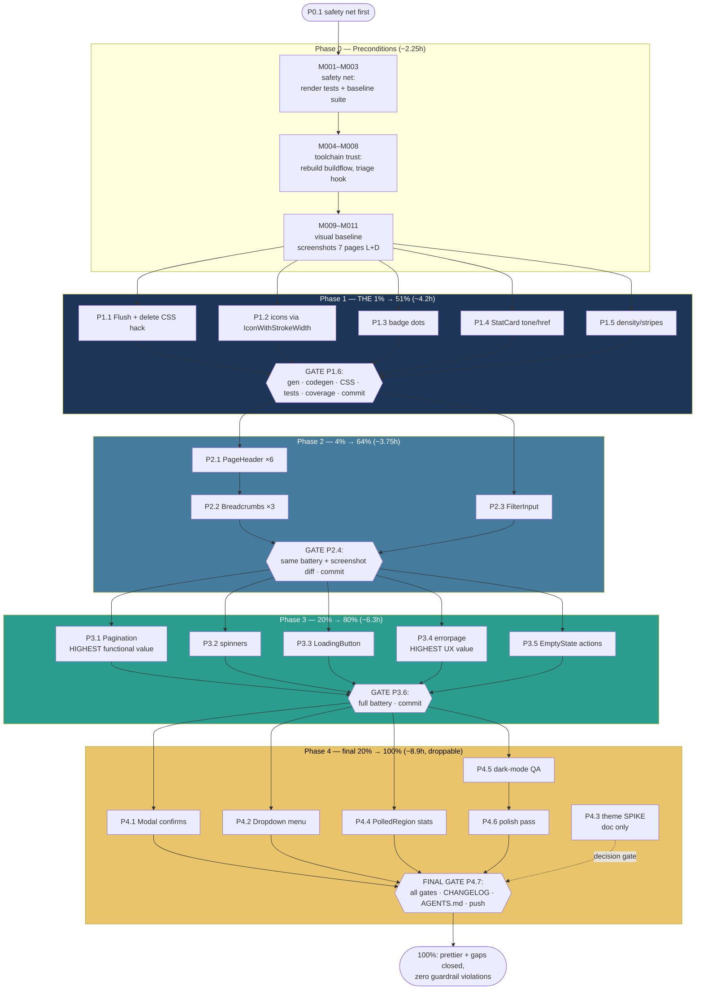

# Adminui "Even Prettier" + Gap Remediation — Pareto Execution Plan

**Date:** 2026-09-17 13:43 CEST
**Scope:** Make `adminui/` visually and interactively better ("even prettier") while closing the prioritized gaps from `docs/research/2026-09-17_templ-components-deep-dive.html` (audit score 68/100).
**Method:** Pareto breakdown (1% → 51%, 4% → 64%, 20% → 80%, rest → 100%), medium plan (30–100 min tasks, ≤27), micro plan (≤12 min tasks, ≤150). Tables sorted by importance/impact/effort/customer-value.
**Format note:** `.md` + mermaid per explicit user instruction (skill default is styled HTML + inlined D2 SVG; overridden once, not propagated).

---

## 0. Context & Guardrails (the Verschlimmbesserung contract)

adminui is a **library module** — consumers embed it. Every task below is constrained by:

| Guardrail | Rule | Enforcement |
|---|---|---|
| Theme-bridge is sacred | `tailwind.css:74–117` (`@theme` token remap + `.bg-white` bridge) is what makes library components follow adminui's palette in both modes. **Never** introduce a parallel theming mechanism; only extend the bridge. | visual diff vs baseline each phase |
| CSP-safe by construction | No inline handlers, no inline `<script>` without nonce, no `eval`. The `data-confirm` + `htmx:confirm` pattern stays unless a task explicitly replaces it. | existing csrf/nonce tests |
| Honest UI (ADR 0024 family) | No fake data for beauty: `StatCard.Change`/`Trend` render only when the handler has real period-over-period data. No decorative numbers. | code review checklist |
| Codegen discipline | `nix run .#gen` (module-dir, bare `FileName:`) is the ONLY codegen path — never repo-root `templ generate`; `nix run .#check-codegen` must stay green | per-phase gate |
| CSS rebuild discipline | Library classes are scanned via the nix `build-adminui-css` app (copies library `*.templ` to temp + `@source`). After adopting any new library component class, rebuild — or the class ships unstyled | per-phase gate |
| Library principle | No mandatory defaults consumers would disagree with; all polish is opt-in via existing `Config` fields, zero new required config | `New` tests unchanged |
| Coverage gate | adminui ≥66% (flake.nix:900). Every new render path gets a test in the same task | `nix run .#coverage-gate` |
| Error constructors banned | `errors.New`/`fmt.Errorf` stay banned; errorfamily only (util.go pattern) | golangci gate |
| No hand-rolled whacks | Fix at the component-props level; the global `!important` CSS hack is being DELETED in this program, not multiplied | P1.1 |
| Verification honesty | Gates: `nix run .#build`, `.#test`, `.#lint`, `.#coverage-gate`, `.#check-codegen`, `.#check-templates`, `.#check-modules`. `go vet` (compiles tests) per module after go.mod changes | Phase gates |

**Non-negotiable priority:** if "prettier" and "correct" ever conflict, correct wins. Prettier = better defaults, consistent hierarchy, honest feedback states — not new paint over broken behavior.

---

## 1. Pareto Breakdown — what actually moves the needle

**Result = perceived quality of all 7 admin pages (dashboard, users, user detail, tenants, tenant detail/new, members, audit) + the functional gaps closed.**

### The 1% → 51% of the result
**"Every-page component correctness sweep"** — tables, icons, badges, and stat cards are on 100% of pages.
- `Table.Flush` + delete the global `!important` hack → removes the double-border smell everywhere (F1)
- `icons.IconWithStrokeWidth` replaces `iconSVG`+`templ.Raw` → identical pixels, typed renders (F5)
- `Badge.Dot` on state badges → status dots, the single highest visual-signal-per-line item (F6-adjacent)
- `StatCard` `Tone`/`Href` enrichment → colored icon tiles + clickable drill-downs on the dashboard

*Why 51%:* these four touch every page's primary surfaces, are props-only (no layout surgery), and remove the two hacks a reviewer would flag first.

### The 4% → 64% (= 1% + hierarchy & search)
**"Page hierarchy unification"** — headers are the second thing every eye lands on.
- `display.PageHeader` ×6 with `Action` slots (F2) — consistent title row, buttons/badges live where they belong
- `navigation.Breadcrumbs` ×3 composed into PageHeader (F11)
- `forms.FilterInput` replaces the hand-rolled htmx-DSL search form (F4) — semantic `<search>`, a11y, no-JS fallback

*Why +13%:* typographic consistency + the most-used interactive surface (user search) getting the purpose-built component.

### The 20% → 80% (= 4% + feel & function)
**"Feedback states + the two structural gaps"**
- `navigation.Pagination` on users/tenants/audit (F3 — rows 51+ are unreachable today; pagination footer is also a visible polish upgrade over a truncation note)
- Loading feedback: `SkeletonCardGrid`/`Spinner` `hx-indicator` (F8) — perceived performance is the strongest "feel" lever
- `htmx.LoadingButton` on all mutating forms (F8)
- `errorpage.WriteError`/`ErrorAlert` across handlers (F10 — styled failures instead of raw text leaks)
- `EmptyState` `Action` buttons (empty pages gain a next step)

### The remaining 20% → 100% (delight lane, independently droppable)
- `display.Modal` confirmations replacing `window.confirm`
- `display.Dropdown` user menu in the header
- `htmx.PolledRegion` self-refreshing dashboard stats
- Dark-mode drift QA (unmapped `ring`/`shadow`/`focus` classes keep fixed palette values)
- `Eyebrow` overlines + focus-ring + spacing rhythm polish
- Decision spikes (docs only, no code): ThemeToggle strategy, Scrollback-for-audit
- AppShell migration: **explicitly out of scope** (report F9 says keep the paid-for hand-rolled shell; revisit only if a P4 task touches layout.templ anyway)

---

## 2. Comprehensive Plan — Medium tasks (30–100 min each, 27 tasks, sorted by priority)

Prio = importance × customer-value ÷ effort. Gates (P1.6/P2.4/P3.6) sit at phase ends; nothing skips them.

| # | Task | Pareto tier | Impact | Effort | Customer value | Depends on | Key files |
|---|------|-------------|--------|--------|----------------|------------|-----------|
| P0.1 | Verify safety net: read `seed_render_test.go`/`layout_render_test.go`, confirm golden semantics, run adminui suite baseline | P0 | H | 30m | protects everything after | — | adminui/*_test.go |
| P0.2 | Toolchain trust: rebuild buildflow binary (`nix build . && nix run .#reinstall`), re-triage hook's examples/* lint failures (real drift vs stale binary), reconcile AGENTS.md claim | P0 | H | 45m | honest gates for every commit | — | repo-level |
| P0.3 | Visual baseline: build + serve examples/admin-demo, screenshot all 7 pages light+dark into `/tmp/adminui-baseline/` (NOT committed — binary-blob rule) | P0 | M | 60m | diff reference for every phase | P0.2 | examples/admin-demo |
| P1.1 | `Table.Flush: true` on 5 Card+Table nestings; delete `.overflow-hidden > .overflow-x-auto` hack; rebuild CSS; visual diff | 1% | H | 45m | removes double borders everywhere | P0.1 | dashboard/audit/users.templ, members.templ, tailwind.css |
| P1.2 | Rewrite `icon()` as delegate to `icons.IconWithStrokeWidth(…, 1.8)`; delete `iconSVG` + `templ.Raw` (icons.go) | 1% | H | 40m | typed, escaping-safe icons; −20 LOC | P0.1 | icons.go, components.templ |
| P1.3 | Status dots: `Dot: true` on `stateBadge`/verified/totp/tenant-status badges (accent badges stay dotless) | 1% | M | 30m | glanceable states on every table | P0.1 | components.templ, tenants.templ |
| P1.4 | StatCard enrichment: `Tone` per stat, `Href` drill-downs (dashboard cards → users/tenants); `Change`/`Trend` ONLY with real handler data (honest-UI; else omitted) | 1% | H | 60m | dashboard reads as designed, cards clickable | P0.1 | components.templ, handler_dashboard.go |
| P1.5 | Table density: `CellPadding: compact` on the 4 data-heavy tables, `Striped` on audit/users | 1% | M | 30m | tighter, more "admin-tool" tables | P1.1 | *.templ |
| P1.6 | **PHASE 1 GATE:** `.#gen` + `.#check-codegen` + `build-adminui-css` + adminui tests `-race` + coverage-gate + commit | gate | H | 45m | no regression carries forward | P1.1–P1.5 | — |
| P2.1 | `display.PageHeader` on all 6 pages; "New tenant" button + status badges move into `Action` slots | 4% | H | 90m | consistent hierarchy on every page | P1.6 | *.templ |
| P2.2 | `navigation.Breadcrumbs` on 3 detail pages, composed via `PageHeader.Breadcrumb` | 4% | M | 45m | orientation on detail pages | P2.1 | users.templ, tenants.templ |
| P2.3 | `forms.FilterInput` (DebounceMS 350, Wire → `#users-table`) replaces hand-rolled search form | 4% | M | 45m | accessible search, −20 LOC of htmx DSL | P1.6 | users.templ |
| P2.4 | **PHASE 2 GATE:** same battery as P1.6 + fresh screenshots diff | gate | H | 45m | — | P2.1–P2.3 | — |
| P3.1 | `navigation.Pagination` on users/tenants/audit: `page` param parse+clamp in 3 handlers, TotalPages from `capList` total, footer in views, out-of-range handling | 20% | **HIGHEST** | 100m | rows 51+ become reachable (functional fix) | P2.4 | handler_users/tenants/audit.go, *.templ, util.go |
| P3.2 | Loading feedback: `feedback.Spinner` as `hx-indicator` on table/search swap regions | 20% | M | 60m | no silent dead-air during swaps | P2.4 | *.templ |
| P3.3 | `htmx.LoadingButton` on member add/role-set/remove + delete buttons | 20% | M | 45m | no double-submit, visible progress | P2.4 | members.templ, users.templ |
| P3.4 | `errorpage.WriteError`/`ErrorAlert` helper across the 14 error paths; kill `err.Error()` response leaks (handler_tenants.go:45,78,89,100); HTMX routes get ErrorAlert partials | 20% | **HIGHEST** | 100m | styled failures, no internal text leaks | P2.4 | handler_*.go, render.go |
| P3.5 | `EmptyState.Action` buttons (tenants: "New tenant"; users: clear-search hint) | 20% | L | 30m | empty pages gain a next step | P2.1 | components.templ, *.templ |
| P3.6 | **PHASE 3 GATE:** full battery + commit | gate | H | 45m | — | P3.1–P3.5 | — |
| P4.1 | `display.Modal` confirmations for destructive actions (delete user/tenant, remove member); remove `window.confirm` path; keep CSP-safe pattern | 100% | M | 100m | non-jarring destructive UX | P3.6 | users/tenants/members.templ, admin.js |
| P4.2 | `display.Dropdown` user menu (avatar + email + sign out) in layout header | 100% | L | 60m | cleaner header | P3.6 | layout.templ |
| P4.3 | SPIKE (doc only): ThemeToggle/ThemeScript class-strategy vs token-flip — decide, don't implement | 100% | L | 60m | informed choice, zero risk | P3.6 | docs/ |
| P4.4 | `htmx.PolledRegion` self-refreshing dashboard stats (30s) + stats partial handler | 100% | M | 60m | live dashboard | P3.6 | dashboard.templ, handler_dashboard.go |
| P4.5 | Dark-mode drift QA: sweep all pages under `prefers-color-scheme: dark`, fix unmapped ring/shadow/focus classes via the bridge | 100% | M | 60m | dark mode stops drifting | P3.6 | tailwind.css |
| P4.6 | Polish pass: `Eyebrow` trial on section headers, focus-ring consistency, spacing rhythm | 100% | L | 45m | finishing touches | P4.5 | *.templ |
| P4.7 | **FINAL GATE:** full battery (`build/test/lint/coverage-gate/check-codegen/check-templates/check-modules`), bench-spike untouched check, CHANGELOG + AGENTS.md adoption-table sync | gate | H | 90m | shippable state | all | repo-level |

**Totals:** 27 tasks, ~32.5 h medium-granularity. Phases P1–P3 = the 80% (~14.5 h). P0 (~2.25 h) protects it.

**Explicitly deferred (not in this program):** AppShell/SidebarNav migration (report F9: keep), upstream StatusBadge map patch (separate templ-components contribution; adminui keeps `badge()` until then), loginpage/dashboardui audits, train-lag dependency sweeps, TODO_LIST harvest of Tier-4+ items from the status report.

---

## 3. Detailed Breakdown — Micro tasks (≤12 min each)

Legend: ✔ = verification step inside the task. All micro tasks inherit the guardrails in §0.

### Phase 0 — Preconditions (11 micro tasks)

| # | Task (≤12 min) | From | Verify |
|---|----------------|------|--------|
| M001 | Read `seed_render_test.go` — record what it asserts (golden bytes vs smoke render) | P0.1 | notes in worklog |
| M002 | Read `layout_render_test.go` + `handler_test.go` render paths — same | P0.1 | notes |
| M003 | Run adminui suite baseline: `GOEXPERIMENT=jsonv2 go test ./... -count=1 -race` in adminui/; record pass set | P0.1 | all green |
| M004 | `nix build .` (rebuild buildflow binary at current HEAD) | P0.2 | build ok |
| M005 | `nix run .#reinstall`; confirm `buildflow --version`/doctor matches HEAD | P0.2 | no freshness warn |
| M006 | Re-run golangci-lint in examples/admin-demo + catalog-demo manually; classify: real findings vs stale-binary artifact | P0.2 | verdict recorded |
| M007 | If real findings: file them in TODO_LIST P2 (do NOT fix here — out of program scope); if artifact: note and move on | P0.2 | TODO_LIST or note |
| M008 | Update AGENTS.md "all 15 modules 0 issues" claim to current verified truth | P0.2 | claim matches reality |
| M009 | Build+run examples/admin-demo (`go run .`, :8097) | P0.3 | serves |
| M010 | Screenshot dashboard/users/user-detail/tenants/tenant-detail/tenant-new/audit, light+dark → `/tmp/adminui-baseline/` | P0.3 | 14 files |
| M011 | Screenshot members (tenant-admin mode); confirm baseline complete | P0.3 | complete set |

### Phase 1 — The 1% (24 micro tasks)

| # | Task | From | Verify |
|---|------|------|--------|
| M012 | Add `Flush: true` to dashboard recent-activity table (dashboard.templ:30) | P1.1 | renders |
| M013 | Add `Flush` to audit table (audit.templ:16) | P1.1 | renders |
| M014 | Add `Flush` to tenant-roles table (users.templ:146) | P1.1 | renders |
| M015 | Add `Flush` to external-accounts table (users.templ:204) | P1.1 | renders |
| M016 | Add `Flush` to members table (members.templ:20) | P1.1 | renders |
| M017 | Delete `.overflow-hidden > .overflow-x-auto` block (tailwind.css:110–117) + comment | P1.1 | hack gone |
| M018 | `nix run .#build-adminui-css`; diff admin-tw.css (class set should shrink) | P1.1 | no double border vs baseline |
| M019 | Rewrite `templ icon(name)` in components.templ → `@icons.IconWithStrokeWidth(icons.Name(name), "h-[18px] w-[18px]", 1.8)` | P1.2 | compiles |
| M020 | Delete `iconSVG()` from icons.go; keep typed nav-icon constants | P1.2 | `go build` |
| M021 | Screenshot icon spots vs baseline (sidebar, buttons, search) — confirm parity at stroke 1.8 | P1.2 | pixels match |
| M022 | Add `Dot: true` inside `stateBadge` (verified/totp badges) | P1.3 | renders |
| M023 | Add dots to tenant-status badge calls (active/suspended/deleted in tenants.templ ×2 sites) | P1.3 | renders |
| M024 | Confirm accent badges (audit/dashboard action) stay dotless; visual check | P1.3 | consistent |
| M025 | Map dashboard stats to `StatTone` (users→blue, tenants→purple, audit-volume→green — no red unless failure metric) | P1.4 | tasteful |
| M026 | Add `Href` to dashboard StatCards (users→/users, tenants→/tenants) + `Class: no-underline` | P1.4 | clickable |
| M027 | Decide Change/Trend: check handler_dashboard for period data; if none, document omission (honest UI) in components.templ comment | P1.4 | decision recorded |
| M028 | user-detail StatCards: keep value-only (no fake trends); add Tone where semantically safe | P1.4 | renders |
| M029 | `CellPadding: compact` on users/tenants/members/audit tables | P1.5 | denser rows |
| M030 | `Striped: true` on audit + users tables | P1.5 | renders |
| M031 | `nix run .#gen` + `nix run .#check-codegen` | P1.6 | no drift |
| M032 | Rebuild CSS; screenshot all pages vs baseline; note intended diffs | P1.6 | diffs = plan only |
| M033 | adminui tests `-race` + `nix run .#coverage-gate` (adminui ≥66) | P1.6 | green |
| M034 | Commit Phase 1 (detailed message: Flush, icons, dots, StatCard, density) | P1.6 | committed |

### Phase 2 — The 4% (16 micro tasks)

| # | Task | From | Verify |
|---|------|------|--------|
| M035 | users.templ: PageHeader(Title "Users", Action nil) replaces header div | P2.1 | renders |
| M036 | tenants.templ list: PageHeader + "New tenant" Button into `Action` | P2.1 | renders |
| M037 | tenants.templ new: PageHeader(Breadcrumb placeholder, Title "New tenant") | P2.1 | renders |
| M038 | tenants.templ detail: PageHeader + status Badge into `Action` | P2.1 | renders |
| M039 | audit.templ: PageHeader("Audit log") | P2.1 | renders |
| M040 | members.templ: tenantHeader → PageHeader pattern | P2.1 | renders |
| M041 | Breadcrumbs user detail: Users / {email}; wire via PageHeader.Breadcrumb | P2.2 | renders |
| M042 | Breadcrumbs tenant detail: Tenants / {name} | P2.2 | renders |
| M043 | Breadcrumbs tenant new: Tenants / New | P2.2 | renders |
| M044 | Remove the 3 hand-rolled "← Back" rows now covered by breadcrumbs | P2.2 | −3 divs |
| M045 | Replace users search form with `forms.FilterInput` (Name q, Value d.Search, DebounceMS 350, Wire URL+Target #users-table) | P2.3 | swaps table |
| M046 | Decide icon-in-search: accept library look (no icon) vs wrap — record decision | P2.3 | decision |
| M047 | Confirm no-JS fallback (form GET to users URL) + aria-label present | P2.3 | a11y check |
| M048 | Phase-2 gate: gen + check-codegen + CSS rebuild + screenshot diff | P2.4 | intended diffs only |
| M049 | Phase-2 gate: tests `-race` + coverage-gate | P2.4 | green |
| M050 | Commit Phase 2 | P2.4 | committed |

### Phase 3 — The 20% (28 micro tasks)

| # | Task | From | Verify |
|---|------|------|--------|
| M051 | util.go: add `pageBounds(page, total int) (offset, limit, totalPages, clamped int)` helper | P3.1 | unit test |
| M052 | Write helper tests: page 0/negative, beyond range, exact fit, single page | P3.1 | green |
| M053 | handler_users list: parse `page` query, clamp, slice via helper, pass pagination data | P3.1 | manual curl |
| M054 | users.templ: render `navigation.Pagination` footer (BasePath+"/users", QueryParam page) | P3.1 | renders |
| M055 | handler_tenants list: same page plumbing | P3.1 | curl |
| M056 | tenants.templ: pagination footer | P3.1 | renders |
| M057 | handler_audit + audit.templ: page plumbing + footer | P3.1 | curl |
| M058 | HTMX interplay: pagination links must full-navigate or hx-target the list — pick and wire consistently (decision + impl) | P3.1 | behavior test |
| M059 | Edge tests: empty list, ≤1 page, page beyond range clamps, search+page combo | P3.1 | green |
| M060 | Commit pagination unit (it's the biggest functional fix — own commit) | P3.1 | committed |
| M061 | Add `feedback.Spinner` import + `hx-indicator` span inside users-table region | P3.2 | renders |
| M062 | Wire indicator classes (tailwind.css `.htmx-indicator` rules already exist — confirm) | P3.2 | spins during swap |
| M063 | Same indicator pattern on tenants + audit lists | P3.2 | renders |
| M064 | Spinner on member add/remove/role forms region | P3.2 | renders |
| M065 | `htmx.LoadingButton` on member "Add member" submit | P3.3 | disabled while pending |
| M066 | LoadingButton on role "Set" buttons (per-row) | P3.3 | renders |
| M067 | LoadingButton pattern on delete/unlink/suspend/reactivate buttons | P3.3 | renders |
| M068 | Check button double-submit protection (hx-disabled-elt or LoadingButton semantics) | P3.3 | no double POST in devtools |
| M069 | render.go: add `renderError(w, r, err, nonce)` — HTMX → `errorpage.ErrorAlert` partial; full → `errorpage.WriteError` | P3.4 | compiles |
| M070 | Map adminui family errors → user-safe messages (no `err.Error()` passthrough) — message table in handler layer | P3.4 | table in code |
| M071 | Replace handler_users error sites (5) with renderError | P3.4 | manual 400 check |
| M072 | Replace handler_tenants sites (6) — kills the raw-leak lines | P3.4 | leak gone (grep) |
| M073 | Replace handler_members sites (2) + render.go render-page failure path | P3.4 | renders |
| M074 | Tests: 400/404/500 paths return themed HTML; HTMX paths return ErrorAlert; assert no raw err text in bodies | P3.4 | green |
| M075 | EmptyState Action: tenants empty → "New tenant" button | P3.5 | renders |
| M076 | EmptyState Action: users empty + search active → clear-search link | P3.5 | renders |
| M077 | Phase-3 gate: gen/CSS/tests/coverage + screenshots + commit | P3.6 | green, committed |

### Phase 4 — Delight lane (21 micro tasks, each independently droppable)

| # | Task | From | Verify |
|---|------|------|--------|
| M078 | Spike modal: read display/modal.templ props (native dialog, focus trap); write usage note | P4.1 | notes |
| M079 | Build `confirmModal` templ wrapper (title, body, confirm/cancel; nonce-safe) | P4.1 | renders |
| M080 | Wire user-delete to modal (remove hx-confirm+data-confirm pair on that button) | P4.1 | flow works |
| M081 | Wire tenant delete/suspend/reactivate to modal | P4.1 | flow works |
| M082 | Wire member-remove + external-account unlink to modal | P4.1 | flow works |
| M083 | Prune admin.js `htmx:confirm` listener if fully migrated; keep if any hx-confirm remains | P4.1 | no dead JS |
| M084 | Modal tests: render + handler still rejects without JS (server-side confirm path unchanged) | P4.1 | green |
| M085 | Dropdown user menu in layout.templ (avatar+email trigger; items: sign out) | P4.2 | renders |
| M086 | Mobile check: keep plain sign-out link visible on small screens (dropdown alternative) | P4.2 | responsive ok |
| M087 | Dropdown tests + screenshot vs baseline | P4.2 | green |
| M088 | ThemeToggle spike doc: class-strategy (`dark:`) vs current token-flip — migration cost, risk to bridge; recommendation | P4.3 | doc written |
| M089 | Get user sign-off on theme strategy BEFORE any code (guardrail) | P4.3 | decision recorded |
| M090 | dashboard.templ: wrap stats grid in `htmx.PolledRegion` (URL stats-partial, Every 30s, ShowTimestamp) | P4.4 | renders |
| M091 | handler_dashboard: stats-partial endpoint returning `dashboardContent` fragment (session-gated like the page) | P4.4 | curl 200/401 |
| M092 | Decide poll vs existing SSE (sync-bar) overlap — document in ADR-lite comment | P4.4 | decision |
| M093 | PolledRegion tests (partial render, auth gate) | P4.4 | green |
| M094 | Dark sweep: devtools `prefers-color-scheme: dark` on all 7 pages; list drift (ring/shadow/focus/classes) | P4.5 | drift list |
| M095 | Extend `@theme` bridge tokens for each drifted color (never per-component dark: hacks) | P4.5 | drift list shrinks |
| M096 | Screenshot diff dark vs baseline; confirm parity | P4.5 | visual ok |
| M097 | Eyebrow trial on "Danger zone" + section headers; focus-ring consistency pass (library focus classes vs hand-rolled hover styles); spacing rhythm tweaks | P4.6 | subtle, revert if worse |
| M098 | FINAL GATE part 1: `nix run .#build` + `.#test` + `.#lint` + `.#coverage-gate` | P4.7 | all green |
| M099 | FINAL GATE part 2: `.#check-codegen` + `.#check-templates` + `.#check-modules` + bench-spike "paths untouched" confirm | P4.7 | all green |
| M100 | CHANGELOG entry (Unreleased/Changed: adminui visual + gap remediation) + AGENTS.md adoption-table rows updated (PageHeader, FilterInput, Pagination, errorpage, Modal, Dropdown, PolledRegion = adopted) | P4.7 | docs true |
| M101 | Final commit + push (explicitly requested) | P4.7 | pushed |

**Total: 101 micro tasks** (within the ≤150 cap; 17.5 h of ≤12-min units reconciling with §2's 32.5 h — micro tasks exclude the 30–100 min tasks' thinking/review overhead, which is intentional: §2 is the commitment list, §3 the execution checklist).

---

## 4. Execution Graph

**Parallelization:** within a phase, tasks with no shared files run in parallel (e.g., P1.1 tables ∥ P1.2 icons ∥ P1.3 badges). Gates are strictly serial. P4 items are independent — ship any subset.

**Rollback rule:** any phase whose screenshot diff shows unintended visual change → revert that micro task's files only (`git restore` on own changes), never push through.

---

## 5. Definition of Done (program level)

- [ ] All gates green: build, test(-race), lint 0 issues, coverage-gate (adminui ≥66%), check-codegen, check-templates, check-modules
- [ ] `git grep -n "templ.Raw" adminui/` → only pre-existing justified uses (icon one deleted)
- [ ] `git grep -n "!important" adminui/tailwind.css` → the table hack line gone
- [ ] `git grep -n "err.Error(), http" adminui/` → zero response-path hits
- [ ] Rows beyond 50 reachable via pagination on all 3 list pages
- [ ] Every page renders correctly under light AND dark (screenshot diff clean)
- [ ] AGENTS.md adoption table reflects post-program truth; CHANGELOG updated
- [ ] Zero new `Config` required fields; zero CSP regressions; zero `encoding/json` depguard violations

## 6. Risk register

| Risk | Mitigation |
|---|---|
| Tailwind scan misses new library classes → unstyled UI | CSS rebuild inside every gate; screenshot diff catches |
| Pagination breaks HTMX partial flow (users table swap) | M058 dedicated decision+test; pagination links default to full navigation unless explicitly wired |
| Modal migration loses the server-side reject path (no-JS) | M084: server-side behavior unchanged; modal is progressive enhancement |
| ThemeToggle spike seduces into code | M089 hard sign-off gate; P4.3 is doc-only by definition |
| Daemon commits half-done work mid-task | Commit per micro-task cluster (M034/M050/M060/M077/M101 are cluster boundaries); re-check `git status` before each `git add` |
| Coverage dips below 66 from deleted helper code | Each delete task pairs with render assertions; gate at every phase |

---

*Plan authored 2026-09-17 13:43 CEST from the 2026-09-17 deep-dive audit (`docs/research/2026-09-17_templ-components-deep-dive.html`) + status report (`docs/status/2026-09-17_13-11_templ-components-deep-dive-session-status.md`). Point-in-time artifact; harvest items 1–15 into TODO_LIST.md when execution is approved.*
