# Plan: v4.11.0 Family Release Train — Pareto Execution

> **Created:** 2026-09-19 17:24 CEST · **Author:** release-train session · **Status:** READY FOR EXECUTION
> **Mission:** cut the next cqrs-htmx coordinated family train (**v4.11.0**, 13 tags) safely under the release playbook, under the new Go 1.27.1 fleet floor, and leave the repo fully coherent afterwards (dev-replaces stripped, CI green, docs current).
> **Companion snapshot:** [status report 16:42](../status/archived/2026-09-19_16-42_v4.11.0-train-prep-session.md) (read its §(d) — two session mistakes, both root-caused, both recovery-pathed here).

---

## 0. Ground truth (re-derived 2026-09-19 ~17:30)

| Fact | Value |
| --- | --- |
| Phase A commit | `e425d980` (Go 1.27.1 fleet bump + lag sweep + 3 CI fixes) — committed, hook-green, **UNPUSHED** |
| Target version | **v4.11.0** for the whole family (dashboardui already at v4.10.1 → next coordinated number; MINOR: new APIs `HubReadinessCheck`, `ServiceConfig.CommandMiddleware`, adminui shell migration) |
| Tags to cut (13) | identity-model, root, usermgmt, totp, webauthn, oauth2, datastar, health, auditlog, adminui, loginpage, dashboardui, setup |
| NOT tagged | systemadapter (blocked: upstream `metaengine/projectionadapter v4.5.0` unpublished; sibling replace stays) |
| Lag sweep | DONE in `e425d980`: go-etag v0.4.0 ×22, catalog v4.4.0 ×2, badgerengine v4.2.1 → `check-release-train` 0 unpublished / 0 lag |
| CI | master RED (4 jobs) at run 35436068847; 3 jobs fixed in `e425d980` (hook self-test lib copy, coverage `cd <module>`, golangci v2.13.2); `module-architecture` fix is *assumed* by the toolchain bump — verify on push |
| ⚠️ Dirty state | 27 go.mods staged/modified with **66 garbage require lines** (`…/adminui/v v4.11.0`, `…/usermgmt/oauth v4.11.0`, truncated at `v` — regex `[a-z/-]` lacked digits). NOT committed. File list: `/tmp/staged.txt`. Recovery = restore those exact files to HEAD (own verified-garbage changes), then re-apply the bump correctly (task M1). |
| Tag protocol | ONLY `scripts/verify-tag.sh <dir> <version> [--push]`; family dev-replaces must be OUT of any tagged tree; commit before tag; never tag red CI |
| Order (require graph) | identity-model → root → usermgmt → totp/webauthn/oauth2 → datastar → health → auditlog → adminui → loginpage → dashboardui → setup |
| Post-tag strip | setup ×2, integration_test ×2, systemadapter ×3 family dev-replaces (keep systemadapter's projectionadapter sibling replace) |

### Verschlimmbessern guards (non-negotiable)

1. **Never raw `git tag`** — verify-tag only. `--dry-run` first per module.
2. **Commit BEFORE tag; tags point at commits.** Every phase commit happens inside `nix develop -c git commit …` (the hook needs Go 1.27.1; outside-shell commits fail and feed the daemon race).
3. **No `go mod tidy` on submodules before their tags are pushed** (chicken-and-egg) — `go mod edit` only; tidy comes post-push hermetically.
4. **No script without a post-condition check** (grep asserting the expected state) — the two incidents this week were both silent no-op/corrupt one-liners.
5. **Never tag while CI is red** — push master, watch CI green, then tag.
6. **The daemon owns the index lock sometimes** — if `.git/index.lock` exists, WAIT, never delete it; if the daemon commits staged garbage, fix forward (documented, recoverable).

---

## 1. Pareto breakdown

### 1% that delivers 51% — "the tags exist correctly"

**Recover the corrupted go.mods, bump all internal requires to v4.11.0 correctly, cut the CHANGELOGs, commit, push, CI-green, then run the 13 verify-tag cuts in dependency order.** Without exactly this, there is no release; with exactly this, consumers can `go get` every module at v4.11.0. (~6 of ~30 hours of total work → the majority of the value.)

- Micro-kernel: fix regex (`cqrs-htmx/[a-z0-9/-]+`), `go mod edit -require=<full-path>@v4.11.0` per module, post-condition grep (0 truncated paths, 0 stale family versions), commit in devShell, push, watch CI, 13× `verify-tag --push`.

### 4% that delivers 64% — "…and the release is provably safe"

Add the full verification battery under the NEW toolchain (first Go 1.27 run of the whole repo): workspace build/vet, `.#build` `.#test` `.#lint`, coverage-gate, cqrs-lint, command bijection, release-train `--refresh-cache` (0 unpublished / 0 lag / 1 replace-exempt). This converts "tags exist" into "tags are correct and green everywhere" — the difference between a release and a liability.

### 20% that delivers 80% — "…and the repo is coherent afterwards"

Add the post-train convergence: strip the 7 TEMPORARY family dev-replaces (setup ×2, integration_test ×2, systemadapter ×3), hermetic re-verify per stripped module, systemadapter + examples/system-demo require alignment, `examples/basic` manual-enrichment cleanup (the staged NOTE comment), post-strip full gates, post-train CHANGELOG entries. Without this the NEXT train starts from the same replace-debt.

### The rest to 100%

Hygiene + forward routing: AGENTS.md toolchain truth (Go 1.27.1 row, tug-of-war entries closed, three new gotchas), TODO_LIST sync (line-26 train checklist resolved into CHANGELOG; header), runbook §7 stage-floor table, module CHANGELOG drift stubs (adminui/loginpage/identity-model), pkg.go.dev + clean-dir `go get` spot-checks, docs-freshness sweep, bench-spike idle re-run (audit chain ~275 ns may trip the 10% gate → re-pin per policy), routing of non-train items (templ-components v1.19 prep, systemadapter upstream blocker, `requestContextEnricher` upstream ask, `docs/screenshots/` decision).

---

## 2. Comprehensive plan — MEDIUM tasks (30–100 min each, sorted by impact/effort)

| # | Task | Outcome | Est | Impact | Effort |
| --- | --- | --- | --- | --- | --- |
| M1 | **Reconcile + bump requires to v4.11.0** — restore 27 garbage go.mods to HEAD; scripted `go mod edit` with full paths; post-condition greps | Every internal require at exactly `v4.11.0`; zero truncated paths | 45m | ★★★ | Low |
| M2 | **Root CHANGELOG cut** — `[v4.11.0] - 2026-09-19` from Unreleased (note intra-window v4.10.x sub-trains) + fresh empty Unreleased | Release notes exist; consumers see history | 60m | ★★★ | Med |
| M3 | **Module CHANGELOGs I** — usermgmt (move MaxUsers → `[v4.10.0]`, write `[v4.11.0]` audit-chain section), dashboardui cut, datastar cut | Honest per-module history | 60m | ★★ | Med |
| M4 | **Module CHANGELOGs II** — adminui `[v4.11.0]` + v4.8–v4.10 stub, loginpage `[v4.11.0]` + stub, identity-model `[v4.11.0]` | Drift ended at this train | 45m | ★★ | Med |
| M5 | **Phase B commit** — workspace build+vet, then `nix develop -c git commit` (detailed message) | Green boundary commit; taggable tree | 30m | ★★★ | Low |
| M6 | **Full battery under go_1_27** — `.#build`, `.#test` (all suites), `.#lint` (15 modules) | First 1.27 proof repo-wide | 90m | ★★★ | Med |
| M7 | **Secondary gates** — coverage-gate (15/15), check-cqrs-lint, command bijection, test-fuzz/test-flake | No quiet regressions from jsonv2/1.27 semantics | 60m | ★★ | Med |
| M8 | **Push master + CI watch** — all jobs green; `module-architecture` acceptance test of the toolchain fix | Red-master healed; tag gate open | 40m | ★★★ | Low |
| M9 | **Tag rehearsal** — `git ls-remote` re-derivation + `verify-tag --dry-run` ×13 | No surprises at cut time | 30m | ★★ | Low |
| M10 | **Cut tier 1** — identity-model, root, usermgmt, totp, webauthn, oauth2 → `--push` each | Leaves + aggregates published | 40m | ★★★ | Low |
| M11 | **Cut tier 2** — datastar, health, auditlog, adminui, loginpage, dashboardui → `--push` | UI/bridge modules published | 30m | ★★★ | Low |
| M12 | **Cut tier 3 + train check** — setup `--push`; `check-release-train --refresh-cache` (expect 0/0/1-exempt); proxy spot-check | Train complete | 30m | ★★★ | Low |
| M13 | **Strip replaces (setup, integration_test)** — remove 4 dev-replaces, hermetic tidy/build/vet/test each | Aggregates hermetic on published tags | 45m | ★★ | Med |
| M14 | **Strip replaces (systemadapter)** — remove 3 family replaces (KEEP projectionadapter + comment), bump systemadapter + examples/system-demo requires, hermetic verify | Only the upstream-blocked replace remains | 45m | ★★ | Med |
| M15 | **examples/basic cleanup** — drop manual `ApplyOptions(CommandOptionsFromContext(…))`, rewrite NOTE | Example matches the shipped auto-enrichment | 30m | ★ | Low |
| M16 | **Post-strip gates** — `check-modules --report`, build/test re-run | Repo converges on published tags | 60m | ★★ | Med |
| M17 | **Strip-phase commit + CHANGELOG entries** — post-train notes (strips, basic cleanup) in root+module CHANGELOGs; commit in devShell | Phase boundary preserved | 30m | ★★ | Low |
| M18 | **bench-spike idle re-run** — if audit-chain trips 10%: `--save-baseline` + baseline commit in same change | Perf posture honest post-M2-middleware | 45m | ★★ | Med |
| M19 | **Docs truth sweep** — AGENTS.md (Go 1.27.1 row, tug-of-war closed, 3 new gotchas), TODO_LIST sync, runbook §7 stage floor | Institutional memory matches reality | 60m | ★★ | Med |
| M20 | **Consumer verification** — pkg.go.dev spot-checks ×13, clean-dir `go get` root+setup, retraction status unchanged | Release usable, not just tagged | 30m | ★★ | Low |
| M21 | **docs-freshness sweep** — run gate, fix flags (Go version refs in README/guides/templates) | No stale-1.26 claims ship | 30m | ★ | Low |
| M22 | **Route non-train items** — TODO_LIST entries: templ v1.19 prep, systemadapter upstream blocker (stays P1), enricher upstream ask, `docs/screenshots/` decision | Nothing silently dropped | 30m | ★ | Low |

Totals: 22 medium tasks ≈ 15.5 h.

---

## 3. Fine breakdown — MICRO tasks (≤12 min each, execution order)

| # | Task | From | Est |
| --- | --- | --- | --- |
| 1 | Wait for git-lock; restore the 27 garbage go.mods to HEAD (`git restore --staged --worktree -- $(cat /tmp/staged.txt)`); verify `git status` clean | M1 | 8m |
| 2 | Write `scripts/tmp-bump-requires.sh`: loop go.mods (excluding testdata), grep full paths `cqrs-htmx/[a-z0-9/-]+`, `go mod edit -require=<mod>@v4.11.0`, `rc=$?` per call | M1 | 10m |
| 3 | Run script; post-condition: `grep -c 'cqrs-htmx[^ ]* v4.11.0'` matches expected per-module counts AND zero `v4.9.0\|v4.10.` internal requires AND zero `/v v4.11.0` truncated paths | M1 | 10m |
| 4 | Root go.mod sanity: module line + go directive + no internal requires (root has none) | M1 | 5m |
| 5 | Read root CHANGELOG `[Unreleased]` in full (no truncation this time) | M2 | 10m |
| 6 | Cut `[v4.11.0] - 2026-09-19` — move entries, add one-line note that usermgmt/loginpage v4.10.0 + dashboardui v4.10.x shipped inside this window | M2 | 30m |
| 7 | Write fresh empty `[Unreleased]` (Added/Changed/Fixed placeholders) | M2 | 5m |
| 8 | usermgmt CHANGELOG: create `[v4.10.0] - 2026-09-10`, move MaxUsers/OAuth2-cap/mutex entries into it | M3 | 12m |
| 9 | usermgmt CHANGELOG `[v4.11.0]`: audit chain, `ServiceConfig.CommandMiddleware`, `ValidateCommand`, dispatcher Close, batch-import gate, idempotency test | M3 | 12m |
| 10 | dashboardui CHANGELOG: cut `[v4.11.0]` from Unreleased (CSP slider fix, forms.Input filters, render benches, a11y pins) | M3 | 10m |
| 11 | datastar CHANGELOG: cut `[v4.11.0]` (Broadcaster upstream move, hub embedding, deprecated facade) | M3 | 10m |
| 12 | adminui CHANGELOG `[v4.11.0]` (core-shell, errorpage, audit emails, dark/sidebar fixes) + one-line v4.8.0–v4.10.0 pointer stub | M4 | 12m |
| 13 | loginpage CHANGELOG `[v4.11.0]` (templ canonicality revert) + drift stub | M4 | 8m |
| 14 | identity-model CHANGELOG `[v4.11.0]` (dep-bump carrier: branded-id v0.6.0, codec v0.3.0) | M4 | 8m |
| 15 | Workspace `go build ./...` + `go vet ./...` (GOTOOLCHAIN=go1.27.1) — hermetic WILL fail on unpublished v4.11.0: expected, do not "fix" | M5 | 10m |
| 16 | `git status` review → `nix develop -c git commit` Phase B (detailed message: requires, CHANGELOGs, incident recovery) | M5 | 12m |
| 17 | `nix run .#build` (hermetic, all modules) | M6 | 15m |
| 18 | `nix run .#test` — full suites; watch jsonv2-golden tests specifically | M6 | 45m |
| 19 | `nix run .#lint` — 15 modules at 0 issues | M6 | 25m |
| 20 | `nix run .#coverage-gate` — 15/15; if thresholds shifted under 1.27: investigate, re-baseline honestly in-train | M7 | 30m |
| 21 | `nix run .#check-cqrs-lint` + `bash scripts/check-command-bijection.sh` | M7 | 12m |
| 22 | `nix run .#test-fuzz` + `.#test-flake` (time-boxed; failures = investigate, not skip) | M7 | 12m |
| 23 | `git push origin master` | M8 | 5m |
| 24 | Watch CI: checks/build/test/lint/module-architecture/release-train all green | M8 | 25m |
| 25 | If module-architecture red: pull fresh log, diagnose exit-2 properly (no assumptions) | M8 | 12m |
| 26 | `git ls-remote` per family repo — re-derive current max tags (playbook rule 3) | M9 | 10m |
| 27 | `scripts/verify-tag.sh <dir> v4.11.0 --dry-run` ×13 — all guards green | M9 | 15m |
| 28 | `verify-tag.sh identity-model v4.11.0 --push` | M10 | 5m |
| 29 | `verify-tag.sh . v4.11.0 --push` (root) | M10 | 5m |
| 30 | `verify-tag.sh usermgmt v4.11.0 --push` | M10 | 5m |
| 31 | `verify-tag.sh usermgmt/totp v4.11.0 --push` | M10 | 5m |
| 32 | `verify-tag.sh usermgmt/webauthn v4.11.0 --push` | M10 | 5m |
| 33 | `verify-tag.sh usermgmt/oauth2 v4.11.0 --push` | M10 | 5m |
| 34 | `verify-tag.sh datastar v4.11.0 --push` | M11 | 5m |
| 35 | `verify-tag.sh health v4.11.0 --push` | M11 | 5m |
| 36 | `verify-tag.sh auditlog v4.11.0 --push` | M11 | 5m |
| 37 | `verify-tag.sh adminui v4.11.0 --push` | M11 | 5m |
| 38 | `verify-tag.sh loginpage v4.11.0 --push` | M11 | 5m |
| 39 | `verify-tag.sh dashboardui v4.11.0 --push` | M11 | 5m |
| 40 | `verify-tag.sh setup v4.11.0 --push` | M12 | 5m |
| 41 | `nix run .#check-release-train -- --refresh-cache` → assert `0 unpublished / 0 lag / 1 replace-exempt` | M12 | 10m |
| 42 | Proxy spot: `go list -m -versions github.com/larsartmann/cqrs-htmx/v4` shows v4.11.0 | M12 | 5m |
| 43 | setup/go.mod: remove 2 family dev-replaces (+ their comments) | M13 | 10m |
| 44 | setup hermetic: `GOWORK=off` tidy → build → vet → test | M13 | 12m |
| 45 | integration_test/go.mod: remove datastar + usermgmt dev-replaces | M13 | 10m |
| 46 | integration_test hermetic verify | M13 | 12m |
| 47 | systemadapter/go.mod: remove 3 family replaces; KEEP projectionadapter replace + removal-condition comment | M14 | 8m |
| 48 | Bump systemadapter + examples/system-demo internal requires → v4.11.0 (replace-exempt path) | M14 | 10m |
| 49 | systemadapter + examples/system-demo hermetic verify | M14 | 12m |
| 50 | examples/basic: delete manual `core.ApplyOptions(cqrshtmx.CommandOptionsFromContext(…))` line; rewrite NOTE comment (auto-enrichment since root v4.11.0) | M15 | 10m |
| 51 | examples/basic hermetic build + vet + test | M15 | 8m |
| 52 | `nix run .#check-modules -- --report` — all stages green (drift skips replace-exempt) | M16 | 20m |
| 53 | `nix run .#build` + `.#test` re-run post-strip | M16 | 30m |
| 54 | Root + module CHANGELOGs: post-train entries (strips landed, basic cleanup, systemadapter exemption remains) | M17 | 15m |
| 55 | `nix develop -c git commit` strip phase (detailed message) | M17 | 10m |
| 56 | Check machine load (`BENCH_MAX_LOAD` rule); `nix run .#bench-spike` | M18 | 25m |
| 57 | If gate trips: `--save-baseline` + commit `docs/benchmarks/setup-baseline.raw.txt` in same change | M18 | 15m |
| 58 | AGENTS.md: Quick Reference Go row → 1.27.1; tug-of-war entries → RESOLVED (coordinated bump 2026-09-19, ref e425d980) | M19 | 12m |
| 59 | AGENTS.md: add gotchas — (a) go-etag v0.4.0 floor ⇒ 1.27.1, (b) commit only inside devShell post-bump, (c) go1.27 cover resolves profile packages via module context ⇒ `cd <module>` in CI | M19 | 12m |
| 60 | TODO_LIST: resolve line-26 checklist items (tag-first → done; basic cleanup → done; gates re-run → done), update header line | M19 | 12m |
| 61 | runbook: §7 stage-floor table update + §0-style EXECUTED banner with deltas | M19 | 10m |
| 62 | pkg.go.dev `/fetch/<module>@v4.11.0` ×13 + license/docs render spot | M20 | 15m |
| 63 | Clean-dir `go mod init t && go get github.com/larsartmann/cqrs-htmx/v4@v4.11.0` + setup/v4 | M20 | 10m |
| 64 | `nix run .#check-docs-freshness`; fix flags (Go 1.26.7 refs) | M21 | 15m |
| 65 | Annotate status report 16:42 with the corrected root cause (regex digits) + recovery | M22 | 8m |
| 66 | TODO_LIST routing: templ-components v1.19 prep (N28), systemadapter blocker (stays), enricher upstream ask, `docs/screenshots/` decision | M22 | 12m |
| 67 | Final `git push origin master` (strip phase + hygiene) | M22 | 5m |

Totals: 67 micro tasks ≈ 10.4 h hands-on (+ tool wall-time).

---

## 4. Execution graph

```mermaid
flowchart TD
    subgraph RECOVER["Phase B-fix · recover + bump"]
        T1["1-4: restore garbage go.mods,<br/>scripted require bump → v4.11.0"]
    end
    subgraph DOCS["Phase B · release notes"]
        T2["5-7: root CHANGELOG cut"]
        T3["8-11: usermgmt/dashboardui/datastar"]
        T4["12-14: adminui/loginpage/identity-model"]
    end
    subgraph LOCAL["Phase C · prove it locally"]
        T5["15-16: Phase B commit (devShell)"]
        T6["17-19: build · test · lint"]
        T7["20-22: coverage · cqrs-lint · bijection · fuzz/flake"]
    end
    subgraph SHIP["Phase D · push + 13 tags"]
        T8["23-25: push master, CI green"]
        T9["26-27: ls-remote + dry-runs"]
        T10["28-33: tier 1 tags"]
        T11["34-39: tier 2 tags"]
        T12["40-42: setup tag + train check 0/0/1"]
    end
    subgraph CONVERGE["Phase E · converge repo"]
        T13["43-46: strip setup + integration_test"]
        T14["47-49: strip systemadapter + align"]
        T15["50-51: examples/basic cleanup"]
        T16["52-55: post-strip gates + commit"]
    end
    subgraph HYGIENE["Phase F · truth + routing"]
        T17["56-57: bench-spike"]
        T18["58-61: AGENTS/TODO/runbook truth"]
        T19["62-64: consumer + docs verification"]
        T20["65-67: annotate, route, final push"]
    end

    T1 --> T2 --> T3 --> T4 --> T5 --> T6 --> T7 --> T8 --> T9
    T9 --> T10 --> T11 --> T12 --> T13 --> T14 --> T15 --> T16
    T16 --> T17 --> T18 --> T19 --> T20

    style T1 fill:#ff8c8c,stroke:#333,color:#000
    style T8 fill:#ffd479,stroke:#333,color:#000
    style T10 fill:#8ce99a,stroke:#333,color:#000
    style T12 fill:#8ce99a,stroke:#333,color:#000
```

Parallelizable: T3/T4 (independent files), T17 (needs idle machine, can wait), T18/T19/T20 (post-green, independent).

---

## 5. Risk register

| Risk | Mitigation |
| --- | --- |
| Daemon commits the staged garbage before task 1 runs | Accept: heuristic commit of garbage; fix-forward (task 1 then restores to that commit's parent content via `go mod edit -droprequire` sweep instead of git restore). No tag is near this state — zero proxy risk. |
| Coverage thresholds shift under Go 1.27 | Task 20 investigates BEFORE tagging; honest re-baseline inside the train commit; never silent loosening. |
| `module-architecture` CI exit-2 survives the toolchain fix | Task 25: fresh-log diagnosis; tag gate stays CLOSED until green. |
| go.work replaces make workspace builds 1.27-hostile on other machines | flake now ships go_1_27 (Phase A); document in AGENTS.md (task 59). |
| Tag TTL gotcha — freshly pushed tags read UNPUBLISHED | Task 41 uses `-- --refresh-cache` explicitly. |
| verify-tag refuses (uncommitted tree, replaces, unpublished require) | dry-runs (task 27) surface everything before any push; each guard has a documented remedy. |
