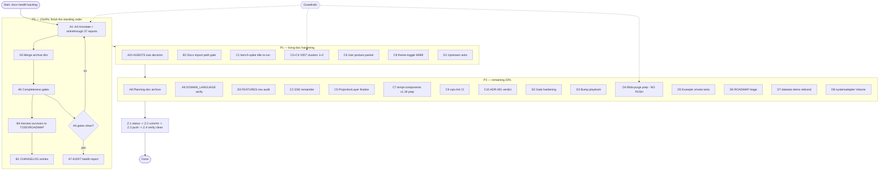

# SUPERB Plan — Docs-Health Completion + Backlog Execution (2026-09-20 15:43)

> **Status:** PLAN — awaiting go-ahead before execution.
> **Author:** Crush (session 2026-09-20 15:37 docs-health AUDIT).
> **Companion report:** `docs/status/2026-09-20_15-37_docs-health-audit-living-docs-refresh.md`.
> **Governing rule:** DO NOT VERSCHLIMMBESSERN. Every change is verified, atomic, and reversible; no repo-wide `--fix`; no destructive git ops without an explicit user call.

---

## 0. Context (why this plan exists)

The 2026-09-20 docs-health session repaired the six living docs and found two **real consumer-facing bugs** (README install/import paths missing `/v4`; a stale Go badge). It did **not** finish the standing order: the ANNOTATE + ARCHIVE half of the docs-health skill.

Current verified state (measured 2026-09-20):

| Fact                 | Value                                                                                     |
| -------------------- | ----------------------------------------------------------------------------------------- |
| Version              | v4.11.0 family train (2026-09-19) + `systemadapter/v4.11.0` first tag (2026-09-20)        |
| Modules in `go.work` | 28                                                                                        |
| Coverage gates       | 15/15 green (`nix run .#coverage-gate`)                                                    |
| Lint                 | 0 issues / 15 modules                                                                     |
| Train lag            | ZERO (`check-release-train` 0/0)                                                           |
| Docs debt            | **38 unarchived status reports, 37 without any annotation** (README convention: keep 3)    |
| Archive split brain  | `docs/status/archive/` (92 files) vs `docs/status/archived/` (273 files)                  |
| AGENTS.md size       | 120 KB — the skill rubric calls >100 KB "Broken"                                           |

**All TODOs in scope for this plan** = `TODO_LIST.md` (20 open items) ∪ `ROADMAP.md` (8 open questions + candidate ideas + residual micro-ideas) ∪ this session's §f backlog ∪ the unharvested items in the 37 reports.

---

## 1. Pareto — the 20 / 4 / 1 that carry the result

### 1.1 The 1% that delivers 51%

> **A1 + A2 + A3 + A4 + A5 — finish the docs-health standing order.**

Annotate the 37 unannotated reports with inline strikethrough, archive the fully-done ones, and merge the two `docs/status/` archive directories into one canonical `archived/`. This is the single largest visible debt in the repo, it is exactly what the user asked for, it is purely additive (no code risk), and it unblocks the AUDIT health report (A7) that measures everything else. Reason it is 51%: it converts ~650 KB of "is this done?" uncertainty into a verified, cited, searchable history in one atomic sweep.

### 1.2 The 4% that delivers 64%

> **1% + A6 + A7 + A10 + B1 + B2 + A9 — close the docs loop and make it self-verifying.**

- A6 completeness gates (`grep -rL '~~'`, `check-rows.py`) so the sweep can't be half-done.
- A7 the AUDIT health report (Accuracy + Fitness, per-doc table, visible math).
- A10 decide + execute the AGENTS.md size question (prune / split / declared exception).
- B1 CHANGELOG entries for this session's repairs (incl. the README bug).
- B2 a docs-lint gate so `/v4`-less import paths can never ship again.
- A9 verify `DOMAIN_LANGUAGE.md` against code.

Reason it is 64%: once the corpus is annotated AND gated, the docs model becomes self-maintaining — future sessions drift less and audits get cheaper.

### 1.3 The 20% that delivers 80%

> **4% + C1 + C2 + C3 + C4 + C5 + C7 + C8 — clear the high-value technical backlog.**

- C1 bench-spike idle re-run (+ re-pin under policy) — the last open verification leg.
- C2 SSE hardening optional remainder.
- C3 V007 cluster (1) `stack.Materialize` (ready now).
- C4 V007 cluster (2) `stack.Bundle` → `system.New` (unblocked; systemadapter is tagged).
- C5 ProjectionLayer v5-removal finalization.
- C7 templ-components v1.19 train prep.
- C8 adminui theme-toggle (M089 → Option B, ~30 lines).

Reason it is 80%: these are the items with release/v5/customer impact that are actually actionable today (no upstream tag or user decision needed).

### 1.4 The remaining 20% → 100%

> **C6, C9, C10, D1–D8 + the ROADMAP candidate/Not-Planned confirmations.**

User-gated decisions (route/prepare, don't pre-empt), upstream asks, tooling hardening, blob purge prep, example smoke tests, ROADMAP idea triage. Lower urgency, still counted so the plan is complete.

---

## 2. Comprehensive plan — every TODO, 30–100 min each

**Legend — Priority:** P0 now / P1 next / P2 later. **Impact:** H/M/L. **CustVal:** customer-visible value H/M/L. **Effort:** minutes.

| ID  | Workstream | Task                                                                                                   | Prio | Impact | CustVal | Effort | Done-when                                                        |
| --- | ---------- | ------------------------------------------------------------------------------------------------------ | ---- | ------ | ------- | ------ | ---------------------------------------------------------------- |
| A1  | Docs       | Annotate + archive the 6 fully-superseded reports (2026-09-09 → 09-15)                                 | P0   | H      | L       | 60     | Every item struck/routed; files `git mv`'d; README counts updated |
| A2  | Docs       | Annotate + archive the 2026-09-17 adoption/audit reports (~12 files)                                   | P0   | H      | L       | 90     | same                                                             |
| A3  | Docs       | Annotate + archive the 2026-09-18/19 execution reports (~11 files)                                     | P0   | H      | L       | 90     | same                                                             |
| A4  | Docs       | Annotate + archive the 2026-09-20 reports except the last 3 (~5 files)                                 | P0   | H      | L       | 50     | same                                                             |
| A5  | Docs       | Merge `docs/status/archive/` → `archived/`; update the README layout table                             | P0   | M      | L       | 40     | One archive dir; README documents it                            |
| A6  | Docs       | Run completeness gates (`grep -rL '~~'`, `check-rows.py`) over the annotated corpus                    | P0   | H      | L       | 30     | Both gates clean                                                 |
| A7  | Docs       | Print the AUDIT health report (Accuracy + Fitness, per-doc table, visible math)                        | P1   | M      | L       | 40     | Report printed inline (not filed)                               |
| A8  | Docs       | Annotate/archive the ~17 unarchived `docs/planning/*` execution plans                                  | P2   | M      | L       | 80     | Superseded plans archived                                        |
| A9  | Docs       | Verify `docs/DOMAIN_LANGUAGE.md` against code (terms used, missing concepts)                           | P2   | M      | L       | 50     | Findings fixed or filed                                          |
| A10 | Docs       | Decide + execute AGENTS.md size plan (prune / split / declared exception)                              | P1   | H      | M       | 90     | AGENTS ≤30 KB or exception documented                            |
| B1  | Docs       | CHANGELOG `[Unreleased]` entries for this session (living docs + README `/v4` fix)                     | P0   | M      | L       | 30     | Entries appended                                                 |
| B2  | Docs       | Docs-lint gate: reject `/v4`-less `larsartmann/cqrs-htmx/*` imports in living docs                     | P1   | M      | M       | 60     | Gate wired into `check-docs-freshness`/CI                        |
| B3  | Docs       | Re-audit FEATURES `FULLY_FUNCTIONAL` rows in batches against code                                      | P2   | M      | M       | 100    | Every row exercised or downgraded                                |
| B4  | Docs       | Harvest the surviving open report items into TODO_LIST/ROADMAP with citations                          | P0   | H      | L       | 70     | No open item left only in a report                               |
| C1  | Verify     | Bench-spike idle re-run; re-pin only if the 10% gate trips (policy: never under load)                  | P1   | H      | M       | 40     | Verdict recorded; baseline committed if re-pinned                |
| C2  | Code       | SSE hardening optional remainder (reconnect e2e, fuzz edges, journal bench)                            | P2   | M      | M       | 80     | Items closed or deferred with reason                             |
| C3  | Code       | V007 cluster (1): migrate `stack.Materialize` (×3) to metaengine auto-projection                       | P1   | H      | L       | 90     | Build+test green; finding count down                            |
| C4  | Code       | V007 cluster (2): migrate `stack.Bundle` (×4) to `system.New` composition                              | P1   | H      | L       | 100    | Build+test green; systemadapter path used                        |
| C5  | Code       | ProjectionLayer v5-removal bundle finalization (docs + inventory link)                                 | P2   | M      | L       | 60     | Removal criteria fully documented                                |
| C6  | Decision   | `/sse` endpoint posture — prepare the decision packet; route to user                                   | P1   | H      | H       | 50     | One-pager refreshed; question asked                              |
| C7  | Code       | templ-components v1.19 train prep (Cards lose `rounded-lg`; CSS rebuild + screenshot pass)             | P2   | M      | M       | 60     | Ready to bump when v1.19 publishes                               |
| C8  | Code       | Adminui theme-toggle M089 sign-off → Option B implementation (~30 lines)                               | P1   | M      | H       | 70     | User picks; toggle ships or is declined                          |
| C9  | Tooling    | Make cqrs-lint Go-installable, then wire `check-cqrs-lint` into CI                                     | P2   | M      | L       | 100    | CI step green                                                    |
| C10 | Decision   | ADR-001 appkit default-flip decision doc (fold into RunHandler)                                        | P2   | M      | L       | 60     | ADR updated with verdict                                         |
| D1  | Upstream   | File upstream asks: templ-components (a–e), go-cqrs-lite stack decouple, `system.New` injection        | P1   | H      | M       | 90     | Issues filed with verified repros                                |
| D2  | Tooling    | Gate-hardening bundle (verify-tag guard, flake check with builds, MD024, LICENSE check, flock)         | P2   | M      | L       | 100    | Each gate added + tested                                         |
| D3  | Tooling    | Bump-playbook runbook + `bump-dep.sh` + `go work sync` policy                                          | P2   | M      | L       | 80     | Runbook exists and is linked                                     |
| D4  | Hygiene    | Blob-purge prep (v4 branch, setup-demo, backup refs) — prepare, await user force-push authorization    | P2   | M      | L       | 60     | Plan + hashes ready; nothing pushed                              |
| D5  | Tests      | Example smoke tests (basic, datastar-demo, catalog-demo, samber-do SSE)                                | P2   | M      | L       | 90     | `go test ./...` covers examples                                  |
| D6  | Roadmap    | Triage ROADMAP candidate ideas (metrics recorder, SQL checkpoint/DLQ, hydrator B/C/D, setup surface)   | P2   | M      | M       | 80     | Each graduated / kept / rejected with a reason                   |
| D7  | Docs       | `examples/datastar-demo` rebrand (keep, rename branding, smoke test)                                   | P2   | L      | M       | 50     | Rebranded + tested                                               |
| D8  | Code       | systemadapter `Volume` hint provenance + regression test                                               | P2   | L      | L       | 60     | Test added; behaviour pinned                                     |

---

## 3. Micro-task plan — every task, ≤12 min each

**Legend — Prio:** P0/P1/P2 (inherited). Each row is independently completable and verifiable.

### A1 — Annotate + archive the 6 superseded reports (09-09 → 09-15)

| # | Micro-task | Min | Prio |
| - | ---------- | --- | ---- |
| A1.1 | Extract §f numbered items from the 09-09 train-bump report | 8 | P0 |
| A1.2 | Classify each item done/open; write the spec list | 10 | P0 |
| A1.3 | Apply `annotate-prose.py` (dry-run, then write) | 8 | P0 |
| A1.4 | Add the dated ANNOTATED blockquote at top | 8 | P0 |
| A1.5 | Repeat 1.1–1.4 for the two 09-10 pareto reports | 12 | P0 |
| A1.6 | Repeat for the 09-10 buildflow report | 8 | P0 |
| A1.7 | Repeat for the 09-14 OTel report | 10 | P0 |
| A1.8 | Repeat for the 09-15 truth-sweep report | 10 | P0 |
| A1.9 | `git mv` all 6 to `docs/status/archived/` | 6 | P0 |
| A1.10 | Update the README file counts | 6 | P0 |

### A2 — Annotate + archive the 2026-09-17 reports (~12)

| # | Micro-task | Min | Prio |
| - | ---------- | --- | ---- |
| A2.1 | Read the 4 deep-dive/audit session reports' §f lists | 12 | P0 |
| A2.2 | Spec + annotate the templ-components admindui audit report | 10 | P0 |
| A2.3 | Spec + annotate the dashboardui audit report | 10 | P0 |
| A2.4 | Spec + annotate the httputil/go-etag/go-sse audit report | 10 | P0 |
| A2.5 | Spec + annotate the stability/extraction report | 8 | P0 |
| A2.6 | Read + annotate the 4 dashboardui adoption execution reports | 12 | P0 |
| A2.7 | Read + annotate the adminui migration/LAN-demo report | 10 | P0 |
| A2.8 | Read + annotate the command-utilization audit report | 10 | P0 |
| A2.9 | Read + annotate the datastar-broadcaster-move report (has partial annotation) | 8 | P0 |
| A2.10 | Read + annotate the setup-gap + library-adoption reports | 12 | P0 |
| A2.11 | Add ANNOTATED blocks to all 12 | 12 | P0 |
| A2.12 | `git mv` the 12 to `archived/` | 8 | P0 |

### A3 — Annotate + archive the 2026-09-18/19 reports (~11)

| # | Micro-task | Min | Prio |
| - | ---------- | --- | ---- |
| A3.1 | Extract + classify the 4 09-18 reports' actionable lists | 12 | P0 |
| A3.2 | Annotate the command-audit completion report | 10 | P0 |
| A3.3 | Annotate the gate-session battery report | 10 | P0 |
| A3.4 | Annotate the run-2/run-3 adoption reports | 12 | P0 |
| A3.5 | Annotate the broadcast-move follow-up report | 8 | P0 |
| A3.6 | Extract + classify the 6 09-19 reports | 12 | P0 |
| A3.7 | Annotate the errorpage/n16-n17 reports | 12 | P0 |
| A3.8 | Annotate the train-prep + recovery reports | 12 | P0 |
| A3.9 | Annotate the v4.11.0-train-executed report | 10 | P0 |
| A3.10 | ANNOTATED blocks for all 11 | 12 | P0 |
| A3.11 | `git mv` the 11 to `archived/` | 8 | P0 |

### A4 — Annotate + archive the 2026-09-20 reports except the last 3

| # | Micro-task | Min | Prio |
| - | ---------- | --- | ---- |
| A4.1 | Annotate `00-25` CI-honest-mode report | 10 | P0 |
| A4.2 | Annotate `08-40` post-train-sweep report | 12 | P0 |
| A4.3 | Annotate `10-57` round-2 report | 10 | P0 |
| A4.4 | Decide the unarchived tail (keep last 3 by timestamp) | 6 | P0 |
| A4.5 | `git mv` the 2 archived candidates | 6 | P0 |

### A5 — Merge archive directories

| # | Micro-task | Min | Prio |
| - | ---------- | --- | ---- |
| A5.1 | Confirm no filename collisions between `archive/` and `archived/` | 8 | P0 |
| A5.2 | `git mv docs/status/archive/* docs/status/archived/` | 8 | P0 |
| A5.3 | `rmdir docs/status/archive` | 4 | P0 |
| A5.4 | Update the README layout + file-count table | 10 | P0 |
| A5.5 | Grep repo for stale `docs/status/archive/` links | 8 | P0 |

### A6 — Completeness gates

| # | Micro-task | Min | Prio |
| - | ---------- | --- | ---- |
| A6.1 | Run `grep -rLn '~~' docs/status/archived/*.md` | 6 | P0 |
| A6.2 | Run `check-rows.py` over the newly annotated files | 8 | P0 |
| A6.3 | Fix any UNTOUCHED/PARTIAL offenders | 10 | P0 |
| A6.4 | Re-run both gates to green | 6 | P0 |

### A7 — AUDIT health report

| # | Micro-task | Min | Prio |
| - | ---------- | --- | ---- |
| A7.1 | Compile the per-doc findings table | 12 | P1 |
| A7.2 | Compute Accuracy (visible substitution) | 8 | P1 |
| A7.3 | Compute Fitness (structural-decay ratio) | 8 | P1 |
| A7.4 | Print report inline | 8 | P1 |

### A10 — AGENTS.md size

| # | Micro-task | Min | Prio |
| - | ---------- | --- | ---- |
| A10.1 | Get the user's decision (prune / split / exempt) | 6 | P1 |
| A10.2 | Inventory temporal-pollution lines with the guide's grep | 10 | P1 |
| A10.3 | Draft the lean core (What/Commands/Architecture/Gotchas ≤20) | 12 | P1 |
| A10.4 | Move incident corpus to `docs/agents-notes.md` (if split chosen) | 12 | P1 |
| A10.5 | Verify every retained path/command still resolves | 10 | P1 |
| A10.6 | Re-measure size against the budget | 6 | P1 |

### B1 / B2 / B3 / B4

| # | Micro-task | Min | Prio |
| - | ---------- | --- | ---- |
| B1.1 | Append the README `/v4` fix to CHANGELOG `[Unreleased]` | 8 | P0 |
| B1.2 | Append the living-doc refresh entry | 8 | P0 |
| B2.1 | Add the import-path rule to `check-docs-freshness.sh` | 12 | P1 |
| B2.2 | Self-test the rule against a fixture | 8 | P1 |
| B2.3 | Wire into `check-modules`/CI | 8 | P1 |
| B3.1 | Batch-audit root `FULLY_FUNCTIONAL` rows | 12 | P2 |
| B3.2 | Batch-audit usermgmt rows | 12 | P2 |
| B3.3 | Batch-audit UI-module rows | 12 | P2 |
| B3.4 | Downgrade or fix any unverifiable row | 10 | P2 |
| B4.1 | Diff report open items against TODO_LIST/ROADMAP | 12 | P0 |
| B4.2 | Add missing items with source citation | 12 | P0 |
| B4.3 | Dedupe against existing entries | 10 | P0 |
| B4.4 | Update the TODO_LIST header count | 6 | P0 |

### C1–C10

| # | Micro-task | Min | Prio |
| - | ---------- | --- | ---- |
| C1.1 | Check load < `BENCH_MAX_LOAD` | 6 | P1 |
| C1.2 | Run `nix run .#bench-spike` | 12 | P1 |
| C1.3 | If gate trips, re-pin + commit baseline | 10 | P1 |
| C1.4 | Record the verdict | 6 | P1 |
| C2.1 | Inventory the remaining SSE-hardening items | 10 | P2 |
| C2.2 | Land or explicitly defer each (with reason) | 12 | P2 |
| C3.1 | Locate the 3 `stack.Materialize` sites | 8 | P1 |
| C3.2 | Migrate site 1 + test | 12 | P1 |
| C3.3 | Migrate sites 2–3 + test | 12 | P1 |
| C3.4 | Re-run `cqrs-upgrade -dry-run --workspace`; record delta | 10 | P1 |
| C4.1 | Locate the 4 `stack.Bundle` sites | 8 | P1 |
| C4.2 | Migrate to `system.New` (1 site) | 12 | P1 |
| C4.3 | Migrate remaining sites | 12 | P1 |
| C4.4 | Hermetic build+vet+test | 12 | P1 |
| C5.1 | Confirm all ProjectionLayer removal criteria are met | 10 | P2 |
| C5.2 | Update the v5-removal inventory | 10 | P2 |
| C6.1 | Refresh the `/sse` one-pager with current mechanism | 12 | P1 |
| C6.2 | Ask the user the A/B/C/D question | 6 | P1 |
| C7.1 | Watch templ-components v1.19 for publication | 6 | P2 |
| C7.2 | Prepare the bump + both CSS rebuilds | 12 | P2 |
| C7.3 | Prepare the screenshot pass | 10 | P2 |
| C8.1 | Ask the M089 theme sign-off question | 6 | P1 |
| C8.2 | Implement Option B (tokens + pre-paint script) | 12 | P1 |
| C8.3 | Verify light/dark/mobile + a11y | 12 | P1 |
| C9.1 | Spike a Go-installable cqrs-lint path | 12 | P2 |
| C9.2 | Wire the CI step + test | 12 | P2 |
| C10.1 | Draft the ADR-001 verdict section | 12 | P2 |
| C10.2 | Link the comparison-report evidence | 10 | P2 |

### D1–D8

| # | Micro-task | Min | Prio |
| - | ---------- | --- | ---- |
| D1.1 | Verify templ-components asks (a–e) still reproduce | 12 | P1 |
| D1.2 | File ask (d) Dropdown trigger slot | 10 | P1 |
| D1.3 | File ask (e) popover positioner capture | 10 | P1 |
| D1.4 | File asks (a)(b)(c) | 12 | P1 |
| D1.5 | File go-cqrs-lite stack-decouple + `system.New` injection asks | 12 | P1 |
| D2.1 | Add the verify-tag tag-message guard | 12 | P2 |
| D2.2 | Add `nix flake check` WITH builds | 12 | P2 |
| D2.3 | Add MD024 exclusion + LICENSE check + coverage flock | 12 | P2 |
| D3.1 | Write `docs/runbooks/dependency-train-bump.md` | 12 | P2 |
| D3.2 | Write `scripts/bump-dep.sh` | 12 | P2 |
| D3.3 | Document the `go work sync` policy | 8 | P2 |
| D4.1 | Compute the v4-branch blob list + sizes | 10 | P2 |
| D4.2 | Draft the filter-repo recipe (no push) | 10 | P2 |
| D4.3 | Draft the setup-demo purge recipe (no push) | 10 | P2 |
| D5.1 | Add an `examples/basic` smoke test | 12 | P2 |
| D5.2 | Add a `examples/datastar-demo` smoke test | 12 | P2 |
| D5.3 | Add catalog-demo + samber-do SSE smokes | 12 | P2 |
| D6.1 | Triage the projectionhost metrics/DLQ/hydrator ideas | 12 | P2 |
| D6.2 | Triage the setup-surface ideas | 12 | P2 |
| D6.3 | Graduate / keep / reject each with a reason | 12 | P2 |
| D7.1 | Rename the datastar-demo branding | 12 | P2 |
| D7.2 | Update its README + smoke test | 10 | P2 |
| D8.1 | Add the `Volume > 0` regression test | 12 | P2 |
| D8.2 | Verify system-demo Volume display | 10 | P2 |

### Finalization

| # | Micro-task | Min | Prio |
| - | ---------- | --- | ---- |
| Z.1 | `git status` — confirm only intended files | 4 | P0 |
| Z.2 | `git commit` (detailed, per-phase) | 10 | P0 |
| Z.3 | `git push` (user-authorized this session) | 6 | P0 |
| Z.4 | Post-commit `git status` clean check | 4 | P0 |

---

## 4. Execution graph

**Guardrails (applied to every node):** atomic edits; verify after each change; no repo-wide `--fix`; user-gated items (C6/C8/A10/C10/D4) stop and ask; blob purges are PREP-ONLY until explicit force-push authorization; commit at phase boundaries because the auto-commit daemon races long tails.

---

## 5. Sequencing rules

1. **User-gated decisions first, as questions** (A10, C6, C8, C10, D4) — they reshape downstream work; ask once, up front, batched.
2. **P0 docs sweep runs in timestamp order** (09-09 → 09-20) so citations point at already-annotated files.
3. **Commit per phase** (A-sweep, hardening, technical, finalization) — never batch to the end.
4. **Verification gates after each phase:** `grep -rL '~~'`, `check-docs-freshness`, `check-modules`, and for code phases `nix run .#build` + `.#test` + `.#lint`.
5. **No Verschlimmbesserung:** when an annotation verdict is uncertain, leave the item unstruck (absence = open) rather than guess.

---

*Awaiting go-ahead. Ask-first items: A10 (AGENTS size), C6 (`/sse` posture), C8 (theme sign-off), C10 (appkit flip), D4 (force-push authorization).*
