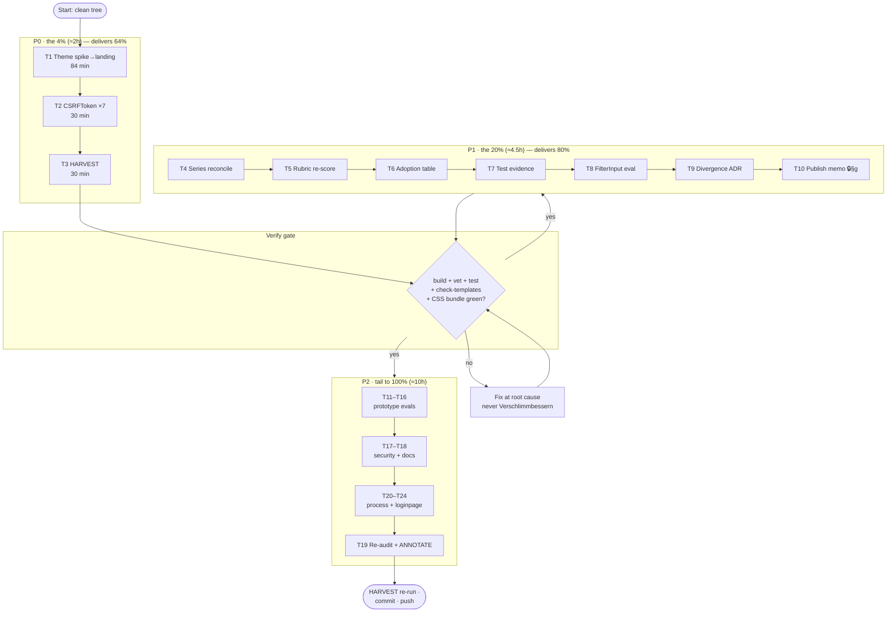

# Pareto Execution Plan — dashboardui templ-components Adoption (85 → 95+)

> **Created:** 2026-09-23 01:58 CEST
> **Input:** status report `docs/status/2026-09-23_01-38_templ-components-deep-dive-session.md` §f (35 tasks)
> **Goal:** land the audit's recommendations without Verschlimmbessern — every change leaves the repo verifiably no worse; build + tests green at each phase boundary.
> **Guardrails:** commit at phase boundaries; rebuild CSS bundles in the same change as UI changes; templ generate only from module dir; never break build.

---

## 1. Pareto Breakdown

**The result** = dashboardui verifiably at ~95/100 adoption, audit series reconciled, plan harvested into living docs, process miss (prior-art skip) closed.

| Tier | Share of work | Delivers | Tasks |
|---|---|---|---|
| **1%** | T1 alone | **51%** — the one user-visible feature (dark-mode toggle), already spiked, in-tree-planned | T1 |
| **4%** | T1 + T2 + T3 | **64%** — score at ~95 (theme + CSRF), and the plan survives in TODO_LIST/ROADMAP | T1, T2, T3 |
| **20%** | + T4–T10 | **80%** — audit series reconciled, rubric comparable, adoption table, test evidence, filter-bar evaluated, divergences documented | T1–T10 |
| **remaining 80%** | T11–T24 | **100%** — long tail: prototype evaluations, sweeps, process guards, loginpage audit, recurring-gate decision | T1–T24 |

Execution order per Pareto: **1% → 4% → 20% → tail.**

---

## 2. Comprehensive Plan — medium granularity (30–100 min each, ALL 35 §f tasks covered)

| # | Task (30–100 min) | Covers §f | Min | Tier |
|---|---|---|---|---|
| T1 | Reconcile theme-toggle spike, land `@custom-variant dark` + `ThemeScript` + `ThemeToggle`, rebuild CSS bundle, verify dark surfaces | #2, #19(part) | 84 | 1% |
| T2 | Swap 7 hidden CSRF inputs → `htmx.CSRFToken`; run tests + check-templates + goldens | #1, #18, #26 | 30 | 4% |
| T3 | HARVEST: pull plan into `TODO_LIST.md` / `ROADMAP.md` per docs-health routing | #3 | 30 | 4% |
| T4 | Series reconciliation: re-verify the 2026-09-17 report's 17 missed opportunities; strike resolved, carry open; annotate superseded-by | #5, #33 | 45 | 20% |
| T5 | Adoption-score rubric from the 2026-09-17 capability ladder; re-score 14/68/85 comparably; write into today's report | #6 | 45 | 20% |
| T6 | Adoption table (adopted / custom / hand-rolled) into dashboardui docs | #4 | 30 | 20% |
| T7 | Build+vet+test dashboardui; append evidence rows to audit report appendix | #7 | 30 | 20% |
| T8 | Evaluate `forms.FilterInput`/`FilterDropdown` vs hand-rolled `filterInput` (events.templ) | #10 | 45 | 20% |
| T9 | Document the 3 justified divergences (shell / cursor pagination / error card) as ADR or README note | #32 | 30 | 20% |
| T10 | Draft verdict-placement memo for public README (BLOCKED on §g-Q3 answer) | #23 | 15 | 20% |
| T11 | Prototype `forms.Slider` for time-travel scrubber; adopt or document rejection | #8 | 30 | tail |
| T12 | Prototype `navigation.SidebarNav` inside existing aside; visual verdict | #9 | 60 | tail |
| T13 | Evaluate `display.Card`/`SimpleCard`/`Grid` vs `.panel`/stat-row CSS | #12, #13 | 45 | tail |
| T14 | Evaluate `display.DataTable` vs Table+`sortState`+pagination composition | #31 | 60 | tail |
| T15 | Adopt or reject `display.RelativeTime` for table rows; sweep bare empty states | #11, #17 | 30 | tail |
| T16 | Evaluate `htmx.ConfirmDelete` vs raw `data-confirm`; check `paginationInfoText`→ListNote; note `errorpage.ErrorDetail` fit | #14, #15, #16 | 30 | tail |
| T17 | Audit `RecommendedSecurityMiddleware` coverage across all dashboard handlers | #29 | 30 | tail |
| T18 | Link audit report from dashboardui README; settle docs-index/CHANGELOG convention for research reports | #20, #34 | 30 | tail |
| T19 | Re-run audit post-fixes; ANNOTATE today's report; schedule dark-token audit + axe pass | #22, #19, #27 | 45 | tail |
| T20 | Process guard: "ls docs/research first" line in AGENTS.md session protocol | #24 | 15 | tail |
| T21 | loginpage templ-components audit (AGENTS.md lists 4 adoption opportunities) | #21 | 60 | tail |
| T22 | `icons.Name` drift check in navIcon; `.tc-*` custom.css need-assessment | #25, #28 | 30 | tail |
| T23 | Evaluate `display.Scrollback` for event/payload viewers | #30 | 30 | tail |
| T24 | Propose recurring consumer-audit gate → ROADMAP decision | #35 | 30 | tail |

**Totals:** 24 tasks, ~1014 min ≈ 17 h. Covers all 35 §f items.

---

## 3. Detailed Breakdown — fine granularity (≤12 min each, ALL tasks)

| ID | Micro-task | Min | Parent |
|---|---|---|---|
| 1.1 | Read 2026-09-20 theme spike; extract decided strategy + open decisions | 10 | T1 |
| 1.2 | Add `@custom-variant dark` to `dashboardui/tailwind.css` | 5 | T1 |
| 1.3 | Add `ThemeScript(p.Nonce)` to layout head | 8 | T1 |
| 1.4 | Add `ThemeToggle` to header; wire placement + Nonce | 12 | T1 |
| 1.5 | `nix run .#build-dashboardui-css`; commit minified canonical bundle | 10 | T1 |
| 1.6 | Verify dark surfaces (dark: coverage grep, a11y_test, visual sanity) | 12 | T1 |
| 1.7 | Update stale comments ("lands with the ThemeToggle adoption") | 5 | T1 |
| 2.1 | Replace 4 dlq.templ CSRF inputs with `@htmx.CSRFToken(...)` | 8 | T2 |
| 2.2 | Replace 2 projections.templ + 1 snapshots.templ inputs | 8 | T2 |
| 2.3 | `go test ./dashboardui/ -count=1` + `check-templates` + goldens green | 12 | T2 |
| 3.1 | Read TODO_LIST/ROADMAP conventions + docs-health routing rules | 8 | T3 |
| 3.2 | Add P0/P1 actionable items to TODO_LIST as `[ ]` | 12 | T3 |
| 3.3 | Route tail/R items to ROADMAP; run status gates | 10 | T3 |
| 4.1 | Extract the 17 missed-opportunity findings from 2026-09-17 report | 10 | T4 |
| 4.2 | Verify each against current code; strike resolved / carry open | 12 | T4 |
| 4.3 | ANNOTATE old report: `> ANNOTATED` blockquote + superseded-by links | 10 | T4 |
| 4.4 | Fold spike outcome into today's ThemeToggle finding | 8 | T4 |
| 5.1 | Extract capability ladder + weights from 2026-09-17 report | 10 | T5 |
| 5.2 | Define shared rubric (capabilities × impact weights) | 12 | T5 |
| 5.3 | Re-score 14/68/85 on the rubric; append to today's report | 12 | T5 |
| 6.1 | Generate adopted/custom/hand-rolled table from session census | 12 | T6 |
| 6.2 | Place table in dashboardui README or docs/; link from AGENTS.md | 8 | T6 |
| 7.1 | Run `go build/vet/test ./dashboardui/` (GOEXPERIMENT=jsonv2) | 12 | T7 |
| 7.2 | Append evidence rows to audit report appendix table | 8 | T7 |
| 8.1 | Read `filterInput` wrapper + events.templ usage patterns | 10 | T8 |
| 8.2 | Read `forms.FilterInput`/`FilterDropdown` source + debounce semantics | 10 | T8 |
| 8.3 | Prototype swap or write rejection verdict with reasons | 12 | T8 |
| 9.1 | Draft ADR: HTMX-boost shell, cursor pagination, error-card divergence rationale | 12 | T9 |
| 9.2 | Cross-link ADR from dashboardui README + audit report | 8 | T9 |
| 10.1 | Draft options memo: publish verdicts vs keep internal (awaits §g-Q3) | 12 | T10 |
| 11.1 | Read `forms.Slider` rendering + wrapper markup | 8 | T11 |
| 11.2 | Prototype with `BaseProps.Attrs` carrying the two data hooks | 12 | T11 |
| 11.3 | Visual verdict + adopt-or-reject note in audit report | 8 | T11 |
| 12.1 | Read `navigation.SidebarNav` props/source | 10 | T12 |
| 12.2 | Prototype inside existing `<aside>` shell | 12 | T12 |
| 12.3 | Visual diff vs dashboardCSS token styling | 12 | T12 |
| 12.4 | Verdict + documentation | 8 | T12 |
| 13.1 | Inventory `.panel`/stat-row CSS usages across pages | 10 | T13 |
| 13.2 | Prototype `Card`/`Grid` in overview.templ | 12 | T13 |
| 13.3 | Verdict: consolidate or keep tokens (document) | 8 | T13 |
| 14.1 | Read `display.DataTable` API (sort + pagination + empty state) | 12 | T14 |
| 14.2 | Map `sortState` + cursor pagination onto it (or prove mismatch) | 12 | T14 |
| 14.3 | Verdict + documentation | 8 | T14 |
| 15.1 | Read `display.RelativeTime` props | 8 | T15 |
| 15.2 | Swap into dlq/events rows or document rejection | 10 | T15 |
| 15.3 | Sweep all pages for bare "No X" blocks → `emptyStatePanel` | 8 | T15 |
| 16.1 | Compare `htmx.ConfirmDelete` vs raw `data-confirm` forms | 8 | T16 |
| 16.2 | Check `paginationInfoText` renders via ListNote where applicable | 8 | T16 |
| 16.3 | Note `errorpage.ErrorDetail` fit for HTMX-swap bare error card | 8 | T16 |
| 17.1 | Enumerate handler→middleware chain; check RecommendedSecurityMiddleware coverage | 12 | T17 |
| 17.2 | Gap verdict + note in report appendix | 8 | T17 |
| 18.1 | Link today's audit from dashboardui README docs section | 8 | T18 |
| 18.2 | Settle research-report indexing convention; apply | 8 | T18 |
| 19.1 | Re-run symbol census + CSRF/theme deltas post-changes | 10 | T19 |
| 19.2 | ANNOTATE today's report with resolved markers | 10 | T19 |
| 19.3 | Schedule dark-token audit (#27) + full axe pass (#19) as follow-ups | 10 | T19 |
| 20.1 | Add "ls docs/research first" protocol line to AGENTS.md | 10 | T20 |
| 21.1 | Census loginpage imports + hand-rolled lp-* surfaces | 10 | T21 |
| 21.2 | Map AGENTS.md's 4 opportunities (AuthLayout, Input/Form, Alert, Button) | 12 | T21 |
| 21.3 | Verdict + mini-report in docs/research/ | 12 | T21 |
| 22.1 | Check navIcon for `icons.Name` constant vs string drift | 10 | T22 |
| 22.2 | Assess `.tc-*` custom.css vendoring need for dashboard bundle | 8 | T22 |
| 23.1 | Read `display.Scrollback` component | 8 | T23 |
| 23.2 | Fit verdict for event/payload viewers | 8 | T23 |
| 24.1 | Propose recurring consumer-audit gate → ROADMAP entry | 10 | T24 |

**Totals:** 66 micro-tasks, every one ≤12 min. 10.1 blocked on §g-Q3; 12.3/13.3 verdicts gated on visual-continuity answer (§g-Q3 of status report).

---

## 4. Execution Graph

---

## 5. Verification Protocol (every phase boundary)

1. `GOEXPERIMENT=jsonv2 go build ./... && go vet ./... && go test ./dashboardui/ -count=1 -race`
2. `nix run .#check-templates` after any `.templ` edit; `nix run .#gen` only from module dir
3. `nix run .#build-dashboardui-css` + `.#check-css-bundles` in the same change as UI edits
4. `nix run .#preflight-tree-check` before batch steps; commit at phase boundaries (daemon races long tails)
5. Docs gates: `check-status-annotations.sh` + `check-status-rows.py` after touching status reports

## 6. Blocked / awaiting answers (from status report §g)

- **T10** needs the publish-vs-internal decision (§g-Q1/Q3).
- **T12.3 / T13.3** verdicts need the visual-continuity hard-requirement answer (§g-Q3).
- **T1** proceeds on the spike's strategy; if the spike contradicts OS-follow-only (§g-Q2), T1 shrinks to reconciliation-only.
