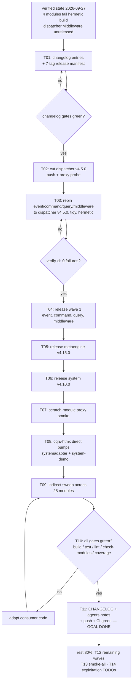

# Plan: Unblock go-cqrs-lite Release Wave, Then Update cqrs-htmx to system + metaengine

- **Created:** 2026-09-27 22:35 (CEST, via `date`)
- **Status:** OPEN — point-in-time snapshot; annotate on execution, never rewrite
- **Scope:** `go-cqrs-lite` @ `3dfa303e3` (pushed, clean tree) + `cqrs-htmx` @ master
- **Origin:** session task "update everything to go-cqrs-lite/system and metaengine"; upstream releasability verified first (user decision, 2026-09-27)

> ANNOTATED 2026-09-28 — EXECUTED TO DONE (T01–T11 + T13 same/next day; T12/T14 recorded here + TODO_LIST/ROADMAP).
> Shipped tags: dispatcher/v4.5.0 `2d1669f78`, event/v4.12.0 + command/v4.12.0 + query/v4.9.0 + middleware/v4.7.0 `fc55b7eae`, metaengine/v4.15.0 `ef89991c5`, system/v4.10.0 `1918a57f2` — all proxy-served same day (per-tag smoke, attempt 1 each). T07 scratch probe compiled `NewEngineCheckpointStore` from the live proxy.
> Deviations: (a) a parallel publish-integrity session was active in go-cqrs-lite throughout — its metaengine additions (`QueryPlacements`, `SanitizeIdent`) folded into v4.15.0 and its watermill payload-encoding migration resolved the `NewEvent`/`New` oscillation at root (explicit `WithEncoding` fallback); (b) system/systemtest/system-integration needed metaengine v4.15.0 pins (system's `introspection.go` uses `QueryPlacements`) — caught by the tagger's standalone guard at dry-run, exactly the designed tripwire; (c) `batch-release --smoke-all` self-locks (nested `--smoke` verify-lock refusal) — smoked per-tag instead; (d) cqrs-htmx gates needed 4 standing dashboardui lint fixes + a stale templ-components doc-freshness claim, both fixed in-wave. T12's remaining ~30 drifted modules stay open in go-cqrs-lite TODO_LIST (pin-sweep alignment list regenerated per wave); its tursoengine v4.2.1 timing stays owner-gated there.

---

## 1. Verified Current State (evidence from 2026-09-27 session)

### Consumer side (cqrs-htmx) — nothing to fix there yet

| Train | Latest PUBLISHED tag | cqrs-htmx pin | Verdict |
| --- | --- | --- | --- |
| `system/v4` | v4.9.0 | v4.9.0 (systemadapter, examples/system-demo) | current |
| `metaengine/v4` | v4.14.0 | v4.14.0 (direct + indirect across workspace) | current |
| `metaengine/sqliteengine/v4` | v4.4.0 | v4.4.0 (systemadapter) | current |
| `metaengine/projectionadapter/v4` | v4.5.0 | v4.5.0 (systemadapter) | current |

cqrs-htmx is at every latest published train. **No consumer bump is possible until upstream publishes.**

### Upstream side (go-cqrs-lite) — mid-release-train state

- `~40 modules` carry pushed-but-untagged drift vs their latest tags (metaengine 260 files, storage 58, catalog 51, watermill 36, system 33, middleware 33, ...).
- `nix run .#verify-ci` (hermetic per-module matrix): **FAIL — exactly 4 of ~45 modules**:
  - `event`, `command`, `query`, `middleware` fail `GOWORK=off` builds: local code uses `dispatcher.Middleware[H any]`, but their go.mod still pin published `dispatcher/v4.4.1`, which does not have it. Workspace mode masked the breakage.
- `dispatcher` itself (with the new API) and **everything else** — including the full `metaengine` suite (all engines) and `system`/`system/integration`/`systemtest` — are green hermetically.
- Unpublished-internal-require DAG check: **zero true blockers** for the minimal wave. (`event/v4/eventtest v0.4.0` is published — an earlier grep glob artifact suggested otherwise. One real upstream quirk, OUT of wave scope: `queue/mysql/v4 v4.0.0` requires never-tagged `testutil/mysqltestcontainer`.)

### Root cause

Someone introduced the generic `Middleware` API in local `dispatcher` and adopted it in `event`/`command`/`query`/`middleware`, but never cut `dispatcher/v4.5.0` nor bumped those four go.mod pins. The chain below it (metaengine, system) was left waiting.

---

## 2. Pareto Breakdown

### The 1% that delivers 51% — fix the broken chain

Cut `dispatcher/v4.5.0`, repin `event`/`command`/`query`/`middleware` to it, verify hermetic, release the four.
This unblocks EVERY downstream train and repairs the hermetic-build rot. Without it, nothing moves.

### The 4% that deliver 64% — + the two consumer-target trains

Cut `metaengine/v4.15.0` and `system/v4.10.0`. All their internal deps are already published; these are the only two trains cqrs-htmx actually consumes.

### The 20% that deliver 80% — + the consumer update, fully verified

Bump cqrs-htmx (direct: systemadapter, examples/system-demo; indirect: workspace sweep), run every gate (build/test/lint/check-modules/coverage-gate), docs + commit phases + push + CI green. **The user's goal is DONE here.**

### The remaining 80% → 100% — completeness, not the goal

Release the other ~30 drifted modules in dependency-ordered waves (sqliteengine, engine batch, storage family, stack family, catalog, watermill, cmd tools), full `--smoke-all` proxy verification, and harvest the NEW capability value into cqrs-htmx TODO_LIST/ROADMAP (`query_builders`, vector insert/scan, `NewEngineCheckpointStore`).

---

## 3. Planned Version Ladder (confirm each at execution via CHANGELOG + api-diff)

| Module | Current tag | Planned | Why this bump |
| --- | --- | --- | --- |
| `dispatcher/v4` | v4.4.1 | **v4.5.0** | new exported generic `Middleware[H]` |
| `event/v4` | v4.11.1 | **v4.12.0** | adopts dispatcher middleware API |
| `command/v4` | v4.11.0 | **v4.12.0** | adopts dispatcher middleware API |
| `query/v4` | v4.8.1 | **v4.9.0** | adopts dispatcher middleware API |
| `middleware/v4` | v4.6.1 | **v4.7.0** | 27 factories migrate to generic middleware |
| `metaengine/v4` | v4.14.0 | **v4.15.0** | additive: vector insert/scan, `PlannedBackfillResult`, `ListPlannedTables`, `AppendPlannedFilter`; planner options moved within package (verified: same package, no signature change, zero fleet consumers) |
| `system/v4` | v4.9.0 | **v4.10.0** | additive: `NewEngineCheckpointStore`, `query_builders.go`; engine requires dropped from go.mod |

Wave order is a hard DAG: dispatcher → {event, command, query, middleware} → metaengine → system.
(qc note: `sqliteengine` drift is internal/test-only this round — skipped in the minimal wave; picked up in the rest-of-80% waves.)

---

## 4. Level 1 — Comprehensive Plan (30–100 min tasks, ALL todos, sorted by impact/effort/value)

| Prio | ID | Task | Est | Tier | Impact | Effort | Customer value |
| --- | --- | --- | --- | --- | --- | --- | --- |
| 1 | T01 | Wave prep: changelog entries for the 7-tag wave + draft `batch-release.sh --from-manifest` manifest | 60m | 1% | Critical | Med | Gates demand changelog coverage; manifest feeds cut + smoke |
| 2 | T02 | Cut `dispatcher/v4.5.0` (verify-tag.sh, push, proxy probe) | 30m | 1% | Critical | Low | Unblocks the entire wave |
| 3 | T03 | Repin event/command/query/middleware to dispatcher v4.5.0 + per-module GOWORK=off tidy + hermetic build/test green | 60m | 1% | Critical | Med | Repairs the 4 hermetic failures |
| 4 | T04 | Release wave 1 (event, command, query, middleware) in order + verify-ci rerun with 0 failures | 60m | 1% | Critical | Med | First releasable wave |
| 5 | T05 | Cut `metaengine/v4.15.0` | 45m | 4% | High | Med | Consumer target train |
| 6 | T06 | Cut `system/v4.10.0` | 45m | 4% | High | Med | Consumer target train |
| 7 | T07 | Scoped proxy smoke: scratch module consumes `system@v4.10.0` end-to-end | 30m | 4% | High | Low | Tags proven real before consumer work |
| 8 | T08 | cqrs-htmx direct bumps: systemadapter + examples/system-demo (go.work guarded) | 45m | 20% | High | Med | THE update |
| 9 | T09 | cqrs-htmx indirect sweep: all 28 modules (get + tidy + build + vet, GOWORK=off) + absence sweep | 90m | 20% | High | High | Version-drift gate + hermetic go.sum correctness |
| 10 | T10 | cqrs-htmx full verification: build, test -race, lint, check-modules, coverage-gate; fix fallout | 90m | 20% | High | High | No-Verschlimmbesserung proof |
| 11 | T11 | cqrs-htmx docs + ship: CHANGELOG, agents-notes dated record, phase commits, push, CI watch | 45m | 20% | Med | Med | Audit trail, green CI |
| 12 | T12 | Release remaining drifted modules in dependency-ordered waves (sqliteengine, engines, storage, stack, catalog, watermill, cmd tools) | 100m | rest | Med | High | Repo-wide greenness, future consumers |
| 13 | T13 | `batch-release.sh --smoke-all` over the full wave manifest | 60m | rest | Med | Med | Fleet assurance |
| 14 | T14 | Harvest new-capability exploitation into cqrs-htmx TODO_LIST/ROADMAP | 30m | rest | Med | Low | Converts upstream work into roadmap value |

---

## 5. Level 2 — Micro-Tasks (max 12 min each, ALL todos, sorted)

| Prio | ID | Task | Est | Parent |
| --- | --- | --- | --- | --- |
| 1 | M01 | go-cqrs-lite: fetch, confirm clean tree synced with origin, re-check `git log` for concurrent sessions | 10m | T01 |
| 2 | M02 | dispatcher CHANGELOG entry (Added: `Middleware[H any]`) | 10m | T01 |
| 3 | M03 | event + command CHANGELOG entries from their diffs | 12m | T01 |
| 4 | M04 | query + middleware CHANGELOG entries from their diffs | 12m | T01 |
| 5 | M05 | metaengine CHANGELOG entry (vector APIs, planner options relocation, backfill results) | 12m | T01 |
| 6 | M06 | system CHANGELOG entry (`NewEngineCheckpointStore`, query_builders, adapter changes, dropped engine requires) | 12m | T01 |
| 7 | M07 | Draft 7-tag release manifest (batch-release --from-manifest format) | 12m | T01 |
| 8 | M08 | dispatcher: verify-tag.sh dry run (committed tree, no unpublished requires) | 8m | T02 |
| 9 | M09 | dispatcher: tag + push v4.5.0, ls-remote + proxy probe | 10m | T02 |
| 10 | M10 | event: go get dispatcher@v4.5.0 (go.work temporarily renamed), GOWORK=off tidy | 10m | T03 |
| 11 | M11 | event: hermetic build + test green, verify go.mod pin persisted | 8m | T03 |
| 12 | M12 | command: repin + tidy | 10m | T03 |
| 13 | M13 | command: hermetic build + test green | 8m | T03 |
| 14 | M14 | query: repin + tidy | 10m | T03 |
| 15 | M15 | query: hermetic build + test green | 8m | T03 |
| 16 | M16 | middleware: repin + tidy | 10m | T03 |
| 17 | M17 | middleware: hermetic build + test green (generic instantiation errors must be gone) | 12m | T03 |
| 18 | M18 | Full `verify-ci` rerun — expect 0 failures | 12m | T03 |
| 19 | M19 | Wave-ordered commits of the repin (phase boundary, detailed messages) | 10m | T03 |
| 20 | M20 | Release event v4.12.0 via verify-tag.sh --push + proxy check | 10m | T04 |
| 21 | M21 | Release command v4.12.0 | 10m | T04 |
| 22 | M22 | Release query v4.9.0 | 10m | T04 |
| 23 | M23 | Release middleware v4.7.0 | 10m | T04 |
| 24 | M24 | Confirm all 4 live on proxy.golang.org | 8m | T04 |
| 25 | M25 | metaengine: DAG sanity rerun (all internal deps published) | 8m | T05 |
| 26 | M26 | Release metaengine v4.15.0 + proxy check | 10m | T05 |
| 27 | M27 | system: DAG sanity (eventtest v0.4.0 pub, metaengine v4.15.0 pub) | 8m | T06 |
| 28 | M28 | Release system v4.10.0 + proxy check | 10m | T06 |
| 29 | M29 | Scratch-module smoke: fresh cache pull of system@v4.10.0 builds + tests (GOWORK=off) | 12m | T07 |
| 30 | M30 | Record wave (tags, hashes) in go-cqrs-lite agents notes | 8m | T07 |
| 31 | M31 | cqrs-htmx: `preflight-tree-check` + `wait-tree-quiet` | 8m | T08 |
| 32 | M32 | systemadapter: go get system@v4.10.0 + metaengine@v4.15.0 (+ middleware family), GOWORK=off tidy/build/vet | 12m | T08 |
| 33 | M33 | examples/system-demo: same bump + verify | 12m | T08 |
| 34 | M34 | Commit direct-bump phase | 6m | T08 |
| 35 | M35 | Indirect sweep batch A: root, identity-model, usermgmt, setup (go get + tidy GOWORK=off) | 12m | T09 |
| 36 | M36 | Indirect sweep batch B: adminui, dashboardui, loginpage, datastar, health, auditlog | 12m | T09 |
| 37 | M37 | Indirect sweep batch C: integration_test, e2e/server, examples x12 | 12m | T09 |
| 38 | M38 | GOWORK=off tidy + build + vet across all 28 modules | 12m | T09 |
| 39 | M39 | Absence sweep: zero stale pins (`rg` old versions across go.mod expecting nothing) | 8m | T09 |
| 40 | M40 | Commit indirect-sweep phase | 6m | T09 |
| 41 | M41 | `nix run .#build` + `.#test` (background, monitor) | 12m | T10 |
| 42 | M42 | `nix run .#lint` | 12m | T10 |
| 43 | M43 | `nix run .#check-modules` (release-train strict, drift, vcs-cache) | 12m | T10 |
| 44 | M44 | `nix run .#coverage-gate` | 12m | T10 |
| 45 | M45 | Fallout fixes if any gate red (API adaptation, targeted edits) — repeat M41-M44 scoped | 12m | T10 |
| 46 | M46 | CHANGELOG entry (dependency sweep, upstream wave reference) | 8m | T11 |
| 47 | M47 | docs/agents-notes.md dated section: wave record + tag hashes | 10m | T11 |
| 48 | M48 | AGENTS.md quick-reference pin updates (if versions are named there) | 8m | T11 |
| 49 | M49 | Final commit + push (pre-push hook runs strict gates) | 10m | T11 |
| 50 | M50 | Watch CI green | 12m | T11 |
| 51 | M51 | Wave 2: sqliteengine v4.5.0, then tursoengine (depends on sqliteengine) | 12m | T12 |
| 52 | M52 | Wave 3: engine batch 1 (badger, bbolt, pebble, pg) | 12m | T12 |
| 53 | M53 | Wave 3: engine batch 2 (mysql, duckdb, dgraph, bigtable, iroh + quic/loopback, otelobserver, bench, graphadapter, projectionadapter) | 12m | T12 |
| 54 | M54 | Wave 4: storage family (storage, memory, bbolt, pebble, turso, backuptest) | 12m | T12 |
| 55 | M55 | Wave 5: stack family (stack + backends, incl. bench) | 12m | T12 |
| 56 | M56 | Wave 6: catalog, watermill, queue, scheduling leftovers, testutil/mysqltestcontainer (FIRST tag), cmd tools | 12m | T12 |
| 57 | M57 | batch-release --smoke-all over full manifest; investigate any proxy anomaly | 12m | T13 |
| 58 | M58 | TODO_LIST additions: query_builders adoption, vector insert/scan usage, NewEngineCheckpointStore | 12m | T14 |
| 59 | M59 | ROADMAP raw ideas: vector-search-backed adminui/dashboardui views | 8m | T14 |

---

## 6. Execution Graph

---

## 7. Risk Register — Verschlimmbesserung Guards

| Risk | Guard |
| --- | --- |
| Tag publishing is irreversible (module proxy caches forever) | ONLY via go-cqrs-lite `scripts/verify-tag.sh <dir> <version> [--push]`; never raw `git tag`; never re-tag at a different commit |
| Auto-commit daemon shreds batched work | Commit at phase boundaries; `preflight-tree-check` before any tree-mutating batch step; re-check `git log` before assuming attribution |
| Workspace mode masks hermetic breakage | `GOWORK=off` for every per-module build/test/tidy; temporarily rename `go.work` for `go get`, restore after, verify pin persisted |
| mvdan/sh traps (PIPESTATUS, process substitution, slash-in-var redirects) | `cmd > /tmp/unique-file 2>&1; rc=$?`; materialize lists to temp files; unique `/tmp/<repo>-<purpose>-$$-$(date +%s)` paths |
| BuildFlow `--fix` re-breaking intentional patterns | NEVER `golangci-lint run --fix` repo-wide; respect existing `//nolint` directives |
| Mid-wave failure | Stop the wave at the failing module; fix forward; `git commit --no-verify` only with documented justification after independent verification |
| Bench baseline drift | Do NOT re-pin `bench-spike` baseline (no bench-path edits in this plan) |
| Concurrent sessions in shared tree | Fresh-tag ls-remote TTL gotcha: re-run release-train gate with `-- --refresh-cache` before diagnosing phantom UNPUBLISHED |

## 8. Definition of Done

1. `nix run .#verify-ci` in go-cqrs-lite: 0 failures.
2. Seven tags live on proxy.golang.org: dispatcher v4.5.0, event v4.12.0, command v4.12.0, query v4.9.0, middleware v4.7.0, metaengine v4.15.0, system v4.10.0.
3. cqrs-htmx: build + test(-race) + lint + `check-modules` (strict) + coverage-gate all green; absence sweep finds zero stale pins.
4. Docs recorded (CHANGELOG, agents-notes), phases committed, pushed, CI green.

## 9. Out of Scope / Known Upstream Quirks (documented, not fixed here)

- `queue/mysql/v4 v4.0.0` (published) requires never-tagged `testutil/mysqltestcontainer` — pre-existing; first-tag it only in wave 6 if the gate demands it at that point.
- `projectionadapter` local drift is test/doc/go.mod-only — no re-release needed for the minimal wave (MVS resolves consumers fine against v4.5.0).
- Exploiting the new capabilities INSIDE cqrs-htmx (vector search views, query builders) is post-update roadmap work (T14), not part of the update itself.
