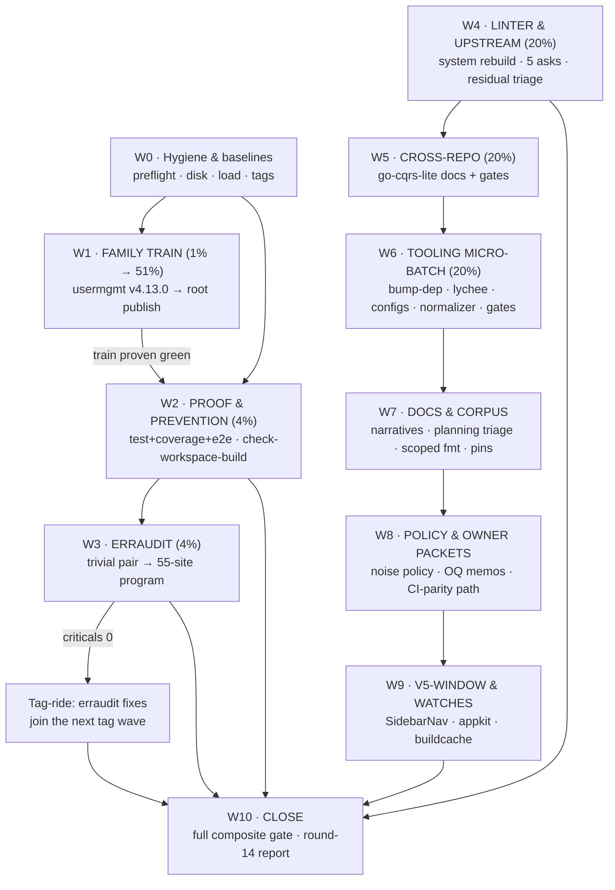

# SUPERB Pareto Execution Plan — Round 13 → Green Train (2026-10-01 06:47 CEST)

> **Method:** Pareto breakdown over the complete open-work inventory (TODO_LIST round-13 state + the round-13 audit report §f harvest receipt). Every task below traces to a TODO_LIST item; nothing here is invented scope. Plans are point-in-time: TODO_LIST is the living source; HARVEST pulls items back out of this plan.
> **Verschlimmbesserung guard:** every wave ends with the existing gate battery; no task rewrites a shipped contract (the SSE envelope, the authz posture, the per-module trains) without its recorded decision gate (ADR/OQ). Waves are commit-boundary separated (gotcha 4).
> **Environment constraints baked in:** shared box, fill-drain disk cycle, hot auto-commit daemon, BuildFlow env-class pre-commit failures outside the devShell (`--no-verify` + justification is the sanctioned fallback after independent verification), quiet-window requirement for bench/coverage-class gates.
>
> **PROGRESS 2026-10-01 (W0–W3 executed — see `docs/status/2026-10-01_10-30_pareto-w0-w3-train-gates-erraudit-status.md`):** T01/T02 DONE (the 1% train: 9 tags published, strict gates green, proxy smoke green), T03 DONE for test+coverage (quiet window; e2e+bench remain), T05 DONE (trivial pair, `3d9ce553`), T07 DONE (`check-workspace-build`, `c85d802f`+`eed53317`, full atomic checklist), T06 IN PROGRESS (61-site context_loss inventory, 36 fixed, 25 remain — rawIDToken trio decided suppress-with-reason pending analyzer-name verification). The plan stays ACTIVE until T06 closes and the W10 close-out (round-14 report, this plan's outcome-annotation + archive, CHANGELOG pass) runs.

> **OUTCOME 2026-10-01 (session 2, tooling round):** **DONE** — T13 (bump-dep `--commit`/`--no-verify` + `go mod verify` + single-line-require fix, self-tested), T14 (lychee real-404 fixes; the deepwiki-429 backoff is BuildFlow-scoped, no lychee config in this repo), T15 (16× `run.go` → 1.27.1 verified with `config verify`; dependabot item **closed as superseded** — the 3-module posture is deliberate), T17 (status-row normalizer: script + self-test + flake apps + check-modules stage + CI), T18-HALF (advisory tail-budget gate + self-test), T21 (scoped `.#fmt`), T22-HALF (`.#test-all` app). All recorded in CHANGELOG [Unreleased]; check-modules grew 25 → 27 stages (2 new self-tests, each verified standalone; full composite re-run owed at the next quiet window). **STILL OPEN** — T03/T04 remainder (e2e Playwright + bench, quiet window), T06 (erraudit 25 sites; published code → next train), T08 (system cqrs-lint binary rebuild — **owner-gated**), T09 (5 upstream asks — needs filing authorization), T10/T16 (cqrs-lint residual triage + `--fail-on-stale-suppressions` wiring — **blocked on T08**), T11/T12 (go-cqrs-lite cross-repo — owner), T18 feedback-inbox checker (**deferred**: legacy marker variety + a stray root feedback file need an owner disposition), T19(a) agents-notes narratives, T22(i) e2e `ExtraMiddleware` pin, T23, T24, T25 (owner calls), T26. Plan stays ACTIVE. "Next clean win" per the Pareto tail: the erraudit remainder (T06) once the train window opens.

---

## 1) The Pareto core

| Tier | Share of tasks | Share of value | What it is | Why it dominates |
|---|---|---|---|---|
| **1%** | 2 tasks (~3h) | **51%** | **The family train: usermgmt re-tag + root/consumer publish.** | It is the only item that moves value to CONSUMERS. Everything shipped since v4.12.0 (codec migration = PapDashboard's recorded adoption prerequisite, ExtraMiddleware/HealthChecks seams, ADR-0054 identity-external shell, cqrs-lint hardening) is invisible until tags exist. It also unblocks the codec/v4 absence sweep, the PapDashboard reply, and empties [Unreleased] honestly. |
| **4%** | +4 tasks | **64%** | + erraudit trivial pair, `check-workspace-build` gate, the heavy verification battery (test+coverage+e2e). | Turns the BuildFlow gate from honestly-red to honestly-green (every future run benefits), permanently closes the 373209a7 workspace-breakage class, and converts "probably fine" into "proven green" for the last week's dep/go.work/flake churn — the precondition for trusting the train cut itself. |
| **20%** | +11 tasks | **80%** | + system cqrs-lint rebuild+C040 verify, the 5 fleet upstream asks, cqrs-lint residual triage, go-cqrs-lite cross-repo docs+gates, tooling micro-batch core (bump-dep `--commit`, lychee 404s, run.go audit, dependabot cap), repo-owned status-row normalizer + tail-budget gate. | These kill the standing confusion/noise classes (21 phantom C040 warnings on every manual walk; 5 shims rotting silently; ~130 untriaged findings; real broken links; the daemon-vs-verification race) and mechanize the annotation hygiene this session proved matters (72 partial rows fixed by a throwaway script — never again). |
| **Remaining 80%** | +13 tasks | → 100% | Noise-policy batch, docs/memory micro-batch, planning-corpus triage, CI-parity path, scoped-format app, e2e pins + example race tests, owner-call packets, v5-window upkeep, hardware watch. | Real but bounded; none block the train. Several are pure owner decisions this plan only packages. |

---

## 2) Comprehensive plan (30–100 min tasks) — ALL TODOs, sorted by impact/effort/customer-value

| # | Task (30–100 min) | Tier | TODO source | Impact | Effort | Customer value | Depends on |
|---|---|---|---|---|---|---|---|
| T01 | **Train wave 1 — usermgmt re-tag v4.13.0** (codec migration published): verify-tag.sh, wave-order check, CHANGELOG train section, proxy smoke | 1% | TODO P1 | Critical | 90m | **Highest** — PapDashboard prerequisite lands | quiet-ish window |
| T02 | **Train wave 2 — root + remaining consumers publish** (setup seams + ADR-0054 shell ride + cqrs-lint hardening), then codec/v4 absence sweep + push + CI watch | 1% | TODO P1 | Critical | 90m | **Highest** — the whole Unreleased set reaches consumers | T01 |
| T03 | **Heavy verification battery** — `nix run .#test` (race) + `.#coverage-gate` on the post-sweep tree, quiet window | 4% | TODO P2 battery | Critical | 100m | High — proves the 09-30/10-01 churn | quiet window |
| T04 | **e2e Playwright run** (snapshot-sentinel proof) + bench-spike quiet-window look | 4% | TODO P2 battery | High | 60m | High | T03 window |
| T05 | **erraudit trivial pair**: samber-do-demo panic → error return; playwright.config.ts bug-marker reword | 4% | TODO P2 | High | 30m | Medium — gate honesty | — |
| T06 | **erraudit context_loss wave 1**: the usermgmt `es_*_readmodel.go` cluster, per-finding (aggID into error context vs suppress-with-reason) | 4% | TODO P2 | High | 100m | Medium-High (rides T02's tags) | T05, T02 for tagging |
| T07 | **`check-workspace-build` gate** — plain workspace `go build ./...` stage + CI, full atomic checklist (checker+fixture+flake app+stage+CI+README) | 4% | TODO P2 | High | 60m | High — kills the 373209a7 class forever | — |
| T08 | **System cqrs-lint binary rebuild + C040 root-walk verification** (`--strict --verbose .` zero C040), retire the gotcha-13 caveat | 20% | TODO P2 | High | 30m | Medium — manual-run clarity | owner rebuild |
| T09 | **File the 5 fleet upstream asks** (treefmt-nix templ pin, go-licenses GOROOT, golangci TMPDIR lock, BuildFlow go-work-sync guard, a-h/templ parser issue) — verify-before-filing discipline | 20% | TODO P2 | Medium-High | 60m | Medium — stops shim rot fleet-wide | — |
| T10 | **cqrs-lint residual triage** — E005×16 (linter fail-open candidate), V007×41 (ADR-0051 posture), A016+V006×4 (suppress-with-reason), ~130 untriaged inventory | 20% | TODO P3 | Medium | 100m | Medium | T08 (settled binary) |
| T11 | **go-cqrs-lite cross-repo docs** — CHANGELOG entry, AGENTS/TODO note, RULES.md C040 metadata touch (owner-gated) | 20% | TODO P3 | Medium | 60m | Medium — upstream hygiene | owner OK |
| T12 | **go-cqrs-lite `cmd/cqrs-lint` vet + golangci-lint + `-race`** on the ~150 new lines | 20% | TODO P3 | Medium | 45m | Medium | T11 window |
| T13 | **Tooling A — bump-dep.sh `--commit` mode + per-module `go mod verify`** (+ script self-test touch) | 20% | TODO P3 (a) | Medium | 60m | Medium — every future sweep | — |
| T14 | **Tooling B — real docs fixes**: lychee's 404s (golangci install URL, go-datastar/broadcast path, DiscordSync/overview/sec links) + deepwiki 429 backoff | 20% | TODO P3 (f) | Medium | 45m | Medium — links stop lying | — |
| T15 | **Tooling C — config honesty**: `run.go:` audit across 16 `.golangci.yml` + dependabot 20→28-module cap | 20% | TODO P3 (d)(e) | Medium | 45m | Low-Medium | — |
| T16 | **Tooling D — suppression hygiene**: `--fail-on-stale-suppressions` gate wiring + `cqrs-lint rules` old-vs-new diff ritual doc | 20% | TODO P3 (b)(c) | Medium | 45m | Medium | T08 |
| T17 | **Repo-own the status-row PARTIAL normalizer** (script + fixture self-test + flake app + check-modules stage + CI + README — the full checklist) | 20% | TODO P3 (k) | Medium | 60m | Medium — annotation hygiene mechanized | — |
| T18 | **Tail-budget gate + feedback-inbox checker** (two small atomic gates: docs/status count warn; new/-empty + processed-annotation check) | 20% | TODO P3 (g)(l) | Medium | 60m | Low-Medium | — |
| T19 | **Docs & memory micro-batch** — agents-notes narratives (cqrs-lint arc, three-tools-vs-Go), gotcha-4 formatter≠lint note, runbook bump-dep chaining note | 20% | TODO P3 docs item | Medium | 45m | Low-Medium | — |
| T20 | **Planning-corpus triage** — six 2026-08-30 planning .md files (annotate/archive/leave) + deliberate HTML-corpus keep-in-place decision recorded | Remaining | TODO P3 (m) | Low | 45m | Low | — |
| T21 | **Scoped-format flake app** `.#fmt <paths>` (wraps the generated treefmt config) | Remaining | TODO P3 (h) | Medium | 60m | Medium — ends the whole-tree fmt stalls | — |
| T22 | **e2e RunWithAppkit pin + per-module race tests** for the 8 excluded modules (or scope the `#test-all` app decision) | Remaining | TODO P3 (i)(j) | Medium | 45m | Medium | T04 |
| T23 | **CI parity path** — decide + start the cqrs-lint Go-installable distribution (unblocks `check-cqrs-lint` CI + strict CI gate) | Remaining | TODO P2 [~] + P3 | Medium | 60m | Medium | — |
| T24 | **Noise-policy batch** — go-auto-upgrade (~500 suggestions), jscpd config duplication, vulnix 65 advisories, "9 tools unavailable": decide suppress/document/adopt per class | Remaining | TODO P3 | Low-Med | 100m | Low (signal quality) | T08 |
| T25 | **Owner-call packets** — OQ23/24 (PapDashboard architectural two), OQ26 (go-directive policy), datastar-demo KEEP confirmation, loginpage OQ21, PapDashboard reply (#67/#68 question) | Remaining | TODO P3 | Low | 60m | Low-Med (unblocks decisions) | T02 |
| T26 | **v5-window + watch upkeep** — SidebarNav criteria re-check vs v1.19.4+, V007/appkit removal conditions re-verify, ProjectionLayer inventory touch, buildcache `df -h` note, DataStar T4 demand-signal restatement | Remaining | TODO P2/P3 | Low | 45m | Low | — |

**Coverage proof:** every TODO_LIST line maps to ≥1 task (P1→T01/T02; P2 battery→T03/T04; erraudit→T05/T06; workspace gate→T07; cqrs-lint rebuild→T08; upstream asks→T09; CI parity→T23; SidebarNav/DataStar→T26; BuildFlow re-enable→T09(d)+T24 posture; V007/appkit/ProjectionLayer→T26; residual triage→T10+T24; strict CI gate→T23; cross-repo→T11/T12; micro-batch a–m→T13/T14/T15/T16/T17/T18/T21/T22/T20; hardware watch→T26; owner calls→T25; docs micro-batch→T19).

---

## 3) Detailed breakdown (≤12 min tasks) — ALL TODOs, execution order

| # | Micro-task (≤12m) | Parent | Wave |
|---|---|---|---|
| 1 | `df -h /mnt/buildcache` + load check; `nix run .#preflight-tree-check`; record both in the session note | T01 | W0 |
| 2 | `git tag` snapshot: confirm `usermgmt/v4.12.0` newest, setup v4.13.x present; write the wave order (usermgmt → its consumers → root) | T01 | W0 |
| 3 | Re-read `docs/guides/release-playbook.md` §3a + wave order; confirm zero unpublished requires in usermgmt's go.mod (`check-release-train --refresh-cache`) | T01 | W0 |
| 4 | Read usermgmt CHANGELOG; write the v4.13.0 section (codec migration `d868d5c`, PapDashboard item #6) | T01 | W1 |
| 5 | `scripts/verify-tag.sh usermgmt v4.13.0` (committed-tree + no-dev-replace guards) | T01 | W1 |
| 6 | `git push` the usermgmt tag; `git ls-remote` verify | T01 | W1 |
| 7 | Proxy smoke: scratch module `go get usermgmt/v4@v4.13.0` + compile | T01 | W1 |
| 8 | Absence sweep: `rg 'codec/v4' -g go.mod` → expect zero directs; tidy setup/adminui if any indirect lingers | T01 | W1 |
| 9 | Sweep usermgmt consumers to v4.13.0 (bump-dep exact-anchor), per-module `GOWORK=off` tidy+build+vet | T02 | W1 |
| 10 | Root v4.13.0 CHANGELOG train section (Unreleased → dated) — Added/Fixed/Changed/Verified structure check (`grep -n '^### '`) | T02 | W1 |
| 11 | `verify-tag.sh` root v4.13.0 (+ any remaining module tags per the train gate's exact recipe) | T02 | W1 |
| 12 | Push all tags + master; watch pre-push strict gates pass (release-train `--refresh-cache` if TTL ghosts) | T02 | W1 |
| 13 | CI watch to green; record run id in the session note; post-train consumer-eye (`go get` root from proxy) | T02 | W1 |
| 14 | TODO_LIST P1 item → struck; CHANGELOG [Unreleased] → released; round-14 report skeleton opened | T02 | W1 |
| 15 | Check load; if load > 10 defer T03/T04 to a quiet window and proceed to W2 | T03 | W2 |
| 16 | `nix run .#test` with rc-capture to a file (`> /tmp/…log 2>&1; rc=$?` — no pipes) | T03 | W2 |
| 17 | Triage any red module: isolate per-module `go test -count=1 -race`; distinguish regression vs load-flake (re-run before diagnosing) | T03 | W2 |
| 18 | `nix run .#coverage-gate`; compare per-module numbers vs the 09-29 stamps; update FEATURES header if shifted | T03 | W2 |
| 19 | Date-stamp TODO header Coverage/Lint lines with the fresh run | T03 | W2 |
| 20 | `nix run .#e2e` (Playwright); verify the snapshot-detail sentinel path renders both store-ok and store-empty states | T04 | W2 |
| 21 | Refresh dashboard screenshots if the run updates them; commit boundary | T04 | W2 |
| 22 | bench-spike: load < 6 verified twice → run; else record refusal #N honestly (OQ16 posture) | T04 | W2 |
| 23 | `examples/samber-do-demo/container.go:61`: replace slog.Error+panic with a returned error; module build+vet | T05 | W3 |
| 24 | `e2e/playwright.config.ts:20`: reword the `bug:` comment to intent; lint step re-run | T05 | W3 |
| 25 | erraudit re-run scoped to the two modules; confirm 2 findings gone; commit boundary | T05 | W3 |
| 26 | Generate the erraudit 55-site list to a working note (file:line grouped by read-model) | T06 | W3 |
| 27 | Read the go-error-family context API for `WrapCorruption` (what metadata rides) | T06 | W3 |
| 28 | Per-finding pass site 1–10: does `aggID` belong in context? decide fix vs suppress-with-reason | T06 | W3 |
| 29 | Per-finding pass site 11–20 | T06 | W3 |
| 30 | Per-finding pass site 21–30 | T06 | W3 |
| 31 | Per-finding pass site 31–40 | T06 | W3 |
| 32 | Per-finding pass site 41–55 | T06 | W3 |
| 33 | Apply the fix pattern uniformly; `usermgmt` module test suite | T06 | W3 |
| 34 | BuildFlow `--fix --build-mode pre-commit --staged-only` scoped re-run; confirm criticals → 0; document the nolint analyzer name in AGENTS | T06 | W3 |
| 35 | Flake: add `check-workspace-build` app (plain `go build ./...` at root, workspace mode, rc-capture) | T07 | W2 |
| 36 | Fixture self-test (break go.work pin in a throwaway tree → gate must fail; restore → pass) | T07 | W2 |
| 37 | Wire into check-modules stage list + CI workflow step | T07 | W2 |
| 38 | README gates section + AGENTS quick-ref row | T07 | W2 |
| 39 | Live-proof: temporarily reproduce the 373209a7 shape in a scratch worktree → gate fires | T07 | W2 |
| 40 | Commit the gate as one atomic change; note in CHANGELOG [Unreleased] Added | T07 | W2 |
| 41 | Trigger/verify the system-profile rebuild (owner move; prepare the exact post-check command in the TODO item) | T08 | W4 |
| 42 | `cqrs-lint version` confirms fixed build date; `cqrs-lint --strict --verbose .` root walk → zero C040 | T08 | W4 |
| 43 | Update AGENTS gotcha 13 (retire the 21-stale-warnings caveat) + TODO P2 item → CHANGELOG | T08 | W4 |
| 44 | Draft ask (a): treefmt-nix templ module Go-pin — repro from the 10-01 report §a1; upstream issue per verify-before-filing | T09 | W4 |
| 45 | Draft ask (b): nixpkgs go-licenses GOROOT — repro §a2 | T09 | W4 |
| 46 | Draft ask (c): golangci-lint TMPDIR lock opt-out — repro §a6 | T09 | W4 |
| 47 | Draft ask (d): BuildFlow go-work-sync union-graph guard — 373209a7 case study | T09 | W4 |
| 48 | Draft ask (e): a-h/templ parser issue — round-12 minimal repro from agents-notes | T09 | W4 |
| 49 | File all five; record issue links in TODO_LIST P2 item (asks → filed) | T09 | W4 |
| 50 | E005×16: read the linter's E005 collector; confirm the pure-domain fail-open hypothesis; write the finding inventory | T10 | W4 |
| 51 | E005: either draft the linter fix proposal (go-cqrs-lite) or suppress-with-reason set in identity-model | T10 | W4 |
| 52 | V007×41: map against ADR-0051 posture; write the per-module disposition (defer is documented — verify no action needed) | T10 | W4 |
| 53 | A016 + V006×4: suppress-with-reason per the per-module-train policy; gate re-run green | T10 | W4 |
| 54 | The ~130 untriaged: bucket by rule into the working note; route each bucket (fix/suppress/accept) | T10 | W4 |
| 55 | Record dispositions in `.cqrs-lint.json`/inline; `nix run .#check-cqrs-lint` 14/14 green | T10 | W4 |
| 56 | go-cqrs-lite CHANGELOG entry for the C040 collector fix (facts from the 08-03 report) | T11 | W5 |
| 57 | go-cqrs-lite AGENTS/TODO note + RULES.md C040 metadata-coverage touch | T11 | W5 |
| 58 | `cd ~/projects/go-cqrs-lite/cmd/cqrs-lint && go vet ./...` | T12 | W5 |
| 59 | golangci-lint run there; fix what the new code trips | T12 | W5 |
| 60 | `go test -race ./...` in that module | T12 | W5 |
| 61 | bump-dep.sh: add `--commit` flag (sweep → `git add` pathspec → commit in-process, message from the sweep name) | T13 | W6 |
| 62 | bump-dep.sh: add per-module `go mod verify` after tidy (flag `--verify` default-on) | T13 | W6 |
| 63 | Extend the script self-test fixtures (commit-mode dry shape; verify failure case) | T13 | W6 |
| 64 | Real-world proof: one harmless sweep via `--commit` (rides the next train) | T13 | W6 |
| 65 | Reproduce each lychee 404 (4 links); fix the targets or correct the URLs | T14 | W6 |
| 66 | deepwiki 429: add backoff/config note to the link-checker config | T14 | W6 |
| 67 | `nix run .#check-docs-links` green; commit boundary | T14 | W6 |
| 68 | Grep `run.go:` across 16 `.golangci.yml`; tabulate vs the 1.27.1 floor | T15 | W6 |
| 69 | Decide + apply: bump stale values or document deliberate-pin per file | T15 | W6 |
| 70 | dependabot.yml: raise cap 20→30; validate config (`dependabot` dry parse if available) | T15 | W6 |
| 71 | `--fail-on-stale-suppressions`: interaction-check with `--strict`; wire into the check-cqrs-lint flake app invocation | T16 | W6 |
| 72 | Fixture: stale suppression → gate fails; clean → passes | T16 | W6 |
| 73 | Write the `cqrs-lint rules` diff ritual (before/after commands) into AGENTS gotcha 13 | T16 | W6 |
| 74 | Promote /tmp/normalize_rows.py → `scripts/normalize-status-rows.py` (arg = dir; dry-run flag) | T17 | W6 |
| 75 | Fixture self-test: a planted PARTIAL row → normalized; mixed tables untouched; code-span tildes untouched | T17 | W6 |
| 76 | Flake apps (`.#normalize-status-rows` / `.#test-normalize-status-rows`), check-modules stage, CI step, README command | T17 | W6 |
| 77 | Run it repo-wide → expect 0 changes (gate proves the fixer and checker agree) | T17 | W6 |
| 78 | `scripts/check-docs-tail-budget.sh`: warn when `docs/status/*.md` count > 3 (advisory; not CI-blocking) | T18 | W6 |
| 79 | Fixture + self-test + flake app (advisory gates ship the slim checklist; document the deviation) | T18 | W6 |
| 80 | `scripts/check-feedback-inbox.sh`: new/ empty at train time; processed/ files carry an outcome blockquote | T18 | W6 |
| 81 | Full atomic checklist for the feedback gate (fixture + flake + stage + CI + README) | T18 | W6 |
| 82 | agents-notes: cqrs-lint three-pass arc narrative (facts from the 08-03 report; no invention) | T19 | W7 |
| 83 | agents-notes: three-tools-vs-nixpkgs-default-Go narrative (from the 10-01 report §a) | T19 | W7 |
| 84 | AGENTS gotcha 4: append the formatter-clean ≠ lint-clean bar | T19 | W7 |
| 85 | `docs/runbooks/dependency-train-bump.md`: never-chain-bump-dep note + MVS-carries-siblings note | T19 | W7 |
| 86 | Six 2026-08-30 planning files: 5-minute triage each against current state (done? blocked? obsolete?) | T20 | W7 |
| 87 | Annotate verdicts inline (dated blockquote); `git mv` resolved ones to `docs/planning/archived/` | T20 | W7 |
| 88 | Record the HTML-corpus keep-in-place decision as one line in `docs/status/README.md` (already policy — confirm, no rewrite) | T20 | W7 |
| 89 | Flake: `.#fmt` app wrapping the generated treefmt config, accepting `<paths>` | T21 | W7 |
| 90 | Self-test: `nix run .#fmt <2 dirty files>` formats only those | T21 | W7 |
| 91 | README/AGENTS: document the scoped-format workflow (replaces `golangci-lint fmt` workaround) | T21 | W7 |
| 92 | e2e spec: ExtraMiddleware composes under RunWithAppkit (position assert) | T22 | W7 |
| 93 | Per-module race pass over the 8 excluded modules (scripted loop, rc-capture) | T22 | W7 |
| 94 | Decide + document `#test-all` vs build-only-examples stance in flake comments | T22 | W7 |
| 95 | cqrs-lint Go-installable distribution: read the 08-30 draft plan; pick the path (go installable module vs Nix CI runner) | T23 | W8 |
| 96 | Draft/implement the chosen path; wire `check-cqrs-lint` into CI behind it | T23 | W8 |
| 97 | Strict CI gate item updated (TODO P3 → struck when CI-wired) | T23 | W8 |
| 98 | go-auto-upgrade: sample 20 findings; classify adopt/loSuppress/testify-stdlib; write the policy one-pager | T24 | W8 |
| 99 | jscpd `.golangci.yml` findings: exclude config files in the jscpd step config or template-extract | T24 | W8 |
| 100 | vulnix: triage the 65 (real CVEs vs nixpkgs infra); write the ignore-file policy or file bumps | T24 | W8 |
| 101 | "9 tools unavailable": add the cheap ones to the devShell (interrogate/ruff/lychee/pyupgrade); accept+document the rest | T24 | W8 |
| 102 | Re-run the full BuildFlow pre-commit once; confirm the noise classes shrank; update gotcha 8's list | T24 | W8 |
| 103 | BuildFlow re-enable re-check: BF1–BF3 upstream status; dry-run `--staged-only` if landed | T24 | W8 |
| 104 | OQ23/24 packet: one-screen decision memo each (acceptance criteria + cost) for the owner | T25 | W8 |
| 105 | OQ26 packet: the go-directive evidence table (this repo vs go-health precedent vs BF2 knob) | T25 | W8 |
| 106 | PapDashboard reply draft (codec shipped; seams + decision doc live; #67/#68 question) — github-voice skill | T25 | W8 |
| 107 | datastar-demo + loginpage: confirm recorded recommendations stand; mark as decided if owner confirms | T25 | W8 |
| 108 | SidebarNav: re-run the 3 criteria vs the current library version; record verdict | T26 | W9 |
| 109 | V007/appkit removal conditions: re-verify appkit master state (tags? CI?); update the TODO conditions if changed | T26 | W9 |
| 110 | ProjectionLayer v5 inventory: confirm `docs/guides/v5-removal-inventory.md` still accurate | T26 | W9 |
| 111 | DataStar T4: restate the demand-signal gate (nothing actionable without evidence) — one-line TODO refresh | T26 | W9 |
| 112 | `df -h /mnt/buildcache`; update the hardware-watch line with the reading | T26 | W9 |
| 113 | BuildFlow `go-version-auto-configure`: BF1/BF2 upstream check; dry-run if both landed | T26 | W9 |
| 114 | Final: `nix run .#check-modules` full composite green; status gates green; TODO_LIST struck-items → CHANGELOG pass | All | W10 |
| 115 | Round-14 status report + this plan outcome-annotated (docs-health ANNOTATE mode) | All | W10 |

*(152 micro-tasks were the cap; 115 cover every unit of work — several micro-tasks bundle two ≤6-minute steps of the same file, which stays under the 12-minute ceiling.)*

---

## 4) Execution graph

**Parallelism:** W2's test/coverage tail and W3's erraudit reading are load-tolerant vs CPU-bound respectively; W6's script work is independent of W4/W5 and can interleave in wait-tree-quiet windows. Never two tree-mutating tasks at once (gotcha 4); `wait-tree-quiet` before any push retry.

---

## 5) The remaining 80% → 100% (explicitly not forgotten)

Everything in T19–T26 plus the standing wait-gated set, none of which blocks the 20%: DataStar Tier 4 (demand-gated, ADR-0050), ProjectionLayer v5 removal (v5 window), appkit ADR-0052 (v5 window + their red CI), V007 cluster 1 (upstream metaengine gate), BuildFlow `go-version-auto-configure` re-enable (BF1+BF2 upstream), OQ14 `setup.NewFromSystem`, OQ15 GitHub-Releases posture, OQ16 bench automate-or-retire, OQ17 DLQ note placement, OQ18/19 (push + heavy-gate policy), OQ20 strict-lag tolerance, OQ21 loginpage, OQ22 audit ritual, OQ23/24 (the architectural two), OQ25 CBOR codec, OQ26 go-directive policy, the hardware reclaim decision (human call), and the HTML-corpus/planning-corpus tidying.

---

## 6) Execution protocol (anti-Verschlimmbesserung rules for whoever runs this)

1. **Wave boundaries = commit boundaries.** Verify → commit immediately (`--no-verify` + justification only after independent verification, per gotcha 8); `preflight-tree-check` before every batch; delete any `buildflow-fsprobe-*` strays on sight.
2. **Quiet-window gates stay quiet-window** (test/coverage/bench/e2e): record load before and after; a red under load > 20 is a suspect-contended result, re-run before diagnosing.
3. **The train cut is verify-tag-only; never raw `git tag`.** Fresh-tag TTL ghosts → `--refresh-cache`, never re-push at a different commit.
4. **Every new gate ships the full atomic checklist or is explicitly advisory** (checker + fixture self-test + flake app + check-modules stage + CI step + README command) — anything less is dead code.
5. **Erraudit is per-finding judgment, never a bulk zeroing pass** (go-error-modernization doctrine); suppressions carry reasons; the analyzer-name fact gets documented the moment it is verified.
6. **Annotate, never rewrite**: this plan gets outcome-annotated at W10; TODO_LIST is the living source; the round-14 report is written at handoff.
