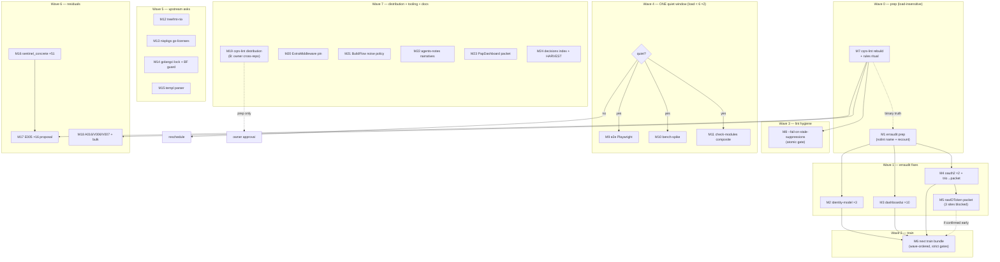

# Pareto Round-14 Execution Plan — "Gates Green First"

**Created:** 2026-10-01 15:04 · **Input:** `TODO_LIST.md` (2026-10-01 session-2 state, 22 open items) + `docs/status/2026-10-01_12-30_docs-health-round14-full-pass-status.md` §f + `docs/status/2026-10-01_10-30_pareto-w0-w3-train-gates-erraudit-status.md`.
**Continues:** `docs/planning/2026-10-01_06-47_pareto-round13-superb-execution-plan.md` (train-first — the family train SHIPPED, so round-14's axis moves to gate honesty + upstream debt).
**Repo state at planning:** master clean, CI green (run 36839790817), root train v4.13.0 family live, 15/15 coverage gates green, lint 0/15 modules. **One red class remains:** the BuildFlow findings gate (`fail_on: critical`) is *honestly red* on the erraudit `context_loss` remainder (25 of 61 sites).

---

## 0. Context — what changed since round-13 (read before executing)

1. **The family train shipped 2026-10-01** (usermgmt v4.13.0 codec migration → root v4.13.0 → v4.13.1/v4.12.1/v4.13.2 rides): strict train gates 0 lag / 0 unpublished. P1 is empty; the next train exists only as the *vehicle* for the erraudit fixes (M6 below).
2. **The toolchain tug-of-war is over**: fleet re-pinned to `go 1.27.1` (flake + go.work + 16 `.golangci.yml` `run.go` values), the go-etag go.work pin retired at its natural end, and the workspace-build gate (T07) now guards the class. Do NOT restore 1.26.7 anywhere — that posture is history.
3. **New tooling this morning:** `.#fmt` (scoped format), `.#bump-dep` (`--commit`/`--verify`/single-line fix), `.#test-all` (race incl. e2e/examples), status-row PARTIAL normalizer + tail-budget advisory gate. Their self-tests are verified standalone; the full `check-modules` composite re-run is still owed (M11).
4. **The pre-push hook enforces strict train gates** — pushes fail on unpublished requires. Today's list is clean, so a push is safe; any train work inside this plan must keep it that way (wave-order per release-playbook §3a).
5. **Quiet-window discipline (OQ16):** the e2e/bench-spike battery slice and the composite gate re-run need verified-quiet machine (load < 6, checked twice). Everything else in this plan is load-insensitive.

---

## 1. Pareto Breakdown

### The 1% that delivers 51% — *make the gates honestly green again*

The repo has exactly one dishonest state left: the findings gate is red with 25 known erraudit `context_loss` sites, and the system cqrs-lint binary is stale (pre-fix C040 build) which blocks the stale-suppressions wiring. Closing both restores the property this repo runs on: **a red gate means something is wrong; a green gate means the tree is trustworthy.** Every later session, every CI run, and the next consumer train inherit that.

- **T1.1** Verify empirically which `//nolint:<analyzer>` name erraudit honors (before any suppression relies on it) + re-derive the 61-vs-54 extractor count discrepancy.
- **T1.2** Fix the 22 decidable sites (identity-model authz ×3, dashboardui ×10+, oauth2 ×2) with family-preserving wraps; prepare the rawIDToken ×3 suppress-with-reason packet for the owner confirm.
- **T1.3** Rebuild the system cqrs-lint binary; verify C040 stays silent on a strict root walk; retire the gotcha-13 caveat; wire `--fail-on-stale-suppressions` behind the new binary.
- **T1.4** Bundle the published-module changes into the next tag train (wave-order, verify-tag choreography).

### The 4% that delivers 64% — *+ prove the green, then keep it provable*

A green gate you haven't re-verified end-to-end is still an assumption. The 4% closes the verification battery (the last slice: e2e Playwright, bench-spike look, composite `check-modules`) and converts the stale-binary unblock into permanent lint-config hygiene.

- **T4.1** e2e Playwright suite + `bench-spike` look in a verified-quiet window (load < 6 twice).
- **T4.2** `check-modules` full composite re-run (27 stages) in the same window.
- **T4.3** `cqrs-lint rules` old-vs-new diff ritual around the binary rebuild (T1.3) — suppression re-attribution is a silent killer (gotcha 13).

### The 20% that delivers 80% — *+ stop the shim rot, start the largest residual class*

The repo carries five working per-repo shims for upstream bugs (they rot silently) and a ~51-finding erraudit class (`sentinel_concrete_type`) that is the largest remaining inventory. The 20% files the asks upstream (verify-before-filing discipline), triages the residuals into concrete dispositions, and starts the Go-installable cqrs-lint path that unblocks two CI items.

- **T20.1** Draft + file the 5 fleet upstream asks (treefmt-nix templ Go-pin; nixpkgs go-licenses GOROOT; golangci TMPDIR lock; BuildFlow go-work-sync union-graph guard with `373209a7` as the case study; a-h/templ parser repro from round-12).
- **T20.2** cqrs-lint residual triage: `sentinel_concrete_type` ×51 disposition, E005×16 second-linter-fix candidate, A016/V006×4 suppress-with-reason, V007×41 posture note.
- **T20.3** cqrs-lint Go-installable distribution (publish step from the 2026-08-30 draft) → unblocks `check-cqrs-lint` CI + the strict CI gate items.
- **T20.4** Tooling remainder: e2e `ExtraMiddleware`-under-`RunWithAppkit` pin; BuildFlow noise-policy batch (vulnix dead feed, "9 tools unavailable" class, jscpd dupes).
- **T20.5** PapDashboard reply packet (codec prerequisite is LIVE; #67/#68 landing points) + OQ23/24 decision memo for the owner.

### The remaining 20% to 100% — *owner calls, v5-window, and demand-gated work*

Not scheduled as execution work — they are decision packets or v5-window items, listed so nothing is forgotten:

- Owner calls: `examples/datastar-demo` rebrand-or-remove (evidence says KEEP AS-IS); loginpage templ-components adoption (OQ21); rawIDToken suppress confirm (T1.2's packet); `/mnt/buildcache` reclaim (rust/ 155G + sccache/ 20G are not this repo's to delete); go-cqrs-lite cross-repo docs debt.
- v5-window: `ProjectionLayer` removal bundle (prep done); usermgmt V007 68-finding cluster (gated on ADR-0051 metaengine planning); appkit as setup server layer (ADR-0052).
- Demand-gated: DataStar Tier 4 panel variants (ADR-0050 — nothing actionable without demand signal); SidebarNav revisit (re-check vs templ-components v1.19.4+ on next UI change); BuildFlow `go-version-auto-configure` re-enable (blocked on BF1–BF3 upstream).

---

## 2. Comprehensive Plan — Medium tasks (30–100 min each)

Sorted by importance/impact/effort/customer-value. "ALL TODOs" mapping in the last column.

| # | Task | Min | Impact | Effort | Depends | TODO item |
| --- | --- | ---: | --- | --- | --- | --- |
| M1 | erraudit prep: empirically verify the `//nolint` analyzer name erraudit honors (scoped run on a scratch wrap); re-derive the 61-vs-54 site-count discrepancy in the working-note extractor; write findings into AGENTS gotcha draft | 60 | HIGH (everything downstream relies on it) | LOW | — | P2 erraudit "FIRST MOVES" |
| M2 | erraudit fixes: identity-model `authz_roles.go` L31/L46/L63 (userID context) — 3 family-preserving wraps + scoped erraudit run 0 | 45 | HIGH | LOW | M1 | P2 erraudit (22-site remainder) |
| M3 | erraudit fixes: dashboardui `config.go` L225/231/235, `core/events.go` L137/143/200, `handlers_audit.go` L287/305/322/333 (streamID/streamType/pageSize/eventID/targetID) — 10 wraps + scoped runs 0 | 75 | HIGH | MED | M1 | P2 erraudit |
| M4 | erraudit fixes: `usermgmt/oauth2` `service_oauth2_extracted.go` L191/L281 + `provider.go` L329/L336/L346 — the two decidable sites get family-preserving wraps; the rawIDToken trio gets the suppress-with-reason packet | 60 | HIGH | MED | M1 | P2 erraudit |
| M5 | rawIDToken owner packet: 1-page memo (live-credential rationale, proposed `//nolint` + reason text, security tradeoff) → docs/feedback or TODO §g; BLOCKED on owner confirm for the 3 sites | 30 | HIGH (unblocks 3 sites + sets precedent) | LOW | M4 | W0–W3 §g1, TODO P2 |
| M6 | Next train bundle: wave-ordered cuts carrying M2–M4 changes (identity-model → usermgmt/oauth2 → dashboardui → root ride if needed); verify-tag choreography, strict gates at every step; post-train `--refresh-cache` re-run | 100 | HIGH (published code) | HIGH | M2 M3 M4 (M5 optional) | P2 erraudit "bundle with next train" |
| M7 | cqrs-lint system binary rebuild (from the fixed go-cqrs-lite source) + `--strict --verbose .` root walk → expect zero C040; run the `cqrs-lint rules` old-vs-new diff ritual (gotcha 13 re-attribution check) before trusting suppressions | 45 | HIGH (unblocks M8 + retires a gotcha) | MED | — | P2 rebuild item; T08 |
| M8 | Wire `--fail-on-stale-suppressions` into the flake gate (was blocked on M7) + fixture self-test + check-modules stage + CI step (atomic-gate checklist) | 45 | MED-HIGH (permanent suppression hygiene) | MED | M7 | P3 tooling (b) |
| M9 | e2e Playwright suite run (proves the snapshot sentinel change `nil,nil` → `ErrSnapshotNotFound`) — quiet window only | 60 | HIGH (battery closure) | MED | quiet window | P2 battery |
| M10 | bench-spike look after the 09-30 dep bumps; re-pin baseline ONLY on idle machine + same-change bench-path edits (or record "no regression, no re-pin") | 45 | MED (regression detector) | LOW | quiet window | P2 battery |
| M11 | `check-modules` full composite re-run (27 stages incl. the two new self-tests) — same quiet window; converts the standalone verifications into a composite green | 60 | MED-HIGH (state proof) | LOW | quiet window | P2 battery |
| M12 | Upstream ask 1: treefmt-nix `programs.templ` Go-pin (repro: sandbox GOTOOLCHAIN download) — verify against upstream source, draft in Lars's voice, file, record link | 60 | MED-HIGH (fleet-wide shim retirement) | MED | — | P2 upstream (a) |
| M13 | Upstream ask 2: nixpkgs go-licenses GOROOT hard-export (repro: `crypto/mldsa` fatal) — same discipline | 60 | MED-HIGH | MED | — | P2 upstream (b) |
| M14 | Upstream asks 3+4: golangci-lint machine-global TMPDIR lock opt-out; BuildFlow go-work-sync union-graph guard (case study `373209a7`) — two filings, one session | 75 | MED-HIGH | MED | — | P2 upstream (c)(d) |
| M15 | Upstream ask 5: a-h/templ parser issue (silent literal render after text-position `@comp`; round-12 repro in agents-notes) — minimal repro repo + filing | 45 | MED (correctness of templ) | MED | — | P2 upstream (e) |
| M16 | cqrs-lint residual: `sentinel_concrete_type` ×51 (usermgmt errors.go) — disposition pass: how many are genuine interface-sentinel candidates vs suppress-with-reason; write the policy | 90 | MED (largest remaining erraudit inventory) | HIGH | M1 (analyzer-name knowledge) | P3 residual (f) |
| M17 | cqrs-lint residual: E005×16 identity-model — assess the missing cross-module fail-open as a candidate second linter fix in go-cqrs-lite; write the proposal (don't implement cross-repo without owner) | 60 | MED | MED | M7 (current binary) | P3 residual (a) |
| M18 | cqrs-lint residual: A016 + V006×4 suppress-with-reason (per-module-train policy) + V007×41 posture note pointing at ADR-0051/OQ11; dispose the ~130-finding bulk list into documented classes | 45 | MED (turns noise into decisions) | LOW | M7 | P3 residual (b)(c)(d) |
| M19 | cqrs-lint Go-installable distribution: execute the publish step from `docs/planning/2026-08-30_cqrs-lint-go-distribution-draft.md` (module + tag + install path) → unblocks check-cqrs-lint CI + strict CI gate items | 100 | MED-HIGH (two CI items) | HIGH | M7 | P2 CI + P3 CI gate |
| M20 | Tooling remainder (i): e2e pin test — `ExtraMiddleware` composes under `RunWithAppkit` (write the failing-then-passing test) | 45 | MED | MED | — | P3 tooling (i) |
| M21 | Tooling remainder (m): BuildFlow noise-policy batch — vulnix dead-NVD-feed disposition, "9 tools unavailable" class, jscpd config dupes; write the noise policy so hook output is signal-only | 60 | MED (hook signal quality) | MED | — | P3 tooling (m) |
| M22 | Docs: agents-notes narratives — the cqrs-lint three-pass arc + the three-tools-vs-nixpkgs-default-Go story (prose assembly from the source reports) | 60 | MED (memory preservation) | LOW | M7 (arc ending) | P3 docs (a) |
| M23 | PapDashboard reply packet: confirm codec prerequisite live (usermgmt v4.13.0), point #67/#68 landing, attach OQ23/24 decision memo (architectural go/no-go pair) for the owner | 45 | MED-HIGH (external commitment) | LOW | — | P3 PapDashboard |
| M24 | Owner-decisions index: standing TODO_LIST section (or ROADMAP table) fed by every report §g — founding entries: rawIDToken, toolchain-policy (CLOSED — record it), datastar-demo, loginpage OQ21, buildcache reclaim, OQ23/24; + HARVEST this plan into TODO_LIST | 45 | MED (stops decision loss) | LOW | — | round14 §f11 + this plan |

**Sum:** ~1,725 min ≈ 28.8 h. Every M ends with a commit; quiet-window tasks (M9–M11) batch into one window.

---

## 3. Detailed Breakdown — Micro tasks (≤12 min each)

Same sort order; each row is one sitting. Status column: `—` open, `B` blocked (external), `Q` quiet-window-gated.

### M1 — erraudit prep

| # | Micro | Min | St |
| --- | --- | ---: | --- |
| 1.1 | Scratch file: add `//nolint:erraudit` above one known site → scoped erraudit run → observed? Record the honored name | 10 | — |
| 1.2 | Try the likely alternates (`erraudit-concrete`, tool name variants) if 1.1 shows nothing; record the winner + the proof run | 10 | — |
| 1.3 | Open the working-note extractor; recount sites with the fixed analyzer list; explain 61 vs 54 (dedup? file filters?) | 12 | — |
| 1.4 | Write the reconciled 25-site list (exact file:line, one line each) into the erraudit working note | 10 | — |
| 1.5 | AGENTS gotcha draft: erraudit nolint-name + the recount method (2 short bullets, survive-format form) | 8 | — |

### M2 — identity-model authz fixes

| # | Micro | Min | St |
| --- | --- | ---: | --- |
| 2.1 | Read `authz_roles.go` L31/L46/L63 call sites; identify the right error-family wrap for each | 10 | — |
| 2.2 | Fix L31 + scoped erraudit run → 0 on file | 8 | — |
| 2.3 | Fix L46 + L63 + scoped runs → 0 | 10 | — |
| 2.4 | Hermetic verify: `GOWORK=off` build/vet/test identity-model + golangci-lint 0 | 10 | — |
| 2.5 | Commit (narrative message) | 5 | — |

### M3 — dashboardui fixes

| # | Micro | Min | St |
| --- | --- | ---: | --- |
| 3.1 | Read `config.go` L225/231/235 contexts; pick wrap style consistent with the module's error usage | 10 | — |
| 3.2 | Fix config.go trio + scoped runs → 0 | 12 | — |
| 3.3 | Read `core/events.go` L137/143/200; fix + scoped runs → 0 | 12 | — |
| 3.4 | Read `handlers_audit.go` L287/305/322/333; fix + scoped runs → 0 | 12 | — |
| 3.5 | Hermetic verify dashboardui (build/vet/test/lint/fmt) | 12 | — |
| 3.6 | fmt-markers test still green (renders all 9 routes); commit | 8 | — |

### M4 — oauth2 fixes

| # | Micro | Min | St |
| --- | --- | ---: | --- |
| 4.1 | Read `service_oauth2_extracted.go` L191: wrap with family preservation (which family? check the wrapped error) | 10 | — |
| 4.2 | Fix L191 + L281 (L281 = bare propagation → family-preserving wrap) + scoped runs → 0 | 12 | — |
| 4.3 | Read `provider.go` L329/336/346; confirm rawIDToken is the context loss → route to the suppress packet (M5), do NOT wrap | 8 | — |
| 4.4 | Hermetic verify usermgmt/oauth2 | 10 | — |
| 4.5 | Commit | 5 | — |

### M5 — rawIDToken owner packet (3 sites BLOCKED on confirm)

| # | Micro | Min | St |
| --- | --- | ---: | --- |
| 5.1 | Draft memo: what rawIDToken is (live credential), why context-enriching it into errors could leak it to logs, proposed `//nolint` + reason text, what the reviewer should check | 12 | — |
| 5.2 | Add the packet to the owner-decisions index (M24) + TODO §g pointer; mark the 3 sites `B` in the working note | 8 | — |
| 5.3 | If owner confirms early: apply the 3 suppressions + scoped runs → 0; else leave for the next train | 10 | B |

### M6 — next train bundle

| # | Micro | Min | St |
| --- | --- | ---: | --- |
| 6.1 | Preflight: `nix run .#preflight-tree-check` + `git log` attribution check (daemon sweep) | 8 | — |
| 6.2 | Wave 1: identity-model version bump + CHANGELOG section + tag via `scripts/verify-tag.sh` (committed tree enforced) | 12 | — |
| 6.3 | Wave 2: usermgmt/oauth2 rides identity-model; CHANGELOG + tag | 12 | — |
| 6.4 | Wave 3: dashboardui rides (note: CSS bundle rule — only if templ-components changed; here it did NOT, so verify bundle untouched) + tag | 12 | — |
| 6.5 | Wave 4: root/consumer rides (`bump-dep --commit` per module, never chained) | 12 | — |
| 6.6 | Hermetic `go get` verification of the published copies (the release protocol tail) | 12 | — |
| 6.7 | Push + pre-push strict gates green; `check-release-train --refresh-cache` re-run; confirm advisory list unchanged | 10 | — |
| 6.8 | CHANGELOG date stamps + CI watch on the push (record run id) | 10 | — |

### M7 — cqrs-lint binary rebuild + ritual

| # | Micro | Min | St |
| --- | --- | ---: | --- |
| 7.1 | In `~/projects/go-cqrs-lite`: `cqrs-lint version` (before) → record `3756eb4, 20260929`; build from the fixed source | 10 | — |
| 7.2 | Install the new system binary per its install path; `cqrs-lint version` (after) — confirm build date moved | 8 | — |
| 7.3 | `cqrs-lint rules > /tmp/rules-new.txt`; diff vs `rules-old` capture (the gotcha-23 ritual) — re-attribution check | 10 | — |
| 7.4 | `cqrs-lint --strict --verbose .` root walk → confirm ZERO C040; capture output as the retirement evidence | 10 | — |
| 7.5 | Re-run `nix run .#check-cqrs-lint` (14 modules, strict) → expect green with the new binary; fix re-attributed suppressions if any fired | 12 | — |
| 7.6 | AGENTS gotcha 13: strike the stale-binary caveat with the evidence hash + date; commit | 8 | — |

### M8 — stale-suppressions wiring (unblocked by M7)

| # | Micro | Min | St |
| --- | --- | ---: | --- |
| 8.1 | Confirm the flag's exact name/semantics against the NEW binary (`cqrs-lint --help`) | 8 | — |
| 8.2 | Add the flag to the flake app invocation; run `.#check-cqrs-lint` → observe (green = no stale suppressions exist today) | 10 | — |
| 8.3 | Negative self-test fixture: a deliberately stale suppression in `scripts/testdata/` → gate must FAIL (atomic-gate checklist) | 12 | — |
| 8.4 | Add fixture self-test + check-modules stage + CI step + README command row | 12 | — |
| 8.5 | Commit | 5 | — |

### M9–M11 — verification battery (ONE quiet window: verify load < 6 twice before starting)

| # | Micro | Min | St |
| --- | --- | ---: | --- |
| 9.1 | Quiet-window gate: two `uptime`/load checks ≥ 5 min apart; if busy, reschedule (do NOT run under load) | 5 | Q |
| 9.2 | `PLAYWRIGHT_BROWSERS_PATH` + chromium env; run the Playwright suite; capture the snapshot-sentinel proof | 12 | Q |
| 9.3 | Triage any e2e failures (screenshots/axe/dashboard specs) — fix or file | 12 | Q |
| 9.4 | `nix run .#bench-spike` → compare vs `docs/benchmarks/setup-baseline.raw.txt`; decide re-pin (only idle + path-edits) or record no-regression | 12 | Q |
| 9.5 | e2e results into the battery section; TODO_LIST P2 battery item update | 8 | Q |
| 10.1 | bench re-pin/record commit (if applicable) | 8 | Q |
| 11.1 | `nix run .#check-modules` full composite (27 stages) — run to completion, capture summary | 12 | Q |
| 11.2 | Triage any stage failure (the 2 new self-tests are the likely suspects; fix forward) | 12 | Q |
| 11.3 | Update TODO_LIST battery item → fully green record with date; commit | 8 | Q |

### M12–M15 — upstream asks (each: verify → draft in github-voice → file → record link)

| # | Micro | Min | St |
| --- | --- | ---: | --- |
| 12.1 | treefmt-nix: locate the templ formatter wrapper source; confirm `pkgs.go` (1.26.x) is the culprit vs our override | 12 | — |
| 12.2 | treefmt-nix: check upstream issues for prior art (verify-before-filing) → file or comment; record link | 12 | — |
| 13.1 | nixpkgs: read the go-licenses wrapper; confirm the GOROOT export + `crypto/mldsa` fatal mechanism | 12 | — |
| 13.2 | nixpkgs: search prior art → file with our shim as the workaround; record link | 12 | — |
| 14.1 | golangci-lint: confirm the TMPDIR lock behavior (5s wait, abort) in source; check for existing opt-out flag | 12 | — |
| 14.2 | golangci-lint: file the per-invocation lock opt-out ask (or docs PR if a flag exists but is undocumented); record link | 12 | — |
| 14.3 | BuildFlow (own repo): implement or file the go-work-sync union-graph guard w/ `373209a7` case study | 12 | — |
| 14.4 | BuildFlow: add regression test fixture (a shielded replace must survive sync) | 12 | — |
| 15.1 | a-h/templ: rebuild the round-12 minimal repro (literal text + text-position `@comp` render) in a scratch repo | 12 | — |
| 15.2 | a-h/templ: check upstream issues → file with the repro; record link | 12 | — |
| 15.3 | AGENTS/TODO: mark the 5 asks FILED with links (shims can now be retired when upstream lands) | 8 | — |

### M16–M18 — cqrs-lint residual triage

| # | Micro | Min | St |
| --- | --- | ---: | --- |
| 16.1 | Dump `sentinel_concrete_type` ×51 (usermgmt errors.go); sample 10 — genuine vs noise classification | 12 | — |
| 16.2 | Classify the rest by pattern (likely 2-3 mechanical classes); count per class | 12 | — |
| 16.3 | Write the disposition policy: which classes become `error`-interface sentinels (code change), which get suppress-with-reason | 12 | — |
| 16.4 | Apply the code-change class (batch, family-preserving) OR file as the next erraudit program; scoped runs 0 | 12 | — |
| 17.1 | E005×16: read 3 sample sites; confirm the missing cross-module fail-open hypothesis | 10 | — |
| 17.2 | Write the go-cqrs-lite second-linter-fix proposal (owner-gated; do not implement there) | 12 | — |
| 18.1 | A016 + V006×4: suppress-with-reason at the exact sites (per-module-train policy text) | 10 | — |
| 18.2 | V007×41: add the posture note (ADR-0051/OQ11 pointer) so the findings read as decided, not forgotten | 8 | — |
| 18.3 | ~130-finding bulk: bucket into the documented classes; append the bucket table to the residual triage note | 12 | — |
| 18.4 | Commit the whole residual pass; scoped erraudit + cqrs-lint runs still 0/green | 8 | — |

### M19 — cqrs-lint distribution

| # | Micro | Min | St |
| --- | --- | ---: | --- |
| 19.1 | Read the 2026-08-30 draft; pick the publish shape (separate module `cmd/cqrs-lint` versioned? nested module?) | 12 | — |
| 19.2 | Prepare the module (go.mod, version const, README install line) in go-cqrs-lite — OWNER-GATED cross-repo: prep only, flag for approval | 12 | B |
| 19.3 | Tag + verify `go install` path works from a clean GOMODCACHE | 12 | B |
| 19.4 | Switch `check-cqrs-lint`'s CI story to the Go-installed binary (keep flake app locally); document both paths | 12 | B |
| 19.5 | Add the strict cqrs-lint CI gate item as unblocked; wire it | 12 | B |

### M20–M21 — tooling remainder

| # | Micro | Min | St |
| --- | --- | ---: | --- |
| 20.1 | Read `RunWithAppkit` middleware composition; write the pin test proving ExtraMiddleware ordering | 12 | — |
| 20.2 | Fix if broken (or document the proven composition if green); commit | 10 | — |
| 21.1 | vulnix dead-NVD-feed: confirm the feed is dead; disposition = pin/ignore/suppress-with-reason in the noise policy | 12 | — |
| 21.2 | "9 tools unavailable" class: list them; decide per tool (devshell-only → expected; missing → add or drop) | 12 | — |
| 21.3 | jscpd config dupes: dedupe or annotate; write the noise policy doc (hook output = signal-only) | 12 | — |
| 21.4 | Commit; one clean pre-commit run to confirm quieter output | 8 | — |

### M22–M24 — docs, external packet, decisions index

| # | Micro | Min | St |
| --- | --- | ---: | --- |
| 22.1 | agents-notes: the cqrs-lint three-pass arc (surfacing → source fix → system rebuild) — assemble from the three source reports | 12 | — |
| 22.2 | agents-notes: three-tools-vs-nixpkgs-default-Go story (templ wrapper, go-licenses, go.work pin) | 12 | — |
| 22.3 | Cross-link both narratives from AGENTS gotchas (one-line pointers, no duplication) | 8 | — |
| 23.1 | PapDashboard packet: confirm v4.13.0 live on the proxy; draft the reply (codec prerequisite landed; where #67/#68 land) | 12 | — |
| 23.2 | OQ23/24 decision memo: the two architectural go/no-go questions with evidence and a recommendation each | 12 | — |
| 23.3 | Send/hand off the packet; record the disposition pointer | 8 | — |
| 24.1 | Create the owner-decisions index section (TODO_LIST or ROADMAP table): rawIDToken, datastar-demo, loginpage OQ21, buildcache reclaim, OQ23/24, cross-repo docs debt + record toolchain-policy CLOSED | 12 | — |
| 24.2 | HARVEST this plan → TODO_LIST (new items in, consumed items out, sources linked) | 12 | — |
| 24.3 | Final sweep: `nix fmt` zero-diff, `git status` clean, commit + push | 10 | — |

**Micro total:** ~105 tasks · every TODO_LIST open item is covered (mapping via the M-column in §2).

---

## 4. Execution graph

**Parallelism:** M1/M7 start immediately and independently. M2–M4 run in parallel after M1 (different modules, no file overlap). M9–M11 share one quiet window. M12–M15 are fully independent of the erraudit thread. M16–M18 need M7's binary truth first.

---

## 5. anti-VERSCHLIMMBESSER guards

1. **No cross-repo edits without owner approval** (M17, M19): proposals and prep only — the go-cqrs-lite repo's "done" is its own bar (standing rule).
2. **No re-pinning without evidence**: bench baseline only on idle machine + same-change path edits + committed raw file.
3. **No chained bump-dep**: commit between invocations (the `9b3c2e18` lesson).
4. **No train cut with dirty go.mod edits or unverified suppressions**: the rules-diff ritual (7.3) precedes any suppression added in M8+.
5. **Quiet-window tasks don't run under load** — reschedule, don't force.
6. **Every gate change ships atomically**: checker + fixture self-test + flake app + check-modules stage + CI + README (M8 follows the checklist).

---

> **OUTCOME (2026-10-01 evening execution):** the erraudit 1% closed before this session (T06, 17:01 report); the battery legs verified (test 28/28 race, lint 0, coverage 15/15, check-cqrs-lint green; e2e 70/70 earlier; bench-spike honestly refused twice on load, still owed); M1-M5 superseded by the T06 close (analyzer facts + class template landed in gotcha 8; rawIDToken executed → owner confirm pending); M6 deferred to the next train window per the 17:01 decision; M7 done as LOCAL verification (fleet swap = owner, packet §8); M8 WIRED (`scripts/check-cqrs-lint.sh` + `--fail-on-stale-suppressions` — unblocked early: the flag predates the C040 fix; caught a real stale B024); M9-M11 done except bench (refused, load); M12-M15 executed as verify-before-filing: 3 filed (treefmt-nix#545, a-h/templ#1449, BuildFlow#29), 2 retired with evidence (go-licenses override exists; golangci `--allow-parallel-runners` exists); M16-M18 done via `docs/research/2026-10-01_cqrs-lint-residual-triage.md` (rebuilt-binary inventory — the plan's x51/x16/x41 numbers were stale; sentinel class SUPERSEDED); M19 = decision packet (T23, tag shape simplified to a nested-module tag); M20 done earlier (17:01); M21 = the tsconfig ERROR fixed at source + `docs/runbooks/buildflow-noise-policy.md`; M22 done earlier (17:01); M23 = packet §9 (reply drafted, proxy-verified); M24 = the owner-decisions index (TODO_LIST) + this harvest. Next-session frontier: bench-spike quiet window, the train (M6), and the D1-D10 decision list.

*Point-in-time plan. After execution, HARVEST leftovers into `TODO_LIST.md` (docs-health); annotate this file rather than rewriting it.*
