# Pareto Round 16 — Owner-Unlock & v5-Readiness Closeout

**Date:** 2026-10-03 03:49 · **Repo:** cqrs-htmx @ master (ahead 2: `671cb808` docs reconciliation + status-report commit) · **go-cqrs-lite:** `788cd7350` determinism fix unpushed-local
**Baseline:** v4.13.0 family train published (9 tags, 2026-10-01, CI green run 36839790817) · 28 modules · 15/15 coverage gates · lint 0/15 · check-modules 27/27 composite green (28th standalone-verified) · strict train gates 0 lag.
**Inputs:** `TODO_LIST.md` (25 open items), Owner-decision table D1–D10, ROADMAP OQ11/OQ21/OQ23/OQ24/OQ26, ADR-0051/0052, `docs/guides/v5-removal-inventory.md` §5c, session report `docs/status/2026-10-03_03-30_v007-verification-cqrs-lint-determinism-session.md`.

**Goal lens:** this is a LIBRARY — "customer" = external consumers. Customer value = (1) published, green, trustworthy v4 trains; (2) a credible, low-surprise v5 path; (3) day-to-day contributor tooling that doesn't lie (linters, gates, docs).

---

## Pareto Breakdown

### The 1% that delivers 51% — THE OWNER DECISION BATCH

One sitting of owner attention (~30 min) that unblocks nine tracked work items. Nothing else in the list moves without it.

| # | Decision | Unblocks |
|---|----------|----------|
| D4/T08 | Fleet cqrs-lint binary swap (pin → `b06ac8add5e8`+) | kills the 21 phantom C040 warnings; retires gotcha-13 caveat |
| D6 | Tag nested `cmd/cqrs-lint` module in go-cqrs-lite | strict cqrs-lint CI gate (TODO 41) + `check-cqrs-lint` in CI (TODO 29) |
| g1 | Approve go-cqrs-lite cross-repo records | CHANGELOG/AGENTS/TODO entries for `788cd7350` + 2026-09-30 batch (TODO 42) |
| E005 | Approve filing the cross-module FP proposal | closes the residual-triage open tail (TODO 40) |
| OQ11 | **v5 timeline** (date or trigger) | V007 migration branch, appkit revisit, ProjectionLayer deletion, module renames — the entire v5 cluster |
| D1/D2 | PapDashboard OQ23 (GO-conditional) / OQ24 (NO-GO) | reply send + their upgrade path |
| D3/D7/D8/D9/D10 | tick the already-executed recommendations | closes 5 tracking rows |
| D11 (NEW) | Scorecard evidence policy: module-root (current fix) vs most-specific subpackage | finalizes `788cd7350` follow-up |
| D5 | /mnt/buildcache reclaim window | hardware watch (TODO 45) |

### The 4% that delivers 64% — MECHANICAL EXECUTION BEHIND THE DECISIONS

All ≤100 min each, zero new design, each converts a "waiting" state into "done":

1. **T08 fleet swap execution** (pin bump → rebuild → rules-diff ritual → 2 documented B024 re-suppressions → 14-module strict gate → gotcha-13 retire).
2. **E005 upstream filing** (verify-before-filing + github-voice; proposal doc already written).
3. **go-cqrs-lite cross-repo records** (CHANGELOG ×2 batches, AGENTS gotcha line, TODO entry) + **its own verification bar** (golangci-lint + `-race` on `cmd/cqrs-lint`).
4. **Strict cqrs-lint CI gate wiring** (script is CI-ready; only the tag/publish step is missing).
5. **PapDashboard reply send** (drafted + proxy-verified 2026-10-01; send is owner's 12 min).

### The 20% that delivers 80% — ACTIONABLE HYGIENE WITHOUT ANY OWNER INPUT

Everything executable today, ranked by verifiability payoff:

6. **Bench-spike retry** (the ONLY remaining verification-battery leg; load-gated, honest-refusal protocol).
7. **Composite check-modules re-run** (28 stages; owed per TODO header).
8. **docs-health ARCHIVE pass** — 7 over-budget status reports → `docs/status/archived/` (tail-budget gate advisory red).
9. **v5 cut runbook skeleton** — wave-ordered deletion plan from `v5-removal-inventory.md` (classes 1–4 + 5b) so the OQ11 decision lands onto a ready artifact.
10. **go-cqrs-lite pre-commit "Doc-only" misclassification diagnosis** (it skipped code gates on my +49-line Go diff — silent gate-skip bug).
11. **A012×4 inspection** (decided v5-window, never actually examined).
12. **BuildFlow failing-step-name capture** (the 3 unnamed steps behind the `--no-verify` fallback).
13. **CHANGELOG receipt convention check** for docs-only commits (`671cb808`).
14. **Upstream-ask watch round** (treefmt-nix#545 / templ#1449 / BuildFlow#29).
15. **Hardware + /tmp hygiene round** (df ritual, VCS-cache health, /tmp session artifacts).
16. **HARVEST of this plan** into TODO_LIST (done with this commit).

### The other 20% (to 100%) — LONG/GATED TAIL

17. **Upstream: `system.New` durable-checkpoint option** (L; go-cqrs-lite) — first half of the ADR-0051 cluster-1 AND-gate.
18. **Upstream: declarative `Hydrator` equivalent** (L; go-cqrs-lite) — second half.
19. **V007 cluster-1 migration** (multi-session L; usermgmt SQL read models → metaengine) — only after 17+18.
20. **appkit adoption** (ADR-0052; v5-window; blocked on appkit master push + CI).
21. **DataStar Tier 4** (demand-gated M11–M16), **loginpage templ-components adoption** (OQ21), **datastar-demo rebrand** (D9), **ProjectionLayer deletion** (v5 bundle), **SidebarNav re-check** (waits on library dark-token shell ≥ v1.19.4), **BuildFlow go-version-auto-configure re-enable** (waits on BF1+BF2).
22. **Environment investigation** (starship `go` timeout; scorecard 41 s→10 s variance) — Low.

---

## Comprehensive Plan — Medium granularity (30–100 min each)

Sorted by importance → impact → effort → customer-value. **Owner** = requires Lars; **Exec** = agent-executable.

| # | Task | Tier | Who | Impact | Effort | Cust.value | Depends | Verify |
|---|------|------|-----|--------|--------|-----------|---------|--------|
| M1 | Consolidate D1–D10 + OQ11 + D11/D12 into one dated owner-decision sheet; hand off | 1% | Exec→Owner | Critical | 30m | High (unblocks 9 items) | — | sheet exists; every D-row has evidence link |
| M2 | T08 fleet cqrs-lint swap: pin bump, rebuild, rules-diff ritual, 2× B024 re-suppression, 14-module strict gate, gotcha-13 retire + CHANGELOG | 4% | Exec | High | 90m | Med (tooling truth) | D4 | `cqrs-lint version` shows new pin; gate rc=0; warnings gone |
| M3 | Post-swap verification: `.#check-cqrs-lint`, root-walk 0×C040 assert, composite `.#check-modules` (28 stages) | 4% | Exec | High | 30m+60m | Med | M2 | all three green in one quiet window |
| M4 | File E005 cross-module FP proposal upstream (verify-before-filing + github-voice) | 4% | Exec | Med | 30m | Med | owner OK (M1) | issue URL recorded in proposals/ |
| M5 | go-cqrs-lite cross-repo records: CHANGELOG entries (2026-09-30 batch + `788cd7350`), AGENTS gotcha line, TODO entry | 4% | Exec | Med | 60m | Med | g1 (M1) | committed in that repo; doc-links pass |
| M6 | go-cqrs-lite verification bar: `golangci-lint` + `go test -race` on `cmd/cqrs-lint` (both batches) | 4% | Exec | Med | 45m | Med | — | lint 0 findings; race rc=0 |
| M7 | Diagnose + fix/record go-cqrs-lite pre-commit "Doc-only" misclassification (Go diffs skipping code gates) | 20% | Exec | Med | 45m | Med (gate integrity) | — | repro diff now runs code gates; gotcha recorded |
| M8 | Wire strict cqrs-lint CI gate (publish step + workflow + confirm self-test lane) | 4% | Exec | Med | 45m | High (CI parity) | D6 (M1) | CI green incl. new step |
| M9 | Bench-spike retry at quiet window (load-gated; refuse under contention) | 20% | Exec | Med | 30m | Med | load < threshold | gate rc=0 with recorded numbers |
| M10 | Upstream-ask watch round: treefmt-nix#545, templ#1449, BuildFlow#29 — fetch, triage, record | 20% | Exec | Low | 30m | Low | — | watch log updated in TODO item |
| M11 | docs-health ARCHIVE pass: verify-harvest then `git mv` the 7 over-budget status reports | 20% | Exec | Med | 90m | Med (doc trust) | — | tail-budget gate green; row gate green |
| M12 | A012×4 inspection + disposition note in the residual-triage doc | 20% | Exec | Low | 30m | Low | — | note with per-finding verdict |
| M13 | Capture the 3 failing BuildFlow pre-commit step names (dry-run + tee); append agents-notes | 20% | Exec | Low | 30m | Low (process truth) | — | names recorded; message trail amended |
| M14 | CHANGELOG receipt convention check for docs-only commits; add `671cb808` receipt if warranted | 20% | Exec | Low | 30m | Low | — | convention decided + applied |
| M15 | v5 cut runbook skeleton: wave-ordered deletion plan (inventory classes 1–4, 5b), consumer migration notes, pre-cut gate checklist | 20% | Exec | High (v5 prep) | 90m | High | — | runbook at docs/runbooks/; links pass |
| M16 | Upstream design spike: `system.New` durable-checkpoint store option (`WithCheckpointStore`) | tail | Exec | High | 100m | High | — | design doc + API sketch in go-cqrs-lite |
| M17 | Upstream design spike: declarative `Hydrator` equivalent for the system path | tail | Exec | High | 100m | High | — | design doc; criterion mapping vs `sql_hydrate.go` |
| M18 | V007 cluster-1 migration PLAN (views inventory, metaengine mapping, hydration/checkpoint mapping, test plan) — planning only until M16+M17 land | tail | Exec | High | 90m | High | M16, M17 | plan reviewed against ADR-0051 criterion |
| M19 | Hardware + /tmp hygiene: `df -h` ritual check, `/tmp/v007probe`+artifacts cleanup, `check-vcs-cache` | 20% | Exec | Low | 30m | Low | — | disk noted; /tmp clean; cache gate green |
| M20 | Evidence-policy implementation per D11 (root-min stands or switch to most-specific) + upstream test update | tail | Exec | Low | 30m | Low | D11 (M1) | permutation test matches policy |
| M21 | HARVEST this plan into TODO_LIST/ROADMAP (new items only; no duplicates) | 20% | Exec | Med | 30m | Med | — | TODO rows added; no duplication |
| M22 | Environment investigation: starship go-timeout + scorecard 41 s→10 s variance | tail | Exec | Low | 30m | Low | — | cause noted (cache vs load) |
| M23 | SidebarNav criteria re-check vs templ-components ≥ v1.19.4 (cheap check now, full at next UI change) | tail | Exec | Low | 30m | Low | — | criterion-1 verdict recorded |
| M24 | PapDashboard reply SEND (drafted + proxy-verified; owner channel) | 4% | Owner | High | 12m | High (consumer) | D1/D2 (M1) | sent confirmation |
| M25 | Composite `.#check-modules` re-run (owed per TODO header) — folds into M3 if post-swap | 20% | Exec | Med | 60m | Med | quiet window | rc=0 all 28 stages |

**Counts:** 25 medium tasks · 1%-tier: 1 · 4%-tier: 5 · 20%-tier: 11 · tail: 8.

---

## Detailed Breakdown — Fine granularity (≤12 min each)

101 micro-tasks. F# → parent M#. Every task has a concrete verify step. Sorted within parent by execution order; parents sorted as above.

| F# | Micro-task (≤12 min) | Parent | Impact | Effort | Verify |
|----|----------------------|--------|--------|--------|--------|
| F01 | Collect the 3 decision packets (round14-tail, T23/T18g, this plan's D11/D12) into one folder view | M1 | High | 8m | all packets openable |
| F02 | Draft the consolidated decision sheet (one row per D1–D12 + OQ11, each with recommendation + evidence link) | M1 | High | 12m | sheet renders; rows = 13 |
| F03 | Add OQ11 (v5 timeline) as the headline row with the unlock-list | M1 | High | 6m | unlock list matches §1% table |
| F04 | Hand off: commit sheet + notify owner channel | M1 | High | 4m | commit hash |
| F05 | Read packet §8 swap steps; locate the fleet pin (flake/home-manager source) | M2 | High | 10m | pin location noted |
| F06 | Bump the pin to `b06ac8add5e8`+ (or newer go-cqrs-lite master incl. `788cd7350`) | M2 | High | 10m | pin diff |
| F07 | Rebuild the system cqrs-lint binary; `cqrs-lint version` shows new commit | M2 | High | 12m | version string |
| F08 | Rules-diff ritual: `cqrs-lint rules` old vs new, diff, confirm only-C043(+safe) delta | M2 | High | 12m | diff archived |
| F09 | Root manual walk: assert 0×C040 phantoms | M2 | High | 8m | zero warnings |
| F10 | Re-add the 2 documented B024 suppressions (setup/setup.go:139, usermgmt/es_setup.go:221) | M2 | Med | 10m | gate re-green |
| F11 | Run the 14-module strict gate (`.#check-cqrs-lint`) | M2 | High | 12m | rc=0 |
| F12 | Retire the gotcha-13 stale-binary caveat in AGENTS.md + CHANGELOG entry | M2 | Med | 10m | docs-links pass |
| F13 | `.#check-cqrs-lint` full run post-swap | M3 | High | 12m | rc=0 |
| F14 | Composite `.#check-modules` (28 stages) in the same quiet window | M3 | Med | 12m* | rc=0 (*runs long: background) |
| F15 | Record battery results in TODO header restamp | M3 | Low | 6m | header updated |
| F16 | Re-verify E005 premise against current cqrs-lint source (cross-module registration FP) | M4 | Med | 12m | premise holds |
| F17 | Draft the upstream issue from the existing proposal doc | M4 | Med | 12m | draft text |
| F18 | github-voice pass on the draft | M4 | Med | 8m | voice checklist |
| F19 | File it; record URL in proposals/ + TODO 40 tail | M4 | Med | 5m | issue URL |
| F20 | go-cqrs-lite CHANGELOG entry: 2026-09-30 C040 collector fix batch | M5 | Med | 10m | entry committed there |
| F21 | go-cqrs-lite CHANGELOG entry: `788cd7350` scorecard determinism | M5 | Med | 10m | entry committed there |
| F22 | go-cqrs-lite AGENTS.md: add the "Doc-only classifier" + determinism gotcha lines | M5 | Med | 12m | doc-check passes |
| F23 | go-cqrs-lite TODO entry for M6/M7 follow-ups | M5 | Low | 8m | entry exists |
| F24 | Commit the cross-repo records (phase-boundary commit there) | M5 | Med | 6m | commit hash |
| F25 | `golangci-lint run` on `cmd/cqrs-lint` (both batches' files) | M6 | Med | 12m | 0 findings or fixed |
| F26 | `go test -race ./...` on `cmd/cqrs-lint` | M6 | Med | 12m | rc=0 |
| F27 | Record results in that repo's TODO entry | M6 | Low | 4m | note present |
| F28 | Repro: stage a small Go diff in go-cqrs-lite; run pre-commit dry-run; confirm "Doc-only" skip | M7 | Med | 10m | skip reproduced |
| F29 | Locate the classifier condition in its hook/buildflow config | M7 | Med | 12m | condition identified |
| F30 | Fix the condition (or record upstream if buildflow-owned) | M7 | Med | 12m | Go diff now runs gates |
| F31 | Verify with a real small Go commit through the hook | M7 | Med | 10m | gates ran |
| F32 | Tag the nested `cmd/cqrs-lint` module in go-cqrs-lite (verify-tag protocol) | M8 | Med | 12m | tag pushed |
| F33 | Add the install/publish step to the CI workflow | M8 | Med | 12m | workflow diff |
| F34 | Enable the `check-cqrs-lint` CI step (uncomment/wire) | M8 | Med | 8m | step present |
| F35 | Confirm CI green incl. the new step | M8 | High | 12m | run URL |
| F36 | Load check (`uptime`/`awk`); refuse if contended | M9 | Med | 2m | go/no-go noted |
| F37 | Run `.#bench-spike`; archive numbers | M9 | Med | 12m | gate rc / refusal log |
| F38 | Fetch the 3 upstream threads (treefmt-nix#545, templ#1449, BuildFlow#29) | M10 | Low | 10m | states fetched |
| F39 | Triage any responses; draft replies if needed | M10 | Low | 12m | triage note |
| F40 | Update TODO item 28 watch log | M10 | Low | 4m | entry |
| F41 | For each of the 7 over-budget reports: verify resolved/harvested (read §f, check TODO) | M11 | Med | 12m×7 | verdict per report |
| F42 | `git mv` each verified report to `docs/status/archived/` | M11 | Med | 3m×7 | paths moved |
| F43 | Re-run `.#check-docs-tail-budget` + row/annotation gates | M11 | Med | 10m | budget green |
| F44 | Run A012 on the flagged modules; read the 4 findings | M12 | Low | 10m | findings listed |
| F45 | Write per-finding verdict into the residual-triage doc | M12 | Low | 8m | note |
| F46 | Re-trigger pre-commit via dry-run with output teed to /tmp | M13 | Low | 10m | log captured |
| F47 | Extract the 3 failing step names from the log | M13 | Low | 6m | names |
| F48 | Append them to agents-notes + amend trail note | M13 | Low | 8m | note present |
| F49 | Check CHANGELOG convention for docs-only commits (git log docs commits) | M14 | Low | 8m | convention |
| F50 | Add `671cb808` receipt or record the skip-decision | M14 | Low | 6m | entry/rationale |
| F51 | Skeleton: create runbook file + section structure | M15 | High | 8m | file exists |
| F52 | Wave 1 list: classes 1–2 deletions (httputil/SSE re-exports, Raw broadcaster) with symbol lists | M15 | High | 12m | class lists |
| F53 | Wave 2 list: class 3 (identity-model re-export aliases, ~161 symbols/22 files) | M15 | High | 12m | file list |
| F54 | Wave 3 list: class 4 (NewUserID, storage view call sites per §5c, snapshot helper) | M15 | High | 10m | list |
| F55 | Wave 4 list: 5b stack surface (adapter, buildStackRepositories, Bundle field, templates) + ProjectionLayer | M15 | High | 10m | list |
| F56 | Consumer migration notes consolidation (v4-to-v5.md cross-links) | M15 | High | 12m | links pass |
| F57 | Pre-cut gate checklist (build/test/lint/isolation/train/docs-links + docs sweep greps) | M15 | High | 10m | checklist |
| F58 | Review pass against `v5-removal-inventory.md` (every class covered) | M15 | High | 12m | coverage table |
| F59 | Read system.New checkpoint internals; map injection points | M16 | High | 12m | notes |
| F60 | Sketch `WithCheckpointStore`/`WithDeadLetterStore` option API | M16 | High | 12m | API sketch |
| F61 | Checkpoint store interface contract vs projectionhost's | M16 | High | 12m | contract table |
| F62 | Persistence/dialect considerations note (sqlite/pg/mysql) | M16 | Med | 12m | note |
| F63 | Test-plan sketch (equivalence + restart scenarios) | M16 | High | 12m | plan |
| F64 | Write the design doc in go-cqrs-lite docs/ | M16 | High | 12m | doc committed |
| F65 | Map usermgmt `Hydrator` contract → declarative world (who rebuilds what on restart) | M17 | High | 12m | mapping table |
| F66 | Survey metaengine catchup/state machinery for hydration semantics | M17 | High | 12m | survey note |
| F67 | Design the declarative equivalent (option/DSL shape) | M17 | High | 12m | design sketch |
| F68 | Write the design doc + criterion verdict update in §5c | M17 | High | 12m | doc + §5c updated |
| F69 | Inventory the 4 read models' view structs + indexes (from §5c findings) | M18 | High | 12m | inventory |
| F70 | Map each view → metaengine collection + fold declarations | M18 | High | 12m | mapping |
| F71 | Map email/externalAccounts keyed lookups → FilterOnField queries | M18 | High | 12m | mapping |
| F72 | Map checkpoint+hydrate restart path → new system options | M18 | High | 12m | mapping |
| F73 | Test plan: port the SQL read-model test matrix to the declarative path | M18 | High | 12m | plan |
| F74 | Execution order + risk note (dialects, TOTP-secret persistence quirk) | M18 | High | 10m | plan section |
| F75 | `df -h /mnt/buildcache` + note | M19 | Low | 2m | reading |
| F76 | Clean `/tmp/v007probe/`, `/tmp/v007-findings.txt`, `/tmp/cqrs-lint-fixed` | M19 | Low | 4m | gone |
| F77 | `bash scripts/check-vcs-cache.sh` | M19 | Low | 8m | green |
| F78 | Apply D11 verdict (keep root-min or switch to most-specific in matchModule) | M20 | Low | 8m | diff |
| F79 | Update/extend the permutation test to pin the chosen policy | M20 | Low | 10m | test green |
| F80 | Rebuild + 6-run determinism proof | M20 | Low | 8m | 6/6 identical |
| F81 | Diff this plan's §f vs TODO_LIST; list genuinely-new rows | M21 | Med | 10m | diff list |
| F82 | Add new rows (no duplicates; P2/P3 placement) | M21 | Med | 12m | rows added |
| F83 | Restamp TODO Updated header | M21 | Low | 4m | header |
| F84 | Time two consecutive scorecard runs on the box | M22 | Low | 10m | timings |
| F85 | Check go env/GOCACHE state + load during run | M22 | Low | 8m | env note |
| F86 | Record cause hypothesis (cold package cache vs load) in the status report tail | F22→M22 | Low | 6m | note |
| F87 | Fetch templ-components release notes ≥ v1.19.4; check for dark sidebar tokens | M23 | Low | 10m | verdict |
| F88 | Record criterion-1 verdict in TODO item 30 | M23 | Low | 4m | entry |
| F89 | Owner: send the PapDashboard reply (draft staged 2026-10-01) | M24 | High | 12m | sent |
| F90 | Quiet-window check for the composite run | M25 | Med | 2m | go/no-go |
| F91 | Kick `.#check-modules` (background), monitor | M25 | Med | 10m | rc=0 |
| F92 | Fold result into M3's battery record (dedup if same window) | M25 | Low | 4m | one record |

**Counts:** 92 listed micro-tasks (M11's 7 report verifications collapse into F41–F42 batches; M3/M25 share a window). Total estimated execution ≈ 11–12 h agent time + ~45 min owner time.

---

## Execution Graph

```mermaid
flowchart TD
    subgraph T1["1% — Owner Decision Batch (51%)"]
        M1[M1 decision sheet<br/>D1-D12 + OQ11]
    end
    subgraph T4["4% — Mechanical Execution (64%)"]
        M2[M2 T08 fleet swap]
        M3[M3 post-swap verify battery]
        M4[M4 file E005 upstream]
        M5[M5 go-cqrs-lite records]
        M8[M8 strict cqrs-lint CI gate]
        M24[M24 PapDashboard send]
    end
    subgraph T20["20% — Independent Hygiene (80%)"]
        M6[M6 lint+race cmd/cqrs-lint]
        M7[M7 hook classifier fix]
        M9[M9 bench-spike retry]
        M11[M11 status-report ARCHIVE]
        M13[M13 step-name capture]
        M15[M15 v5 runbook skeleton]
        M19[M19 hardware/tmp hygiene]
        M21[M21 HARVEST this plan]
        M12[M12 A012 inspection]
        M14[M14 CHANGELOG receipts]
        M10[M10 upstream watch]
    end
    subgraph TAIL["Other 20% — Long/Gated (100%)"]
        M16[M16 durable-checkpoint spike]
        M17[M17 declarative Hydrator spike]
        M18[M18 V007 migration plan]
        M20[M20 evidence policy impl]
        M22[M22 env investigation]
        M23[M23 SidebarNav recheck]
    end
    M1 -->|D4| M2
    M1 -->|E005| M4
    M1 -->|g1| M5
    M1 -->|D6| M8
    M1 -->|D1/D2| M24
    M1 -->|D11| M20
    M1 -->|OQ11| M15
    M2 --> M3
    M5 --> M6
    M4 --> M8
    M16 --> M18
    M17 --> M18
    M18 -.->|v5 window opens| V5((v5 cut))
    M15 -.-> V5
    M8 --> CI[CI parity complete]
    M3 --> BAT[battery 100% green]
```

**Sequencing rule:** T1 first (it is pure unlock), then T4 in dependency order, T20 anytime in parallel windows, TAIL spikes only after T4 lands (they consume go-cqrs-lite attention).

---

## Guardrails (anti-Verschlimmbesserung)

1. **No code migration of V007 clusters** before ADR-0051's criterion is met (M16+M17) — deprecation surface stays published until v5.
2. **Owner-gated items are not self-executed**: g1 records, D6 tag, E005 filing, reply sends, /mnt reclaim — prepare, never push unilaterally.
3. **Machine-pinned gates (bench-spike) refuse under load** — a contended number is worse than no number.
4. **Every tree-mutating batch step** runs behind `nix run .#preflight-tree-check`; commits at phase boundaries (the daemon is faster than a summary).
5. **`--no-verify` only with named failing steps** (M13 exists to make that possible next time).
6. Plans are point-in-time; the living source is TODO_LIST.md/ROADMAP.md — HARVEST (M21) is part of this commit.

---

*Plan artifact per `docs/planning/` conventions. Living trackers: [TODO_LIST.md](../../TODO_LIST.md) · [ROADMAP.md](../../ROADMAP.md). Inputs listed in the header.*
