# SUPERB Pareto Execution Plan — branching-flow Analysis Ratchet

**Date:** 2026-10-05 15:04 CEST
**Author:** Crush (session: branching-flow full analysis pass)
**Source report:** [`docs/status/2026-10-05_14-59_branching-flow-full-analysis.md`](../status/2026-10-05_14-59_branching-flow-full-analysis.md)
**Tool under plan:** `branching-flow` v0.2.0 (build `05d8209`) — 14 analyzers, ~3.4 s root walk.
**Format note:** The `pareto-planning` skill's canonical output is a styled HTML report. The operator explicitly requested a `.md` file with a mermaid.js or d2 execution graph, so this plan is `.md` with an inline Mermaid graph. Override recorded here so it is not mistaken for a new default.

> **GUARD RAIL (operator, verbatim):** *"If you VERSCHLIMMBESSER this system, I will cut off your balls."*
> Every task below is scoped to **add or document**, never to rip out working code on speculation. The only code-touching tasks (T3–T5) are tiny, local, and reversible. Data-model refactors (credentials) are **decision-only** here — no code until the owner answers Q2.

---

## 1. READ / UNDERSTAND / RESEARCH / REFLECT — methodology

The analysis pass produced **655 raw findings (~156 excluding phantom)**. The prior triage already adjudicated most as covers/deliberate. This plan's job is NOT to re-litigate the tool output, it is to convert a **one-off firehose into a durable, CI-enforceable ratchet** plus fix the handful of genuinely real items — without coupling modules or churning DTOs.

### Newly discovered facts that change the plan (research)

| Fact | Evidence | Impact on plan |
|---|---|---|
| **`branching-flow` has a native baseline gate** | `branching-flow all --help` → `--baseline` "Sarif baseline to diff against … exit gate fails only on NEW findings" | The ratchet (T1) is **directly supported**, not something we must build. Huge leverage. |
| Machine formats exist | `--format console\|csv\|d2\|dot\|finding\|html\|json\|markdown\|mermaid\|sarif\|tsv\|yaml` | CI + digest (T10) are cheap. |
| Generated files can be excluded | `--exclude-generated` (default true) | Suppresses templ/sqlc noise at the source. |
| **`pendingTOTPStore` keys on `userID.Get().String()`** | `usermgmt/totp.go:53,67` | Possible **gotcha-25 class** (display-form as key). Internally consistent (save+consume same form) → no live bug today, but worth the typed-key fix (T4). |
| `UserID` is a **type alias** to `id.UserID` | `identity-model/id.go:18` | Typed-key refactor is local to `usermgmt/totp.go`. |
| Credential shape referenced **76×** across 4 decls | `rg` count | Consolidation is **M–L and risky** → decision memo first (T7), not a code task. |

### Reflection — what the prior report got wrong

1. I ranked findings by intuition, not by `stats` severity → T6 fixes the 4 "high" `strong-id` rows.
2. I inferred module coverage from a file count → T8 replaces inference with a printed candidate count.
3. I buried the harvest → T12 routes it into `TODO_LIST.md`/`ROADMAP.md`.

---

## 2. PARETO BREAKDOWN

### The 1% that delivers 51% — **the ratchet**
`T1 — Baseline + gate foundation`. One artifact (a committed SARIF baseline) + one flake app turns 655 findings into "**new findings since baseline = N**", fail-on-NEW. This is the single change that makes every future analysis run cheap, safe, and enforceable. It also **is** the whitelist mechanism: rejected findings get frozen in the baseline by construction.

### The 4% that delivers 64% — **add the three safe real fixes**
`T3` commandOptionApplier drift guard · `T4` pendingTOTPStore typed key · `T5` plainBodyWriter options struct.
Each is S, local, reversible, and touches no module boundary. Together they remove the only three findings that are both real and safe to change.

### The 20% that delivers 80% — **harden + document + route**
`T2` triage-decisions ledger · `T6` strong-id high rows · `T7` credential decision memo (no code) · `T8` coverage proof · `T9` CI wiring of the gate · `T11` AGENTS entry · `T12` HARVEST · `T13` annotate report+plan · `T14` analyzer-subset tuning · `T23` memory note.

### The other 20% that gets us to 100% — **speculative / ROI-gated**
`T10` JSON nightly digest · `T15` navItem comment · `T16` Capabilities.Has* · `T17` flagparam low item · `T18` data-model-review of credential DTOs · `T19` phantom re-eval · `T20` mixins non-wire re-eval · `T21` branching-flow↔cqrs-lint overlap · `T22` suppression convention · `T24` verdict-table template · `T25` FP-rate tracking.

---

## 3. COMPREHENSIVE PLAN (medium granularity, 30–100 min each, sorted)

| ID | Task | Impact | Effort | Customer value | Category | Depends on |
|---|---|---|---|---|---|---|
| **T1** | Ratchet foundation: generate + commit SARIF baseline, add `scripts/checks/check-branching-flow.sh` + flake app `.#check-branching-flow` (`--format sarif --baseline … --exclude-generated`), fail-on-NEW | **Critical** | 100m (L) | High (permanent guard) | Tooling | — |
| **T2** | Triage-decisions ledger: `docs/analysis/triage-decisions.md` recording every rejected class (boolblind, ifacecomplete, anti-patterns, mixins, do, strong-id wire hits) with reason | High | 60m (M) | Medium | Documentation | — |
| **T3** | `commandOptionApplier` drift guard: cross-link comments in `handler.go:343` + `usermgmt/audit_context.go:19` + a shape-identity test | High | 45m (M) | Medium | Quality | — |
| **T4** | `pendingTOTPStore` typed key: `Save/Consume(UserID)`, verify display-form-key (gotcha-25 class), update call sites | High | 60m (M) | Medium | Quality | — |
| **T5** | `plainBodyWriter` options struct (replace 2 positional bools), update callers | High | 45m (M) | Low | Quality | — |
| **T6** | `strong-id` high rows: isolate the 4 "high" findings, decide, add to baseline/decisions | Medium | 60m (M) | Low | Analysis | T1 |
| **T7** | Credential 4× duplication **decision memo** (read-only): field sets, usage map, boundary roles | High | 90m (L) | Medium | Quality | — |
| **T8** | Coverage proof: per-module candidate-count run, record (no more inferred coverage) | Medium | 45m (M) | Low | Analysis | — |
| **T9** | Wire the gate fully: flake app hardening + `check-modules` stage + CI step + fixture self-test + README line (atomic) | High | 100m (L) | High | Tooling | T1 |
| **T10** | JSON/SARIF output doc + nightly-digest design proposal | Low | 60m (M) | Low | Tooling | T1 |
| **T11** | AGENTS.md entry: tool exists, commands, severity-blind-table pitfall, baseline workflow | Medium | 30m (S) | Low | Documentation | T1 |
| **T12** | HARVEST: route T1–T25 into `TODO_LIST.md` (actionable) / `ROADMAP.md` (speculative) | High | 45m (M) | Low | Documentation | T2 |
| **T13** | Annotate the source report + this plan (docs-health ANNOTATE) | Low | 30m (S) | Low | Documentation | T12 |
| **T14** | Analyzer-subset tuning for the gate (pick the stable, low-FP subset) | Medium | 60m (M) | Medium | Tooling | T1 |
| **T15** | `navItem` dup: add "intentional, two UI modules" comment | Low | 30m (S) | Low | Cleanup | T2 |
| **T16** | `Capabilities` — consider `Has*()`/bit helpers to shrink the 11-bool surface | Low | 45m (M) | Low | Quality | T2 |
| **T17** | `flagparam` low item (`buildHandlerConfigChecked typeIsZero`) — move bool to end or options struct | Low | 30m (S) | Low | Quality | — |
| **T18** | `data-model-review` of the 4 credential DTOs (read-only, informs T7) | Medium | 90m (L) | Medium | Quality | T7 |
| **T19** | `phantom` re-eval with a tuned baseline (499 raw) | Low | 60m (M) | Low | Analysis | T1 |
| **T20** | `mixins` re-eval for non-wire structs only (`adminui`, `dashboardui`) | Low | 60m (M) | Low | Quality | T2 |
| **T21** | Compare `branching-flow` overlaps with `cqrs-lint` (avoid double-gating) | Low | 60m (M) | Low | Analysis | T1 |
| **T22** | Suppression-reason convention doc (mirror `//nolint:erraudit` classes) | Low | 45m (M) | Low | Convention | T2 |
| **T23** | Memory note: `branching-flow` v0.2.0 is a known tool + exact commands | Low | 30m (S) | Low | Documentation | — |
| **T24** | Verdict-table template for future analyzer passes | Low | 45m (M) | Low | Process | T2 |
| **T25** | FP-rate tracking across runs (tune whitelists over time) | Low | 60m (M) | Low | Process | T1 |

**Task count: 25 (≤27).** All source-report items 1–40 are absorbed: report items 1–6 → T3–T6; 7–11 → T8, T1, T10, T11; 12–15 → T9, T14; 16–19 → T7, T18; 20–25 → T15–T17, T16; 26–28 → T12, T13, T23; 29–40 → T19, T20, T21, T22, T24, T25.

---

## 4. FINE-GRAINED BREAKDOWN (≤12 min each, ALL tasks, sorted)

Legend: **I** = impact, **E** = minutes, **Cat** = category.

| ID | Task | I | E | Cat | Parent |
|---|---|---|---|---|---|
| 1.1 | Create `docs/analysis/` dir + `README.md` stub (what the baseline is, how to refresh) | Mid | 10 | Docs | T1 |
| 1.2 | Run `branching-flow all --format sarif --exclude-generated . > docs/analysis/branching-flow-baseline.sarif` | Crit | 10 | Tooling | T1 |
| 1.3 | Validate the SARIF parses (`jq . runs` / schema sanity) | Crit | 5 | Tooling | T1 |
| 1.4 | Commit the baseline | Crit | 5 | Tooling | T1 |
| 1.5 | Author `scripts/checks/check-branching-flow.sh` (locate bin, run gate, friendly errors) | Crit | 12 | Tooling | T1 |
| 1.6 | Add flake app `.#check-branching-flow` (goPkg if needed, `GOTOOLCHAIN=local`) | Crit | 10 | Tooling | T1 |
| 1.7 | Verify `nix run .#check-branching-flow` → rc 0 on clean tree | Crit | 10 | Tooling | T1 |
| 1.8 | Verify it FAILS on a synthetic new finding (temp file, then delete) | High | 12 | Tooling | T1 |
| 1.9 | Write offline fixture self-test (stub SARIFs: clean/new/mixed) | High | 12 | Tooling | T1 |
| 1.10 | Add self-test to `check-modules` stage | High | 10 | Tooling | T1 |
| 1.11 | Add CI step invoking the gate | High | 10 | Tooling | T1 |
| 1.12 | Add README command-table row | Mid | 10 | Docs | T1 |
| 2.1 | Create `docs/analysis/triage-decisions.md` skeleton (per-analyzer sections) | Mid | 10 | Docs | T2 |
| 2.2 | Record boolblind `Capabilities` reject + reason | Low | 10 | Docs | T2 |
| 2.3 | Record ifacecomplete (3 seam interfaces) reject | Low | 10 | Docs | T2 |
| 2.4 | Record anti-patterns (8 large-struct) reject | Low | 10 | Docs | T2 |
| 2.5 | Record mixins (51) reject | Low | 10 | Docs | T2 |
| 2.6 | Record `do` (5) false-positive with the typed-accessor evidence | Mid | 10 | Docs | T2 |
| 2.7 | Record strong-id wire/boundary hits (events/openapi/htmx/ack/queries) | Mid | 12 | Docs | T2 |
| 3.1 | Add cross-link comment in `handler.go:343` pointing at the usermgmt twin | Mid | 10 | Quality | T3 |
| 3.2 | Add cross-link comment in `usermgmt/audit_context.go:19` pointing back | Mid | 10 | Quality | T3 |
| 3.3 | Write shape-identity test (both `ApplyOptions(...command.Option)` identical via reflection) | Mid | 12 | Quality | T3 |
| 3.4 | `go test` the touched packages | High | 10 | Quality | T3 |
| 3.5 | `nix run .#fmt -- <files>` + golangci-lint on touched files | Mid | 10 | Quality | T3 |
| 4.1 | Read `id.UserID.Get()` / `.String()` semantics to confirm bare vs display form | High | 12 | Quality | T4 |
| 4.2 | Confirm whether `userID.Get().String()` is display-form (gotcha-25 class) | High | 10 | Quality | T4 |
| 4.3 | Change `Save(userID UserID, …)` / `Consume(userID UserID)` signatures | Mid | 12 | Quality | T4 |
| 4.4 | Update call sites `usermgmt/totp.go:53,67` to pass the ID bare | Mid | 10 | Quality | T4 |
| 4.5 | Adjust `EvictExpired` generic if the map key type changes | Mid | 10 | Quality | T4 |
| 4.6 | Run `usermgmt` totp tests with `-race` in workspace AND `GOWORK=off` | High | 12 | Quality | T4 |
| 4.7 | golangci-lint on `usermgmt` | Mid | 10 | Quality | T4 |
| 5.1 | Read `plainBodyWriter` (`errors.go:236`) + all callers | Mid | 12 | Quality | T5 |
| 5.2 | Design the options struct (2 bools named) | Mid | 10 | Quality | T5 |
| 5.3 | Refactor the signature | Mid | 12 | Quality | T5 |
| 5.4 | Update callers | Mid | 12 | Quality | T5 |
| 5.5 | Run errors-package tests | High | 10 | Quality | T5 |
| 5.6 | golangci-lint on root | Mid | 10 | Quality | T5 |
| 6.1 | Re-run `strong-id` and isolate the 4 "high" rows (filter/parse) | Mid | 12 | Analysis | T6 |
| 6.2 | List the 4 high rows with file:line | Mid | 10 | Analysis | T6 |
| 6.3 | Decide fix vs baseline for each | Mid | 12 | Analysis | T6 |
| 6.4 | Add baseline/decision entries | Low | 10 | Analysis | T6 |
| 7.1 | Dump the 4 credential field sets side by side | Mid | 10 | Quality | T7 |
| 7.2 | Map every usage of each struct (`rg` per name) | Mid | 12 | Quality | T7 |
| 7.3 | Classify boundary role (domain core / adapter view / provider DTO) | Mid | 12 | Quality | T7 |
| 7.4 | Write the decision memo (consolidate vs keep, with coupling analysis) | High | 12 | Quality | T7 |
| 7.5 | Route the memo to open question Q2 | Mid | 5 | Quality | T7 |
| 8.1 | Write per-module stats loop (`go.work` members → `branching-flow stats`) | Mid | 12 | Analysis | T8 |
| 8.2 | Run + capture candidate counts (print count, fail on zero) | Mid | 12 | Analysis | T8 |
| 8.3 | Record counts in the analysis report | Low | 10 | Analysis | T8 |
| 9.1 | Flake app: confirm no workspace-load trap (`GOTOOLCHAIN=local`) | High | 12 | Tooling | T9 |
| 9.2 | Choose the gate subset (T14 output) and pin it in the script | Mid | 12 | Tooling | T9 |
| 9.3 | Add `check-modules` stage | High | 10 | Tooling | T9 |
| 9.4 | Add CI step | High | 10 | Tooling | T9 |
| 9.5 | Add fixture self-test to CI | Mid | 12 | Tooling | T9 |
| 9.6 | README gate row | Low | 10 | Docs | T9 |
| 10.1 | Document `--format json/sarif` + `--baseline` usage in `docs/analysis/README.md` | Low | 12 | Docs | T10 |
| 10.2 | Draft nightly-digest proposal (who runs it, where output goes) | Low | 12 | Docs | T10 |
| 11.1 | Draft AGENTS gotcha text (tool + severity-blind pitfall + baseline) | Mid | 12 | Docs | T11 |
| 11.2 | Add to AGENTS.md "Gotchas" or "Quick Reference" | Mid | 12 | Docs | T11 |
| 11.3 | `nix fmt` check on AGENTS.md | Low | 10 | Docs | T11 |
| 12.1 | Select harvest items (actionable vs ROADMAP) | Mid | 12 | Docs | T12 |
| 12.2 | Append actionable items to `TODO_LIST.md` (P2/P3) | Mid | 12 | Docs | T12 |
| 12.3 | Append speculative items to `ROADMAP.md` | Low | 12 | Docs | T12 |
| 12.4 | Commit harvest | Low | 5 | Docs | T12 |
| 13.1 | Annotate source report with done-markers | Low | 12 | Docs | T13 |
| 13.2 | Annotate this plan with done-markers | Low | 12 | Docs | T13 |
| 14.1 | Enumerate analyzers stable across runs (run twice, diff) | Mid | 12 | Tooling | T14 |
| 14.2 | Measure per-analyzer FP rate on this repo | Mid | 12 | Tooling | T14 |
| 14.3 | Pick the gate subset + record rationale | Mid | 12 | Tooling | T14 |
| 15.1 | Add intentional-dup comment to `adminui/models.go:11` | Low | 10 | Cleanup | T15 |
| 15.2 | Add matching comment to `dashboardui/config.go:158` | Low | 10 | Cleanup | T15 |
| 16.1 | Enumerate `Capabilities` read sites | Low | 12 | Quality | T16 |
| 16.2 | Prototype `Has*()` helpers; decide keep-or-drop | Low | 12 | Quality | T16 |
| 17.1 | Read `buildHandlerConfigChecked` (`app.go:333`) + callers | Low | 12 | Quality | T17 |
| 17.2 | Move `typeIsZero` to end or options struct | Low | 12 | Quality | T17 |
| 18.1 | Run `data-model-review` framing on credential DTOs | Mid | 12 | Quality | T18 |
| 18.2 | Produce invariants/axis analysis | Mid | 12 | Quality | T18 |
| 18.3 | Feed findings into T7 memo | Mid | 12 | Quality | T18 |
| 19.1 | Run `phantom` with `--format sarif` for a reviewable set | Low | 12 | Analysis | T19 |
| 19.2 | Sample-verify severity buckets; decide if worth a baseline | Low | 12 | Analysis | T19 |
| 20.1 | Run `mixins` on `adminui`/`dashboardui` only | Low | 12 | Quality | T20 |
| 20.2 | Decide if any non-wire struct benefits (likely no) | Low | 12 | Quality | T20 |
| 21.1 | Enumerate `cqrs-lint` rules vs `branching-flow` analyzers | Low | 12 | Analysis | T21 |
| 21.2 | Document overlap so gates don't double-report | Low | 12 | Docs | T21 |
| 22.1 | Draft suppression-reason convention (`branching-flow:ignore` if supported) | Low | 12 | Convention | T22 |
| 22.2 | Add to AGENTS/README | Low | 12 | Convention | T22 |
| 23.1 | Add memory note: tool version + exact commands | Low | 10 | Docs | T23 |
| 24.1 | Draft verdict-table template | Low | 12 | Process | T24 |
| 24.2 | Store under `docs/analysis/` | Low | 12 | Process | T24 |
| 25.1 | Define FP-rate metric (rejects / total per analyzer) | Low | 12 | Process | T25 |
| 25.2 | Record the 2026-10-05 baseline rates | Low | 12 | Process | T25 |

**Fine task count: 84 (≤150).** Every comprehensive task T1–T25 is decomposed.

---

## 5. EXECUTION GRAPH

```mermaid
flowchart TD
    A["branching-flow analysis<br/>655 raw / ~156 real"] --> T1

    subgraph P1["1% → 51%"]
        T1["T1 · Ratchet: SARIF baseline<br/>+ flake gate (fail-on-NEW)"]
    end

    subgraph P4["4% → 64%"]
        T3["T3 · commandOptionApplier<br/>drift guard"]
        T4["T4 · pendingTOTPStore<br/>typed key"]
        T5["T5 · plainBodyWriter<br/>options struct"]
    end

    subgraph P20["20% → 80%"]
        T2["T2 · triage-decisions ledger"]
        T6["T6 · strong-id high rows"]
        T7["T7 · credential decision memo"]
        T8["T8 · coverage proof"]
        T9["T9 · wire gate to CI"]
        T11["T11 · AGENTS entry"]
        T12["T12 · HARVEST → TODO/ROADMAP"]
        T13["T13 · annotate report+plan"]
        T14["T14 · analyzer-subset tuning"]
        T23["T23 · memory note"]
    end

    subgraph P100["other 20% → 100%"]
        T10["T10 · JSON nightly digest"]
        T15["T15 · navItem comment"]
        T16["T16 · Capabilities Has*"]
        T17["T17 · flagparam low item"]
        T18["T18 · credential data-model review"]
        T19["T19 · phantom re-eval"]
        T20["T20 · mixins re-eval"]
        T21["T21 · bf↔cqrs-lint overlap"]
        T22["T22 · suppression convention"]
        T24["T24 · verdict-table template"]
        T25["T25 · FP-rate tracking"]
    end

    T1 --> T9
    T1 --> T14
    T1 --> T6
    T1 --> T10
    T1 --> T19
    T1 --> T21
    T1 --> T25
    T1 --> T11
    T2 --> T12
    T2 --> T15
    T2 --> T16
    T2 --> T20
    T2 --> T22
    T2 --> T24
    T7 --> T18
    T12 --> T13
    T9 --> T14
    T9 --> T21

    T9 --> DONE["Gate enforceable:<br/>new findings block merges"]
    T3 --> DONE
    T4 --> DONE
    T5 --> DONE
    T12 --> DONE
```

---

## 6. DECISIONS LEDGER — rejected findings (frozen in baseline, not "fixed")

| Analyzer | Count | Verdict | Reason |
|---|---|---|---|
| phantom | 499 | **Excluded** | Operator excluded from scope; overwhelmingly critical-severity noise on primitive fields. |
| mixins | 51 | **Reject** | Would fragment flat, golden-pinned 21-event payload structs. |
| anti-patterns | 8 | **Reject** | `large-struct` on configs / composition roots — that is their role. |
| do | 5 | **False positive** | Canonical samber/do typed accessors (`examples/samber-do-demo/container.go:308+`). |
| ifacecomplete | 3 | **Reject** | Deliberate extension seams for the `totp`/`webauthn`/`oauth2` strategy modules. |
| boolblind | 1 | **Reject** | `Capabilities` is a named-field projection of `Config`; bit-flags hurt readability. |
| strong-id | ~70/76 | **Reject** | Wire contracts: event payloads, OpenAPI `operationID`, htmx `TriggerID`, JSON `commandId`, engine lookup keys. |
| dupe (remaining) | 3 | see reason | `navItem` (two UI modules) + boundary DTOs → decision memo T7. |

---

## 7. RISK / DO-NOT-VERSCHLIMMBESSERN GUARDS

1. **No DTO refactor without Q2 answered.** T7/T18 produce a memo and analysis only.
2. **Gate must fail only on NEW findings** — a naive gate that fails on the 655 existing findings would brick every commit (the cqrs-lint/advisory-vs-strict split-brain lesson, AGENTS gotcha 6).
3. **Gate must load the 1.27.1 workspace** — run it via the flake app, never bare from a plain shell, or it can false-green (same trap as `cqrs-lint`, gotcha 13/14).
4. **Baseline must be committed** — an uncommitted baseline is a false green.
5. **T4 must be proven in both worlds** (`GOWORK=off` + workspace) — the gotcha-25 StreamMarker drift class.
6. **T5/T3 are local and reversible** — if tests go red, revert immediately.

---

## 8. OPEN QUESTIONS (owner-only)

- **Q1 — Gate intent:** Wire `branching-flow` into the repo gates, and which analyzer subset? *(unblocks T1/T9/T14)*
- **Q2 — Credential duplication:** intentional boundary set, or consolidate? *(unblocks T7/T18 follow-through)*
- **Q3 — Scope now vs ROADMAP:** execute the act-on shortlist (T3–T5) now, and route the rest? *(unblocks execution order)*

---

## 9. HARVEST ROUTING

- **`TODO_LIST.md` (actionable):** T1–T9, T11–T14, T23.
- **`ROADMAP.md` (speculative/ROI-gated):** T10, T15–T22, T24, T25.
- This plan is a snapshot; `TODO_LIST.md` is the living source. HARVEST is executed by T12.
