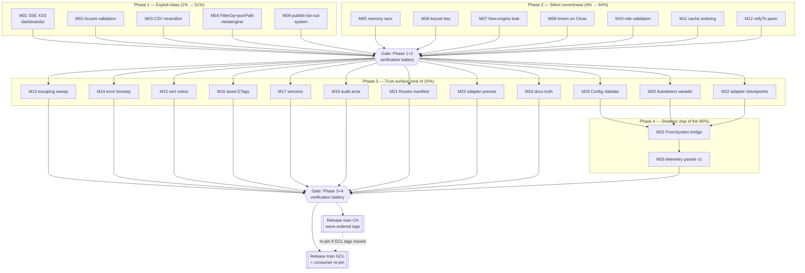

# SUPERB — dashboardui + metaengine + system hardening (Pareto plan)

**Created:** 2026-10-06 14:49 · **Input:** [`docs/research/2026-10-06_dashboardui-metaengine-system-improvements.md`](../research/2026-10-06_dashboardui-metaengine-system-improvements.md) (308 ideas, Appendix A tiers) · **Mode:** plan only — execution starts after approval

## Execution status

Updated 2026-10-06 (SUPERB hardening session — M11–M15 scope).

| Milestones | Status | Evidence |
|------------|--------|----------|
| M11 (F35–36) | **Done** 2026-10-06 | go-cqrs-lite `system/cache.go` — invalidate-before-write + never-pruned generation guard, `-race` Load/Save test; CHANGELOG receipt commit `7d77afa33` |
| M12 (F37–39) | **Done** 2026-10-06 | go-cqrs-lite `system/evolutions.go` (`reifyTo` error + `errorfamily` Corruption panic value), `metaengine/store_folds.go` (chain-preserving recover); poison→DLQ + unit tests green; CHANGELOG receipt commit `a938279f8` |
| M13 (F40–45) | **Done** 2026-10-06 | cqrs-htmx `dashboardui`: QueryEscape sweep (filter/sort/pagination builders + sort-header hrefs), malformed `after` cursor → 400, ReadAll-fallback pageSize/hasNext fix; hostile-value round-trip tests green; receipt in `dashboardui/CHANGELOG.md` [Unreleased] |
| M14 (F46–50) | **Done** 2026-10-06 | cqrs-htmx `dashboardui`: detail handlers family→404/500 (`renderLoadError`), `core.ListStreamsPaged` error-returning signature (family-preserving wrap; Rejection→400 at stream pages, else 500 panel), marshal-first `writeJSON`, audit failures → `ErrorContext` + error; root cause fixed in `core.loadEventFromAll` (not-found carried Infrastructure family + wrong message); tests green; receipt in `dashboardui/CHANGELOG.md` [Unreleased] |
| M15 (F51–53) | **Done** 2026-10-06 | cqrs-htmx `dashboardui`: sorted-only view shows the whole 500-event window + truncation badge, pagination/total hidden (cursor paging can't follow a re-sorted order — old Next link looped on the same window); filter+sort still paginates; README § Sorting notes the window semantics + idea-9 link; tests green (`sorted_view_test.go`); receipt in `dashboardui/CHANGELOG.md` [Unreleased] |
| M01–M10 | **Done** 2026-10-06 | Two sessions (22-34 + 23-20 reports). GCL: `SortPaginate` compound cursor + `adttest.RunPaginationConformance` matrix (memory/sqlite/bbolt/pebble/badger; F22 closed same night incl. the sqlite key-column MapScan fix it forced), `system` fail()-teardown + timer lifecycle + role validation + engine-name diagnostics. CH: M01 SSE XSS (`275d1795`), M02 AccentColor (`fbd044f0`), M03 CSV neutralization — receipted in the 22-34 report. 23-23 brutal review documents the honest-failure record |
| M16–M27 | Not started | out of this session's scope |

Status report: `docs/status/2026-10-06_19-31_SUPERB-hardening-m11-m12-done-m13-m15-pending.md`.

---

**Definition of "result":** exploit-class risk eliminated > silent correctness failures fixed > consumer-trust surface (honest errors, docs, DX) > strategic dashboard value (telemetry panels).

**Guardrails (anti-verschlimmbessern):**
- Appendix A vetoes STAY VETOED: idea 171 (distributed engines — fights ADR-0146/0147), 47 (i18n Localizer), 166 (Store decomposition — ADR-gated, not a chore), 37/81/82 (sprawl), 136 (framework churn).
- Two repos, two rulebooks: cqrs-htmx items execute/commit here; go-cqrs-lite items (metaengine/system) execute THERE under its own AGENTS/gotchas. Never mix trains.
- Every code task ships with its test in the same change; every published-module change rides the next release train (wave-ordered, `verify-tag.sh`, gotchas 4–6).
- No behavior change without a failing-or-golden test pinning it first where feasible.

---

## 1. Pareto breakdown

### The 1% that delivers 51% (≈4 ideas, ~4h)

The verified exploit/corruption bugs. Hours of work, majority of the *risk* value:

| Idea | Fix | Repo | Why here |
|------|-----|------|----------|
| 1 (+54) | SSE row injection XSS → `textContent` (+ column fix) | cqrs-htmx/dashboardui | Exploitable via any event field |
| 2 | AccentColor strict CSS-color validation | cqrs-htmx/dashboardui | Style-tag breakout |
| 123+124 | FilterOp enum + jsonPath identifier validation at option-construction AND SQL-build | go-cqrs-lite/metaengine | Injection surface |
| 230 (+192) | Honor single `publish: [x]` + validate bus targets | go-cqrs-lite/system | Most common config silently broken |

### The 4% that delivers 64% (add ≈8 ideas, +~7h)

Silent correctness failures — each verified in the research doc's status table:

| Idea | Fix | Repo |
|------|-----|------|
| 114 | Memory-engine mutex coverage for vector/spatial/search (+ concurrent conformance, 137) | metaengine |
| 115 | Keyset pagination compound (sortValue,key) cursor comparator | metaengine |
| 187 (+242) | `system.New` engine cleanup on all error paths + goleak test | system |
| 210+211 | `Close()` stops timers; `stopTimers` actually waits | system |
| 251 | `reifyTo` panic → DLQ error path | system |
| 179+197 | Reject unknown InstanceRole; ADVISORY on silent memory fallback | system |
| 233 | Cache invalidate-before-write (+ race test) | system |
| 17+18 | Infra errors → 500 not 404; surface `ListStreams` errors | dashboardui |

### The 20% that delivers 80% (add ≈45 ideas, +~18h)

- **dashboardui quick wins:** 4 (CSV neutralize), 6+7 (content-hash ETags + asset caching), 8 (typed confirm), 9-short (sorted-view truncation notice), 19 (marshal-first), 20 (cursor 400), 21 (log levels), 24 (QueryEscape sweep), 25 (pageSize consistency), 27 (constants single-source), 5 (versionz guard).
- **Consumer DX:** 38 (`Routes()`), 40+74 (Authorizer actor + audit correlation), 41 (`Config.Validate`), 42 (variadic `Autodetect`), 44+73 (buildinfo).
- **systemadapter completion:** 281+301 (checkpoint/DLQ wiring options), 285 (`RecommendedDeployment`), 287 (README).
- **Docs truth:** 303+304+305 (guides stop teaching deprecated path), 75+76+78 (README fixes), 77 (IMPROVEMENT_IDEAS prune).
- **Strategic phase 1 (read-only panels):** 294 (`FromSystem` bridge), 274+275 (Topology + HealthCheckDetailed panels), 263+265 (plan table + engine stats cards).

### The other 80% (remaining ~248 ideas — NOT forgotten)

| Bucket | ~Count | Disposition |
|--------|--------|-------------|
| Solid hygiene (testing matrices, twin extraction 102–107, error-message DX, docs generation) | ~200 | Backlog — opportunistic, file-by-file; twins need their own ADR-sized plan |
| Debatable (product-gated: 71 self-metrics, 33 DLQ export, 35 sparkline, 294+ extras) | ~30 | Blocked on consumer demand / product decision |
| Veto (171, 47, 166, 37, 81, 82, 136) | ~15 | Closed in Appendix A unless strategy changes |

**Coverage check:** 4 + 8 + 45 ≈ 57 ideas directly scheduled (the load-bearing tier), ~248 explicitly dispositioned above → 100% accounted for.

---

## 2. Comprehensive plan — 27 medium tasks (30–100 min each)

Sorted by importance/impact (risk first, then trust, then strategic), effort in parens. Repo column: **CH** = cqrs-htmx, **GCL** = go-cqrs-lite.

| # | Task | Ideas | Repo | Impact | Effort |
|---|------|-------|------|--------|--------|
| M01 | Fix SSE XSS: textContent row builder + 5-column alignment + count reset + parse-error warn + JS injection smoke test | 1, 54, 55, 56 | CH | Critical | 60m |
| M02 | AccentColor strict validation (hex/rgb) in `withDefaults` + tests | 2 | CH | Critical | 30m |
| M03 | CSV export formula neutralization (`=`,`+`,`-`,`@` prefix) + tests | 4 | CH | High | 30m |
| M04 | metaengine: FilterOp enum validation (construction + SQL build) + jsonPath identifier allowlist reuse from matviews | 123, 124 | GCL | Critical | 90m |
| M05 | metaengine: mutex coverage for vector/spatial/search backends + concurrent conformance tests in adttest | 114, 137 | GCL | Critical | 90m |
| M06 | metaengine: keyset tie-safe compound cursor comparator + pagination tests | 115 | GCL | High | 60m |
| M07 | system: engine cleanup on all `New` error paths + goleak regression test | 187, 242 | GCL | Critical | 60m |
| M08 | system: `Close` stops timers, `stopTimers` waits (WaitGroup), lifecycle tests | 210, 211 | GCL | High | 60m |
| M09 | system: single-publish fan-out + bus-target validation | 230, 192 | GCL | Critical | 45m |
| M10 | system: reject unknown InstanceRole + ADVISORY on memory fallback + engine-name hints in ErrUnknownEngine | 179, 197, 191 | GCL | High | 45m |
| M11 | system: cache invalidate-before-write + race test | 233 | GCL | High | 45m |
| M12 | system: `reifyTo` returns DLQ-routable error instead of panic + poison-event test | 251 | GCL | High | 60m |
| M13 | dashboardui: URL-escaping sweep (filter/sort/pagination builders) + cursor 400 + fallback pageSize consistency | 24, 20, 25 | CH | High | 90m |
| M14 | dashboardui: errorfamily-kind → 404/500 mapping + ListStreams error surface + marshal-first writeJSON + audit log levels | 17, 18, 19, 21 | CH | High | 90m |
| M15 | dashboardui: honest sorted-view truncation notice (chip + doc) | 9 | CH | Medium | 45m |
| M16 | dashboardui: content-hash ETags + cache headers for dashboard.css/js (kill hardcoded v4.9.0) | 6, 7 | CH | Medium | 60m |
| M17 | dashboardui: versionz opt-in guard + buildinfo (commit/time, module via ReadBuildInfo) | 5, 44, 73 | CH | Medium | 45m |
| M18 | dashboardui: Authorizer returns actor; audit entries carry actor + correlation ID | 40, 74 | CH | High | 90m |
| M19 | dashboardui: export `Config.Validate()` + single-source page-size constants | 41, 27 | CH | Medium | 45m |
| M20 | dashboardui: variadic `Autodetect(sources ...any)` + table-driven probes (drop cyclop) | 42 | CH | Medium | 60m |
| M21 | dashboardui: `Routes() []Route` manifest + docs | 38 | CH | Medium | 30m |
| M22 | systemadapter: `WithCheckpointStore`/`WithHostOptions` (wire ADR-0149 durable checkpoints + DLQ) | 281, 301 | CH | High | 60m |
| M23 | systemadapter: `RecommendedDeployment` presets + README (declarative-first) | 285, 287 | CH | Medium | 90m |
| M24 | Docs truth pass: rewrite guide steps off `NewProjectionLayer`, fix stale checkpoint claims, dashboardui README (demo/data-copyable/package doc), prune IMPROVEMENT_IDEAS vs CHANGELOG | 303, 304, 305, 75, 76, 77, 78 | CH | High | 90m |
| M25 | dashboardui: `FromSystem(sys)` capability adapter (Journal/Seekable/EventByID/Bus/Host/Snapshot/QueryStore) + tests | 294, 293 | CH | High | 90m |
| M26 | dashboardui telemetry phase 1 (read-only): Topology panel + HealthCheckDetailed wiring into healthz/overview + plan table + engine-stat cards | 274, 275, 263, 265 | CH | Strategic | 90m |
| M27 | Full verification battery + release trains BOTH repos (check-modules, race tests, lint, coverage-gate, wave-ordered tags via verify-tag.sh) | — | both | Gate | 100m |

**Total: ~29h.** Order M01→M12 is essentially fixed (risk); M13–M24 parallelizable; M25/M26 depend on nothing but land after M19/M20 (Config surface); M27 always last.

---

## 3. Fine breakdown — 104 tasks (≤12 min each)

Grouped under their medium task. IDs `F<nn>`. Each ends with its verification step (test run / lint / golden) where applicable.

**M01 — SSE XSS (CH)**
| ID | Task | Est |
|----|------|-----|
| F01 | Add `esc()`/`escapeHtml` helper to dashboardJS + replace innerHTML concat in row builder | 12m |
| F02 | Rewrite row builder with createElement/textContent for all 5 cells | 12m |
| F03 | Fix column alignment: emit Stream Type cell (idea 54) | 12m |
| F04 | Reset eventCount on page swap + console.warn on parse error (55, 56) | 12m |
| F05 | JS injection smoke test (jsdom or Playwright) with `` payload | 12m |

**M02 — Accent validation (CH)**
| F06 | Strict CSS-color validator (hex3/6/8, rgb(), hsl(), named set) in config | 12m |
| F07 | Validation test table incl. breakout payloads (`red;} body{...}`) | 12m |
| F08 | Golden check: legit accents unchanged; doc note in config.go | 12m |

**M03 — CSV neutralization (CH)**
| F09 | Neutralize leading `=+-@` in export.go cell writer + unit tests | 12m |
| F10 | Negative test: export with hostile type string inspect CSV bytes | 12m |

**M04 — metaengine injection surface (GCL)**
| F11 | FilterOp `Valid()` + validation in WithFilter (scan_options.go) | 12m |
| F12 | Re-validate op enum at SQL build (filter_clause.go) — defense in depth | 12m |
| F13 | Extract matview identifier allowlist (materialized_view.go:97-109) to shared helper | 12m |
| F14 | Apply allowlist to jsonPath in sqliteengine/encoding.go + pg/mysql parity check | 12m |
| F15 | Tests: invalid op rejected at construction AND at build; hostile path rejected | 12m |

**M05 — memory-engine race (GCL)**
| F16 | Route VectorInsert/Search/Delete + Spatial through m.mu wrappers | 12m |
| F17 | Add mutex (or document parent-lock contract) to vector/spatial index structs | 12m |
| F18 | adttest: AssertConcurrentVectorInsert + AssertConcurrentScanDuringWrite | 12m |
| F19 | Run engine race suite (-race, memory engine) green | 12m |

**M06 — keyset ties (GCL)**
| F20 | Compound (sortValue, key) comparator applied to cursor filter in sort_paginate.go | 12m |
| F21 | Regression test: tie-heavy dataset paginates without drops/dupes | 12m |
| F22 | Cross-engine pagination conformance run (adttest matrix) | 12m |

**M07 — New engine leak (GCL)**
| F23 | Extract `fail(err)` cleanup helper closing created engines in constructor.go | 12m |
| F24 | Convert all 12+ error returns after engine creation to use it | 12m |
| F25 | goleak test: failed construction leaves zero engines open | 12m |

**M08 — timers lifecycle (GCL)**
| F26 | Call stopTimers from Close; add WaitGroup wait to stopTimers | 12m |
| F27 | Fix ManageTimers/stopTimers doc comments to match behavior | 12m |
| F28 | Lifecycle test: Close after ManageTimers → no goroutine leak | 12m |

**M09 — publish fan-out (GCL)**
| F29 | buildPublisher: handle len(Publish)==1 (wrap or direct named bus) | 12m |
| F30 | Validate publish targets against deployment.Buses; error on unknown | 12m |
| F31 | Tests: single-target reaches named bus; unknown target fails New | 12m |

**M10 — role validation (GCL)**
| F32 | Reject unknown InstanceRole at construction (roles.go) | 12m |
| F33 | SCREAM ADVISORY when SOT falls back to memory implicitly | 12m |
| F34 | ErrUnknownEngine lists configured names + registered drivers (191) | 12m |

**M11 — cache ordering (GCL)**
| F35 | Swap Save order: invalidate before store write (cache.go) | 12m |
| F36 | Race test: concurrent Load/Save never serves pre-save snapshot | 12m |

**M12 — reifyTo panic (GCL)**
| F37 | Replace panic with structured error routed like other fold errors | 12m |
| F38 | Poison-event test: schema mismatch lands in DLQ, worker survives | 12m |
| F39 | Regression: normal evolutions unaffected (evolutions_test.go) | 12m |

**M13 — escaping sweep (CH)**
| F40 | url.QueryEscape in EventFilter.ExtraParams builder (core/events.go) | 12m |
| F41 | QueryEscape in sortState.extraParams + PaginationQuery (sort.go, core/pagination.go) | 12m |
| F42 | QueryEscape in pageSizeOptionsFor (pagination.go) | 12m |
| F43 | Cursor parse failure → 400 + log (handlers_events, handlers_audit) | 12m |
| F44 | Fallback path: use parsed pageSize for truncation+hasNext (handlers_audit) | 12m |
| F45 | Test suite: hostile params (`&`,`=`,`#`, space, unicode) round-trip links | 12m |

**M14 — error honesty (CH)**
| F46 | errorfamily kind check → 404 vs 500 in event/command/query detail handlers | 12m |
| F47 | ListStreamsPaged propagates errors; render error panel not empty table | 12m |
| F48 | writeJSON: marshal to buffer before WriteHeader | 12m |
| F49 | Audit log levels: Error/Warn on failures + include error detail | 12m |
| F50 | Tests: infra error → 500 body; store error → visible panel | 12m |

**M15 — sorted-view notice (CH)**
| F51 | Truncation chip "sorted view: first 500 events" in events.templ | 12m |
| F52 | Disable next-page control when sorted + test | 12m |
| F53 | README note: sorted mode is windowed (link idea 9 for full fix) | 12m |

**M16 — asset caching (CH)**
| F54 | Content-hash ETag helper (FNV/sha over asset bytes) replacing v4.9.0 const | 12m |
| F55 | Wire hash ETag + immutable cache to dashboard.css/js handlers | 12m |
| F56 | 304/If-None-Match tests for both assets | 12m |
| F57 | Sweep for other hardcoded asset versions (grep) | 12m |

**M17 — versionz (CH)**
| F58 | ReadBuildInfo: module path, VCS commit/time into versionz | 12m |
| F59 | Config flag to guard versionz behind authorizer (default open? decide+doc) | 12m |
| F60 | Tests + README security note | 12m |

**M18 — audit actor (CH)**
| F61 | Change Authorizer signature → (Actor, error) w/ compat shim | 12m |
| F62 | Thread actor + request ID into dashboardui.audit entries | 12m |
| F63 | Update dlq/snapshot/audit handler call sites + tests | 12m |
| F64 | Docs: Authorizer contract section in README | 12m |

**M19 — Config.Validate (CH)**
| F65 | Export Config.Validate() wrapping withDefaults validation | 12m |
| F66 | Single-source defaultPageSize/maxPageSize (config.go ← core) | 12m |
| F67 | Tests + setup/ consumer call site | 12m |

**M20 — Autodetect variadic (CH)**
| F68 | Probe table refactor (map[probeFunc]field) — drop nolint:cyclop | 12m |
| F69 | Autodetect(sources ...any) merge semantics | 12m |
| F70 | Conflict test: two sources claiming same capability | 12m |
| F71 | Docs update (README integration modes) | 12m |

**M21 — Routes manifest (CH)**
| F72 | Routes() []Route{Method,Pattern,Panel,Write} implementation | 12m |
| F73 | Test: routes match registered mux patterns | 12m |
| F74 | README: allowlisting example | 12m |

**M22 — systemadapter wiring (CH)**
| F75 | DomainConfig options: WithCheckpointStore, WithHostOptions | 12m |
| F76 | Wire DLQ store default behind host options | 12m |
| F77 | Equivalence test: declarative path with durable checkpoint survives restart | 12m |
| F78 | Guide update (declarative-projections.md checkpoint section) | 12m |

**M23 — adapter presets + README (CH)**
| F79 | RecommendedDeployment(driver, dsn) presets (memory/sqlite/split) | 12m |
| F80 | Dedupe guide's 3 hand-rolled DeploymentConfigs → presets | 12m |
| F81 | systemadapter README: declarative-first structure | 12m |
| F82 | Package doc polish + examples link | 12m |
| F83 | godoc Example for DomainConfig() | 12m |

**M24 — docs truth (CH)**
| F84 | leveraging-system-metaengine.md: deprecation banner + rewrite steps 4-5 | 12m |
| F85 | Same guide: Advanced section → OnRecordTyped + EventWithID pattern | 12m |
| F86 | declarative-projections.md: checkpoint/DLQ reality (ADR-0149) | 12m |
| F87 | dashboardui README: remove dead demo + data-copyable sections | 12m |
| F88 | core/capabilities.go package doc: drop fmt.Fprintf claim | 12m |
| F89 | IMPROVEMENT_IDEAS.md prune vs CHANGELOG + stale-item check note | 12m |

**M25 — FromSystem bridge (CH)**
| F90 | core capability adapters: System→Journal/Seekable/EventByID/Bus/QueryStore | 12m |
| F91 | Host + SnapshotStore mapping; interface (not concrete *Host) per idea 293 | 12m |
| F92 | Autodetect(*system.System) special-case via bridge | 12m |
| F93 | Integration test: panels light up from a system.New instance | 12m |
| F94 | README integration-modes section + guide cross-link | 12m |

**M26 — telemetry phase 1 (CH)**
| F95 | TopologyProvider capability + topology panel (read-only table) | 12m |
| F96 | HealthCheckDetailed → healthz/readyz composition (+quarantine note) | 12m |
| F97 | QueryPlacement table panel (engine, ADT, volume, est. latency) | 12m |
| F98 | Engine stats cards (RTT EWMA/p95, samples, stale) | 12m |
| F99 | Goldens for new panels + capability-off behavior | 12m |

**M27 — verification + trains (both)**
| F100 | CH: nix run .#check-modules + .#lint + .#test (race) + coverage-gate | 12m |
| F101 | GCL: its full gate battery (per its AGENTS) on touched modules | 12m |
| F102 | CHANGELOG entries per module (consumer-visible only) | 12m |
| F103 | CH train: wave-ordered tags via scripts/tools/verify-tag.sh | 12m |
| F104 | GCL train: same, then re-pin consumers if needed | 12m |

---

## 4. Execution graph

**Parallelism:** Phases 1–2 are three independent repo-lanes (dashboardui / metaengine / system) — run concurrently as separate sessions per the concurrent-session rules (gotcha 4: commit at phase boundaries, preflight-tree-check before batch steps).

---

## 5. Verification protocol (per repo)

- **cqrs-htmx:** `nix run .#check-modules` (27 stages) · `nix run .#lint` · `nix run .#test` (race, forEachGoModule — never trust root `go test ./...`, gotcha 2) · `nix run .#coverage-gate` · `nix run .#check-templates`. UI changes: regenerate `_templ.go` from MODULE dir (`nix run .#gen`), CSS bundle gates ride check-modules.
- **go-cqrs-lite:** its own AGENTS battery on touched modules (metaengine conformance matrix, system lifecycle/goleak suites).
- **Trains:** wave-ordered cuts, `scripts/tools/verify-tag.sh <dir> <ver> --push` only, refresh tag cache before consumer re-pin commits (gotcha 27). CHANGELOG receipts for consumer-visible changes only (gotcha 20).

## 6. Risk register

| Risk | Mitigation |
|------|------------|
| M18 Authorizer signature is a breaking API change | Ship compat shim + deprecation note; ride v4 minor with migration line |
| M04/M05 touch published metaengine code | Single-test EVERY wave member (gotcha 24); `GOWORK=off` verification both modes |
| M25/M26 add system/metaengine deps to dashboardui | Decide seam first (idea 308): capability interfaces in `core/`, imports only in bridge file |
| Concurrent sessions in-tree | `preflight-tree-check` before batches; commit at phase boundaries; never revert foreign diffs |
| Push blocked by pre-push strict gates | They are the point — fix forward, never `--no-verify` past a real finding (fallback only for documented env-class noise, with step names) |
