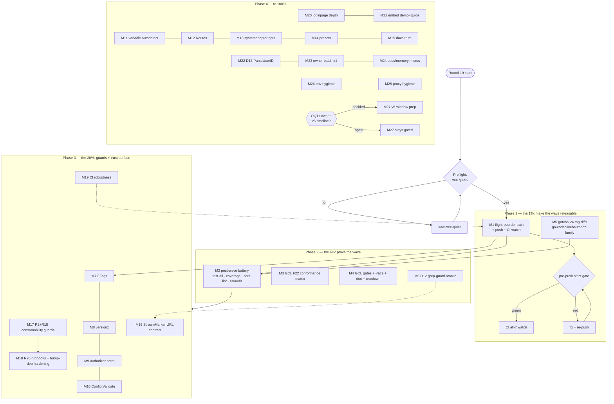

# SUPERB Pareto Execution Plan — Round 19: Release Path, Wave Verification & Trust Surface

**Date:** 2026-10-07 00:43 CEST · **Author session:** the round-18 docs-health pass (see `docs/status/archived/2026-10-06_23-23_*` lineage + `docs/status/2026-10-07_00-37_docs-health-round18-full-tail-archive-and-living-docs.md`)
**Scope:** EVERY open TODO in this repo + its open cross-repo lanes (go-cqrs-lite follow-through), sorted by importance/impact/effort/customer-value into Pareto tiers, then split into 27 medium tasks (30–100 min) and 120 fine tasks (≤12 min).
**Baseline:** master synced with origin (the 44-commit backlog was pushed by a concurrent session mid-round-18); the identity-auth-hardening wave + M01–M15 cross-repo hardening are SHIPPED locally and published; the 11-module patch train is cut and pushed; CI was all-green at run 37392674249.
**Known push blocker:** go-flightrecorder v0.2.1 published mid-day 2026-10-06 → 16 lagging requires → strict release-train gate will block the next push until that train runs (M1).

---

## 0. READ / UNDERSTAND / RESEARCH / REFLECT — what changed since the last plan (2026-10-06 14-49)

| Fact                                                                                                               | Consequence for this plan                                                                                                                                                   |
| ------------------------------------------------------------------------------------------------------------------ | --------------------------------------------------------------------------------------------------------------------------------------------------------------------------- |
| M01–M15 of the hardening plan EXECUTED and receipted (three sibling sessions, 2026-10-06 evening)                  | This plan does NOT re-plan them; it picks up at M16–M27 + the follow-through debts the brutal review (23-23) surfaced (F22, GCL gates, `-race`, doc comment, teardown twin) |
| The 17-report status tail + 5 executed plans annotated + archived (round 18, 2026-10-06/07)                        | All follow-ups now live in TODO_LIST rows or this plan — nothing is entombed in timestamped files                                                                           |
| master pushed to origin by a concurrent session; D12/D13 opened; flightrecorder + GCL-follow-through P2 rows added | The 1% is the release path again: train → push → CI, plus the tag-diff ritual debt for the encoding-critical bumps that rode the sweep                                      |
| templ-components healed to v1.20.1; #27 closed upstream-side                                                       | R2/R18 remain unbuilt — the _class_ is still unguarded                                                                                                                      |
| TODO decision table grew to D13                                                                                    | Owner-call batches are consolidated in M23/M26 instead of scattered                                                                                                         |

## 1. PARETO BREAKDOWN

### The 1% that delivers 51% — **make the shipped wave releasable and provably consumable**

The M01–M15 hardening wave + M13–M15 dashboardui breaking `core.ListStreamsPaged` change are PUBLISHED-but-unverifiable until (a) the flightrecorder lag train unblocks the strict gate, (b) the push lands, (c) CI goes green, and (d) the gotcha-24 tag-diff ritual covers the encoding-critical bumps (go-codec v0.3.1!) that rode the sweep undiffed. Tasks **M1, M2, M5**. ~10 fine tasks. Everything else in this plan is worthless if the wave cannot ship with evidence.

### The 4% that delivers 64% — 1% + **prove the wave**

Post-wave verification battery (`.#test-all`, coverage re-pin, cqrs-lint + erraudit over the new surface), the GCL trust bundle (F22 conformance matrix, GCL's real gates, metaengine `-race`), and the **D12 grep-guard** so the next display-form drift is caught mechanically. Tasks **M3, M4, M6, M19**. The wave is currently "green by the battery we picked" — this tier makes that a complete battery.

### The 20% that delivers 80% — 4% + **permanent guards + the trust surface**

The release-guard class that burned two sessions (templ-components v1.20.0 poison): **R2 + R18 + R20 + bump-dep hardening**. Then the dashboardui trust-surface head (M16–M19: ETags, versionz, authorizer actor, Config.Validate) and the StreamMarker URL-contract question (round-trip test + upstream proposal). Tasks **M7–M10, M16–M18**.

### The other 20% to 100% — trust-surface tail, depth, hygiene, owner batches, v5 window

M11–M15 (variadic Autodetect, Routes manifest, systemadapter options, presets, docs truth pass), loginpage depth, embed demo/guide, docs/memory micros, environment hygiene, owner-decision batches (PapDashboard D1/D2, D3–D11 ticks, OQ22–OQ28), v5-window prep gated on OQ11 (codemod Track A, Track B goldens, runbook growth), and the standing watches (upstream trio + #27, DataStar Tier-4, SidebarNav, BuildFlow BF1–BF3, V007/appkit).

## 2. COMPREHENSIVE PLAN (30–100 min each, 27 tasks, sorted by impact/effort/customer-value)

| ID & task                                                                                                                                                                                                                                                        | Impact       | Effort      | Customer value                                  | Category                | Depends on      |
| ---------------------------------------------------------------------------------------------------------------------------------------------------------------------------------------------------------------------------------------------------------------- | ------------ | ----------- | ----------------------------------------------- | ----------------------- | --------------- |
| **M1** Flightrecorder v0.2.1 lag train (16 requires via `bump-dep.sh 'larsartmann/go-flightrecorder$'`) + per-module hermetic tidy/verify + absence assertion + `--refresh-cache` strict gate → push → CI watch                                                  | Critical     | M (60–90)   | Unblocks ALL shipping                           | Release                 | —               |
| **M2** Post-wave verification battery: `.#test-all`, `.#coverage-gate` re-run (+re-pin if moved), `.#check-cqrs-lint`, `.#erraudit-inventory --gate` over the M01–M15 surface                                                                                    | Critical     | L (90)      | Trust in shipped code                           | Quality                 | M1 (quiet tree) |
| **M5** Gotcha-24 tag-diff ritual for the undiffed sweep bumps: **go-codec v0.3.1** (encoding-critical), go-webauthn v0.18.2, templ-components v1.20.1 family, flightrecorder v0.2.1                                                                              | Critical     | M (45)      | Catches a silent encoding drift                 | Quality                 | —               |
| **M3** GCL F22: adttest cross-engine pagination conformance matrix (`AssertPaginationExactOnce` over memory/sqlite/bbolt/pebble/badger)                                                                                                                          | High         | M–L (60–90) | Pagination correctness across 9 engines         | Quality (GCL)           | —               |
| **M4** GCL gate compliance: golangci-lint + cqrs-lint + formatter + coverage on M04–M10 surface; metaengine `-race`; `sort_paginate.go` doc comment; `fail()`/`Close()` teardown unify                                                                           | High         | L (90)      | Hardening wave meets the same bar everywhere    | Quality (GCL)           | —               |
| **M6** D12 executed: gotcha-25 grep-guard as BLOCKING gate (checker + fixture self-test + flake app + check-modules stage + CI + README — atomic per gotcha 19)                                                                                                  | High         | M (60)      | Kills the display-form drift class mechanically | Tooling                 | —               |
| **M17** R2 + R18: `check-family-release-consumable.sh` + bump-dep placeholder pre-flight, each + offline fixture self-test + flake app + check-modules stage + CI + README                                                                                       | Critical     | L (90)      | Kills the upstream-poison class permanently     | Tooling                 | —               |
| **M18** R20 runbook updates (validate-before-align, rc-capture, moving-target stop-rule, sweep-vs-surgical) + `bump-dep --commit` rc-check/tag-cache-refresh hardening                                                                                           | High         | M (60)      | Next train runs on documented rails             | Docs/Tooling            | —               |
| **M19** CI robustness: lint matrix `fail-fast: false`; mechanized self-test env-leak audit (`env -u CI`); `scripts/tools/ci-parity-check.sh` (gotcha 27c) + flake app + CI step                                                                                  | High         | L (90)      | Multi-red surfaces stop hiding                  | Tooling                 | M1              |
| **M16** StreamMarker URL contract: dashboardui handler round-trip test for prefixed stream refs + decide/propose the display-form-vs-URL contract upstream (feeds ROADMAP residual)                                                                              | High         | M (60)      | Consumer-facing URL stability                   | Quality/Upstream        | —               |
| **M7** M16 (plan): content-hash ETags for dashboard.css/js; kill the hardcoded v4.9.0 asset version                                                                                                                                                              | High         | M (45)      | Correct cache invalidation for consumers        | Feature (dashboardui)   | M1              |
| **M8** M17 (plan): versionz opt-in guard + `ReadBuildInfo` version reporting                                                                                                                                                                                     | Medium       | M (45)      | Operational honesty                             | Feature (dashboardui)   | M1              |
| **M9** M18 (plan): Authorizer actor via compat shim (breaking signature swap deferred per 19-31 decision); audit entries carry actor+correlation                                                                                                                 | Medium       | M (60)      | Attribution completeness                        | Feature (dashboardui)   | M1              |
| **M10** M19 (plan): export `Config.Validate()`; single-source page-size constants                                                                                                                                                                                | Medium       | M (45)      | Fail-fast consumer config                       | Feature (dashboardui)   | M1              |
| **M20** loginpage depth bundle: login.js Base64URL property test + serialize goldens + node:test wiring; Playwright E2E through the REAL gated ceremony; browser-level run                                                                                       | High         | L (90)      | The zero-test auth JS gets a net                | Quality                 | M1              |
| **M21** Embed story: `examples/dashboard-embed-demo` + `docs/guides/dashboard-embed-guide.md` + FEATURES/skill rows for Autodetect/`Config.Layout` (verified absent in round 18)                                                                                 | Medium       | M–L (90)    | The seam becomes discoverable                   | Docs/Feature            | M1              |
| **M11** M20 (plan): variadic `Autodetect` + probe table                                                                                                                                                                                                          | Medium       | M (45)      | Fewer-assertion adoption                        | Feature (dashboardui)   | M1              |
| **M12** M21 (plan): `Routes()` manifest export                                                                                                                                                                                                                   | Medium       | M (45)      | Integrability                                   | Feature (dashboardui)   | M1              |
| **M13** M22 (plan): systemadapter checkpoint/DLQ wiring options                                                                                                                                                                                                  | Medium       | M (60)      | Production operability                          | Feature (systemadapter) | M1              |
| **M14** M23 (plan): `RecommendedDeployment` presets + README                                                                                                                                                                                                     | Medium       | M (45)      | One-flag deployments                            | Feature (dashboardui)   | M1              |
| **M15** M24 (plan): docs truth pass (deprecated-path guides, README fixes, IMPROVE_IDEAS prune)                                                                                                                                                                  | Medium       | M (60)      | Docs stop lying                                 | Docs                    | —               |
| **M22** D13: `ParseUserID` prefix-strip policy memo + fuzz/fixture pins (multi-colon, non-ULID tails) + `eba45c80` coverage confirmation                                                                                                                         | Medium       | M (45)      | Security-posture clarity                        | Quality                 | —               |
| **M23** Owner batch #1: R11 credential 4× memo (read-only, feeds OQ28); D3/D8–D11 ticks; PapDashboard send nudge (D1/D2); OQ22 ritual decision                                                                                                                   | Medium       | M (45)      | Unblocks 5 parked rows                          | Owner/Docs              | —               |
| **M24** Docs/memory micros: agents-notes narratives (scripts-reorg war story, alignment-push arc); CSRF-reasoning note next to the setup no-CSRF section; `check-docs-freshness` non-version claims; README tail-count reconciliation in the tail-budget checker | Medium       | M (60)      | Memory stays trustworthy                        | Docs/Tooling            | —               |
| **M26** Environment hygiene: datastar `go1.27.0` toolchain fetch diagnosis; `go-cache-env.sh` GOTOOLCHAIN export fix or AGENTS quick-ref correction; quarantine cleanup decision; D5 buildcache nudge                                                            | Medium       | M (60)      | Fewer environment landmines                     | Ops                     | —               |
| **M27** v5-window prep (gated on **OQ11**): Track A codemod scaffold (R1–R3, R9–R10, dry-run default, golden fixture) + Track B v4-journal goldens (21-event decode, upcaster matrix) + runbook growth; V007 criterion re-check; appkit ADR-0052 re-check        | High (gated) | L (100)     | The v5 cut lands on rails                       | v5-window               | OQ11 owner      |
| **M25** Proxy/release hygiene: identity-model CHANGELOG v4.12.0 stub fill from the tag diff; pkg.go.dev spot-checks; clean-module `go get` validation of the patch train                                                                                         | Low          | S–M (30)    | Release paperwork honest                        | Release                 | —               |

Standing watches NOT scheduled as tasks (demand/owner-gated, re-check at train boundaries): treefmt-nix#545, BuildFlow#29, templ-components#27 responses; templ#1449 v0.3.1070 retirement ride; DataStar Tier-4 (demand-gated, ADR-0050); SidebarNav criteria (next UI change); BuildFlow re-enable (BF1–BF3); V007 cluster-1 (ADR-0051 criterion); appkit (ADR-0052); `examples/datastar-demo` keep (D9); cqrs-lint fleet swap (D4, packet §8); E005 filing (owner approval); check-cqrs-lint into CI (D6); PapDashboard OQ23/24 flips; go-cqrs-lite cross-repo docs debt (owner approval); Datastar re-brand (D9); GCL "Doc-only" hook repro (coordinate); compound-cursor issuance (GCL TODO).

## 3. FINE-GRAINED BREAKDOWN (≤12 min each, 120 tasks — ALL TODOs covered)

| ID   | Task                                                                                                                              | I    | E  | Cat      | Parent |
| ---- | --------------------------------------------------------------------------------------------------------------------------------- | ---- | -- | -------- | ------ |
| 1.1  | `git ls-remote` go-flightrecorder: confirm v0.2.1 is latest + real (no placeholder go.mod)                                        | Crit | 5  | Release  | M1     |
| 1.2  | Capture the exact 16 lagging requires (`check-release-train --refresh-cache` > file; rc direct)                                   | Crit | 5  | Release  | M1     |
| 1.3  | `bump-dep.sh 'larsartmann/go-flightrecorder$' v0.2.1` sweep (the `$` anchor — read the header contract first)                     | Crit | 10 | Release  | M1     |
| 1.4  | Per-module hermetic `GOWORK=off go mod tidy && go mod verify && build && vet` for the 9 touched modules                           | Crit | 12 | Quality  | M1     |
| 1.5  | Absence assertion: zero `go-flightrecorder v0.2.0` requires repo-wide (digit-safe regex, `// indirect` aware)                     | Crit | 5  | Quality  | M1     |
| 1.6  | Workspace `go mod tidy -diff` loop over every go.mod (union-graph go.sum drift, gotcha 27)                                        | Crit | 10 | Quality  | M1     |
| 1.7  | `check-release-train --refresh-cache --strict-lag 0` → expect green                                                               | Crit | 5  | Release  | M1     |
| 1.8  | `nix run .#preflight-tree-check` + commit the train (detailed message)                                                            | Crit | 5  | Release  | M1     |
| 1.9  | Push through the pre-push strict gates; watch the fresh-tag TTL gotcha (`--refresh-cache` on UNPUBLISHED false-positive)          | Crit | 5  | Release  | M1     |
| 1.10 | CI watch: first run green on all 7 jobs; triage any red via the 27c battery                                                       | Crit | 10 | CI       | M1     |
| 2.1  | `nix run .#test-all` (race incl. e2e/examples) > file; rc direct; triage failures                                                 | Crit | 12 | Quality  | M2     |
| 2.2  | `nix run .#coverage-gate` > file; diff per-module percentages vs the 2026-10-01 baseline                                          | Crit | 10 | Quality  | M2     |
| 2.3  | Re-pin any moved thresholds in `flake.nix` (same commit as the run receipt)                                                       | High | 8  | Quality  | M2     |
| 2.4  | `nix run .#check-cqrs-lint` over all gate modules (strict + stale-suppressions)                                                   | High | 10 | Quality  | M2     |
| 2.5  | `nix run .#erraudit-inventory -- --gate` (expect TOTAL=0 over the wave surface)                                                   | High | 5  | Quality  | M2     |
| 2.6  | Receipt the battery results into the TODO battery row (strike the legs)                                                           | High | 5  | Docs     | M2     |
| 5.1  | Fetch `go-codec v0.3.0..v0.3.1` tag diff; audit for encoding-behavior changes (gotcha-24 mechanism)                               | Crit | 12 | Quality  | M5     |
| 5.2  | Tag-diff go-webauthn v0.18.2 (crypto/mldsa floor, API surface)                                                                    | High | 10 | Quality  | M5     |
| 5.3  | Tag-diff templ-components v1.19.4→v1.20.1 family (class-set + component changes; CSS bundles already rebuilt — verify)            | High | 12 | Quality  | M5     |
| 5.4  | Tag-diff go-flightrecorder v0.2.0→v0.2.1                                                                                          | Med  | 8  | Quality  | M5     |
| 5.5  | Record verdicts in the agents-notes gotcha-24 receipt + file any surprise upstream                                                | Med  | 8  | Docs     | M5     |
| 3.1  | Read adttest's existing assert helpers; design `AssertPaginationExactOnce(store, sortFn, items, pageSize)`                        | High | 10 | Quality  | M3     |
| 3.2  | Implement the helper (exactness + order + once, tie-heavy fixture generator)                                                      | High | 12 | Quality  | M3     |
| 3.3  | Wire memory engine conformance run                                                                                                | High | 8  | Quality  | M3     |
| 3.4  | Wire sqlite engine conformance run (temp-dir harness)                                                                             | High | 10 | Quality  | M3     |
| 3.5  | Wire bbolt engine conformance run                                                                                                 | High | 10 | Quality  | M3     |
| 3.6  | Wire pebble engine conformance run                                                                                                | High | 10 | Quality  | M3     |
| 3.7  | Wire badger engine conformance run                                                                                                | High | 10 | Quality  | M3     |
| 3.8  | `go test -race` the adttest suite; GCL CHANGELOG receipt; commit                                                                  | High | 8  | Quality  | M3     |
| 4.1  | Inventory GCL's gate configs (`.golangci.yml`? treefmt? coverage app?) — read, don't assume                                       | High | 8  | Quality  | M4     |
| 4.2  | Run golangci-lint on metaengine/system/sqliteengine/systemtest; fix or ledger findings                                            | High | 12 | Quality  | M4     |
| 4.3  | Run cqrs-lint on the touched modules; rules-diff ritual if binary moved                                                           | High | 10 | Quality  | M4     |
| 4.4  | Formatter pass (canonical form) on the M04–M10 diff                                                                               | Med  | 8  | Quality  | M4     |
| 4.5  | Coverage run on touched GCL modules; note vs any gate                                                                             | Med  | 10 | Quality  | M4     |
| 4.6  | Full metaengine suite `-race` (> file; rc direct)                                                                                 | High | 12 | Quality  | M4     |
| 4.7  | Fix `sort_paginate.go` doc comment (nine engines); sweep for other stale scope comments                                           | Med  | 5  | Quality  | M4     |
| 4.8  | Unify `fail()`/`Close()` teardown behind one internal function + keep both test suites green                                      | High | 12 | Quality  | M4     |
| 4.9  | GCL CHANGELOG receipts + commit per milestone                                                                                     | Med  | 5  | Docs     | M4     |
| 6.1  | Design the guard: grep/AST scan forbidding `StreamID().String()`/`aggID.String()` at identity positions (allowlist display sites) | High | 12 | Tooling  | M6     |
| 6.2  | Implement `scripts/checks/check-streamid-identity.sh` (candidate counts, fail-loud-on-zero per gotcha 2)                          | High | 12 | Tooling  | M6     |
| 6.3  | Fixture self-test (violations caught / clean passes / display-site allowlist honored)                                             | High | 12 | Tooling  | M6     |
| 6.4  | Flake app + check-modules stage + CI step + README row + AGENTS gotcha-25 link (atomic)                                           | High | 10 | Tooling  | M6     |
| 6.5  | Run on the tree; disposition any finding (expect: the golden-pinned display sites only)                                           | High | 8  | Tooling  | M6     |
| 17.1 | `check-family-release-consumable.sh`: fetch candidate tag's root+sub go.mod, reject `-00010101000000` requires                    | Crit | 12 | Tooling  | M17    |
| 17.2 | Offline fixture self-test (clean passes / placeholder fails / candidate-count prints)                                             | Crit | 12 | Tooling  | M17    |
| 17.3 | Flake app + check-modules stage + CI step + README row (atomic)                                                                   | Crit | 10 | Tooling  | M17    |
| 17.4 | bump-dep pre-flight hook: detect placeholders BEFORE sweeping; error "upstream release <tag> is unconsumable"                     | Crit | 12 | Tooling  | M17    |
| 17.5 | Extend `test-bump-dep.sh` fixtures for the pre-flight (broken-target refuses cleanly)                                             | High | 10 | Tooling  | M17    |
| 18.1 | `dependency-train-bump.md`: add validate-before-align + sweep-vs-surgical decision rule                                           | High | 10 | Docs     | M18    |
| 18.2 | Same runbook: rc-capture discipline (`cmd > f; rc=$?`) + moving-target stop-rule                                                  | Med  | 8  | Docs     | M18    |
| 18.3 | `release-playbook.md` §3a: the wave sequence (tag → `--refresh-cache` → re-commit) + CHANGELOG-before-tag                         | High | 10 | Docs     | M18    |
| 18.4 | bump-dep `--commit`: check commit rc; auto-refresh tag cache on UNPUBLISHED; honest "daemon absorbed it" report                   | High | 12 | Tooling  | M18    |
| 18.5 | `test-bump-dep.sh`: fixture for the rc-check path                                                                                 | High | 8  | Tooling  | M18    |
| 19.1 | ci.yml lint matrix `fail-fast: false`                                                                                             | High | 5  | CI       | M19    |
| 19.2 | Self-test env-leak audit: grep cases asserting local-mode behavior without `env -u CI`; fix hits                                  | High | 12 | CI       | M19    |
| 19.3 | Mechanize the audit as a fixture-checked gate (checker + self-test + wire)                                                        | Med  | 12 | CI       | M19    |
| 19.4 | `scripts/tools/ci-parity-check.sh`: CI=true self-tests → tidy -diff loop → lint → test → check-modules                            | High | 12 | CI       | M19    |
| 19.5 | Flake app + CI step + README row for ci-parity (atomic)                                                                           | Med  | 8  | CI       | M19    |
| 16.1 | Write the round-trip test: create stream → rendered delete-form href → follow → 200 (StreamMarker segment)                        | High | 12 | Quality  | M16    |
| 16.2 | Decide recommendation: keep brand-in-URL vs `.Get()`-derived hrefs; draft the upstream display-form proposal                      | High | 12 | Upstream | M16    |
| 16.3 | Route the decision to the owner (question in the plan/report); annotate ROADMAP residual                                          | Med  | 5  | Docs     | M16    |
| 7.1  | Design ETag scheme (content-hash of served assets; strong vs weak)                                                                | High | 10 | Feature  | M7     |
| 7.2  | Implement + tests (304 path, changed-content path, multi-asset)                                                                   | High | 12 | Feature  | M7     |
| 7.3  | Kill the hardcoded v4.9.0 asset version; sweep for other hardcoded asset strings                                                  | High | 8  | Feature  | M7     |
| 7.4  | dashboardui CHANGELOG receipt + goldens if HTML changes                                                                           | Med  | 5  | Docs     | M7     |
| 8.1  | versionz opt-in config + handler (ReadBuildInfo; honest "devel" fallback)                                                         | Med  | 12 | Feature  | M8     |
| 8.2  | Tests + README row + CHANGELOG                                                                                                    | Med  | 10 | Feature  | M8     |
| 9.1  | Compat shim: authorizer gains actor without breaking the published signature (19-31 decision d)                                   | Med  | 12 | Feature  | M9     |
| 9.2  | Audit entries carry actor+correlation; tests                                                                                      | Med  | 12 | Feature  | M9     |
| 9.3  | CHANGELOG + README                                                                                                                | Med  | 5  | Docs     | M9     |
| 10.1 | `Config.Validate()` exported; wire into `Autodetect`/`New` paths                                                                  | Med  | 12 | Feature  | M10    |
| 10.2 | Single-source page-size constants; replace scattered literals                                                                     | Med  | 10 | Feature  | M10    |
| 10.3 | Tests + CHANGELOG                                                                                                                 | Med  | 8  | Feature  | M10    |
| 20.1 | loginpage `assets/login.js`: Base64URL round-trip property test (node:test)                                                       | High | 12 | Quality  | M20    |
| 20.2 | serializeAssertion/serializeAttestation shape goldens                                                                             | High | 10 | Quality  | M20    |
| 20.3 | Wire node:test into the module test app + CI                                                                                      | Med  | 8  | Quality  | M20    |
| 20.4 | Playwright E2E: real gated ceremony through the rendered page (register→begin→finish, cookies riding)                             | High | 12 | Quality  | M20    |
| 20.5 | Full-page render golden (replace the strings.Contains suite incrementally)                                                        | Med  | 12 | Quality  | M20    |
| 21.1 | `examples/dashboard-embed-demo`: consumer shell + `Config.Layout` + auth middleware, runnable                                     | Med  | 12 | Feature  | M21    |
| 21.2 | `docs/guides/dashboard-embed-guide.md` (CSP nonce flow, auth placement, toast contract, CSSURLs pitfalls)                         | Med  | 12 | Docs     | M21    |
| 21.3 | FEATURES.md row for Autodetect/Layout + skill reference update (verified absent in round 18)                                      | Med  | 8  | Docs     | M21    |
| 21.4 | README § Integration Modes cross-link to demo+guide                                                                               | Low  | 5  | Docs     | M21    |
| 11.1 | `Autodetect(store, ...)` variadic probes; keep the single-arg form stable                                                         | Med  | 12 | Feature  | M11    |
| 11.2 | Probe table test + CHANGELOG                                                                                                      | Med  | 10 | Feature  | M11    |
| 12.1 | `Routes()` manifest export (method, path, handler name)                                                                           | Med  | 12 | Feature  | M12    |
| 12.2 | Tests + README + CHANGELOG                                                                                                        | Med  | 10 | Feature  | M12    |
| 13.1 | systemadapter checkpoint/DLQ options wiring (per M22 of the plan)                                                                 | Med  | 12 | Feature  | M13    |
| 13.2 | Tests + CHANGELOG                                                                                                                 | Med  | 10 | Feature  | M13    |
| 14.1 | `RecommendedDeployment` presets (minimal/standard/full) + README table                                                            | Med  | 12 | Feature  | M14    |
| 14.2 | Tests + CHANGELOG                                                                                                                 | Med  | 8  | Feature  | M14    |
| 15.1 | Docs truth pass: sweep guides for deprecated paths (ProjectionLayer, WS) + README fixes                                           | Med  | 12 | Docs     | M15    |
| 15.2 | IMPROVEMENT_IDEAS/study outcome notes prune + cross-link the research study (idea 9/115/187/210/211/242 acted-on notes)           | Low  | 10 | Docs     | M15    |
| 22.1 | Confirm `eba45c80`'s test coverage for the prefix-strip                                                                           | High | 10 | Quality  | M22    |
| 22.2 | Add fuzz/fixture pins: multi-colon, non-ULID tails, brand-only string                                                             | High | 12 | Quality  | M22    |
| 22.3 | Policy memo: generic vs whitelist (evidence + recommendation) → owner decision D13                                                | Med  | 10 | Docs     | M22    |
| 23.1 | R11 memo: field-set + usage map + boundary-role classification of the 4 credential DTOs (read-only, no code)                      | High | 12 | Docs     | M23    |
| 23.2 | Route memo → OQ28; tick D3/D8/D9/D10/D11 as owner confirms; record D5/D6/D7 status                                                | Med  | 10 | Docs     | M23    |
| 23.3 | PapDashboard: send-nudge receipt update (drafted 2026-10-01; owner channel)                                                       | Low  | 5  | Owner    | M23    |
| 24.1 | agents-notes: scripts-reorg war story ($0 vs BASH_SOURCE idioms, scratch-layout coupling)                                         | Low  | 12 | Docs     | M24    |
| 24.2 | agents-notes: alignment-push arc (gotcha 27/27c narrative, daemon-attribution reconstruction)                                     | Med  | 12 | Docs     | M24    |
| 24.3 | CSRF-reasoning note next to the setup no-CSRF section (gated ceremonies ride cookie authority)                                    | Med  | 8  | Docs     | M24    |
| 24.4 | `check-docs-freshness`: add non-version claim patterns (the "does not use X" class)                                               | Med  | 12 | Tooling  | M24    |
| 24.5 | Tail-budget checker verifies the README's stated count vs `ls` reality                                                            | Med  | 10 | Tooling  | M24    |
| 26.1 | Diagnose datastar `go1.27.0` toolchain fetch failure (post-reboot; reproduce > file)                                              | Med  | 12 | Ops      | M26    |
| 26.2 | `go-cache-env.sh`: export GOTOOLCHAIN floor as documented (or correct the AGENTS quick-ref)                                       | Med  | 10 | Ops      | M26    |
| 26.3 | Quarantine dir: delete or schedule (fleet note); D5 buildcache reclaim nudge with current `df -h` numbers                         | Low  | 8  | Ops      | M26    |
| 27.1 | Track A scaffold: `cqrs-htmx-upgrade` command skeleton, R1–R3 rules, dry-run default, golden fixture                              | High | 12 | v5       | M27    |
| 27.2 | Track A: R9–R10 rules + `--write` rollback-on-red + `// v5-upgrade: TODO` marker path                                             | High | 12 | v5       | M27    |
| 27.3 | Track B: record real v4.13.0 journal; 21-event decode goldens                                                                     | High | 12 | v5       | M27    |
| 27.4 | Track B: upcaster coverage matrix + fold-equivalence harness skeleton                                                             | High | 12 | v5       | M27    |
| 27.5 | v5 runbook: grow consumer notes one class toward copy-paste depth; V007 + appkit criterion re-checks                              | Med  | 12 | v5       | M27    |
| 25.1 | identity-model CHANGELOG v4.12.0 stub fill from the tag diff                                                                      | Med  | 10 | Release  | M25    |
| 25.2 | pkg.go.dev spot-check both patch tags (license + render)                                                                          | Low  | 8  | Release  | M25    |
| 25.3 | Clean-module `go get` validation of root v4.13.1 + usermgmt v4.14.1 (scratch dir)                                                 | Med  | 10 | Release  | M25    |

**Deliberately NOT fine-grained (standing watches, re-check at train boundaries):** upstream trio (#545/#29/#27) responses; templ#1449 v0.3.1070 retirement ride (with templ-components' repair release); DataStar Tier-4 (ADR-0050 demand gate); SidebarNav criteria; BuildFlow BF1–BF3; V007 cluster-1; appkit ADR-0052; cqrs-lint fleet swap (D4, packet §8) + strict CI gate (D6); E005 filing; PapDashboard OQ23/24 flip triggers; GCL "Doc-only" hook repro (needs coordination); compound-cursor issuance (GCL TODO); go-cqrs-lite cross-repo docs (owner); `examples/datastar-demo` keep (D9); loginpage coverage re-pin (rides M2's coverage run); `Remove ProjectionLayer` (v5 bundle).

## 4. EXECUTION GRAPH

## 5. DECISIONS LEDGER & ANTI-VERSCHLIMMBESSERNG GUARDS

| #  | Decision (frozen unless the owner vetoes)                                                                                                                                       | Reason                               |
| -- | ------------------------------------------------------------------------------------------------------------------------------------------------------------------------------- | ------------------------------------ |
| G1 | NO breaking API changes outside the already-published `core.ListStreamsPaged` signature; M18's authorizer change ships as the compat shim per the 19-31 autonomous decision (d) | The wave's breaking budget is spent  |
| G2 | Every new gate ships atomically (checker + fixture self-test + flake app + check-modules stage + CI step + README row) — M6/M17/M19 inherit gotcha 19                           | "Anything less is dead code"         |
| G3 | `GOWORK=off` per-module verification for every go.mod touch (M1.4); workspace tidy-diff loop for the union graph (1.6)                                                          | Gotchas 2/24/27                      |
| G4 | rc captured direct to a file, never through pipes, in every verification command (M1.2 pattern)                                                                                 | Gotcha 3                             |
| G5 | No `--save-baseline` re-pin except in the same change as bench-path edits on an idle machine                                                                                    | Bench discipline                     |
| G6 | Append-only TODO_LIST/ROADMAP updates; strike with evidence, never delete history                                                                                               | Docs-health convention               |
| G7 | The Appendix-A vetoes of the 2026-10-06 plan (ideas 171/47/166/37/81/82/136) stay closed — not scheduled here either                                                            | Prior verdicts stand                 |
| G8 | Phase order is 1% → 4% → 20% → rest; NO phase-skipping for convenience; commit at every phase boundary (daemon-race discipline)                                                 | Operator's Pareto mandate + gotcha 4 |
| G9 | Owner-gated lanes (OQ11, OQ28, D1–D13 ticks, PapDashboard send, cross-repo docs) are prepared, never decided, by sessions                                                       | Decision-rights                      |

## 6. HARVEST ROUTING

This plan is a snapshot; `TODO_LIST.md` stays the living source. New rows this plan contributes (not previously in TODO_LIST): the gotcha-24 tag-diff ritual debt (M5 — new P2 row), the StreamMarker URL round-trip test + display-form contract proposal (M16 — folds into the existing gotcha-25 P2 watch), the CI-robustness bundle (M19 — new P2 row), the docs/memory micro bundle (M24 — extends the existing docs micro-batch row). Everything else maps 1:1 onto existing rows.

---

_Point-in-time artifact per the pareto-planning skill. When a later task brings this plan current: docs-health → ANNOTATE (inline verdicts, never rewrite). Execution order: G8._
