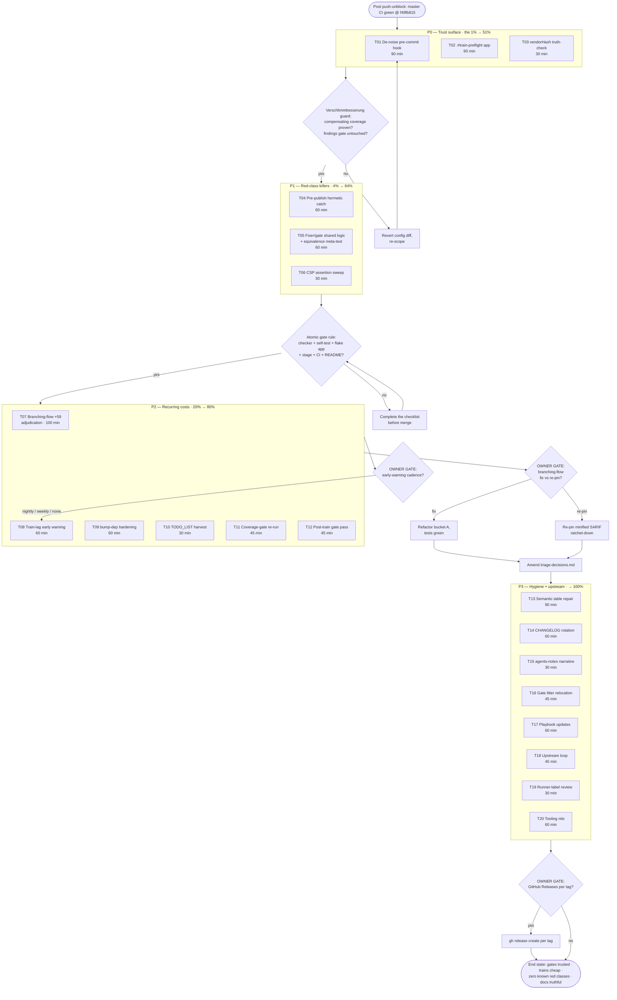

# SUPERB Pareto Plan: Train Trust & Cadence — Post-Push-Unblock Round

> **Created:** 2026-10-08 20:00 CEST · **Session evidence:** `docs/status/2026-10-08_19-55_push-unblock-train-alignment-ci-green_status.md`
> **State at planning time:** master CI success @ `f49fb815` (run 37818614080); train lag 0/0/0 at 842 requires; root v4.13.3 published; 5 concurrent Crush sessions active on this tree.
> **Task universe:** the 50 next-tasks from the status report §f + partials §b (B1–B4) + not-started §c, reconciled against live `TODO_LIST.md` rows (P1 3-module patch train, coverage battery row, GCL upstream row — referenced, never duplicated).

**Directive:** Verschlimmbesserung is forbidden. Every task below either restores trust in an existing gate, closes a proven red class at root cause, or documents tribal knowledge — none weaken a gate. Guards: §Risk.

---

## 1. Pareto Breakdown

### The 1% that delivers 51% of the result

The repo's "result" is: **gates you can trust + trains that don't cost an afternoon.**
This session proved both are currently taxed:

- The pre-commit hook failed **every one of 13 sweep commits** on the documented samber-linter/test-compile noise class → 13 `--no-verify` bypasses → the gate is becoming theater (T01).
- Two pre-existing CI reds and one hermetic-only test red were all discovered **mid-verification instead of pre-flight** → hours of forensics (T02).

| Task | Why it is the 1% |
| ---- | ---------------- |
| **T01 De-noise the pre-commit hook** | Restores gate trust for every commit in every session, fleet-wide. The single highest friction-per-day item. |
| **T02 One-command train preflight (`.#train-preflight`)** | Catches ALL surprise reds (row gate, branching-flow, hermetic test gaps) BEFORE the first mutation. Would have saved this session's entire forensics detour. |

### The 4% that delivers 64% of the result

1% plus the three proven red classes that regenerate:

| Task | Why |
| ---- | --- |
| **T04 Pre-publish hermetic consumer-test catch** (gotcha-30 mechanical) | The root-tag-gap class has now fired twice (symbols 2026-10-07, behavior 2026-10-08). A `GOWORK=off go test` over changed modules before `verify-tag --push` kills it permanently. |
| **T05 Fixer/gate shared table logic + equivalence meta-test** | Second split-brain incident (status-row pair; cqrs-lint anchor drift before). Shared module + adversarial equivalence test makes the next drift a test failure, not a mystery. |
| **T06 CSP/golden assertion sweep** | Confirms no other test assumes the pre-`img-src` CSP shape — closes the v4.13.3 loop completely. |
| **T03 vendorHash truth-check** | The checker flagged staleness after massive go.sum churn; gotcha 31 says only a real build is truth. Open loop since 18:17. |

### The 20% that delivers 80% of the result

4% plus the recurring-cost items:

| Task | Why |
| ---- | --- |
| **T07 Branching-flow +59 adjudication** | The only remaining local red; blocks nothing but poisons every future `check-modules` run with a known-noise failure. Owner decision gate inside. |
| **T08 Train-lag early warning** | 33 findings re-accumulated within ~24h of the last alignment. Early warning flattens the reactive-afternoon cycle. |
| **T09 bump-dep hardening** (rc-checked `--commit`, `--message`, auto tag-cache refresh, daemon-amend hint) | The daemon-vs-me race happened 3× this session; each cost an amend. |
| **T10 TODO_LIST harvest** of plan + report | Repo doctrine: TODO_LIST is the living source; reports/plans are snapshots. |
| **T11 Coverage-gate re-run** | Owed since the 2026-10-04/06 waves (already tracked in TODO_LIST battery row). |
| **T12 Explicit post-train gate pass** (cqrs-lint walks, erraudit inventory, go.work.sum) | One command each; closes "covered by check-modules, probably" gaps with evidence. |

### The remaining 80% → 100%

| Task | Why |
| ---- | --- |
| **T13 Semantic repair of 7 shifted archived tables + SUPERB 13-row audit** | Mechanical whole-row strikes restored gate-consistency but not cell semantics; annotation integrity is a repo value. |
| **T14 CHANGELOG rotation + Releases decision** | `[Unreleased]` accretes shipped content (v4.13.0–.3); stale release notes compound. |
| **T15 agents-notes narrative** | Dated histories live there; this episode has three transferable war stories. |
| **T16 Gate litter relocation** | `.go.work.check-workspace-build` got daemon-captured once already; root cause unfixed. |
| **T17 Release playbook updates** | Post-push `gh run watch`, daemon-amend note, prefix-sweep merging, receipt style — all tribal knowledge used this session. |
| **T18 Upstream loop** (go-cqrs-lite burst ask, signing v4.4.0 tag-level content check, GCL row sync) | Gotcha-24's "wave tags can lie" is unverified for the v4.4.0 riding this train. |
| **T19 CI runner-label review** | ubuntu-latest migrates to 26 on Oct 19, 2026 — 11 days out. |
| **T20 Small tooling nits bundle** | Mixed-tables file naming, candidate-count printing, output polish. |

---

## 2. Comprehensive Plan (30–100 min tasks, ALL TODOs, priority-sorted)

| # | Task | Min | Tier | Covers (report §) | Impact | Effort | Customer value | Output / verification |
| - | ---- | --- | ---- | ----------------- | ------ | ------ | -------------- | --------------------- |
| T01 | De-noise pre-commit hook: scope samber-linter + test-compile out of pre-commit mode (keep in dev/full + CI), make the 60s budget honest | 90 | 1% | f#7, f#13, f#14, f#15, f#16, f#17, B4 | HIGH | M | Every commit gate-trusted; no more reflex `--no-verify` | Hook green on a plain commit; compensating coverage proven in dev/full mode; AGENTS gotcha 8 + noise runbooks updated |
| T02 | `.#train-preflight` app: wait-tree-quiet → preflight-tree-check → lint → `.#test` → strict release-train, one rc, candidate-count guards | 90 | 1% | f#43, D3-lesson | HIGH | M | Surprise reds die at preflight, not mid-train | App + fixture self-test + check-modules/CI wiring; playbook § "run before first mutation" |
| T03 | vendorHash truth-check: real derivation build → `got:` hash or recorded misattribution | 30 | 4% | B3, f#34 | MED | L | No lurking `nix build` breakage | AGENTS gotcha 31/32 note; hash edited ONLY off a real `got:` |
| T04 | Pre-publish hermetic catch: `check-train-consumers-hermetic.sh` (GOWORK=off build+test over go.mod-changed modules), wired into release checklist before `verify-tag --push` | 60 | 4% | f#6, gotcha-30 | HIGH | M | The v4.13.3-class incident becomes mechanically impossible to miss | Script + self-test + advisory stage; retro-run proves it catches this session's CSP gap |
| T05 | Fixer/gate drift kill: extract `scripts/lib/status_table.py`, both tools import it, equivalence meta-test with adversarial fixtures, shifted-cells fixture pinned | 60 | 4% | f#3, f#4, f#5, A4-root-cause | HIGH | M | Next checker/fixer drift is a test failure, not a CI mystery | Both CLIs byte-identical behavior; meta-test in check-modules + CI (atomic gate rule) |
| T06 | CSP/golden assertion sweep across workspace `_test.go` | 30 | 4% | f#7 (split) | MED | L | v4.13.3 loop fully closed | Sweep verdict committed; stragglers fixed |
| T07 | Branching-flow +59 adjudication: bucketize (trivial fix vs deliberate guard), OWNER GATE fix-vs-repin, execute, amend `triage-decisions.md` | 100 | 20% | B2, f#1, f#2 | MED | H | `check-modules` locally green end-to-end | Gate rc=0 local; ledger amended; CI self-skip unchanged |
| T08 | Train-lag early warning: advisory report script + scheduled CI (or flake app) posting a lag table | 60 | 20% | f#5(§f50-adjacent), f#21 | MED | M | Alignments shrink from afternoon to minutes | OWNER GATE: cadence (nightly default); offline self-test |
| T09 | bump-dep hardening: rc-checked `--commit`, `--message` template, post-tag auto `--refresh-cache`, daemon-amend hint in output | 60 | 20% | f#10, f#11, f#41, gotcha-27 | MED | M | Sweep commits land first try, readable, no amend dance | `.#test-bump-dep` extensions green |
| T10 | TODO_LIST harvest of this plan + status report open items; reconcile with existing rows | 30 | 20% | §c, f-all | MED | L | Living doc reflects reality; plan stays a snapshot | Only `[ ]`/`[~]` rows; no duplicate of P1-patch-train/coverage/GCL rows |
| T11 | Coverage-gate re-run post-train + chase deltas | 45 | 20% | f#37, TODO battery row | MED | M | 15/15 coverage gates re-measured on current train | Gate rc=0 or threshold verdicts recorded |
| T12 | Explicit post-train gate pass: `check-cqrs-lint` (module + root walks), `erraudit-inventory --gate`, go.work.sum audit | 45 | 20% | f#35, f#36, gotchas 28/29 | MED | L | Dependency churn proven lint/error-family clean with evidence | Three rc=0 receipts committed |
| T13 | Semantic repair of 7 shifted archived tables + SUPERB 13-row spot-audit vs code | 90 | 100% | B1, f#30, f#31 | LOW | H | Annotation integrity restored, not just gate-consistency | Row gate + annotation gate green after each table |
| T14 | CHANGELOG rotation (v4.13.0–.3 sections) + GitHub-Releases decision gate | 60 | 100% | f#26, f#27, f#45 | MED | M | pkg.go.dev-era notes stop accreting stale content | Docs-freshness + link gates green; decision recorded |
| T15 | agents-notes narrative: the double-red morning, the hermeticity hunt, the v4.13.3 publish | 30 | 100% | f#32-adjacent | LOW | L | War stories transferable to future sessions | Cross-linked from gotcha 30 + status report |
| T16 | Gate litter relocation: workspace-build temp out of repo root; repo-wide litter audit | 45 | 100% | D5, f#18, f#19 | LOW | L | pma can never re-capture gate temp files | Self-test: two gate runs leave zero root litter |
| T17 | Release playbook updates: post-push `gh run watch`, daemon-absorb amend note, prefix-sweep merging, one-class-per-receipt | 60 | 100% | f#17(§f44), f#23, f#44, f#45 | LOW | L | Next train runs on written process, not memory | Playbook diff committed |
| T18 | Upstream loop: go-cqrs-lite burst ask; signing v4.4.0 tag-level WithEncoding verification; GCL row sync | 45 | 100% | f#22, f#24, f#41(alt) | MED | M | Gotcha-24 risk class verified closed for the riding train | Upstream issue/comment per verify-before-filing; local receipts |
| T19 | CI runner-label review pre-Oct-19 ubuntu-26 migration + action pin check | 30 | 100% | f#48 | MED | L | No surprise CI infra red in 11 days | Pins verified or bumped; actionlint green |
| T20 | Tooling nits bundle: mixed-tables file naming, candidate counts, output polish | 60 | 100% | f#40, f#42, f#43 | LOW | L | Gate output reads signal-only | Self-tests updated; no behavior change to verdicts |

Total: 20 tasks ≈ 17.5 h. No TODO from the report is unowned (watch items 46–50 reviewed, none scheduled — deliberate).

---

## 3. Micro-Breakdown (each ≤ 12 min, ALL TODOs, priority-sorted)

> Folded per-step commits are marked ⊕. Verification column = the observable that proves the step.

### P0 — Trust surface (the 1%)

| ID | Task (≤12 min) | Verifies | Src |
| -- | -------------- | -------- | --- |
| 1.1 | Read buildflow `references/commands.md`: build-mode applicability, skip_steps, tool_options surfaces | Can name the exact mechanism for mode-scoping a step | f#13 |
| 1.2 | Reproduce noise shape: `buildflow --build-mode pre-commit -s samber-linter` and `-s test-compile`, capture exact errors + timings | Evidence for the config rationale | f#13, f#14 |
| 1.3 | Draft `.buildflow.yml` diff: mode-scope the two steps + budget 150s, rationale comments in config | Diff reviews clean; no findings-gate change | f#15 |
| 1.4 | Apply; run pre-commit mode on a scratch staged change | Hook green WITHOUT `--no-verify`; budget honest | B4 |
| 1.5 | Prove compensating coverage: `buildflow --build-mode dev --dry-run -v` still runs both steps; CI lint jobs cover the linter | No gate weakened | f#16 |
| 1.6 ⊕ | Update AGENTS gotcha 8 + `docs/runbooks/buildflow-noise-policy.md`; commit with before/after evidence | Docs match config | f#17 |
| 2.1 | Draft `scripts/checks/train-preflight.sh`: quiet-tree → preflight → lint → test → strict-train, aggregate rc | Runs green on current tree | f#43, D3 |
| 2.2 | Add candidate-count/no-silent-zero guards (gotcha 2 class) | Zero-iteration runs fail loudly | gotcha 2 |
| 2.3 | Flake app `.#train-preflight` (GOTOOLCHAIN=local pattern) | `nix run .#train-preflight` rc=0 | f#43 |
| 2.4 | Offline fixture self-test `.#test-train-preflight` (stub mode) | Self-test green; wired check-modules + CI advisory | gotcha 19 |
| 2.5 ⊕ | Playbook § "run train-preflight before first mutation AND before push"; commit | Documented + wired | D3 |
| 3.1 | `nix build` the flagged derivation; capture real `got:` sha | Build outcome recorded (pass or real mismatch) | B3 |
| 3.2 ⊕ | If mismatch: update `vendorHash.nix` (gotcha 32) + `git add` immediately; if match: record gotcha-31 misattribution verdict; commit | Hash edited only off `got:`; AGENTS noted | f#34 |
| 3.3 | Quick sanity: `nix flake check` (flake-level regression from go.sum churn) | rc=0 | f#38 |

### P1 — Red-class killers (the 4%)

| ID | Task (≤12 min) | Verifies | Src |
| -- | -------------- | -------- | --- |
| 4.1 | Draft `scripts/checks/check-train-consumers-hermetic.sh`: go.mod-diff vs origin → `GOWORK=off go build ./... && go test ./...` per changed module | Runs on current (clean) tree: 0 changed modules → explicit pass | gotcha 30 |
| 4.2 | Fixture self-test: synthetic dirty-go.mod case fails, clean case passes | Self-test green offline | gotcha 19 |
| 4.3 ⊕ | Flake app + check-modules advisory stage + release-checklist step "run BEFORE verify-tag --push"; commit | Wired atomically | f#6 |
| 4.4 | Retro-run against this session's train (replay go.mod diff at pre-v4.13.3 state in a worktree) | It WOULD have flagged setup before the tag — proof recorded | gotcha 30 |
| 5.1 | Extract `scripts/lib/status_table.py` (is_separator, classify_row, table_blocks, outside_code_spans) | Module imports cleanly in both tools | f#3 |
| 5.2 | Refactor checker + fixer to import; CLIs byte-identical on the 467-file corpus | Diff-free gate outputs | f#3 |
| 5.3 | Equivalence meta-test: adversarial fixtures (2-dash separator, bare `~~` cell, code-span `~~`, shifted cells) through BOTH tools, assert identical verdicts | Meta-test green | f#5 |
| 5.4 ⊕ | Wire meta-test into check-modules + CI (checker + fixture self-test + flake app + stage + CI + README — atomic); commit | No orphan wiring | gotcha 19 |
| 6.1 | `rg 'Content-Security-Policy' --type go -g '*_test.go'` sweep; verdict per hit | Every assertion tolerates or asserts img-src | T06 |
| 6.2 ⊕ | Fix stragglers if any; commit sweep verdict | Green | f#7 |

### P2 — Recurring-cost killers (the 20%)

| ID | Task (≤12 min) | Verifies | Src |
| -- | -------------- | -------- | --- |
| 7.1 | `check-branching-flow --include-suppressed` scoped to the 4 hardening files; dump findings list | 59 findings bucketed on disk | B2 |
| 7.2 | Bucket A triage: trivially fixable (nested conditionals → early returns) | Bucket list with file:line | f#1 |
| 7.3 | Bucket B triage: deliberate security guards → accept entries drafted | Draft ledger entries | f#2 |
| 7.4 | ⏸ OWNER GATE: fix vs re-pin (report question 1). Default while waiting: prepare both | Decision recorded in ledger | — |
| 7.5 | Execute A-bucket refactors; `.#test` stays green per module | Tests green | f#1 |
| 7.6 | If repin: re-pin baseline (minified SARIF, ratchet-down flow, `git add` immediately) | Gate rc=0 | gotcha 26 |
| 7.7 ⊕ | Amend `docs/analysis/triage-decisions.md`; commit | Ledger matches baseline delta | f#2 |
| 8.1 | Draft `scripts/checks/train-lag-report.sh`: `check-release-train --advisory` + bump-dep dry-run candidate list | Prints lag table + fix recipe | f#21 |
| 8.2 | Scheduled workflow (cron) or flake app; minimal GITHUB_TOKEN; step-summary output | Runs on schedule | T08 |
| 8.3 | Offline fixture self-test (stubbed gate output) | Self-test green | gotcha 19 |
| 8.4 ⊕ | ⏸ OWNER GATE: cadence (report question 3; default nightly-advisory); wire + commit | Cadence recorded | T08 |
| 9.1 | bump-dep: rc-check `--commit` path, honest "commit did not land" output | Simulated failure prints honestly | f#10 |
| 9.2 | bump-dep: `--message` template + family-named default message | Sweep commits readable | f#11 |
| 9.3 | bump-dep: auto `check-release-train --refresh-cache` after a verify-tag push in-invocation | Fresh-tag commit no longer fails (gotcha 27) | f#41 |
| 9.4 ⊕ | Output hint: "if daemon raced, amend, don't re-commit"; extend `.#test-bump-dep`; commit | Self-tests green | gotcha 27 |
| 10.1 | Harvest plan T01–T20 + report open items into TODO_LIST `[ ]` rows | Rows exist, IDs reference plan | §c |
| 10.2 | Reconcile: no duplicates of P1 patch-train / coverage-battery / GCL rows; cross-link instead | Diff review clean | f#10 |
| 10.3 ⊕ | Header Was:-chain update (docs-freshness safe); commit | Freshness gate green | gotcha 20 |
| 11.1 | `nix run .#coverage-gate`; capture per-module results | rc + deltas recorded | f#37 |
| 11.2 | Triage any red: threshold artifact vs real drop | Verdict per red | f#37 |
| 11.3 ⊕ | Record in TODO battery row; commit receipts | Row updated | f#37 |
| 12.1 | `nix run .#check-cqrs-lint` + explicit root walk (`cqrs-lint . --strict`) | Both walks green (gotcha 28/29 duality) | f#35 |
| 12.2 | `nix run .#erraudit-inventory --gate` | TOTAL=0 | f#36 |
| 12.3 ⊕ | go.work.sum untracked check + status audit; commit receipts | Three rc=0 receipts | f#36 |

### P3 — Hygiene, docs, upstream (→100%)

| ID | Task (≤12 min) | Verifies | Src |
| -- | -------------- | -------- | --- |
| 13.1 | Reconstruct intended cell alignment for the 7 shifted tables from original report prose | Reconstruction notes per table | B1 |
| 13.2 | Repair tables 1–2; row gate + annotation gate green after each | Gates green | f#30 |
| 13.3 | Repair tables 3–5 | Gates green | f#30 |
| 13.4 | Repair tables 6–7 | Gates green | f#30 |
| 13.5 | SUPERB 13-row spot-audit vs current code; annotate discrepancies inline (`~~…~~ done (evidence)` only where verified) | Every strike either verified or unstruck | f#31 |
| 13.6 ⊕ | Commit per-table batches | Additive-only annotation diff | gotcha 19 |
| 14.1 | Draft v4.13.0–v4.13.3 sections from `[Unreleased]` content | Sections accurate per tag receipts | f#26 |
| 14.2 | Move entries; `[Unreleased]` keeps genuinely-unshipped only | No content lost in move | f#26 |
| 14.3 | ⏸ OWNER GATE: GitHub Releases per tag? (report-adjacent policy) | Decision recorded | f#27 |
| 14.4 ⊕ | If yes: `gh release create` for existing tags with section text; docs-freshness + lychee green; commit | Gates green | f#27 |
| 15.1 | Write agents-notes narrative (double-red morning → hermeticity hunt → v4.13.3) | Narrative cross-links evidence | f#32a |
| 15.2 ⊕ | Cross-link from gotcha 30 + status report; commit | Links resolve (lychee) | f#32a |
| 16.1 | Litter audit: `git ls-files \| grep -iE 'tmp\|workspace-build\|fsprobe'` + review | Litter inventory | f#19 |
| 16.2 | Relocate workspace-build temp to mktemp/`${GIT_DIR}`; update check-modules stage | Stage green with new path | D5 |
| 16.3 ⊕ | Self-test: run stage twice; assert zero root litter before/after; commit | No litter, twice | f#18 |
| 17.1 | Playbook: post-push `gh run watch <id> --exit-status` step | Documented with this run's id as example | f#44 |
| 17.2 | Playbook: mid-train daemon-absorb → amend, don't re-commit | Matches gotcha 27 wording | f#17a |
| 17.3 | Playbook: same-version prefix-sweep merging recipe (samber-do-demo 10→1 example) | Recipe present | f#23 |
| 17.4 ⊕ | Playbook: receipt style (one change-class per entry); commit | Style note present | f#45 |
| 18.1 | Draft upstream ask (github-voice, verify-before-filing): version burst + wave content assertions | Ask verified against source before filing | f#22 |
| 18.2 | signing v4.4.0 tag-level source check: CloneEvent carries WithEncoding at the tag | Verdict recorded (green expected — integration_test passes hermetically) | f#24 |
| 18.3 ⊕ | Sync GCL lint-findings row cross-ref in TODO; commit local receipts | Row cross-linked | f#41a |
| 19.1 | Review pinned actions vs ubuntu-26 migration (Oct 19) + latest-release comment truth (API, not tool) | Pin verdicts recorded | f#48 |
| 19.2 ⊕ | Bump if needed on a branch; actionlint + CI dry signal; commit/land | actionlint green | f#48 |
| 20.1 | row-gate: report mixed-table FILE names, not just count | Output names files | f#40 |
| 20.2 | Checker/bump-dep output polish: candidate counts + next-step hints | Output shows counts | f#42 |
| 20.3 ⊕ | Update fixture self-tests for new output; commit | Self-tests green; verdicts unchanged | f#40 |

Total: 78 micro-tasks, each ≤12 min, covering all 20 comprehensive tasks and all 50 report items (watch items 46–50 intentionally unscheduled — review at next train).

---

## 4. Execution Graph

Reading order: P0 strictly first (trust surface), then P1 (kills the two proven regenerating red classes), P2 unblocks on two owner gates, P3 fills to 100%. Owner gates: branching-flow fix-vs-repin (report question 1), early-warning cadence (question 3), GitHub-Releases policy (new, from T14). Question 2 (patch-vs-minor for security headers) is T14/T17 documentation input, not a blocker.

---

## 5. Risk & Verschlimmbesserung Guards

| Guard | Rule | Applies to |
| ----- | ---- | ---------- |
| No gate weakening | Steps scoped OUT of pre-commit must be proven still-running in dev/full modes AND CI before the config lands; the findings gate (`fail_on: critical`) is untouched | T01 |
| Atomic gates | New gates ship checker + fixture self-test + flake app + check-modules stage + CI step + README — anything less is dead code (gotcha 19) | T02, T04, T05, T08 |
| Hashes only from real builds | Never edit `vendorHash.nix` off the checker's finding (gotcha 31); extracted files, `git add` immediately (gotcha 32) | T03 |
| No blind baseline moves | branching-flow re-pins require `triage-decisions.md` amendment; the SARIF stays minified (gotcha 26) | T07 |
| Annotations are additive | Strike only what is verified with evidence; the 40 mechanical strikes get a human audit (gotcha 19) | T13 |
| Foreign work is untouchable | Concurrent sessions own their diffs; reconcile by waiting + cross-linking, never reverting (gotcha 4) | all |
| TODO_LIST discipline | Only `[ ]`/`[~]` rows; completed → CHANGELOG; receipts only for consumer-visible changes (gotcha 20) | T10, T14 |
| Formatter/tooling via flake apps | `nix fmt -- <paths>`, never bare treefmt; gates via `nix run .#…` (gotchas 10, 1) | all |
| Resolution-mode awareness | Every "passes locally" claim states workspace vs `GOWORK=off` (gotchas 2, 30) | T04, T06, T12 |

---

## 6. Effort & Value Summary

| Tier | Tasks | Hours | Result share | Cumulative |
| ---- | ----- | ----- | ------------ | ---------- |
| 1% (P0) | T01–T03 | ~3.5 h | 51% | 51% |
| 4% (P0+P1) | T01–T06 | ~6 h | 64% | 64% |
| 20% (P0–P2) | T01–T12 | ~12.5 h | 80% | 80% |
| 100% (all) | T01–T20 | ~17.5 h | 100% | 100% |

*Point-in-time plan. When executed, annotate in place per docs-health ANNOTATE mode; harvest open tails into `TODO_LIST.md` (T10 does this first by design).*
