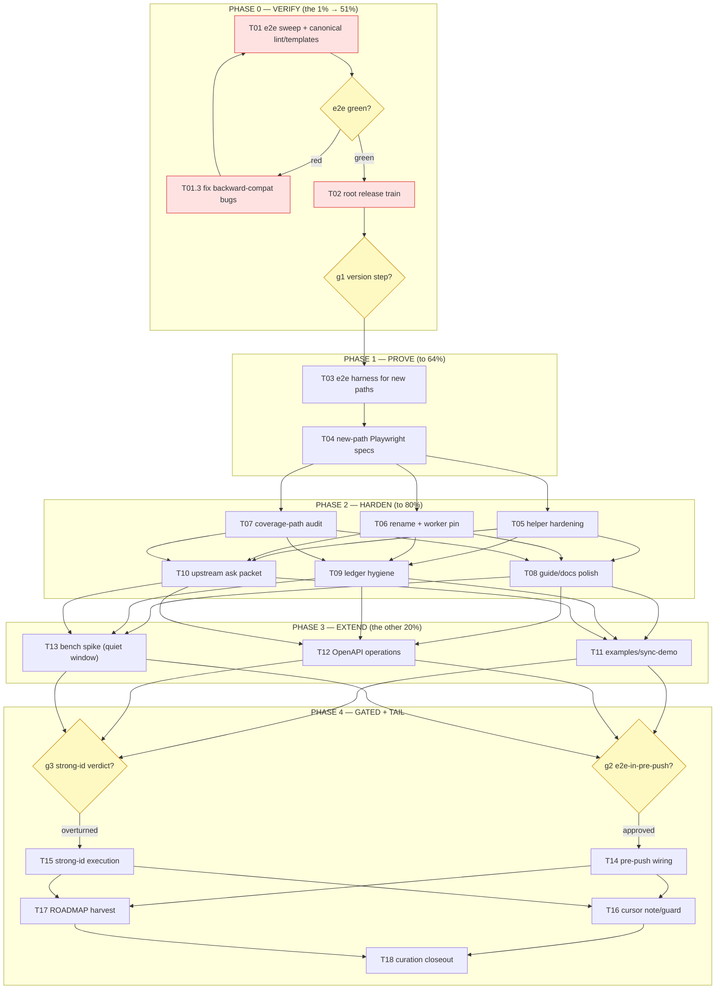

# SUPERB — Frontend Sync Protocol Follow-Through (Pareto Plan)

**Date:** 2026-10-09 14:49 CEST
**Input:** `docs/status/2026-10-09_05-17_frontend-sync-protocol-completion-and-self-review.md` (f1–f32 + b/c/e leftovers) + `TODO_LIST.md` § P2 "Frontend Sync Protocol (ADR-0056) follow-through".
**Goal:** Turn ADR-0056 from *merged, unit-green, gate-green* into **browser-verified, released, hardened, demo-able** — without verschlimmbesserung.
**Standing decisions already made** (recorded in TODO_LIST): train bundling = release-time; `backendId` explicit-only; queue-on-reset keeps commands.
**Owner gates still open:** g1 version step (patch vs minor — lean: minor), g2 e2e-in-pre-push (policy), g3 strong-id boundary verdict (default: keep adjudication).

---

## 1. Pareto Ladder

### The 1% that delivers 51%

**Run `nix run .#e2e` + cut the root release train.** One verification command plus one release ritual. If e2e is green, the protocol is PUBLISHED and browser-verified in under two hours; every other item compounds on a shipped artifact. If e2e is RED, it instantly becomes the highest-value fix list (backward-compat of the v1.5.0 client is currently an untested code-reading claim — the single largest risk in the whole arc).

### The 4% that delivers 64% (adds to the 51%)

**New-path Playwright specs** (harness + specs): batch push on reconnect, offline reads via `cqrsSync.getEvents()`, `sync:reset`, DB v1→v2 migration. This converts every v1.5.0 claim from "asserted by code reading" to "proven by browser truth."

### The 20% that delivers 80% (adds to the 64%)

**Hardening + polish batch:** kill the `env.serve` bug class at the helper, rename the lying `writeSyncPullError`, pin queue-keep-on-reset with a worker test, audit the two uncovered error paths, guide notes (batch cost/timeout, idempotency recipe, CSP nonce), TODO header bump, ledger commit-message amend, upstream ask packet for the `WithEncoding` trap.

### The other 20% (to reach 100%)

**Extensions + gated/curation tail:** `examples/sync-demo`, OpenAPI operations, bench spike, pre-push e2e wiring (g2-gated), strong-id verdict execution (g3-gated), client cursor monotonicity note, ROADMAP harvest (projection engine, ServiceWorker, store-level filtered reads, setup auto-derive), ADR/research curation checks, JS-constant mirror decision.

---

## 2. Level-1 Plan — tasks of 30–100 min (18 tasks, ALL todos, sorted by importance/impact/effort/customer-value)

| # | Task | Why now | Imp | Eff | Cust | Min | Guards (no verschlimmbessern) |
|---|------|---------|-----|-----|------|-----|-------------------------------|
| T01 | **e2e verification sweep** — run `nix run .#e2e` against the v1.5.0 client; triage/fix any red (backward-compat bugs); plus canonical closure `nix run .#lint` + `nix run .#check-templates` | Largest open risk; everything compounds on it | 🔴 | S | 🔴 | 30–60 | Fixes go through scoped tests + full battery; no client behavior change without a spec proving it |
| T02 | **Root release train** — version decision (g1, lean minor), CHANGELOG check, `verify-tag.sh <dir> <ver> --push`, post-push `--refresh-cache`, consumer-alignment check | Delivery act; makes 5 sessions of work consumable | 🔴 | M | 🔴 | 45–90 | Gotcha 5/27: tag only at committed tree; refresh tag cache after ANY cross-repo release before dependent pushes |
| T03 | **e2e harness for new paths** — `e2e/server` gains journal + `/sync/pull` + `/sync/push`, page attributes (`data-sync-command-type`, pull/push URLs) | Prerequisite for T04 | 🟠 | M | 🟠 | 60–100 | Server wiring mirrors the guide exactly (the demo IS the doc); no new library API |
| T04 | **New-path Playwright specs** — offline queue → batch push → conflict surfaced → catch-up pull → offline reads; `sync:reset`; DB v1→v2 migration | Converts v1.5.0 claims to browser truth | 🟠 | M | 🟠 | 60–100 | Playwright cache on /mnt fallback (gotcha 12); specs assert visible state, not internals |
| T05 | **Test-helper hardening** — `env.serve`-class helpers take map headers (or panic on odd variadic count); regression comment naming bug #3 | Kills the d25 bug class at the source | 🟠 | S | ⚪ | 30–45 | Helper change proven by the existing suite staying green; no production code touched |
| T06 | **Naming + worker pins** — `writeSyncPullError` → `writeSyncError` (all call sites); worker unit test pinning queue-keep-on-reset | Published-surface honesty + decision pin | 🟠 | S | 🟡 | 30–45 | Rename rides the next train (published module); worker test is additive |
| T07 | **Coverage-path audit** — pull encode-failure 500 + push no-dispatcher 503: verify or add tests | Cheap trust in the error contract | 🟡 | S | ⚪ | 30 | Additive tests only; no source changes unless a real gap fires |
| T08 | **Guide + docs polish batch** — batch-cost/timeout note, idempotency-middleware recipe, CSP nonce note for `SyncClientScriptTag`, TODO_LIST "Updated:" bump, ADR-0056 INDEX + research-README curation verify | Consumer-facing trust; closes e21/e36 + 31 | 🟡 | S | 🟡 | 45–60 | Docs-only; every claim verified against source before writing (UserFromContext lesson) |
| T09 | **Ledger + daemon-commit hygiene** — amend the daemon commit carrying the baseline re-pin with a descriptive message; resolve the ledger's "this commit" placeholders | Audit trail integrity | 🟡 | S | ⚪ | 15–30 | Amend message only, never content (gotcha 4); verify with `git log --oneline` |
| T10 | **Upstream ask packet** — `WithEncoding`-vs-codec disagreement (or `PayloadIsJSON()`): source-level repro, verify-before-filing gates, draft issue + TODO row + gotcha-24 amendment | Third victim surface; protects all future consumers | 🟡 | M | 🟡 | 60–90 | verify-before-filing skill gates BEFORE any filing; no upstream file without repro |
| T11 | **`examples/sync-demo`** — runnable pull+push+filter+indicator demo, README, build+lint green | The guide, executable; sales surface | 🟠 | L | 🔴 | 90–100 | Follow `examples/*` conventions; no new deps; scoped verification |
| T12 | **OpenAPI operations** — `WithOpenAPI` entries for `/sync/pull` + `/sync/push` + guide snippet + tests | Machine-readable contract | 🟡 | M | 🟡 | 45–60 | Builder exists; additive metadata only, no runtime effect |
| T13 | **Bench spike** — pull at 500/1000-event pages, push at 100-envelope batches; machine-pinned | Performance honesty before consumers scale | ⚪ | M | ⚪ | 60–100 | Quiet window ONLY; `--save-baseline` same-change rule; never re-pin under load (AGENTS Bench row) |
| T14 | **Pre-push e2e wiring** — implement hook step for sync-asset version bumps IF g2 approved; else document the policy decision | Prevents the f17-class gap recurring | 🟡 | M | ⚪ | 30–60 | Gated on owner verdict; hook changes run the install-git-hooks self-test |
| T15 | **Strong-id verdict execution** — g3 overturned: brand `BackendID` option surface + `commandID` params, baseline ratchets DOWN; accepted: record final | Type-safety taste call, owner's | ⚪ | M | ⚪ | 30–60 | Any baseline change: ledger amendment + same-commit re-pin (gotcha 26) |
| T16 | **Cursor monotonicity note/guard** — document client trust model or add minimal rewind guard + test | Robustness footnote from e23 | ⚪ | S | ⚪ | 30 | Doc note default; guard only if trivially testable |
| T17 | **ROADMAP harvest** — projection engine, ServiceWorker HTML, store-level filtered reads, setup auto-derive backendId → ROADMAP.md with rationale links | Keeps TODO_LIST honest; ideas get a home | ⚪ | S | ⚪ | 30–45 | ROADMAP "raw ideas" lane; no code |
| T18 | **Curation + JS-mirror closeout** — ADR INDEX row completeness after Amendment 1; research README series link; decide/document whether sync-client.js mirrors `SyncPayloadEncodingOpaque` | Series integrity | ⚪ | S | ⚪ | 15–30 | Read-only checks + one-line docs at most |

**Legend:** Imp=impact 🔴 critical / 🟠 high / 🟡 medium / ⚪ low · Eff=effort S/M/L · Cust=customer value 🔴 consumer-blocking / 🟡 consumer-facing / ⚪ internal · Min=minutes

---

## 3. Level-2 Plan — micro-tasks ≤12 min each (ALL todos, grouped by L1, same sort)

| ID | Micro-task | Min | Done-when |
|----|-----------|-----|-----------|
| **T01** | | | |
| T01.1 | `df -h /mnt/buildcache` + `source scripts/lib/go-cache-env.sh`; run `nix run .#e2e`; capture full log to /tmp | 12 | exit code captured (not through a pipe) |
| T01.2 | If green: record 4/4+ pass; if red: reproduce the failing spec standalone with verbose output | 10 | verdict per spec in writing |
| T01.3 | Triage any red: classify backward-compat bug (client) vs harness drift; write the minimal fix | 12 | fix candidate compiles |
| T01.4 | Re-run the affected spec + full e2e until green | 12 | `nix run .#e2e` rc=0 |
| T01.5 | Run `nix run .#lint` (full canonical) | 12 | rc=0, root line 0 issues |
| T01.6 | Run `nix run .#check-templates` | 5 | rc=0 |
| T01.7 | Commit any fixes at the phase boundary (detailed message) | 5 | clean tree |
| **T02** | | | |
| T02.1 | Owner gate g1: confirm version step (lean: minor) | 2 | decision recorded |
| T02.2 | Verify CHANGELOG `[Unreleased]` entry complete; check module CHANGELOG conventions | 10 | no gaps vs FEATURES/ADR |
| T02.3 | `nix run .#preflight-tree-check` then `verify-tag.sh . v<ver>` dry-run checks | 10 | all checks green |
| T02.4 | `verify-tag.sh . v<ver> --push` (committed tree, no dev-replaces) | 10 | ls-remote shows tag |
| T02.5 | `bash scripts/checks/check-release-train.sh --refresh-cache` after push | 5 | strict gate green |
| T02.6 | Consumer-alignment: grep workspace go.mod requires for root version; sweep if lagging | 10 | `--strict-lag 0` green |
| **T03** | | | |
| T03.1 | Add memory journal + both sync endpoints to `e2e/server/main.go` (mirror guide wiring) | 12 | server builds |
| T03.2 | Extend index HTML: `data-sync-pull-url`/`data-sync-push-url`, `data-sync-command-type` on the form | 8 | page serves |
| T03.3 | Add a conflict-inducing command + seed data for spec scenarios | 12 | deterministic conflict reproducible via curl |
| T03.4 | Smoke: `go run .` + curl pull/push happy + conflict paths | 12 | both wire shapes observed manually |
| T03.5 | Scoped fmt/lint/test on e2e/server | 8 | green |
| **T04** | | | |
| T04.1 | Spec A: offline (context offline) → queue 2 commands → online → ONE batch push request (assert request count) → outcomes applied | 12 | spec green |
| T04.2 | Spec A cont: conflict command shows rejected state; confirmed command's event visible after catch-up pull | 12 | spec green |
| T04.3 | Spec B: offline reads — `window.cqrsSync.getEvents()` returns cached feed with payload while offline | 12 | spec green |
| T04.4 | Spec C: backendId change → `sync:reset` → cache cleared → re-bootstrap pull | 12 | spec green |
| T04.5 | Spec D: DB v1→v2 migration — seed v1 queue, load v1.5.0 worker, queue survives | 12 | spec green |
| T04.6 | Full `nix run .#e2e` + commit at boundary | 10 | rc=0, clean tree |
| **T05** | | | |
| T05.1 | Redesign `env.serve` headers param (map or panic on odd count); update call sites | 12 | compiles |
| T05.2 | Same treatment for `postSyncPush`-class helpers if applicable | 8 | consistent |
| T05.3 | Add regression comment referencing the 05-17 report d25 | 3 | comment in place |
| T05.4 | Full root test + lint | 10 | green |
| **T06** | | | |
| T06.1 | Rename `writeSyncPullError` → `writeSyncError` everywhere | 10 | `rg` finds zero old references |
| T06.2 | Worker unit test: backendId change clears events store, KEEPS command queue | 12 | test green, decision pinned |
| T06.3 | Test + lint + vet scoped | 8 | green |
| **T07** | | | |
| T07.1 | Grep coverage report for the pull encode-failure and push no-dispatcher branches | 10 | numbers known |
| T07.2 | Add the missing test(s) if uncovered | 12 | branches covered |
| T07.3 | Re-run `nix run .#coverage-gate`, read the ROOT line specifically | 8 | root ≥ threshold, cited |
| **T08** | | | |
| T08.1 | Guide: batch-cost/timeout note (100-envelope serial decode; `Config.Timeout` per envelope) | 10 | section added |
| T08.2 | Guide: idempotency-middleware recipe composing with `X-Command-Id` stamping | 12 | snippet compiles conceptually vs docs/guides/leveraging-go-cqrs-lite.md §1 |
| T08.3 | Guide: CSP nonce note for `SyncClientScriptTag` consumers | 8 | note added |
| T08.4 | TODO_LIST: bump "Updated:" header with this session's line | 5 | convention held |
| T08.5 | ADR INDEX 0056 row + research README series link verify/fix | 10 | both accurate |
| **T09** | | | |
| T09.1 | Find the daemon commit carrying baseline+ledger; `git commit --amend` message only | 10 | message describes adjudication |
| T09.2 | Resolve ledger "this commit" placeholders to the real hash | 10 | placeholders gone |
| **T10** | | | |
| T10.1 | Verify-before-filing: confirm `event.New`+`WithEncoding`+map payload reproduces (existing unit test already proves it — cite it) | 10 | source-level evidence |
| T10.2 | Check go-cqrs-lite issues for prior art (no duplicate filing) | 10 | search recorded |
| T10.3 | Draft the issue in Lars's voice (github-voice skill) — proposal: refuse, warn, or `PayloadIsJSON()` | 12 | draft ready |
| T10.4 | TODO row + gotcha-24 amendment note (third victim surface + opaque marker) | 10 | both in place |
| T10.5 | Owner review → file (do NOT file without go-ahead) | 5 | filed or parked |
| **T11** | | | |
| T11.1 | Scaffold `examples/sync-demo` on the `examples/basic` pattern (go.mod, main.go, README stub) | 12 | module builds |
| T11.2 | Wire journal + App command + both sync endpoints + asset handlers | 12 | endpoints respond |
| T11.3 | Page: form with `data-sync-command-type`, indicator, event feed rendering from `cqrsSync.getEvents()` | 12 | page renders |
| T11.4 | README: quickstart + offline steps to try | 10 | readable |
| T11.5 | Build + lint + workspace gates for the new module; add to any hardcoded gate lists per gotcha 11 | 12 | `nix run .#test` green |
| T11.6 | Commit at boundary | 5 | clean tree |
| **T12** | | | |
| T12.1 | Model pull/push wire shapes with the openapi builder; attach via `WithOpenAPI` | 12 | spec JSON renders |
| T12.2 | Unit test the generated document | 10 | test green |
| T12.3 | Guide snippet linking the OpenAPI surface | 8 | doc updated |
| **T13** | | | |
| T13.1 | Write `*_bench_test.go` (b.Loop, ReportAllocs, req/s, log suppression per AGENTS Benchmarks row) | 12 | benches run |
| T13.2 | Quiet-window check (`nix run .#wait-tree-quiet` + load check) then `nix run .#bench-spike` | 12 | gate verdict |
| T13.3 | If baseline changes: `--save-baseline` + commit raw baseline in the SAME change | 10 | rules held |
| **T14** | | | |
| T14.1 | Owner gate g2: verdict on pre-push e2e for sync-asset bumps | 2 | decision recorded |
| T14.2 | If yes: hook step + `install-git-hooks.sh --force` + self-test | 12 | self-test green |
| T14.3 | Document the policy in AGENTS gotcha row | 8 | row updated |
| **T15** | | | |
| T15.1 | Owner gate g3: accept or overturn the 3 non-wire strong-id findings | 2 | decision recorded |
| T15.2 | If overturned: brand `BackendID` + param types; update tests | 12 | compiles |
| T15.3 | Re-pin baseline DOWN + ledger amendment same-commit | 12 | gate +0, count drops |
| T15.4 | If accepted: one-line final note in the ledger row | 3 | closed |
| **T16** | | | |
| T16.1 | Add the cursor-trust note to the guide (rewind = benign idempotent re-put) | 8 | note added |
| T16.2 | Optional: minimal monotonic guard in client if trivially testable — else document why not | 10 | decision recorded |
| **T17** | | | |
| T17.1 | ROADMAP entries: client projection engine, ServiceWorker HTML, store-level filtered reads, setup auto-derive — each with rationale link | 12 | entries in place |
| T17.2 | Remove routed items from TODO_LIST per docs-health ownership rules | 8 | no duplication |
| **T18** | | | |
| T18.1 | Verify ADR INDEX 0056 row + Amendment 1 mention; fix if stale | 8 | accurate |
| T18.2 | Verify research README lists the synthesis as episode 2; fix if missing | 8 | accurate |
| T18.3 | Decide + document the JS `opaque`-constant mirror (today: no client branch — record that) | 6 | note in guide or code comment |

**Totals:** 18 L1 tasks · 74 micro-tasks · ≈13.5 h of planned execution.

---

## 4. Execution Graph

**Critical path:** T01 → T02 → T03 → T04 → T05/T06/T07 → T08–T10 → T11 → … (every edge is a dependency of trust, not strictly of code — Phases 2–4 parallelize safely).

---

## 5. Do-No-Harm Contract (verschlimmbessern ban)

1. No production behavior change without a test that fails first.
2. Baseline/gate artifacts (SARIF, benchmarks, goldens) re-pin ONLY with ledger/raw-file amendment in the SAME commit.
3. Published-module renames (T06) ride the next train; nothing exported is renamed mid-tag.
4. Upstream filings pass verify-before-filing gates + owner go-ahead — no drive-by issues.
5. Commit at phase boundaries; amend daemon messages only (`--amend` on message, never content).
6. Concurrent sessions share this tree: stage only files this plan's tasks touched.

## 6. Harvest Note

New tasks surfaced by this plan that are NOT yet in `TODO_LIST.md`: T05 (helper hardening), T07 (coverage audit), T09 (ledger amend), T16 (cursor note), T18 (curation) — route on next docs-health HARVEST; the TODO_LIST P2 sync section already carries T01–T04, T11, T12 equivalents.
